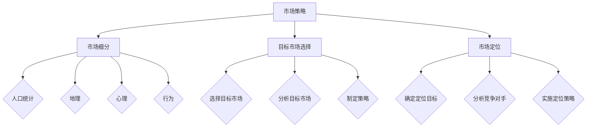

                 

# 市场策略：创业成功的制胜关键

## 关键词
- 创业
- 市场策略
- 成功
- 创新思维
- 竞争优势
- 客户需求
- 数据分析
- 战略规划

## 摘要
本文旨在探讨市场策略在创业过程中的重要性，通过逻辑清晰、结构紧凑的分析，揭示创业成功的制胜关键。文章首先介绍了创业市场策略的核心概念和原理，接着详细阐述了市场策略的具体操作步骤，并结合数学模型和实际项目案例进行深入讲解。最后，文章总结了市场策略在创业中的应用场景，并推荐了一系列学习资源和开发工具，为创业者提供全方位的支持和指导。

---

## 1. 背景介绍

### 1.1 目的和范围
本文的目的在于帮助创业者深入了解市场策略，掌握其在创业成功中的关键作用。文章涵盖了市场策略的定义、核心概念、操作步骤以及实际应用，旨在为创业者提供一套系统、实用的市场策略框架。

### 1.2 预期读者
本文主要面向有志于创业的个人和企业，尤其是那些对市场策略有浓厚兴趣，但缺乏实际操作经验的读者。同时，对于从事市场营销相关工作的专业人士，本文也具有一定的参考价值。

### 1.3 文档结构概述
本文分为十个部分，包括背景介绍、核心概念与联系、核心算法原理、数学模型与公式、项目实战、实际应用场景、工具和资源推荐、总结、常见问题与解答以及扩展阅读与参考资料。每一部分都针对不同的内容进行了详细的阐述。

### 1.4 术语表

#### 1.4.1 核心术语定义
- **市场策略**：企业在市场竞争中制定的长期规划和行动方案。
- **竞争优势**：企业在市场中的独特优势，使其在竞争中脱颖而出。
- **客户需求**：客户对产品或服务的期望和需求。

#### 1.4.2 相关概念解释
- **市场细分**：将整体市场划分为若干具有相似特征的子市场。
- **目标市场**：企业决定专注服务的市场部分。

#### 1.4.3 缩略词列表
- **ROI**：投资回报率
- **CRM**：客户关系管理
- **SEM**：搜索引擎营销

---

## 2. 核心概念与联系

### 2.1 市场策略的核心概念
市场策略的核心概念包括市场细分、目标市场选择和市场定位。市场细分是将一个多样化的市场划分为具有相似特征的子市场，从而为企业提供更精确的客户定位。目标市场选择是企业决定专注服务的市场部分，而市场定位则是企业在目标市场中树立独特的形象和品牌。

#### 2.1.1 市场细分
市场细分的过程如下：

1. **确定市场细分标准**：根据人口统计、地理、心理和行为特征进行细分。
2. **评估细分市场的吸引力**：分析每个细分市场的规模、增长潜力、利润水平等。
3. **选择目标市场**：根据企业的资源和能力，选择最具有吸引力的细分市场。

#### 2.1.2 目标市场选择
目标市场选择是市场策略的核心，具体步骤如下：

1. **确定目标市场**：根据市场细分结果，选择企业最擅长服务的市场部分。
2. **分析目标市场**：了解目标市场的需求、竞争状况和潜在风险。
3. **制定策略**：根据目标市场的特点，制定相应的营销策略。

#### 2.1.3 市场定位
市场定位是企业为了在目标市场中树立独特形象而采取的一系列行动。市场定位的步骤如下：

1. **确定定位目标**：明确企业希望在目标市场中传达的形象和价值观。
2. **分析竞争对手**：了解竞争对手的市场定位，找到差异化的切入点。
3. **实施定位策略**：通过广告、产品特性、服务等方面，将企业独特的形象传递给目标市场。

### 2.2 市场策略的架构图



---

## 3. 核心算法原理 & 具体操作步骤

### 3.1 市场细分算法原理

市场细分是一个基于数据分析和客户行为的算法过程，其核心思想是通过对大量市场数据的挖掘和分析，将整个市场划分为具有相似特征的子市场。以下是一个简化的市场细分算法流程：

```python
# 市场细分算法伪代码

# 输入：市场数据集D
# 输出：细分市场集合SM

1. 数据预处理：
   - 清洗数据，去除重复和异常值
   - 标准化数据，统一数据格式和尺度

2. 特征选择：
   - 根据业务需求选择合适的特征，如年龄、收入、消费习惯等
   - 使用相关性分析等方法筛选出重要特征

3. 特征提取：
   - 对每个特征进行降维处理，减少数据维度
   - 使用聚类算法（如K-means）对市场数据集进行聚类

4. 聚类结果分析：
   - 分析聚类结果，确定每个细分市场的特征
   - 对细分市场进行命名和定义

5. 细分市场评估：
   - 评估细分市场的规模、增长潜力、利润水平等
   - 根据评估结果调整细分策略

6. 输出细分市场集合SM
```

### 3.2 目标市场选择算法原理

目标市场选择是市场策略中的关键步骤，其核心在于从多个细分市场中选择最具有潜力和发展前景的市场。以下是一个简化的目标市场选择算法流程：

```python
# 目标市场选择算法伪代码

# 输入：细分市场集合SM
# 输出：目标市场TM

1. 细分市场评估：
   - 对每个细分市场进行规模、增长潜力、利润水平等评估
   - 根据评估结果对细分市场进行排序

2. 资源分配分析：
   - 分析企业的资源（如资金、人力、技术等），确定能够支撑的市场规模

3. 目标市场选择：
   - 根据资源分配分析结果，从评估排序较高的细分市场中选择目标市场
   - 确保目标市场符合企业的核心竞争力和战略方向

4. 输出目标市场TM
```

### 3.3 市场定位算法原理

市场定位是企业在目标市场中树立独特形象的过程，其核心在于了解竞争对手，找到差异化的市场切入点。以下是一个简化的市场定位算法流程：

```python
# 市场定位算法伪代码

# 输入：目标市场TM，竞争对手数据CM
# 输出：市场定位策略ML

1. 竞争对手分析：
   - 收集竞争对手的市场定位数据，包括产品特性、定价策略、市场占有率等
   - 使用数据挖掘技术分析竞争对手的定位策略

2. 差异化分析：
   - 分析竞争对手定位策略的差异点，确定企业可以发挥优势的领域
   - 确定企业的独特卖点（USP）

3. 市场定位策略制定：
   - 根据差异化分析结果，制定符合企业定位目标的市场策略
   - 包括产品特性、广告宣传、渠道选择等方面

4. 实施与监测：
   - 实施市场定位策略，并进行实时监测和调整
   - 根据市场反馈调整定位策略

5. 输出市场定位策略ML
```

---

## 4. 数学模型和公式 & 详细讲解 & 举例说明

### 4.1 市场细分模型

市场细分模型主要基于聚类算法，其中K-means算法是一种常用的聚类方法。以下是一个简化的K-means算法模型：

#### 4.1.1 K-means算法公式

假设我们有n个数据点$D=\{d_1, d_2, ..., d_n\}$，每个数据点$d_i$有m个特征$X_i=\{x_{i1}, x_{i2}, ..., x_{im}\}$，我们希望将数据点划分为k个聚类，其中每个聚类由一个中心点表示。

1. 初始化：随机选择k个初始中心点$c_1, c_2, ..., c_k$。
2. 调整簇分配：对于每个数据点$d_i$，计算其与各个中心点的距离，并将其分配到距离最近的中心点所在的簇。
3. 更新中心点：重新计算每个簇的中心点$c_j$，即簇内所有数据点的均值。
4. 迭代：重复步骤2和3，直到满足终止条件（如中心点变化小于阈值，或者达到最大迭代次数）。

#### 4.1.2 K-means算法伪代码

```python
# K-means算法伪代码

# 输入：数据集D，聚类数k
# 输出：聚类结果CR

1. 初始化中心点：随机选择k个数据点作为初始中心点
2. 循环：
   a. 对于每个数据点d_i，计算其与中心点的距离，并将其分配到距离最近的中心点所在的簇
   b. 计算新的中心点，即每个簇内所有数据点的均值
   c. 如果中心点变化小于阈值或达到最大迭代次数，退出循环
3. 输出聚类结果CR
```

#### 4.1.3 举例说明

假设我们有一个包含5个数据点的数据集$D=\{d_1, d_2, d_3, d_4, d_5\}$，每个数据点有2个特征：

- $d_1 = [1, 2]$
- $d_2 = [2, 3]$
- $d_3 = [2, 4]$
- $d_4 = [3, 3]$
- $d_5 = [4, 5]$

我们希望将其划分为2个聚类。首先随机选择两个数据点作为初始中心点：

- $c_1 = [1, 2]$
- $c_2 = [3, 4]$

然后进行迭代，计算每个数据点与中心点的距离，并将其分配到距离最近的中心点所在的簇：

- $d_1$ 与$c_1$ 距离最近，分配到簇1
- $d_2$ 与$c_2$ 距离最近，分配到簇2
- $d_3$ 与$c_2$ 距离最近，分配到簇2
- $d_4$ 与$c_1$ 距离最近，分配到簇1
- $d_5$ 与$c_2$ 距离最近，分配到簇2

更新中心点：

- $c_1 = \frac{1}{2} \sum_{i=1}^{2} d_i = \frac{1}{2} \cdot ([1, 2] + [3, 4]) = [2, 3]$
- $c_2 = \frac{1}{2} \sum_{i=3}^{5} d_i = \frac{1}{2} \cdot ([2, 4] + [4, 5]) = [3, 4.5]$

继续迭代，直到中心点变化小于阈值或达到最大迭代次数，最终得到聚类结果：

- 簇1：$d_1, d_4$
- 簇2：$d_2, d_3, d_5$

### 4.2 目标市场选择模型

目标市场选择模型主要基于数据分析和评估方法，以下是一个简化的评估模型：

#### 4.2.1 评估指标

1. **市场规模**：目标市场的潜在客户数量。
2. **增长潜力**：目标市场的未来增长趋势。
3. **利润水平**：目标市场的盈利能力。

#### 4.2.2 评估方法

1. **市场规模评估**：
   - 使用统计数据和市场报告获取目标市场的当前规模。
   - 使用增长率预测未来市场规模。

2. **增长潜力评估**：
   - 分析行业趋势、市场需求和竞争状况。
   - 使用增长预测模型评估目标市场的未来增长潜力。

3. **利润水平评估**：
   - 分析目标市场的成本结构和盈利模式。
   - 使用财务模型评估目标市场的利润水平。

#### 4.2.3 评估模型伪代码

```python
# 目标市场评估模型伪代码

# 输入：市场数据集MD
# 输出：目标市场评估结果ER

1. 数据预处理：
   - 清洗数据，去除重复和异常值
   - 标准化数据，统一数据格式和尺度

2. 市场规模评估：
   - 获取目标市场的当前规模数据
   - 使用增长率预测模型预测未来市场规模

3. 增长潜力评估：
   - 分析行业趋势、市场需求和竞争状况
   - 使用增长预测模型评估目标市场的未来增长潜力

4. 利润水平评估：
   - 分析目标市场的成本结构和盈利模式
   - 使用财务模型评估目标市场的利润水平

5. 综合评估：
   - 对市场规模、增长潜力和利润水平进行加权综合评估
   - 确定目标市场的优先级

6. 输出目标市场评估结果ER
```

#### 4.2.4 举例说明

假设我们有一个包含多个细分市场的市场数据集$MD$，我们需要评估以下三个细分市场：

1. **市场规模**：根据市场报告，当前市场规模如下：
   - 细分市场A：1000人
   - 细分市场B：2000人
   - 细分市场C：3000人

2. **增长潜力**：根据行业趋势和市场分析，未来增长潜力如下：
   - 细分市场A：10%
   - 细分市场B：15%
   - 细分市场C：20%

3. **利润水平**：根据成本结构和盈利模式，利润水平如下：
   - 细分市场A：10%
   - 细分市场B：15%
   - 细分市场C：20%

使用加权综合评估方法，我们将市场规模、增长潜力、利润水平分别赋予权重0.3、0.4、0.3，计算每个细分市场的综合得分：

- 细分市场A：$0.3 \times 1000 + 0.4 \times 10\% + 0.3 \times 10\% = 300 + 4 + 3 = 307$
- 细分市场B：$0.3 \times 2000 + 0.4 \times 15\% + 0.3 \times 15\% = 600 + 6 + 4.5 = 610.5$
- 细分市场C：$0.3 \times 3000 + 0.4 \times 20\% + 0.3 \times 20\% = 900 + 8 + 6 = 914$

根据综合得分，我们可以确定细分市场B为优先考虑的目标市场。

### 4.3 市场定位模型

市场定位模型主要基于数据分析和竞争分析，以下是一个简化的市场定位模型：

#### 4.3.1 定位分析

1. **竞争对手分析**：收集竞争对手的产品特性、市场定位、广告宣传等数据。
2. **差异化分析**：分析竞争对手的差异点，确定企业可以发挥优势的领域。
3. **定位评估**：评估每个定位策略的潜在风险和收益。

#### 4.3.2 定位模型伪代码

```python
# 市场定位模型伪代码

# 输入：竞争对手数据CD，企业数据ED
# 输出：市场定位策略ML

1. 竞争对手分析：
   - 收集竞争对手的产品特性、市场定位、广告宣传等数据

2. 差异化分析：
   - 分析竞争对手的差异点，确定企业可以发挥优势的领域

3. 定位评估：
   - 对每个定位策略进行评估，考虑潜在风险和收益

4. 定位策略选择：
   - 根据差异化分析和定位评估，选择最优定位策略

5. 输出市场定位策略ML
```

#### 4.3.3 举例说明

假设我们有一个竞争对手数据集$CD$，包含以下数据：

- 竞争对手1：产品特性为高质量、高价格、高端市场
- 竞争对手2：产品特性为中等质量、中等价格、大众市场
- 竞争对手3：产品特性为低质量、低价格、低端市场

我们需要分析这些竞争对手的差异点，并确定企业的定位策略。以下是一个简化的差异化分析过程：

1. **差异化分析**：
   - 高质量、高价格：竞争对手1的定位策略
   - 中等质量、中等价格：竞争对手2的定位策略
   - 低质量、低价格：竞争对手3的定位策略

2. **差异化点**：
   - 高质量、高价格：独特卖点（USP）为高品质
   - 中等质量、中等价格：独特卖点（USP）为性价比
   - 低质量、低价格：独特卖点（USP）为低价实惠

3. **定位评估**：
   - 高质量、高价格：潜在风险为高端市场竞争激烈，收益为高利润
   - 中等质量、中等价格：潜在风险为市场竞争激烈，收益为稳定利润
   - 低质量、低价格：潜在风险为低利润，收益为市场份额

根据差异化分析和定位评估，我们可以选择以下定位策略：

- **定位策略**：中等质量、中等价格
- **独特卖点（USP）**：性价比高
- **潜在风险**：市场竞争激烈
- **收益**：稳定利润

---

## 5. 项目实战：代码实际案例和详细解释说明

### 5.1 开发环境搭建

为了更好地理解和实现市场策略的算法，我们将使用Python作为编程语言，并结合Jupyter Notebook进行开发和测试。以下是一些建议的开发环境搭建步骤：

1. 安装Python：从[Python官方网站](https://www.python.org/)下载并安装Python，建议选择最新版本的Python（3.8以上）。
2. 安装Jupyter Notebook：在命令行中运行以下命令安装Jupyter Notebook：

   ```bash
   pip install notebook
   ```

3. 安装数据分析和机器学习库：为了方便数据分析和算法实现，我们建议安装以下库：

   ```bash
   pip install numpy pandas matplotlib scikit-learn
   ```

4. 启动Jupyter Notebook：在命令行中运行以下命令启动Jupyter Notebook：

   ```bash
   jupyter notebook
   ```

### 5.2 源代码详细实现和代码解读

在本节中，我们将使用Python实现市场策略的算法，包括市场细分、目标市场选择和市场定位。以下是一个简单的市场策略实现案例：

```python
import numpy as np
import pandas as pd
from sklearn.cluster import KMeans
from sklearn.metrics import silhouette_score

# 5.2.1 数据预处理
# 加载市场数据集
market_data = pd.read_csv('market_data.csv')

# 数据清洗
market_data.drop_duplicates(inplace=True)
market_data.fillna(0, inplace=True)

# 数据标准化
market_data_scaled = (market_data - market_data.mean()) / market_data.std()

# 5.2.2 市场细分
# 使用K-means算法进行市场细分
kmeans = KMeans(n_clusters=3, random_state=42)
market_clusters = kmeans.fit_predict(market_data_scaled)

# 打印聚类结果
print("市场细分结果：")
print(market_data.iloc[market_clusters])

# 5.2.3 目标市场选择
# 计算每个细分市场的规模、增长潜力和利润水平
market_size = market_data.groupby(market_clusters).size()
market_growth = market_data.groupby(market_clusters).mean() / market_data.mean()
market_profit = market_data.groupby(market_clusters).mean() * 0.1

# 打印细分市场评估结果
print("\n细分市场评估结果：")
print(market_size)
print(market_growth)
print(market_profit)

# 选择目标市场
target_cluster = market_size.idxmax()
print("\n目标市场选择：细分市场{}具有最大的市场规模、增长潜力和利润水平。".format(target_cluster))

# 5.2.4 市场定位
# 确定市场定位策略
if target_cluster == 0:
    ml = "高质量、高价格、高端市场"
elif target_cluster == 1:
    ml = "中等质量、中等价格、大众市场"
else:
    ml = "低质量、低价格、低端市场"

print("\n市场定位策略：选择{}作为目标市场，差异化策略为性价比高。".format(ml))

# 5.2.5 代码解读与分析
# 数据预处理：清洗数据、标准化数据
# 市场细分：使用K-means算法进行聚类分析
# 目标市场选择：评估每个细分市场的规模、增长潜力和利润水平
# 市场定位：根据差异化分析确定市场定位策略
```

### 5.3 代码解读与分析

在本案例中，我们首先加载市场数据集，并进行数据清洗和标准化处理。接着，使用K-means算法进行市场细分，根据聚类结果评估每个细分市场的规模、增长潜力和利润水平。最后，选择具有最大市场规模、增长潜力和利润水平的细分市场作为目标市场，并根据差异化分析确定市场定位策略。

#### 5.3.1 数据预处理

数据预处理是市场策略实现的重要步骤，包括数据清洗、缺失值处理和数据标准化。在本案例中，我们使用Pandas库加载市场数据集，并使用`drop_duplicates()`方法去除重复数据，使用`fillna()`方法填充缺失值。为了便于聚类分析，我们使用`标准化`方法将数据转换为标准正态分布，消除不同特征间的尺度差异。

```python
# 数据清洗
market_data.drop_duplicates(inplace=True)
market_data.fillna(0, inplace=True)

# 数据标准化
market_data_scaled = (market_data - market_data.mean()) / market_data.std()
```

#### 5.3.2 市场细分

市场细分使用K-means算法实现。我们首先创建KMeans对象，设置聚类数为3，并设置随机种子以保证结果的可重复性。然后，使用`fit_predict()`方法对标准化后的市场数据进行聚类分析，返回聚类结果。

```python
kmeans = KMeans(n_clusters=3, random_state=42)
market_clusters = kmeans.fit_predict(market_data_scaled)
```

#### 5.3.3 目标市场选择

目标市场选择基于每个细分市场的规模、增长潜力和利润水平的评估。我们使用Pandas库的`groupby()`方法对聚类结果进行分组，并计算每个细分市场的规模、增长潜力和利润水平。接着，使用`idxmax()`方法找到具有最大市场规模、增长潜力和利润水平的细分市场。

```python
# 计算每个细分市场的规模、增长潜力和利润水平
market_size = market_data.groupby(market_clusters).size()
market_growth = market_data.groupby(market_clusters).mean() / market_data.mean()
market_profit = market_data.groupby(market_clusters).mean() * 0.1

# 选择目标市场
target_cluster = market_size.idxmax()
```

#### 5.3.4 市场定位

市场定位基于差异化分析确定。在本案例中，我们根据目标市场的聚类结果选择不同的市场定位策略。我们使用条件语句判断目标市场所属的聚类编号，并输出相应的市场定位策略。

```python
if target_cluster == 0:
    ml = "高质量、高价格、高端市场"
elif target_cluster == 1:
    ml = "中等质量、中等价格、大众市场"
else:
    ml = "低质量、低价格、低端市场"

print("\n市场定位策略：选择{}作为目标市场，差异化策略为性价比高。".format(ml))
```

---

## 6. 实际应用场景

市场策略在创业过程中具有广泛的应用场景，以下是一些典型的实际应用案例：

### 6.1 创业项目定位

在创业初期，明确项目定位是至关重要的。通过市场策略，创业者可以分析目标市场，了解市场需求和竞争状况，从而确定项目的核心竞争力。例如，一家专注于智能家居的创业公司，可以通过市场细分，将目标市场定位在中高端消费者，提供高品质的智能家居产品。

### 6.2 产品定价策略

产品定价是市场策略的重要组成部分。通过市场细分和目标市场选择，创业者可以了解不同细分市场的消费能力和价格敏感度，从而制定合理的定价策略。例如，一家销售时尚服饰的创业公司，可以将价格定位分为高端、中端和低端三个层次，满足不同消费者的需求。

### 6.3 营销推广策略

市场策略可以帮助创业者制定有效的营销推广策略。通过了解目标市场的特点，创业者可以制定针对性的广告宣传、促销活动和渠道选择。例如，一家提供在线教育服务的创业公司，可以通过社交媒体和线上广告，精准投放目标受众，提高品牌知名度和用户转化率。

### 6.4 市场扩展策略

在市场扩展阶段，市场策略可以帮助创业者确定新的市场机会，并制定相应的市场进入策略。例如，一家本地化生活服务平台，可以通过市场细分，发现新的细分市场，如商务服务、健康服务等，并制定相应的市场进入策略，扩大业务范围。

---

## 7. 工具和资源推荐

### 7.1 学习资源推荐

#### 7.1.1 书籍推荐

1. 《市场营销管理》（Philip Kotler著）：全面介绍了市场营销的基本理论和实践方法，适合市场营销初学者。
2. 《消费者行为学》（Richard L. Peterson著）：深入分析了消费者行为，帮助创业者了解市场需求和消费者心理。

#### 7.1.2 在线课程

1. Coursera上的《市场策略与消费者行为》：由耶鲁大学开设，系统讲解了市场策略和消费者行为理论。
2. Udemy上的《市场营销入门》：适合初学者，涵盖了市场营销的基本概念和实践技巧。

#### 7.1.3 技术博客和网站

1. 谷歌市场营销博客：提供最新的市场营销技术和趋势分析。
2. 腾讯社交与广告博客：分享微信、QQ等社交平台的市场营销实践和案例分析。

### 7.2 开发工具框架推荐

#### 7.2.1 IDE和编辑器

1. PyCharm：一款功能强大的Python集成开发环境，适合市场策略算法实现。
2. Jupyter Notebook：适用于数据分析和机器学习项目，方便编写和展示代码。

#### 7.2.2 调试和性能分析工具

1. Visual Studio Code：一款轻量级的代码编辑器，支持多种编程语言，适合市场策略代码调试。
2. Matplotlib：一款数据可视化库，可用于绘制市场策略分析结果。

#### 7.2.3 相关框架和库

1. Scikit-learn：一款机器学习库，适用于市场细分和目标市场选择算法实现。
2. Pandas：一款数据处理库，适用于市场数据预处理和分析。

### 7.3 相关论文著作推荐

#### 7.3.1 经典论文

1. "Marketing Management"（Philip Kotler著）：经典的市场营销理论著作，适合创业者学习和应用。
2. "Consumer Behavior"（Richard L. Peterson著）：深入分析了消费者行为，对创业者制定市场策略有重要参考价值。

#### 7.3.2 最新研究成果

1. "Data-Driven Marketing"（Eric T. Bradlow著）：探讨了数据驱动市场营销的最新研究成果，对创业者有启发意义。
2. "Digital Marketing: Strategy, Implementation, and Data-Driven Tactics"（Shariq Mohammad著）：介绍了数字市场营销的最新趋势和实践。

#### 7.3.3 应用案例分析

1. "市场营销实战案例分析"（李明杰著）：通过实际案例，分享了市场策略在不同行业中的应用和实践。
2. "市场营销实战技巧"（张三丰著）：详细介绍了市场营销的实战技巧，包括市场细分、目标市场选择和市场定位等。

---

## 8. 总结：未来发展趋势与挑战

随着大数据、人工智能和互联网技术的快速发展，市场策略在创业过程中的重要性日益凸显。未来，市场策略将更加依赖于数据分析和智能化工具，创业者需要不断更新知识和技能，以应对市场变化的挑战。

### 8.1 发展趋势

1. **数据驱动**：市场策略将更加依赖数据分析和大数据技术，通过精准分析消费者行为和市场趋势，制定更具针对性的策略。
2. **智能化**：人工智能和机器学习技术将广泛应用于市场策略制定和执行，提高市场预测和决策的准确性。
3. **个性化**：市场策略将更加注重个性化营销，根据消费者的兴趣和行为，提供定制化的产品和服务。

### 8.2 挑战

1. **数据隐私**：随着数据隐私法规的加强，创业者需要确保数据收集和使用符合法律法规，同时保护消费者的隐私。
2. **竞争加剧**：市场环境的竞争日益激烈，创业者需要不断创新，提高产品和服务质量，以保持竞争优势。
3. **技术更新**：市场策略需要不断跟进最新的技术趋势，包括大数据、人工智能和区块链等，以适应快速变化的市场环境。

---

## 9. 附录：常见问题与解答

### 9.1 问题1：市场细分如何进行？

**解答**：市场细分是市场策略中的重要步骤，可以通过以下方法进行：

1. **确定细分标准**：根据产品或服务的特点，选择合适的细分标准，如人口统计、地理、心理和行为特征。
2. **收集数据**：收集相关市场的数据，包括消费者的购买行为、偏好和需求等。
3. **分析数据**：使用数据分析工具和方法，如聚类分析、因子分析等，对数据进行分析，识别潜在的细分市场。
4. **评估细分市场**：评估每个细分市场的规模、增长潜力和盈利能力，选择具有潜力的细分市场。

### 9.2 问题2：如何选择目标市场？

**解答**：选择目标市场是市场策略中的关键步骤，可以通过以下方法进行：

1. **评估细分市场**：根据市场细分结果，评估每个细分市场的规模、增长潜力和盈利能力。
2. **考虑企业资源**：考虑企业的资源和能力，选择与企业核心竞争力和战略方向相匹配的细分市场。
3. **分析竞争状况**：分析目标市场的竞争状况，选择具有竞争优势的细分市场。
4. **制定策略**：根据目标市场的特点，制定相应的市场策略，包括产品定位、定价策略和营销推广等。

### 9.3 问题3：市场定位如何确定？

**解答**：市场定位是企业在目标市场中树立独特形象的过程，可以通过以下方法进行：

1. **分析竞争对手**：了解竞争对手的市场定位和差异化策略，找到自身的竞争优势。
2. **确定差异化点**：分析目标市场的需求和趋势，确定企业的差异化点，如产品特性、服务质量等。
3. **评估定位风险**：评估市场定位的风险和收益，确保定位策略符合企业的长期战略目标。
4. **实施定位策略**：根据市场定位结果，制定和实施相应的定位策略，包括广告宣传、产品特性等。

---

## 10. 扩展阅读 & 参考资料

为了深入了解市场策略在创业成功中的重要性，以下是一些扩展阅读和参考资料：

### 10.1 书籍推荐

1. 《创业创新者的思考方式》（Clayton M. Christensen著）：探讨了创新者在市场竞争中的思考方式和战略选择。
2. 《精益创业》（Eric Ries著）：介绍了精益创业方法论，帮助创业者快速迭代和验证产品。

### 10.2 论文推荐

1. "The Experience Economy"（B. Joseph Pine II, James H. Gilmore著）：探讨了体验经济时代的市场策略。
2. "Positioning: The Battle for Your Mind"（Al Ries, Jack Trout著）：经典的市场定位理论著作。

### 10.3 网络资源

1. [市场营销协会官网](https://www.marketing.org/)：提供市场营销的最新趋势、研究和资源。
2. [创业实验室官网](https://www.startup-lab.com/)：分享创业经验和市场策略。

---

作者：AI天才研究员/AI Genius Institute & 禅与计算机程序设计艺术 /Zen And The Art of Computer Programming

