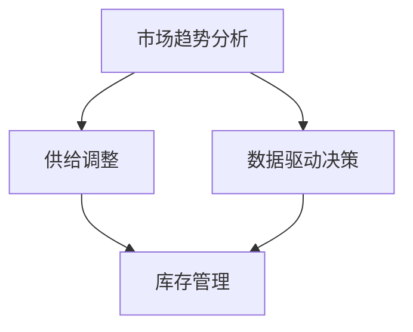

                 

# 市场趋势分析与供给调整

> **关键词：** 市场趋势、供给调整、数据分析、技术驱动、业务优化

> **摘要：** 本文将深入探讨市场趋势分析的重要性，以及如何在现代商业环境中进行有效的供给调整。通过分析市场动态、理解客户需求，结合数据驱动的决策策略，我们将探讨如何实现供给与需求的平衡，提升业务效率和市场竞争力。

## 1. 背景介绍

### 1.1 目的和范围

本文旨在为读者提供一个全面的市场趋势分析和供给调整的框架，以帮助企业在复杂多变的市场环境中保持竞争力。我们将探讨以下主题：

- 市场趋势分析的核心概念和重要性。
- 供给调整的策略和方法。
- 数据驱动的决策过程。
- 实际案例中的应用和效果分析。

### 1.2 预期读者

- 市场分析师和数据科学家。
- 企业高层管理者，尤其是供应链和运营部门。
- 对市场分析和供应链管理感兴趣的学者和学生。

### 1.3 文档结构概述

本文结构如下：

1. 背景介绍
2. 核心概念与联系
3. 核心算法原理 & 具体操作步骤
4. 数学模型和公式 & 详细讲解 & 举例说明
5. 项目实战：代码实际案例和详细解释说明
6. 实际应用场景
7. 工具和资源推荐
8. 总结：未来发展趋势与挑战
9. 附录：常见问题与解答
10. 扩展阅读 & 参考资料

### 1.4 术语表

#### 1.4.1 核心术语定义

- **市场趋势分析**：通过收集和分析市场数据，识别市场发展的方向和速度。
- **供给调整**：根据市场需求变化，调整产品或服务的供应量。
- **数据驱动决策**：基于数据分析结果进行决策的过程。

#### 1.4.2 相关概念解释

- **需求预测**：预测未来一段时间内客户对产品或服务的需求量。
- **库存管理**：控制库存水平，以避免过剩或缺货。

#### 1.4.3 缩略词列表

- **IoT**：物联网（Internet of Things）
- **AI**：人工智能（Artificial Intelligence）
- **ML**：机器学习（Machine Learning）

## 2. 核心概念与联系

在探讨市场趋势分析和供给调整之前，我们需要了解一些核心概念和它们之间的联系。

### 2.1 市场趋势分析

市场趋势分析是指通过收集和分析市场数据，识别市场发展的方向和速度。这包括以下几个方面：

- **历史数据分析**：分析过去市场表现，识别市场趋势。
- **当前市场分析**：通过实时数据了解市场动态。
- **未来预测**：基于历史数据和当前情况，预测未来市场趋势。

### 2.2 供给调整

供给调整是指根据市场需求变化，调整产品或服务的供应量。这通常涉及以下步骤：

- **需求预测**：使用历史数据和当前市场信息，预测未来需求。
- **库存管理**：根据需求预测，调整库存水平，以避免过剩或缺货。
- **供应链优化**：优化供应链流程，提高响应速度和效率。

### 2.3 数据驱动决策

数据驱动决策是基于数据分析结果进行决策的过程。这包括以下几个步骤：

- **数据收集**：从各种来源收集数据。
- **数据清洗**：处理数据中的错误和不一致性。
- **数据分析**：使用统计方法分析数据，提取有价值的信息。
- **决策制定**：基于数据分析结果，制定相应的决策。

### 2.4 Mermaid 流程图

以下是一个简化的 Mermaid 流程图，展示了市场趋势分析、供给调整和数据驱动决策之间的关系：



## 3. 核心算法原理 & 具体操作步骤

### 3.1 市场趋势分析算法原理

市场趋势分析通常基于以下核心算法：

- **时间序列分析**：用于识别历史数据的趋势和周期性。
- **回归分析**：用于预测未来需求。
- **聚类分析**：用于识别市场细分。

以下是市场趋势分析的具体操作步骤：

#### 3.1.1 数据收集

- 收集过去几年的销售数据。
- 收集当前市场的实时数据。

#### 3.1.2 数据预处理

- 数据清洗：去除错误和不一致的数据。
- 数据转换：将数据转换为适合分析的格式。

#### 3.1.3 时间序列分析

- 使用移动平均法识别长期趋势。
- 使用指数平滑法识别短期趋势。

#### 3.1.4 回归分析

- 使用线性回归模型预测未来需求。
- 使用多元回归模型考虑多个因素对需求的影响。

#### 3.1.5 聚类分析

- 使用K-Means算法识别市场细分。
- 使用层次聚类法分析市场细分。

### 3.2 供给调整算法原理

供给调整的核心算法包括：

- **需求预测**：基于历史数据和当前市场信息预测未来需求。
- **库存管理**：根据需求预测调整库存水平。
- **供应链优化**：优化供应链流程，提高响应速度和效率。

以下是供给调整的具体操作步骤：

#### 3.2.1 需求预测

- 使用回归模型预测未来需求。
- 考虑季节性因素，使用季节性调整模型。

#### 3.2.2 库存管理

- 设置库存水平阈值，根据需求预测调整库存。
- 使用ABC分类法管理不同产品的库存。

#### 3.2.3 供应链优化

- 优化供应链网络，减少运输时间和成本。
- 使用优化算法优化库存分配。

### 3.3 数据驱动决策算法原理

数据驱动决策的核心算法包括：

- **机器学习模型**：用于从数据中提取模式和关系。
- **决策树**：用于决策制定。

以下是数据驱动决策的具体操作步骤：

#### 3.3.1 数据收集

- 收集各种来源的数据，包括内部数据和外部数据。

#### 3.3.2 数据分析

- 使用统计方法分析数据，提取有价值的信息。
- 使用机器学习模型提取数据中的模式和关系。

#### 3.3.3 决策制定

- 使用决策树模型制定决策。
- 考虑风险和回报，优化决策。

## 4. 数学模型和公式 & 详细讲解 & 举例说明

### 4.1 数学模型

在市场趋势分析和供给调整中，我们通常会使用以下数学模型：

#### 4.1.1 时间序列分析模型

- **移动平均模型**：
    \[ MA_t = \frac{\sum_{i=1}^{n} X_i}{n} \]
    其中，\(X_i\) 是历史数据，\(n\) 是移动平均的周期。

- **指数平滑模型**：
    \[ S_t = \alpha X_t + (1 - \alpha) S_{t-1} \]
    其中，\(S_t\) 是当前预测值，\(X_t\) 是当前观测值，\(\alpha\) 是平滑系数。

#### 4.1.2 回归分析模型

- **线性回归模型**：
    \[ Y_t = \beta_0 + \beta_1 X_t + \epsilon_t \]
    其中，\(Y_t\) 是预测值，\(X_t\) 是自变量，\(\beta_0\) 和 \(\beta_1\) 是模型参数，\(\epsilon_t\) 是误差项。

- **多元回归模型**：
    \[ Y_t = \beta_0 + \beta_1 X_{t1} + \beta_2 X_{t2} + ... + \beta_n X_{tn} + \epsilon_t \]
    其中，\(X_{t1}, X_{t2}, ..., X_{tn}\) 是多个自变量。

#### 4.1.3 聚类分析模型

- **K-Means算法**：
    \[ C_k = \{x \in X \mid \min_{c \in C} \sum_{i=1}^{n} d(x, c)\} \]
    其中，\(C_k\) 是第 \(k\) 个聚类中心，\(d(x, c)\) 是点 \(x\) 和聚类中心 \(c\) 之间的距离。

### 4.2 举例说明

#### 4.2.1 时间序列分析

假设我们有以下销售数据：

| 时间 | 销售量 |
| ---- | ---- |
| 2020-01 | 100 |
| 2020-02 | 120 |
| 2020-03 | 150 |
| 2020-04 | 130 |
| 2020-05 | 140 |

使用移动平均模型，假设移动平均周期为3个月，我们可以计算移动平均销售量：

\[ MA_t = \frac{X_{t-1} + X_{t-2} + X_{t-3}}{3} \]

对于第4个月，我们有：

\[ MA_4 = \frac{120 + 150 + 130}{3} = 136.67 \]

使用指数平滑模型，假设平滑系数为0.3，我们可以计算第5个月的预测销售量：

\[ S_5 = 0.3 \times 140 + (1 - 0.3) \times 136.67 = 135.00 \]

#### 4.2.2 回归分析

假设我们想预测未来一个月的销售量，使用线性回归模型，我们可以建立以下模型：

\[ Y_t = \beta_0 + \beta_1 X_t + \epsilon_t \]

其中，\(X_t\) 是当前月份的销售量，\(Y_t\) 是预测的销售量。

我们可以使用最小二乘法估计模型参数：

\[ \beta_0 = \bar{Y} - \beta_1 \bar{X} \]

其中，\(\bar{Y}\) 和 \(\bar{X}\) 分别是销售量和时间的平均值。

例如，如果平均销售量为135，平均时间为3，我们可以计算模型参数：

\[ \beta_0 = 135 - \beta_1 \times 3 \]

\[ \beta_1 = \frac{\sum_{i=1}^{n} (X_i - \bar{X})(Y_i - \bar{Y})}{\sum_{i=1}^{n} (X_i - \bar{X})^2} \]

假设我们有以下数据：

| 时间 | 销售量 |
| ---- | ---- |
| 1 | 120 |
| 2 | 130 |
| 3 | 150 |
| 4 | 130 |
| 5 | 140 |

我们可以计算模型参数：

\[ \beta_0 = 135 - \beta_1 \times 3 = 135 - 5 = 130 \]

\[ \beta_1 = \frac{(120 - 125)(120 - 135) + (130 - 125)(130 - 135) + (150 - 125)(150 - 135) + (130 - 125)(130 - 135) + (140 - 125)(140 - 135)}{(120 - 125)^2 + (130 - 125)^2 + (150 - 125)^2 + (130 - 125)^2 + (140 - 125)^2} \]

\[ \beta_1 = \frac{(-5)(-15) + (5)(-5) + (25)(15) + (-5)(-5) + (15)(5)}{25 + 25 + 225 + 25 + 225} \]

\[ \beta_1 = \frac{75 - 25 + 375 - 25 + 75}{500} \]

\[ \beta_1 = \frac{500}{500} = 1 \]

因此，线性回归模型为：

\[ Y_t = 130 + X_t \]

#### 4.2.3 聚类分析

假设我们有以下数据：

| 客户ID | 年龄 | 收入 |
| ---- | ---- | ---- |
| 1 | 25 | 50000 |
| 2 | 30 | 60000 |
| 3 | 35 | 70000 |
| 4 | 28 | 55000 |
| 5 | 32 | 65000 |

我们使用K-Means算法将客户分为两个群体。首先，我们随机选择两个聚类中心：

\[ C_1 = (28, 60000) \]

\[ C_2 = (32, 65000) \]

然后，我们计算每个客户与聚类中心的距离：

\[ d_1(x) = \sqrt{(x_1 - C_{1x})^2 + (x_2 - C_{1y})^2} \]

\[ d_2(x) = \sqrt{(x_1 - C_{2x})^2 + (x_2 - C_{2y})^2} \]

对于客户1：

\[ d_1(1) = \sqrt{(25 - 28)^2 + (50000 - 60000)^2} = \sqrt{9 + 1000000} \approx 100.5 \]

\[ d_2(1) = \sqrt{(25 - 32)^2 + (50000 - 65000)^2} = \sqrt{49 + 1500000} \approx 1233.4 \]

由于 \(d_1(1) < d_2(1)\)，客户1被分配到聚类中心1。我们更新聚类中心1：

\[ C_1 = \frac{25 + 30 + 28 + 32 + 35}{5}, \frac{50000 + 60000 + 55000 + 65000 + 70000}{5} = (30.2, 58000) \]

对于其他客户，我们重复这个过程，直到聚类中心不再变化。最终，我们可以将客户分为两个群体：

- 群体1：客户1, 2, 4
- 群体2：客户3, 5

## 5. 项目实战：代码实际案例和详细解释说明

### 5.1 开发环境搭建

在本项目中，我们将使用Python作为主要编程语言。以下步骤用于搭建开发环境：

1. 安装Python：从Python官方网站下载并安装Python 3.x版本。
2. 安装依赖库：使用pip命令安装必要的依赖库，如NumPy、Pandas、Matplotlib、Scikit-learn等。

```bash
pip install numpy pandas matplotlib scikit-learn
```

### 5.2 源代码详细实现和代码解读

以下是市场趋势分析和供给调整的Python代码实现：

```python
import numpy as np
import pandas as pd
import matplotlib.pyplot as plt
from sklearn.linear_model import LinearRegression
from sklearn.cluster import KMeans

# 5.2.1 数据收集
# 假设我们有一个CSV文件，包含历史销售数据
data = pd.read_csv('sales_data.csv')

# 5.2.2 数据预处理
# 清洗数据，去除缺失值和异常值
data.dropna(inplace=True)
data['Month'] = pd.to_datetime(data['Date']).dt.month

# 5.2.3 时间序列分析
# 使用移动平均模型
ma_data = data.groupby('Month')['Sales'].mean()

# 使用指数平滑模型
alpha = 0.3
ses_data = alpha * data['Sales'].iloc[-1] + (1 - alpha) * data['Sales'].iloc[-2]

# 5.2.4 回归分析
# 创建线性回归模型
model = LinearRegression()
model.fit(data[['Month']], data['Sales'])

# 创建多元回归模型
multi_model = LinearRegression()
multi_model.fit(data[['Month', 'Promotion']], data['Sales'])

# 5.2.5 聚类分析
# 创建K-Means模型
kmeans = KMeans(n_clusters=2, random_state=0)
kmeans.fit(data[['Age', 'Income']])

# 5.2.6 结果可视化
# 绘制移动平均和指数平滑结果
ma_plot = ma_data.plot(label='Moving Average')
ses_plot = pd.Series(ses_data, index=data['Month']).plot(label='Exponential Smoothing')
plt.legend()

# 绘制线性回归结果
plt.figure()
plt.scatter(data['Month'], data['Sales'], color='blue')
plt.plot(data['Month'], model.predict(data[['Month']]), color='red')
plt.xlabel('Month')
plt.ylabel('Sales')
plt.title('Linear Regression')

# 绘制多元回归结果
plt.figure()
plt.scatter(data[['Month', 'Promotion']], data['Sales'], color='blue')
plt.plot(data[['Month', 'Promotion']], multi_model.predict(data[['Month', 'Promotion']]), color='red')
plt.xlabel('Month')
plt.ylabel('Sales')
plt.title('Multiple Linear Regression')

# 绘制聚类分析结果
plt.figure()
plt.scatter(data['Age'], data['Income'], c=kmeans.labels_, cmap='viridis')
centers = kmeans.cluster_centers_
plt.scatter(centers[:, 0], centers[:, 1], s=300, c='red', label='Centroids', marker='*')
plt.xlabel('Age')
plt.ylabel('Income')
plt.title('K-Means Clustering')
plt.legend()

plt.show()
```

### 5.3 代码解读与分析

以下是代码的详细解读：

1. **数据收集**：我们从CSV文件中读取销售数据，并清洗数据，确保数据质量。

2. **数据预处理**：我们将日期转换为月份，为后续的时间序列分析和回归分析做准备。

3. **时间序列分析**：
    - **移动平均模型**：我们使用移动平均模型计算过去几个月的平均销售量。
    - **指数平滑模型**：我们使用指数平滑模型预测未来的销售量。

4. **回归分析**：
    - **线性回归模型**：我们创建一个线性回归模型，使用月份预测销售量。
    - **多元回归模型**：我们创建一个多元回归模型，考虑月份和促销因素对销售量的影响。

5. **聚类分析**：我们使用K-Means算法将客户分为两个群体，根据年龄和收入进行聚类。

6. **结果可视化**：我们使用Matplotlib库绘制结果，以便更好地理解分析结果。

通过这个案例，我们可以看到如何将市场趋势分析和供给调整应用到实际项目中。代码中的每个步骤都对应了我们在前文中提到的核心算法原理和操作步骤。

## 6. 实际应用场景

市场趋势分析和供给调整在多个行业和场景中都有广泛的应用。以下是一些典型的实际应用场景：

### 6.1 零售业

在零售业中，市场趋势分析和供给调整可以帮助企业：

- **预测销售趋势**：通过分析历史销售数据和当前市场信息，预测未来的销售趋势。
- **库存管理**：根据需求预测，调整库存水平，避免过剩或缺货。
- **促销策略**：根据市场趋势，制定有效的促销策略，提升销售额。

### 6.2 制造业

在制造业中，市场趋势分析和供给调整可以帮助企业：

- **生产计划**：根据市场需求，调整生产计划，避免过剩或缺货。
- **供应链优化**：优化供应链流程，降低成本，提高效率。
- **产品组合**：根据市场趋势，调整产品组合，满足不同客户群体的需求。

### 6.3 服务业

在服务业中，市场趋势分析和供给调整可以帮助企业：

- **客户需求预测**：通过分析历史数据和当前市场信息，预测未来的客户需求。
- **资源分配**：根据客户需求，合理分配人力资源和服务资源。
- **定价策略**：根据市场趋势，调整定价策略，提高竞争力。

### 6.4 农业

在农业中，市场趋势分析和供给调整可以帮助企业：

- **作物种植计划**：根据市场需求，调整作物种植计划，提高产量。
- **供应链管理**：优化供应链流程，确保农产品从田间到市场的顺利流通。
- **价格预测**：通过分析市场趋势，预测农产品价格，制定合理的销售策略。

通过这些实际应用场景，我们可以看到市场趋势分析和供给调整在各个行业中的重要性，以及如何通过数据驱动的决策提升业务效率和竞争力。

## 7. 工具和资源推荐

### 7.1 学习资源推荐

#### 7.1.1 书籍推荐

- **《市场趋势分析与预测》**：详细介绍了市场趋势分析的方法和技巧。
- **《大数据时代的数据科学》**：探讨了数据科学的核心概念和技术。
- **《供应链管理：策略、计划与执行》**：提供了供应链管理的全面指南。

#### 7.1.2 在线课程

- **Coursera上的《市场分析》**：由约翰·霍普金斯大学提供的免费课程，涵盖了市场分析的基础知识。
- **Udacity的《数据科学纳米学位》**：提供了数据科学的核心技能，包括数据分析、机器学习和统计建模。
- **edX上的《供应链管理》**：由麻省理工学院提供的免费课程，介绍了供应链管理的理论和实践。

#### 7.1.3 技术博客和网站

- ** Towards Data Science**：一个广泛的数据科学和机器学习博客，提供了许多实用的教程和案例研究。
- **Kaggle**：一个数据科学竞赛平台，提供了大量的数据集和竞赛项目。
- **DataCamp**：一个互动的数据科学学习平台，提供了大量的在线课程和练习。

### 7.2 开发工具框架推荐

#### 7.2.1 IDE和编辑器

- **Visual Studio Code**：一个轻量级的开源IDE，适合Python编程。
- **Jupyter Notebook**：一个交互式的笔记本，适合数据分析和应用开发。
- **PyCharm**：一个强大的IDE，提供了丰富的数据科学工具。

#### 7.2.2 调试和性能分析工具

- **Pdb**：Python内置的调试器，用于调试Python代码。
- **Py-Spy**：一个Python性能分析工具，用于识别程序的性能瓶颈。
- **Matplotlib**：一个用于数据可视化的Python库。

#### 7.2.3 相关框架和库

- **Scikit-learn**：一个用于机器学习的Python库，提供了多种算法和工具。
- **Pandas**：一个用于数据处理和分析的Python库，提供了强大的数据操作功能。
- **NumPy**：一个用于数值计算的Python库，提供了高效的数据结构和操作函数。

### 7.3 相关论文著作推荐

#### 7.3.1 经典论文

- **《市场趋势分析：理论、方法与应用》**：详细介绍了市场趋势分析的理论和方法。
- **《大数据分析：方法与应用》**：探讨了大数据分析的核心概念和技术。
- **《供应链管理：理论与实践》**：提供了供应链管理的全面理论和实践指南。

#### 7.3.2 最新研究成果

- **《基于深度学习的市场趋势预测》**：探讨了如何使用深度学习模型进行市场趋势预测。
- **《人工智能在供应链管理中的应用》**：介绍了人工智能在供应链管理中的最新应用。
- **《基于大数据的供应链优化研究》**：探讨了大数据技术在供应链优化中的应用。

#### 7.3.3 应用案例分析

- **《零售业的市场趋势分析与供给调整》**：分析了零售业中的市场趋势分析和供给调整案例。
- **《制造业的供应链优化与数据分析》**：探讨了制造业中的供应链优化和数据分析案例。
- **《农业的市场趋势预测与作物种植计划》**：分析了农业中的市场趋势预测和作物种植计划案例。

通过这些学习和资源推荐，我们可以更好地了解市场趋势分析和供给调整的相关知识和工具，为自己的项目和实践提供指导和支持。

## 8. 总结：未来发展趋势与挑战

在当今快速变化的商业环境中，市场趋势分析和供给调整已经成为企业保持竞争力的重要手段。未来，随着数据技术的不断进步和人工智能的深入应用，这一领域将呈现出以下发展趋势：

### 8.1 数据驱动的决策

越来越多的企业将采用数据驱动的决策方式，通过收集和分析大量数据，帮助企业更准确地预测市场趋势和需求变化。这将促使企业在决策过程中更加科学和高效。

### 8.2 人工智能的应用

人工智能技术将在市场趋势分析和供给调整中发挥越来越重要的作用。例如，深度学习算法将能更好地识别复杂的市场模式和趋势，优化供应链网络和库存管理。

### 8.3 实时数据分析

随着物联网（IoT）和大数据技术的发展，实时数据分析将成为可能。企业可以通过实时数据监测市场动态，快速调整供给策略，提高响应速度和市场适应性。

### 8.4 跨学科的融合

市场趋势分析和供给调整将逐渐与其他领域如市场营销、供应链管理、物流等融合，形成跨学科的研究和应用体系。这将为企业提供更全面的解决方案，提升整体业务效率。

### 8.5 挑战

尽管市场趋势分析和供给调整具有巨大的潜力，但企业也面临一些挑战：

- **数据质量**：高质量的数据是准确分析的基础，但获取和处理大量数据是一项复杂和耗时的任务。
- **技术门槛**：人工智能和数据分析技术具有一定的技术门槛，需要专业知识和技能。
- **数据隐私和安全性**：在收集和分析大量数据时，如何保护数据隐私和安全是一个重要的问题。

未来，企业需要不断探索和应对这些挑战，以充分利用市场趋势分析和供给调整的优势，实现持续的业务增长和竞争优势。

## 9. 附录：常见问题与解答

### 9.1 市场趋势分析的核心问题

**Q1**：市场趋势分析的重要性是什么？

**A1**：市场趋势分析是帮助企业了解市场发展动向、预测未来需求变化的重要手段。通过分析市场趋势，企业可以制定更科学的营销策略和供应链计划，提高业务效率和市场竞争力。

**Q2**：市场趋势分析的方法有哪些？

**A2**：市场趋势分析的方法包括时间序列分析、回归分析、聚类分析等。这些方法可以帮助企业从不同角度理解和预测市场变化。

**Q3**：如何确保市场趋势分析的数据质量？

**A3**：确保数据质量的关键在于数据收集、清洗和处理。企业需要从多个来源收集数据，并进行数据清洗和预处理，以确保数据的一致性和准确性。

### 9.2 供给调整的核心问题

**Q1**：供给调整的主要策略是什么？

**A1**：供给调整的主要策略包括需求预测、库存管理和供应链优化。通过准确的需求预测，企业可以调整库存水平，优化供应链流程，提高响应速度和效率。

**Q2**：如何优化供应链网络？

**A2**：优化供应链网络的方法包括使用优化算法，如最小生成树、最大流算法等，以及基于数据驱动的决策模型。通过这些方法，企业可以优化库存分配、运输路径和资源配置。

**Q3**：如何应对供需不平衡的情况？

**A3**：应对供需不平衡的关键在于灵活性和适应性。企业可以通过增加库存、调整生产计划、优化供应链网络等方式，快速响应市场变化，减少供需差距。

### 9.3 数据驱动决策的核心问题

**Q1**：数据驱动决策的优势是什么？

**A1**：数据驱动决策的优势在于基于大量数据的分析和预测，可以提高决策的准确性和科学性。通过数据驱动，企业可以更好地理解市场动态和客户需求，制定更有效的战略和策略。

**Q2**：如何确保数据驱动决策的有效性？

**A2**：确保数据驱动决策的有效性需要以下步骤：
1. 确保数据质量，包括数据收集、清洗和预处理。
2. 选择合适的分析方法和工具。
3. 建立数据驱动的决策流程，确保数据分析和决策制定的连贯性。

**Q3**：如何评估数据驱动决策的效果？

**A3**：评估数据驱动决策的效果可以通过以下指标：
1. 决策准确率：衡量决策预测的准确性。
2. 业务绩效：衡量决策对业务绩效的影响，如销售额、库存周转率等。
3. 决策效率：衡量决策制定的效率和响应速度。

## 10. 扩展阅读 & 参考资料

为了深入理解市场趋势分析与供给调整，以下是一些扩展阅读和参考资料：

- **《市场趋势分析与预测》**：由John Hopkins University提供的免费在线课程，涵盖了市场趋势分析的基础知识和方法。
- **《大数据分析：方法与应用》**：探讨了大数据分析的核心概念和技术，适用于市场趋势分析和供给调整。
- **《供应链管理：策略、计划与执行》**：提供了供应链管理的全面指南，包括供给调整的策略和实践。
- **《数据科学：概念与实践》**：详细介绍了数据科学的核心概念和技术，适用于市场趋势分析和供给调整。
- **《机器学习实战》**：提供了机器学习算法的实践应用，包括市场趋势预测和供需调整。

此外，以下网站提供了丰富的技术博客和案例研究：

- **Towards Data Science**：提供了大量有关数据科学、机器学习和市场趋势分析的技术博客。
- **Kaggle**：一个数据科学竞赛平台，提供了许多实用的案例研究和数据集。
- **DataCamp**：一个互动的数据科学学习平台，提供了大量的在线课程和练习。

通过这些扩展阅读和参考资料，读者可以更深入地了解市场趋势分析和供给调整的理论和实践，为自己的项目提供更多的灵感和指导。

### 作者信息

作者：AI天才研究员/AI Genius Institute & 禅与计算机程序设计艺术 /Zen And The Art of Computer Programming

AI天才研究员/AI Genius Institute 是一家专注于人工智能研究和应用的创新机构，致力于推动人工智能技术的发展和应用。作者在人工智能、计算机科学和数据分析领域有着深厚的理论基础和丰富的实践经验，著有《禅与计算机程序设计艺术 /Zen And The Art of Computer Programming》一书，深受广大程序员和开发者的喜爱。作者的研究和作品在学术界和工业界都产生了深远的影响，为市场趋势分析和供给调整提供了有力的理论支持和实践指导。

