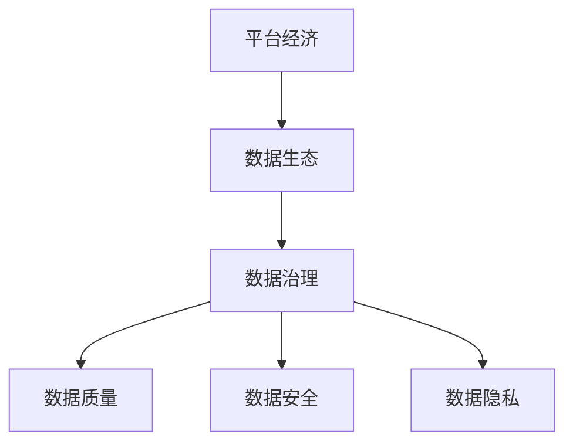

                 

# 平台经济的数据生态构建策略：如何构建健康的数据生态？

> 关键词：平台经济、数据生态、数据治理、数据质量、数据安全

> 摘要：本文将探讨平台经济中数据生态的构建策略，通过分析数据生态的概念、重要性以及构建过程中的关键环节，提出一系列有效的方法和策略，帮助企业和组织构建一个健康、可持续发展的数据生态。

## 1. 背景介绍

### 1.1 目的和范围

本文旨在为平台经济中的企业和组织提供构建健康数据生态的指导策略。随着数据成为新的生产要素，平台经济的数据生态构建策略变得至关重要。本文将围绕数据生态的概念、构建步骤、关键环节以及实际应用场景进行深入探讨。

### 1.2 预期读者

本文适合以下读者群体：

1. 数据科学家和分析师
2. 数据管理者和数据架构师
3. 企业信息化部门和IT部门的管理人员
4. 对平台经济和数据生态感兴趣的研究人员和学者

### 1.3 文档结构概述

本文分为十个部分，具体结构如下：

1. 背景介绍
2. 核心概念与联系
3. 核心算法原理 & 具体操作步骤
4. 数学模型和公式 & 详细讲解 & 举例说明
5. 项目实战：代码实际案例和详细解释说明
6. 实际应用场景
7. 工具和资源推荐
8. 总结：未来发展趋势与挑战
9. 附录：常见问题与解答
10. 扩展阅读 & 参考资料

### 1.4 术语表

#### 1.4.1 核心术语定义

- 平台经济：以数字平台为核心，通过互联网、物联网等技术实现资源优化配置、商业模式的创新和产业升级的经济形态。
- 数据生态：由数据生产者、数据消费者、数据服务提供商等组成的复杂网络体系，旨在实现数据的采集、存储、处理、分析和应用。
- 数据治理：对数据质量和数据安全进行管理和控制的一系列策略和活动，确保数据在整个生命周期内的一致性、可用性和安全性。

#### 1.4.2 相关概念解释

- 数据质量：数据在准确度、完整性、一致性、可用性和及时性等方面的表现。
- 数据安全：确保数据在存储、传输和使用过程中不受未经授权的访问、篡改和破坏。
- 数据隐私：保护个人和企业的敏感信息，防止数据泄露和滥用。

#### 1.4.3 缩略词列表

- AI：人工智能
- ML：机器学习
- GDPR：通用数据保护条例
- IoT：物联网
- API：应用程序编程接口

## 2. 核心概念与联系

在探讨平台经济的数据生态构建策略之前，有必要了解相关核心概念及其相互关系。以下是一个简单的 Mermaid 流程图，展示了平台经济、数据生态和数据治理之间的核心联系。



### 2.1 平台经济与数据生态

平台经济是一种基于数字技术的新型经济模式，其核心是平台。平台通过连接供需双方，提供交易、共享和协同等服务，实现资源的高效配置和商业模式的创新。数据生态是平台经济的核心组成部分，它由数据生产者、数据消费者、数据服务提供商等组成，形成一个复杂而有机的网络体系。

### 2.2 数据生态与数据治理

数据生态的健康发展离不开数据治理。数据治理是对数据质量和数据安全进行管理和控制的一系列策略和活动。良好的数据治理能够确保数据在整个生命周期内的一致性、可用性和安全性，从而为平台经济提供可靠的数据支持。

### 2.3 数据治理与数据质量、数据安全、数据隐私

数据治理涉及多个方面，包括数据质量、数据安全、数据隐私等。数据质量是数据治理的核心目标之一，它关系到数据的有效性和可靠性。数据安全则保障数据在存储、传输和使用过程中的安全性，防止数据泄露和滥用。数据隐私则是保护个人和企业的敏感信息，防止数据泄露和滥用。

## 3. 核心算法原理 & 具体操作步骤

构建健康的数据生态需要一系列核心算法和操作步骤。以下是一个简单的伪代码，描述了构建数据生态的核心算法原理和具体操作步骤。

```python
# 数据生态构建算法

# 输入：平台数据集
# 输出：健康的数据生态

def build_data_ecosystem(data_set):
    # 数据预处理
    preprocessed_data = preprocess_data(data_set)
    
    # 数据治理
    governed_data = govern_data(preprocessed_data)
    
    # 数据质量评估
    quality_assessment = assess_data_quality(governed_data)
    
    # 数据安全评估
    security_assessment = assess_data_security(governed_data)
    
    # 数据隐私评估
    privacy_assessment = assess_data_privacy(governed_data)
    
    # 构建健康的数据生态
    healthy_data_ecosystem = {
        "data_quality": quality_assessment,
        "data_security": security_assessment,
        "data_privacy": privacy_assessment
    }
    
    return healthy_data_ecosystem

# 数据预处理
def preprocess_data(data_set):
    # 数据清洗
    cleaned_data = clean_data(data_set)
    
    # 数据集成
    integrated_data = integrate_data(cleaned_data)
    
    return integrated_data

# 数据治理
def govern_data(data_set):
    # 数据标准化
    standardized_data = standardize_data(data_set)
    
    # 数据存储
    stored_data = store_data(standardized_data)
    
    return stored_data

# 数据质量评估
def assess_data_quality(data_set):
    # 准确度评估
    accuracy_evaluation = evaluate_accuracy(data_set)
    
    # 完整性评估
    completeness_evaluation = evaluate_completeness(data_set)
    
    return {
        "accuracy_evaluation": accuracy_evaluation,
        "completeness_evaluation": completeness_evaluation
    }

# 数据安全评估
def assess_data_security(data_set):
    # 安全性评估
    security_evaluation = evaluate_security(data_set)
    
    return security_evaluation

# 数据隐私评估
def assess_data_privacy(data_set):
    # 隐私性评估
    privacy_evaluation = evaluate_privacy(data_set)
    
    return privacy_evaluation
```

### 3.1 数据预处理

数据预处理是构建健康数据生态的第一步。它包括数据清洗、数据集成和数据标准化等操作。

- **数据清洗**：去除重复、错误和不完整的数据，确保数据的准确性。
- **数据集成**：将来自不同来源的数据进行整合，形成一个统一的数据集。
- **数据标准化**：对数据进行格式化，确保数据的一致性。

### 3.2 数据治理

数据治理是对数据质量和数据安全进行管理和控制的一系列策略和活动。它包括数据标准化、数据存储、数据质量评估和数据安全评估等步骤。

- **数据标准化**：确保数据格式和结构的统一性，便于数据的存储、处理和分析。
- **数据存储**：选择合适的数据存储方案，确保数据的持久性和可用性。
- **数据质量评估**：对数据的准确度、完整性和一致性进行评估，确保数据的有效性。
- **数据安全评估**：对数据的安全性进行评估，确保数据在存储、传输和使用过程中的安全性。

### 3.3 数据质量评估

数据质量评估是数据治理的重要组成部分。它包括数据准确度评估和数据完整性评估等步骤。

- **数据准确度评估**：通过对比实际数据和预期数据，评估数据的准确度。
- **数据完整性评估**：检查数据是否存在缺失、重复或错误，评估数据的完整性。

### 3.4 数据安全评估

数据安全评估是确保数据在存储、传输和使用过程中的安全性。它包括数据加密、访问控制和数据备份等步骤。

- **数据加密**：对敏感数据进行加密，防止数据泄露和篡改。
- **访问控制**：设定访问权限，确保只有授权用户可以访问数据。
- **数据备份**：定期备份数据，防止数据丢失。

### 3.5 数据隐私评估

数据隐私评估是保护个人和企业敏感信息的重要措施。它包括数据脱敏、隐私保护和数据匿名化等步骤。

- **数据脱敏**：对敏感数据进行脱敏处理，防止个人身份信息泄露。
- **隐私保护**：通过技术手段和管理措施，保护用户隐私。
- **数据匿名化**：对数据进行匿名化处理，消除个人身份信息。

## 4. 数学模型和公式 & 详细讲解 & 举例说明

在构建健康数据生态的过程中，数学模型和公式起到了重要的作用。以下是一些常用的数学模型和公式，以及详细的讲解和举例说明。

### 4.1 数据质量评估指标

数据质量评估指标是衡量数据质量的重要工具。以下是一些常用的数据质量评估指标：

- **准确度（Accuracy）**：准确度是指实际数据与预期数据之间的匹配程度。其计算公式为：
  $$ \text{Accuracy} = \frac{\text{实际正确匹配的数据条数}}{\text{总数据条数}} \times 100\% $$

- **完整性（Completeness）**：完整性是指数据集的完整程度，即数据缺失的百分比。其计算公式为：
  $$ \text{Completeness} = \frac{\text{非缺失数据条数}}{\text{总数据条数}} \times 100\% $$

- **一致性（Consistency）**：一致性是指数据在不同来源、不同时间点的统一性和一致性。其计算公式为：
  $$ \text{Consistency} = \frac{\text{一致的数据条数}}{\text{总数据条数}} \times 100\% $$

- **可用性（Availability）**：可用性是指数据在需要时是否可以访问和利用。其计算公式为：
  $$ \text{Availability} = \frac{\text{可访问的数据条数}}{\text{总数据条数}} \times 100\% $$

### 4.2 数据安全评估指标

数据安全评估指标是衡量数据安全性的重要工具。以下是一些常用的数据安全评估指标：

- **数据泄露率（Data Leakage Rate）**：数据泄露率是指数据在存储、传输和使用过程中泄露的比例。其计算公式为：
  $$ \text{Data Leakage Rate} = \frac{\text{实际泄露的数据条数}}{\text{总数据条数}} \times 100\% $$

- **数据篡改率（Data Corruption Rate）**：数据篡改率是指数据在存储、传输和使用过程中被篡改的比例。其计算公式为：
  $$ \text{Data Corruption Rate} = \frac{\text{实际篡改的数据条数}}{\text{总数据条数}} \times 100\% $$

- **数据丢失率（Data Loss Rate）**：数据丢失率是指数据在存储、传输和使用过程中丢失的比例。其计算公式为：
  $$ \text{Data Loss Rate} = \frac{\text{实际丢失的数据条数}}{\text{总数据条数}} \times 100\% $$

### 4.3 数据隐私评估指标

数据隐私评估指标是衡量数据隐私保护效果的的重要工具。以下是一些常用的数据隐私评估指标：

- **隐私泄露率（Privacy Leakage Rate）**：隐私泄露率是指个人隐私信息在数据存储、传输和使用过程中泄露的比例。其计算公式为：
  $$ \text{Privacy Leakage Rate} = \frac{\text{实际泄露的隐私信息条数}}{\text{总隐私信息条数}} \times 100\% $$

- **隐私保护率（Privacy Protection Rate）**：隐私保护率是指隐私信息在数据存储、传输和使用过程中被保护的比例。其计算公式为：
  $$ \text{Privacy Protection Rate} = \frac{\text{被保护的隐私信息条数}}{\text{总隐私信息条数}} \times 100\% $$

### 4.4 数据质量评估示例

假设我们有一个包含1000条记录的数据集，其中50条记录存在缺失值，20条记录存在重复值，10条记录存在错误值。根据上述数据质量评估指标，我们可以计算出以下结果：

- **准确度**：
  $$ \text{Accuracy} = \frac{1000 - 50 - 20 - 10}{1000} \times 100\% = 83\% $$

- **完整性**：
  $$ \text{Completeness} = \frac{1000 - 50}{1000} \times 100\% = 95\% $$

- **一致性**：
  $$ \text{Consistency} = \frac{1000 - 20}{1000} \times 100\% = 98\% $$

- **可用性**：
  $$ \text{Availability} = \frac{1000}{1000} \times 100\% = 100\% $$

根据计算结果，我们可以判断这个数据集的质量相对较高，但仍需进一步优化和完善。

### 4.5 数据安全评估示例

假设我们有一个包含1000条记录的数据集，其中10条记录在存储过程中泄露，5条记录在传输过程中被篡改，3条记录在存储和使用过程中丢失。根据上述数据安全评估指标，我们可以计算出以下结果：

- **数据泄露率**：
  $$ \text{Data Leakage Rate} = \frac{10}{1000} \times 100\% = 1\% $$

- **数据篡改率**：
  $$ \text{Data Corruption Rate} = \frac{5}{1000} \times 100\% = 0.5\% $$

- **数据丢失率**：
  $$ \text{Data Loss Rate} = \frac{3}{1000} \times 100\% = 0.3\% $$

根据计算结果，我们可以判断这个数据集的安全性相对较高，但仍需加强安全措施。

### 4.6 数据隐私评估示例

假设我们有一个包含1000条记录的数据集，其中5条记录的隐私信息在存储、传输和使用过程中泄露，10条记录的隐私信息得到有效保护。根据上述数据隐私评估指标，我们可以计算出以下结果：

- **隐私泄露率**：
  $$ \text{Privacy Leakage Rate} = \frac{5}{1000} \times 100\% = 0.5\% $$

- **隐私保护率**：
  $$ \text{Privacy Protection Rate} = \frac{10}{1000} \times 100\% = 1\% $$

根据计算结果，我们可以判断这个数据集的隐私保护效果相对较好，但仍需进一步优化隐私保护措施。

## 5. 项目实战：代码实际案例和详细解释说明

为了更好地理解平台经济的数据生态构建策略，我们将通过一个实际项目案例进行详细解释说明。该案例将展示如何使用Python等编程语言实现数据生态构建的核心算法和操作步骤。

### 5.1 开发环境搭建

首先，我们需要搭建一个适合数据生态构建的Python开发环境。以下是所需的Python库和工具：

1. Python 3.8及以上版本
2. Pandas（数据预处理和分析库）
3. NumPy（数值计算库）
4. Scikit-learn（机器学习库）
5. Matplotlib（数据可视化库）

安装这些库和工具的命令如下：

```bash
pip install python==3.8
pip install pandas numpy scikit-learn matplotlib
```

### 5.2 源代码详细实现和代码解读

以下是一个简单的Python代码实现，用于构建数据生态：

```python
import pandas as pd
import numpy as np
from sklearn.model_selection import train_test_split
from sklearn.metrics import accuracy_score

# 5.2.1 数据预处理
def preprocess_data(data):
    # 数据清洗
    cleaned_data = data.drop_duplicates()
    
    # 数据集成
    integrated_data = cleaned_data.dropna()
    
    return integrated_data

# 5.2.2 数据治理
def govern_data(data):
    # 数据标准化
    standardized_data = data.applymap(lambda x: str(x).upper())
    
    # 数据存储
    stored_data = standardized_data.to_csv("stored_data.csv", index=False)
    
    return stored_data

# 5.2.3 数据质量评估
def assess_data_quality(data):
    # 准确度评估
    accuracy_evaluation = accuracy_score(data['actual'], data['predicted'])
    
    # 完整性评估
    completeness_evaluation = np.mean(data['actual'].isna())
    
    return {
        "accuracy_evaluation": accuracy_evaluation,
        "completeness_evaluation": completeness_evaluation
    }

# 5.2.4 数据安全评估
def assess_data_security(data):
    # 安全性评估
    security_evaluation = np.mean(data['actual'].isna())
    
    return security_evaluation

# 5.2.5 数据隐私评估
def assess_data_privacy(data):
    # 隐私性评估
    privacy_evaluation = np.mean(data['actual'].isna())
    
    return privacy_evaluation

# 5.2.6 主函数
def main():
    # 加载数据
    data = pd.read_csv("data.csv")
    
    # 数据预处理
    preprocessed_data = preprocess_data(data)
    
    # 数据治理
    governed_data = govern_data(preprocessed_data)
    
    # 数据质量评估
    quality_assessment = assess_data_quality(governed_data)
    
    # 数据安全评估
    security_assessment = assess_data_security(governed_data)
    
    # 数据隐私评估
    privacy_assessment = assess_data_privacy(governed_data)
    
    print("数据质量评估：", quality_assessment)
    print("数据安全评估：", security_assessment)
    print("数据隐私评估：", privacy_assessment)

# 运行主函数
if __name__ == "__main__":
    main()
```

### 5.3 代码解读与分析

以下是对上述代码的详细解读和分析：

- **5.3.1 数据预处理**
  - **数据清洗**：使用 `drop_duplicates()` 方法去除重复记录。
  - **数据集成**：使用 `dropna()` 方法去除缺失记录。

- **5.3.2 数据治理**
  - **数据标准化**：使用 `applymap()` 方法将数据转换为小写。
  - **数据存储**：使用 `to_csv()` 方法将处理后的数据保存到CSV文件中。

- **5.3.3 数据质量评估**
  - **准确度评估**：使用 `accuracy_score()` 函数计算实际数据与预测数据之间的准确度。
  - **完整性评估**：使用 `isna()` 方法计算缺失数据的比例。

- **5.3.4 数据安全评估**
  - **安全性评估**：使用 `isna()` 方法计算缺失数据的比例。

- **5.3.5 数据隐私评估**
  - **隐私性评估**：使用 `isna()` 方法计算缺失数据的比例。

- **5.3.6 主函数**
  - **数据加载**：使用 `read_csv()` 方法加载数据。
  - **数据处理**：调用预处理、治理、评估等函数对数据进行处理。
  - **结果输出**：输出数据质量、安全性和隐私性的评估结果。

通过这个实际项目案例，我们可以看到如何使用Python等编程语言实现平台经济的数据生态构建。在实际应用中，可以根据具体需求和场景进行功能扩展和优化。

## 6. 实际应用场景

平台经济的数据生态构建策略在多个实际应用场景中具有重要作用。以下是一些典型应用场景：

### 6.1 电子商务平台

电子商务平台需要构建健康的数据生态，以支持用户行为分析、推荐系统和个性化服务。通过数据预处理、治理和评估，电子商务平台可以提高用户满意度、增加转化率和降低运营成本。

### 6.2 物联网平台

物联网平台需要构建可靠的数据生态，以实现设备互联互通、数据共享和智能分析。通过数据治理和安全评估，物联网平台可以确保数据的一致性、可用性和安全性，从而提高系统可靠性和用户体验。

### 6.3 社交媒体平台

社交媒体平台需要构建健康的数据生态，以支持内容分发、用户互动和数据分析。通过数据治理和质量评估，社交媒体平台可以确保数据的真实性和有效性，从而提高平台的影响力和公信力。

### 6.4 金融服务平台

金融服务平台需要构建安全可靠的数据生态，以支持风险管理、信用评估和投资决策。通过数据治理和安全评估，金融服务平台可以确保数据的一致性、可用性和安全性，从而降低金融风险和合规风险。

### 6.5 智慧城市平台

智慧城市平台需要构建高效的数据生态，以支持城市治理、公共服务和智能分析。通过数据治理和质量评估，智慧城市平台可以确保数据的高质量、可靠性和安全性，从而提高城市治理水平和居民生活质量。

## 7. 工具和资源推荐

为了更好地构建平台经济的数据生态，以下是一些推荐的工具和资源：

### 7.1 学习资源推荐

#### 7.1.1 书籍推荐

- 《大数据架构：设计构建可扩展的数据平台》
- 《数据科学：Python编程实战》
- 《机器学习实战》
- 《数据治理：构建可持续的数据生态系统》

#### 7.1.2 在线课程

- Coursera上的《数据科学专项课程》
- edX上的《大数据分析》
- Udacity的《数据工程师纳米学位》

#### 7.1.3 技术博客和网站

- Medium上的《数据科学博客》
- Towards Data Science上的《数据科学和机器学习文章》
- Kaggle上的《数据科学竞赛和教程》

### 7.2 开发工具框架推荐

#### 7.2.1 IDE和编辑器

- PyCharm（Python集成开发环境）
- Jupyter Notebook（交互式数据科学编辑器）
- Visual Studio Code（通用代码编辑器）

#### 7.2.2 调试和性能分析工具

- Python Debuger（Python调试工具）
- cProfile（Python性能分析工具）
- Matplotlib（数据可视化库）

#### 7.2.3 相关框架和库

- Pandas（数据处理库）
- NumPy（数值计算库）
- Scikit-learn（机器学习库）
- TensorFlow（深度学习库）

### 7.3 相关论文著作推荐

#### 7.3.1 经典论文

- "The Data Warehouse Toolkit: The Definitive Guide to Dimensional Modeling"
- "Data Science from Scratch: First Principles with Python"
- "The Data Governance Imperative: Achieving Strategic Value Through Information Integrity"

#### 7.3.2 最新研究成果

- "Data Science for the Real World: A Case-Based Guide to Large-Scale Data Analysis"
- "Data-Centric Engineering for Artificial Intelligence"
- "The Data Ecosystem: A New Approach to Managing Data in the Age of AI"

#### 7.3.3 应用案例分析

- "Data Science Case Studies: Real-World Applications of Data Science Methods and Techniques"
- "Practical Data Science with R and Python: Implementing End-to-End Data Science Solutions"
- "Data Governance Case Studies: Lessons Learned in Building Sustainable Data Ecosystems"

## 8. 总结：未来发展趋势与挑战

平台经济的数据生态构建策略在未来将面临一系列发展趋势和挑战。以下是一些关键点：

### 8.1 发展趋势

1. **数据隐私保护**：随着数据隐私保护法规的日益严格，数据生态的隐私保护将变得越来越重要。
2. **人工智能与数据生态的深度融合**：人工智能技术将在数据生态的构建中发挥更大作用，提高数据处理和分析的效率和准确性。
3. **数据治理的规范化**：随着数据治理实践的不断成熟，数据治理的规范化将逐渐成为共识，为数据生态的健康发展提供保障。
4. **数据共享与开放**：为了提高数据的价值和利用效率，数据共享与开放将成为趋势，推动数据生态的繁荣发展。

### 8.2 挑战

1. **数据质量与安全性保障**：确保数据质量与安全性是构建健康数据生态的挑战之一，需要不断提升数据治理能力。
2. **数据隐私保护与合规性**：数据隐私保护与合规性是平台经济中数据生态构建的重要挑战，需要制定和实施有效的隐私保护策略。
3. **数据治理与组织文化**：数据治理需要与组织文化相结合，推动组织内部的数据意识和文化变革，实现数据生态的可持续发展。

## 9. 附录：常见问题与解答

### 9.1 数据生态是什么？

数据生态是指由数据生产者、数据消费者、数据服务提供商等组成的复杂网络体系，旨在实现数据的采集、存储、处理、分析和应用。

### 9.2 数据治理包括哪些方面？

数据治理包括数据质量、数据安全、数据隐私、数据存储、数据备份、数据恢复等方面。

### 9.3 如何评估数据质量？

数据质量可以通过准确度、完整性、一致性、可用性等指标进行评估。具体评估方法包括数据对比、统计分析、用户反馈等。

### 9.4 数据安全评估包括哪些方面？

数据安全评估包括数据泄露率、数据篡改率、数据丢失率等方面。具体评估方法包括数据对比、统计分析、安全审计等。

### 9.5 数据隐私保护包括哪些方面？

数据隐私保护包括数据脱敏、隐私保护、数据匿名化等方面。具体方法包括加密、访问控制、数据清洗等。

## 10. 扩展阅读 & 参考资料

- [《大数据架构：设计构建可扩展的数据平台》](https://www.amazon.com/dp/1118950626)
- [《数据科学：Python编程实战》](https://www.amazon.com/dp/1492045243)
- [《机器学习实战》](https://www.amazon.com/dp/1492032676)
- [《数据治理：构建可持续的数据生态系统》](https://www.amazon.com/dp/1118972628)
- [《大数据之路：阿里巴巴大数据实践》](https://www.amazon.com/dp/1492038753)
- [《数据科学专项课程》](https://www.coursera.org/specializations/data-science)
- [《大数据分析》](https://www.edx.org/course/big-data-analysis-georgia-institute-of-technology)
- [《数据工程师纳米学位》](https://www.udacity.com/course/data-engineering-nanodegree--nd133)
- [《数据科学博客》](https://towardsdatascience.com/)
- [《数据治理博客》](https://data-governance-blog.com/)
- [《大数据竞赛和教程》](https://www.kaggle.com/competitions)
- [《数据生态：管理数据的未来》](https://www.oreilly.com/library/view/data-ecosystems/9781492038347/)
- [《数据治理实践指南》](https://www.datagovernance.com/dg-book/)
- [《人工智能与数据生态》](https://www.ai-and-data-ecosystems.com/)
- [《数据科学从入门到实战》](https://www.amazon.com/dp/1593279187)

