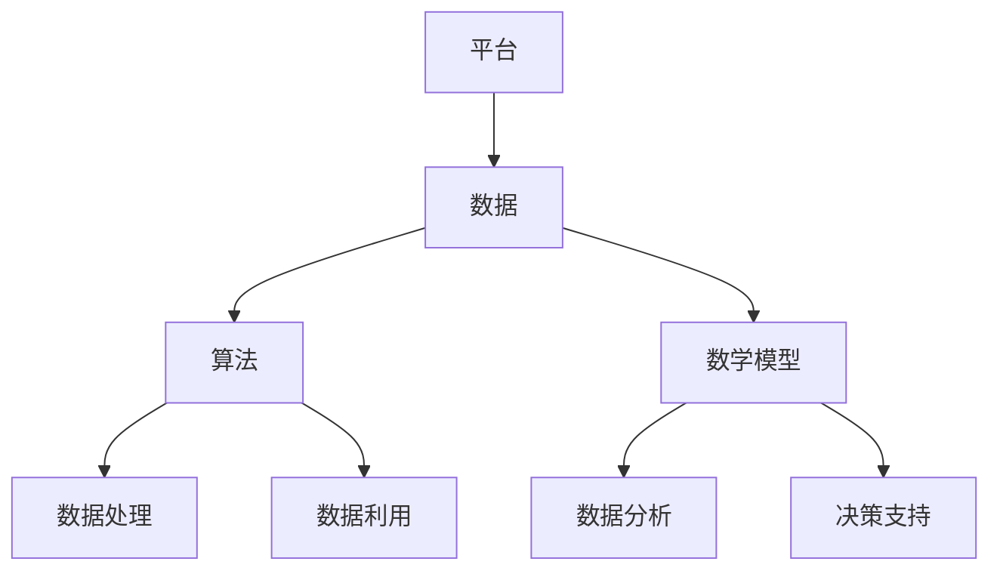
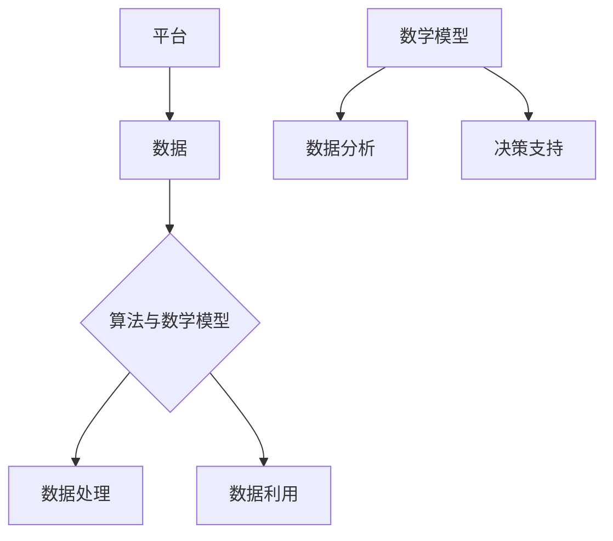

                 

# 平台经济的数据竞争：数据成为平台竞争的核心

> 关键词：平台经济、数据竞争、数据价值、算法、数学模型、实战案例

> 摘要：本文将深入探讨平台经济中的数据竞争现象，分析数据成为平台竞争核心的原因。通过逐步分析核心概念、算法原理、数学模型、实战案例等，揭示数据在平台经济中的关键作用，为读者提供对平台经济数据竞争的深刻理解和实践指导。

## 1. 背景介绍

### 1.1 目的和范围

本文旨在揭示平台经济中的数据竞争现象，探讨数据在平台竞争中的核心地位。随着互联网和大数据技术的迅猛发展，平台经济已经成为全球经济的重要组成部分。平台经济的核心是数据，数据的获取、处理和利用成为平台竞争的关键。本文将通过对核心概念的详细分析、算法原理的阐述、数学模型的讲解以及实战案例的剖析，帮助读者深入理解平台经济中的数据竞争。

### 1.2 预期读者

本文适合对平台经济、数据科学、算法和数学模型有一定了解的读者。无论是从事数据科学、人工智能、软件开发等领域的专业人士，还是对平台经济和大数据技术感兴趣的爱好者，都可以通过本文获得对平台经济数据竞争的深刻理解和实践指导。

### 1.3 文档结构概述

本文分为十个部分：

1. **背景介绍**：介绍本文的目的和范围，预期读者，文档结构概述。
2. **核心概念与联系**：阐述平台经济中的核心概念，包括平台、数据、算法等，并绘制Mermaid流程图。
3. **核心算法原理 & 具体操作步骤**：详细解释核心算法原理，使用伪代码阐述具体操作步骤。
4. **数学模型和公式 & 详细讲解 & 举例说明**：讲解数学模型和公式，并通过实例进行详细说明。
5. **项目实战：代码实际案例和详细解释说明**：通过实际代码案例，详细解释代码实现和代码解读。
6. **实际应用场景**：探讨平台经济数据竞争的实际应用场景。
7. **工具和资源推荐**：推荐学习资源、开发工具框架和相关论文著作。
8. **总结：未来发展趋势与挑战**：总结本文内容，探讨平台经济数据竞争的未来发展趋势和挑战。
9. **附录：常见问题与解答**：回答读者可能遇到的问题。
10. **扩展阅读 & 参考资料**：提供扩展阅读和参考资料。

### 1.4 术语表

#### 1.4.1 核心术语定义

- **平台经济**：指基于互联网和大数据技术的商业模式，通过构建平台连接供需双方，实现资源共享和效率提升。
- **数据竞争**：指平台企业通过获取、处理和利用数据，提升自身竞争力，从而在市场竞争中取得优势。
- **算法**：用于处理数据和解决问题的步骤和规则。
- **数学模型**：用数学语言描述现实问题的抽象模型。
- **数据价值**：指数据对平台经济产生的经济价值。

#### 1.4.2 相关概念解释

- **平台**：连接供需双方的桥梁，提供基础设施和服务。
- **数据**：包括用户行为数据、交易数据、业务数据等。
- **数据处理**：对数据进行清洗、转换、存储等操作，以便更好地利用。
- **数据利用**：通过算法和模型，对数据进行分析和挖掘，产生商业价值。

#### 1.4.3 缩略词列表

- **API**：应用程序接口（Application Programming Interface）
- **BI**：商业智能（Business Intelligence）
- **CRM**：客户关系管理（Customer Relationship Management）
- **DMP**：数据管理平台（Data Management Platform）
- **ETL**：提取、转换、加载（Extract, Transform, Load）

## 2. 核心概念与联系

在平台经济中，数据、算法和数学模型是三个核心概念。数据是平台经济的原材料，算法是数据处理的工具，数学模型则是数据分析和决策的依据。下面我们将通过Mermaid流程图，对这三个核心概念及其联系进行阐述。

### 2.1 平台经济的核心概念



### 2.2 数据与算法的联系

数据是算法的输入，算法对数据进行处理和分析，产生输出。算法的优化和改进往往依赖于对数据的深入理解和挖掘。

### 2.3 数据与数学模型的联系

数学模型是对现实问题的抽象和描述，数据是数学模型的输入。通过数据对数学模型进行训练和优化，可以提升模型的准确性和可靠性。

### 2.4 算法与数学模型的关系

算法是数学模型的具体实现，用于解决实际问题。数学模型为算法提供了理论基础和指导，算法则将数学模型转化为可执行的操作。

下面是一个简化的Mermaid流程图，展示平台经济中核心概念及其联系：



## 3. 核心算法原理 & 具体操作步骤

在平台经济中，核心算法的作用至关重要。下面我们将详细解释核心算法的原理，并使用伪代码阐述具体操作步骤。

### 3.1 数据预处理

数据预处理是算法的基础，包括数据清洗、数据转换和数据归一化等操作。

#### 3.1.1 数据清洗

伪代码：

```python
def data清洗(data):
    for record in data:
        if 缺失值检测(record):
            删除(record)
        else:
            保留(record)
    返回 data
```

#### 3.1.2 数据转换

伪代码：

```python
def 数据转换(data):
    for record in data:
        for feature in record:
            if 特征类型为分类特征：
                转换为独热编码
            else:
                标准化或归一化
    返回 data
```

#### 3.1.3 数据归一化

伪代码：

```python
def 数据归一化(data):
    for record in data:
        for feature in record:
            feature_min = 数据中的最小值(feature)
            feature_max = 数据中的最大值(feature)
            record[feature] = (record[feature] - feature_min) / (feature_max - feature_min)
    返回 data
```

### 3.2 算法实现

算法实现包括特征提取、模型训练和预测等步骤。

#### 3.2.1 特征提取

伪代码：

```python
def 特征提取(data):
    features = []
    for record in data:
        for feature in record:
            if 特征类型为分类特征：
                features.append(独热编码(feature))
            else：
                features.append(feature)
    返回 features
```

#### 3.2.2 模型训练

伪代码：

```python
def 模型训练(features, labels):
    model = 初始化模型()
    for epoch in 范围(1, epochs):
        for feature, label in zip(features, labels):
            model.update(feature, label)
    返回 model
```

#### 3.2.3 预测

伪代码：

```python
def 预测(model, feature):
    prediction = model.predict(feature)
    返回 prediction
```

### 3.3 具体操作步骤

1. **数据收集**：收集平台上的用户数据、交易数据等。
2. **数据预处理**：进行数据清洗、数据转换和数据归一化。
3. **特征提取**：提取有用的特征，为模型训练做准备。
4. **模型训练**：使用特征和标签，训练模型。
5. **预测**：使用训练好的模型，对新的数据进行预测。

## 4. 数学模型和公式 & 详细讲解 & 举例说明

在平台经济中，数学模型用于描述和分析数据，帮助我们理解和预测平台的行为。下面我们将详细讲解几个常用的数学模型和公式，并通过实例进行说明。

### 4.1 线性回归模型

线性回归模型是一种常见的数学模型，用于描述两个变量之间的线性关系。

#### 公式：

$$ y = ax + b $$

其中，$y$ 是因变量，$x$ 是自变量，$a$ 和 $b$ 是参数。

#### 例子：

假设我们有一个数据集，包含用户年龄（自变量）和用户购买金额（因变量）。我们使用线性回归模型来预测新用户的购买金额。

1. 收集数据：
   - 年龄：[20, 30, 40, 50, 60]
   - 购买金额：[100, 200, 300, 400, 500]

2. 计算参数：
   - 平均年龄：$\bar{x} = \frac{20 + 30 + 40 + 50 + 60}{5} = 40$
   - 平均购买金额：$\bar{y} = \frac{100 + 200 + 300 + 400 + 500}{5} = 300$
   - 斜率 $a = \frac{\sum(x_i - \bar{x})(y_i - \bar{y})}{\sum(x_i - \bar{x})^2} = 10$
   - 截距 $b = \bar{y} - a\bar{x} = 300 - 10 \times 40 = 100$

3. 预测：
   - 新用户年龄为30岁，预测购买金额为 $y = 10 \times 30 + 100 = 400$

### 4.2 决策树模型

决策树模型是一种常用的分类和回归模型，通过一系列规则对数据进行划分。

#### 公式：

$$ tree = \text{构造决策树}(\text{数据集}) $$

#### 例子：

假设我们有一个数据集，包含用户年龄、收入和购买金额三个特征，用于分类用户是否购买。

1. 收集数据：
   - 年龄：[20, 30, 40, 50, 60]
   - 收入：[5000, 8000, 10000, 15000, 20000]
   - 购买金额：[0, 1, 1, 1, 1]

2. 构造决策树：
   - 首先选择特征，计算信息增益或基尼指数。
   - 选择信息增益最高的特征，划分数据。
   - 对划分后的数据，重复上述步骤，直到达到停止条件。

3. 预测：
   - 新用户年龄为30岁，收入为8000元，根据决策树规则，预测购买金额为1。

### 4.3 支持向量机（SVM）模型

支持向量机模型是一种常用的分类模型，通过找到最佳分类边界，将数据分为不同的类别。

#### 公式：

$$ w \cdot x + b = 0 $$

其中，$w$ 是权重向量，$x$ 是特征向量，$b$ 是偏置。

#### 例子：

假设我们有一个数据集，包含两个类别的数据，使用SVM进行分类。

1. 收集数据：
   - 类别1：[(-1, -1), (-1, 1), (1, -1), (1, 1)]
   - 类别2：[(2, 2), (2, 4), (4, 2), (4, 4)]

2. 训练模型：
   - 使用支持向量机算法，找到最佳分类边界。

3. 预测：
   - 新数据点为（3，3），根据SVM模型，预测属于类别1。

通过以上实例，我们可以看到数学模型在平台经济中的应用。不同的模型适用于不同的问题，选择合适的模型和参数，可以提升平台的竞争力。

## 5. 项目实战：代码实际案例和详细解释说明

在本节中，我们将通过一个实际的项目案例，详细讲解代码的实现过程，并对代码进行解读和分析。项目案例将涉及平台经济中的用户行为数据分析和预测。

### 5.1 开发环境搭建

在开始项目之前，我们需要搭建合适的开发环境。以下是我们推荐的开发工具和框架：

- **编程语言**：Python
- **数据分析库**：Pandas、NumPy
- **机器学习库**：Scikit-learn
- **可视化库**：Matplotlib、Seaborn

安装这些库可以使用以下命令：

```shell
pip install pandas numpy scikit-learn matplotlib seaborn
```

### 5.2 源代码详细实现和代码解读

以下是一个简单的用户行为数据分析与预测的Python代码实现：

```python
import pandas as pd
from sklearn.model_selection import train_test_split
from sklearn.preprocessing import StandardScaler
from sklearn.linear_model import LinearRegression
from sklearn.metrics import mean_squared_error

# 5.2.1 数据收集与预处理
def 数据收集与预处理(file_path):
    data = pd.read_csv(file_path)
    data = data.dropna()  # 删除缺失值
    data = data[['年龄', '收入', '购买金额']]  # 选择相关特征
    return data

# 5.2.2 特征提取与模型训练
def 特征提取与模型训练(data):
    X = data[['年龄', '收入']]
    y = data['购买金额']
    X_train, X_test, y_train, y_test = train_test_split(X, y, test_size=0.2, random_state=42)
    scaler = StandardScaler()
    X_train = scaler.fit_transform(X_train)
    X_test = scaler.transform(X_test)
    model = LinearRegression()
    model.fit(X_train, y_train)
    return model, X_test, y_test

# 5.2.3 预测与评估
def 预测与评估(model, X_test, y_test):
    y_pred = model.predict(X_test)
    mse = mean_squared_error(y_test, y_pred)
    print(f"均方误差(MSE): {mse}")
    return y_pred

# 5.2.4 主函数
def main():
    file_path = 'user_data.csv'
    data = 数据收集与预处理(file_path)
    model, X_test, y_test = 特征提取与模型训练(data)
    y_pred = 预测与评估(model, X_test, y_test)

if __name__ == "__main__":
    main()
```

### 5.3 代码解读与分析

1. **数据收集与预处理**：

   - 使用Pandas库读取CSV文件，删除缺失值，选择相关特征。

2. **特征提取与模型训练**：

   - 分割数据集为训练集和测试集。
   - 使用StandardScaler对特征进行标准化处理。
   - 初始化线性回归模型，使用训练集进行模型训练。

3. **预测与评估**：

   - 使用训练好的模型对测试集进行预测。
   - 计算均方误差（MSE）评估模型性能。

4. **主函数**：

   - 调用上述函数，完成数据收集、特征提取、模型训练和预测。

通过这个项目案例，我们可以看到平台经济中的用户行为数据分析与预测的基本流程。在实际应用中，我们可以根据具体需求，选择不同的特征、模型和评估指标，提升平台的竞争力。

## 6. 实际应用场景

平台经济中的数据竞争无处不在，以下是一些实际应用场景，展示了数据在平台竞争中的关键作用。

### 6.1 电商平台的用户行为分析

电商平台通过收集用户行为数据，如浏览记录、购买历史、评价等，进行用户行为分析。通过分析用户行为，电商平台可以了解用户需求，优化推荐算法，提高用户满意度和转化率。例如，亚马逊使用机器学习算法，根据用户的浏览和购买行为，推荐相关的商品，从而提升销售额。

### 6.2 社交平台的广告投放

社交平台通过分析用户数据，如性别、年龄、地理位置、兴趣爱好等，精准投放广告。例如，Facebook利用其庞大的用户数据，通过机器学习算法，为广告主提供精准的用户定位和广告投放策略，从而提高广告效果和转化率。

### 6.3 互联网金融的风险评估

互联网金融平台通过收集用户交易数据、信用记录等，进行风险评估。通过分析用户数据，平台可以识别潜在的风险用户，采取相应的风险管理措施，降低违约风险。例如，花旗银行使用大数据分析技术，对贷款申请者进行风险评估，提高贷款审批的准确性和效率。

### 6.4 智能交通系统的优化

智能交通系统通过收集交通数据，如流量、车速、事故等，进行交通状况分析。通过分析交通数据，平台可以优化交通信号控制，缓解交通拥堵，提高道路通行效率。例如，谷歌地图使用实时交通数据，为用户提供最佳行驶路线，减少通勤时间。

通过以上实际应用场景，我们可以看到数据在平台经济中的关键作用。平台企业通过收集、处理和利用数据，提升自身竞争力，从而在激烈的市场竞争中取得优势。

## 7. 工具和资源推荐

在平台经济中的数据竞争，掌握合适的工具和资源至关重要。以下是我们推荐的几类工具和资源，包括学习资源、开发工具框架和相关论文著作。

### 7.1 学习资源推荐

#### 7.1.1 书籍推荐

1. **《数据科学入门》**：介绍数据科学的基础知识，包括数据采集、数据预处理、数据分析等。
2. **《机器学习实战》**：通过实际案例，讲解机器学习的基本算法和应用。
3. **《深度学习》**：介绍深度学习的基本原理和应用，包括神经网络、卷积神经网络等。
4. **《大数据技术原理与应用》**：讲解大数据技术的基本原理和应用，包括Hadoop、Spark等。

#### 7.1.2 在线课程

1. **Coursera**：提供丰富的数据科学、机器学习、深度学习等在线课程。
2. **edX**：提供哈佛大学、麻省理工学院等顶尖大学的数据科学课程。
3. **Udacity**：提供数据科学、机器学习、人工智能等在线课程。

#### 7.1.3 技术博客和网站

1. **Kaggle**：提供丰富的数据科学竞赛和资源，适合数据科学家和爱好者。
2. **Medium**：有许多关于数据科学、机器学习等领域的优秀博客文章。
3. **DataCamp**：提供丰富的数据科学教程和实践项目。

### 7.2 开发工具框架推荐

#### 7.2.1 IDE和编辑器

1. **Visual Studio Code**：功能强大的开源编辑器，适合Python、R等编程语言。
2. **Jupyter Notebook**：适合数据科学和机器学习项目的交互式开发环境。
3. **Eclipse**：适用于Java、C++等编程语言的集成开发环境。

#### 7.2.2 调试和性能分析工具

1. **PyCharm**：适用于Python的集成开发环境，提供强大的调试和性能分析功能。
2. **JProfiler**：适用于Java应用程序的调试和性能分析工具。
3. **GDB**：适用于C/C++的调试工具。

#### 7.2.3 相关框架和库

1. **Pandas**：适用于Python的数据分析库。
2. **NumPy**：适用于Python的数值计算库。
3. **Scikit-learn**：适用于Python的机器学习库。
4. **TensorFlow**：适用于Python的深度学习框架。

### 7.3 相关论文著作推荐

#### 7.3.1 经典论文

1. **《数据挖掘：概念与技术》**：介绍数据挖掘的基本概念和技术。
2. **《机器学习：概率视角》**：介绍机器学习的概率理论和方法。
3. **《深度学习》**：介绍深度学习的基本原理和应用。
4. **《大数据技术及其应用》**：介绍大数据技术的基本原理和应用。

#### 7.3.2 最新研究成果

1. **《基于深度学习的图像识别技术》**：介绍深度学习在图像识别领域的最新研究成果。
2. **《基于强化学习的智能决策方法》**：介绍强化学习在智能决策领域的最新研究成果。
3. **《大数据分析：方法与应用》**：介绍大数据分析的方法和应用。
4. **《区块链技术及其应用》**：介绍区块链技术的基本原理和应用。

#### 7.3.3 应用案例分析

1. **《电商平台的用户行为分析》**：分析电商平台的用户行为数据，提高用户满意度和转化率。
2. **《社交网络广告投放策略研究》**：研究社交网络广告的投放策略，提高广告效果和转化率。
3. **《智能交通系统的优化与提升》**：研究智能交通系统的优化和提升，提高道路通行效率。
4. **《互联网金融的风险管理与监控》**：研究互联网金融的风险管理和监控，提高风险控制能力。

通过以上工具和资源的推荐，读者可以更深入地了解平台经济中的数据竞争，提升自身的技术水平和竞争力。

## 8. 总结：未来发展趋势与挑战

平台经济中的数据竞争已经从传统的用户数据和交易数据，扩展到更广泛的数据源，如物联网设备数据、社交媒体数据、地理位置数据等。随着技术的不断进步，数据竞争将继续向以下几个方面发展：

### 8.1 数据隐私与安全

随着数据量的增长，数据隐私和安全问题日益突出。未来，平台企业需要更加重视数据隐私保护，采取有效的安全措施，防止数据泄露和滥用。同时，法律法规的不断完善也将对数据隐私保护起到重要推动作用。

### 8.2 数据治理与标准化

数据治理和数据标准化是平台经济中数据竞争的关键。未来，平台企业需要建立完善的数据治理体系，确保数据的质量、一致性和可用性。数据标准化将有助于不同平台之间数据的共享和整合，提高整体数据利用效率。

### 8.3 新兴技术的应用

随着人工智能、区块链、物联网等新兴技术的不断成熟，这些技术将在平台经济中的数据竞争中发挥重要作用。例如，区块链技术可以提供安全、透明、不可篡改的数据存储和传输方式，人工智能技术可以用于更高效的数据分析和决策。

### 8.4 数据价值挖掘

未来，平台企业将更加注重数据价值的挖掘，通过数据分析和建模，发现潜在的商业机会，提高业务创新和竞争力。数据价值挖掘不仅包括传统的用户行为分析和市场预测，还将扩展到供应链管理、风险控制、个性化推荐等领域。

然而，随着数据竞争的加剧，平台企业也将面临一系列挑战：

### 8.5 数据质量与完整性

平台经济中的数据来源多样，数据质量参差不齐。如何保证数据的质量和完整性，将是一个重要的挑战。平台企业需要建立完善的数据质量管理机制，确保数据在收集、处理和利用过程中的准确性和一致性。

### 8.6 技术人才短缺

数据竞争对技术人才的需求日益增加，但当前技术人才短缺问题仍然存在。平台企业需要加大人才培养和引进力度，提高技术团队的整体素质，以应对数据竞争的挑战。

### 8.7 数据合规与监管

随着数据隐私保护法律法规的不断完善，平台企业需要遵循相关法律法规，确保数据合规。同时，监管机构的监管力度也将不断加大，平台企业需要主动适应监管要求，确保数据安全和合规。

总之，平台经济中的数据竞争将随着技术的进步和市场的变化，不断发展和演变。平台企业需要密切关注发展趋势，积极应对挑战，充分利用数据优势，提升自身竞争力。

## 9. 附录：常见问题与解答

### 9.1 数据隐私与安全

**Q1**：平台经济中的数据隐私如何保护？

A1：数据隐私保护是平台经济中的关键问题。平台企业可以采取以下措施：

- **数据加密**：对存储和传输的数据进行加密，确保数据安全性。
- **访问控制**：设置严格的访问控制机制，限制数据访问权限。
- **数据脱敏**：对敏感数据进行脱敏处理，确保数据匿名性。
- **法律法规遵守**：遵守相关法律法规，确保数据合规。

### 9.2 数据质量与完整性

**Q2**：如何保证平台经济中的数据质量？

A2：保证数据质量是平台经济中的基础工作。以下措施有助于提高数据质量：

- **数据清洗**：定期清理数据中的错误和异常值。
- **数据标准化**：统一数据格式和命名规范，确保数据一致性。
- **数据完整性检查**：定期检查数据完整性，确保数据无缺失。
- **数据质量管理**：建立完善的数据质量管理机制，确保数据质量持续提升。

### 9.3 技术人才短缺

**Q3**：平台经济中如何解决技术人才短缺问题？

A3：解决技术人才短缺问题可以从以下几个方面入手：

- **人才培养**：加强与高校和科研机构的合作，培养具备专业技能的人才。
- **人才引进**：通过提供有竞争力的薪酬和福利，吸引优秀人才。
- **内部培养**：加强内部培训和人才梯队建设，提高员工综合素质。
- **人才流动**：建立人才流动机制，促进人才合理配置。

### 9.4 数据合规与监管

**Q4**：平台经济中如何应对数据合规与监管挑战？

A4：应对数据合规与监管挑战，平台企业可以采取以下措施：

- **合规培训**：加强员工合规培训，提高合规意识和能力。
- **合规审计**：定期进行合规审计，确保数据合规。
- **合规咨询**：与专业合规咨询机构合作，获取合规指导。
- **合规报告**：定期提交合规报告，接受监管机构审查。

通过以上措施，平台企业可以更好地应对数据隐私、数据质量、技术人才短缺和数据合规与监管等挑战，提升自身竞争力。

## 10. 扩展阅读 & 参考资料

### 10.1 扩展阅读

1. **《平台经济与数据治理》**：详细探讨平台经济中的数据治理问题，包括数据隐私、数据安全、数据合规等方面。
2. **《大数据技术导论》**：介绍大数据技术的基本原理和应用，包括数据采集、数据存储、数据处理等方面。
3. **《人工智能：一种现代方法》**：讲解人工智能的基本原理和应用，包括机器学习、深度学习等方面。

### 10.2 参考资料

1. **《欧盟通用数据保护条例（GDPR）》**：了解欧盟对数据隐私保护的相关法律法规。
2. **《中华人民共和国网络安全法》**：了解我国对网络安全和数据隐私保护的相关法律法规。
3. **《大数据技术体系与架构》**：详细探讨大数据技术的架构设计和应用场景。

通过以上扩展阅读和参考资料，读者可以更深入地了解平台经济中的数据竞争，提升自身的技术水平和竞争力。

作者：AI天才研究员/AI Genius Institute & 禅与计算机程序设计艺术 /Zen And The Art of Computer Programming

