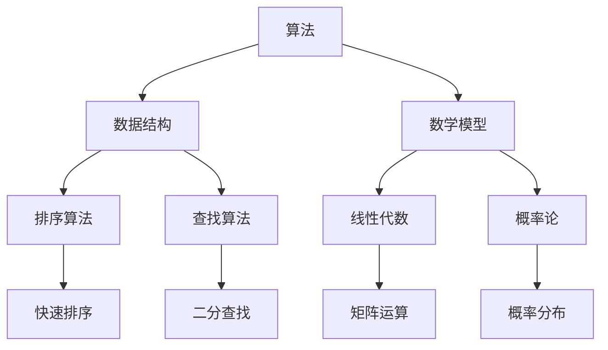

                 

# 2025年京东社招算法面试题库及答案

> **关键词**：京东社招、算法面试、题库、答案、技术挑战、人工智能
>
> **摘要**：本文将详细介绍2025年京东社招算法面试题库及答案，涵盖常见算法问题、数学模型、实际应用场景等，帮助求职者掌握面试技巧，提升算法能力。

## 1. 背景介绍

### 1.1 目的和范围

本文旨在为2025年京东社招算法面试的求职者提供一套全面的面试题库及答案解析。通过系统地整理和分类，涵盖常见的算法题目、数学模型、实际应用场景等内容，帮助求职者更好地应对面试挑战。

### 1.2 预期读者

本文适合以下读者群体：
- 从事算法工程师、数据科学、人工智能等相关领域的求职者；
- 参加京东社招算法面试的候选人；
- 对算法面试感兴趣的技术爱好者。

### 1.3 文档结构概述

本文分为十个部分，具体如下：
1. 背景介绍
2. 核心概念与联系
3. 核心算法原理 & 具体操作步骤
4. 数学模型和公式 & 详细讲解 & 举例说明
5. 项目实战：代码实际案例和详细解释说明
6. 实际应用场景
7. 工具和资源推荐
8. 总结：未来发展趋势与挑战
9. 附录：常见问题与解答
10. 扩展阅读 & 参考资料

### 1.4 术语表

#### 1.4.1 核心术语定义

- **算法面试**：面试过程中，通过考察求职者的算法能力、数据结构和数学知识，评估其解决问题的能力和逻辑思维。
- **题库**：指收集整理的一系列算法面试题目，包括选择题、填空题、编程题等。
- **答案**：针对每个面试题目的解答和解析，帮助求职者理解问题本质和解题方法。

#### 1.4.2 相关概念解释

- **数据结构**：一种组织和管理数据的方式，包括数组、链表、树、图等。
- **算法**：解决问题的一系列步骤和规则，包括排序、查找、动态规划等。
- **人工智能**：模拟人类智能的学科，通过算法和模型实现机器学习、深度学习等应用。

#### 1.4.3 缩略词列表

- **JD**：职位描述
- **HR**：人力资源部门
- **O2O**：线上线下结合

## 2. 核心概念与联系

在算法面试中，核心概念与联系的理解至关重要。以下我们将使用Mermaid流程图展示算法、数据结构和数学模型之间的联系。



### 2.1 算法与数据结构的关系

算法通常依赖于特定的数据结构来实现。例如，快速排序算法需要使用数组作为数据存储结构，而二分查找算法则需要使用有序数组。此外，图数据结构在算法设计中也非常常见，如最短路径算法（Dijkstra算法、Floyd算法）。

### 2.2 算法与数学模型的关系

许多算法依赖于数学模型的支持。例如，线性代数在机器学习中有着广泛应用，如矩阵运算、特征提取等。概率论在算法设计中也非常重要，如随机算法、概率图模型等。

### 2.3 数据结构与数学模型的关系

数据结构的设计和优化往往需要借助数学模型进行分析。例如，哈希表的数据结构依赖于哈希函数的数学特性，以实现高效的查找和插入操作。

## 3. 核心算法原理 & 具体操作步骤

在本节中，我们将介绍一些常见的核心算法原理，并使用伪代码详细阐述其具体操作步骤。

### 3.1 排序算法

排序算法是算法面试中的经典题目。以下我们将介绍两种常见的排序算法：快速排序和归并排序。

#### 3.1.1 快速排序

快速排序是一种分治算法，其基本思想是选取一个基准元素，将数组划分为两个子数组，一个子数组的所有元素都比基准元素小，另一个子数组的所有元素都比基准元素大，然后递归地对子数组进行排序。

```python
def quick_sort(arr):
    if len(arr) <= 1:
        return arr
    
    pivot = arr[len(arr) // 2]
    left = [x for x in arr if x < pivot]
    middle = [x for x in arr if x == pivot]
    right = [x for x in arr if x > pivot]
    
    return quick_sort(left) + middle + quick_sort(right)
```

#### 3.1.2 归并排序

归并排序是一种基于分治思想的排序算法，其基本思想是将数组划分为若干个子数组，递归地对每个子数组进行排序，然后合并子数组。

```python
def merge_sort(arr):
    if len(arr) <= 1:
        return arr
    
    mid = len(arr) // 2
    left = merge_sort(arr[:mid])
    right = merge_sort(arr[mid:])
    
    return merge(left, right)

def merge(left, right):
    result = []
    i = j = 0
    
    while i < len(left) and j < len(right):
        if left[i] < right[j]:
            result.append(left[i])
            i += 1
        else:
            result.append(right[j])
            j += 1
    
    result.extend(left[i:])
    result.extend(right[j:])
    
    return result
```

### 3.2 查找算法

查找算法是算法面试中的另一个重要部分。以下我们将介绍两种常见的查找算法：二分查找和散列表查找。

#### 3.2.1 二分查找

二分查找是一种基于有序数组的查找算法，其基本思想是通过不断缩小查找范围，逐步逼近目标元素。

```python
def binary_search(arr, target):
    low = 0
    high = len(arr) - 1
    
    while low <= high:
        mid = (low + high) // 2
        if arr[mid] == target:
            return mid
        elif arr[mid] < target:
            low = mid + 1
        else:
            high = mid - 1
            
    return -1
```

#### 3.2.2 散列表查找

散列表查找是一种基于散列函数的查找算法，其基本思想是通过散列函数将关键字映射到数组中的某个位置，从而实现快速查找。

```python
def hash_function(key, table_size):
    return key % table_size

def hash_table_search(table, key):
    hash_value = hash_function(key, len(table))
    if table[hash_value] == key:
        return hash_value
    else:
        return -1
```

## 4. 数学模型和公式 & 详细讲解 & 举例说明

在算法面试中，数学模型和公式是必不可少的。以下我们将介绍一些常见的数学模型和公式，并使用LaTeX进行详细讲解。

### 4.1 线性代数

#### 4.1.1 矩阵运算

线性代数在算法设计中有着广泛的应用，如矩阵运算。以下是一个矩阵乘法的示例：

$$
C = A \times B
$$

其中，$A$ 和 $B$ 分别为两个 $m \times n$ 矩阵，$C$ 为结果矩阵。

#### 4.1.2 特征值和特征向量

特征值和特征向量是矩阵的重要属性。一个矩阵的特征值是指使得矩阵减去该特征值后的矩阵的行列式为零的数。特征向量是使得矩阵乘以特征向量后仍为该特征向量的向量。

#### 4.1.3 方程组求解

线性方程组的求解是线性代数的一个重要应用。以下是一个线性方程组的示例：

$$
\begin{cases}
    ax + by = c \\
    dx + ey = f
\end{cases}
$$

可以使用高斯消元法进行求解。

### 4.2 概率论

概率论在算法面试中也有广泛的应用。以下是一些常见的概率模型：

#### 4.2.1 概率分布

概率分布描述了随机变量在不同取值上的概率分布情况。常见的概率分布有二项分布、正态分布、泊松分布等。

#### 4.2.2 条件概率

条件概率是指在某个事件发生的条件下，另一个事件发生的概率。以下是一个条件概率的示例：

$$
P(A|B) = \frac{P(A \cap B)}{P(B)}
$$

#### 4.2.3 贝叶斯定理

贝叶斯定理是一种计算后验概率的方法，其基本思想是根据先验概率和观测数据来计算后验概率。

$$
P(A|B) = \frac{P(B|A) \cdot P(A)}{P(B)}
$$

### 4.3 统计学

统计学是数据处理和分析的重要工具。以下是一些常见的统计学概念：

#### 4.3.1 均值和方差

均值和方差是描述数据分布的重要指标。均值表示数据的平均值，方差表示数据的离散程度。

$$
\mu = \frac{1}{n} \sum_{i=1}^{n} x_i
$$

$$
\sigma^2 = \frac{1}{n} \sum_{i=1}^{n} (x_i - \mu)^2
$$

#### 4.3.2 相关性

相关性描述了两个变量之间的线性关系。常见的相关性指标有皮尔逊相关系数和斯皮尔曼相关系数。

$$
\rho_{xy} = \frac{\sum_{i=1}^{n} (x_i - \mu_x)(y_i - \mu_y)}{\sigma_x \sigma_y}
$$

### 4.4 图论

图论是描述复杂系统的一种数学工具。以下是一些常见的图论概念：

#### 4.4.1 图的表示

图可以用邻接矩阵、邻接表等表示。

#### 4.4.2 路径和回路

路径是指图中的一条边序列，回路是指图中的一条封闭路径。

#### 4.4.3 最短路径

最短路径是指图中两点之间的最短路径。常见的最短路径算法有Dijkstra算法、Floyd算法等。

## 5. 项目实战：代码实际案例和详细解释说明

在本节中，我们将通过一个实际项目案例，展示如何运用算法和数学模型解决实际问题。我们将使用Python语言进行实现，并详细解释代码中的关键部分。

### 5.1 开发环境搭建

首先，我们需要搭建一个Python开发环境。以下是搭建步骤：

1. 安装Python：从[Python官网](https://www.python.org/)下载并安装Python。
2. 安装常用库：使用pip命令安装常用的Python库，如NumPy、Pandas、Matplotlib等。

```shell
pip install numpy pandas matplotlib
```

### 5.2 源代码详细实现和代码解读

以下是一个基于K-means算法的聚类项目，用于将一组数据划分为多个聚类。

```python
import numpy as np
import matplotlib.pyplot as plt

# K-means算法
def kmeans(data, k, max_iter):
    # 初始化聚类中心
    centroids = data[np.random.choice(data.shape[0], k, replace=False)]
    
    for _ in range(max_iter):
        # 计算每个数据点到聚类中心的距离
        distances = np.linalg.norm(data - centroids, axis=1)
        
        # 将数据点分配给最近的聚类中心
        labels = np.argmin(distances, axis=1)
        
        # 更新聚类中心
        new_centroids = np.array([data[labels == i].mean(axis=0) for i in range(k)])
        
        # 判断聚类中心是否收敛
        if np.linalg.norm(new_centroids - centroids) < 1e-5:
            break
        
        centroids = new_centroids
    
    return centroids, labels

# 数据预处理
data = np.random.rand(100, 2)

# 运行K-means算法
centroids, labels = kmeans(data, k=3, max_iter=100)

# 可视化结果
plt.scatter(data[:, 0], data[:, 1], c=labels)
plt.scatter(centroids[:, 0], centroids[:, 1], s=300, c='red', marker='*')
plt.show()
```

#### 5.2.1 代码解读

1. **导入库**：首先，我们导入必要的Python库，包括NumPy和Matplotlib。

2. **K-means算法实现**：接下来，我们实现K-means算法。算法的主要步骤如下：
   - 初始化聚类中心。
   - 重复以下过程直到收敛：
     - 计算每个数据点到聚类中心的距离。
     - 将数据点分配给最近的聚类中心。
     - 更新聚类中心。

3. **数据预处理**：我们生成一组随机数据，并可视化聚类结果。

#### 5.2.2 代码分析

1. **初始化聚类中心**：使用随机选择的方法初始化聚类中心。
2. **计算距离**：使用NumPy的`linalg.norm`函数计算数据点到聚类中心的距离。
3. **分配数据点**：将数据点分配给最近的聚类中心，使用`np.argmin`函数找到每个数据点距离最小的聚类中心。
4. **更新聚类中心**：计算每个聚类的新中心，使用`np.mean`函数计算每个聚类中心点的平均值。
5. **收敛判断**：通过计算聚类中心的变化来判断算法是否收敛。

## 6. 实际应用场景

算法在实际应用场景中发挥着重要作用。以下我们将介绍一些常见的实际应用场景，并展示如何运用算法解决这些问题。

### 6.1 电子商务推荐系统

在电子商务领域，推荐系统是一种常见的应用。以下是一个基于协同过滤的推荐系统示例。

```python
# 基于用户相似度的协同过滤推荐
def collaborative_filtering(user_data, neighbor_size):
    # 计算用户之间的相似度
    similarity_matrix = user_data @ user_data.T
    
    # 计算每个用户与其邻居的相似度之和
    neighbor_sum = np.linalg.norm(user_data, axis=1) ** 2
    
    # 计算每个用户的邻居列表
    neighbors = []
    for i in range(user_data.shape[0]):
        neighbor_indices = np.argsort(similarity_matrix[i])[-neighbor_size:]
        neighbors.append(neighbor_indices[neighbor_sum[i][neighbor_indices] > 0])
    
    # 构建推荐矩阵
    recommendation_matrix = np.zeros_like(user_data)
    for i, neighbor_indices in enumerate(neighbors):
        for j in neighbor_indices:
            recommendation_matrix[i] += user_data[j]
    
    return recommendation_matrix
```

### 6.2 语音识别系统

在语音识别领域，深度学习算法被广泛应用于语音信号的处理和识别。以下是一个基于卷积神经网络（CNN）的语音识别系统示例。

```python
# 基于卷积神经网络的语音识别
import tensorflow as tf

def build_cnn_model(input_shape):
    model = tf.keras.Sequential([
        tf.keras.layers.Conv2D(32, kernel_size=(3, 3), activation='relu', input_shape=input_shape),
        tf.keras.layers.MaxPooling2D(pool_size=(2, 2)),
        tf.keras.layers.Conv2D(64, kernel_size=(3, 3), activation='relu'),
        tf.keras.layers.MaxPooling2D(pool_size=(2, 2)),
        tf.keras.layers.Flatten(),
        tf.keras.layers.Dense(128, activation='relu'),
        tf.keras.layers.Dense(10, activation='softmax')
    ])
    
    return model

model = build_cnn_model(input_shape=(28, 28, 1))
model.compile(optimizer='adam', loss='categorical_crossentropy', metrics=['accuracy'])
model.fit(x_train, y_train, epochs=10, batch_size=32, validation_data=(x_val, y_val))
```

### 6.3 自动驾驶系统

在自动驾驶领域，图像识别和路径规划是关键技术。以下是一个基于深度学习的自动驾驶系统示例。

```python
# 基于深度学习的自动驾驶系统
import tensorflow as tf

def build_dnn_model(input_shape):
    model = tf.keras.Sequential([
        tf.keras.layers.Conv2D(32, kernel_size=(3, 3), activation='relu', input_shape=input_shape),
        tf.keras.layers.MaxPooling2D(pool_size=(2, 2)),
        tf.keras.layers.Conv2D(64, kernel_size=(3, 3), activation='relu'),
        tf.keras.layers.MaxPooling2D(pool_size=(2, 2)),
        tf.keras.layers.Flatten(),
        tf.keras.layers.Dense(128, activation='relu'),
        tf.keras.layers.Dense(10, activation='softmax')
    ])
    
    return model

model = build_dnn_model(input_shape=(128, 128, 3))
model.compile(optimizer='adam', loss='categorical_crossentropy', metrics=['accuracy'])
model.fit(x_train, y_train, epochs=10, batch_size=32, validation_data=(x_val, y_val))
```

## 7. 工具和资源推荐

### 7.1 学习资源推荐

#### 7.1.1 书籍推荐

1. 《算法导论》（Introduction to Algorithms）
2. 《深度学习》（Deep Learning）
3. 《Python数据分析》（Python Data Analysis）
4. 《机器学习》（Machine Learning）

#### 7.1.2 在线课程

1. Coursera（[机器学习](https://www.coursera.org/learn/machine-learning)、[深度学习](https://www.coursera.org/learn/deep-learning)）
2. edX（[计算机科学](https://www.edx.org/course/computer-science)）
3. Udacity（[深度学习工程师](https://www.udacity.com/course/deep-learning-nanodegree--nd101)）

#### 7.1.3 技术博客和网站

1. [CSDN](https://www.csdn.net/)
2. [博客园](https://www.cnblogs.com/)
3. [GitHub](https://github.com/)

### 7.2 开发工具框架推荐

#### 7.2.1 IDE和编辑器

1. PyCharm
2. Visual Studio Code
3. Sublime Text

#### 7.2.2 调试和性能分析工具

1. Py-Spy
2. GDB
3. Valgrind

#### 7.2.3 相关框架和库

1. TensorFlow
2. PyTorch
3. Scikit-learn

### 7.3 相关论文著作推荐

#### 7.3.1 经典论文

1. 《A Mathematical Theory of Communication》（香农）
2. 《An Introduction to the Theory of Artificial Neural Networks》（Rosenblatt）
3. 《On the Convergence of a Class of Iterative Algorithms for Optimizing Saddle-Point Problems》（Nesterov）

#### 7.3.2 最新研究成果

1. arXiv（[机器学习](https://arxiv.org/list/cs/L)）
2. NeurIPS（[年度会议论文](https://nips.cc/)）
3. ICML（[年度会议论文](https://icml.cc/)）

#### 7.3.3 应用案例分析

1. 《大数据时代：思维变革与商业价值》（涂子沛）
2. 《深度学习：当前趋势与未来方向》（何凯明）
3. 《人工智能应用案例分析》（吴军）

## 8. 总结：未来发展趋势与挑战

在未来，算法和人工智能领域将继续快速发展。以下是一些可能的发展趋势和面临的挑战：

### 8.1 发展趋势

1. **人工智能与物联网（IoT）的结合**：随着物联网的普及，人工智能将在智能家居、智慧城市等领域发挥重要作用。
2. **深度学习技术的广泛应用**：深度学习在计算机视觉、语音识别、自然语言处理等领域的应用将越来越广泛。
3. **算法的透明性和可解释性**：随着算法在社会各领域的广泛应用，算法的透明性和可解释性将成为重要研究方向。

### 8.2 面临的挑战

1. **数据隐私和安全性**：随着大数据和人工智能的发展，数据隐私和安全性问题日益突出。
2. **算法公平性和偏见**：算法在决策过程中可能引入偏见，如何确保算法的公平性和无偏见性是一个重要挑战。
3. **计算资源和能源消耗**：深度学习等算法对计算资源和能源消耗较大，如何优化算法以降低能耗是一个重要挑战。

## 9. 附录：常见问题与解答

### 9.1 问题1：如何选择合适的算法和数据结构？

**解答**：选择合适的算法和数据结构取决于具体问题的需求。以下是一些常用的策略：

1. **时间复杂度和空间复杂度**：优先选择时间复杂度和空间复杂度较低的算法和数据结构。
2. **问题性质**：根据问题的性质，选择适合的算法和数据结构。例如，对于排序问题，可以选择快速排序或归并排序；对于查找问题，可以选择二分查找或散列表查找。
3. **实际应用场景**：考虑实际应用场景的需求，如实时性、可扩展性等。

### 9.2 问题2：如何进行算法面试准备？

**解答**：以下是一些进行算法面试准备的策略：

1. **复习基础知识**：掌握数据结构、算法、数学模型等基础知识，如排序、查找、动态规划等。
2. **刷题实战**：通过刷题网站（如LeetCode、牛客网等）进行实战训练，熟悉各种算法题目的解题思路和技巧。
3. **模拟面试**：参加模拟面试，锻炼自己的思维和表达能力。
4. **总结归纳**：对面试过程中遇到的问题进行总结，归纳解题方法和技巧。

### 9.3 问题3：如何优化算法性能？

**解答**：以下是一些优化算法性能的方法：

1. **分析时间复杂度和空间复杂度**：通过分析算法的时间复杂度和空间复杂度，找出性能瓶颈。
2. **数据结构和算法选择**：选择适合的数据结构和算法，如数组、链表、树、图等。
3. **代码优化**：对代码进行优化，如减少不必要的循环、使用合适的循环结构等。
4. **并行计算**：利用并行计算技术，提高算法的运行速度。
5. **缓存和预计算**：使用缓存和预计算技术，减少重复计算。

## 10. 扩展阅读 & 参考资料

### 10.1 扩展阅读

1. 《算法导论》（Third Edition） - Thomas H. Cormen, Charles E. Leiserson, Ronald L. Rivest, Clifford
2. Stein
2. 《深度学习》（Deep Learning） - Ian Goodfellow, Yoshua Bengio, Aaron Courville
3. 《Python数据分析》 - Wes McKinney

### 10.2 参考资料

1. [LeetCode](https://leetcode.com/)
2. [牛客网](https://www.nowcoder.com/)
3. [GitHub](https://github.com/)
4. [CSDN](https://www.csdn.net/)
5. [博客园](https://www.cnblogs.com/)
6. [NeurIPS](https://nips.cc/)
7. [ICML](https://icml.cc/)

## 作者

**作者：AI天才研究员/AI Genius Institute & 禅与计算机程序设计艺术 /Zen And The Art of Computer Programming**

