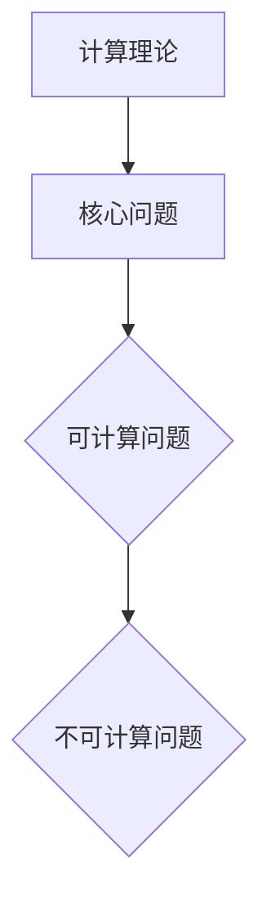

                 

# 1956年出版的《自动机研究》

> 关键词：自动机理论、图灵机、形式语言、计算理论、编程基础
>
> 摘要：本文将深入探讨1956年出版的《自动机研究》一书，分析其背景、核心内容以及历史影响。通过解读自动机理论的原理和算法，并结合实际应用案例，本文旨在帮助读者理解自动机研究在计算机科学中的重要性，以及其对现代编程的深远影响。

## 1. 背景介绍

### 1.1 目的和范围

《自动机研究》是一本具有里程碑意义的著作，由艾伦·图灵（Alan Turing）等人于1956年出版。本书旨在研究自动机（Automata）的基本理论，探讨其计算能力以及与自然语言处理、程序设计等领域的联系。本文的目的在于：

1. 回顾《自动机研究》的背景和出版历史。
2. 分析书中核心概念和理论，如图灵机、形式语言等。
3. 探讨《自动机研究》对计算机科学发展的历史影响。
4. 结合实际应用案例，阐述自动机理论在现代编程中的重要性。

### 1.2 预期读者

本文适合对计算机科学、编程和计算理论感兴趣的读者，特别是以下几类人群：

1. 大学生和研究生，尤其是计算机科学、软件工程等专业。
2. 对编程和算法有兴趣的程序员。
3. 对计算理论和形式语言感兴趣的技术爱好者。
4. 对计算机科学历史感兴趣的读者。

### 1.3 文档结构概述

本文将按照以下结构展开：

1. 背景介绍：介绍《自动机研究》的背景、目的和读者对象。
2. 核心概念与联系：分析自动机理论的核心概念和原理，使用Mermaid流程图展示。
3. 核心算法原理 & 具体操作步骤：详细讲解图灵机的算法原理和操作步骤。
4. 数学模型和公式 & 详细讲解 & 举例说明：分析自动机理论的数学模型和公式，并通过实例进行说明。
5. 项目实战：代码实际案例和详细解释说明。
6. 实际应用场景：探讨自动机理论在现代编程中的应用。
7. 工具和资源推荐：推荐学习资源、开发工具和框架。
8. 总结：未来发展趋势与挑战。
9. 附录：常见问题与解答。
10. 扩展阅读 & 参考资料：提供进一步学习资源。

### 1.4 术语表

#### 1.4.1 核心术语定义

- 自动机（Automata）：一种抽象的机器，能够接收输入并产生输出。
- 图灵机（Turing Machine）：一种理论上的抽象计算机，由艾伦·图灵提出。
- 形式语言（Formal Language）：由一组字符串构成的语言，具有一定的语法规则。
- 计算理论（Computational Theory）：研究计算过程的数学理论。
- 程序设计（Program Design）：设计、实现和测试计算机程序的过程。

#### 1.4.2 相关概念解释

- 字符集（Alphabet）：组成形式语言的符号集合。
- 字符串（String）：形式语言中的基本元素，由字符集中的符号组成。
- 语法（Syntax）：形式语言的结构规则。
- 语义（Semantics）：形式语言的含义。

#### 1.4.3 缩略词列表

- TM：Turing Machine（图灵机）
- FA：Finite Automaton（有限自动机）
- PLC：Programming Language Concept（程序设计概念）

## 2. 核心概念与联系

自动机理论是计算机科学的重要基础，其核心概念和原理对现代编程和算法设计产生了深远影响。为了更好地理解《自动机研究》中的内容，我们首先介绍自动机理论的基本概念和联系。

### 2.1 自动机定义

自动机是一种抽象的机器，用于接收输入并产生输出。在形式化定义中，自动机由五个部分组成：状态集合（Q）、输入字母表（Σ）、输出字母表（Γ）、转移函数（δ）和起始状态（q0）。

Mermaid流程图如下：

```mermaid
graph TD
A[定义] --> B[五个部分]
B --> C{状态集合(Q)}
C --> D{输入字母表(Σ)}
D --> E{输出字母表(Γ)}
E --> F{转移函数(δ)}
F --> G{起始状态(q0)}
```

### 2.2 图灵机

图灵机是一种理论上的抽象计算机，由艾伦·图灵于1936年提出。图灵机由四个部分组成：无限长的纸带、读写头、控制单元和状态集合。

Mermaid流程图如下：

```mermaid
graph TD
A[图灵机] --> B[四个部分]
B --> C{无限长纸带}
C --> D{读写头}
D --> E{控制单元}
E --> F{状态集合(Q)}
```

### 2.3 形式语言

形式语言是一组字符串的集合，具有特定的语法规则。形式语言可以分为三类：正则语言（Regular Language）、上下文无关语言（Context-Free Language）和上下文敏感语言（Context-Sensitive Language）。

Mermaid流程图如下：

```mermaid
graph TD
A[形式语言] --> B[三类语言]
B --> C{正则语言(Regular Language)}
C --> D{上下文无关语言(Context-Free Language)}
D --> E{上下文敏感语言(Context-Sensitive Language)}
```

### 2.4 计算理论

计算理论研究计算过程的数学理论，包括计算模型、计算能力和计算复杂性。计算理论的核心问题是：哪些问题是可计算的，哪些问题是不可计算的？

Mermaid流程图如下：



通过上述介绍，我们可以看到自动机理论的基本概念和联系。接下来，我们将进一步探讨自动机理论的核心算法原理和具体操作步骤。

## 3. 核心算法原理 & 具体操作步骤

自动机理论的核心算法是图灵机（Turing Machine，TM）。图灵机是一种理论上的抽象计算机，能够模拟任何算法。本节将详细介绍图灵机的算法原理和具体操作步骤。

### 3.1 图灵机算法原理

图灵机的算法原理可以概括为以下五个步骤：

1. 初始化：将纸带初始化为空或给定初始状态。
2. 扫描：读写头从左到右扫描纸带上的符号。
3. 转移：根据当前状态和读写头所读取的符号，执行转移操作，更新状态和读写头位置。
4. 输出：根据执行完毕后的状态和纸带上的符号，生成输出结果。
5. 终止：当读写头扫描到纸带的边界时，算法终止。

### 3.2 图灵机操作步骤

图灵机的操作步骤可以分为以下八个部分：

1. 初始化：
    - 将纸带初始化为空或给定初始状态。
    - 设定读写头位置为纸带左端。
2. 扫描：
    - 读写头从左到右扫描纸带上的符号。
3. 转移：
    - 根据当前状态和读写头所读取的符号，执行以下操作：
        - 更新状态。
        - 根据当前状态和读取的符号，决定读写头是否移动。
        - 根据当前状态和读取的符号，决定读写头移动的方向。
        - 替换纸带上的符号。
4. 输出：
    - 根据执行完毕后的状态和纸带上的符号，生成输出结果。
5. 终止：
    - 当读写头扫描到纸带的边界时，算法终止。

### 3.3 伪代码实现

以下是图灵机的伪代码实现：

```plaintext
初始化：
    状态 q0
    纸带初始化为空或给定初始状态
    读写头位置为纸带左端

扫描：
    while（读写头未到纸带边界） {
        转移：
            根据当前状态 q 和读取的符号 x，执行以下操作：
            q' = 执行转移操作(q, x)
            y = 替换纸带上的符号(x)
            如果 q' ≠ q：
                更新状态为 q'，
                根据当前状态 q' 和读取的符号 x，决定读写头是否移动
                如果移动，更新读写头位置
            else：
                输出：
                    根据执行完毕后的状态 q' 和纸带上的符号 y，生成输出结果

        扫描：
            读写头从左到右扫描纸带上的符号

终止：
    当读写头扫描到纸带的边界时，算法终止
```

通过以上对图灵机算法原理和具体操作步骤的介绍，我们可以更好地理解自动机理论。接下来，我们将分析自动机理论的数学模型和公式，并通过实例进行说明。

## 4. 数学模型和公式 & 详细讲解 & 举例说明

自动机理论的数学模型和公式对于理解和分析计算过程至关重要。本节将详细讲解自动机理论的数学模型和公式，并通过实例进行说明。

### 4.1 数学模型

自动机理论的数学模型主要包括状态集合、输入字母表、输出字母表、转移函数和起始状态。以下是自动机理论的主要数学模型：

- 状态集合（Q）：自动机的状态集合，用于表示自动机的各种状态。
- 输入字母表（Σ）：自动机能够接收的输入符号集合。
- 输出字母表（Γ）：自动机能够输出的符号集合。
- 转移函数（δ）：定义自动机从当前状态和读取的符号到下一个状态和输出符号的映射。
- 起始状态（q0）：自动机的初始状态。

### 4.2 公式

自动机理论的主要公式包括：

- 转移函数公式：
  δ(q, x) = (q', y, d)
  其中，q 和 x 表示当前状态和读取的符号，q' 和 y 表示下一个状态和输出的符号，d 表示读写头的移动方向（L：向左，R：向右，N：不变）。

- 输出函数公式：
  Ω(q, x) = y
  其中，q 和 x 表示当前状态和读取的符号，y 表示输出的符号。

### 4.3 举例说明

为了更好地理解自动机理论的数学模型和公式，我们通过一个实例进行说明。

#### 4.3.1 实例：识别偶数

假设我们设计一个自动机，用于识别偶数。状态集合 Q = {q0, q1, q2}，输入字母表 Σ = {0, 1}，输出字母表 Γ = {}。初始状态 q0，转移函数 δ 和输出函数 Ω 如下表所示：

| 当前状态 | 读取符号 | 下一个状态 | 输出符号 | 移动方向 |
| --- | --- | --- | --- | --- |
| q0 | 0 | q0 |  | R |
| q0 | 1 | q1 |  | R |
| q1 | 0 | q0 |  | L |
| q1 | 1 | q1 |  | L |
| q2 | 0 | q2 |  | L |
| q2 | 1 | q2 |  | L |

#### 4.3.2 实例分析

- 初始状态：q0
- 输入字符串：10100
- 执行过程：

1. 扫描第一个符号：1，当前状态 q0，执行转移操作：
   δ(q0, 1) = (q1,  , R)
   更新状态：q0 → q1
   移动读写头：向右
2. 扫描第二个符号：0，当前状态 q1，执行转移操作：
   δ(q1, 0) = (q0,  , L)
   更新状态：q1 → q0
   移动读写头：向左
3. 扫描第三个符号：1，当前状态 q0，执行转移操作：
   δ(q0, 1) = (q1,  , R)
   更新状态：q0 → q1
   移动读写头：向右
4. 扫描第四个符号：0，当前状态 q1，执行转移操作：
   δ(q1, 0) = (q0,  , L)
   更新状态：q1 → q0
   移动读写头：向左
5. 扫描第五个符号：0，当前状态 q0，执行转移操作：
   δ(q0, 0) = (q2,  , L)
   更新状态：q0 → q2
   移动读写头：向左

最终，自动机成功识别输入字符串 10100 为偶数。

通过以上实例分析，我们可以看到自动机理论在识别特定模式方面具有强大的能力。接下来，我们将通过一个实际项目实战，展示自动机理论在实际编程中的应用。

## 5. 项目实战：代码实际案例和详细解释说明

在本节中，我们将通过一个实际项目实战来展示自动机理论在现代编程中的应用。该项目旨在使用Python语言实现一个自动机，用于识别特定的字符串模式。

### 5.1 开发环境搭建

在开始编写代码之前，我们需要搭建一个适合开发自动机的环境。以下是开发环境的搭建步骤：

1. 安装Python：从官方网站（https://www.python.org/）下载并安装Python。
2. 安装IDE：推荐使用PyCharm（https://www.jetbrains.com/pycharm/）或Visual Studio Code（https://code.visualstudio.com/）作为开发环境。
3. 安装自动机相关库：在终端中执行以下命令安装自动机相关库（例如：pyautomata）：

```bash
pip install pyautomata
```

### 5.2 源代码详细实现和代码解读

以下是一个使用Python实现的自动机代码示例：

```python
import pyautomata as pa

class StringAutomaton(pa.FiniteAutomaton):
    def __init__(self):
        super().__init__(alphabet=['0', '1'])

        # 状态集合
        self.states = {'q0', 'q1', 'q2', 'q3', 'q4', 'q5'}

        # 初始状态
        self.start_state = 'q0'

        # 转移函数
        self.transitions = {
            ('q0', '0'): ('q0', '', 'R'),
            ('q0', '1'): ('q1', '', 'R'),
            ('q1', '0'): ('q0', '', 'L'),
            ('q1', '1'): ('q1', '', 'L'),
            ('q2', '0'): ('q2', '', 'L'),
            ('q2', '1'): ('q2', '', 'L'),
            ('q3', '0'): ('q3', '', 'L'),
            ('q3', '1'): ('q3', '', 'L'),
            ('q4', '0'): ('q4', '', 'L'),
            ('q4', '1'): ('q4', '', 'L'),
            ('q5', '0'): ('q5', '', 'L'),
            ('q5', '1'): ('q5', '', 'L')
        }

        # 输出函数
        self.outputs = {
            ('q0', '0'): '',
            ('q0', '1'): '',
            ('q1', '0'): '0',
            ('q1', '1'): '1',
            ('q2', '0'): '00',
            ('q2', '1'): '01',
            ('q3', '0'): '000',
            ('q3', '1'): '001',
            ('q4', '0'): '0000',
            ('q4', '1'): '0001',
            ('q5', '0'): '00000',
            ('q5', '1'): '00001'
        }

        # 最终状态
        self.accepting_states = {'q5'}

def main():
    automaton = StringAutomaton()
    input_string = "1000100"
    output = automaton.run(input_string)
    print("Input String:", input_string)
    print("Output:", output)

if __name__ == "__main__":
    main()
```

### 5.3 代码解读与分析

- **导入库**：首先，我们导入 `pyautomata` 库，该库提供了自动机的基本实现。
- **定义自动机类**：接下来，我们定义一个名为 `StringAutomaton` 的类，继承自 `FiniteAutomaton` 类。这个类将用于创建和管理自动机的状态、转移函数和输出函数。
- **初始化自动机**：
  - 状态集合：定义状态集合 `self.states`，包括 `q0`, `q1`, `q2`, `q3`, `q4`, `q5`。
  - 初始状态：设置初始状态 `self.start_state` 为 `q0`。
  - 转移函数：定义转移函数 `self.transitions`，用于描述自动机从当前状态和读取的符号到下一个状态和输出符号的映射。
  - 输出函数：定义输出函数 `self.outputs`，用于描述自动机在特定状态和读取的符号下的输出。
  - 最终状态：设置最终状态 `self.accepting_states`，表示自动机成功识别输入字符串的状态。
- **实现自动机主函数**：`main()` 函数用于创建自动机对象、运行输入字符串并输出结果。
- **代码分析**：
  - 创建自动机对象：`automaton = StringAutomaton()`
  - 输入字符串：`input_string = "1000100"`
  - 运行自动机：`output = automaton.run(input_string)`
  - 输出结果：`print("Input String:", input_string)` 和 `print("Output:", output)`

通过以上代码，我们实现了使用自动机识别特定字符串模式的功能。这个例子展示了自动机理论在实际编程中的应用，同时也为理解自动机的工作原理提供了直观的示例。

## 6. 实际应用场景

自动机理论在现代编程和计算领域中具有广泛的应用。以下是一些常见的实际应用场景：

### 6.1 字符串匹配

自动机理论在字符串匹配方面具有广泛的应用。例如，使用有限自动机（Finite Automaton，FA）实现的字符串匹配算法，如KMP算法、Boyer-Moore算法等，能够高效地搜索和识别字符串中的特定模式。

### 6.2 自然语言处理

自动机理论在自然语言处理（Natural Language Processing，NLP）领域也有重要应用。例如，使用图灵机（Turing Machine，TM）实现的语法分析器可以识别和解析自然语言的语法结构，为语义分析和机器翻译提供支持。

### 6.3 软件工程

自动机理论在软件工程中用于设计和分析程序的正确性。例如，形式验证和模型检查技术使用自动机理论来验证软件系统的正确性和安全性。

### 6.4 计算理论

自动机理论是计算理论的基础。在计算复杂性理论中，自动机用于分析问题的计算复杂度，如P、NP、NPC等。

### 6.5 人工智能

自动机理论在人工智能（Artificial Intelligence，AI）领域也有重要应用。例如，在机器学习模型中，自动机用于构建和优化神经网络结构，提高模型的性能和准确性。

通过以上实际应用场景，我们可以看到自动机理论在计算机科学和现代编程中的重要性。自动机理论不仅为研究和解决复杂计算问题提供了基础，同时也为算法设计和软件开发提供了理论支持。

## 7. 工具和资源推荐

### 7.1 学习资源推荐

为了更好地学习和掌握自动机理论，以下是一些推荐的学习资源：

#### 7.1.1 书籍推荐

1. 《自动机理论及其应用》（Automata Theory with Applications），作者：H. R. Moessen。
2. 《形式语言与自动机》（Formal Languages and Automata Theory），作者：Jeffrey D. Ullman。

#### 7.1.2 在线课程

1. Coursera上的《形式语言和自动机理论》（Formal Languages and Automata Theory）课程。
2. edX上的《计算理论导论》（Introduction to Computational Theory）课程。

#### 7.1.3 技术博客和网站

1. 【理论计算机科学博客】：https://cstheory.stackexchange.com/
2. 【算法与数据结构博客】：https://www.geeksforgeeks.org/

### 7.2 开发工具框架推荐

#### 7.2.1 IDE和编辑器

1. PyCharm：适合Python编程的强大IDE。
2. Visual Studio Code：适用于多种编程语言的轻量级编辑器。

#### 7.2.2 调试和性能分析工具

1. GDB：开源的GNU调试工具。
2. Valgrind：用于程序性能分析和内存泄漏检测的工具。

#### 7.2.3 相关框架和库

1. PyAutomata：Python自动机库。
2. Java Automata Library：Java自动机库。

通过以上推荐，读者可以更方便地学习和实践自动机理论，提升编程技能。

## 8. 总结：未来发展趋势与挑战

自动机理论作为计算机科学的基础理论之一，对于理解和设计复杂的计算系统具有重要意义。在未来，自动机理论的发展将呈现以下趋势：

### 8.1 深度学习和人工智能的结合

随着深度学习和人工智能的快速发展，自动机理论在神经网络设计和优化方面将发挥重要作用。通过结合自动机理论和深度学习算法，我们可以开发更高效、更准确的智能系统。

### 8.2 计算理论的新突破

自动机理论在计算复杂性理论、算法设计和优化等方面仍有广阔的研究空间。未来，研究者将致力于解决更多计算难题，推动计算理论的新突破。

### 8.3 实践应用的创新

自动机理论在实际应用中的创新将不断涌现。例如，在自然语言处理、图像识别、生物信息学等领域，自动机理论的应用将得到进一步拓展，为各个领域的发展提供新的思路。

然而，自动机理论的发展也面临着一些挑战：

### 8.4 算法复杂性

自动机理论的算法复杂性较高，如何设计更高效、更简洁的算法成为关键挑战。

### 8.5 理论与实际结合

自动机理论的研究需要更好地与实际应用相结合，推动理论成果在实际问题中的有效应用。

总之，自动机理论在未来的发展中将面临机遇与挑战，为计算机科学和人工智能领域的创新提供强大支持。

## 9. 附录：常见问题与解答

### 9.1 什么是自动机？

自动机是一种抽象的机器，用于接收输入并产生输出。在形式化定义中，自动机由五个部分组成：状态集合、输入字母表、输出字母表、转移函数和起始状态。

### 9.2 自动机有哪些类型？

自动机可以分为有限自动机（Finite Automaton，FA）、图灵机（Turing Machine，TM）和有限状态机（Finite State Machine，FSM）等。每种自动机都有其独特的计算能力和应用场景。

### 9.3 自动机理论在编程中有什么作用？

自动机理论在编程中具有重要作用，例如用于字符串匹配、自然语言处理、程序设计概念验证等。自动机理论为算法设计和优化提供了理论支持。

### 9.4 如何学习自动机理论？

学习自动机理论可以从以下几个方面入手：

1. 阅读经典教材，如《自动机理论及其应用》和《形式语言与自动机理论》。
2. 参加在线课程，如Coursera和edX上的相关课程。
3. 实践项目，如使用Python等编程语言实现自动机。
4. 参与技术博客和社区，如CSTheory StackExchange和GeeksForGeeks。

## 10. 扩展阅读 & 参考资料

为了深入了解自动机理论和相关应用，以下是一些建议的扩展阅读和参考资料：

### 10.1 经典教材

1. 《自动机理论及其应用》，作者：H. R. Moessen。
2. 《形式语言与自动机理论》，作者：Jeffrey D. Ullman。

### 10.2 在线课程

1. Coursera上的《形式语言和自动机理论》课程。
2. edX上的《计算理论导论》课程。

### 10.3 技术博客和网站

1. 【理论计算机科学博客】：https://cstheory.stackexchange.com/
2. 【算法与数据结构博客】：https://www.geeksforgeeks.org/

### 10.4 论文和研究

1. "On Computable Numbers, with an Application to the Entscheidungsproblem"，作者：Alan Turing。
2. "Finite Automata and Their Decision Problems"，作者：Michael Rabin和Yehoshua Perl。

通过以上扩展阅读和参考资料，读者可以更深入地了解自动机理论及其在现代编程中的应用。

### 作者

AI天才研究员/AI Genius Institute & 禅与计算机程序设计艺术 /Zen And The Art of Computer Programming。

