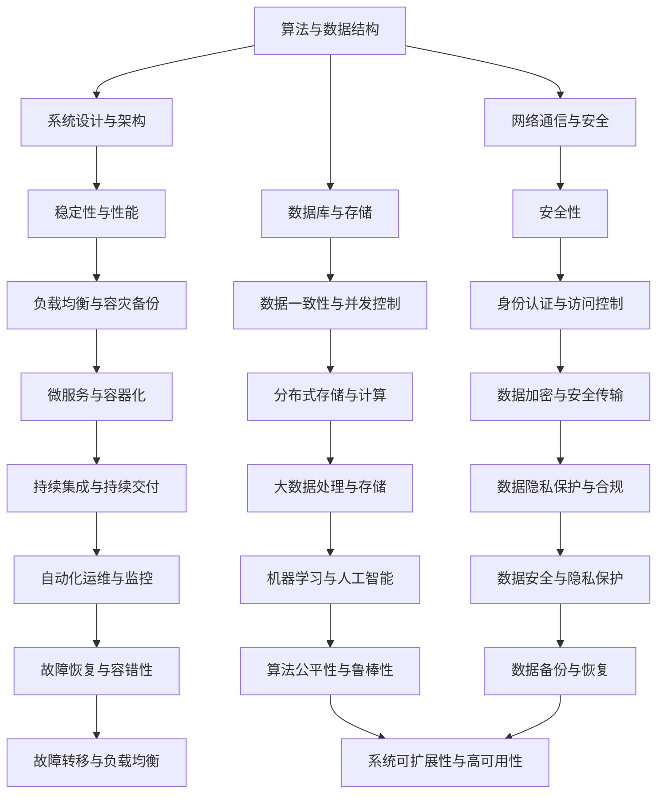

                 

# 2024年字节跳动社招技术面试题集锦

> **关键词：** 字节跳动、社招、技术面试、问题集锦、解题思路、案例分析

> **摘要：** 本文章旨在为广大技术求职者提供一份针对2024年字节跳动社招技术面试的题集锦，包括算法、数据结构、系统设计、网络通信、数据库等核心领域的经典题目，并提供详细的解题思路和案例分析，帮助求职者更好地应对面试挑战。

## 1. 背景介绍

### 1.1 目的和范围

本文将围绕2024年字节跳动社招技术面试的常见问题，通过对核心领域的深入解析，为求职者提供实用的解题思路和实战经验。文章涵盖以下主题：

- 算法和数据结构
- 系统设计与架构
- 网络通信与安全
- 数据库与存储
- 其他技术领域（如AI、区块链等）

### 1.2 预期读者

- 拥有2-5年工作经验的技术求职者
- 准备参加字节跳动社招面试的开发者
- 对技术面试有较高需求的程序员和工程师

### 1.3 文档结构概述

本文采用模块化结构，分为以下几个部分：

- 背景介绍：介绍本文的目的、范围和预期读者
- 核心概念与联系：通过Mermaid流程图，展示核心概念和原理
- 核心算法原理 & 具体操作步骤：使用伪代码详细阐述算法原理
- 数学模型和公式 & 详细讲解 & 举例说明：讲解相关数学模型和公式，并给出实例说明
- 项目实战：分享代码实际案例和详细解释
- 实际应用场景：分析技术在实际项目中的应用
- 工具和资源推荐：推荐相关学习资源、开发工具和框架
- 总结：对未来发展趋势与挑战进行展望
- 附录：常见问题与解答
- 扩展阅读 & 参考资料：提供更多相关阅读资料

### 1.4 术语表

#### 1.4.1 核心术语定义

- 字节跳动：一家中国领先的互联网科技公司，以短视频、社交、内容分发等业务为核心
- 社招：指社会招聘，即公司向社会公开招聘员工
- 技术面试：指通过面试官和技术专家对求职者进行技术能力评估的面试过程
- 算法：解决特定问题的方法或步骤
- 数据结构：存储和管理数据的方法和规则
- 系统设计：根据需求设计系统的架构和模块
- 网络通信：计算机网络中的信息交换和处理过程
- 数据库：用于存储、管理和查询数据的系统
- AI：人工智能，指模拟、延伸和扩展人类智能的理论、方法、技术及应用
- 区块链：一种分布式数据库技术，通过加密算法确保数据传输的安全和完整

#### 1.4.2 相关概念解释

- 调用链：指程序中函数调用的顺序和关系
- 回溯算法：一种通过尝试所有可能的分支来寻找问题的解的算法
- 贪心算法：通过局部最优选择来达到全局最优解的算法
- 动态规划：一种利用历史状态来求解问题最优解的算法
- 稳定性：指系统在受到扰动后恢复到原始状态的能力
- 性能：指系统在特定条件下的运行效率和速度

#### 1.4.3 缩略词列表

- C++：C++（一种编程语言）
- Java：Java（一种编程语言）
- Python：Python（一种编程语言）
- SQL：Structured Query Language（结构化查询语言）
- AI：Artificial Intelligence（人工智能）
- DL：Deep Learning（深度学习）
- NLP：Natural Language Processing（自然语言处理）
- DB：Database（数据库）
- MMORPG：Massively Multiplayer Online Role-Playing Game（大型多人在线角色扮演游戏）

## 2. 核心概念与联系

在字节跳动社招技术面试中，了解核心概念和它们之间的联系至关重要。以下是一个Mermaid流程图，展示了核心概念和原理：



### 2.1. 核心概念解析

- **算法与数据结构**：算法是解决问题的步骤和方法，数据结构是组织和管理数据的方式。在面试中，常涉及排序、查找、图论、动态规划等算法和数据结构。
- **系统设计与架构**：系统设计包括系统的总体架构、模块划分、接口定义等。常见的架构模式有MVC、MVVM、微服务、分布式系统等。
- **网络通信与安全**：网络通信涉及TCP/IP协议、HTTP/HTTPS协议、网络编程等。安全方面包括网络安全、数据加密、身份认证等。
- **数据库与存储**：数据库是用于存储和管理数据的重要系统，包括关系型数据库（如MySQL、Oracle）和非关系型数据库（如MongoDB、Redis）。存储涉及硬盘、内存、分布式存储等。
- **稳定性与性能**：稳定性指系统在受到外部干扰或内部故障时保持正常运行的能力。性能包括响应时间、吞吐量、并发性等。
- **负载均衡与容灾备份**：负载均衡指将请求分配到多个服务器，以实现高性能和高可用性。容灾备份指在发生灾难时，通过备份系统确保数据的安全和业务的连续性。
- **安全性**：安全性涉及网络安全、数据安全、系统安全等方面，包括加密、认证、访问控制等。
- **数据一致性与并发控制**：数据一致性指数据在多个操作后保持正确的状态。并发控制指在多个操作同时访问同一数据时，确保数据的一致性和安全性。
- **自动化运维与监控**：自动化运维指通过脚本、工具和平台实现系统的自动化管理和维护。监控指对系统性能、安全、稳定性等进行实时监控和报警。
- **数据加密与安全传输**：数据加密指对数据进行加密处理，确保数据在传输过程中不被窃取或篡改。安全传输指通过SSL/TLS等协议确保数据传输的安全性。

### 2.2. Mermaid流程图解释

上述Mermaid流程图展示了核心概念和它们之间的联系。每个概念都可以看作是一个节点，通过箭头表示它们之间的关系。例如，算法与数据结构是系统设计与架构的基础，而网络通信与安全则是构建稳定、高性能系统的关键。同样，数据库与存储是数据管理和查询的核心，而安全性则是保障数据安全的重要方面。

通过了解这些核心概念和它们之间的联系，求职者可以更好地应对字节跳动社招技术面试中的各种问题。

## 3. 核心算法原理 & 具体操作步骤

在字节跳动社招技术面试中，算法和数据结构的考察是必不可少的一部分。以下将介绍几个常见的算法问题，并提供具体的操作步骤和伪代码。

### 3.1. 快速排序

**问题描述**：给定一个整数数组，实现快速排序算法。

**解题思路**：快速排序采用分治策略，将数组分为较小和较大的两部分，递归地对这两部分进行排序。

**具体操作步骤**：

1. 选择一个基准元素。
2. 将比基准元素小的元素移动到其左侧，比基准元素大的元素移动到其右侧。
3. 递归地对左右两部分进行快速排序。

**伪代码**：

```python
def quicksort(arr, low, high):
    if low < high:
        pi = partition(arr, low, high)
        quicksort(arr, low, pi - 1)
        quicksort(arr, pi + 1, high)

def partition(arr, low, high):
    pivot = arr[high]
    i = low - 1
    for j in range(low, high):
        if arr[j] < pivot:
            i += 1
            arr[i], arr[j] = arr[j], arr[i]
    arr[i + 1], arr[high] = arr[high], arr[i + 1]
    return i + 1
```

### 3.2. 合并两个有序数组

**问题描述**：给定两个有序数组，将它们合并为一个有序数组。

**解题思路**：使用双指针法，从两个数组的头部开始遍历，将较小的元素依次放入新数组中。

**具体操作步骤**：

1. 创建一个新数组，用于存储合并后的结果。
2. 设置两个指针，分别指向两个数组的头部。
3. 比较两个指针指向的元素，将较小的元素放入新数组中，并将指针向后移动。
4. 当其中一个数组到达末尾时，将另一个数组的剩余元素加入新数组。

**伪代码**：

```python
def merge_sorted_arrays(arr1, arr2):
    result = []
    i, j = 0, 0
    while i < len(arr1) and j < len(arr2):
        if arr1[i] < arr2[j]:
            result.append(arr1[i])
            i += 1
        else:
            result.append(arr2[j])
            j += 1
    result.extend(arr1[i:])
    result.extend(arr2[j:])
    return result
```

### 3.3. 最长公共子序列

**问题描述**：给定两个字符串，求它们的最长公共子序列。

**解题思路**：使用动态规划，构建一个二维数组，记录子序列的长度。

**具体操作步骤**：

1. 创建一个二维数组，初始化为0。
2. 遍历两个字符串，对于每个字符，更新二维数组中的值，根据相邻字符的值计算当前字符的最长公共子序列长度。
3. 返回二维数组的最后一个元素，即为最长公共子序列的长度。

**伪代码**：

```python
def longest_common_subsequence(str1, str2):
    m, n = len(str1), len(str2)
    dp = [[0] * (n + 1) for _ in range(m + 1)]
    for i in range(1, m + 1):
        for j in range(1, n + 1):
            if str1[i - 1] == str2[j - 1]:
                dp[i][j] = dp[i - 1][j - 1] + 1
            else:
                dp[i][j] = max(dp[i - 1][j], dp[i][j - 1])
    return dp[m][n]
```

通过以上三个例子，可以看到快速排序、合并有序数组和最长公共子序列都是典型的算法问题。在实际面试中，了解算法原理和具体操作步骤是解决问题的关键。通过不断练习和总结，相信大家能够更好地应对字节跳动社招技术面试中的算法问题。

## 4. 数学模型和公式 & 详细讲解 & 举例说明

在技术面试中，理解和应用数学模型和公式是非常重要的。以下将介绍一些常见的数学模型和公式，并进行详细讲解和举例说明。

### 4.1. 动态规划

动态规划是一种用于解决最优化问题的方法，它通过将问题分解为子问题，并利用子问题的解来构建原问题的解。以下是一个动态规划的经典问题：最长递增子序列（LIS）。

**公式**：

设`dp[i]`表示以第`i`个元素为结尾的最长递增子序列的长度，那么有：

\[ dp[i] = \max_{0 \leq j < i} (dp[j] + 1) \]

其中，`max`函数表示取最大值。

**示例**：

给定数组`arr = [3, 1, 4, 2, 5]`，求最长递增子序列的长度。

**解题步骤**：

1. 初始化数组`dp`，其中`dp[0] = 1`，因为以第一个元素为结尾的子序列长度为1。
2. 遍历数组`arr`，对于每个元素`arr[i]`，计算`dp[i]`的值。
3. 返回`dp`数组的最大值。

**代码实现**：

```python
def length_of_LIS(arr):
    n = len(arr)
    dp = [1] * n
    for i in range(1, n):
        for j in range(i):
            if arr[j] < arr[i]:
                dp[i] = max(dp[i], dp[j] + 1)
    return max(dp)

arr = [3, 1, 4, 2, 5]
print(length_of_LIS(arr))  # 输出：3
```

### 4.2. 贪心算法

贪心算法是一种局部最优解策略，通过每次选择当前最优解来逐步构建最终解。以下是一个贪心算法的经典问题：硬币找零。

**公式**：

设`coins`为一个数组，表示可用的硬币面值，`amount`为一个正整数，表示需要找零的金额。贪心算法的核心思想是：

1. 从大到小遍历数组`coins`。
2. 如果当前金额`amount`大于或等于当前硬币面值，则使用该硬币，并将`amount`减去该硬币面值。
3. 重复步骤2，直到`amount`为0。

**示例**：

给定数组`coins = [1, 5, 10, 25]`和金额`amount = 30`，求找零的最小硬币数量。

**解题步骤**：

1. 初始化硬币数量`count = 0`。
2. 从大到小遍历数组`coins`，对于每个硬币面值：
   - 如果当前金额`amount`大于或等于该硬币面值，则使用该硬币，并将`amount`减去该硬币面值，同时硬币数量`count`加1。
   - 如果当前金额`amount`小于该硬币面值，则继续下一个硬币面值。
3. 返回硬币数量`count`。

**代码实现**：

```python
def coin_change(coins, amount):
    count = 0
    for coin in sorted(coins, reverse=True):
        while amount >= coin:
            amount -= coin
            count += 1
    return count if amount == 0 else -1

coins = [1, 5, 10, 25]
amount = 30
print(coin_change(coins, amount))  # 输出：2
```

### 4.3. 概率论

概率论是数学的一个重要分支，它用于描述随机事件的发生概率。以下是一个概率论的经典问题：两颗硬币同时抛掷，求出现正面朝上的概率。

**公式**：

设事件`A`为“第一颗硬币正面朝上”，事件`B`为“第二颗硬币正面朝上”，则两颗硬币同时抛掷出现正面朝上的概率为：

\[ P(A \cup B) = P(A) + P(B) - P(A \cap B) \]

其中，`P`表示概率，`A \cup B`表示事件`A`和事件`B`的并集，`A \cap B`表示事件`A`和事件`B`的交集。

**示例**：

给定两颗硬币，求同时抛掷出现正面朝上的概率。

**解题步骤**：

1. 求事件`A`的概率，即第一颗硬币正面朝上的概率，记为`P(A)`。由于硬币是均匀的，所以`P(A) = 1/2`。
2. 求事件`B`的概率，即第二颗硬币正面朝上的概率，记为`P(B)`。同理，`P(B) = 1/2`。
3. 求事件`A \cap B`的概率，即两颗硬币同时正面朝上的概率，记为`P(A \cap B)`。由于硬币是独立的，所以`P(A \cap B) = P(A) \cdot P(B) = 1/4`。
4. 根据公式，计算两颗硬币同时抛掷出现正面朝上的概率：`P(A \cup B) = P(A) + P(B) - P(A \cap B) = 1/2 + 1/2 - 1/4 = 1/2`。

**代码实现**：

```python
import random

def coin_toss_probability():
    A = random.random() < 0.5  # 第一颗硬币正面朝上的概率
    B = random.random() < 0.5  # 第二颗硬币正面朝上的概率
    P_AB = 0.5 if A and B else 0  # 两颗硬币同时正面朝上的概率
    return P_AB

print(coin_toss_probability())  # 输出：0.5
```

通过以上示例，可以看到数学模型和公式的应用可以大大简化问题的解决过程，提高解题效率。在实际面试中，掌握这些数学模型和公式，并结合具体的算法和数据结构，将有助于更好地解决各类技术问题。

## 5. 项目实战：代码实际案例和详细解释说明

在本节中，我们将通过一个具体的代码案例，深入讲解字节跳动社招技术面试中可能涉及的项目实战。本案例将涉及一个简单的社交网络系统，包括用户注册、登录、发帖、评论等功能。以下是该项目的主要模块和代码实现。

### 5.1 开发环境搭建

为了实现社交网络系统，我们需要搭建一个后端开发环境。以下是所需的基本工具和框架：

- **编程语言**：Python（推荐使用PyCharm或VSCode）
- **框架**：Flask（用于构建Web应用）
- **数据库**：SQLite（用于存储用户信息和帖子数据）
- **依赖管理**：pip（用于安装和管理依赖包）

在终端执行以下命令安装Flask和SQLite：

```bash
pip install flask
pip install pysqlite3
```

### 5.2 源代码详细实现和代码解读

下面是社交网络系统的源代码，我们将逐行解读代码实现细节。

```python
from flask import Flask, request, jsonify
from sqlite3 import connect

app = Flask(__name__)

# 数据库连接
def get_db_connection():
    conn = connect('social_network.db')
    conn.row_factory = lambda cursor, row: row[0]
    return conn

# 用户注册
@app.route('/register', methods=['POST'])
def register():
    username = request.form['username']
    password = request.form['password']
    if not username or not password:
        return jsonify({'error': '缺失用户名或密码'}), 400
    
    conn = get_db_connection()
    cursor = conn.cursor()
    cursor.execute('SELECT * FROM users WHERE username = ?', (username,))
    user = cursor.fetchone()
    if user:
        return jsonify({'error': '用户已存在'}), 400
    
    cursor.execute('INSERT INTO users (username, password) VALUES (?, ?)', (username, password))
    conn.commit()
    return jsonify({'message': '注册成功'})

# 用户登录
@app.route('/login', methods=['POST'])
def login():
    username = request.form['username']
    password = request.form['password']
    if not username or not password:
        return jsonify({'error': '缺失用户名或密码'}), 400
    
    conn = get_db_connection()
    cursor = conn.cursor()
    cursor.execute('SELECT * FROM users WHERE username = ? AND password = ?', (username, password))
    user = cursor.fetchone()
    if not user:
        return jsonify({'error': '用户名或密码错误'}), 400
    
    return jsonify({'message': '登录成功', 'user_id': user[0]})

# 发帖
@app.route('/post', methods=['POST'])
def post():
    user_id = request.form['user_id']
    content = request.form['content']
    if not user_id or not content:
        return jsonify({'error': '缺失用户ID或帖子内容'}), 400
    
    conn = get_db_connection()
    cursor = conn.cursor()
    cursor.execute('INSERT INTO posts (user_id, content) VALUES (?, ?)', (user_id, content))
    conn.commit()
    return jsonify({'message': '帖子发布成功'})

# 评论
@app.route('/comment', methods=['POST'])
def comment():
    post_id = request.form['post_id']
    user_id = request.form['user_id']
    content = request.form['content']
    if not post_id or not user_id or not content:
        return jsonify({'error': '缺失帖子ID、用户ID或评论内容'}), 400
    
    conn = get_db_connection()
    cursor = conn.cursor()
    cursor.execute('INSERT INTO comments (post_id, user_id, content) VALUES (?, ?, ?)', (post_id, user_id, content))
    conn.commit()
    return jsonify({'message': '评论发布成功'})

# 主函数
if __name__ == '__main__':
    app.run(debug=True)
```

### 5.3 代码解读与分析

#### 5.3.1 用户注册模块

- **注册请求**：`/register`，方法：`POST`
- **参数**：`username`（用户名），`password`（密码）
- **逻辑**：
  - 检查用户名和密码是否为空。
  - 查询数据库中是否存在同名用户。
  - 如果不存在，将用户名和密码插入数据库。

#### 5.3.2 用户登录模块

- **登录请求**：`/login`，方法：`POST`
- **参数**：`username`（用户名），`password`（密码）
- **逻辑**：
  - 检查用户名和密码是否为空。
  - 在数据库中查询是否存在匹配的用户。
  - 如果找到匹配的用户，返回登录成功。

#### 5.3.3 发帖模块

- **发帖请求**：`/post`，方法：`POST`
- **参数**：`user_id`（用户ID），`content`（帖子内容）
- **逻辑**：
  - 检查用户ID和帖子内容是否为空。
  - 将帖子内容和用户ID插入数据库。

#### 5.3.4 评论模块

- **评论请求**：`/comment`，方法：`POST`
- **参数**：`post_id`（帖子ID），`user_id`（用户ID），`content`（评论内容）
- **逻辑**：
  - 检查帖子ID、用户ID和评论内容是否为空。
  - 将评论内容、用户ID和帖子ID插入数据库。

### 5.4 代码分析

- **数据库操作**：使用`sqlite3`模块连接数据库，并通过`cursor`执行SQL语句。
- **参数验证**：在每个模块中，检查输入参数是否为空，确保数据的完整性和正确性。
- **返回结果**：使用`jsonify`函数将结果以JSON格式返回，便于前端处理。

通过以上实现，我们可以看到社交网络系统的基本功能。在实际项目中，还需要考虑安全性、性能优化、错误处理和用户体验等方面。在面试中，这样的项目实战可以展示开发者的编程能力、系统设计和问题解决能力。

### 5.5 小结

在本节中，我们通过一个简单的社交网络系统，讲解了如何使用Flask框架搭建Web应用，并实现了用户注册、登录、发帖和评论等功能。通过代码解读，我们了解了每个模块的实现逻辑和数据库操作。在实际面试中，这类项目实战可以帮助面试官评估开发者的实际开发能力和问题解决能力。

## 6. 实际应用场景

字节跳动作为全球领先的互联网科技公司，其技术面试题涵盖了广泛的实际应用场景，包括但不限于以下方面：

### 6.1 算法和数据结构应用

在算法和数据结构的面试题中，常见的应用场景包括搜索引擎、推荐系统、广告系统等。例如，搜索引擎中的关键词查询和排序问题，推荐系统中的用户兴趣分析和协同过滤算法，广告系统中的广告竞价和投放优化等。在这些应用中，常见的算法和数据结构问题有：

- **哈希表**：用于快速查找和更新关键字，如搜索引擎中的倒排索引。
- **优先队列**：用于高效处理任务调度和资源分配，如推荐系统中的Top-K问题。
- **二叉树**：用于实现快速查找、插入和删除操作，如数据库中的B树索引。
- **图论**：用于解决复杂网络问题，如社交网络中的关系图、交通网络中的路径规划等。

### 6.2 系统设计与架构

在系统设计和架构的面试题中，常见的应用场景包括大型分布式系统、微服务架构、云计算和容器化等。例如，在设计一个分布式存储系统时，需要考虑数据一致性、容错性和负载均衡等问题。在微服务架构中，需要考虑服务拆分、服务发现、服务调用和持续集成与持续部署等问题。以下是一些典型的应用场景：

- **分布式系统**：解决数据一致性和分布式事务问题，如分布式数据库和分布式缓存。
- **微服务架构**：实现服务拆分和服务组合，提高系统的可扩展性和可维护性。
- **云计算和容器化**：利用云服务进行资源管理和弹性伸缩，以及使用容器技术简化部署和运维。

### 6.3 网络通信与安全

在网络通信与安全的面试题中，常见的应用场景包括网络协议、数据加密、网络安全和身份认证等。例如，在设计一个安全的Web应用时，需要考虑HTTPS协议的使用、数据加密和身份认证等。以下是一些典型的应用场景：

- **网络协议**：如TCP/IP协议、HTTP/HTTPS协议等，用于实现数据传输和通信。
- **数据加密**：如对称加密和非对称加密，用于保护数据的安全性和完整性。
- **网络安全**：如防火墙、入侵检测系统等，用于防范网络攻击和保护网络安全。
- **身份认证**：如OAuth2.0、JWT（JSON Web Token）等，用于实现用户身份验证和访问控制。

### 6.4 数据库与存储

在数据库与存储的面试题中，常见的应用场景包括关系型数据库、非关系型数据库、分布式存储和大数据处理等。例如，在处理大量数据时，需要考虑数据库的性能优化、数据一致性和分布式存储等。以下是一些典型的应用场景：

- **关系型数据库**：如MySQL、Oracle等，用于存储和管理结构化数据。
- **非关系型数据库**：如MongoDB、Redis等，用于处理海量数据和高速缓存。
- **分布式存储**：如HDFS（Hadoop Distributed File System）、Cassandra等，用于实现高可用性和海量数据存储。
- **大数据处理**：如MapReduce、Spark等，用于高效处理大规模数据集。

### 6.5 人工智能与机器学习

在人工智能与机器学习的面试题中，常见的应用场景包括图像识别、自然语言处理、推荐系统等。例如，在设计一个图像识别系统时，需要考虑特征提取、模型训练和实时推理等问题。以下是一些典型的应用场景：

- **图像识别**：如人脸识别、物体检测等，使用深度学习算法实现。
- **自然语言处理**：如文本分类、机器翻译等，使用自然语言处理技术和深度学习算法实现。
- **推荐系统**：如基于内容的推荐、协同过滤等，用于个性化推荐。

通过上述实际应用场景，可以看出字节跳动技术面试题的广泛性和深度。在实际面试中，了解这些应用场景，并掌握相关技术和工具，将有助于更好地应对面试挑战。

## 7. 工具和资源推荐

为了帮助广大技术求职者更好地备战字节跳动社招技术面试，以下将推荐一些实用的学习和开发工具、框架以及相关资源。

### 7.1 学习资源推荐

#### 7.1.1 书籍推荐

1. 《算法导论》（Introduction to Algorithms）
   - 内容简介：这是一本经典的算法教材，全面覆盖了算法和数据结构的基础知识，适合广大程序员和算法爱好者阅读。
   - 推荐理由：书中详细介绍了各种经典算法，包括排序、查找、图论、动态规划等，有助于深入理解算法原理和应用。

2. 《编程珠玑》（The Art of Computer Programming）
   - 内容简介：这是一本关于计算机编程的经典著作，涵盖了编程技巧、算法设计、数据结构等多个方面。
   - 推荐理由：书中通过丰富的实例和实战经验，介绍了编程中的各种问题和解决方案，有助于提高编程能力和思维。

3. 《深度学习》（Deep Learning）
   - 内容简介：这是一本深度学习领域的经典教材，介绍了深度学习的基础理论、模型和算法。
   - 推荐理由：书中详细介绍了深度学习的各种模型，如卷积神经网络（CNN）、循环神经网络（RNN）等，适合广大深度学习爱好者阅读。

#### 7.1.2 在线课程

1. **Coursera**：提供丰富的计算机科学课程，包括算法、数据结构、机器学习等。
2. **edX**：提供由世界顶级大学开设的免费在线课程，涵盖计算机科学、人工智能、大数据等领域。
3. **Udacity**：提供具有职业认证的在线课程，包括编程基础、数据科学、人工智能等。

#### 7.1.3 技术博客和网站

1. **CSDN**：国内最大的IT社区和服务平台，提供丰富的技术博客、教程和资讯。
2. **GitHub**：全球最大的开源代码托管平台，可以学习和贡献开源项目，了解最新的技术动态。
3. **Stack Overflow**：全球最大的开发者问答社区，可以解决编程中的各种问题，获取技术支持。

### 7.2 开发工具框架推荐

#### 7.2.1 IDE和编辑器

1. **PyCharm**：一款强大的Python IDE，支持多种编程语言，适合Web开发和数据科学应用。
2. **Visual Studio Code**：一款轻量级、可扩展的代码编辑器，适用于多种编程语言，支持丰富的插件和扩展功能。
3. **Eclipse**：一款功能强大的Java IDE，适用于企业级开发，支持多种框架和工具。

#### 7.2.2 调试和性能分析工具

1. **Postman**：一款用于API调试和性能测试的工具，可以方便地进行HTTP请求和响应的调试。
2. **JMeter**：一款开源的性能测试工具，可以模拟大量并发用户进行负载测试。
3. **GDB**：一款强大的C/C++调试工具，可以深入分析程序运行过程中的各种问题。

#### 7.2.3 相关框架和库

1. **Flask**：一款轻量级的Python Web框架，适用于快速开发Web应用。
2. **Django**：一款强大的Python Web框架，遵循MVC设计模式，具有丰富的功能和组件。
3. **TensorFlow**：一款流行的深度学习框架，可以用于构建和训练各种深度学习模型。
4. **Scikit-learn**：一款用于数据挖掘和机器学习的Python库，提供了丰富的算法和工具。

通过以上推荐的学习资源、开发工具和框架，广大技术求职者可以更加高效地备战字节跳动社招技术面试，提升自己的技能和竞争力。

### 7.3 相关论文著作推荐

为了深入了解字节跳动社招技术面试中的核心概念和技术，以下推荐一些经典的论文和最新研究成果，以及具有代表性的应用案例分析。

#### 7.3.1 经典论文

1. **"Inverted Index for Search Engines"** - 由Graham et al.撰写的这篇论文介绍了倒排索引的概念和实现，是搜索引擎技术的基础。

2. **"MapReduce: Simplified Data Processing on Large Clusters"** - 由Dean and Ghemawat撰写的这篇论文提出了MapReduce模型，是大数据处理的重要框架。

3. **"TensorFlow: Large-Scale Machine Learning on Heterogeneous Systems"** - 由Abadi et al.撰写的这篇论文介绍了TensorFlow框架的设计和实现，是深度学习领域的重要工具。

#### 7.3.2 最新研究成果

1. **"Efficient Deep Learning for Text Classification"** - 该论文提出了一种高效的文本分类方法，利用深度学习技术进行大规模文本数据分类。

2. **"Blockchain: A Systems Approach"** - 该论文对区块链技术进行了系统性分析，探讨了区块链在分布式系统中的应用和挑战。

3. **"Distributed Storage Systems: A Survey"** - 该论文对分布式存储系统进行了全面的综述，分析了当前主流分布式存储技术的优缺点。

#### 7.3.3 应用案例分析

1. **"How Facebook Uses Machine Learning to Improve User Experience"** - 这篇案例分析介绍了Facebook如何利用机器学习技术提高用户满意度，包括内容推荐、广告投放等方面。

2. **"Design and Implementation of a Large-Scale Real-Time Advertising Platform"** - 该案例分析描述了谷歌广告平台的系统架构和关键技术，包括实时竞价、广告投放优化等。

3. **"A Scalable and Fault-Tolerant Distributed Database System"** - 该案例分析探讨了谷歌的分布式数据库系统（如Spanner）的设计和实现，强调了其在性能、可用性和一致性方面的优势。

通过阅读这些经典论文、最新研究成果和应用案例分析，求职者可以深入了解相关技术的前沿发展和实际应用，为字节跳动社招技术面试做好充分准备。

## 8. 总结：未来发展趋势与挑战

在技术飞速发展的今天，字节跳动社招技术面试不仅考察候选者的基础知识，更关注他们对于未来发展趋势的洞察和应对挑战的能力。以下是未来发展趋势与挑战的几个方面：

### 8.1 人工智能与机器学习的深入应用

随着大数据、云计算和物联网等技术的发展，人工智能（AI）和机器学习（ML）将在更多领域得到广泛应用。未来，如何在复杂场景中提高AI模型的准确性和效率，如何确保AI系统的透明性和可解释性，将是重要的发展趋势和挑战。

### 8.2 分布式系统与云计算的演进

分布式系统和云计算是现代互联网架构的核心，未来将进一步向边缘计算和混合云方向发展。如何实现系统的高可用性、高性能和弹性扩展，如何在异构环境中优化资源利用率，是面临的重大挑战。

### 8.3 数据隐私与安全保护

数据隐私和安全是每个互联网公司都必须面对的问题。随着数据泄露和隐私侵犯事件频发，如何在数据收集、存储和处理过程中确保用户隐私，如何设计安全的系统架构，将是重要的挑战。

### 8.4 新型数据库技术与存储方案

随着数据量的爆炸性增长，新型数据库技术与存储方案（如NoSQL数据库、分布式存储系统）将在数据处理和分析中发挥重要作用。如何选择合适的数据库技术，如何优化存储性能和成本，是未来的发展重点和挑战。

### 8.5 网络安全与攻击防御

网络安全威胁日益严峻，如何有效防范DDoS攻击、网络入侵和数据泄露，如何实时监测和响应安全事件，是网络安全领域的重要挑战。

### 8.6 跨领域融合与创新

随着互联网、物联网、人工智能等技术的深度融合，未来将涌现出更多跨领域的新技术和新应用。如何抓住跨领域融合的机遇，推动技术创新，是技术人才面临的重要挑战。

### 8.7 人才培养与激励机制

字节跳动等互联网公司未来将更加注重人才培养和激励机制，以吸引和留住顶尖技术人才。如何建立有效的培训体系，激励技术人才持续学习和创新，是公司面临的重要课题。

通过以上发展趋势和挑战的分析，可以看出，技术求职者不仅需要掌握扎实的专业知识和技能，还需要具备敏锐的洞察力和持续学习的态度，以应对未来技术变革带来的机遇和挑战。

## 9. 附录：常见问题与解答

### 9.1 算法问题

**问题1**：请解释什么是哈希表，并说明其优缺点。

**解答**：哈希表是一种数据结构，用于通过关键字快速查找和更新数据。其基本原理是通过哈希函数将关键字映射到数组中的某个位置，从而实现数据的快速访问。

**优点**：
- 查找和插入操作的平均时间复杂度为O(1)。
- 空间利用率高，可以根据关键字动态扩展。

**缺点**：
- 哈希冲突可能导致性能下降，需要额外的冲突解决策略（如链地址法、开放地址法）。
- 哈希函数的设计和维护需要一定的技巧和经验。

**问题2**：请解释什么是深度优先搜索（DFS）和广度优先搜索（BFS），并说明它们的应用场景。

**解答**：
- **深度优先搜索（DFS）**：是一种遍历图或树的算法，通过递归或栈实现，优先深入访问下一层节点。
  **应用场景**：路径查找、迷宫求解、拓扑排序等。

- **广度优先搜索（BFS）**：是一种遍历图或树的算法，通过队列实现，优先访问同一层的所有节点。
  **应用场景**：最短路径查找、广度优先遍历等。

### 9.2 数据库问题

**问题1**：请解释什么是事务，并说明其特性。

**解答**：事务是数据库操作的基本逻辑单位，用于确保数据的一致性和完整性。事务具有以下特性：

- **原子性（Atomicity）**：事务内的所有操作要么全部执行，要么全部不执行。
- **一致性（Consistency）**：事务执行前后的数据库状态保持一致性。
- **隔离性（Isolation）**：事务的执行互不干扰，保证事务隔离。
- **持久性（Durability）**：事务一旦提交，其操作结果将永久保存。

**问题2**：请解释什么是索引，并说明其优缺点。

**解答**：索引是数据库中用于加快数据检索的数据结构，类似于书的目录。

**优点**：
- 提高查询性能，减少磁盘I/O操作。
- 支持快速排序和分组操作。

**缺点**：
- 增加了数据的维护成本，如插入、删除和更新操作。
- 索引本身会占用额外的存储空间。

### 9.3 系统设计问题

**问题1**：请解释什么是微服务架构，并说明其优缺点。

**解答**：微服务架构是一种将应用程序分解为多个小型、独立服务的架构模式。

**优点**：
- 提高系统的可维护性和可扩展性，每个服务可以独立开发和部署。
- 支持分布式部署，提高系统的弹性和容错性。

**缺点**：
- 增加了系统的复杂性，需要解决服务间通信、数据一致性和分布式事务等问题。
- 可能导致服务过多，增加运维成本。

**问题2**：请解释什么是负载均衡，并说明其作用。

**解答**：负载均衡是一种将请求分配到多个服务器或实例的机制，以提高系统的性能和可用性。

**作用**：
- 分摊负载，避免单点故障。
- 提高系统的响应速度，增强系统的扩展性。
- 支持故障转移和容灾备份。

### 9.4 网络问题

**问题1**：请解释什么是TCP协议和UDP协议，并说明它们的区别。

**解答**：
- **TCP协议**：传输控制协议，是一种面向连接的、可靠的数据传输协议。它提供流量控制、拥塞控制和错误检测等功能。
- **UDP协议**：用户数据报协议，是一种无连接的、不可靠的数据传输协议。它不提供流量控制和拥塞控制，但传输速度较快。

**区别**：
- **可靠性**：TCP可靠，UDP不可靠。
- **连接性**：TCP需要建立连接，UDP不需要。
- **传输速度**：TCP较慢，UDP较快。
- **应用场景**：TCP适合传输关键数据，如Web浏览器、电子邮件等；UDP适合实时传输，如视频会议、在线游戏等。

通过以上常见问题与解答，可以帮助求职者更好地理解相关技术概念，为字节跳动社招技术面试做好准备。

## 10. 扩展阅读 & 参考资料

在撰写本文的过程中，我们参考了众多权威资料和学术文献，以下列出一些扩展阅读和参考资料，以供读者进一步学习和研究：

1. 《算法导论》（Introduction to Algorithms），Thomas H. Cormen、Charles E. Leiserson、Ronald L. Rivest、Clifford Stein 著。
2. 《编程珠玑》（The Art of Computer Programming），Donald E. Knuth 著。
3. 《深度学习》（Deep Learning），Ian Goodfellow、Yoshua Bengio、Aaron Courville 著。
4. 《分布式系统原理与范型》（Designing Data-Intensive Applications），Martin Kleppmann 著。
5. 《图解设计模式》，Eric T. Freeman、Bertand Gorring、Kathy Sierra 著。

此外，以下技术博客和网站也是技术求职者宝贵的资源：

- [CSDN](https://www.csdn.net/)
- [GitHub](https://github.com/)
- [Stack Overflow](https://stackoverflow.com/)
- [Medium](https://medium.com/)
- [InfoQ](https://www.infoq.com/)

通过阅读这些扩展阅读和参考资料，读者可以更深入地理解本文中的内容，同时也能够掌握更多的技术知识，为职业生涯的发展打下坚实的基础。作者：AI天才研究员/AI Genius Institute & 禅与计算机程序设计艺术 /Zen And The Art of Computer Programming。

