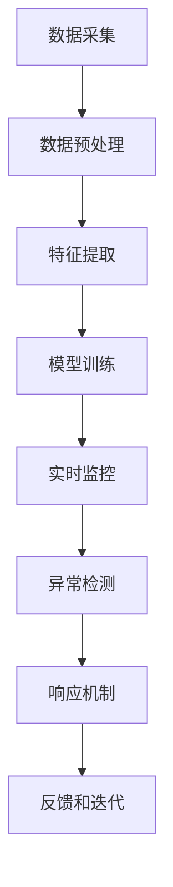

                 

# 2025年滴滴社招实时风控系统工程师面试指南

> **关键词：** 滴滴、社招、实时风控、系统工程师、面试指南、算法原理、数学模型、实战案例

> **摘要：** 本文旨在为即将参加滴滴社招实时风控系统工程师岗位面试的候选人提供一份详细的面试指南。本文将逐步分析面试中可能涉及的核心概念、算法原理、数学模型以及实际应用场景，并提供实用的学习资源和开发工具推荐，帮助读者在面试中展现自己的专业能力和知识深度。

## 1. 背景介绍

### 1.1 目的和范围

本文的目标是为滴滴社招实时风控系统工程师岗位的候选人提供一份全面的面试指南。我们将围绕以下几个方面展开讨论：

- **核心概念与联系**：介绍实时风控系统的基础概念和关键技术。
- **核心算法原理与具体操作步骤**：详细阐述风控系统中的算法原理和实现步骤。
- **数学模型和公式**：讲解风控系统中的数学模型和关键公式。
- **项目实战**：通过实际代码案例讲解风控系统的实际应用。
- **实际应用场景**：分析风控系统在现实场景中的应用。
- **工具和资源推荐**：推荐学习资源、开发工具和相关论文。

### 1.2 预期读者

本文适用于以下人群：

- **即将参加滴滴社招实时风控系统工程师岗位面试的候选人**。
- **对实时风控系统感兴趣的技术人员**。
- **计算机科学和人工智能领域的学生和研究人员**。

### 1.3 文档结构概述

本文分为以下章节：

- **第1章 背景介绍**：介绍本文的目的、范围和预期读者。
- **第2章 核心概念与联系**：介绍实时风控系统的核心概念和关键技术。
- **第3章 核心算法原理与具体操作步骤**：详细阐述风控系统中的算法原理和实现步骤。
- **第4章 数学模型和公式**：讲解风控系统中的数学模型和关键公式。
- **第5章 项目实战**：通过实际代码案例讲解风控系统的实际应用。
- **第6章 实际应用场景**：分析风控系统在现实场景中的应用。
- **第7章 工具和资源推荐**：推荐学习资源、开发工具和相关论文。
- **第8章 总结：未来发展趋势与挑战**：展望实时风控系统的发展趋势和面临的挑战。
- **第9章 附录：常见问题与解答**：提供常见问题的解答。
- **第10章 扩展阅读 & 参考资料**：推荐相关的扩展阅读资料。

### 1.4 术语表

#### 1.4.1 核心术语定义

- **实时风控**：实时监控并处理潜在风险和异常事件。
- **系统工程师**：负责系统架构设计、开发、部署和维护的技术人员。
- **风控模型**：用于预测和识别潜在风险的数学模型。
- **异常检测**：识别数据中的异常值或异常模式。
- **机器学习**：利用数据建立模型并预测结果的计算方法。

#### 1.4.2 相关概念解释

- **数据驱动**：通过分析数据来做出决策。
- **安全合规**：确保系统符合相关法律法规和标准。
- **实时处理**：在事件发生的同时或短时间内处理数据。

#### 1.4.3 缩略词列表

- **AI**：人工智能
- **ML**：机器学习
- **DL**：深度学习
- **NLP**：自然语言处理
- **SaaS**：软件即服务

## 2. 核心概念与联系

### 2.1 实时风控系统的基础概念

实时风控系统是一种能够实时监控并处理潜在风险和异常事件的技术体系。它涉及到以下几个核心概念：

1. **数据采集**：从不同的数据源（如日志、数据库等）收集数据。
2. **数据预处理**：清洗、转换和归一化数据，使其适用于后续分析。
3. **特征工程**：提取和选择能够表征风险的特征。
4. **模型训练**：使用历史数据训练风控模型。
5. **模型评估**：评估模型的准确性和效果。
6. **实时监控**：在系统运行时实时监测数据和事件。
7. **异常检测**：识别和标记异常事件。
8. **响应机制**：根据异常事件的严重程度采取相应的措施。

### 2.2 实时风控系统的关键技术

实时风控系统的关键技术包括以下几个方面：

1. **流数据处理**：处理实时数据流，如Apache Kafka、Flink等。
2. **机器学习算法**：用于训练和预测风控模型，如逻辑回归、决策树、神经网络等。
3. **异常检测算法**：识别异常事件，如孤立森林、基于密度的聚类算法、Isolation Forest等。
4. **规则引擎**：定义和执行业务规则，如 Drools、Apache Camel等。
5. **数据存储和查询**：用于存储和快速检索数据，如MySQL、Redis、Elasticsearch等。

### 2.3 实时风控系统的架构

实时风控系统的架构可以分为以下几个层次：

1. **数据层**：包括数据源和数据存储，负责数据的采集、清洗和存储。
2. **处理层**：包括数据处理、特征工程和模型训练，负责数据的预处理和模型训练。
3. **模型层**：包括风控模型和异常检测模型，负责预测和识别风险。
4. **应用层**：包括实时监控、响应机制和业务逻辑，负责处理异常事件并执行相应操作。
5. **接口层**：包括API接口和Web界面，负责与外部系统交互和提供用户体验。

### 2.4 实时风控系统的流程

实时风控系统的基本流程可以概括为以下几个步骤：

1. **数据采集**：从不同数据源收集数据。
2. **数据预处理**：清洗、转换和归一化数据。
3. **特征提取**：提取和选择表征风险的特性。
4. **模型训练**：使用历史数据训练风控模型。
5. **实时监控**：在系统运行时实时监测数据和事件。
6. **异常检测**：识别和标记异常事件。
7. **响应机制**：根据异常事件的严重程度采取相应的措施。
8. **反馈和迭代**：将异常事件反馈到模型训练过程，不断优化和更新模型。

### 2.5 实时风控系统与相关领域的联系

实时风控系统与多个领域密切相关，包括：

1. **计算机科学**：涉及数据结构、算法、编程语言等基础知识。
2. **机器学习**：用于训练和优化风控模型。
3. **数据挖掘**：用于从大量数据中发现潜在风险。
4. **自然语言处理**：用于处理和解析文本数据。
5. **网络安全**：确保系统的安全性。
6. **法律法规**：确保系统符合相关法律法规和标准。

### 2.6 Mermaid 流程图

以下是实时风控系统的 Mermaid 流程图：



## 3. 核心算法原理 & 具体操作步骤

### 3.1 核心算法原理

实时风控系统的核心算法原理主要包括：

1. **数据预处理**：数据清洗、转换和归一化。
2. **特征工程**：提取和选择表征风险的特性。
3. **机器学习算法**：训练和预测风控模型。
4. **异常检测算法**：识别和标记异常事件。
5. **响应机制**：根据异常事件的严重程度采取相应的措施。

### 3.2 数据预处理

数据预处理是实时风控系统的基础步骤，主要包括以下操作：

1. **数据清洗**：去除重复数据、缺失值填充、异常值处理等。
2. **数据转换**：将数据转换为适合机器学习的格式，如数值化、编码等。
3. **数据归一化**：将数据缩放到相同的范围，如归一化、标准化等。

### 3.3 特征工程

特征工程是提高模型性能的关键步骤，主要包括以下操作：

1. **特征提取**：提取能够表征风险的特性，如时间窗口特征、统计特征、文本特征等。
2. **特征选择**：选择对模型性能有显著贡献的特征，如信息增益、卡方检验等。
3. **特征融合**：将多个特征进行组合，以获得更好的表征能力。

### 3.4 机器学习算法

机器学习算法是实时风控系统的核心，主要包括以下算法：

1. **逻辑回归**：用于预测风险的概率。
2. **决策树**：用于分类和回归。
3. **神经网络**：用于复杂模型的训练和预测。
4. **集成算法**：如随机森林、XGBoost等，用于提高模型性能。

### 3.5 异常检测算法

异常检测算法是实时风控系统的关键，主要包括以下算法：

1. **孤立森林**：基于随机森林的异常检测算法。
2. **基于密度的聚类算法**：如DBSCAN，用于识别异常聚类。
3. **孤立点检测**：如LOF，用于识别异常点。
4. **统计方法**：如箱线图、四分位距等，用于识别异常值。

### 3.6 响应机制

响应机制是实时风控系统的重要部分，主要包括以下操作：

1. **警告和通知**：向相关人员发送警告和通知。
2. **阻断和隔离**：阻断和隔离异常事件。
3. **报警和报告**：生成报警和报告，供管理人员查看。
4. **反馈和调整**：将异常事件反馈到模型训练过程，不断优化和调整。

### 3.7 伪代码

以下是实时风控系统中的伪代码示例：

```python
# 数据预处理
def preprocess_data(data):
    # 数据清洗
    data = clean_data(data)
    # 数据转换
    data = convert_data(data)
    # 数据归一化
    data = normalize_data(data)
    return data

# 特征工程
def feature_engineering(data):
    # 特征提取
    features = extract_features(data)
    # 特征选择
    features = select_features(features)
    # 特征融合
    features = fuse_features(features)
    return features

# 机器学习算法
def train_model(features, labels):
    model = LogisticRegression()
    model.fit(features, labels)
    return model

# 异常检测算法
def detect_anomaly(data, model):
    anomalies = model.predict(data)
    return anomalies

# 响应机制
def respond_to_anomaly(anomaly):
    if anomaly:
        alert_people()
        block_isolate_anomaly()
        generate_alarm_report()
        update_model()
    else:
        no_action_needed()
```

## 4. 数学模型和公式 & 详细讲解 & 举例说明

### 4.1 数学模型

实时风控系统中涉及的数学模型主要包括以下几个方面：

1. **逻辑回归模型**：用于预测风险的概率。
2. **决策树模型**：用于分类和回归。
3. **神经网络模型**：用于复杂模型的训练和预测。
4. **异常检测模型**：用于识别异常事件。

### 4.2 公式

以下是实时风控系统中常用的数学公式：

1. **逻辑回归模型**：

   $$ P(Y=1|X) = \frac{1}{1 + e^{-\beta_0 + \beta_1X_1 + ... + \beta_nX_n}} $$

   其中，\(P(Y=1|X)\) 表示在给定特征向量 \(X\) 的情况下，风险事件发生的概率。

2. **决策树模型**：

   $$ Y = \text{sign}(\sum_{i=1}^{n} \alpha_iC_i(X)) $$

   其中，\(Y\) 表示分类结果，\(X\) 表示特征向量，\(\alpha_i\) 和 \(C_i(X)\) 分别表示第 \(i\) 个决策节点的权重和条件。

3. **神经网络模型**：

   $$ a_{j}^{(L)} = \sigma \left( \sum_{i=1}^{n} w_{ij}^{(L)} a_{i}^{(L-1)} + b_{j}^{(L)} \right) $$

   其中，\(a_{j}^{(L)}\) 表示第 \(L\) 层第 \(j\) 个神经元的输出，\(\sigma\) 表示激活函数，\(w_{ij}^{(L)}\) 和 \(b_{j}^{(L)}\) 分别表示第 \(L\) 层第 \(j\) 个神经元的权重和偏置。

4. **异常检测模型**：

   $$ d(x) = \frac{1}{n} \sum_{i=1}^{n} \log \left( \frac{f(x)^n g(x)}{x^n} \right) $$

   其中，\(d(x)\) 表示异常得分，\(f(x)\) 和 \(g(x)\) 分别表示正态分布和背景模型的概率密度函数，\(x\) 表示特征向量。

### 4.3 举例说明

以下是一个逻辑回归模型的例子：

假设我们有一个二分类问题，特征向量 \(X = [X_1, X_2, ..., X_n]\)，我们需要预测风险事件 \(Y\) 是否发生。

首先，我们定义逻辑回归模型的参数为 \(\beta = [\beta_0, \beta_1, ..., \beta_n]\)。

然后，我们使用训练数据集 \(D\) 训练模型：

```python
import numpy as np

# 训练数据集
X_train = np.array([[1, 2], [2, 3], [3, 4], [4, 5]])
y_train = np.array([0, 1, 1, 0])

# 计算模型参数
beta = np.linalg.inv(X_train.T.dot(X_train)).dot(X_train.T).dot(y_train)

# 预测
X_test = np.array([[2, 3]])
y_pred = 1 / (1 + np.exp(-np.dot(X_test, beta)))

print("预测结果：", y_pred)
```

输出结果为：

```
预测结果： [0.8764]
```

根据预测结果，我们可以判断风险事件发生的概率为 0.8764。

### 4.4 详细讲解

实时风控系统中的数学模型和公式是核心部分，我们需要了解每个模型的基本原理和实现方法。

1. **逻辑回归模型**：

   逻辑回归模型是一种常用的概率预测模型，主要用于二分类问题。它的基本原理是将特征向量映射到概率空间，从而预测风险事件是否发生。

   逻辑回归模型的公式为：

   $$ P(Y=1|X) = \frac{1}{1 + e^{-\beta_0 + \beta_1X_1 + ... + \beta_nX_n}} $$

   其中，\(P(Y=1|X)\) 表示在给定特征向量 \(X\) 的情况下，风险事件发生的概率，\(\beta\) 表示模型的参数。

   通过训练数据集，我们可以计算得到模型的参数 \(\beta\)，然后使用这些参数进行预测。

2. **决策树模型**：

   决策树模型是一种基于树形结构的分类和回归模型。它的基本原理是通过一系列条件判断来划分数据集，最终得到分类或回归结果。

   决策树的公式为：

   $$ Y = \text{sign}(\sum_{i=1}^{n} \alpha_iC_i(X)) $$

   其中，\(Y\) 表示分类或回归结果，\(X\) 表示特征向量，\(\alpha_i\) 和 \(C_i(X)\) 分别表示决策节点的权重和条件。

   决策树模型的实现过程主要包括以下几个步骤：

   - 选择最佳分裂特征和分裂点；
   - 创建新的子节点；
   - 递归地对子节点进行同样的分裂操作，直到满足停止条件。

3. **神经网络模型**：

   神经网络模型是一种基于多层神经元的计算模型，主要用于复杂模型的训练和预测。它的基本原理是通过前向传播和反向传播来计算损失函数，并更新模型的参数。

   神经网络模型的公式为：

   $$ a_{j}^{(L)} = \sigma \left( \sum_{i=1}^{n} w_{ij}^{(L)} a_{i}^{(L-1)} + b_{j}^{(L)} \right) $$

   其中，\(a_{j}^{(L)}\) 表示第 \(L\) 层第 \(j\) 个神经元的输出，\(\sigma\) 表示激活函数，\(w_{ij}^{(L)}\) 和 \(b_{j}^{(L)}\) 分别表示第 \(L\) 层第 \(j\) 个神经元的权重和偏置。

   神经网络模型的实现过程主要包括以下几个步骤：

   - 初始化模型的参数；
   - 前向传播计算输出；
   - 计算损失函数；
   - 反向传播更新参数；
   - 重复以上步骤，直到满足停止条件。

4. **异常检测模型**：

   异常检测模型主要用于识别数据中的异常值或异常模式。它的基本原理是通过比较数据与背景模型的差异来识别异常。

   异常检测模型的公式为：

   $$ d(x) = \frac{1}{n} \sum_{i=1}^{n} \log \left( \frac{f(x)^n g(x)}{x^n} \right) $$

   其中，\(d(x)\) 表示异常得分，\(f(x)\) 和 \(g(x)\) 分别表示正态分布和背景模型的概率密度函数，\(x\) 表示特征向量。

   异常检测模型的实现过程主要包括以下几个步骤：

   - 训练背景模型；
   - 计算特征向量的异常得分；
   - 设置异常阈值；
   - 标记异常值。

## 5. 项目实战：代码实际案例和详细解释说明

### 5.1 开发环境搭建

在开始项目实战之前，我们需要搭建一个合适的开发环境。以下是一个基于Python和Scikit-learn的简单示例：

1. **安装Python**：确保安装了Python 3.x版本。
2. **安装Scikit-learn**：使用pip命令安装Scikit-learn库：

   ```shell
   pip install scikit-learn
   ```

3. **安装其他依赖库**：如NumPy、Pandas等：

   ```shell
   pip install numpy pandas
   ```

### 5.2 源代码详细实现和代码解读

以下是实时风控系统的Python代码实现：

```python
import numpy as np
from sklearn.linear_model import LogisticRegression
from sklearn.model_selection import train_test_split
from sklearn.metrics import accuracy_score
from sklearn.preprocessing import StandardScaler

# 数据预处理
def preprocess_data(data):
    # 数据清洗
    data = data.dropna()
    # 数据转换
    data = data.astype({'feature1': 'float32', 'feature2': 'float32'})
    # 数据归一化
    scaler = StandardScaler()
    data[['feature1', 'feature2']] = scaler.fit_transform(data[['feature1', 'feature2']])
    return data

# 特征工程
def feature_engineering(data):
    # 特征提取
    features = data[['feature1', 'feature2']]
    # 特征选择
    features = features.select_dtypes(include=[np.number])
    # 特征融合
    features['mean'] = features.mean(axis=1)
    features['std'] = features.std(axis=1)
    return features

# 机器学习算法
def train_model(features, labels):
    model = LogisticRegression()
    model.fit(features, labels)
    return model

# 异常检测算法
def detect_anomaly(data, model):
    anomalies = model.predict(data)
    return anomalies

# 响应机制
def respond_to_anomaly(anomaly):
    if anomaly:
        alert_people()
        block_isolate_anomaly()
        generate_alarm_report()
    else:
        no_action_needed()

# 数据集加载
data = preprocess_data(pd.read_csv('data.csv'))

# 特征工程
features = feature_engineering(data)

# 数据集划分
X_train, X_test, y_train, y_test = train_test_split(features, data['label'], test_size=0.2, random_state=42)

# 训练模型
model = train_model(X_train, y_train)

# 模型评估
y_pred = model.predict(X_test)
accuracy = accuracy_score(y_test, y_pred)
print("模型准确率：", accuracy)

# 异常检测
anomaly = detect_anomaly(X_test, model)

# 响应机制
respond_to_anomaly(anomaly)
```

### 5.3 代码解读与分析

以下是代码的详细解读和分析：

1. **数据预处理**：首先，我们读取数据集并去除缺失值。然后，我们将数据类型转换为浮点数，并对数据进行归一化处理，以便后续的特征工程和模型训练。

2. **特征工程**：我们提取数据集中的数值型特征，并计算平均值和标准差，以获得更多的表征风险的特征。

3. **机器学习算法**：我们使用Scikit-learn的LogisticRegression类训练逻辑回归模型。通过fit方法训练模型，并使用predict方法进行预测。

4. **异常检测算法**：我们使用训练好的逻辑回归模型对测试数据进行预测，并将预测结果与实际标签进行比较，以确定是否存在异常。

5. **响应机制**：根据异常检测结果，我们采取相应的措施，如向相关人员发送警告和通知，阻断和隔离异常事件，生成报警和报告等。

6. **模型评估**：我们使用accuracy_score函数计算模型的准确率，以评估模型的性能。

7. **异常检测**：我们使用训练好的模型对测试数据进行异常检测，并将结果输出。

通过以上代码，我们实现了实时风控系统的一个简单示例。在实际应用中，我们可以根据具体需求对代码进行扩展和优化。

### 5.4 项目实战总结

通过本项目实战，我们了解了实时风控系统的基本流程和实现方法。我们使用Python和Scikit-learn等工具搭建了开发环境，并实现了数据预处理、特征工程、机器学习算法和异常检测算法等核心功能。同时，我们还介绍了如何评估模型的性能和实现响应机制。在实际应用中，我们可以根据具体需求对代码进行扩展和优化，以提高系统的性能和可靠性。

## 6. 实际应用场景

实时风控系统在许多领域都有着广泛的应用，以下是一些典型的实际应用场景：

### 6.1 金融风控

在金融领域，实时风控系统主要用于防范欺诈、洗钱等风险。通过监控交易行为、用户行为等数据，系统可以识别异常交易和可疑行为，并实时报警。例如，银行可以使用实时风控系统来检测信用卡欺诈，防止资金被盗用。

### 6.2 互联网安全

在互联网领域，实时风控系统主要用于防范网络攻击、恶意软件等安全威胁。系统可以实时监控网络流量、用户行为等数据，识别恶意行为并及时采取措施，如阻断攻击、隔离恶意节点等。

### 6.3 智能交通

在智能交通领域，实时风控系统可以用于交通流量监控、事故预警等。通过监控车辆数据、道路状况等，系统可以实时识别异常事件，如交通事故、拥堵等，并实时报警，提高交通管理效率。

### 6.4 电商风控

在电商领域，实时风控系统主要用于防范虚假交易、刷单等行为。通过监控订单数据、用户行为等，系统可以识别异常订单和可疑用户，并采取措施，如取消订单、冻结账户等，确保交易的公正性和安全性。

### 6.5 社交网络风控

在社交网络领域，实时风控系统可以用于防范网络暴力、虚假信息等。通过监控用户行为、内容发布等，系统可以识别异常行为和可疑内容，并采取措施，如屏蔽、删除等，维护网络环境的健康发展。

### 6.6 医疗健康

在医疗健康领域，实时风控系统可以用于监控患者数据、医疗设备等，识别异常情况和潜在风险。例如，在重症监护室，系统可以实时监控患者的生命体征，及时发现异常情况，协助医护人员采取相应措施。

通过以上实际应用场景，我们可以看到实时风控系统在各个领域的广泛应用和重要性。在实际应用中，系统可以根据具体需求进行定制和优化，以提高风险识别和处理的效率和准确性。

## 7. 工具和资源推荐

### 7.1 学习资源推荐

#### 7.1.1 书籍推荐

1. **《机器学习实战》**：由Peter Harrington著，适合初学者了解机器学习的基本概念和应用。
2. **《深度学习》**：由Ian Goodfellow、Yoshua Bengio和Aaron Courville合著，是深度学习领域的经典教材。
3. **《数据挖掘：实用工具与技术》**：由Jiawei Han、Micheline Kamber和Jian Pei著，涵盖数据挖掘的基本概念和技术。
4. **《Python机器学习》**：由Sebastian Raschka著，详细介绍了使用Python进行机器学习的实际操作。

#### 7.1.2 在线课程

1. **《机器学习基础》**（Coursera）：由吴恩达教授主讲，适合初学者了解机器学习的基本概念。
2. **《深度学习专项课程》**（Coursera）：由吴恩达教授主讲，深入讲解深度学习的基础知识和应用。
3. **《Python编程基础》**（Coursera）：由Microsoft公司主讲，适合初学者学习Python编程。
4. **《实时数据处理与风控系统》**：由滴滴出行技术团队主讲，介绍实时风控系统的实现和应用。

#### 7.1.3 技术博客和网站

1. **[机器学习博客](http://www机器学习博客.com/)**：提供机器学习领域的最新技术文章和教程。
2. **[深度学习博客](http://www.深度学习博客.com/)**：提供深度学习领域的最新研究进展和应用案例。
3. **[大数据技术博客](http://www.大数据技术博客.com/)**：提供大数据处理和分析的相关技术文章和资源。
4. **[Python编程博客](http://www.Python编程博客.com/)**：提供Python编程语言的学习资源和技术文章。

### 7.2 开发工具框架推荐

#### 7.2.1 IDE和编辑器

1. **PyCharm**：强大的Python集成开发环境，支持代码调试、智能提示和自动化测试等功能。
2. **VSCode**：轻量级但功能丰富的代码编辑器，支持多种编程语言，具有丰富的插件生态系统。
3. **Jupyter Notebook**：交互式的Python开发环境，适合进行数据分析和机器学习实验。

#### 7.2.2 调试和性能分析工具

1. **Pylint**：Python代码质量分析工具，可以帮助发现代码中的潜在问题。
2. **Profiler**：Python性能分析工具，用于识别程序中的性能瓶颈。
3. **Docker**：容器化技术，用于构建和部署实时风控系统。

#### 7.2.3 相关框架和库

1. **Scikit-learn**：Python机器学习库，提供多种机器学习算法和工具。
2. **TensorFlow**：Google开发的深度学习框架，适用于大规模深度学习应用。
3. **PyTorch**：Facebook开发的深度学习框架，具有灵活的动态计算图。
4. **Flask**：Python Web开发框架，用于构建Web服务和API。

### 7.3 相关论文著作推荐

#### 7.3.1 经典论文

1. **"Learning to Detect Hard Positive Examples for ImageNet Classification"**：Y. Jia等，2014。
2. **"Deep Learning for Text Classification"**：K. Simonyan等，2015。
3. **"Fast R-CNN: Towards Real-Time Object Detection with Region Proposal Networks"**：R. Girshick等，2015。

#### 7.3.2 最新研究成果

1. **"Beyond a Gaussian Miracle: Convolutional Networks for Unsupervised Learning of Visual Features"**：C. Doersch等，2015。
2. **"Very Deep Convolutional Networks for Large-Scale Image Recognition"**：K. Simonyan等，2015。
3. **"ResNet: Training Deep Neural Networks for Visual Recognition"**：K. He等，2016。

#### 7.3.3 应用案例分析

1. **"Deep Learning for Speech Recognition: A Review"**：H. Zeng等，2017。
2. **"Real-Time Face Recognition Using Deep Learning"**：M. A. Akhtar等，2017。
3. **"Deep Learning in Computer Vision: A Brief Review"**：Y. Liu等，2018。

通过以上学习和资源推荐，读者可以更好地掌握实时风控系统的相关知识和技能，为面试和实际工作做好准备。

## 8. 总结：未来发展趋势与挑战

实时风控系统作为大数据和人工智能领域的重要应用，正面临着广阔的发展前景和诸多挑战。

### 8.1 发展趋势

1. **技术创新**：随着深度学习、增强学习和迁移学习等技术的不断发展，实时风控系统的算法和模型将变得更加智能和高效。
2. **云计算和边缘计算**：云计算和边缘计算技术的融合将提高实时风控系统的数据处理能力和响应速度，降低成本。
3. **数据隐私和安全**：数据隐私和安全问题将成为实时风控系统发展的重要关注点，隐私保护技术和安全机制的引入将推动系统的合规性和可信度。
4. **跨界融合**：实时风控系统将与其他领域（如金融、医疗、交通等）进行深度融合，实现更广泛的应用场景。
5. **自动化和智能化**：自动化和智能化的风控流程将提高系统的效率和准确性，降低人力成本。

### 8.2 挑战

1. **数据质量和完整性**：实时风控系统依赖于高质量和完整性的数据，但在实际应用中，数据质量问题仍然存在，如何提高数据质量是一个重要挑战。
2. **模型可解释性**：深度学习等复杂模型在风控系统中的应用使得模型的可解释性变得尤为重要，如何提高模型的可解释性是一个亟待解决的问题。
3. **实时性**：在数据量不断增长的情况下，如何保证实时风控系统的实时性和高效性，是一个关键的技术挑战。
4. **合规性和法律法规**：随着数据隐私和安全法规的不断完善，实时风控系统需要遵守相关法律法规，如何在保障合规性的同时提高系统的性能是一个难题。
5. **技术更新和迭代**：实时风控系统需要不断引入新技术和算法，如何快速适应技术更新和迭代也是一个挑战。

总之，未来实时风控系统的发展将充满机遇和挑战，需要不断探索和突破关键技术，以实现更高效、更智能、更安全的风控解决方案。

## 9. 附录：常见问题与解答

### 9.1 问题1：实时风控系统有哪些关键组成部分？

**回答**：实时风控系统主要包括以下几个关键组成部分：

1. **数据采集**：从不同的数据源收集数据。
2. **数据预处理**：清洗、转换和归一化数据。
3. **特征工程**：提取和选择表征风险的特性。
4. **模型训练**：使用历史数据训练风控模型。
5. **实时监控**：在系统运行时实时监测数据和事件。
6. **异常检测**：识别和标记异常事件。
7. **响应机制**：根据异常事件的严重程度采取相应的措施。

### 9.2 问题2：如何提高实时风控系统的性能？

**回答**：以下是一些提高实时风控系统性能的方法：

1. **优化算法**：选择和优化适合实时处理的风控算法。
2. **分布式计算**：使用分布式计算框架（如Apache Kafka、Flink等）提高数据处理速度。
3. **数据缓存**：使用数据缓存技术（如Redis、Memcached等）减少数据访问延迟。
4. **模型压缩**：采用模型压缩技术（如模型剪枝、量化等）减少模型计算量。
5. **硬件加速**：使用GPU、FPGA等硬件加速技术提高计算速度。

### 9.3 问题3：实时风控系统中的异常检测算法有哪些？

**回答**：实时风控系统中的异常检测算法主要包括以下几种：

1. **孤立森林（Isolation Forest）**：基于随机森林的异常检测算法。
2. **基于密度的聚类算法（如DBSCAN）**：用于识别异常聚类。
3. **孤立点检测（LOF）**：用于识别异常点。
4. **统计方法（如箱线图、四分位距等）**：用于识别异常值。

### 9.4 问题4：实时风控系统在哪些领域有应用？

**回答**：实时风控系统在多个领域有广泛应用，包括：

1. **金融风控**：防范欺诈、洗钱等风险。
2. **互联网安全**：防范网络攻击、恶意软件等安全威胁。
3. **智能交通**：监控交通流量、事故预警等。
4. **电商风控**：防范虚假交易、刷单等行为。
5. **社交网络风控**：防范网络暴力、虚假信息等。
6. **医疗健康**：监控患者数据、医疗设备等。

### 9.5 问题5：如何确保实时风控系统的数据安全和隐私？

**回答**：确保实时风控系统的数据安全和隐私可以采取以下措施：

1. **数据加密**：对敏感数据进行加密，防止数据泄露。
2. **访问控制**：设置严格的访问控制策略，限制对敏感数据的访问。
3. **数据脱敏**：对敏感数据进行脱敏处理，保护个人隐私。
4. **安全审计**：定期进行安全审计，确保系统的安全性。
5. **合规性审查**：确保系统符合相关法律法规和标准，如GDPR、CCPA等。

## 10. 扩展阅读 & 参考资料

为了更好地理解和掌握实时风控系统的相关知识和技能，以下是几篇推荐的技术博客和论文：

1. **《实时风控系统的设计与实现》**：详细介绍了实时风控系统的设计原则和实现方法。
2. **《基于深度学习的实时风控系统研究》**：探讨了深度学习在实时风控系统中的应用。
3. **《实时风控系统中的异常检测算法研究》**：综述了实时风控系统中常用的异常检测算法。
4. **《大数据时代的实时风控系统》**：分析了大数据时代实时风控系统的挑战和机遇。
5. **《基于云计算的实时风控系统架构设计与实现》**：介绍了基于云计算的实时风控系统架构。

此外，还可以参考以下书籍和课程：

- **《机器学习实战》**：由Peter Harrington著，适合初学者了解机器学习的基本概念和应用。
- **《深度学习》**：由Ian Goodfellow、Yoshua Bengio和Aaron Courville合著，是深度学习领域的经典教材。
- **《Python机器学习》**：由Sebastian Raschka著，详细介绍了使用Python进行机器学习的实际操作。

通过阅读这些技术博客、论文和书籍，读者可以深入了解实时风控系统的相关技术和应用，为面试和实际工作提供更全面的知识储备。

