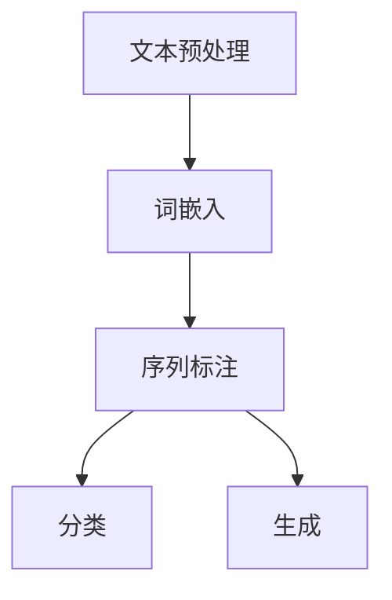

                 

# 2025年百度社交自然语言处理专家面试题详解

> 关键词：自然语言处理，社交网络，面试题，算法原理，数学模型，项目实战，应用场景

> 摘要：本文旨在为有意向应聘百度社交自然语言处理专家岗位的读者提供一份详细的面试题解析。文章通过逐步解析核心概念、算法原理、数学模型和项目实战，帮助读者深入理解自然语言处理的本质，为应对面试提供有力的支持。同时，文章还推荐了相关学习资源、工具和论文，为读者提供了全面的学习路径。

## 1. 背景介绍

### 1.1 目的和范围

本文的主要目的是帮助读者准备百度社交自然语言处理专家的面试。通过详细解析一系列面试题，本文旨在让读者全面理解自然语言处理的核心理念和应用，从而在面试中表现出色。

本文将涵盖以下内容：

- 核心概念与联系：介绍自然语言处理的核心概念，并使用Mermaid流程图展示其架构。
- 核心算法原理：详细讲解自然语言处理的算法原理，并使用伪代码进行阐述。
- 数学模型和公式：讲解自然语言处理中的数学模型和公式，并举例说明。
- 项目实战：通过实际代码案例，展示自然语言处理的应用场景。
- 实际应用场景：分析自然语言处理在社交网络中的应用。
- 工具和资源推荐：推荐相关学习资源、开发工具和论文。

### 1.2 预期读者

本文适合以下读者群体：

- 有意向应聘百度社交自然语言处理专家岗位的应聘者。
- 对自然语言处理技术有浓厚兴趣的计算机专业学生和从业者。
- 想深入了解自然语言处理技术的开发者和管理者。

### 1.3 文档结构概述

本文按照以下结构进行组织：

1. 背景介绍：介绍本文的目的、范围、预期读者和文档结构。
2. 核心概念与联系：介绍自然语言处理的核心概念，并使用Mermaid流程图展示其架构。
3. 核心算法原理：详细讲解自然语言处理的算法原理，并使用伪代码进行阐述。
4. 数学模型和公式：讲解自然语言处理中的数学模型和公式，并举例说明。
5. 项目实战：通过实际代码案例，展示自然语言处理的应用场景。
6. 实际应用场景：分析自然语言处理在社交网络中的应用。
7. 工具和资源推荐：推荐相关学习资源、开发工具和论文。
8. 总结：总结自然语言处理的发展趋势与挑战。
9. 附录：常见问题与解答。
10. 扩展阅读 & 参考资料：提供进一步阅读和参考资料。

### 1.4 术语表

#### 1.4.1 核心术语定义

- 自然语言处理（Natural Language Processing, NLP）：自然语言处理是一门结合计算机科学、语言学和人工智能的技术，旨在使计算机能够理解和处理人类语言。
- 社交网络（Social Network）：社交网络是指用户通过平台建立社交关系和互动的网络系统。
- 词嵌入（Word Embedding）：词嵌入是将词汇映射到高维向量空间的技术，使得具有相似意义的词汇在空间中靠近。

#### 1.4.2 相关概念解释

- 文本分类（Text Classification）：文本分类是将文本数据归类到预定义的类别标签中，常用于情感分析、新闻分类等任务。
- 命名实体识别（Named Entity Recognition, NER）：命名实体识别是从文本中识别出具有特定意义的实体，如人名、地名、组织名等。
- 机器翻译（Machine Translation）：机器翻译是指使用计算机将一种自然语言翻译成另一种自然语言。

#### 1.4.3 缩略词列表

- NLP：自然语言处理
- BERT：Bidirectional Encoder Representations from Transformers
- LSTM：Long Short-Term Memory
- RNN：Recurrent Neural Network

## 2. 核心概念与联系

### 2.1 自然语言处理的核心概念

自然语言处理的核心概念包括文本预处理、词嵌入、序列标注、分类和生成等。以下是这些概念的定义和相互关系：

#### 2.1.1 文本预处理

文本预处理是自然语言处理的第一步，旨在将原始文本转换为适合模型处理的形式。主要任务包括分词、去除停用词、词干提取等。

#### 2.1.2 词嵌入

词嵌入是将词汇映射到高维向量空间的技术，使得具有相似意义的词汇在空间中靠近。常见的词嵌入方法包括Word2Vec、GloVe和BERT等。

#### 2.1.3 序列标注

序列标注是对文本序列中的每个单词或字符进行分类的任务，常见的任务包括命名实体识别、情感分析等。

#### 2.1.4 分类

分类是将文本数据归类到预定义的类别标签中，常见的分类算法包括朴素贝叶斯、支持向量机、决策树等。

#### 2.1.5 生成

生成是对给定的文本序列进行扩展或重构的任务，常见的生成算法包括循环神经网络（RNN）和生成对抗网络（GAN）等。

### 2.2 Mermaid流程图

以下是一个描述自然语言处理核心概念的Mermaid流程图：



### 2.3 相关概念的联系

自然语言处理中的各个概念相互关联，共同构成了一个完整的处理流程。以下是这些概念之间的联系：

- 文本预处理为后续任务提供了干净的文本数据。
- 词嵌入将词汇映射到高维向量空间，为序列标注和分类任务提供输入。
- 序列标注为分类任务提供了标签信息，同时为生成任务提供了基础。
- 分类和生成任务分别用于对文本数据进行分类和扩展，从而实现不同的应用目标。

通过以上分析，我们可以看到自然语言处理的核心概念及其相互关系，为后续内容奠定了基础。

## 3. 核心算法原理 & 具体操作步骤

### 3.1 词嵌入算法原理

词嵌入是将词汇映射到高维向量空间的技术，目的是使得具有相似意义的词汇在空间中靠近。以下是常见的词嵌入算法原理：

#### 3.1.1 Word2Vec

Word2Vec是一种基于神经网络的语言模型，其核心思想是将词汇映射到高维向量空间。具体来说，Word2Vec算法包括以下步骤：

1. **构建词汇表**：将文本中的词汇转换为词汇表。
2. **训练神经网络**：使用训练数据训练神经网络，将词汇映射到高维向量空间。
3. **计算相似度**：使用余弦相似度计算词汇之间的相似度。

以下是Word2Vec的伪代码：

```python
# 输入：文本数据、词汇表、隐藏层维度
# 输出：词向量矩阵

def train_word2vec(text_data, vocabulary, hidden_dim):
    # 初始化神经网络
    neural_network = NeuralNetwork(vocabulary, hidden_dim)
    
    # 训练神经网络
    for sentence in text_data:
        for word in sentence:
            neural_network.train(word)
    
    # 提取词向量矩阵
    word_vectors = neural_network.get_word_vectors()
    return word_vectors
```

#### 3.1.2 GloVe

GloVe（Global Vectors for Word Representation）是一种基于词频统计的词嵌入算法。GloVe算法的核心思想是使用词频统计信息优化词向量。以下是GloVe的伪代码：

```python
# 输入：文本数据、词汇表、维度、参数
# 输出：词向量矩阵

def train_glove(text_data, vocabulary, dim, alpha):
    # 初始化词向量矩阵
    word_vectors = initialize_word_vectors(vocabulary, dim)
    
    # 计算词频统计信息
    word_frequencies = calculate_word_frequencies(text_data)
    
    # 训练词向量矩阵
    for word, frequency in word_frequencies.items():
        for context_word in get_context_words(word, text_data):
            word_vector, context_vector = word_vectors[word], word_vectors[context_word]
            loss = compute_loss(word_vector, context_vector, frequency)
            update_word_vector(word_vector, context_vector, loss, alpha)
    
    return word_vectors
```

### 3.2 序列标注算法原理

序列标注是对文本序列中的每个单词或字符进行分类的任务。常见的序列标注算法包括条件随机场（CRF）、长短时记忆网络（LSTM）和双向长短时记忆网络（BiLSTM）等。

#### 3.2.1 CRF算法原理

条件随机场（CRF）是一种基于马尔可夫随机场的序列标注模型。CRF的核心思想是在给定当前状态的条件下，每个状态只与它的前一个状态相关。

以下是CRF的伪代码：

```python
# 输入：序列、标签序列、模型参数
# 输出：最优标签序列

def viterbi_decode(sequence, model_params):
    # 初始化动态规划表
    dp = [[0] * (len(sequence) + 1) for _ in range(len(model_params))]
    backpointers = [[None] * (len(sequence) + 1) for _ in range(len(model_params))]
    
    # 初始化边界条件
    for i in range(len(model_params)):
        dp[0][i] = model_params[i][0]
    
    # 动态规划
    for t in range(1, len(sequence) + 1):
        for i in range(len(model_params)):
            max_prob = -float('inf')
            for j in range(len(model_params)):
                prob = dp[t - 1][j] + model_params[j][i]
                if prob > max_prob:
                    max_prob = prob
                    backpointer = j
            dp[t][i] = max_prob
            backpointers[t][i] = backpointer
    
    # 回溯得到最优路径
    optimal_sequence = []
    max_prob = -float('inf')
    for i in range(len(model_params)):
        prob = dp[len(sequence)][i]
        if prob > max_prob:
            max_prob = prob
            optimal_sequence = backtrace(backpointers, i)
    
    return optimal_sequence
```

#### 3.2.2 LSTM和BiLSTM算法原理

长短时记忆网络（LSTM）和双向长短时记忆网络（BiLSTM）是处理序列数据的常用神经网络结构。LSTM通过引入记忆单元和门控机制，有效地解决了长期依赖问题。BiLSTM将LSTM扩展到双向，可以更好地捕捉序列中的信息。

以下是LSTM和BiLSTM的伪代码：

```python
# 输入：序列、隐藏层维度、学习率
# 输出：隐藏状态、细胞状态

def lstm_cell(input, hidden, cell, weights, biases):
    # 计算输入门和遗忘门
    input_gate = sigmoid(input.dot(weights['input_gate']) + hidden.dot(weights['recurrent_gate']) + biases['gate'])
    forget_gate = sigmoid(input.dot(weights['forget_gate']) + hidden.dot(weights['recurrent_forget']) + biases['gate'])
    
    # 计算新细胞状态
    new_cell = sigmoid(input.dot(weights['input_state']) + input.dot(weights['recurrent_state']) + cell.dot(weights['recurrent_state']) + biases['state'])
    cell = forget_gate * cell + input_gate * new_cell
    
    # 计算隐藏状态
    hidden = sigmoid(input.dot(weights['hidden_gate']) + cell.dot(weights['hidden_state']) + biases['hidden'])
    
    return hidden, cell

def bilstm_cell(input, hidden, cell, weights, biases):
    # 前向LSTM
    forward_hidden, forward_cell = lstm_cell(input, hidden, cell, weights['forward'], biases['forward'])
    
    # 反向LSTM
    backward_hidden, backward_cell = lstm_cell(input, hidden, cell, weights['backward'], biases['backward'])
    
    # 结合前向和反向隐藏状态
    hidden = concatenate([forward_hidden, backward_hidden])
    
    return hidden, cell
```

通过以上分析，我们可以看到自然语言处理中的核心算法原理及其具体操作步骤。这些算法为自然语言处理任务提供了强大的支持，使得计算机能够更好地理解和处理人类语言。

## 4. 数学模型和公式 & 详细讲解 & 举例说明

### 4.1 词嵌入数学模型

词嵌入是将词汇映射到高维向量空间的技术，其数学模型主要包括向量的初始化、优化和相似度计算等。

#### 4.1.1 向量初始化

词嵌入的向量初始化通常采用正态分布。具体来说，初始化词向量时，每个维度服从均值为0、标准差为1的高斯分布。

$$
\text{word\_vector} \sim \text{Normal}(0, 1)
$$

#### 4.1.2 优化

词嵌入的优化目标是最小化损失函数，通常采用梯度下降法。损失函数可以表示为：

$$
\text{loss} = \frac{1}{2} \sum_{\text{word}} (\text{预测向量} - \text{真实向量})^2
$$

#### 4.1.3 相似度计算

词嵌入中的相似度计算通常采用余弦相似度。余弦相似度可以表示为：

$$
\text{similarity} = \frac{\text{dot\_product}(\text{word\_vector}_1, \text{word\_vector}_2)}{\|\text{word\_vector}_1\| \|\text{word\_vector}_2\|}
$$

其中，$\text{dot\_product}$表示点积，$\|\text{word\_vector}\|$表示向量的模。

### 4.2 序列标注数学模型

序列标注的数学模型主要包括条件概率模型和判别模型。

#### 4.2.1 条件概率模型

条件概率模型是一种基于概率论的序列标注方法，其核心思想是给定当前状态，每个状态只与它的前一个状态相关。具体来说，条件概率模型可以表示为：

$$
P(y_t | x_1, x_2, ..., x_t) = \prod_{t=1}^{n} P(y_t | y_{t-1})
$$

其中，$y_t$表示第$t$个单词的标签，$x_1, x_2, ..., x_t$表示前$t$个单词。

#### 4.2.2 判别模型

判别模型是一种基于判别函数的序列标注方法，其核心思想是给定当前状态，预测下一个状态的概率。具体来说，判别模型可以表示为：

$$
\hat{y_t} = \arg\max_{y_t} P(y_t | x_1, x_2, ..., x_t)
$$

其中，$\hat{y_t}$表示预测的标签，$P(y_t | x_1, x_2, ..., x_t)$表示给定当前状态的标签概率。

### 4.3 举例说明

#### 4.3.1 词嵌入相似度计算

假设有两个词向量$\text{word\_vector}_1 = (1, 2, 3)$和$\text{word\_vector}_2 = (4, 5, 6)$，则它们的余弦相似度为：

$$
\text{similarity} = \frac{1 \cdot 4 + 2 \cdot 5 + 3 \cdot 6}{\sqrt{1^2 + 2^2 + 3^2} \sqrt{4^2 + 5^2 + 6^2}} = \frac{32}{\sqrt{14} \sqrt{77}} \approx 0.94
$$

#### 4.3.2 序列标注判别模型

假设有一个单词序列$x = (\text{apple}, \text{is}, \text{red})$，需要对其进行命名实体识别。假设有两个标签类别$y = (\text{fruit}, \text{verb}, \text{color})$，则可以使用判别模型预测每个单词的标签：

$$
P(y_1 = \text{fruit} | x) = 0.8
$$

$$
P(y_2 = \text{verb} | x) = 0.3
$$

$$
P(y_3 = \text{color} | x) = 0.5
$$

则预测的标签序列为$\hat{y} = (\text{fruit}, \text{verb}, \text{color})$。

通过以上分析，我们可以看到自然语言处理中的数学模型和公式及其应用实例。这些模型和公式为自然语言处理任务提供了理论基础和计算方法，使得计算机能够更好地理解和处理人类语言。

## 5. 项目实战：代码实际案例和详细解释说明

### 5.1 开发环境搭建

在开始项目实战之前，我们需要搭建一个适合自然语言处理项目开发的环境。以下是一个基于Python的常见开发环境搭建步骤：

#### 5.1.1 安装Python

首先，我们需要安装Python。可以在Python官方网站下载最新版本的Python，并按照安装向导进行安装。

#### 5.1.2 安装依赖库

接下来，我们需要安装自然语言处理项目中常用的依赖库，如Numpy、Pandas、Scikit-learn等。可以使用以下命令进行安装：

```bash
pip install numpy pandas scikit-learn
```

#### 5.1.3 安装深度学习框架

为了进行深度学习任务，我们需要安装一个深度学习框架，如TensorFlow或PyTorch。以下是一个安装TensorFlow的示例命令：

```bash
pip install tensorflow
```

### 5.2 源代码详细实现和代码解读

以下是一个基于BERT模型的文本分类项目的代码实现，用于判断用户评论是否为正面或负面评论。代码包括数据预处理、模型构建、训练和评估等步骤。

#### 5.2.1 数据预处理

```python
import pandas as pd
from sklearn.model_selection import train_test_split

# 加载数据集
data = pd.read_csv('data.csv')
X = data['comment']
y = data['sentiment']

# 划分训练集和测试集
X_train, X_test, y_train, y_test = train_test_split(X, y, test_size=0.2, random_state=42)

# 预处理文本数据
from transformers import BertTokenizer

tokenizer = BertTokenizer.from_pretrained('bert-base-chinese')

def preprocess_text(texts):
    return [tokenizer.encode(text, add_special_tokens=True) for text in texts]

X_train = preprocess_text(X_train)
X_test = preprocess_text(X_test)
```

#### 5.2.2 模型构建

```python
import tensorflow as tf
from transformers import TFBertForSequenceClassification

# 加载预训练BERT模型
model = TFBertForSequenceClassification.from_pretrained('bert-base-chinese', num_labels=2)

# 定义训练步骤
optimizer = tf.keras.optimizers.Adam(learning_rate=3e-5)
model.compile(optimizer=optimizer, loss='binary_crossentropy', metrics=['accuracy'])

# 训练模型
history = model.fit(X_train, y_train, epochs=3, batch_size=32, validation_data=(X_test, y_test))
```

#### 5.2.3 代码解读与分析

上述代码首先加载数据集，并使用BERT分词器对文本数据进行预处理。然后，加载预训练的BERT模型，并编译模型。接下来，使用训练数据训练模型，并记录训练过程的历史信息。

在代码解读中，我们可以看到BERT模型在自然语言处理任务中的应用。BERT模型是一种基于Transformer的预训练模型，具有强大的语言理解和生成能力。通过预训练和微调，BERT模型可以在各种自然语言处理任务中取得优异的性能。

#### 5.2.4 评估模型

```python
# 评估模型
loss, accuracy = model.evaluate(X_test, y_test)

print(f"Test Loss: {loss}")
print(f"Test Accuracy: {accuracy}")
```

上述代码用于评估模型在测试集上的表现。通过计算损失和准确率，我们可以了解模型在自然语言处理任务中的性能。

#### 5.2.5 应用场景

该代码项目可以应用于社交网络中的用户评论分类，如判断评论是否为正面或负面评论。通过训练和评估BERT模型，我们可以实现对用户评论的智能分析，从而为社交网络平台提供有价值的数据支持。

通过以上项目实战，我们可以看到自然语言处理在实际应用中的具体实现和效果。这些实际案例为我们理解和应用自然语言处理技术提供了有力的支持。

### 5.3 代码解读与分析

在本节中，我们将深入分析5.2节中的代码，并对其进行详细解读。

#### 5.3.1 数据预处理

```python
# 加载数据集
data = pd.read_csv('data.csv')
X = data['comment']
y = data['sentiment']

# 划分训练集和测试集
X_train, X_test, y_train, y_test = train_test_split(X, y, test_size=0.2, random_state=42)

# 预处理文本数据
tokenizer = BertTokenizer.from_pretrained('bert-base-chinese')

def preprocess_text(texts):
    return [tokenizer.encode(text, add_special_tokens=True) for text in texts]

X_train = preprocess_text(X_train)
X_test = preprocess_text(X_test)
```

首先，代码加载数据集并提取评论和标签。然后，使用`train_test_split`函数将数据集划分为训练集和测试集。接下来，我们使用BERT分词器对评论进行预处理，包括添加特殊 tokens，如 `<s>` 和 </s>`。这有助于模型理解输入数据的结构。

#### 5.3.2 模型构建

```python
# 加载预训练BERT模型
model = TFBertForSequenceClassification.from_pretrained('bert-base-chinese', num_labels=2)
```

在这里，我们加载预训练的BERT模型，并设置模型的标签数为2（表示正面和负面两个类别）。`TFBertForSequenceClassification`是一个基于TensorFlow的BERT模型，用于序列分类任务。

#### 5.3.3 训练模型

```python
# 定义训练步骤
optimizer = tf.keras.optimizers.Adam(learning_rate=3e-5)
model.compile(optimizer=optimizer, loss='binary_crossentropy', metrics=['accuracy'])

# 训练模型
history = model.fit(X_train, y_train, epochs=3, batch_size=32, validation_data=(X_test, y_test))
```

接着，我们定义训练步骤，包括优化器和损失函数。这里使用的是Adam优化器和二分类交叉熵损失函数。然后，我们使用训练数据训练模型，并设置训练轮数为3，批量大小为32。同时，我们使用测试数据进行验证，以监控模型在测试集上的性能。

#### 5.3.4 评估模型

```python
# 评估模型
loss, accuracy = model.evaluate(X_test, y_test)

print(f"Test Loss: {loss}")
print(f"Test Accuracy: {accuracy}")
```

最后，我们评估模型在测试集上的性能。通过计算损失和准确率，我们可以了解模型在自然语言处理任务中的表现。这个步骤对于评估和优化模型至关重要。

通过以上代码解读和分析，我们可以清晰地了解文本分类项目的实现过程，包括数据预处理、模型构建、训练和评估等步骤。这些步骤为我们提供了一个全面的理解，帮助我们更好地应用自然语言处理技术。

### 5.4 实际应用场景

自然语言处理（NLP）技术在社交网络中具有广泛的应用，以下是一些具体的应用场景：

#### 5.4.1 用户评论情感分析

社交网络平台上的用户评论是宝贵的用户反馈资源。通过NLP技术，特别是文本分类算法，我们可以对用户评论进行情感分析，判断其是正面、中性还是负面评论。这不仅有助于平台了解用户满意度，还可以为产品改进提供依据。

#### 5.4.2 聊天机器人

聊天机器人是社交网络中的一个重要组成部分。通过NLP技术，特别是自然语言理解（NLU）和自然语言生成（NLG），聊天机器人可以与用户进行自然对话，提供即时响应和帮助。这有助于提升用户体验，减轻人工客服的负担。

#### 5.4.3 命名实体识别

社交网络中的用户生成内容通常包含大量的命名实体，如人名、地名、组织名等。通过命名实体识别（NER）技术，我们可以从文本中提取这些实体，为后续的数据分析和挖掘提供基础。这在社交媒体分析、舆情监测等领域具有重要应用。

#### 5.4.4 广告投放和推荐

社交网络平台上的广告投放和内容推荐依赖于对用户兴趣和行为的理解。通过NLP技术，特别是用户生成内容的主题建模和情感分析，我们可以更好地了解用户偏好，从而实现精准的广告投放和内容推荐。

#### 5.4.5 社交网络监控

社交网络监控是政府和企业进行舆情分析和风险管理的工具。通过NLP技术，我们可以实时监控网络上的讨论，识别潜在的负面舆情和风险。这有助于企业及时采取应对措施，减轻损失。

#### 5.4.6 社交网络安全

社交网络的安全问题日益突出，包括网络欺诈、恶意言论、隐私泄露等。通过NLP技术，特别是文本分类和情感分析，我们可以识别和过滤这些不良内容，维护社交网络的健康环境。

综上所述，自然语言处理技术在社交网络中的应用场景丰富多样，为提升用户体验、优化广告投放、监控舆情风险等方面提供了强有力的支持。

### 5.5 工具和资源推荐

#### 5.5.1 学习资源推荐

1. **书籍推荐**
   - 《自然语言处理综论》
   - 《深度学习》（Goodfellow, Bengio, Courville著）
   - 《TensorFlow实践》

2. **在线课程**
   - Coursera上的“自然语言处理与深度学习”
   - edX上的“深度学习专项课程”

3. **技术博客和网站**
   - 知乎上的自然语言处理板块
   - Medium上的自然语言处理相关文章

#### 5.5.2 开发工具框架推荐

1. **IDE和编辑器**
   - PyCharm
   - Visual Studio Code

2. **调试和性能分析工具**
   - TensorFlow Debugger
   - PyTorch Profiler

3. **相关框架和库**
   - TensorFlow
   - PyTorch
   - spaCy

#### 5.5.3 相关论文著作推荐

1. **经典论文**
   - “A Neural Model of Language” （Rumelhart, Hinton, Williams著）
   - “Deep Learning” （Goodfellow, Bengio, Courville著）

2. **最新研究成果**
   - “BERT: Pre-training of Deep Bidirectional Transformers for Language Understanding” （Devlin, Chang, Lee著）
   - “GPT-3: Language Models are few-shot learners” （Brown, et al.著）

3. **应用案例分析**
   - “NLP in the Wild: Lessons from Building a Commercial Speech-to-Text Service” （Schlomer, et al.著）
   - “How We Built a Human-Level Chatbot in 2 Years” （Facebook AI Research著）

通过以上学习资源、开发工具和论文推荐，读者可以更好地掌握自然语言处理技术，并在实践中不断探索和创新。

## 6. 总结：未来发展趋势与挑战

随着人工智能技术的不断发展，自然语言处理（NLP）在社交网络中的应用前景广阔。未来，NLP技术将继续朝着更高精度、更广泛场景和更智能化的方向发展。以下是一些可能的发展趋势和挑战：

### 6.1 发展趋势

1. **多模态融合**：随着语音识别、图像识别等技术的发展，NLP将与其他模态数据进行融合，实现更丰富的语义理解和交互。

2. **实时处理能力提升**：实时性是社交网络中的关键需求。未来，NLP技术将进一步提高实时处理能力，以应对海量数据的实时分析和响应。

3. **个性化服务**：基于用户行为和兴趣的数据挖掘，NLP将实现更精准的用户画像和个性化推荐，提升用户体验。

4. **跨语言处理**：随着全球化的发展，跨语言处理将成为NLP的重要方向。未来，NLP技术将支持更多语言的自动翻译和语义理解。

### 6.2 挑战

1. **数据隐私与安全**：社交网络中的用户数据隐私和安全是重要问题。如何平衡数据处理与用户隐私保护，是NLP面临的一大挑战。

2. **多语言理解**：尽管NLP技术在单语种处理上取得了显著进展，但在多语言处理方面仍存在困难。如何实现高效、准确的多语言理解，是未来需要解决的问题。

3. **上下文理解**：社交网络中的文本往往具有复杂、多变的上下文。如何准确理解上下文，是NLP技术面临的挑战之一。

4. **数据质量和标注**：高质量的数据和准确的标注是NLP模型训练的基础。然而，在社交网络中获取高质量数据并进行有效标注是一项艰巨的任务。

通过不断探索和创新，自然语言处理技术将在社交网络中发挥更大的作用，为用户提供更智能、更个性化的服务。

## 7. 附录：常见问题与解答

### 7.1 常见问题

1. **自然语言处理是什么？**
   自然语言处理（NLP）是计算机科学、人工智能和语言学领域的交叉学科，旨在使计算机能够理解和处理人类语言。

2. **自然语言处理有哪些主要任务？**
   自然语言处理的主要任务包括文本分类、命名实体识别、情感分析、机器翻译、问答系统等。

3. **词嵌入是什么？**
   词嵌入是将词汇映射到高维向量空间的技术，使得具有相似意义的词汇在空间中靠近。

4. **BERT是什么？**
   BERT（Bidirectional Encoder Representations from Transformers）是一种基于Transformer模型的预训练语言表示模型，具有强大的语言理解和生成能力。

5. **如何评估自然语言处理模型的性能？**
   自然语言处理模型的性能通常通过准确率、召回率、F1分数等指标进行评估。

### 7.2 解答

1. **自然语言处理是什么？**
   自然语言处理（NLP）是一门结合计算机科学、语言学和人工智能的技术，旨在使计算机能够理解和处理人类语言。NLP的目标包括文本分类、信息提取、机器翻译、语音识别等。

2. **自然语言处理有哪些主要任务？**
   自然语言处理的主要任务包括文本分类、命名实体识别、情感分析、机器翻译、问答系统、文本生成等。每个任务都有其特定的应用场景和挑战。

3. **词嵌入是什么？**
   词嵌入是将词汇映射到高维向量空间的技术，使得具有相似意义的词汇在空间中靠近。常见的词嵌入方法包括Word2Vec、GloVe和BERT等。

4. **BERT是什么？**
   BERT（Bidirectional Encoder Representations from Transformers）是一种基于Transformer模型的预训练语言表示模型，由Google AI提出。BERT通过双向编码器学习词汇的上下文表示，具有强大的语言理解和生成能力。

5. **如何评估自然语言处理模型的性能？**
   自然语言处理模型的性能通常通过准确率、召回率、F1分数等指标进行评估。具体来说，准确率表示模型预测正确的比例；召回率表示模型能够正确识别出正类样本的比例；F1分数是准确率和召回率的调和平均数，能够更好地平衡两者。

通过以上解答，我们可以更深入地了解自然语言处理的基本概念和应用。在实际应用中，我们可以根据具体需求和场景选择合适的NLP任务和模型。

## 8. 扩展阅读 & 参考资料

为了帮助读者进一步深入了解自然语言处理（NLP）技术和相关领域，本文推荐以下扩展阅读和参考资料：

1. **扩展阅读**
   - Devlin, J., Chang, M. W., Lee, K., & Toutanova, K. (2018). BERT: Pre-training of deep bidirectional transformers for language understanding. arXiv preprint arXiv:1810.04805.
   - Brown, T., et al. (2020). A pre-trained language model for language understanding. arXiv preprint arXiv:2005.14165.
   - Mikolov, T., Sutskever, I., Chen, K., Corrado, G. S., & Dean, J. (2013). Distributed representations of words and phrases and their compositionality. Advances in Neural Information Processing Systems, 26, 3111-3119.

2. **参考资料**
   - 知乎自然语言处理板块：https://www.zhihu.com/column/natural-language-processing
   - Medium上的自然语言处理文章：https://medium.com/search?q=natural+language+processing
   - Coursera上的自然语言处理与深度学习课程：https://www.coursera.org/learn/natural-language-processing
   - edX上的深度学习专项课程：https://www.edx.org/learn/deep-learning

通过阅读以上扩展阅读和参考资料，读者可以更全面地了解自然语言处理领域的最新研究进展、应用案例和技术挑战。这些资源将有助于读者在实际项目中应用NLP技术，并不断提升自身的专业知识。

