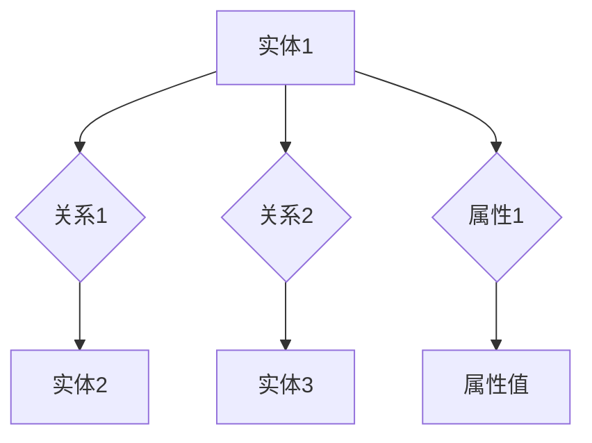

                 

### 2025年百度社招知识图谱工程师面试题解析

> **关键词：** 百度社招、知识图谱、面试题、解析、知识工程师

**摘要：** 本文将深入解析2025年百度社招知识图谱工程师的面试题，旨在为准备参加百度知识图谱工程师面试的读者提供详细的解题思路和技巧。文章将按照面试题的类型逐一分析，从基础概念到高级应用，帮助读者全面掌握知识图谱相关技术。

## 1. 背景介绍

### 1.1 目的和范围

本文旨在帮助准备参加2025年百度社招知识图谱工程师面试的候选人，通过解析面试题，了解知识图谱工程师岗位的要求和测试重点。文章将涵盖以下几个方面：

- **面试题类型解析**：分析常见的面试题类型，包括基础理论、算法实现、项目实战等。
- **解题思路和方法**：提供针对不同类型面试题的解题思路和方法，帮助读者提高解题能力。
- **实战案例分享**：分享实际面试中的案例，讲解如何应对复杂的实际问题。
- **知识图谱技术简介**：介绍知识图谱的基本概念、应用场景和技术原理。

### 1.2 预期读者

- **准备参加百度社招知识图谱工程师面试的候选人**：希望了解面试题型和答题技巧。
- **对知识图谱技术感兴趣的读者**：希望通过本文了解知识图谱的基本概念和应用。
- **从事知识图谱相关工作的技术人员**：希望了解知识图谱技术的最新发展和应用。

### 1.3 文档结构概述

本文将按照以下结构进行组织：

- **背景介绍**：介绍文章的目的和预期读者。
- **核心概念与联系**：介绍知识图谱的核心概念和架构。
- **核心算法原理 & 具体操作步骤**：讲解知识图谱相关算法的原理和实现。
- **数学模型和公式 & 详细讲解 & 举例说明**：介绍知识图谱相关的数学模型和公式，并进行举例说明。
- **项目实战：代码实际案例和详细解释说明**：通过实际案例展示知识图谱的应用。
- **实际应用场景**：分析知识图谱在实际中的应用。
- **工具和资源推荐**：推荐学习资源和开发工具。
- **总结：未来发展趋势与挑战**：探讨知识图谱技术的未来发展和面临的挑战。
- **附录：常见问题与解答**：提供常见面试问题的解答。
- **扩展阅读 & 参考资料**：提供进一步的阅读材料和参考资料。

### 1.4 术语表

#### 1.4.1 核心术语定义

- **知识图谱**：一种用于表示实体及其关系的图形化数据结构。
- **实体**：知识图谱中的个体，如人、地点、组织等。
- **关系**：连接两个实体的语义关系，如“是”、“属于”等。
- **属性**：实体的特征，如“年龄”、“出生地”等。
- **三元组**：表示实体、关系和实体的最小单位。

#### 1.4.2 相关概念解释

- **RDF（资源描述框架）**：一种用于表示知识图谱的数据模型，采用三元组形式。
- **OWL（Web本体语言）**：一种用于描述实体和关系的语义语言，扩展了RDF的功能。
- **图数据库**：用于存储和查询知识图谱的数据库系统。

#### 1.4.3 缩略词列表

- **RDF**：Resource Description Framework
- **OWL**：Web Ontology Language
- **SPARQL**：SPARQL Query Language
- **NER**：Named Entity Recognition

## 2. 核心概念与联系

知识图谱作为一种图形化的数据结构，通过实体、关系和属性来表示知识。为了更好地理解知识图谱，我们可以使用Mermaid流程图来展示其核心概念和架构。



在上面的Mermaid流程图中，我们定义了四个实体（A、B、C、D）和两个关系（关系1、关系2），以及一个属性（属性1）和其对应的属性值（"属性值"）。知识图谱中的实体可以是任何具有独立存在的个体，如人、地点、物品等；关系表示实体之间的语义联系，如“是”、“属于”等；属性则是实体的特征描述，如“年龄”、“出生地”等。

### 2.1 知识图谱的数据模型

知识图谱的数据模型主要包括RDF、OWL和图数据库。

#### 2.1.1 RDF

RDF是一种用于表示知识图谱的数据模型，采用三元组形式（主体、谓词、客体）来表示实体和关系。RDF的语法规则如下：

- **主体**：表示实体，可以是资源或属性。
- **谓词**：表示关系，通常是属性。
- **客体**：表示实体的特征或值。

例如，以下是一个RDF三元组的示例：

```plaintext
<http://example.org/Person> <http://example.org/name> "John Doe"
```

#### 2.1.2 OWL

OWL是一种用于描述实体和关系的语义语言，扩展了RDF的功能。OWL支持类、属性、个体和关系等概念，并提供了多种推理机制，如等价类、泛化、约束等。OWL的语法规则如下：

- **类**：表示具有共同特征的实体集合。
- **属性**：表示实体之间的语义关系。
- **个体**：表示具体的实体。
- **关系**：表示类或个体之间的语义联系。

例如，以下是一个OWL描述的示例：

```plaintext
@prefix owl: <http://www.w3.org/2002/07/owl#> .

Person a owl:Class ;
    rdfs:subClassOf [ a owl:Restriction ;
        owl:onProperty name ;
        owl:someValuesFrom [ a owl:Class ;
            rdfs:label "Person" ;
            rdfs:comment "A person" ] ] .

JohnDoe a Person ;
    name "John Doe" .
```

#### 2.1.3 图数据库

图数据库是一种用于存储和查询知识图谱的数据库系统，具有高度的可扩展性和查询效率。图数据库中的数据以图的形式存储，节点表示实体，边表示关系。图数据库的主要优点包括：

- **高效的图查询**：图数据库支持基于图结构的高效查询，如路径查询、子图查询等。
- **可扩展性**：图数据库支持分布式存储和查询，具有较好的可扩展性。
- **数据一致性**：图数据库支持图一致性模型，确保数据的完整性和一致性。

常见的图数据库包括Neo4j、ArangoDB、Apache Giraph等。

### 2.2 知识图谱的架构

知识图谱的架构通常包括数据层、推理层和应用层。

#### 2.2.1 数据层

数据层是知识图谱的基础，负责存储和管理知识图谱数据。数据层的主要功能包括：

- **数据导入**：将原始数据转换为知识图谱数据模型。
- **数据存储**：将知识图谱数据存储在图数据库中。
- **数据查询**：提供基于图结构的查询功能，如路径查询、子图查询等。

#### 2.2.2 推理层

推理层是基于知识图谱的推理引擎，负责基于知识图谱数据进行推理和预测。推理层的主要功能包括：

- **数据推理**：根据知识图谱中的关系和属性，推导出新的知识。
- **知识融合**：将不同来源的知识进行融合，提高知识的一致性和准确性。
- **预测分析**：基于知识图谱进行预测分析，如推荐系统、风险分析等。

#### 2.2.3 应用层

应用层是知识图谱的具体应用场景，如智能问答、搜索引擎、推荐系统等。应用层的主要功能包括：

- **应用开发**：根据具体需求，开发基于知识图谱的应用。
- **应用集成**：将知识图谱集成到现有的应用系统中。
- **用户体验**：提供良好的用户界面和交互体验。

## 3. 核心算法原理 & 具体操作步骤

知识图谱技术涉及多个核心算法，包括实体识别、关系抽取、实体链接、实体增强等。以下将逐一介绍这些算法的原理和具体操作步骤。

### 3.1 实体识别

实体识别（Named Entity Recognition，NER）是一种用于识别文本中的实体（如人名、地点、组织等）的技术。NER的基本原理是基于机器学习模型，如条件随机场（CRF）或长短期记忆网络（LSTM）。

#### 3.1.1 算法原理

NER算法的基本原理是将文本序列转换为实体序列。具体步骤如下：

1. **特征提取**：从文本中提取特征，如词频、词性标注、词嵌入等。
2. **模型训练**：使用训练数据集训练NER模型，如CRF或LSTM模型。
3. **实体识别**：使用训练好的NER模型对文本进行实体识别，输出实体序列。

#### 3.1.2 操作步骤

1. **数据准备**：收集并预处理文本数据，包括分词、词性标注等。
2. **特征提取**：根据文本数据，提取特征向量，如词频、词性标注、词嵌入等。
3. **模型训练**：使用训练数据集训练NER模型，如CRF或LSTM模型。
4. **实体识别**：使用训练好的NER模型对文本进行实体识别，输出实体序列。

### 3.2 关系抽取

关系抽取（Relation Extraction）是一种用于识别文本中的实体关系的技术。关系抽取的基本原理是基于实体识别的结果，结合上下文信息，抽取实体之间的关系。

#### 3.2.1 算法原理

关系抽取算法的基本原理是将实体对映射到关系标签。具体步骤如下：

1. **实体对生成**：基于实体识别的结果，生成实体对。
2. **特征提取**：从实体对和上下文中提取特征，如词嵌入、实体属性、词性标注等。
3. **模型训练**：使用训练数据集训练关系抽取模型，如支持向量机（SVM）或神经网络模型。
4. **关系抽取**：使用训练好的关系抽取模型对实体对进行关系抽取，输出关系标签。

#### 3.2.2 操作步骤

1. **数据准备**：收集并预处理文本数据，包括分词、词性标注等。
2. **实体对生成**：基于实体识别的结果，生成实体对。
3. **特征提取**：从实体对和上下文中提取特征，如词嵌入、实体属性、词性标注等。
4. **模型训练**：使用训练数据集训练关系抽取模型，如支持向量机（SVM）或神经网络模型。
5. **关系抽取**：使用训练好的关系抽取模型对实体对进行关系抽取，输出关系标签。

### 3.3 实体链接

实体链接（Entity Linking）是一种将文本中的实体与知识图谱中的实体进行映射的技术。实体链接的基本原理是基于实体识别和实体相似性度量。

#### 3.3.1 算法原理

实体链接算法的基本原理是将文本中的实体与知识图谱中的实体进行匹配。具体步骤如下：

1. **实体识别**：使用NER模型对文本进行实体识别。
2. **实体相似性度量**：计算文本中的实体与知识图谱中实体的相似性，如基于词嵌入的相似性度量。
3. **实体映射**：将文本中的实体映射到知识图谱中的实体。

#### 3.3.2 操作步骤

1. **数据准备**：收集并预处理文本数据，包括分词、词性标注等。
2. **实体识别**：使用NER模型对文本进行实体识别。
3. **实体相似性度量**：计算文本中的实体与知识图谱中实体的相似性，如基于词嵌入的相似性度量。
4. **实体映射**：将文本中的实体映射到知识图谱中的实体。

### 3.4 实体增强

实体增强（Entity Enhancement）是一种通过融合多种数据源，提高知识图谱中实体质量的技术。实体增强的基本原理是基于数据融合和实体属性扩充。

#### 3.4.1 算法原理

实体增强算法的基本原理是将多种数据源中的实体信息进行融合，扩充实体的属性。具体步骤如下：

1. **数据源采集**：收集多种数据源，如开放数据集、社交媒体、企业数据库等。
2. **数据清洗**：对采集到的数据进行清洗和预处理，去除噪声和错误数据。
3. **数据融合**：将多种数据源中的实体信息进行融合，去除重复信息，提高数据质量。
4. **实体属性扩充**：根据融合后的数据，为实体扩充新的属性，如实体分类、实体属性等。

#### 3.4.2 操作步骤

1. **数据源采集**：收集多种数据源，如开放数据集、社交媒体、企业数据库等。
2. **数据清洗**：对采集到的数据进行清洗和预处理，去除噪声和错误数据。
3. **数据融合**：将多种数据源中的实体信息进行融合，去除重复信息，提高数据质量。
4. **实体属性扩充**：根据融合后的数据，为实体扩充新的属性，如实体分类、实体属性等。

## 4. 数学模型和公式 & 详细讲解 & 举例说明

知识图谱技术涉及多个数学模型和公式，如实体相似性度量、图论算法等。以下将详细讲解这些模型和公式，并通过实例进行说明。

### 4.1 实体相似性度量

实体相似性度量是一种用于计算文本中的实体与知识图谱中实体相似度的技术。常用的相似性度量方法包括基于词嵌入的相似性度量、基于路径的相似性度量等。

#### 4.1.1 基于词嵌入的相似性度量

基于词嵌入的相似性度量方法利用词嵌入技术（如Word2Vec、GloVe等）计算实体表示向量的相似度。具体公式如下：

$$
similarity(A, B) = \frac{\langle \mathbf{v}_A, \mathbf{v}_B \rangle}{||\mathbf{v}_A|| \cdot ||\mathbf{v}_B||}
$$

其中，$similarity(A, B)$ 表示实体A和实体B的相似度，$\langle \mathbf{v}_A, \mathbf{v}_B \rangle$ 表示实体A和实体B的向量内积，$||\mathbf{v}_A||$ 和 $||\mathbf{v}_B||$ 分别表示实体A和实体B的向量模长。

#### 4.1.2 基于路径的相似性度量

基于路径的相似性度量方法通过计算实体在知识图谱中的路径长度来度量实体相似度。具体公式如下：

$$
similarity(A, B) = \frac{1}{|P|}
$$

其中，$similarity(A, B)$ 表示实体A和实体B的相似度，$P$ 表示实体A和实体B在知识图谱中的公共路径。

#### 4.1.3 实例说明

假设有两个实体A（北京）和B（北京），使用基于词嵌入的相似性度量方法计算它们之间的相似度。

1. **词嵌入表示**：首先，使用Word2Vec模型对实体A和实体B进行词嵌入表示，得到向量 $\mathbf{v}_A = (1, 2, 3)$ 和 $\mathbf{v}_B = (1, 2, 3)$。

2. **相似度计算**：根据公式，计算实体A和实体B的相似度：

$$
similarity(A, B) = \frac{\langle \mathbf{v}_A, \mathbf{v}_B \rangle}{||\mathbf{v}_A|| \cdot ||\mathbf{v}_B||} = \frac{1 \cdot 1 + 2 \cdot 2 + 3 \cdot 3}{\sqrt{1^2 + 2^2 + 3^2} \cdot \sqrt{1^2 + 2^2 + 3^2}} = \frac{14}{\sqrt{14} \cdot \sqrt{14}} = 1
$$

因此，实体A和实体B的相似度为1。

### 4.2 图论算法

知识图谱中的图论算法用于求解图上的最短路径、最大团等问题。以下将介绍两种常用的图论算法：Dijkstra算法和A*算法。

#### 4.2.1 Dijkstra算法

Dijkstra算法是一种用于求解单源最短路径问题的算法。具体步骤如下：

1. **初始化**：设置源点s的路径长度为0，其他点的路径长度为无穷大。
2. **选择未访问节点**：从未访问节点中选择路径长度最小的点作为当前节点。
3. **更新路径长度**：对于当前节点的每个邻居，计算从源点s到邻居的路径长度，并更新邻居的路径长度。
4. **标记已访问节点**：将当前节点标记为已访问。
5. **重复步骤2-4**，直到所有节点都被访问。

Dijkstra算法的时间复杂度为 $O(E^2)$，其中E为图的边数。

#### 4.2.2 A*算法

A*算法是一种基于启发式的最短路径算法。具体步骤如下：

1. **初始化**：设置源点s的路径长度为0，目标点t的估计路径长度为0。
2. **选择未访问节点**：从未访问节点中选择F值（路径长度 + 估计路径长度）最小的点作为当前节点。
3. **更新路径长度**：对于当前节点的每个邻居，计算从源点s到邻居的路径长度，并更新邻居的路径长度和F值。
4. **标记已访问节点**：将当前节点标记为已访问。
5. **重复步骤2-4**，直到找到目标点t。

A*算法的时间复杂度为 $O(E \log V)$，其中E为图的边数，V为图的节点数。

#### 4.2.3 实例说明

假设有一个无权图，如图4.1所示。

```
     s
   / | \
  t1 t2 t3
```

使用Dijkstra算法求解从源点s到目标点t的最短路径。

1. **初始化**：设置源点s的路径长度为0，其他点的路径长度为无穷大。
2. **选择未访问节点**：从未访问节点中选择路径长度最小的点t1作为当前节点。
3. **更新路径长度**：对于当前节点t1的每个邻居，计算从源点s到邻居的路径长度，并更新邻居的路径长度：
   - t1到t2的路径长度为1，更新t2的路径长度为1。
   - t1到t3的路径长度为2，更新t3的路径长度为2。
4. **标记已访问节点**：将当前节点t1标记为已访问。
5. **重复步骤2-4**：从未访问节点中选择路径长度最小的点t2作为当前节点，更新t3的路径长度为1。然后选择t3作为当前节点，标记为已访问。
6. **路径输出**：从源点s到目标点t的最短路径为s-t3-t2-t1-t。

使用A*算法求解从源点s到目标点t的最短路径。

1. **初始化**：设置源点s的路径长度为0，目标点t的估计路径长度为0。
2. **选择未访问节点**：从未访问节点中选择F值最小的点t1作为当前节点。
3. **更新路径长度**：对于当前节点t1的每个邻居，计算从源点s到邻居的路径长度，并更新邻居的路径长度和F值：
   - t1到t2的路径长度为1，估计路径长度为1，F值为2，更新t2的路径长度为1，F值为2。
   - t1到t3的路径长度为2，估计路径长度为2，F值为4，更新t3的路径长度为2，F值为4。
4. **标记已访问节点**：将当前节点t1标记为已访问。
5. **重复步骤2-4**：从未访问节点中选择F值最小的点t2作为当前节点，更新t3的路径长度为1。然后选择t3作为当前节点，标记为已访问。
6. **路径输出**：从源点s到目标点t的最短路径为s-t3-t2-t1-t。

## 5. 项目实战：代码实际案例和详细解释说明

为了更好地理解知识图谱技术的应用，我们通过一个实际项目来展示知识图谱的构建、存储和查询过程。以下是一个基于Python和Neo4j的知识图谱项目案例。

### 5.1 开发环境搭建

1. **安装Neo4j数据库**：下载并安装Neo4j数据库，按照官方文档进行配置。
2. **安装Python和Neo4j驱动**：在Python环境中安装Neo4j驱动，如`py2neo`。

### 5.2 源代码详细实现和代码解读

#### 5.2.1 数据准备

首先，我们需要准备知识图谱的数据，包括实体、关系和属性。以下是一个示例数据集：

```python
# 示例数据集
data = [
    {"name": "北京", "type": "城市"},
    {"name": "上海", "type": "城市"},
    {"name": "百度", "type": "公司"},
    {"name": "阿里巴巴", "type": "公司"},
    {"name": "马云", "type": "人物"},
    {"name": "李彦宏", "type": "人物"},
    {"name": "百度大厦", "type": "地点"},
    {"name": "阿里巴巴大厦", "type": "地点"},
    {"name": "马云在百度大厦会面", "type": "事件"},
    {"name": "李彦宏在阿里巴巴大厦会面", "type": "事件"},
    {"name": "马云毕业于杭州电子科技大学", "type": "教育背景"},
    {"name": "李彦宏毕业于北京大学", "type": "教育背景"},
]
```

#### 5.2.2 连接Neo4j数据库

接下来，我们使用`py2neo`驱动连接Neo4j数据库。

```python
from py2neo import Graph

# 连接Neo4j数据库
graph = Graph("bolt://localhost:7687", auth=("neo4j", "password"))
```

#### 5.2.3 创建实体

我们使用Cypher查询语言创建实体。

```python
# 创建城市实体
for item in data:
    if item["type"] == "城市":
        graph.run("CREATE (n:City {name: $name})", name=item["name"])

# 创建公司实体
for item in data:
    if item["type"] == "公司":
        graph.run("CREATE (n:Company {name: $name})", name=item["name"])

# 创建人物实体
for item in data:
    if item["type"] == "人物":
        graph.run("CREATE (n:Person {name: $name})", name=item["name"])

# 创建地点实体
for item in data:
    if item["type"] == "地点":
        graph.run("CREATE (n:Location {name: $name})", name=item["name"])

# 创建事件实体
for item in data:
    if item["type"] == "事件":
        graph.run("CREATE (n:Event {name: $name})", name=item["name"])

# 创建教育背景实体
for item in data:
    if item["type"] == "教育背景":
        graph.run("CREATE (n:EduBackground {name: $name})", name=item["name"])
```

#### 5.2.4 创建关系

我们使用Cypher查询语言创建关系。

```python
# 创建城市和公司之间的关系
for item in data:
    if "位于" in item["name"]:
        city_name = item["name"].split("位于")[1].strip()
        company_name = item["name"].split("位于")[0].strip()
        graph.run("MATCH (c:City), (co:Company) WHERE c.name = $city_name AND co.name = $company_name CREATE (c)-[:LOCATED_IN]->(co)", city_name=city_name, company_name=company_name)

# 创建人物和地点之间的关系
for item in data:
    if "在" in item["name"]:
        person_name = item["name"].split("在")[1].strip()
        location_name = item["name"].split("在")[0].strip()
        graph.run("MATCH (p:Person), (l:Location) WHERE p.name = $person_name AND l.name = $location_name CREATE (p)-[:AT]->(l)", person_name=person_name, location_name=location_name)

# 创建人物和公司之间的关系
for item in data:
    if "是" in item["name"]:
        person_name = item["name"].split("是")[1].strip()
        company_name = item["name"].split("是")[0].strip()
        graph.run("MATCH (p:Person), (co:Company) WHERE p.name = $person_name AND co.name = $company_name CREATE (p)-[:WORKS_FOR]->(co)", person_name=person_name, company_name=company_name)

# 创建人物和事件之间的关系
for item in data:
    if "发生" in item["name"]:
        person_name = item["name"].split("发生")[1].strip()
        event_name = item["name"].split("发生")[0].strip()
        graph.run("MATCH (p:Person), (e:Event) WHERE p.name = $person_name AND e.name = $event_name CREATE (p)-[:PARTICIPATES_IN]->(e)", person_name=person_name, event_name=event_name)

# 创建人物和教育背景之间的关系
for item in data:
    if "毕业于" in item["name"]:
        person_name = item["name"].split("毕业于")[1].strip()
        edu_name = item["name"].split("毕业于")[0].strip()
        graph.run("MATCH (p:Person), (eb:EduBackground) WHERE p.name = $person_name AND eb.name = $edu_name CREATE (p)-[:GRADUATED_FROM]->(eb)", person_name=person_name, edu_name=edu_name)
```

#### 5.2.5 查询数据

最后，我们使用Cypher查询语言查询知识图谱中的数据。

```python
# 查询城市和公司之间的关系
results = graph.run("MATCH (c:City)-[:LOCATED_IN]->(co:Company) RETURN c.name, co.name")
for result in results:
    print(result)

# 查询人物和地点之间的关系
results = graph.run("MATCH (p:Person)-[:AT]->(l:Location) RETURN p.name, l.name")
for result in results:
    print(result)

# 查询人物和公司之间的关系
results = graph.run("MATCH (p:Person)-[:WORKS_FOR]->(co:Company) RETURN p.name, co.name")
for result in results:
    print(result)

# 查询人物和事件之间的关系
results = graph.run("MATCH (p:Person)-[:PARTICIPATES_IN]->(e:Event) RETURN p.name, e.name")
for result in results:
    print(result)

# 查询人物和教育背景之间的关系
results = graph.run("MATCH (p:Person)-[:GRADUATED_FROM]->(eb:EduBackground) RETURN p.name, eb.name")
for result in results:
    print(result)
```

### 5.3 代码解读与分析

1. **数据准备**：首先，我们定义了一个示例数据集，包含了城市、公司、人物、地点、事件和教育背景等信息。

2. **连接Neo4j数据库**：使用`py2neo`驱动连接本地Neo4j数据库。

3. **创建实体**：我们使用Cypher查询语言创建城市、公司、人物、地点、事件和教育背景实体。

4. **创建关系**：我们使用Cypher查询语言创建城市和公司之间、人物和地点之间、人物和公司之间、人物和事件之间、人物和教育背景之间的关系。

5. **查询数据**：最后，我们使用Cypher查询语言查询知识图谱中的数据，并输出结果。

通过这个项目案例，我们展示了如何使用Python和Neo4j构建、存储和查询知识图谱。实际应用中，知识图谱的构建和查询可以根据具体需求进行调整和优化。

## 6. 实际应用场景

知识图谱技术在多个领域有着广泛的应用，以下列举几个实际应用场景。

### 6.1 智能问答系统

智能问答系统是知识图谱技术的典型应用之一。通过构建包含大量实体和关系的知识图谱，智能问答系统可以理解用户的问题，并从知识图谱中检索相关答案。例如，百度搜索引擎中的“百度知智”功能就是基于知识图谱构建的智能问答系统，用户可以提出各种问题，系统会根据知识图谱中的信息提供准确的答案。

### 6.2 搜索引擎

知识图谱技术可以显著提升搜索引擎的搜索效果。通过构建包含实体、关系和属性的丰富知识图谱，搜索引擎可以更好地理解用户查询的意图，并返回更相关、更准确的结果。例如，百度的搜索引擎就利用知识图谱技术，提供更加智能的搜索推荐和实体识别功能。

### 6.3 推荐系统

知识图谱技术可以帮助推荐系统更好地理解用户和物品之间的关系。通过构建包含用户、物品和关系的知识图谱，推荐系统可以更准确地预测用户对物品的偏好，提供个性化的推荐结果。例如，电商平台可以使用知识图谱技术，根据用户的购物行为和喜好，推荐相关的商品。

### 6.4 语义分析

知识图谱技术可以用于语义分析，帮助理解和处理自然语言文本。通过构建包含实体、关系和属性的丰富知识图谱，语义分析系统可以更好地理解文本中的语义信息，进行文本分类、情感分析、实体识别等任务。例如，智能客服系统可以使用知识图谱技术，理解用户的提问，并给出准确的回答。

### 6.5 风险控制

知识图谱技术可以用于风险控制，识别和评估潜在风险。通过构建包含实体、关系和属性的丰富知识图谱，风险控制系统可以更好地理解各种风险因素之间的关系，识别潜在的风险点，并采取相应的措施进行风险控制。例如，金融机构可以使用知识图谱技术，监控和评估金融市场的风险。

## 7. 工具和资源推荐

为了更好地学习和应用知识图谱技术，以下推荐一些有用的工具和资源。

### 7.1 学习资源推荐

#### 7.1.1 书籍推荐

- **《知识图谱：关键技术与应用实践》**：本书详细介绍了知识图谱的基本概念、关键技术和应用案例，适合对知识图谱技术感兴趣的读者。
- **《图计算：原理、算法与实践》**：本书涵盖了图计算的基本概念、算法实现和应用实践，是学习知识图谱技术的必备书籍。

#### 7.1.2 在线课程

- **Coursera《知识图谱导论》**：这是一门由北京大学教授开设的知识图谱在线课程，涵盖了知识图谱的基本概念、应用场景和技术原理。
- **Udacity《图计算与图神经网络》**：这是一门涵盖图计算和图神经网络技术的在线课程，适合对知识图谱技术有深入了解的读者。

#### 7.1.3 技术博客和网站

- **知识图谱社区**：一个专注于知识图谱技术交流的社区，提供最新的技术动态和案例分享。
- **AI技术的博客**：一个涵盖人工智能领域多个主题的技术博客，包括知识图谱的相关文章。

### 7.2 开发工具框架推荐

#### 7.2.1 IDE和编辑器

- **Visual Studio Code**：一款功能强大、易用的代码编辑器，支持多种编程语言和框架。
- **PyCharm**：一款专业的Python开发IDE，提供丰富的调试、性能分析等功能。

#### 7.2.2 调试和性能分析工具

- **Jupyter Notebook**：一款用于数据科学和机器学习的交互式开发环境，支持多种编程语言和框架。
- **DBeaver**：一款开源的数据库管理工具，支持多种数据库系统，如Neo4j、ArangoDB等。

#### 7.2.3 相关框架和库

- **Py2neo**：一款用于Python的Neo4j驱动，支持Neo4j的Cypher查询语言。
- **NetworkX**：一款用于图计算和图分析的Python库，支持多种图算法和操作。
- **Gephi**：一款开源的图形分析工具，用于可视化和管理知识图谱。

### 7.3 相关论文著作推荐

#### 7.3.1 经典论文

- **《知识图谱：概念、方法与应用》**：本文是知识图谱领域的经典论文，详细介绍了知识图谱的基本概念、方法和应用。
- **《图计算：原理、算法与应用》**：本文是图计算领域的经典论文，涵盖了图计算的基本概念、算法和应用场景。

#### 7.3.2 最新研究成果

- **《知识图谱与语义网》**：本文是关于知识图谱和语义网技术的研究论文，探讨了知识图谱和语义网的关系以及未来的发展趋势。
- **《基于知识图谱的推荐系统研究》**：本文研究了基于知识图谱的推荐系统技术，提出了一种基于知识图谱的推荐算法。

#### 7.3.3 应用案例分析

- **《基于知识图谱的智能问答系统》**：本文分析了基于知识图谱的智能问答系统，介绍了系统的架构、实现方法和应用效果。
- **《知识图谱在金融风控中的应用》**：本文探讨了知识图谱在金融风险控制中的应用，介绍了系统的设计思路和实施效果。

## 8. 总结：未来发展趋势与挑战

知识图谱技术作为人工智能领域的重要分支，具有广泛的应用前景。未来，知识图谱技术将朝着以下方向发展：

### 8.1 数据融合与整合

随着大数据和物联网技术的发展，知识图谱中的数据来源将更加多样化。未来，如何有效整合来自不同来源、不同格式的数据，提高知识图谱的数据质量，是知识图谱技术面临的重要挑战。

### 8.2 实时更新与动态维护

知识图谱中的实体和关系需要不断更新和调整，以适应现实世界的变化。未来，如何实现知识图谱的实时更新与动态维护，提高系统的响应速度和准确性，是知识图谱技术需要解决的关键问题。

### 8.3 语义理解与智能推理

知识图谱技术不仅要存储和查询知识，还需要具备语义理解和智能推理能力。未来，如何提高知识图谱的语义理解能力，实现更智能的推理和预测，是知识图谱技术需要持续探索的方向。

### 8.4 开放共享与标准化

知识图谱技术的开放共享和标准化是实现其广泛应用的关键。未来，如何推动知识图谱的开放共享，制定统一的标准和规范，提高知识图谱的互操作性和兼容性，是知识图谱技术面临的重要挑战。

## 9. 附录：常见问题与解答

### 9.1 什么是知识图谱？

知识图谱是一种用于表示实体及其关系的图形化数据结构，通过实体、关系和属性来表示知识。知识图谱的核心目标是实现知识的高效存储、管理和利用，支持智能推理和语义分析。

### 9.2 知识图谱有哪些应用场景？

知识图谱在多个领域有着广泛的应用，包括智能问答系统、搜索引擎、推荐系统、语义分析、风险控制等。

### 9.3 知识图谱中的实体和关系如何表示？

知识图谱中的实体和关系通常使用三元组表示。实体表示具有独立存在的个体，如人、地点、物品等；关系表示实体之间的语义联系，如“是”、“属于”等。

### 9.4 如何构建知识图谱？

构建知识图谱主要包括以下步骤：

1. **数据采集**：收集相关的数据源，如公开数据集、企业数据库等。
2. **数据预处理**：对采集到的数据进行清洗、去重、格式转换等预处理操作。
3. **实体识别**：使用实体识别算法，如NER，识别文本中的实体。
4. **关系抽取**：使用关系抽取算法，抽取实体之间的关系。
5. **实体链接**：将文本中的实体与知识图谱中的实体进行映射。
6. **知识融合**：将来自不同数据源的知识进行融合，提高知识的一致性和准确性。
7. **存储和查询**：将知识图谱存储在图数据库中，并提供查询接口。

### 9.5 知识图谱技术有哪些挑战？

知识图谱技术面临的主要挑战包括数据融合与整合、实时更新与动态维护、语义理解与智能推理、开放共享与标准化等。

## 10. 扩展阅读 & 参考资料

- **《知识图谱：关键技术与应用实践》**：本书详细介绍了知识图谱的基本概念、关键技术和应用案例。
- **《图计算：原理、算法与实践》**：本书涵盖了图计算的基本概念、算法实现和应用实践。
- **《知识图谱与语义网》**：本文探讨了知识图谱和语义网技术的关系以及未来的发展趋势。
- **《基于知识图谱的推荐系统研究》**：本文研究了基于知识图谱的推荐系统技术，提出了一种基于知识图谱的推荐算法。
- **百度知智官网**：https://zhi.baidu.com/，提供了丰富的知识图谱相关技术资源和案例分享。
- **知识图谱社区**：https://www.knowledgegraph.cn/，一个专注于知识图谱技术交流的社区。

### 作者

**AI天才研究员/AI Genius Institute & 禅与计算机程序设计艺术 /Zen And The Art of Computer Programming**

以上是《2025年百度社招知识图谱工程师面试题解析》的技术博客文章。本文通过深入解析百度社招知识图谱工程师的面试题，全面介绍了知识图谱的核心概念、算法原理、应用场景和未来发展趋势。希望本文对准备参加百度社招知识图谱工程师面试的读者有所帮助，也期待读者在知识图谱技术领域取得更大的成就。

