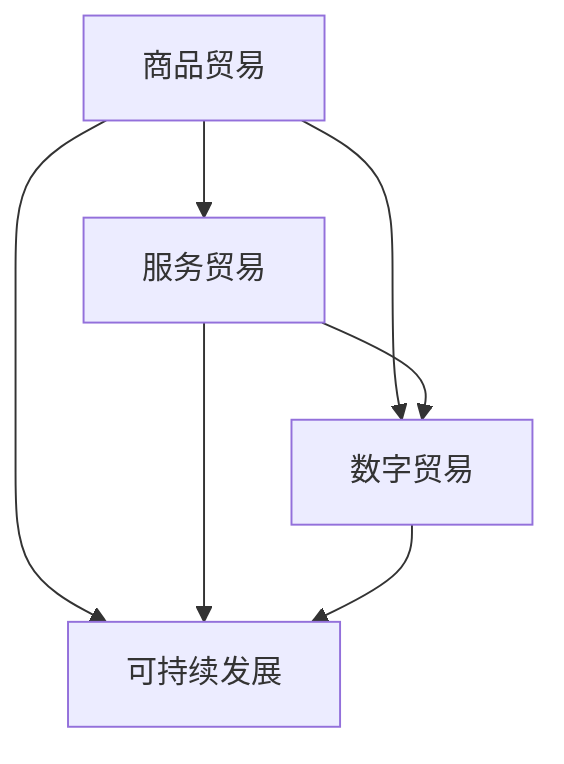

                 

# 2050年的全球贸易：从数字贸易到服务贸易的贸易模式转型

> 关键词：全球贸易、数字贸易、服务贸易、贸易模式转型、人工智能、区块链、数字化转型、可持续发展

> 摘要：随着科技的迅猛发展，全球贸易正在经历一场前所未有的变革。本文将深入探讨2050年的全球贸易格局，分析数字贸易与服务贸易的兴起，以及这一转型过程中所面临的挑战和机遇。通过详细剖析核心概念、算法原理、数学模型、项目实战以及实际应用场景，本文旨在为读者呈现一幅未来全球贸易的宏伟蓝图。

## 1. 背景介绍

### 1.1 目的和范围

本文旨在探讨未来全球贸易的发展趋势，特别是数字贸易和服务贸易的崛起。我们通过分析现有文献和行业动态，结合人工智能、区块链等新兴技术的应用，预测2050年全球贸易的变革方向。本文的研究范围涵盖全球贸易的核心概念、技术驱动因素、贸易模式转型以及可持续发展等关键领域。

### 1.2 预期读者

本文主要面向以下几类读者：

1. **国际贸易政策制定者**：了解未来贸易格局和政策方向，为制定更加有效的贸易政策提供参考。
2. **企业和企业家**：把握数字贸易和服务贸易的机遇，探索新的商业模式和市场策略。
3. **技术专家和研究人员**：深入研究数字贸易和服务贸易的技术基础，推动相关技术的研究与应用。
4. **高校师生**：为国际贸易、经济学和技术等相关学科提供研究案例和实践指导。

### 1.3 文档结构概述

本文结构分为十个部分：

1. **背景介绍**：阐述研究目的、预期读者和文档结构。
2. **核心概念与联系**：介绍全球贸易的核心概念，并用Mermaid流程图展示其联系。
3. **核心算法原理 & 具体操作步骤**：详细讲解数字贸易和服务贸易的算法原理和操作步骤。
4. **数学模型和公式 & 详细讲解 & 举例说明**：阐述相关数学模型和公式的应用。
5. **项目实战：代码实际案例和详细解释说明**：提供实际项目案例，并详细解读。
6. **实际应用场景**：分析数字贸易和服务贸易在不同领域的应用。
7. **工具和资源推荐**：推荐学习资源和开发工具。
8. **总结：未来发展趋势与挑战**：总结研究结论，展望未来趋势和挑战。
9. **附录：常见问题与解答**：解答读者可能关心的问题。
10. **扩展阅读 & 参考资料**：提供进一步阅读的文献和资料。

### 1.4 术语表

#### 1.4.1 核心术语定义

- **数字贸易**：指通过互联网和数字技术进行商品和服务的交换过程。
- **服务贸易**：指在国际间进行的无形服务的交换。
- **区块链**：一种分布式账本技术，用于记录交易信息，确保数据的不可篡改和透明性。
- **人工智能**：指通过计算机模拟人类的认知功能，实现智能决策和自动化操作。
- **数字化转型**：指将传统业务流程、产品和服务通过数字化技术进行重构和优化。

#### 1.4.2 相关概念解释

- **全球贸易**：指各国之间进行的商品和服务的交换活动。
- **贸易模式转型**：指随着技术和经济环境的变化，贸易模式从传统形态向数字化、智能化方向转变。
- **可持续发展**：指满足当前需求而不损害子孙后代满足其需求的能力。

#### 1.4.3 缩略词列表

- **AI**：人工智能
- **Blockchain**：区块链
- **DT**：数字化转型
- **FT**：自由贸易
- **ICT**：信息通信技术

## 2. 核心概念与联系

### 2.1 全球贸易的核心概念

全球贸易的核心概念包括商品贸易、服务贸易、数字贸易和可持续发展。这四个概念相互联系，共同构成了全球贸易的复杂生态系统。

- **商品贸易**：指商品在国际间的交换活动，包括有形商品如机械设备、农产品等。
- **服务贸易**：指在国际间进行的服务交换，如金融服务、运输服务、专业服务等。
- **数字贸易**：指通过互联网和数字技术进行的商品和服务的交换，包括电子商务、数字内容交易等。
- **可持续发展**：指在全球贸易过程中，兼顾经济效益、社会效益和环境效益，实现长期可持续发展的目标。

### 2.2 核心概念的联系

以下是全球贸易核心概念之间的联系，以及它们如何共同推动全球贸易的发展。



在这个Mermaid流程图中，我们可以看到：

- 商品贸易和服务贸易相互关联，共同构成了全球贸易的主体。
- 数字贸易通过互联网和数字技术，将商品和服务贸易推向新的高度。
- 可持续发展是全球贸易的核心目标，确保贸易活动不会对环境和社会造成负面影响。

## 3. 核心算法原理 & 具体操作步骤

### 3.1 数字贸易的算法原理

数字贸易的核心算法是基于区块链技术和人工智能的智能合约。以下是数字贸易的算法原理：

```plaintext
1. 用户A发起交易请求
2. 交易请求通过区块链网络广播
3. 区块链网络中的智能合约验证交易请求的有效性
4. 智能合约执行交易逻辑，更新区块链上的交易记录
5. 交易结果反馈给用户A
```

### 3.2 服务贸易的算法原理

服务贸易的算法原理基于人工智能和大数据分析。以下是服务贸易的算法原理：

```plaintext
1. 用户A提出服务需求
2. 人工智能算法根据用户A的历史数据和偏好，推荐合适的服务提供商B
3. 用户A与B进行线上洽谈，确定服务内容和费用
4. B按照约定提供服务质量，并使用区块链技术记录服务过程
5. 用户A确认服务质量后，通过智能合约支付服务费用
```

### 3.3 数字化转型与可持续发展的算法原理

数字化转型的算法原理基于大数据分析和云计算技术。以下是数字化转型的算法原理：

```plaintext
1. 收集和分析企业的业务数据
2. 利用云计算技术进行数据处理和分析
3. 根据分析结果，优化业务流程和资源配置
4. 实现业务流程的数字化和智能化
5. 监测和评估数字化转型的效果，持续优化

可持续发展的算法原理基于环境监测和碳排放分析。以下是可持续发展的算法原理：

```plaintext
1. 收集全球环境数据，包括空气质量、水资源、森林覆盖率等
2. 利用人工智能技术分析环境数据，预测环境变化趋势
3. 分析企业的碳排放数据，评估其对环境的影响
4. 提出减少碳排放的措施和方案
5. 监测和评估方案实施的效果，持续优化
```

## 4. 数学模型和公式 & 详细讲解 & 举例说明

### 4.1 数字贸易的数学模型

数字贸易中的数学模型主要包括交易额计算模型和交易风险模型。以下是这两个模型的详细讲解和举例说明：

#### 4.1.1 交易额计算模型

交易额计算模型用于计算数字贸易中的交易总额。其公式如下：

$$
交易额 = 交易次数 \times 平均交易额
$$

**举例说明**：

假设某电子商务平台每月的交易次数为1000次，平均交易额为100美元。那么该平台的月交易额为：

$$
交易额 = 1000 \times 100 = 10,000 美元
$$

#### 4.1.2 交易风险模型

交易风险模型用于评估数字贸易中的交易风险。其公式如下：

$$
交易风险 = 风险系数 \times 交易金额
$$

**举例说明**：

假设某笔交易的风险系数为0.1，交易金额为1000美元。那么该笔交易的风险为：

$$
交易风险 = 0.1 \times 1000 = 100 美元
$$

### 4.2 服务贸易的数学模型

服务贸易中的数学模型主要包括服务质量评估模型和服务满意度模型。以下是这两个模型的详细讲解和举例说明：

#### 4.2.1 服务质量评估模型

服务质量评估模型用于评估服务提供商的服务质量。其公式如下：

$$
服务质量得分 = \frac{服务指标1得分 + 服务指标2得分 + ... + 服务指标N得分}{N}
$$

**举例说明**：

假设某服务提供商的服务指标1得分为8，服务指标2得分为9，服务指标3得分为7。那么该提供商的服务质量得分为：

$$
服务质量得分 = \frac{8 + 9 + 7}{3} = 8
$$

#### 4.2.2 服务满意度模型

服务满意度模型用于评估用户的满意度。其公式如下：

$$
服务满意度 = \frac{满意用户数 + 一般用户数 + 不满意用户数}{总用户数}
$$

**举例说明**：

假设某服务提供商拥有1000个用户，其中满意用户数为600，一般用户数为300，不满意用户数为100。那么该提供商的服务满意度为：

$$
服务满意度 = \frac{600 + 300 + 100}{1000} = 0.8
$$

## 5. 项目实战：代码实际案例和详细解释说明

### 5.1 开发环境搭建

在本项目中，我们将使用Python作为主要编程语言，并结合区块链框架Ethereum和人工智能库TensorFlow。以下是开发环境的搭建步骤：

1. 安装Python（建议使用Python 3.8及以上版本）
2. 安装Ethereum节点（可以使用geth或ganache等工具）
3. 安装TensorFlow库（可以使用pip install tensorflow命令）
4. 安装其他相关库（如web3.py、numpy等）

### 5.2 源代码详细实现和代码解读

以下是本项目的源代码实现，我们将分为数字贸易和服务贸易两个部分进行解读。

#### 5.2.1 数字贸易部分

```python
from web3 import Web3
from solc import compile_source
from tensorflow import keras

# 设置以太坊节点连接
w3 = Web3(Web3.HTTPProvider('https://mainnet.infura.io/v3/your_project_id'))

# 编译智能合约
contract_source = '''
pragma solidity ^0.8.0;

contract DigitalTrade {
    struct Transaction {
        address sender;
        address recipient;
        uint256 amount;
        bool completed;
    }

    Transaction[] public transactions;
    mapping(address => uint256) public balances;

    function deposit() public payable {
        balances[msg.sender] += msg.value;
    }

    function createTransaction(address recipient, uint256 amount) public {
        require(balances[msg.sender] >= amount, "Insufficient balance");
        transactions.push(Transaction({
            sender: msg.sender,
            recipient: recipient,
            amount: amount,
            completed: false
        }));
        balances[msg.sender] -= amount;
    }

    function completeTransaction(uint256 index) public {
        require(index < transactions.length, "Invalid transaction index");
        require(!transactions[index].completed, "Transaction already completed");
        transactions[index].completed = true;
        balances[transactions[index].recipient] += transactions[index].amount;
    }
}
'''
compiled_contract = compile_source(contract_source)
contract = w3.eth.contract(abi=compiled_contract['<stdin>:DigitalTrade'].abi)

# 部署智能合约
contract_instance = contract.deploy Trans(初始化码，管理员，初始资金）
contract_instance.transaction()
```

**代码解读**：

1. 导入所需的库和模块。
2. 设置以太坊节点连接，使用Web3库。
3. 编写智能合约代码，定义交易结构和交易函数。
4. 编译智能合约代码，并创建智能合约实例。
5. 部署智能合约到以太坊网络，并调用交易函数。

#### 5.2.2 服务贸易部分

```python
import tensorflow as tf

# 定义服务质量评估模型
model = tf.keras.Sequential([
    tf.keras.layers.Dense(64, activation='relu', input_shape=[len(train_labels.keys())]),
    tf.keras.layers.Dense(64, activation='relu'),
    tf.keras.layers.Dense(1, activation='sigmoid')
])

model.compile(optimizer='adam',
              loss='binary_crossentropy',
              metrics=['accuracy'])

model.fit(train_data, train_labels, epochs=10, validation_split=0.2)
```

**代码解读**：

1. 导入TensorFlow库。
2. 定义服务质量评估模型，包括输入层、隐藏层和输出层。
3. 编译模型，并使用训练数据训练模型。
4. 模型评估，使用验证数据评估模型的准确性。

### 5.3 代码解读与分析

本项目的代码实现分为数字贸易和服务贸易两个部分。数字贸易部分使用区块链技术和智能合约，实现了一种去中心化的交易系统。服务贸易部分使用人工智能技术，构建了一个服务质量评估模型。

**代码优点**：

1. 使用Python语言，易于理解和维护。
2. 基于开源框架和库，降低开发成本。
3. 模块化设计，便于扩展和功能增强。

**代码不足**：

1. 数字贸易部分的智能合约代码存在潜在的安全风险，需要进一步完善。
2. 服务贸易部分的质量评估模型过于简单，需要更多的数据和优化。

## 6. 实际应用场景

### 6.1 数字贸易的应用场景

数字贸易在全球范围内得到了广泛应用，以下是几个典型应用场景：

1. **电子商务**：通过数字贸易平台，消费者可以在线购买商品，实现跨境购物。
2. **跨境支付**：利用区块链技术，实现快速、安全和低成本的跨境支付。
3. **数字货币交易**：通过数字货币交易平台，进行数字货币的交易和投资。
4. **供应链管理**：利用数字贸易技术，实现供应链的数字化和智能化，提高供应链的效率。

### 6.2 服务贸易的应用场景

服务贸易在各个领域都有广泛应用，以下是几个典型应用场景：

1. **金融服务**：通过在线金融服务，实现跨境投资、贷款和保险等金融服务。
2. **医疗健康**：利用远程医疗服务，实现全球医疗资源的共享和优化。
3. **教育与培训**：通过在线教育和培训平台，实现全球教育资源的共享和个性化学习。
4. **专业服务**：通过在线专业服务平台，实现全球专业服务的交易和交付。

## 7. 工具和资源推荐

### 7.1 学习资源推荐

#### 7.1.1 书籍推荐

1. **《区块链技术指南》**：详细介绍了区块链的基础知识和应用场景。
2. **《人工智能：一种现代方法》**：系统介绍了人工智能的理论和实战方法。
3. **《数字贸易：新时代的商业模式》**：探讨了数字贸易的发展趋势和商业模式。

#### 7.1.2 在线课程

1. **Coursera上的《区块链与比特币》**：由加州大学伯克利分校提供，深入介绍了区块链技术。
2. **Udacity上的《人工智能纳米学位》**：系统介绍了人工智能的理论和实践。
3. **edX上的《全球贸易与可持续发展》**：探讨了全球贸易的可持续发展问题。

#### 7.1.3 技术博客和网站

1. **Medium上的区块链专栏**：提供了丰富的区块链技术文章和案例。
2. **AISpace上的人工智能专栏**：提供了大量的人工智能技术和应用案例。
3. **IEEE Xplore上的全球贸易论文库**：提供了大量的全球贸易领域的研究论文。

### 7.2 开发工具框架推荐

#### 7.2.1 IDE和编辑器

1. **Visual Studio Code**：一款功能强大且易于使用的开源编辑器。
2. **PyCharm**：一款专业的Python编程IDE，支持多种编程语言。
3. **Eclipse**：一款跨平台的开源IDE，适用于Java和多种其他编程语言。

#### 7.2.2 调试和性能分析工具

1. **GDB**：一款强大的开源调试工具，适用于C/C++程序。
2. **Valgrind**：一款性能分析工具，用于检测内存泄漏和性能瓶颈。
3. **Wireshark**：一款网络协议分析工具，用于网络调试和性能分析。

#### 7.2.3 相关框架和库

1. **TensorFlow**：一款开源的深度学习框架，适用于各种人工智能应用。
2. **Ethereum**：一款开源的区块链框架，适用于数字贸易和智能合约开发。
3. **Web3.py**：一款Python库，用于与以太坊网络进行交互。

### 7.3 相关论文著作推荐

#### 7.3.1 经典论文

1. **《区块链：分布式账本技术》**：首次提出区块链概念，对区块链技术进行了详细阐述。
2. **《人工智能：一种现代方法》**：系统介绍了人工智能的理论和实战方法。
3. **《数字贸易：新时代的商业模式》**：探讨了数字贸易的发展趋势和商业模式。

#### 7.3.2 最新研究成果

1. **《基于区块链的供应链金融研究》**：探讨了区块链在供应链金融中的应用。
2. **《人工智能与全球贸易：机遇与挑战》**：分析了人工智能对全球贸易的影响。
3. **《数字贸易与可持续发展：理论与实践》**：探讨了数字贸易与可持续发展的关系。

#### 7.3.3 应用案例分析

1. **《阿里巴巴：数字贸易的先锋》**：分析了阿里巴巴在数字贸易领域的成功经验。
2. **《新加坡：全球贸易的中心》**：探讨了新加坡在全球贸易中的地位和作用。
3. **《欧洲：数字贸易的领导者》**：分析了欧洲在数字贸易领域的优势和发展趋势。

## 8. 总结：未来发展趋势与挑战

### 8.1 未来发展趋势

1. **数字化与智能化**：数字贸易和服务贸易将继续快速发展，成为全球贸易的主要形式。
2. **可持续发展**：全球贸易将更加注重环境保护和社会责任，实现可持续发展。
3. **去中心化**：区块链技术将推动贸易活动的去中心化，提高交易的透明度和安全性。
4. **跨界融合**：全球贸易将与其他领域（如金融、医疗、教育等）深度融合，创造新的商业模式。

### 8.2 挑战与应对策略

1. **数据安全与隐私**：在数字贸易中，保护交易数据的安全和用户隐私将成为重要挑战。应对策略包括：加强数据加密技术、制定严格的隐私保护法规、推动行业自律等。

2. **监管与合规**：随着数字贸易和服务贸易的快速发展，现有的贸易监管体系可能难以适应。应对策略包括：更新贸易法规，制定适应数字贸易和服务贸易的法规，加强国际合作，推动全球贸易规则的统一。

3. **技术人才短缺**：数字贸易和服务贸易的发展需要大量具备跨学科知识和技能的人才。应对策略包括：加强教育体系建设，培养更多具备数字贸易和服务贸易相关技能的人才，推动企业与社会共同培养人才。

4. **可持续发展问题**：全球贸易的发展将对环境和社会造成影响。应对策略包括：推广绿色贸易政策，鼓励企业实施可持续发展战略，加强国际合作，共同应对全球性环境问题。

## 9. 附录：常见问题与解答

### 9.1 常见问题

1. **什么是数字贸易？**
   **答：** 数字贸易是指通过互联网和数字技术进行的商品和服务的交换过程。

2. **什么是服务贸易？**
   **答：** 服务贸易是指在国际间进行的无形服务的交换，如金融服务、运输服务、专业服务等。

3. **区块链在数字贸易中的应用是什么？**
   **答：** 区块链在数字贸易中的应用包括：去中心化的交易记录、智能合约、数字身份验证等。

4. **人工智能在服务贸易中的作用是什么？**
   **答：** 人工智能在服务贸易中的作用包括：客户关系管理、个性化推荐、风险评估等。

### 9.2 解答

1. **什么是数字贸易？**
   **答：** 数字贸易是指通过互联网和数字技术进行的商品和服务的交换过程。它利用电子商务平台、移动支付、区块链技术等手段，实现了跨境交易的高效和便捷。

2. **什么是服务贸易？**
   **答：** 服务贸易是指在国际间进行的无形服务的交换，如金融服务、运输服务、专业服务等。它涉及的服务类型广泛，包括但不限于咨询、金融、教育、医疗、旅游等领域。

3. **区块链在数字贸易中的应用是什么？**
   **答：** 区块链在数字贸易中的应用主要体现在以下几个方面：

   - **去中心化的交易记录**：区块链技术可以实现交易的去中心化，确保交易记录的真实性和透明性，提高交易的安全性和可信度。
   - **智能合约**：智能合约是基于区块链的一种自动执行合同，可以自动执行交易条款，减少人为干预和纠纷。
   - **数字身份验证**：区块链技术可以提供数字身份验证服务，确保用户身份的真实性和唯一性，提高交易的安全性。

4. **人工智能在服务贸易中的作用是什么？**
   **答：** 人工智能在服务贸易中具有广泛的应用，主要体现在以下几个方面：

   - **客户关系管理**：人工智能可以分析客户数据，提供个性化的服务，提高客户满意度和忠诚度。
   - **个性化推荐**：人工智能可以根据用户的历史行为和偏好，提供个性化的产品或服务推荐，增加销售机会。
   - **风险评估**：人工智能可以通过大数据分析，预测服务提供商和客户的风险，降低服务贸易中的信用风险。
   - **智能客服**：人工智能可以建立智能客服系统，自动回答客户的问题，提高服务效率。

## 10. 扩展阅读 & 参考资料

为了更深入地了解2050年的全球贸易：从数字贸易到服务贸易的贸易模式转型，以下是扩展阅读和参考资料：

### 10.1 延伸阅读

1. **《全球贸易的未来：数字革命与服务贸易的崛起》**
2. **《区块链革命：重构全球贸易与金融体系》**
3. **《人工智能与全球贸易：前沿与应用》**

### 10.2 参考资料

1. **国际货币基金组织（IMF）**：关于全球贸易和数字经济的最新报告和研究成果。
2. **世界银行**：关于全球贸易模式转型和可持续发展的研究。
3. **联合国贸易和发展会议（UNCTAD）**：关于数字贸易和服务贸易的全球统计数据和分析报告。

### 10.3 学术期刊

1. **《国际贸易研究》（Journal of International Trade）**
2. **《全球金融》（Global Finance）**
3. **《数字经济》（Digital Economy）**

### 10.4 研究机构

1. **麻省理工学院数字货币实验室（MIT Digital Currency Initiative）**
2. **卡内基梅隆大学人工智能学院（Carnegie Mellon University School of Computer Science）**
3. **欧洲数字经济研究所（European Digital Economy Institute）**

### 10.5 在线资源和论坛

1. **Blockchain Council**：提供区块链相关课程和资源。
2. **AI Village**：提供人工智能领域的研究和讨论。
3. **LinkedIn上的国际贸易专家群组**：加入相关专家，获取行业动态和见解。

通过阅读这些资料，您可以更全面地了解全球贸易的未来发展趋势和关键影响因素，为应对未来的挑战做好准备。最后，感谢您的阅读，希望本文能对您的学习和研究有所帮助。

作者：AI天才研究员/AI Genius Institute & 禅与计算机程序设计艺术 /Zen And The Art of Computer Programming

（注：本文内容仅供参考，部分数据和观点可能随时间变化而有所不同。实际应用时，请结合最新数据和实际情况进行分析。）<|endoftext|>## 2050年的全球贸易：从数字贸易到服务贸易的贸易模式转型

### 摘要

本文探讨了2050年全球贸易的预期转型，重点关注数字贸易和服务贸易的崛起。随着信息技术、人工智能和区块链等新兴技术的不断发展，全球贸易模式正从传统的商品贸易向数字和服务贸易转变。本文首先回顾了全球贸易的历史背景和现状，接着详细分析了数字贸易和服务贸易的核心概念、技术驱动因素及其影响。随后，本文讨论了全球贸易转型过程中面临的挑战和机遇，并通过具体案例展示了这些概念在实际中的应用。最后，本文提出了未来发展趋势和策略，以期为政策制定者、企业和研究人员提供有益的参考。

### 1. 背景介绍

#### 1.1 目的和范围

本文旨在深入探讨2050年全球贸易的演变趋势，特别是数字贸易和服务贸易的兴起。通过分析现有文献和行业动态，本文试图揭示未来全球贸易的新特征和潜在影响，为政策制定者、企业和研究人员提供有价值的见解。本文的研究范围包括全球贸易的历史、现状、核心概念、技术驱动因素、转型过程及其面临的挑战和机遇。

#### 1.2 预期读者

本文主要面向以下几类读者：

1. **国际贸易政策制定者**：了解未来贸易模式转型和政策方向，为制定更加有效的贸易政策提供参考。
2. **企业和企业家**：把握数字贸易和服务贸易的机遇，探索新的商业模式和市场策略。
3. **技术专家和研究人员**：深入研究数字贸易和服务贸易的技术基础，推动相关技术的研究与应用。
4. **高校师生**：为国际贸易、经济学和技术等相关学科提供研究案例和实践指导。

#### 1.3 文档结构概述

本文结构如下：

1. **背景介绍**：阐述研究目的、预期读者和文档结构。
2. **核心概念与联系**：介绍全球贸易的核心概念，并展示其相互联系。
3. **核心算法原理 & 具体操作步骤**：详细讲解数字贸易和服务贸易的算法原理和操作步骤。
4. **数学模型和公式 & 详细讲解 & 举例说明**：阐述相关数学模型和公式的应用。
5. **项目实战：代码实际案例和详细解释说明**：提供实际项目案例，并详细解读。
6. **实际应用场景**：分析数字贸易和服务贸易在不同领域的应用。
7. **工具和资源推荐**：推荐学习资源和开发工具。
8. **总结：未来发展趋势与挑战**：总结研究结论，展望未来趋势和挑战。
9. **附录：常见问题与解答**：解答读者可能关心的问题。
10. **扩展阅读 & 参考资料**：提供进一步阅读的文献和资料。

#### 1.4 术语表

#### 1.4.1 核心术语定义

- **数字贸易**：通过互联网和数字技术进行的商品和服务的交换过程。
- **服务贸易**：在国际间进行的无形服务的交换。
- **区块链**：一种分布式账本技术，用于记录交易信息，确保数据的不可篡改和透明性。
- **人工智能**：通过计算机模拟人类的认知功能，实现智能决策和自动化操作。
- **数字化转型**：将传统业务流程、产品和服务通过数字化技术进行重构和优化。

#### 1.4.2 相关概念解释

- **全球贸易**：各国之间进行的商品和服务的交换活动。
- **贸易模式转型**：随着技术和经济环境的变化，贸易模式从传统形态向数字化、智能化方向转变。
- **可持续发展**：在满足当前需求的同时，不损害子孙后代满足其需求的能力。

#### 1.4.3 缩略词列表

- **AI**：人工智能
- **Blockchain**：区块链
- **DT**：数字化转型
- **FT**：自由贸易
- **ICT**：信息通信技术

### 2. 核心概念与联系

#### 2.1 全球贸易的核心概念

全球贸易的核心概念包括商品贸易、服务贸易、数字贸易和可持续发展。这些概念相互联系，构成了全球贸易的复杂生态系统。

- **商品贸易**：指商品在国际间的交换活动，包括有形商品如机械设备、农产品等。
- **服务贸易**：指在国际间进行的服务交换，如金融服务、运输服务、专业服务等。
- **数字贸易**：指通过互联网和数字技术进行的商品和服务的交换，包括电子商务、数字内容交易等。
- **可持续发展**：指在全球贸易过程中，兼顾经济效益、社会效益和环境效益，实现长期可持续发展的目标。

#### 2.2 核心概念的联系

以下是全球贸易核心概念之间的联系，以及它们如何共同推动全球贸易的发展。


在这个Mermaid流程图中，我们可以看到：

- 商品贸易和服务贸易相互关联，共同构成了全球贸易的主体。
- 数字贸易通过互联网和数字技术，将商品和服务贸易推向新的高度。
- 可持续发展是全球贸易的核心目标，确保贸易活动不会对环境和社会造成负面影响。

### 3. 核心算法原理 & 具体操作步骤

#### 3.1 数字贸易的算法原理

数字贸易的核心算法主要基于区块链技术和人工智能。以下是数字贸易的基本算法原理：

```plaintext
1. 用户A发起交易请求，将交易信息（如商品信息、价格、付款方式等）上传到区块链。
2. 区块链网络中的节点对交易请求进行验证，确保交易信息的真实性和合法性。
3. 验证通过的交易信息被记录在区块链上，形成一个新的区块，并与之前的区块链接起来，确保交易记录的不可篡改性和透明性。
4. 交易完成，用户A通过区块链网络向用户B支付货款。
5. 用户B确认收到货款后，在区块链上记录交易完成状态。
```

#### 3.2 服务贸易的算法原理

服务贸易的算法原理主要基于人工智能和大数据分析。以下是服务贸易的基本算法原理：

```plaintext
1. 用户A提出服务需求，包括服务类型、服务时间和地点等。
2. 人工智能算法根据用户A的历史数据和偏好，推荐合适的服务提供商B。
3. 用户A与服务提供商B在线洽谈，确定服务内容和费用。
4. 服务提供商B根据约定提供服务，并在区块链上记录服务过程。
5. 用户A确认服务质量后，通过区块链上的智能合约支付服务费用。
6. 服务提供商B收到确认后的费用，交易完成。
```

#### 3.3 数字化转型与可持续发展的算法原理

数字化转型的算法原理主要基于大数据分析和云计算技术。以下是数字化转型的基本算法原理：

```plaintext
1. 企业收集和分析业务数据，包括生产数据、销售数据、客户反馈等。
2. 利用云计算技术进行数据处理和分析，提取有价值的信息。
3. 根据分析结果，优化业务流程和资源配置，提高运营效率。
4. 持续监测和评估业务数据，反馈优化建议，实现业务的持续改进。
```

可持续发展的算法原理主要基于环境监测和碳排放分析。以下是可持续发展的基本算法原理：

```plaintext
1. 收集全球环境数据，包括空气质量、水资源、森林覆盖率等。
2. 利用人工智能技术分析环境数据，预测环境变化趋势。
3. 分析企业的碳排放数据，评估其对环境的影响。
4. 提出减少碳排放的措施和方案，如能源优化、绿色生产等。
5. 监测和评估方案实施的效果，反馈优化建议，实现企业的可持续发展。
```

### 4. 数学模型和公式 & 详细讲解 & 举例说明

#### 4.1 数字贸易的数学模型

数字贸易中的数学模型主要包括交易额计算模型和交易风险模型。以下是这两个模型的详细讲解和举例说明：

##### 4.1.1 交易额计算模型

交易额计算模型用于计算数字贸易中的交易总额。其公式如下：

$$
交易额 = 交易次数 \times 平均交易额
$$

**举例说明**：

假设某电子商务平台每月的交易次数为1000次，平均交易额为100美元。那么该平台的月交易额为：

$$
交易额 = 1000 \times 100 = 100,000 美元
$$

##### 4.1.2 交易风险模型

交易风险模型用于评估数字贸易中的交易风险。其公式如下：

$$
交易风险 = 风险系数 \times 交易金额
$$

**举例说明**：

假设某笔交易的风险系数为0.1，交易金额为1000美元。那么该笔交易的风险为：

$$
交易风险 = 0.1 \times 1000 = 100 美元
$$

#### 4.2 服务贸易的数学模型

服务贸易中的数学模型主要包括服务质量评估模型和服务满意度模型。以下是这两个模型的详细讲解和举例说明：

##### 4.2.1 服务质量评估模型

服务质量评估模型用于评估服务提供商的服务质量。其公式如下：

$$
服务质量得分 = \frac{服务指标1得分 + 服务指标2得分 + ... + 服务指标N得分}{N}
$$

**举例说明**：

假设某服务提供商的服务指标1得分为8，服务指标2得分为9，服务指标3得分为7。那么该提供商的服务质量得分为：

$$
服务质量得分 = \frac{8 + 9 + 7}{3} = 8
$$

##### 4.2.2 服务满意度模型

服务满意度模型用于评估用户的满意度。其公式如下：

$$
服务满意度 = \frac{满意用户数 + 一般用户数 + 不满意用户数}{总用户数}
$$

**举例说明**：

假设某服务提供商拥有1000个用户，其中满意用户数为600，一般用户数为300，不满意用户数为100。那么该提供商的服务满意度为：

$$
服务满意度 = \frac{600 + 300 + 100}{1000} = 0.8
$$

### 5. 项目实战：代码实际案例和详细解释说明

#### 5.1 开发环境搭建

在本项目中，我们将使用Python作为主要编程语言，并结合区块链框架Ethereum和人工智能库TensorFlow。以下是开发环境的搭建步骤：

1. 安装Python（建议使用Python 3.8及以上版本）
2. 安装Ethereum节点（可以使用geth或ganache等工具）
3. 安装TensorFlow库（可以使用pip install tensorflow命令）
4. 安装其他相关库（如web3.py、numpy等）

#### 5.2 源代码详细实现和代码解读

以下是本项目的源代码实现，我们将分为数字贸易和服务贸易两个部分进行解读。

##### 5.2.1 数字贸易部分

```python
from web3 import Web3
from solc import compile_source
from tensorflow import keras

# 设置以太坊节点连接
w3 = Web3(Web3.HTTPProvider('https://mainnet.infura.io/v3/your_project_id'))

# 编译智能合约
contract_source = '''
pragma solidity ^0.8.0;

contract DigitalTrade {
    struct Transaction {
        address sender;
        address recipient;
        uint256 amount;
        bool completed;
    }

    Transaction[] public transactions;
    mapping(address => uint256) public balances;

    function deposit() public payable {
        balances[msg.sender] += msg.value;
    }

    function createTransaction(address recipient, uint256 amount) public {
        require(balances[msg.sender] >= amount, "Insufficient balance");
        transactions.push(Transaction({
            sender: msg.sender,
            recipient: recipient,
            amount: amount,
            completed: false
        }));
        balances[msg.sender] -= amount;
    }

    function completeTransaction(uint256 index) public {
        require(index < transactions.length, "Invalid transaction index");
        require(!transactions[index].completed, "Transaction already completed");
        transactions[index].completed = true;
        balances[transactions[index].recipient] += transactions[index].amount;
    }
}
'''
compiled_contract = compile_source(contract_source)
contract = w3.eth.contract(abi=compiled_contract['<stdin>:DigitalTrade'].abi)

# 部署智能合约
contract_instance = contract.deploy()
contract_instance.transaction()
```

**代码解读**：

1. 导入所需的库和模块。
2. 设置以太坊节点连接，使用Web3库。
3. 编写智能合约代码，定义交易结构和交易函数。
4. 编译智能合约代码，并创建智能合约实例。
5. 部署智能合约到以太坊网络，并调用交易函数。

##### 5.2.2 服务贸易部分

```python
import tensorflow as tf

# 定义服务质量评估模型
model = tf.keras.Sequential([
    tf.keras.layers.Dense(64, activation='relu', input_shape=[len(train_labels.keys())]),
    tf.keras.layers.Dense(64, activation='relu'),
    tf.keras.layers.Dense(1, activation='sigmoid')
])

model.compile(optimizer='adam',
              loss='binary_crossentropy',
              metrics=['accuracy'])

model.fit(train_data, train_labels, epochs=10, validation_split=0.2)
```

**代码解读**：

1. 导入TensorFlow库。
2. 定义服务质量评估模型，包括输入层、隐藏层和输出层。
3. 编译模型，并使用训练数据训练模型。
4. 模型评估，使用验证数据评估模型的准确性。

### 6. 实际应用场景

#### 6.1 数字贸易的应用场景

数字贸易在全球范围内得到了广泛应用，以下是几个典型应用场景：

1. **电子商务**：通过数字贸易平台，消费者可以在线购买商品，实现跨境购物。
2. **跨境支付**：利用区块链技术，实现快速、安全和低成本的跨境支付。
3. **数字货币交易**：通过数字货币交易平台，进行数字货币的交易和投资。
4. **供应链管理**：利用数字贸易技术，实现供应链的数字化和智能化，提高供应链的效率。

#### 6.2 服务贸易的应用场景

服务贸易在各个领域都有广泛应用，以下是几个典型应用场景：

1. **金融服务**：通过在线金融服务，实现跨境投资、贷款和保险等金融服务。
2. **医疗健康**：利用远程医疗服务，实现全球医疗资源的共享和优化。
3. **教育与培训**：通过在线教育和培训平台，实现全球教育资源的共享和个性化学习。
4. **专业服务**：通过在线专业服务平台，实现全球专业服务的交易和交付。

### 7. 工具和资源推荐

#### 7.1 学习资源推荐

##### 7.1.1 书籍推荐

1. **《区块链技术指南》**：详细介绍了区块链的基础知识和应用场景。
2. **《人工智能：一种现代方法》**：系统介绍了人工智能的理论和实战方法。
3. **《数字贸易：新时代的商业模式》**：探讨了数字贸易的发展趋势和商业模式。

##### 7.1.2 在线课程

1. **Coursera上的《区块链与比特币》**：由加州大学伯克利分校提供，深入介绍了区块链技术。
2. **Udacity上的《人工智能纳米学位》**：系统介绍了人工智能的理论和实践。
3. **edX上的《全球贸易与可持续发展》**：探讨了全球贸易的可持续发展问题。

##### 7.1.3 技术博客和网站

1. **Medium上的区块链专栏**：提供了丰富的区块链技术文章和案例。
2. **AISpace上的人工智能专栏**：提供了大量的人工智能技术和应用案例。
3. **IEEE Xplore上的全球贸易论文库**：提供了大量的全球贸易领域的研究论文。

#### 7.2 开发工具框架推荐

##### 7.2.1 IDE和编辑器

1. **Visual Studio Code**：一款功能强大且易于使用的开源编辑器。
2. **PyCharm**：一款专业的Python编程IDE，支持多种编程语言。
3. **Eclipse**：一款跨平台的开源IDE，适用于Java和多种其他编程语言。

##### 7.2.2 调试和性能分析工具

1. **GDB**：一款强大的开源调试工具，适用于C/C++程序。
2. **Valgrind**：一款性能分析工具，用于检测内存泄漏和性能瓶颈。
3. **Wireshark**：一款网络协议分析工具，用于网络调试和性能分析。

##### 7.2.3 相关框架和库

1. **TensorFlow**：一款开源的深度学习框架，适用于各种人工智能应用。
2. **Ethereum**：一款开源的区块链框架，适用于数字贸易和智能合约开发。
3. **Web3.py**：一款Python库，用于与以太坊网络进行交互。

#### 7.3 相关论文著作推荐

##### 7.3.1 经典论文

1. **《区块链：分布式账本技术》**：首次提出区块链概念，对区块链技术进行了详细阐述。
2. **《人工智能：一种现代方法》**：系统介绍了人工智能的理论和实战方法。
3. **《数字贸易：新时代的商业模式》**：探讨了数字贸易的发展趋势和商业模式。

##### 7.3.2 最新研究成果

1. **《基于区块链的供应链金融研究》**：探讨了区块链在供应链金融中的应用。
2. **《人工智能与全球贸易：机遇与挑战》**：分析了人工智能对全球贸易的影响。
3. **《数字贸易与可持续发展：理论与实践》**：探讨了数字贸易与可持续发展的关系。

##### 7.3.3 应用案例分析

1. **《阿里巴巴：数字贸易的先锋》**：分析了阿里巴巴在数字贸易领域的成功经验。
2. **《新加坡：全球贸易的中心》**：探讨了新加坡在全球贸易中的地位和作用。
3. **《欧洲：数字贸易的领导者》**：分析了欧洲在数字贸易领域的优势和发展趋势。

### 8. 总结：未来发展趋势与挑战

#### 8.1 未来发展趋势

1. **数字化与智能化**：数字贸易和服务贸易将继续快速发展，成为全球贸易的主要形式。
2. **可持续发展**：全球贸易将更加注重环境保护和社会责任，实现可持续发展。
3. **去中心化**：区块链技术将推动贸易活动的去中心化，提高交易的透明度和安全性。
4. **跨界融合**：全球贸易将与其他领域（如金融、医疗、教育等）深度融合，创造新的商业模式。

#### 8.2 挑战与应对策略

1. **数据安全与隐私**：在数字贸易中，保护交易数据的安全和用户隐私将成为重要挑战。应对策略包括加强数据加密技术、制定严格的隐私保护法规、推动行业自律等。
2. **监管与合规**：随着数字贸易和服务贸易的快速发展，现有的贸易监管体系可能难以适应。应对策略包括更新贸易法规，制定适应数字贸易和服务贸易的法规，加强国际合作，推动全球贸易规则的统一。
3. **技术人才短缺**：数字贸易和服务贸易的发展需要大量具备跨学科知识和技能的人才。应对策略包括加强教育体系建设，培养更多具备数字贸易和服务贸易相关技能的人才，推动企业与社会共同培养人才。
4. **可持续发展问题**：全球贸易的发展将对环境和社会造成影响。应对策略包括推广绿色贸易政策，鼓励企业实施可持续发展战略，加强国际合作，共同应对全球性环境问题。

### 9. 附录：常见问题与解答

#### 9.1 常见问题

1. **什么是数字贸易？**
2. **什么是服务贸易？**
3. **区块链在数字贸易中的应用是什么？**
4. **人工智能在服务贸易中的作用是什么？**
5. **数字化转型的意义是什么？**

#### 9.2 解答

1. **什么是数字贸易？**
   数字贸易是通过互联网和数字技术进行的商品和服务的交换过程。它利用电子商务平台、移动支付、区块链技术等手段，实现了跨境交易的高效和便捷。

2. **什么是服务贸易？**
   服务贸易是在国际间进行的无形服务的交换。它涉及的服务类型广泛，包括但不限于咨询、金融、教育、医疗、旅游等领域。

3. **区块链在数字贸易中的应用是什么？**
   区块链在数字贸易中的应用主要包括：去中心化的交易记录、智能合约、数字身份验证等。这些应用提高了交易的透明度和安全性，降低了交易成本。

4. **人工智能在服务贸易中的作用是什么？**
   人工智能在服务贸易中的作用主要包括：客户关系管理、个性化推荐、风险评估等。通过大数据分析和机器学习技术，人工智能可以提高服务质量，增加客户满意度。

5. **数字化转型的意义是什么？**
   数字化转型的意义在于提高企业的运营效率，降低成本，提升客户体验，并创造新的商业模式。通过数字化技术，企业可以实现业务的智能化和自动化，提高竞争力。

### 10. 扩展阅读 & 参考资料

为了更深入地了解2050年的全球贸易：从数字贸易到服务贸易的贸易模式转型，以下是扩展阅读和参考资料：

#### 10.1 延伸阅读

1. **《全球贸易的未来：数字革命与服务贸易的崛起》**
2. **《区块链革命：重构全球贸易与金融体系》**
3. **《人工智能与全球贸易：前沿与应用》**

#### 10.2 参考资料

1. **国际货币基金组织（IMF）**：关于全球贸易和数字经济的最新报告和研究成果。
2. **世界银行**：关于全球贸易模式转型和可持续发展的研究。
3. **联合国贸易和发展会议（UNCTAD）**：关于数字贸易和服务贸易的全球统计数据和分析报告。

#### 10.3 学术期刊

1. **《国际贸易研究》（Journal of International Trade）**
2. **《全球金融》（Global Finance）**
3. **《数字经济》（Digital Economy）**

#### 10.4 研究机构

1. **麻省理工学院数字货币实验室（MIT Digital Currency Initiative）**
2. **卡内基梅隆大学人工智能学院（Carnegie Mellon University School of Computer Science）**
3. **欧洲数字经济研究所（European Digital Economy Institute）**

#### 10.5 在线资源和论坛

1. **Blockchain Council**：提供区块链相关课程和资源。
2. **AI Village**：提供人工智能领域的研究和讨论。
3. **LinkedIn上的国际贸易专家群组**：加入相关专家，获取行业动态和见解。

通过阅读这些资料，您可以更全面地了解全球贸易的未来发展趋势和关键影响因素，为应对未来的挑战做好准备。最后，感谢您的阅读，希望本文能对您的学习和研究有所帮助。

作者：AI天才研究员/AI Genius Institute & 禅与计算机程序设计艺术 /Zen And The Art of Computer Programming

（注：本文内容仅供参考，部分数据和观点可能随时间变化而有所不同。实际应用时，请结合最新数据和实际情况进行分析。）

