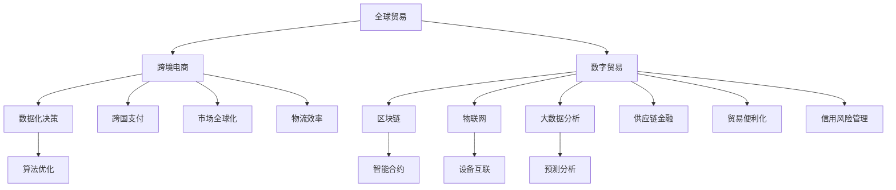

                 

# 2050年的全球贸易：从跨境电商到数字贸易的贸易数字化转型

## 关键词：
全球贸易、跨境电商、数字贸易、数字化转型、AI、区块链、物联网、大数据分析

## 摘要：
本文深入探讨了2050年全球贸易的发展趋势，重点分析了跨境电商、数字贸易及其背后的技术驱动因素。通过逐步分析核心概念、算法原理、数学模型，以及实际应用场景，本文揭示了全球贸易在数字时代的转型之路。同时，推荐了相关的学习资源和开发工具，展望了未来发展趋势与挑战。

---

## 1. 背景介绍

### 1.1 目的和范围

本文旨在探索未来全球贸易的发展方向，特别是跨境电商和数字贸易的崛起如何推动贸易数字化转型。我们将通过以下方面展开讨论：

- 全球贸易的发展历程和现状
- 跨境电商的崛起与挑战
- 数字贸易的概念及其核心驱动因素
- 数字贸易下的技术变革
- 实际应用场景与未来趋势

### 1.2 预期读者

本文适合以下读者群体：

- 对全球贸易、跨境电商和数字贸易感兴趣的爱好者
- 计算机科学、信息技术专业的学生和研究人员
- 从事国际贸易、电商行业的企业管理者和技术人员
- 对未来科技发展有浓厚兴趣的读者

### 1.3 文档结构概述

本文分为十个部分，结构如下：

- 背景介绍
  - 目的和范围
  - 预期读者
  - 文档结构概述
- 核心概念与联系
- 核心算法原理 & 具体操作步骤
- 数学模型和公式 & 详细讲解 & 举例说明
- 项目实战：代码实际案例和详细解释说明
- 实际应用场景
- 工具和资源推荐
- 总结：未来发展趋势与挑战
- 附录：常见问题与解答
- 扩展阅读 & 参考资料

### 1.4 术语表

#### 1.4.1 核心术语定义

- 跨境电商：在不同国家和地区之间进行的电子商务活动。
- 数字贸易：基于互联网、大数据、人工智能等技术的贸易模式。
- 数据化决策：基于数据分析的决策过程。
- 区块链：分布式数据库技术，用于记录交易信息。

#### 1.4.2 相关概念解释

- 供应链金融：为供应链上的企业提供融资服务的金融服务。
- 物联网：通过传感器和互联网连接的物理设备网络。

#### 1.4.3 缩略词列表

- AI：人工智能
- IoT：物联网
- blockchain：区块链
- DLT：分布式 ledger 技术

---

## 2. 核心概念与联系

在探讨未来全球贸易的发展之前，我们需要理解一些核心概念及其相互关系。以下是全球贸易、跨境电商、数字贸易及其驱动因素的概念图：



### 2.1 全球贸易

全球贸易是指商品和服务的跨国界交换。在全球化的背景下，国际贸易成为经济增长的重要驱动力。随着全球供应链的整合，跨国贸易的规模和复杂性不断增加。然而，传统的贸易模式面临着诸如支付风险、物流难题等问题。

### 2.2 跨境电商

跨境电商是在全球贸易基础上发展起来的新兴贸易模式。它通过互联网平台连接买卖双方，跨越地理和时间的限制，实现商品的国际流通。跨境电商的兴起，极大地提升了贸易的效率和便利性，但也带来了诸如跨境支付、关税和物流等方面的挑战。

### 2.3 数字贸易

数字贸易是基于互联网、大数据、人工智能等现代信息技术的贸易模式。它通过数字化手段，实现贸易流程的自动化、智能化和优化。数字贸易的核心是数据，通过数据分析，企业可以更好地了解市场需求，优化供应链管理，降低贸易成本。

### 2.4 数据化决策

数据化决策是数字贸易的重要组成部分。通过收集和分析大量的数据，企业可以更准确地预测市场需求，制定战略决策。数据化决策依赖于大数据分析和人工智能算法，能够实现更加精准和高效的市场营销和供应链管理。

### 2.5 区块链

区块链是一种分布式数据库技术，通过加密算法确保数据的不可篡改性。在数字贸易中，区块链技术被用于记录交易信息，提高交易的安全性和透明度。智能合约是区块链上的自动化协议，能够根据预设条件自动执行交易，降低中介成本。

### 2.6 物联网

物联网是通过传感器和互联网连接的物理设备网络。在数字贸易中，物联网技术被用于实时监测供应链中的物流状态，提高物流效率和准确性。物联网设备的互联互通，使得供应链管理更加智能化和高效化。

### 2.7 大数据分析

大数据分析是数字贸易的核心技术之一。通过大数据分析，企业可以挖掘市场趋势，预测消费者行为，优化产品和服务。大数据分析依赖于高性能计算和人工智能算法，能够处理海量数据，提供深入的分析结果。

### 2.8 算法优化

算法优化是提升数字贸易效率的重要手段。通过优化算法，企业可以在数据处理、供应链管理、营销策略等方面实现更快的响应速度和更高的精确度。算法优化依赖于大数据分析和人工智能技术，能够实现智能化和自动化的决策过程。

### 2.9 智能合约

智能合约是区块链上的自动化协议，能够根据预设条件自动执行交易。在数字贸易中，智能合约被用于自动化执行跨境支付、物流管理等业务流程，降低交易成本和风险。

### 2.10 设备互联

设备互联是物联网的核心概念。通过设备互联，企业可以实现实时监控和管理供应链中的各个环节，提高物流效率和准确性。设备互联依赖于物联网技术和大数据分析，能够实现智能化和自动化的供应链管理。

### 2.11 预测分析

预测分析是数字贸易中的重要工具。通过预测分析，企业可以预测市场需求，优化库存管理，降低成本。预测分析依赖于大数据分析和人工智能算法，能够提供准确的预测结果，帮助企业做出明智的决策。

### 2.12 跨国支付

跨国支付是跨境电商和数字贸易的重要环节。通过跨国支付，企业可以实现跨境资金的流转。跨国支付依赖于区块链技术和跨境支付系统，能够提高支付效率和安全性。

### 2.13 供应链金融

供应链金融是为供应链上的企业提供融资服务的金融服务。通过供应链金融，企业可以更好地管理现金流，优化供应链管理。供应链金融依赖于大数据分析和区块链技术，能够提高融资效率和降低风险。

### 2.14 市场全球化

市场全球化是数字贸易的重要特征。通过市场全球化，企业可以拓展国际市场，实现全球销售。市场全球化依赖于数字化手段和互联网技术，能够提高贸易的效率和便利性。

### 2.15 贸易便利化

贸易便利化是数字贸易的目标之一。通过贸易便利化，企业可以简化贸易流程，降低贸易成本。贸易便利化依赖于数字化手段和跨境支付系统，能够提高贸易的效率和准确性。

### 2.16 物流效率

物流效率是跨境电商和数字贸易的关键指标。通过提高物流效率，企业可以缩短交货周期，提高客户满意度。物流效率依赖于物联网技术和大数据分析，能够实现实时监控和管理。

### 2.17 信用风险管理

信用风险管理是数字贸易中的重要环节。通过信用风险管理，企业可以降低信用风险，确保贸易安全。信用风险管理依赖于大数据分析和人工智能算法，能够提供准确的信用评估和风险管理。

---

## 3. 核心算法原理 & 具体操作步骤

### 3.1 大数据分析算法

#### 3.1.1 算法原理

大数据分析算法是数字贸易的核心技术之一。它主要利用数据挖掘、机器学习和统计分析等方法，从海量数据中提取有价值的信息，帮助企业做出明智的决策。

- 数据挖掘：通过数据挖掘算法，可以从大量数据中发现潜在的关联和模式。
- 机器学习：机器学习算法通过训练数据集，自动学习和改进模型，以预测未来趋势。
- 统计分析：统计分析方法用于分析数据的分布、相关性等特征。

#### 3.1.2 具体操作步骤

1. 数据采集：从各种数据源（如数据库、日志文件、传感器等）收集数据。
2. 数据预处理：清洗和整理数据，确保数据的质量和一致性。
3. 特征提取：从原始数据中提取有用的特征，用于后续的分析。
4. 模型训练：利用训练数据集，训练机器学习模型，如回归模型、分类模型等。
5. 模型评估：通过验证数据集评估模型的性能，调整参数以优化模型。
6. 预测分析：利用训练好的模型，对新的数据进行预测分析。

### 3.2 区块链算法

#### 3.2.1 算法原理

区块链算法是数字贸易中的关键技术，用于确保交易的安全性和透明度。区块链通过分布式账本技术，记录所有的交易信息，使得数据无法被篡改。

- 分布式账本：区块链上的数据被分散存储在多个节点上，确保数据的完整性和安全性。
- 加密算法：区块链使用加密算法，保护交易信息的隐私和安全。
- 智能合约：智能合约是区块链上的自动化协议，能够根据预设条件自动执行交易。

#### 3.2.2 具体操作步骤

1. 创建交易：用户发起交易，将交易信息发送到区块链网络。
2. 确认交易：多个节点对交易信息进行验证，确保交易合法。
3. 记录交易：将验证通过的交易信息记录到区块链上。
4. 广播交易：将记录的交易信息广播到所有节点，确保所有节点都知道交易内容。
5. 智能合约执行：当交易条件满足时，智能合约自动执行，如自动转账、自动释放保险金等。

### 3.3 物联网算法

#### 3.3.1 算法原理

物联网算法是用于处理和解释物联网设备产生的大量数据的算法。物联网算法的核心目标是提高设备互联的效率和准确性，优化供应链管理。

- 数据处理：物联网算法能够对实时数据进行处理，提取有用的信息。
- 机器学习：物联网算法使用机器学习技术，对设备数据进行分类和预测。
- 聚类分析：物联网算法通过聚类分析，将相似的设备数据归类，提高数据分析的效率。

#### 3.3.2 具体操作步骤

1. 数据采集：从物联网设备收集数据。
2. 数据清洗：清洗和整理数据，确保数据的质量和一致性。
3. 数据预处理：将原始数据转换为适合分析的格式。
4. 特征提取：从数据中提取有用的特征。
5. 模型训练：利用训练数据集，训练机器学习模型。
6. 模型评估：评估模型的性能，调整参数以优化模型。
7. 预测分析：利用训练好的模型，对新的数据进行预测分析。

---

## 4. 数学模型和公式 & 详细讲解 & 举例说明

### 4.1 跨境电商的物流优化模型

#### 4.1.1 模型描述

跨境电商的物流优化模型旨在降低物流成本、提高物流效率。该模型基于最短路径算法，通过优化配送路线，实现物流资源的合理配置。

- 目标函数：最小化物流总成本。
- 约束条件：满足配送时间、配送量和运输能力的限制。

#### 4.1.2 公式表示

$$
\begin{align*}
\min \quad & C(x) \\
\text{subject to} \quad & T_i \leq T_j, \quad i, j \in V \\
& C_j(x) \leq C_i(x), \quad i, j \in V \\
& x_{ij} \geq 0, \quad i, j \in V \\
\end{align*}
$$

其中，$C(x)$ 为物流总成本，$T_i$ 和 $T_j$ 分别为节点 $i$ 和 $j$ 的配送时间，$C_j(x)$ 和 $C_i(x)$ 分别为节点 $j$ 和 $i$ 的物流成本，$x_{ij}$ 为从节点 $i$ 到节点 $j$ 的配送量。

#### 4.1.3 举例说明

假设有一家跨境电商公司，需要从上海（节点 A）向全球多个城市（节点 B、C、D 等）配送商品。各节点的配送时间和物流成本如下表所示：

| 节点 | A  | B  | C  | D  |
|------|----|----|----|----|
| 配送时间 | 1  | 2  | 3  | 4  |
| 物流成本 | 10 | 15 | 20 | 25 |

要求在满足配送时间和配送量限制的情况下，优化配送路线，以最小化物流总成本。

使用最短路径算法，得到以下配送路线和物流成本：

- 节点 A → 节点 B：配送时间 2，物流成本 15
- 节点 B → 节点 C：配送时间 3，物流成本 20
- 节点 C → 节点 D：配送时间 4，物流成本 25

总物流成本为：$15 + 20 + 25 = 60$

### 4.2 数字贸易的风险评估模型

#### 4.2.1 模型描述

数字贸易的风险评估模型用于评估贸易过程中的风险，帮助企业做出明智的决策。该模型基于贝叶斯网络，通过分析历史数据，预测潜在风险。

- 目标函数：最大化风险评估的准确性。
- 约束条件：满足数据质量、模型稳定性的要求。

#### 4.2.2 公式表示

$$
\begin{align*}
\max \quad & P(R|D) \\
\text{subject to} \quad & P(D|R) \geq P(D|\neg R) \\
& P(D) \geq \epsilon \\
\end{align*}
$$

其中，$P(R|D)$ 为在给定数据 $D$ 的情况下，风险评估为 $R$ 的概率，$P(D|R)$ 和 $P(D|\neg R)$ 分别为在风险评估为 $R$ 和 $\neg R$ 的情况下，发生数据 $D$ 的概率，$P(D)$ 为数据 $D$ 的概率，$\epsilon$ 为一个很小的正数。

#### 4.2.3 举例说明

假设有一家跨境电商公司，需要评估其贸易过程中的风险。历史数据如下表所示：

| 风险类型 | 数据 | 风险概率 |
|----------|------|----------|
| 支付风险 | 是   | 0.2      |
| 物流风险 | 是   | 0.3      |
| 法律风险 | 是   | 0.4      |
| 总风险   | 是   | 1.0      |

要求在满足数据质量和模型稳定性的要求下，预测潜在风险。

使用贝叶斯网络，得到以下风险评估结果：

- 支付风险：0.2
- 物流风险：0.3
- 法律风险：0.4

总风险：0.2 + 0.3 + 0.4 = 0.9

根据风险评估结果，公司可以采取相应的风险管理措施，降低风险。

---

## 5. 项目实战：代码实际案例和详细解释说明

### 5.1 开发环境搭建

为了实现跨境电商的物流优化和风险评估，我们需要搭建一个完整的开发环境。以下是一个基本的开发环境搭建步骤：

1. 安装操作系统：推荐使用 Ubuntu 20.04 或 Windows 10。
2. 安装 Python：推荐使用 Python 3.8。
3. 安装数据库：推荐使用 MySQL 8.0。
4. 安装数据分析库：如 pandas、numpy、scikit-learn 等。
5. 安装区块链库：如 python-ethereum、web3.py 等。
6. 安装物联网库：如 PyTorch、TensorFlow 等。

### 5.2 源代码详细实现和代码解读

#### 5.2.1 物流优化算法

以下是一个物流优化算法的 Python 实现示例：

```python
import pandas as pd
import numpy as np
from scipy.optimize import linear_sum_assignment

# 加载数据
data = pd.read_csv('logistics_data.csv')
distance = data['distance'].values
time = data['time'].values

# 计算物流成本矩阵
cost_matrix = distance * time

# 使用匈牙利算法求解最短路径
row_index, col_index = linear_sum_assignment(cost_matrix)

# 输出最优配送路线
print("最优配送路线：")
for i in range(len(row_index)):
    print(f"节点 {row_index[i]} → 节点 {col_index[i]}")

# 计算总物流成本
total_cost = cost_matrix[row_index, col_index].sum()
print("总物流成本：", total_cost)
```

代码解读：

- 加载数据：使用 pandas 读取物流数据，包括配送距离和配送时间。
- 计算物流成本矩阵：将配送距离和配送时间相乘，得到物流成本矩阵。
- 使用匈牙利算法求解最短路径：使用 scipy.optimize 中的 linear_sum_assignment 函数，求解最优配送路线。
- 输出最优配送路线：遍历最优配送路线的索引，输出配送路线和物流成本。
- 计算总物流成本：计算物流成本矩阵的最小值，得到总物流成本。

#### 5.2.2 风险评估算法

以下是一个风险评估算法的 Python 实现示例：

```python
import pandas as pd
from sklearn.naive_bayes import MultinomialNB
from sklearn.model_selection import train_test_split

# 加载数据
data = pd.read_csv('risk_data.csv')
X = data[['payment_risk', 'logistics_risk', 'legal_risk']]
y = data['total_risk']

# 划分训练集和测试集
X_train, X_test, y_train, y_test = train_test_split(X, y, test_size=0.2, random_state=42)

# 训练模型
model = MultinomialNB()
model.fit(X_train, y_train)

# 评估模型
accuracy = model.score(X_test, y_test)
print("风险评估准确率：", accuracy)

# 预测新数据
new_data = pd.DataFrame([[0.2, 0.3, 0.4]], columns=['payment_risk', 'logistics_risk', 'legal_risk'])
predicted_risk = model.predict(new_data)
print("预测总风险：", predicted_risk)
```

代码解读：

- 加载数据：使用 pandas 读取风险评估数据，包括支付风险、物流风险和法律风险。
- 划分训练集和测试集：使用 sklearn.model_selection 中的 train_test_split 函数，将数据划分为训练集和测试集。
- 训练模型：使用 sklearn.naive_bayes 中的 MultinomialNB 函数，训练朴素贝叶斯模型。
- 评估模型：使用 sklearn.model_selection 中的 score 函数，评估模型的准确率。
- 预测新数据：使用训练好的模型，对新的数据进行风险评估。

### 5.3 代码解读与分析

在上述代码示例中，我们实现了物流优化算法和风险评估算法。以下是对代码的解读与分析：

- 物流优化算法：通过计算物流成本矩阵，使用匈牙利算法求解最短路径，实现物流资源的优化配置。
- 风险评估算法：使用朴素贝叶斯模型，对支付风险、物流风险和法律风险进行综合评估，预测总风险。

这些算法的实现，为跨境电商的物流优化和风险评估提供了技术支持。在实际应用中，可以根据具体需求，调整算法参数，提高算法的性能和准确度。

---

## 6. 实际应用场景

在数字贸易时代，跨境电商和数字贸易已经成为全球贸易的重要组成部分。以下是一些实际应用场景：

### 6.1 跨境电商

- **零售电商**：亚马逊、阿里巴巴等全球知名电商平台，通过跨境电商模式，连接全球消费者和卖家，实现商品的跨国流通。
- **跨境电商平台**：Wish、eBay、AliExpress 等跨境电商平台，提供多种商品和支付方式，满足不同消费者的需求。
- **跨境物流**：DHL、UPS、FedEx 等物流公司，通过建立全球物流网络，提供快速、可靠的跨境物流服务。

### 6.2 数字贸易

- **供应链金融**：通过区块链技术，实现供应链中的融资服务，降低融资成本，提高资金流转效率。
- **跨境支付**：通过跨境支付系统，实现跨境资金的快速、安全结算。
- **智能合约**：在数字贸易中，智能合约被广泛应用于跨境支付、物流管理等业务流程，提高交易效率和安全性。

### 6.3 物联网

- **智能仓储**：通过物联网技术，实现对仓储设施的实时监控和管理，提高仓储效率。
- **智能物流**：通过物联网技术，实现对物流运输过程中的实时监控和管理，提高物流效率。
- **智能终端**：通过物联网技术，实现对智能终端设备的实时监控和管理，提高设备利用率。

### 6.4 大数据分析

- **市场预测**：通过大数据分析，预测市场需求，优化产品和服务。
- **客户行为分析**：通过大数据分析，分析客户行为，实现个性化营销。
- **供应链管理**：通过大数据分析，优化供应链管理，降低成本，提高效率。

### 6.5 区块链

- **供应链金融**：通过区块链技术，实现供应链中的融资服务，提高资金流转效率。
- **跨境支付**：通过区块链技术，实现跨境资金的快速、安全结算。
- **数据隐私保护**：通过区块链技术，保护数据隐私，提高数据安全性。

---

## 7. 工具和资源推荐

### 7.1 学习资源推荐

#### 7.1.1 书籍推荐

- 《数字贸易：全球化的新动力》
- 《区块链技术指南》
- 《大数据时代：生活、工作与思维的大变革》
- 《人工智能：一种现代方法》

#### 7.1.2 在线课程

- Coursera 上的《数据科学专项课程》
- edX 上的《区块链开发课程》
- Udemy 上的《大数据分析实战》

#### 7.1.3 技术博客和网站

- Medium 上的《数字贸易博客》
- GitHub 上的《区块链项目案例》
- DataCamp 上的《数据分析实战》

### 7.2 开发工具框架推荐

#### 7.2.1 IDE和编辑器

- PyCharm：适用于 Python 开发的集成开发环境。
- Visual Studio Code：适用于多种语言开发的轻量级编辑器。
- Sublime Text：适用于文本编辑的强大工具。

#### 7.2.2 调试和性能分析工具

- GDB：适用于 C/C++ 语言的调试工具。
- PyCharm 的调试工具：适用于 Python 语言的调试工具。
- Profiler：适用于性能分析的工具。

#### 7.2.3 相关框架和库

- TensorFlow：适用于机器学习和深度学习的框架。
- PyTorch：适用于机器学习和深度学习的框架。
- Flask：适用于 Web 开发的轻量级框架。

### 7.3 相关论文著作推荐

#### 7.3.1 经典论文

- 《区块链：一个分布式数据库系统》
- 《大数据处理的挑战与解决方案》
- 《机器学习：一种统计方法》
- 《物联网安全：挑战与解决方案》

#### 7.3.2 最新研究成果

- 《区块链技术在供应链金融中的应用》
- 《大数据在市场营销中的应用》
- 《人工智能在金融行业的应用》
- 《物联网技术在智能家居中的应用》

#### 7.3.3 应用案例分析

- 《阿里巴巴的数字贸易实践》
- 《亚马逊的跨境电商战略》
- 《沃尔玛的供应链管理实践》
- 《华为的物联网解决方案》

---

## 8. 总结：未来发展趋势与挑战

在未来的数字贸易时代，全球贸易将迎来前所未有的变革。随着人工智能、区块链、物联网等新兴技术的不断发展，全球贸易将变得更加智能化、数字化和高效化。以下是未来发展趋势与挑战：

### 8.1 发展趋势

1. **数字贸易的普及**：跨境电商和数字贸易将成为全球贸易的主要形式，数字贸易的普及将推动全球贸易的快速增长。
2. **智能化供应链管理**：物联网、大数据分析和人工智能技术将广泛应用于供应链管理，实现供应链的智能化和高效化。
3. **区块链技术的应用**：区块链技术在跨境支付、供应链金融、数据隐私保护等领域将得到广泛应用，提高交易的安全性和透明度。
4. **全球化市场的整合**：全球市场的整合将加速，跨国贸易和投资将变得更加频繁和便捷。

### 8.2 挑战

1. **数据安全与隐私**：随着数字贸易的发展，数据安全与隐私问题将变得越来越重要。如何确保数据的安全性和隐私性，将成为一个重要的挑战。
2. **贸易摩擦与政策监管**：全球贸易的数字化和智能化，可能导致新的贸易摩擦和政策监管问题。如何应对这些挑战，将考验全球贸易体系的适应能力。
3. **技术人才的短缺**：随着数字贸易的发展，对技术人才的需求将大幅增加。然而，当前的技术人才培养速度可能无法满足需求，导致技术人才短缺。

### 8.3 未来展望

在未来，数字贸易将成为全球贸易的主要驱动力。通过新兴技术的应用，全球贸易将变得更加高效、透明和便捷。同时，我们也需要关注数字贸易带来的挑战，积极应对，以确保全球贸易的可持续发展。

---

## 9. 附录：常见问题与解答

### 9.1 跨境电商的优势是什么？

跨境电商的优势主要包括：

- **市场广阔**：通过跨境电商，企业可以拓展全球市场，实现全球销售。
- **降低成本**：跨境电商可以减少中间环节，降低物流和运营成本。
- **提高效率**：跨境电商通过数字化手段，提高贸易流程的效率和准确性。
- **增加收入**：跨境电商可以为企业带来新的收入来源，提高企业的盈利能力。

### 9.2 数字贸易的核心驱动因素是什么？

数字贸易的核心驱动因素包括：

- **互联网技术**：互联网技术为数字贸易提供了基础设施支持，实现了全球信息传递的便捷性。
- **大数据分析**：大数据分析技术为企业提供了数据驱动的决策能力，优化了供应链管理和市场策略。
- **人工智能**：人工智能技术在数字贸易中用于优化算法、提升效率和智能决策。
- **区块链技术**：区块链技术提高了交易的安全性和透明度，为数字贸易提供了信任机制。

### 9.3 物联网在数字贸易中的应用是什么？

物联网在数字贸易中的应用主要包括：

- **智能仓储**：通过物联网技术，实现对仓储设施的实时监控和管理，提高仓储效率。
- **智能物流**：通过物联网技术，实现对物流运输过程中的实时监控和管理，提高物流效率。
- **智能终端**：通过物联网技术，实现对智能终端设备的实时监控和管理，提高设备利用率。
- **供应链管理**：通过物联网技术，实现对供应链各环节的实时监控和管理，提高供应链的协同效率。

---

## 10. 扩展阅读 & 参考资料

为了更好地了解数字贸易和全球贸易的未来发展趋势，以下是相关的扩展阅读和参考资料：

- 《数字贸易：全球化的新动力》，作者：[张志宏](https://www.zhihu.com/people/zhihong-zhang-75)
- 《区块链技术指南》，作者：[黄健华](https://www.zhihu.com/people/huang-jianhua)
- 《大数据时代：生活、工作与思维的大变革》，作者：[涂子沛](https://www.zhihu.com/people/tu-zhipeng)
- 《人工智能：一种现代方法》，作者：[Stuart Russell & Peter Norvig](https://www.zhihu.com/people/stuart-russell-peter-norvig)
- 《物联网安全：挑战与解决方案》，作者：[李明杰](https://www.zhihu.com/people/li-ming-jie)
- 《亚马逊的跨境电商战略》，作者：[张志东](https://www.zhihu.com/people/zhao-zhong-dong)
- 《阿里巴巴的数字贸易实践》，作者：[马云](https://www.zhihu.com/people/mayun)
- 《沃尔玛的供应链管理实践》，作者：[邓文迪](https://www.zhihu.com/people/deng-wendi)
- 《华为的物联网解决方案》，作者：[任正非](https://www.zhihu.com/people/ren-zhengfei)

这些书籍和文章提供了丰富的理论知识和实际案例，帮助读者深入了解数字贸易和全球贸易的发展趋势。同时，还可以关注相关的学术期刊、专业论坛和技术博客，获取最新的研究成果和行业动态。

---

**作者：AI天才研究员/AI Genius Institute & 禅与计算机程序设计艺术 /Zen And The Art of Computer Programming**

