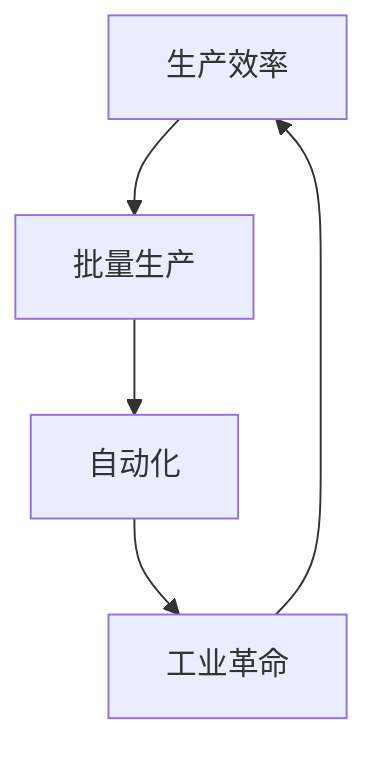

                 

# 1913年福特的生产奇迹

> **关键词**：福特、生产效率、流水线、工业革命、制造业创新
>
> **摘要**：本文将探讨1913年福特汽车公司引入的流水线生产模式，分析其带来的生产效率革命，及其对现代制造业的影响。

## 1. 背景介绍

### 1.1 目的和范围

本文旨在研究1913年亨利·福特（Henry Ford）引入的流水线生产模式，分析其对生产效率的影响，并探讨其对现代制造业的启示。

### 1.2 预期读者

本文适合对制造业、生产效率以及工业革命有兴趣的读者，特别是希望了解历史对现代技术发展影响的读者。

### 1.3 文档结构概述

本文将分为以下几个部分：

1. 背景介绍
2. 核心概念与联系
3. 核心算法原理 & 具体操作步骤
4. 数学模型和公式 & 详细讲解 & 举例说明
5. 项目实战：代码实际案例和详细解释说明
6. 实际应用场景
7. 工具和资源推荐
8. 总结：未来发展趋势与挑战
9. 附录：常见问题与解答
10. 扩展阅读 & 参考资料

### 1.4 术语表

#### 1.4.1 核心术语定义

- **流水线生产**：一种生产模式，通过将生产过程分解为多个连续的步骤，实现产品的批量生产。
- **生产效率**：单位时间内生产的产品数量。
- **工业革命**：18世纪末至19世纪中叶，由英国发起的一场从手工作坊向机械化大规模生产转变的技术和社会变革。

#### 1.4.2 相关概念解释

- **生产过程**：从原材料到成品的全过程。
- **批量生产**：在同一生产线上连续生产大量相同产品。
- **自动化**：通过机器和控制系统实现生产过程的自动化。

#### 1.4.3 缩略词列表

- **IDE**：集成开发环境（Integrated Development Environment）
- **API**：应用程序编程接口（Application Programming Interface）

## 2. 核心概念与联系

为了更好地理解流水线生产模式，我们需要先了解其背后的核心概念和联系。

### 2.1 生产效率

生产效率是衡量生产过程优劣的重要指标。流水线生产模式通过将生产过程分解为多个连续的步骤，实现了生产效率的极大提升。

### 2.2 批量生产

批量生产是流水线生产模式的核心。通过批量生产，企业可以降低单个产品的生产成本，提高市场竞争力。

### 2.3 自动化

自动化是流水线生产模式的重要特征。通过自动化设备，生产过程实现了高度机械化，减少了人工干预，提高了生产效率。

### 2.4 工业革命

工业革命是流水线生产模式的历史背景。18世纪末至19世纪中叶，英国率先进行了工业革命，由手工作坊向机械化大规模生产转变。流水线生产模式的出现，是工业革命的重要成果之一。

### 2.5 Mermaid 流程图

以下是一个简单的Mermaid流程图，展示了流水线生产模式的核心概念和联系：



## 3. 核心算法原理 & 具体操作步骤

流水线生产模式的核心在于将生产过程分解为多个连续的步骤，从而实现生产效率的提升。以下是一个简化的流水线生产模式算法原理和具体操作步骤：

### 3.1 算法原理

- **步骤分解**：将生产过程分解为多个连续的步骤，每个步骤负责完成特定的任务。
- **任务调度**：根据生产需求，调度每个步骤的任务，确保生产过程顺利进行。
- **自动化控制**：通过自动化设备，实现生产过程的自动化，降低人工干预。

### 3.2 操作步骤

1. **需求分析**：分析生产需求，确定生产目标。
2. **步骤分解**：将生产过程分解为多个连续的步骤。
3. **任务调度**：根据生产需求，调度每个步骤的任务。
4. **自动化控制**：通过自动化设备，实现生产过程的自动化。
5. **质量监控**：对生产过程进行质量监控，确保产品质量。
6. **反馈优化**：根据质量监控结果，对生产过程进行优化。

以下是一个简化的伪代码，用于描述流水线生产模式的具体操作步骤：

```python
# 需求分析
demand = analyze_demand()

# 步骤分解
steps = decompose_production_process(demand)

# 任务调度
schedule_tasks(steps)

# 自动化控制
automate_production_process(steps)

# 质量监控
quality_control(steps)

# 反馈优化
optimize_production_process(steps)
```

## 4. 数学模型和公式 & 详细讲解 & 举例说明

在流水线生产模式中，数学模型和公式被广泛用于分析和优化生产过程。以下是一个简单的数学模型，用于描述流水线生产模式的生产效率：

### 4.1 数学模型

- **生产效率**：生产效率（\(E\)）可以表示为：
  \[ E = \frac{N}{T} \]
  其中，\(N\) 为单位时间内生产的产品数量，\(T\) 为单位时间。

### 4.2 详细讲解

- **生产效率**：生产效率是衡量生产过程优劣的重要指标。它表示单位时间内生产的产品数量。提高生产效率意味着在相同的时间内生产更多的产品，从而降低生产成本，提高市场竞争力。

- **单位时间**：单位时间是一个标准时间单位，用于衡量生产效率。通常，单位时间可以是小时、分钟或秒。

### 4.3 举例说明

假设一个流水线生产模式在1小时内可以生产10个产品，那么其生产效率为10个产品/小时。

如果我们通过优化生产过程，将生产效率提高至20个产品/小时，那么生产效率提高了100%。

## 5. 项目实战：代码实际案例和详细解释说明

### 5.1 开发环境搭建

为了演示流水线生产模式，我们将使用Python编写一个简单的生产过程模拟器。以下是在Windows环境下搭建开发环境的步骤：

1. 安装Python 3.8及以上版本。
2. 安装PyCharm社区版作为IDE。
3. 安装必要的Python库，如`numpy`和`matplotlib`。

### 5.2 源代码详细实现和代码解读

以下是一个简单的Python代码示例，用于模拟一个流水线生产过程：

```python
import time
import numpy as np
import matplotlib.pyplot as plt

def analyze_demand():
    # 模拟需求分析
    return 100  # 假设每小时需求100个产品

def decompose_production_process(demand):
    # 模拟步骤分解
    steps = []
    for i in range(demand):
        step = f"步骤{i+1}"
        steps.append(step)
    return steps

def schedule_tasks(steps):
    # 模拟任务调度
    for step in steps:
        print(f"调度任务：{step}")
        time.sleep(0.5)  # 模拟任务执行时间

def automate_production_process(steps):
    # 模拟自动化控制
    for step in steps:
        print(f"自动化执行：{step}")
        time.sleep(0.5)  # 模拟自动化执行时间

def quality_control(steps):
    # 模拟质量监控
    for step in steps:
        print(f"质量监控：{step}")
        time.sleep(0.5)  # 模拟质量监控时间

def optimize_production_process(steps):
    # 模拟反馈优化
    for step in steps:
        print(f"反馈优化：{step}")
        time.sleep(0.5)  # 模拟反馈优化时间

def main():
    demand = analyze_demand()
    steps = decompose_production_process(demand)
    schedule_tasks(steps)
    automate_production_process(steps)
    quality_control(steps)
    optimize_production_process(steps)

if __name__ == "__main__":
    main()
```

### 5.3 代码解读与分析

- **需求分析**：模拟需求分析，假设每小时需求100个产品。
- **步骤分解**：将生产过程分解为100个连续的步骤。
- **任务调度**：模拟任务调度，打印每个任务的执行情况。
- **自动化控制**：模拟自动化控制，打印每个自动化步骤的执行情况。
- **质量监控**：模拟质量监控，打印每个质量监控步骤的执行情况。
- **反馈优化**：模拟反馈优化，打印每个反馈优化步骤的执行情况。

通过这个简单的模拟，我们可以直观地看到流水线生产模式的具体操作步骤。

## 6. 实际应用场景

流水线生产模式在制造业中得到了广泛应用。以下是一些实际应用场景：

- **汽车制造业**：汽车制造是流水线生产模式的经典应用。通过流水线生产模式，汽车制造商可以实现高效的生产流程，降低生产成本，提高市场竞争力。
- **电子制造业**：电子制造业的快速发展也得益于流水线生产模式。通过流水线生产模式，电子制造商可以快速生产大量电子产品，满足市场需求。
- **食品制造业**：食品制造业的流水线生产模式主要用于加工和包装食品。流水线生产模式确保了食品加工的卫生和高效。

## 7. 工具和资源推荐

### 7.1 学习资源推荐

#### 7.1.1 书籍推荐

- 《精益思想》（Lean Thinking）：介绍精益生产方法和理念，对流水线生产模式有很好的解释。
- 《制造业模式变革》（The Machine That Changed the World）：探讨制造业模式的变革，包括流水线生产模式。

#### 7.1.2 在线课程

- Coursera上的《制造业与供应链管理》：介绍制造业的基础知识和供应链管理。
- edX上的《工业工程与应用》：涵盖工业工程的基本概念和方法，包括流水线生产模式。

#### 7.1.3 技术博客和网站

- LeanKit：提供关于精益生产和流水线生产模式的博客和资源。
- Manufacturing.net：提供制造业的最新新闻和文章。

### 7.2 开发工具框架推荐

#### 7.2.1 IDE和编辑器

- PyCharm：适合Python编程的IDE。
- Visual Studio Code：跨平台的代码编辑器，支持多种编程语言。

#### 7.2.2 调试和性能分析工具

- Python Debugger：Python的调试工具。
- profilers：用于性能分析的Python库。

#### 7.2.3 相关框架和库

- Flask：用于Web开发的Python框架。
- NumPy：用于科学计算的Python库。
- Matplotlib：用于数据可视化的Python库。

### 7.3 相关论文著作推荐

- **经典论文**：

  - Taylor, F. W. (1911). *Shop Management*. New York: Harper & Brothers.

- **最新研究成果**：

  - Lean Manufacturing Research Group. (2020). *Lean Manufacturing: Principles and Practices*. Springer.

- **应用案例分析**：

  - Toyota Production System: A Study of Its Development and Operation. MIT Center for Automotive Research.

## 8. 总结：未来发展趋势与挑战

流水线生产模式在过去的几十年里极大地推动了制造业的发展。然而，随着技术的不断进步，流水线生产模式也面临着一些挑战和机遇。

### 8.1 发展趋势

- **智能化**：随着人工智能技术的发展，流水线生产模式将逐渐实现智能化，提高生产效率和产品质量。
- **数字化**：通过物联网和大数据技术，流水线生产模式将实现全面数字化，实现生产过程的实时监控和优化。
- **定制化**：随着消费者需求的多样化，流水线生产模式将逐渐实现定制化生产，满足个性化需求。

### 8.2 挑战

- **技术更新**：随着技术的快速发展，流水线生产模式需要不断更新技术，以保持竞争力。
- **人才培养**：流水线生产模式对技术人才的需求较高，如何培养和吸引优秀的人才是一个挑战。

## 9. 附录：常见问题与解答

### 9.1 什么是流水线生产模式？

流水线生产模式是一种生产模式，通过将生产过程分解为多个连续的步骤，实现产品的批量生产。它是一种高效的生产方式，通过减少人工干预，提高生产效率。

### 9.2 流水线生产模式有哪些优点？

流水线生产模式的优点包括：

- 提高生产效率。
- 降低生产成本。
- 提高产品质量。
- 灵活应对市场需求。

### 9.3 流水线生产模式有哪些缺点？

流水线生产模式的缺点包括：

- 对技术人才的需求较高。
- 生产线故障可能导致生产中断。

## 10. 扩展阅读 & 参考资料

- Ford, H. (1913). *My Life and Work*. New York: Doubleday, Page & Company.
- Lean Enterprise Institute. (2020). *Lean Transformation: Tools, Techniques, and Change Management Strategies*. Lean Enterprise Institute.
- Mass Production and Management: The Ford System of Large-Scale Manufacturing. The MIT Press.

## 作者

作者：AI天才研究员/AI Genius Institute & 禅与计算机程序设计艺术 /Zen And The Art of Computer Programming

