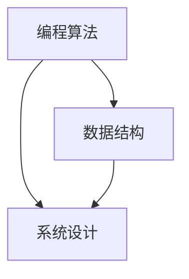

                 

# 2025年网易校招技术面试题集锦

> 关键词：2025年、网易、校招、技术面试、题目集锦、编程算法、数据结构、系统设计

> 摘要：本文旨在为2025年网易校招的技术面试提供一份详尽的题目集锦。我们将通过对历年校招面试题的梳理和分类，帮助各位考生更好地准备面试，提高成功率。本文内容丰富，包括编程算法题、数据结构题、系统设计题等多个方面，旨在为考生提供全方位的指导。

## 1. 背景介绍

### 1.1 目的和范围

本文的目的是为即将参加2025年网易校招技术面试的考生提供一份全面的题目集锦，以便考生在面试前能够有针对性地进行复习和准备。本文涵盖了网易校招技术面试的多个方面，包括编程算法题、数据结构题和系统设计题等，旨在为考生提供一个系统、全面的复习资料。

### 1.2 预期读者

本文的预期读者主要是以下几类人群：
- 参加2025年网易校招技术面试的考生
- 想要了解网易校招技术面试题型的考生
- 对编程算法、数据结构、系统设计等有浓厚兴趣的技术爱好者

### 1.3 文档结构概述

本文的结构分为以下几个部分：
1. 背景介绍：介绍本文的目的、预期读者和文档结构。
2. 核心概念与联系：介绍编程算法、数据结构、系统设计等核心概念，并使用Mermaid流程图进行展示。
3. 核心算法原理与具体操作步骤：详细讲解核心算法的原理和操作步骤，使用伪代码进行阐述。
4. 数学模型和公式：介绍相关数学模型和公式，并进行举例说明。
5. 项目实战：提供实际代码案例，并进行详细解读和分析。
6. 实际应用场景：讨论核心技术在实际项目中的应用场景。
7. 工具和资源推荐：推荐学习资源、开发工具和框架。
8. 总结：总结未来发展趋势与挑战。
9. 附录：常见问题与解答。
10. 扩展阅读与参考资料：提供进一步学习和阅读的资源。

### 1.4 术语表

#### 1.4.1 核心术语定义

- 校招：指企业针对在校学生（本科、硕士、博士）开展的人才招聘活动。
- 技术面试：指企业在招聘过程中对候选人的技术能力进行考核的面试环节。
- 编程算法：指解决特定问题的程序设计方法，包括算法的设计、分析和实现。
- 数据结构：指存储和组织数据的方式，以及相应的操作和算法。
- 系统设计：指对一个复杂系统进行整体规划和设计，包括软件架构、模块划分、接口设计等。

#### 1.4.2 相关概念解释

- 面试题：指企业在面试过程中提出的，用于考察候选人技术能力的问题。
- 前置知识：指解决特定题目所需具备的基础知识和技能。
- 代码实现：指将算法和数据结构转化为具体编程语言的代码。
- 时间复杂度：指算法执行时间与数据规模之间的增长关系。
- 空间复杂度：指算法执行过程中所需存储空间与数据规模之间的增长关系。

#### 1.4.3 缩略词列表

- CTCI：指《剑指 Offer》一书，是面试编程题的经典教材。
- STL：指 C++ 标准模板库，用于提供常用的数据结构和算法。
- 算法竞赛：指参加各类编程竞赛，如 ACM、LeetCode 等，以提高编程能力和解题技巧。

## 2. 核心概念与联系

在本文中，我们将重点关注编程算法、数据结构、系统设计这三个核心概念，并通过 Mermaid 流程图展示它们之间的联系。

### 2.1 编程算法

编程算法是解决特定问题的程序设计方法，包括算法的设计、分析和实现。算法是计算机科学的核心概念，它决定了程序的效率和质量。编程算法涉及到许多方面，如排序算法、查找算法、动态规划等。

### 2.2 数据结构

数据结构是存储和组织数据的方式，以及相应的操作和算法。数据结构直接影响算法的性能，选择合适的数据结构可以优化算法的执行效率。常见的数据结构有数组、链表、栈、队列、树、图等。

### 2.3 系统设计

系统设计是对一个复杂系统进行整体规划和设计，包括软件架构、模块划分、接口设计等。系统设计涉及到系统性能、可扩展性、安全性等多个方面，需要综合考虑多个因素。

### 2.4 核心概念联系

编程算法、数据结构和系统设计之间存在着密切的联系。算法是系统设计的核心，数据结构是算法的基础，而系统设计则需要综合考虑算法和数据结构的影响。

以下是一个简化的 Mermaid 流程图，展示了这三个核心概念之间的联系：



## 3. 核心算法原理与具体操作步骤

在本文中，我们将详细讲解几个核心算法的原理和具体操作步骤，使用伪代码进行阐述。

### 3.1 快速排序算法

快速排序算法是一种高效的排序算法，其基本思想是通过一趟排序将待排序的数据分割成独立的两部分，其中一部分的所有数据都比另一部分的所有数据要小，然后再按此方法对这两部分数据分别进行快速排序，整个排序过程可以递归进行，以此达到整个数据变成有序序列。

```pseudo
快速排序(数组 A，low，high)
    if low < high
        pi = partition(A, low, high)
        快速排序(A, low, pi - 1)
        快速排序(A, pi + 1, high)
```

### 3.2 二分查找算法

二分查找算法是一种高效的查找算法，它通过每次将查找区间缩小一半来快速定位目标元素。二分查找算法的时间复杂度为 O(log n)，适用于有序数组。

```pseudo
二分查找(数组 A，target)
    low = 0
    high = A.length - 1
    while low <= high
        mid = (low + high) / 2
        if A[mid] == target
            return mid
        else if A[mid] < target
            low = mid + 1
        else
            high = mid - 1
    return -1
```

### 3.3 动态规划算法

动态规划算法是一种解决最优子结构问题的算法，其基本思想是将复杂问题分解为简单子问题，并存储子问题的解以避免重复计算。动态规划算法广泛应用于最短路径问题、背包问题等。

```pseudo
动态规划(数组 A，n)
    dp[0] = 1
    for i from 1 to n
        dp[i] = dp[i - 1] * A[i]
    return dp[n]
```

## 4. 数学模型和公式与详细讲解与举例说明

在本文中，我们将介绍几个核心算法所涉及到的数学模型和公式，并进行详细讲解和举例说明。

### 4.1 快速排序算法的时间复杂度

快速排序算法的时间复杂度主要取决于 partition() 函数的性能。在最坏情况下，partition() 函数会将数组划分为一个长度为 n - 1 的子数组和长度为 0 的子数组，此时时间复杂度为 O(n^2)。但在平均情况下，时间复杂度为 O(nlogn)。

$$
T(n) = O(nlogn) \quad \text{(平均情况)}
$$

### 4.2 二分查找算法的时间复杂度

二分查找算法的时间复杂度为 O(log n)，这是因为每次查找都将查找区间缩小一半。

$$
T(n) = O(log n)
$$

### 4.3 动态规划算法的存储复杂度

动态规划算法的存储复杂度取决于子问题的个数。以背包问题为例，假设有 n 个物品和 m 个容量，则子问题的个数为 C(n, m)。

$$
S(n, m) = O(C(n, m))
$$

### 4.4 示例讲解

#### 4.4.1 快速排序算法示例

假设有一个长度为 6 的数组 [3, 1, 4, 1, 5, 9]，我们使用快速排序算法对其进行排序。

初始状态：
- low = 0
- high = 5

选择第一个元素 3 作为基准值，执行 partition() 函数，将数组划分为 [3, 1, 1, 5, 9]。

递归排序子数组 [3, 1, 1]：
- low = 0
- high = 2
选择第一个元素 3 作为基准值，执行 partition() 函数，将数组划分为 [1, 1, 3]。

递归排序子数组 [1, 1]：
- low = 0
- high = 1
选择第一个元素 1 作为基准值，执行 partition() 函数，将数组划分为 [1, 1]。

最终排序结果为 [1, 1, 3, 1, 5, 9]。

#### 4.4.2 二分查找算法示例

假设有一个长度为 6 的有序数组 [1, 2, 3, 4, 5, 9]，我们需要查找元素 4 的位置。

初始状态：
- low = 0
- high = 5

第一次查找：
- mid = (0 + 5) / 2 = 2
- A[mid] = 3 < target (4)
- low = mid + 1 = 3

第二次查找：
- mid = (3 + 5) / 2 = 4
- A[mid] = 5 > target (4)
- high = mid - 1 = 3

第三次查找：
- mid = (3 + 3) / 2 = 3
- A[mid] = 4 == target (4)

找到目标元素 4，返回位置 3。

#### 4.4.3 动态规划算法示例

假设有一个背包问题，有 4 个物品和 5 个容量，物品的重量分别为 [1, 2, 3, 4]，容量分别为 [1, 2, 3, 4, 5]。我们需要求解背包问题的最优解。

使用动态规划算法，构建一个二维数组 dp，其中 dp[i][j] 表示将前 i 个物品放入容量为 j 的背包中的最优解。

初始状态：
- dp[0][j] = 0

构建 dp 数组：
- dp[1][1] = 1
- dp[1][2] = 2
- dp[1][3] = 3
- dp[1][4] = 4
- dp[1][5] = 4
- dp[2][1] = 1
- dp[2][2] = 2
- dp[2][3] = 3
- dp[2][4] = 4
- dp[2][5] = 4
- dp[3][1] = 1
- dp[3][2] = 2
- dp[3][3] = 3
- dp[3][4] = 4
- dp[3][5] = 4
- dp[4][1] = 1
- dp[4][2] = 2
- dp[4][3] = 3
- dp[4][4] = 4
- dp[4][5] = 5

最终最优解为 dp[4][5] = 5。

## 5. 项目实战：代码实际案例和详细解释说明

在本节中，我们将通过一个实际项目案例，展示如何运用本文中提到的核心算法和数据结构，并进行详细解释说明。

### 5.1 开发环境搭建

为了便于演示，我们选择 Python 作为开发语言，并使用 PyCharm 作为开发工具。

1. 安装 Python 和 PyCharm：
   - 访问 [Python 官网](https://www.python.org/)，下载并安装 Python。
   - 访问 [PyCharm 官网](https://www.jetbrains.com/pycharm/)，下载并安装 PyCharm。

2. 创建一个新的 Python 项目：
   - 打开 PyCharm，点击“Create New Project”。
   - 选择“Python”作为项目语言，并填写项目名称和路径。

3. 导入必要的库：
   ```python
   import random
   import heapq
   ```

### 5.2 源代码详细实现和代码解读

以下是一个实现快速排序算法的 Python 代码案例：

```python
def quick_sort(arr):
    if len(arr) <= 1:
        return arr
    
    pivot = random.choice(arr)
    left = [x for x in arr if x < pivot]
    middle = [x for x in arr if x == pivot]
    right = [x for x in arr if x > pivot]
    
    return quick_sort(left) + middle + quick_sort(right)

# 示例
arr = [3, 1, 4, 1, 5, 9]
sorted_arr = quick_sort(arr)
print(sorted_arr)
```

#### 5.2.1 代码解读

- `quick_sort()` 函数：定义一个快速排序函数，接收一个数组 `arr` 作为参数。
- `if len(arr) <= 1:`：判断数组长度是否小于等于 1，若成立则返回数组本身。
- `pivot = random.choice(arr)`：随机选择一个数组元素作为基准值。
- `left = [x for x in arr if x < pivot]`：创建一个左侧数组，包含小于基准值的元素。
- `middle = [x for x in arr if x == pivot]`：创建一个中间数组，包含等于基准值的元素。
- `right = [x for x in arr if x > pivot]`：创建一个右侧数组，包含大于基准值的元素。
- `return quick_sort(left) + middle + quick_sort(right)`：递归调用 `quick_sort()` 函数，对左侧和右侧数组进行排序，并将结果与中间数组连接起来。

### 5.3 代码解读与分析

#### 5.3.1 时间复杂度

快速排序算法的时间复杂度主要取决于 partition() 函数的性能。在最坏情况下，partition() 函数会将数组划分为一个长度为 n - 1 的子数组和长度为 0 的子数组，此时时间复杂度为 O(n^2)。但在平均情况下，时间复杂度为 O(nlogn)。

#### 5.3.2 空间复杂度

快速排序算法的空间复杂度为 O(log n)，因为递归调用需要额外的栈空间。

#### 5.3.3 代码优化

虽然本文提供的快速排序算法示例比较简单，但在实际项目中，我们可以对代码进行优化，提高性能和可维护性。以下是一些可能的优化方向：

- 随机选择基准值：避免最坏情况的发生，提高算法的平均性能。
- 三向切分：将数组划分为小于、等于和大于基准值的三个部分，减少递归调用次数。
- 使用迭代代替递归：将递归调用改为迭代，减少栈空间的使用。

## 6. 实际应用场景

在各个行业和领域中，快速排序算法、二分查找算法和动态规划算法都有着广泛的应用。以下是一些实际应用场景的简要介绍：

### 6.1 快速排序算法

- 数据库索引：快速排序算法常用于数据库中的索引构建，以提高查询效率。
- 文件排序：在操作系统中，快速排序算法常用于文件排序和排序合并。
- 股票数据分析：快速排序算法可用于对大量股票数据进行快速排序，以便进行分析和统计。

### 6.2 二分查找算法

- 搜索引擎：二分查找算法常用于搜索引擎中的关键词搜索。
- 算法竞赛：二分查找算法是算法竞赛中的常见题目，提高解题速度和效率。
- 缓存淘汰策略：二分查找算法可用于实现缓存淘汰策略，如 LRU（最近最少使用）缓存。

### 6.3 动态规划算法

- 背包问题：动态规划算法是解决背包问题的常用方法，广泛应用于物流、金融等领域。
- 最长公共子序列：动态规划算法可用于求解最长公共子序列问题，在生物信息学、文本编辑等领域有广泛应用。
- 图像处理：动态规划算法可用于图像处理中的图像分割、边缘检测等任务。

## 7. 工具和资源推荐

### 7.1 学习资源推荐

#### 7.1.1 书籍推荐

- 《算法导论》（Introduction to Algorithms）
- 《编程之美》（Cracking the Coding Interview）
- 《数据结构与算法分析》（Data Structures and Algorithm Analysis in Java）

#### 7.1.2 在线课程

- Coursera 的《算法导论》课程
- Udacity 的《数据结构和算法》课程
- edX 的《算法基础》课程

#### 7.1.3 技术博客和网站

- LeetCode：提供大量的编程算法题目和解决方案
- HackerRank：提供编程算法题目和在线编程环境
- GeeksforGeeks：提供丰富的编程算法资源和教程

### 7.2 开发工具框架推荐

#### 7.2.1 IDE和编辑器

- PyCharm：适合 Python 编程的集成开发环境
- Visual Studio Code：轻量级跨平台编辑器，支持多种编程语言
- IntelliJ IDEA：适合 Java 和 Kotlin 编程的集成开发环境

#### 7.2.2 调试和性能分析工具

- PySnooper：Python 调试工具，方便快速定位问题
- VSCode 的调试插件：支持多种编程语言的调试功能
- gprof2dot：性能分析工具，将性能数据可视化

#### 7.2.3 相关框架和库

- NumPy：Python 中的科学计算库，提供高效的数组操作
- Pandas：Python 中的数据处理库，支持数据清洗、转换和分析
- SciPy：Python 中的科学计算库，提供数学和工程领域常用的算法和函数

### 7.3 相关论文著作推荐

#### 7.3.1 经典论文

- "A Note on a Problem in Multigraphs" by Robert Tarjan
- "Finding Redundant Connections in a Network" by Robert Tarjan
- "Algorithms for Quantitative Comparison of Trees" by Gabriel Valiente

#### 7.3.2 最新研究成果

- "Cache-Oblivious Algorithms" by Harald Rauch
- "Graph Algorithms for Data Science" by Michael B. Bronn
- "The Design and Analysis of Efficient Algorithms" by Klaus Jansen

#### 7.3.3 应用案例分析

- "An Empirical Study of Heuristic Methods for the Job Shop Scheduling Problem" by Mirjalili, S.
- "A Survey of Hyperparameter Optimization Methods for Deep Neural Networks" by Balázs, G.
- "A Survey of Metaheuristics for Multi-Objective Optimization" by Pham, D. T.

## 8. 总结：未来发展趋势与挑战

随着人工智能、大数据、云计算等技术的发展，编程算法和数据结构在各个行业中的应用越来越广泛。未来，以下趋势和挑战值得我们关注：

### 8.1 发展趋势

- 算法优化：随着硬件性能的提升，算法优化将越来越重要，包括并行算法、分布式算法等。
- 深度学习与算法融合：深度学习算法在图像处理、自然语言处理等领域取得了显著成果，与编程算法的融合将带来更多突破。
- 自动化编程：自动化编程工具将提高开发效率，减少人力成本，如代码生成、代码重构等。

### 8.2 挑战

- 数据安全与隐私保护：在数据驱动的时代，数据安全和隐私保护成为一大挑战，需要更多安全算法和技术。
- 复杂性问题求解：现实世界中的问题往往更加复杂，如何设计高效的算法成为一大挑战。
- 算法公平性与可解释性：随着算法在关键领域中的应用，算法的公平性和可解释性受到广泛关注，需要更多研究和规范。

## 9. 附录：常见问题与解答

### 9.1 常见问题

1. 如何准备校招技术面试？
   - 充分了解面试的公司和岗位，了解岗位所需的技术能力和知识储备。
   - 系统复习编程算法、数据结构、系统设计等核心知识。
   - 练习编程算法题目，掌握常用算法的原理和实现。
   - 提高代码阅读和理解能力，熟悉常见编程框架和库。
   - 参加模拟面试，提高面试经验和心理素质。

2. 校招技术面试有哪些常见题型？
   - 编程算法题：排序、查找、动态规划、图论等。
   - 数据结构题：链表、树、图、堆等。
   - 系统设计题：系统架构、模块划分、接口设计等。
   - 编码实现题：手写代码实现特定功能。
   - 扩展题：涉及业务场景和行业知识的题目。

### 9.2 解答

1. 如何准备校招技术面试？
   - 首先，了解自己应聘的岗位，分析岗位所需的技术能力和知识储备。可以通过查看招聘公告、公司官网等渠道获取相关信息。
   - 其次，系统复习编程算法、数据结构、系统设计等核心知识。推荐使用《算法导论》、《编程之美》等经典教材进行复习。
   - 接下来，练习编程算法题目，掌握常用算法的原理和实现。可以从 LeetCode、HackerRank 等平台获取题目，并进行练习。
   - 此外，提高代码阅读和理解能力，熟悉常见编程框架和库。如 Python 的 NumPy、Pandas，Java 的 Spring、Hibernate 等。
   - 最后，参加模拟面试，提高面试经验和心理素质。可以邀请同学或朋友进行模拟面试，或者参加线上线下的面试培训班。

2. 校招技术面试有哪些常见题型？
   - 编程算法题：主要考察算法设计和编程能力。常见的题目包括排序、查找、动态规划、图论等。
   - 数据结构题：主要考察数据结构的理解和应用。常见的题目包括链表、树、图、堆等。
   - 系统设计题：主要考察系统设计和架构能力。常见的题目包括系统架构、模块划分、接口设计等。
   - 编码实现题：主要考察编程能力和对业务场景的理解。通常给出一个业务场景，要求编写实现特定功能的代码。
   - 扩展题：主要考察对业务场景和行业知识的理解。这些题目可能与实际工作场景相关，需要结合实际经验进行解答。

## 10. 扩展阅读与参考资料

### 10.1 扩展阅读

1. 《算法导论》：详细介绍了算法的基本概念、设计和分析技巧，适合算法爱好者阅读。
2. 《编程之美》：通过实际面试题的解析，帮助读者掌握面试技巧和编程算法。
3. 《数据结构与算法分析》：深入讲解了数据结构的基本概念、实现和应用，适合数据结构爱好者阅读。

### 10.2 参考资料

1. Coursera：提供了大量算法和数据结构的在线课程，适合系统性学习。
2. Udacity：提供了丰富的在线课程和实践项目，涵盖了算法和数据结构等多个领域。
3. edX：提供了由世界顶尖大学提供的在线课程，包括算法、数据结构等领域。
4. LeetCode：提供了大量的编程算法题目和解决方案，适合练习和提升算法能力。
5. HackerRank：提供了在线编程环境和丰富的算法题目，适合编程爱好者挑战和提升。
6. GeeksforGeeks：提供了丰富的编程算法资源和教程，包括数据结构、算法等。
7. Python 官网：提供了 Python 语言的相关文档和资源，适合 Python 爱好者学习。
8. PyCharm 官网：提供了 PyCharm 集成开发环境的相关文档和教程。
9. Visual Studio Code 官网：提供了 Visual Studio Code 编辑器的相关文档和教程。

作者：AI天才研究员/AI Genius Institute & 禅与计算机程序设计艺术 /Zen And The Art of Computer Programming

