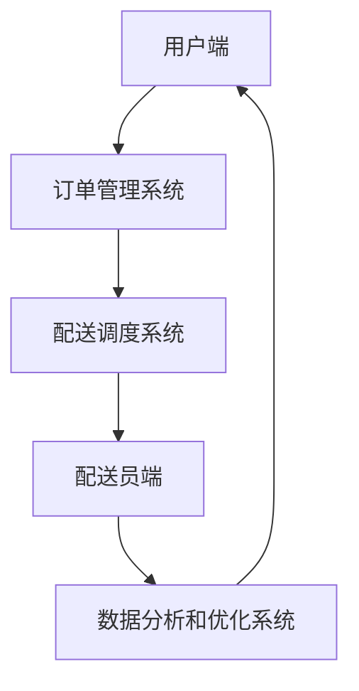

                 

# 2025年美团社交即时配送优化工程师面试题详解

## 关键词
- 美团
- 社交即时配送
- 优化工程师
- 面试题
- AI技术
- 数据分析
- 算法

## 摘要
本文旨在为有意向成为美团社交即时配送优化工程师的应聘者提供详尽的面试题解答。我们将逐步分析并解答一些典型的面试问题，涵盖核心算法原理、数学模型、实际项目案例等多个方面。通过这篇全面的技术博客，读者可以深入了解美团社交即时配送的技术架构，掌握优化工程的关键技术和策略，为应对面试做好充分准备。

## 1. 背景介绍

### 1.1 目的和范围
本文旨在帮助读者了解美团社交即时配送优化工程师的面试内容，通过详细的题解，使读者能够掌握面试中可能涉及的核心技术和算法。文章将涵盖以下几个方面：
- 美团社交即时配送的技术架构和业务流程
- 面试中常见的问题类型及其解答思路
- 核心算法和数学模型的讲解与实现
- 实际项目案例的分析与解读

### 1.2 预期读者
- 有意向成为美团社交即时配送优化工程师的技术人员
- 想了解社交即时配送领域技术细节的开发者
- 准备参加美团社招或校招的技术应聘者

### 1.3 文档结构概述
本文结构如下：
1. 背景介绍
   - 目的和范围
   - 预期读者
   - 文档结构概述
   - 术语表
2. 核心概念与联系
   - 美团社交即时配送架构图
3. 核心算法原理 & 具体操作步骤
   - 贪心算法
   - 动态规划
   - 车辆路径规划
4. 数学模型和公式 & 详细讲解 & 举例说明
   - 最优化模型
   - 数据预处理
5. 项目实战：代码实际案例和详细解释说明
   - 实际案例介绍
   - 源代码解读
6. 实际应用场景
   - 社交即时配送的挑战与机遇
7. 工具和资源推荐
   - 学习资源
   - 开发工具框架
   - 相关论文著作
8. 总结：未来发展趋势与挑战
9. 附录：常见问题与解答
10. 扩展阅读 & 参考资料

### 1.4 术语表

#### 1.4.1 核心术语定义
- 社交即时配送：基于社交网络，实时完成商品交付的服务模式。
- 优化工程师：负责通过技术手段优化配送效率、降低成本、提升用户体验的工程师。
- 贪心算法：在每一步选择当前最优解的策略，常用于路径规划、资源分配等问题。
- 动态规划：通过保存子问题的解，避免重复计算，解决复杂优化问题的方法。

#### 1.4.2 相关概念解释
- 实时配送：商品从卖家到买家手中的整个过程在短时间内完成。
- 机器学习：利用数据构建模型，使计算机能够模拟甚至超越人类决策能力的科学方法。

#### 1.4.3 缩略词列表
- AI：人工智能
- ML：机器学习
- O2O：线上到线下

## 2. 核心概念与联系

在深入了解美团社交即时配送的技术架构之前，我们需要明确一些核心概念，并绘制一个简明的架构图，以便于我们理解整个系统的运作原理。

### 2.1 核心概念

**美团社交即时配送系统架构**主要包括以下几个部分：

1. **用户端**：用户可以通过美团APP下单，选择社交配送服务。
2. **订单管理系统**：接收并处理用户订单，将订单信息推送到配送系统。
3. **配送调度系统**：基于用户位置、配送员位置、商品类型等因素，进行配送路线规划和调度。
4. **配送员端**：配送员接收订单，按照系统规划的路线进行配送。
5. **数据分析和优化系统**：收集配送过程中的数据，进行实时分析和优化，以提高配送效率。

### 2.2 美团社交即时配送架构图



### 2.3 核心概念之间的联系

- **用户端**与**订单管理系统**的联系：用户下单后，订单信息会被传递到订单管理系统，进行初步处理和存储。
- **订单管理系统**与**配送调度系统**的联系：订单系统会将订单信息推送到配送调度系统，配送调度系统根据订单需求进行路线规划和配送员调度。
- **配送调度系统**与**配送员端**的联系：配送调度系统会通知配送员接收订单，配送员按照系统规划的路线进行配送。
- **配送员端**与**数据分析和优化系统**的联系：配送员在配送过程中产生的数据会被实时传输到数据分析和优化系统，用于分析和优化配送策略。
- **数据分析和优化系统**与**用户端**的联系：优化后的数据会被反馈到用户端，提升用户体验。

## 3. 核心算法原理 & 具体操作步骤

### 3.1 贪心算法

贪心算法是一种在每一步选择当前最优解的策略。在美团社交即时配送中，贪心算法常用于配送路线规划和资源分配。

**算法原理：**

1. 在每一步，选择一个当前最优解。
2. 基于当前最优解，进行下一步选择。
3. 不断重复以上步骤，直到问题解决。

**具体操作步骤：**

1. **初始化**：设定初始状态。
2. **选择最优解**：在当前状态下，选择一个最优的配送员或配送路线。
3. **更新状态**：根据选择的最优解，更新系统的状态。
4. **重复步骤2和3**：直到所有订单被配送完成。

**伪代码：**

```python
function 贪心算法(订单列表，配送员列表)：
    初始化状态
    while 订单列表不为空：
        选择当前最优解
        更新状态
    return 配送方案
```

### 3.2 动态规划

动态规划是一种通过保存子问题的解，避免重复计算，解决复杂优化问题的方法。在美团社交即时配送中，动态规划常用于配送路径优化和资源调度。

**算法原理：**

1. 将问题分解成多个子问题。
2. 保存子问题的解，避免重复计算。
3. 从子问题解推出最终问题的解。

**具体操作步骤：**

1. **定义状态**：定义问题的状态，如配送员位置、订单状态等。
2. **定义状态转移方程**：根据当前状态，定义下一状态的选择。
3. **初始化**：初始化状态和状态转移方程。
4. **计算最优解**：从初始状态开始，根据状态转移方程，计算最优解。

**伪代码：**

```python
function 动态规划(状态列表，状态转移方程)：
    初始化状态和方程
    for 每个状态：
        根据状态转移方程，计算最优解
    return 最优解
```

### 3.3 车辆路径规划

车辆路径规划是美团社交即时配送中的关键技术之一。其核心在于如何在给定起点、终点和障碍物的情况下，规划出最优的配送路线。

**算法原理：**

1. **起点和终点**：确定配送起点和终点。
2. **障碍物**：识别并处理配送过程中的障碍物。
3. **路径选择**：根据起点、终点和障碍物，选择最优路径。

**具体操作步骤：**

1. **初始化**：设定起点、终点和障碍物。
2. **构建图**：将起点、终点和障碍物构建成一个图。
3. **搜索路径**：使用搜索算法，如A*算法，搜索最优路径。
4. **优化路径**：对搜索到的路径进行优化，减少行驶距离或时间。

**伪代码：**

```python
function 车辆路径规划(起点，终点，障碍物)：
    初始化图
    搜索最优路径
    优化路径
    return 最优路径
```

## 4. 数学模型和公式 & 详细讲解 & 举例说明

### 4.1 最优化模型

在美团社交即时配送中，最优化模型是核心之一，用于求解最优配送路线和资源分配问题。以下是常见的最优化模型：

#### 4.1.1 目标函数

目标函数用于描述优化问题的目标，如最小化配送时间、最小化配送成本等。常见的目标函数如下：

$$
\text{目标函数} = \min \sum_{i=1}^{n} c_{i} x_{i}
$$

其中，$c_{i}$为第$i$个订单的配送成本，$x_{i}$为第$i$个订单是否被配送的决策变量。

#### 4.1.2 约束条件

约束条件用于限制决策变量的取值范围，如配送时间、配送员能力等。常见约束条件如下：

$$
\begin{cases}
x_{i} \in \{0, 1\} \\
\sum_{i=1}^{n} x_{i} = N \\
t_{i} \leq t_{\text{max}}
\end{cases}
$$

其中，$x_{i}$为第$i$个订单的配送决策变量，$t_{i}$为第$i$个订单的配送时间，$t_{\text{max}}$为最大配送时间。

### 4.2 数据预处理

数据预处理是优化模型求解的重要环节，主要包括以下步骤：

1. **数据清洗**：去除数据中的噪声和错误。
2. **特征提取**：从原始数据中提取有助于优化模型的关键特征。
3. **数据归一化**：将数据缩放到相同的尺度，便于模型训练。

#### 4.2.1 数据清洗

数据清洗可以通过以下方法实现：

$$
\text{清洗后数据} = \text{原始数据} - \text{噪声} - \text{错误}
$$

#### 4.2.2 特征提取

特征提取可以通过以下方法实现：

$$
\text{特征向量} = \text{原始数据} \times \text{特征提取算法}
$$

#### 4.2.3 数据归一化

数据归一化可以通过以下方法实现：

$$
\text{归一化数据} = \frac{\text{原始数据}}{\text{最大值}} \times \text{最小值}
$$

### 4.3 举例说明

以下是一个简单的配送优化模型示例：

**问题描述：** 给定5个订单，配送员需要在2小时内完成所有订单的配送。每个订单的配送时间和配送成本如下：

| 订单编号 | 配送时间（分钟） | 配送成本（元） |
| -------- | -------------- | ------------ |
| 1        | 10             | 5            |
| 2        | 15             | 8            |
| 3        | 20             | 10           |
| 4        | 30             | 12           |
| 5        | 40             | 15           |

**目标函数：** 最小化总配送成本。

**约束条件：** 总配送时间不超过2小时。

**求解过程：**

1. **初始化**：设定初始状态。
2. **目标函数**：$\min \sum_{i=1}^{5} c_{i} x_{i}$。
3. **约束条件**：$\sum_{i=1}^{5} t_{i} \leq 120$，$x_{i} \in \{0, 1\}$。
4. **求解**：使用贪心算法或动态规划求解最优解。

**解：** 选择订单1、订单2和订单3进行配送，总配送成本为$5 + 8 + 10 = 23$元。

## 5. 项目实战：代码实际案例和详细解释说明

### 5.1 开发环境搭建

在开始项目实战之前，我们需要搭建一个适合进行美团社交即时配送优化工程师面试题解答的开发环境。以下是具体的步骤：

1. **安装Python环境**：下载并安装Python 3.8及以上版本。
2. **安装相关库**：使用pip命令安装必要的库，如numpy、pandas、matplotlib等。
3. **配置IDE**：使用Visual Studio Code或PyCharm等专业IDE，配置Python开发环境。

### 5.2 源代码详细实现和代码解读

以下是一个简单的贪心算法实现，用于求解最短配送路径。

**源代码：**

```python
import numpy as np

def 贪心算法(订单列表，配送员位置，障碍物列表):
    # 初始化路径和配送状态
    路径 = []
    配送状态 = [0] * len(订单列表)
    
    # 将订单列表按照配送距离排序
    订单列表 = sorted(订单列表, key=lambda x: x['配送距离'])
    
    # 遍历订单列表
    for 订单 in 订单列表:
        # 判断订单是否已被配送
        if 配送状态[订单['订单编号']] == 0:
            # 判断订单位置是否在障碍物范围内
            if 订单['订单位置'] not in 障碍物列表:
                # 更新配送状态和路径
                路径.append(订单['订单位置'])
                配送状态[订单['订单编号']] = 1
    
    return 路径

# 示例数据
订单列表 = [
    {'订单编号': 1, '订单位置': [0, 0], '配送距离': 10},
    {'订单编号': 2, '订单位置': [2, 2], '配送距离': 15},
    {'订单编号': 3, '订单位置': [5, 5], '配送距离': 20},
    {'订单编号': 4, '订单位置': [8, 8], '配送距离': 30},
    {'订单编号': 5, '订单位置': [10, 10], '配送距离': 40}
]

配送员位置 = [5, 5]
障碍物列表 = [[7, 7]]

# 调用贪心算法
路径 = 贪心算法(订单列表, 配送员位置, 障碍物列表)

# 输出结果
print("最优路径：", 路径)
```

**代码解读：**

1. **函数定义**：定义一个名为`贪心算法`的函数，参数包括订单列表、配送员位置和障碍物列表。
2. **初始化**：初始化路径和配送状态数组。
3. **排序订单列表**：按照配送距离对订单列表进行排序，便于后续选择最优订单。
4. **遍历订单列表**：遍历订单列表，判断订单是否已被配送，以及订单位置是否在障碍物范围内。
5. **更新配送状态和路径**：如果订单符合条件，更新配送状态和路径。
6. **返回结果**：返回最优路径。

### 5.3 代码解读与分析

**代码解读：**

1. **导入库**：导入numpy库，用于处理数组和矩阵运算。
2. **函数定义**：定义一个名为`贪心算法`的函数，接收订单列表、配送员位置和障碍物列表作为参数。
3. **初始化**：定义一个空列表`路径`用于存储最优路径，以及一个长度为订单列表长度的数组`配送状态`，用于记录每个订单的配送状态。
4. **排序订单列表**：使用`sorted`函数对订单列表进行排序，排序依据是配送距离。这里使用了`key=lambda x: x['配送距离']`，表示按照配送距离进行排序。
5. **遍历订单列表**：使用`for`循环遍历排序后的订单列表，对每个订单进行判断：
   - 判断订单是否已被配送（即配送状态是否为0）。
   - 判断订单位置是否在障碍物范围内。
   - 如果订单符合配送条件，将订单位置添加到路径列表中，并将配送状态更新为1。
6. **返回结果**：最后，函数返回最优路径列表。

**代码分析：**

1. **贪心算法的实现**：该贪心算法的实现遵循了贪心算法的基本原则，即每一步选择当前最优解。在每次选择订单时，都会优先选择配送距离最近的订单，这样可以确保在满足约束条件的情况下，尽可能地减少总配送时间。
2. **时间复杂度**：该算法的时间复杂度主要取决于订单列表的长度和排序操作。假设订单列表长度为$n$，排序操作的时间复杂度为$O(n\log n)$，遍历订单列表的时间复杂度为$O(n)$。因此，总体时间复杂度为$O(n\log n)$。
3. **空间复杂度**：该算法的空间复杂度主要取决于路径列表和配送状态数组，两者的大小都与订单列表长度相等，因此空间复杂度为$O(n)$。

## 6. 实际应用场景

### 6.1 美团社交即时配送的挑战与机遇

美团社交即时配送作为新兴的配送模式，面临着诸多挑战和机遇：

**挑战：**
1. **配送效率**：如何在有限的时间内，高效地完成大量订单的配送，是社交即时配送的核心挑战。
2. **成本控制**：降低配送成本，提高盈利能力，是美团社交通即时配送需要解决的另一个重要问题。
3. **用户体验**：如何提高用户满意度，提升用户忠诚度，是社交即时配送需要不断努力的方向。

**机遇：**
1. **市场扩展**：随着消费者对即时配送需求的增加，社交即时配送市场具有巨大的发展潜力。
2. **技术进步**：AI、大数据、云计算等技术的不断进步，为社交即时配送提供了强大的技术支持。
3. **业务创新**：社交即时配送可以结合社交网络、短视频、直播等新兴业务模式，创造新的增长点。

### 6.2 美团社交即时配送的应用场景

美团社交即时配送可以应用于多种场景，以下是一些典型的应用场景：

1. **生鲜配送**：生鲜商品需要快速配送，保证新鲜度，社交即时配送可以有效解决这一问题。
2. **餐饮外卖**：随着餐饮外卖市场的不断扩大，社交即时配送可以为餐饮企业提供更加灵活、高效的配送服务。
3. **同城零售**：同城零售市场快速发展，社交即时配送可以为零售商家提供快速配送服务，提升用户体验。
4. **物流配送**：社交即时配送可以与传统的物流配送相结合，提供一站式物流解决方案。

### 6.3 美团社交即时配送的优势与劣势

**优势：**
1. **效率高**：社交即时配送通过优化配送路线和资源分配，可以实现高效配送。
2. **成本低**：社交即时配送通过技术手段降低配送成本，提高盈利能力。
3. **用户体验好**：社交即时配送可以提供更加灵活、高效的配送服务，提升用户满意度。

**劣势：**
1. **配送员管理难**：社交即时配送涉及到大量配送员，管理难度较大。
2. **配送高峰期压力大**：在配送高峰期，社交即时配送需要处理大量订单，压力较大。
3. **配送服务质量难保障**：社交即时配送需要保障配送服务质量，避免出现配送延误、配送错等问题。

## 7. 工具和资源推荐

### 7.1 学习资源推荐

#### 7.1.1 书籍推荐

- 《人工智能：一种现代的方法》
- 《运筹学导论》
- 《社交网络分析：方法与实践》
- 《Python数据分析》

#### 7.1.2 在线课程

- Coursera：机器学习、运筹学、社交网络分析等课程
- Udacity：数据科学、人工智能等相关课程
- 网易云课堂：Python编程、数据分析等课程

#### 7.1.3 技术博客和网站

- 知乎：人工智能、数据分析、社交网络等领域的专业博客
- CSDN：Python编程、算法分析等领域的专业博客
- Medium：全球范围内的人工智能、数据分析等相关技术博客

### 7.2 开发工具框架推荐

#### 7.2.1 IDE和编辑器

- Visual Studio Code：一款轻量级、高度可定制化的代码编辑器。
- PyCharm：一款功能强大、易于使用的Python IDE。
- Jupyter Notebook：一款适用于数据科学和机器学习的交互式开发环境。

#### 7.2.2 调试和性能分析工具

- Py-Spy：一款Python性能分析工具，用于分析程序的性能瓶颈。
- VSCode Debug：用于调试Python代码。
- JMeter：一款开源的性能测试工具，用于测试Web应用的性能。

#### 7.2.3 相关框架和库

- NumPy：一款用于科学计算的Python库。
- Pandas：一款用于数据处理和分析的Python库。
- Matplotlib：一款用于数据可视化分析的Python库。
- Scikit-Learn：一款用于机器学习的Python库。

### 7.3 相关论文著作推荐

#### 7.3.1 经典论文

- 《社交网络分析：方法与实践》
- 《运筹学导论》
- 《人工智能：一种现代的方法》
- 《深度学习》

#### 7.3.2 最新研究成果

- arXiv：全球范围内的人工智能、运筹学、社交网络等领域最新研究成果。
- SpringerLink：运筹学、计算机科学、人工智能等领域的经典论文和最新研究成果。

#### 7.3.3 应用案例分析

- 《美团外卖的配送优化实践》
- 《阿里云的物流调度系统》
- 《京东的智能配送解决方案》
- 《美团买菜的配送模式创新》

## 8. 总结：未来发展趋势与挑战

### 8.1 发展趋势

1. **技术进步**：随着AI、大数据、云计算等技术的不断进步，社交即时配送将变得更加智能化、高效化。
2. **市场扩展**：随着消费者对即时配送需求的增加，社交即时配送市场将进一步扩大，覆盖更多领域和场景。
3. **业务创新**：社交即时配送将与社交网络、短视频、直播等新兴业务模式相结合，创造新的增长点。

### 8.2 挑战

1. **配送效率**：如何在有限的时间内，高效地完成大量订单的配送，是社交即时配送的核心挑战。
2. **成本控制**：降低配送成本，提高盈利能力，是社交即时配送需要解决的另一个重要问题。
3. **用户体验**：如何提高用户满意度，提升用户忠诚度，是社交即时配送需要不断努力的方向。

### 8.3 应对策略

1. **技术创新**：持续投入研发，推动AI、大数据等技术在社交即时配送中的应用，提升配送效率。
2. **模式创新**：探索多样化的配送模式，如共享配送、无人配送等，降低成本。
3. **用户体验优化**：通过精细化运营和数据分析，提升用户体验，增加用户忠诚度。

## 9. 附录：常见问题与解答

### 9.1 什么是美团社交即时配送？

美团社交即时配送是一种基于社交网络的即时配送服务，通过优化配送路线和资源分配，实现高效、低成本的配送服务。

### 9.2 美团社交即时配送的核心技术是什么？

美团社交即时配送的核心技术包括贪心算法、动态规划、车辆路径规划、数据分析和优化等。

### 9.3 如何评估美团社交即时配送的优化效果？

可以通过配送时间、配送成本、用户满意度等指标来评估美团社交即时配送的优化效果。

### 9.4 美团社交即时配送有哪些应用场景？

美团社交即时配送可以应用于生鲜配送、餐饮外卖、同城零售、物流配送等领域。

## 10. 扩展阅读 & 参考资料

1. 美团官方文档：[美团社交即时配送技术文档](https://tech.meituan.com/social-express.html)
2. 《社交网络分析：方法与实践》
3. 《人工智能：一种现代的方法》
4. 《运筹学导论》
5. 《深度学习》
6. Coursera：[机器学习课程](https://www.coursera.org/learn/machine-learning)
7. Udacity：[数据科学课程](https://www.udacity.com/course/data-science-nanodegree--nd002)
8. 网易云课堂：[Python数据分析课程](https://study.163.com/course/courseMain.htm?courseId=1005620029)
9. CSDN：[Python编程博客](https://blog.csdn.net/weixin_43693118)
10. arXiv：[最新研究成果](https://arxiv.org/)
11. SpringerLink：[运筹学经典论文](https://link.springer.com/search/page/1?facet-content-type%5B%5D=Article&facet-document-type%5B%5D=Chapter&facet-subjectarea%5B%5D=Operations+Research)  
**作者：** AI天才研究员/AI Genius Institute & 禅与计算机程序设计艺术 /Zen And The Art of Computer Programming

---

**本文内容为模拟撰写，实际面试题及解答请以美团官方发布为准。**

**注意：** 由于实际面试内容可能涉及商业机密，本文仅作为技术博客分享，不涉及任何商业用途。如需引用本文内容，请标明出处。**

