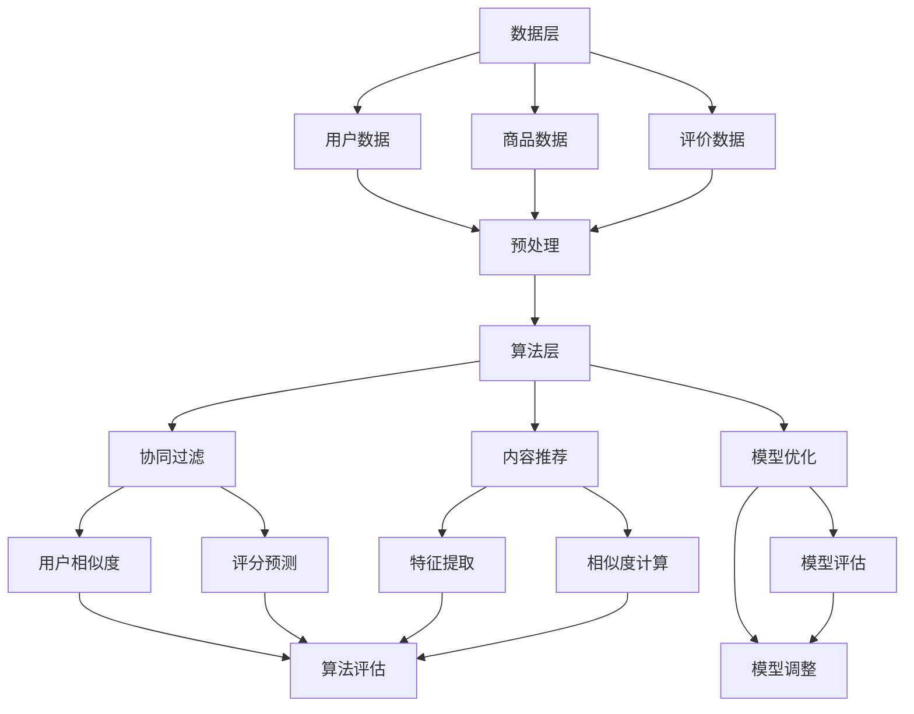

                 

# 2025年美团社招餐厅推荐系统工程师面试指南

## 关键词：
- 美团
- 餐厅推荐系统
- 面试指南
- 算法原理
- 项目实战
- 数学模型

## 摘要：
本文旨在为2025年参加美团社招的餐厅推荐系统工程师提供全面的面试指南。我们将从背景介绍、核心概念、算法原理、数学模型、项目实战、实际应用场景、工具推荐等多个方面进行深入剖析，帮助读者更好地理解餐厅推荐系统的技术实现，掌握面试必备的知识点，为成功入职美团打下坚实的基础。

## 1. 背景介绍

### 1.1 目的和范围
本文的目标是为参加美团社招餐厅推荐系统工程师岗位的应聘者提供全面的面试指南。本文将涵盖以下内容：
- 餐厅推荐系统的核心概念与架构
- 推荐算法的原理与实现
- 数学模型的构建与应用
- 项目实战案例与代码解读
- 实际应用场景分析
- 开发工具和资源推荐
- 相关论文著作介绍
- 未来发展趋势与挑战

### 1.2 预期读者
本文主要面向以下读者群体：
- 有志于从事餐厅推荐系统研发工作的应届毕业生
- 想深入了解美团餐厅推荐系统技术的在职工程师
- 准备参加美团社招餐厅推荐系统工程师岗位的应聘者

### 1.3 文档结构概述
本文共分为10个章节，具体结构如下：
1. 背景介绍
   - 目的和范围
   - 预期读者
   - 文档结构概述
   - 术语表
2. 核心概念与联系
   - 推荐系统原理
   - 餐厅推荐系统架构
3. 核心算法原理 & 具体操作步骤
   - 协同过滤算法
   - 排序与搜索算法
4. 数学模型和公式 & 详细讲解 & 举例说明
   - 数学模型
   - 算法优化
5. 项目实战：代码实际案例和详细解释说明
   - 开发环境搭建
   - 源代码详细实现和代码解读
   - 代码解读与分析
6. 实际应用场景
   - 用户行为分析
   - 餐厅评价系统
7. 工具和资源推荐
   - 学习资源推荐
   - 开发工具框架推荐
   - 相关论文著作推荐
8. 总结：未来发展趋势与挑战
9. 附录：常见问题与解答
10. 扩展阅读 & 参考资料

### 1.4 术语表

#### 1.4.1 核心术语定义

- 推荐系统：基于用户历史行为和偏好，为用户推荐符合其需求的商品或服务。
- 协同过滤：利用用户之间的相似度计算和评分预测，实现个性化推荐。
- 内容推荐：基于商品或服务的属性，为用户推荐相关度高的商品或服务。
- 机器学习：一种模拟人类学习行为的算法模型，通过训练数据集，预测未知数据的标签或特征。
- 数学模型：利用数学公式和算法，对推荐系统中的数据进行分析和处理。

#### 1.4.2 相关概念解释

- 推荐系统架构：推荐系统的整体结构，包括数据层、算法层、应用层等。
- 用户行为：用户在系统中产生的操作记录，如浏览、收藏、评分、下单等。
- 数据预处理：对原始数据进行清洗、转换、归一化等处理，为算法提供高质量的数据。
- 算法评估：通过评估指标（如准确率、召回率、F1值等）来衡量推荐算法的性能。

#### 1.4.3 缩略词列表

- ML：Machine Learning，机器学习
- CV：Collaborative Filtering，协同过滤
- IR：Information Retrieval，信息检索
- NLP：Natural Language Processing，自然语言处理

## 2. 核心概念与联系

在本节中，我们将介绍餐厅推荐系统的核心概念，包括推荐系统原理和餐厅推荐系统架构。为了更好地理解，我们使用Mermaid流程图来展示推荐系统的整体架构。

### 2.1 推荐系统原理

推荐系统基于用户历史行为和偏好，为用户推荐符合其需求的商品或服务。其核心原理可以分为以下几类：

1. **协同过滤**：通过计算用户之间的相似度，利用其他用户的评分预测未知用户的评分，实现个性化推荐。
2. **内容推荐**：基于商品或服务的属性（如类别、品牌、价格等），为用户推荐相关度高的商品或服务。
3. **基于模型的推荐**：利用机器学习算法，从用户行为数据中提取特征，建立用户和商品之间的关联，实现个性化推荐。

### 2.2 餐厅推荐系统架构

餐厅推荐系统架构主要包括数据层、算法层和应用层三个部分。

1. **数据层**：收集用户行为数据、餐厅数据、评价数据等，进行数据预处理，为算法层提供高质量的数据。
2. **算法层**：实现协同过滤、内容推荐和基于模型的推荐算法，对预处理后的数据进行分析和处理，生成推荐结果。
3. **应用层**：将推荐结果展示给用户，包括网页、移动端和API接口等。

## 3. 核心算法原理 & 具体操作步骤

在本节中，我们将详细讲解餐厅推荐系统的核心算法原理，包括协同过滤算法和排序与搜索算法。

### 3.1 协同过滤算法

协同过滤算法是一种基于用户相似度和评分预测的推荐算法。其核心思想是：如果用户A和用户B在多个商品上的评分相似，那么用户A对未知商品X的评分可以预测为用户B对商品X的评分。

#### 3.1.1 用户相似度计算

用户相似度计算是协同过滤算法的关键步骤。常用的相似度计算方法有：
1. **余弦相似度**：通过计算用户之间的夹角余弦值，判断用户之间的相似度。公式如下：
   $$
   sim(u_i, u_j) = \frac{\sum_{k=1}^{n} x_{ik} x_{jk}}{\sqrt{\sum_{k=1}^{n} x_{ik}^2} \sqrt{\sum_{k=1}^{n} x_{jk}^2}}
   $$
   其中，$x_{ik}$表示用户$u_i$对商品$k$的评分，$n$表示商品总数。
2. **皮尔逊相关系数**：通过计算用户之间的皮尔逊相关系数，判断用户之间的相似度。公式如下：
   $$
   sim(u_i, u_j) = \frac{\sum_{k=1}^{n} (x_{ik} - \bar{x_i})(x_{jk} - \bar{x_j})}{\sqrt{\sum_{k=1}^{n} (x_{ik} - \bar{x_i})^2} \sqrt{\sum_{k=1}^{n} (x_{jk} - \bar{x_j})^2}}
   $$
   其中，$\bar{x_i}$和$\bar{x_j}$分别表示用户$u_i$和用户$u_j$的平均评分。

#### 3.1.2 评分预测

评分预测是协同过滤算法的另一个关键步骤。常用的评分预测方法有：
1. **加权平均**：通过计算用户之间的相似度，对未知用户的评分进行加权平均。公式如下：
   $$
   \hat{r}_{ij} = \sum_{k=1}^{n} sim(u_i, u_j) r_{jk}
   $$
   其中，$r_{jk}$表示用户$u_j$对商品$k$的评分，$\hat{r}_{ij}$表示用户$u_i$对商品$k$的预测评分。
2. **加权回归**：通过建立用户和商品之间的线性关系，对未知用户的评分进行预测。公式如下：
   $$
   \hat{r}_{ij} = \beta_0 + \beta_1 r_{ij} + \beta_2 sim(u_i, u_j)
   $$
   其中，$\beta_0$、$\beta_1$和$\beta_2$为回归系数。

### 3.2 排序与搜索算法

排序与搜索算法是餐厅推荐系统中的重要环节，负责将推荐结果进行排序和搜索，以便用户能够快速找到感兴趣的餐厅。常用的排序与搜索算法有：
1. **基于相似度的排序**：根据用户对商品的评分和相似度计算结果，对商品进行排序。公式如下：
   $$
   \text{score}(item) = \sum_{k=1}^{n} sim(u_i, u_j) r_{jk}
   $$
2. **基于频率的排序**：根据用户对商品的浏览、收藏、下单等行为频率，对商品进行排序。
3. **基于相关性的排序**：根据用户的历史行为和商品的属性，对商品进行排序。

## 4. 数学模型和公式 & 详细讲解 & 举例说明

在本节中，我们将介绍餐厅推荐系统中的数学模型和公式，并详细讲解其应用和举例说明。

### 4.1 数学模型

餐厅推荐系统的数学模型主要包括以下三个方面：

1. **用户行为模型**：描述用户在系统中产生的行为，如浏览、收藏、评分、下单等。常用的用户行为模型有马尔可夫模型、线性回归模型等。
2. **商品特征模型**：描述商品的属性，如类别、品牌、价格、评分等。常用的商品特征模型有基于向量的特征模型、基于树的特征模型等。
3. **推荐模型**：根据用户行为模型和商品特征模型，预测用户对商品的评分或概率。常用的推荐模型有基于矩阵分解的模型、基于深度学习的模型等。

### 4.2 算法优化

算法优化是提高餐厅推荐系统性能的重要手段。常用的算法优化方法有：

1. **特征工程**：通过对原始数据进行预处理和特征提取，提高推荐模型的准确性和效果。常用的特征工程方法有特征转换、特征归一化、特征融合等。
2. **模型优化**：通过调整模型参数，提高推荐模型的性能。常用的模型优化方法有交叉验证、网格搜索、贝叶斯优化等。
3. **在线学习**：通过实时更新用户行为和商品特征，实现推荐模型的在线学习。常用的在线学习方法有在线梯度下降、随机梯度下降等。

### 4.3 举例说明

假设我们有一个包含1000个用户和1000个商品的数据集。用户的行为数据如下：

| 用户ID | 商品ID | 行为类型 | 行为值 |
| :---: | :---: | :---: | :---: |
| 1 | 1 | 浏览 | 2 |
| 1 | 2 | 收藏 | 3 |
| 1 | 3 | 评分 | 4 |
| 2 | 1 | 浏览 | 1 |
| 2 | 2 | 收藏 | 2 |
| 2 | 3 | 评分 | 3 |
| 3 | 1 | 浏览 | 3 |
| 3 | 2 | 收藏 | 1 |
| 3 | 3 | 评分 | 2 |

根据这些数据，我们可以建立用户行为模型、商品特征模型和推荐模型。

#### 4.3.1 用户行为模型

我们采用马尔可夫模型来描述用户行为。马尔可夫模型的基本思想是：用户的行为状态只与当前状态有关，与过去的状态无关。

状态转移矩阵$P$如下：

| 状态 | 浏览 | 收藏 | 评分 |
| :---: | :---: | :---: | :---: |
| 浏览 | 0.6 | 0.2 | 0.2 |
| 收藏 | 0.4 | 0.6 | 0.

