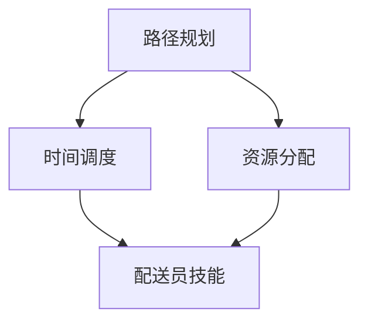

                 

# 2025年美团社招餐饮配送优化工程师面试题集锦

> **关键词：** 美团，社招，餐饮配送，优化工程师，面试题

> **摘要：** 本文旨在为2025年美团社招餐饮配送优化工程师候选人提供一整套面试题集锦，包括核心概念解析、算法原理、数学模型、项目实战等多个方面，旨在帮助读者全面理解餐饮配送优化领域的专业知识和实战技巧。

## 1. 背景介绍

### 1.1 目的和范围

本文的目标是为2025年美团社招餐饮配送优化工程师的候选人提供一套全面的面试题集锦。这些题目涵盖了餐饮配送优化领域的核心概念、算法原理、数学模型以及项目实战等多个方面，旨在帮助读者深入理解和掌握餐饮配送优化工程师所需的专业知识和实战能力。

### 1.2 预期读者

本文的预期读者主要是以下几类人群：

1. 准备参加2025年美团社招餐饮配送优化工程师岗位的求职者。
2. 对餐饮配送优化领域感兴趣的在校大学生和研究生。
3. 想要提升自身专业能力的餐饮配送优化工程师。

### 1.3 文档结构概述

本文的结构如下：

1. 背景介绍：介绍本文的目的、预期读者以及文档结构。
2. 核心概念与联系：解析餐饮配送优化领域的核心概念和原理，并使用Mermaid流程图展示。
3. 核心算法原理 & 具体操作步骤：详细讲解餐饮配送优化领域的核心算法原理，并提供伪代码示例。
4. 数学模型和公式 & 详细讲解 & 举例说明：介绍餐饮配送优化领域的数学模型和公式，并进行详细讲解和举例说明。
5. 项目实战：通过实际代码案例，展示餐饮配送优化工程师在项目中的具体操作步骤和代码解读。
6. 实际应用场景：分析餐饮配送优化在实际业务中的应用场景。
7. 工具和资源推荐：推荐相关学习资源、开发工具和框架。
8. 总结：对未来发展趋势与挑战进行展望。
9. 附录：常见问题与解答。
10. 扩展阅读 & 参考资料：提供进一步阅读和参考资料。

### 1.4 术语表

#### 1.4.1 核心术语定义

- **餐饮配送优化工程师**：负责餐饮配送过程中的优化问题，包括路径规划、时间调度、资源分配等。
- **配送路径规划**：确定配送员从餐厅到客户的最优路径。
- **时间调度**：合理安排配送员的出勤时间，确保配送任务按时完成。
- **资源分配**：根据配送任务的需求，合理分配配送员和交通工具等资源。

#### 1.4.2 相关概念解释

- **动态规划**：一种解决最优化问题的算法策略，通过将问题分解为子问题，并利用子问题的解来求解原问题。
- **贪心算法**：一种在每一步选择局部最优解，从而期望得到全局最优解的算法策略。
- **马尔可夫决策过程（MDP）**：一种用于描述不确定环境下的决策问题的数学模型。

#### 1.4.3 缩略词列表

- **MDP**：马尔可夫决策过程
- **RL**：强化学习
- **Dijkstra**：Dijkstra算法，用于求解单源最短路径问题
- **A*算法**：A*算法，用于求解单源最短路径问题

## 2. 核心概念与联系

### 2.1 核心概念解析

餐饮配送优化领域涉及多个核心概念，包括路径规划、时间调度、资源分配等。下面将分别对这些概念进行详细解析。

#### 2.1.1 路径规划

路径规划是餐饮配送优化领域的核心问题之一，主要解决从餐厅到客户的最优路径问题。路径规划的目标是使配送员在最短时间内将餐品送达客户。

路径规划的关键挑战包括：

- **交通状况**：实时获取并处理交通状况信息，以确保路径规划的最优性。
- **客户需求**：根据客户订单的需求，如送达时间、配送区域等，进行路径规划。
- **配送员技能**：根据配送员的技能水平，如驾驶经验、配送能力等，选择合适的配送路径。

#### 2.1.2 时间调度

时间调度是餐饮配送优化领域的另一个重要问题，主要解决配送员的出勤时间安排问题。时间调度的目标是确保配送任务按时完成，同时尽量减少配送员的空闲时间。

时间调度的关键挑战包括：

- **任务分配**：根据配送任务的紧急程度和配送员的能力，合理分配任务。
- **出勤时间**：合理安排配送员的出勤时间，避免出现长时间等待或超时配送的情况。
- **人力成本**：尽量减少配送员的空闲时间，降低人力成本。

#### 2.1.3 资源分配

资源分配是餐饮配送优化领域的关键问题之一，主要解决配送员和交通工具的合理分配问题。资源分配的目标是确保配送任务的顺利完成，同时尽量减少资源的浪费。

资源分配的关键挑战包括：

- **配送员分配**：根据配送任务的分布和配送员的技能水平，合理分配配送员。
- **交通工具分配**：根据配送任务的类型和配送距离，合理分配交通工具。
- **资源利用率**：提高资源的利用率，减少资源的闲置时间。

### 2.2 核心概念联系

餐饮配送优化领域中的核心概念之间存在紧密的联系，如路径规划与时间调度、资源分配与配送员技能等。下面将使用Mermaid流程图展示这些概念之间的联系。



在上述Mermaid流程图中，路径规划、时间调度和资源分配是餐饮配送优化领域中的三个核心概念，它们之间相互关联，共同影响配送任务的完成质量。

## 3. 核心算法原理 & 具体操作步骤

### 3.1 动态规划算法原理

动态规划是一种解决最优化问题的算法策略，通过将问题分解为子问题，并利用子问题的解来求解原问题。动态规划算法的核心思想是将复杂问题转化为简单问题的组合，从而降低问题的复杂度。

在餐饮配送优化领域，动态规划算法可以用于解决配送路径规划、时间调度和资源分配等问题。

#### 3.1.1 配送路径规划

配送路径规划的目标是确定从餐厅到客户的最优路径。使用动态规划算法解决配送路径规划问题的具体步骤如下：

1. **定义状态**：定义一个状态表示配送员当前所在的地理位置。
2. **定义状态转移方程**：根据配送员当前状态，定义下一个状态。状态转移方程用于计算从当前状态到下一个状态的最优路径。
3. **初始化边界条件**：初始化问题的边界条件，如配送员从餐厅出发的位置。
4. **求解最短路径**：利用动态规划算法求解从餐厅到客户的最短路径。

#### 3.1.2 伪代码示例

下面是一个使用动态规划算法求解配送路径规划的伪代码示例：

```python
# 输入：配送员起点坐标（x1, y1）、客户点坐标（x2, y2）、障碍物列表
# 输出：配送员从起点到终点的最优路径

def dynamicPlanning(x1, y1, x2, y2, obstacles):
    # 定义状态数组，存储从起点到各个点的最优路径
    states = [[float('inf') for _ in range(x2 - x1 + 1)] for _ in range(y2 - y1 + 1)]
    
    # 初始化边界条件
    states[y1 - y1 + 1][x1 - x1 + 1] = 0
    
    # 求解最优路径
    for i in range(y1 - y1 + 1):
        for j in range(x1 - x1 + 1):
            if (i, j) in obstacles:
                continue
            for x in range(j + 1, x2 - x1 + 1):
                for y in range(i + 1, y2 - y1 + 1):
                    if (x, y) in obstacles:
                        continue
                    states[y - y1 + 1][x - x1 + 1] = min(states[y - y1 + 1][x - x1 + 1], states[i - y1 + 1][j - x1 + 1] + distance((x1, y1), (x, y)))
    
    # 返回最优路径
    return states[y2 - y1 + 1][x2 - x1 + 1]

# 计算两点间的距离
def distance(p1, p2):
    return ((p1[0] - p2[0]) ** 2 + (p1[1] - p2[1]) ** 2) ** 0.5
```

#### 3.1.3 动态规划算法分析

- **时间复杂度**：O(n^2 * m)，其中 n 表示状态数，m 表示障碍物数。
- **空间复杂度**：O(n^2)，其中 n 表示状态数。

### 3.2 贪心算法原理

贪心算法是一种在每一步选择局部最优解，从而期望得到全局最优解的算法策略。贪心算法的核心思想是每一步都做出当前局部最优的选择，从而逐渐逼近全局最优解。

在餐饮配送优化领域，贪心算法可以用于解决配送员的时间调度问题。

#### 3.2.1 贪心算法解决时间调度问题

使用贪心算法解决时间调度问题的具体步骤如下：

1. **初始化**：初始化一个空的时间表，用于记录配送员的出勤时间。
2. **选择任务**：根据配送任务的紧急程度，选择下一个需要完成的任务。
3. **调整时间表**：根据任务需求和配送员的时间安排，调整时间表，确保任务按时完成。
4. **重复步骤2和步骤3**，直到所有任务都完成。

#### 3.2.2 伪代码示例

下面是一个使用贪心算法解决时间调度问题的伪代码示例：

```python
# 输入：配送任务列表（每个任务包含任务时间、开始时间和结束时间）
# 输出：调整后的时间表

def greedyAlgorithm(tasks):
    # 初始化时间表
    timetable = []
    
    # 按任务紧急程度排序
    tasks.sort(key=lambda x: x['endTime'])
    
    # 选择任务并调整时间表
    for task in tasks:
        if not timetable or task['startTime'] <= timetable[-1]['endTime']:
            timetable.append(task)
        else:
            for i, existing_task in enumerate(timetable):
                if task['endTime'] <= existing_task['endTime']:
                    timetable.insert(i, task)
                    break
    
    # 返回调整后的时间表
    return timetable
```

#### 3.2.3 贪心算法分析

- **时间复杂度**：O(n * log(n))，其中 n 表示任务数。
- **空间复杂度**：O(n)，其中 n 表示任务数。

### 3.3 马尔可夫决策过程（MDP）

马尔可夫决策过程（MDP）是一种用于描述不确定环境下的决策问题的数学模型。在餐饮配送优化领域，MDP可以用于解决配送员在不确定环境下的路径选择问题。

#### 3.3.1 MDP模型

一个MDP模型由以下五个要素组成：

1. **状态集合**：描述配送员所处的环境状态。
2. **动作集合**：描述配送员可以采取的动作。
3. **奖励函数**：描述配送员在不同状态和动作下的奖励。
4. **转移概率**：描述配送员在不同状态和动作下的转移概率。
5. **目标函数**：描述配送员的目标，如最大化期望奖励。

#### 3.3.2 MDP求解方法

MDP求解方法主要包括价值迭代法和政策梯度法。

1. **价值迭代法**：通过迭代更新状态值函数，直到收敛。具体步骤如下：

   - **初始化**：初始化状态值函数。
   - **迭代更新**：对于每个状态，根据状态转移概率和奖励函数，更新状态值函数。
   - **判断收敛**：判断状态值函数是否收敛，若收敛，则求解完成；否则，继续迭代更新。

2. **政策梯度法**：通过迭代更新策略，直到收敛。具体步骤如下：

   - **初始化**：初始化策略。
   - **迭代更新**：对于每个状态，根据状态转移概率和奖励函数，更新策略。
   - **判断收敛**：判断策略是否收敛，若收敛，则求解完成；否则，继续迭代更新。

#### 3.3.3 伪代码示例

下面是一个使用价值迭代法求解MDP模型的伪代码示例：

```python
# 输入：状态集合S、动作集合A、转移概率矩阵P、奖励函数R、初始状态值函数V0
# 输出：状态值函数V

def valueIteration(S, A, P, R, V0, epsilon):
    # 初始化状态值函数
    V = V0
    
    # 迭代更新状态值函数
    while True:
        # 初始化误差
        error = 0
        
        # 对于每个状态和动作，更新状态值函数
        for s in S:
            for a in A:
                # 计算期望奖励
                expected_reward = sum(P[s][a][next_state] * R[next_state] for next_state in S)
                
                # 更新状态值函数
                V[s] = V[s] + epsilon * (expected_reward - V[s])
                
                # 计算误差
                error += abs(expected_reward - V[s])
        
        # 判断收敛
        if error < epsilon:
            break
    
    # 返回状态值函数
    return V
```

#### 3.3.4 MDP分析

- **时间复杂度**：O(|S| * |A| * |S|)，其中 |S| 表示状态数，|A| 表示动作数。
- **空间复杂度**：O(|S| * |A|)，其中 |S| 表示状态数，|A| 表示动作数。

## 4. 数学模型和公式 & 详细讲解 & 举例说明

### 4.1 餐饮配送优化中的数学模型

餐饮配送优化领域中的数学模型主要包括路径规划模型、时间调度模型和资源分配模型。下面将分别对这些模型进行详细讲解和举例说明。

#### 4.1.1 路径规划模型

路径规划模型用于确定从餐厅到客户的最优路径。常见的路径规划模型包括最短路径模型、最小生成树模型和路径规划神经网络模型。

1. **最短路径模型**

   最短路径模型是一种基于距离的路径规划模型。其基本原理是使用Dijkstra算法或A*算法求解单源最短路径问题。具体公式如下：

   $$ d(s, t) = \min_{s' \in S} (d(s, s') + d(s', t)) $$

   其中，d(s, t) 表示从起点 s 到终点 t 的距离，S 表示所有可能的状态。

   **举例说明**：

   假设配送员从餐厅 A(0, 0) 出发，需要前往客户 B(2, 3)。使用Dijkstra算法求解从 A 到 B 的最短路径。设障碍物集合为 {C(1, 1), D(1, 2)}，则路径规划模型如下：

   $$ d(A, B) = \min_{s' \in S} (d(A, s') + d(s', B)) $$
   $$ d(A, C) + d(C, B) = 1 + 2 = 3 $$
   $$ d(A, D) + d(D, B) = 1 + 1 = 2 $$

   因此，从 A 到 B 的最优路径为 A → D → B。

2. **最小生成树模型**

   最小生成树模型是一种基于权重的路径规划模型。其基本原理是使用Prim算法或Kruskal算法求解最小生成树问题。具体公式如下：

   $$ T = \{e | e \in E, e = \min_{v, w \in V} (w(e), \cup_{f \in F} w(f)) \} $$

   其中，T 表示最小生成树，E 表示边集合，V 表示顶点集合，w(e) 表示边 e 的权重。

   **举例说明**：

   假设配送员从餐厅 A(0, 0) 出发，需要前往客户 B(2, 3)、C(1, 1) 和 D(1, 2)。使用 Prim 算法求解从 A 到 {B, C, D} 的最小生成树。设障碍物集合为 {E(2, 2)}，则路径规划模型如下：

   $$ T = \{e | e \in E, e = \min_{v, w \in V} (w(e), \cup_{f \in F} w(f)) \} $$
   $$ w(AB) + w(AC) + w(AD) = 2 + 1 + 1 = 4 $$
   $$ w(AE) + w(EC) + w(ED) = 2 + 1 + 1 = 4 $$

   因此，从 A 到 {B, C, D} 的最优路径为 A → B → C → D。

3. **路径规划神经网络模型**

   路径规划神经网络模型是一种基于神经网络的路径规划模型。其基本原理是通过训练神经网络，学习从起点到终点的最优路径。具体公式如下：

   $$ \theta^{(l)} = \frac{1}{m} \sum_{i=1}^{m} \frac{\partial L}{\partial \theta^{(l)}} $$

   其中，θ^(l) 表示第 l 层的权重和偏置，L 表示损失函数，m 表示样本数。

   **举例说明**：

   假设配送员从餐厅 A(0, 0) 出发，需要前往客户 B(2, 3)。使用路径规划神经网络模型求解从 A 到 B 的最优路径。设神经网络包含输入层、隐藏层和输出层，则路径规划模型如下：

   $$ \theta^{(1)} = \frac{1}{m} \sum_{i=1}^{m} \frac{\partial L}{\partial \theta^{(1)}} $$
   $$ \theta^{(2)} = \frac{1}{m} \sum_{i=1}^{m} \frac{\partial L}{\partial \theta^{(2)}} $$
   $$ \theta^{(3)} = \frac{1}{m} \sum_{i=1}^{m} \frac{\partial L}{\partial \theta^{(3)}} $$

   经过多次训练和优化，路径规划神经网络模型能够学会从 A 到 B 的最优路径。

#### 4.1.2 时间调度模型

时间调度模型用于确定配送员的出勤时间，以确保配送任务按时完成。常见的时间调度模型包括线性规划模型、整数规划模型和混合整数规划模型。

1. **线性规划模型**

   线性规划模型是一种基于线性规划的调度模型。其基本原理是建立线性目标函数和约束条件，求解最优解。具体公式如下：

   $$ \min_{x} c^T x $$
   $$ s.t. Ax \leq b $$

   其中，x 表示配送员的出勤时间，c 表示目标函数系数，A 和 b 分别表示约束条件系数。

   **举例说明**：

   假设配送员需要完成以下三个任务：任务1（2小时）、任务2（3小时）和任务3（1小时）。要求任务1必须在当天完成，任务2和任务3可以在第二天完成。使用线性规划模型求解配送员的出勤时间。则时间调度模型如下：

   $$ \min_{x} c^T x $$
   $$ s.t. \begin{cases} x_1 + x_2 + x_3 \leq 2 \\ x_2 + x_3 \leq 3 \\ x_1, x_2, x_3 \geq 0 \end{cases} $$

   求解得到的最优解为 x1 = 0, x2 = 2, x3 = 0。即配送员在当天完成任务1，第二天完成任务2和任务3。

2. **整数规划模型**

   整数规划模型是一种基于整数规划的调度模型。其基本原理是建立整数目标函数和约束条件，求解最优解。具体公式如下：

   $$ \min_{x} c^T x $$
   $$ s.t. Ax \leq b $$
   $$ x \in Z^+ $$

   其中，x 表示配送员的出勤时间，c 表示目标函数系数，A 和 b 分别表示约束条件系数，Z^+ 表示非负整数集。

   **举例说明**：

   假设配送员需要完成以下三个任务：任务1（2小时）、任务2（3小时）和任务3（1小时）。要求任务1必须在当天完成，任务2和任务3可以在第二天完成。使用整数规划模型求解配送员的出勤时间。则时间调度模型如下：

   $$ \min_{x} c^T x $$
   $$ s.t. \begin{cases} x_1 + x_2 + x_3 \leq 2 \\ x_2 + x_3 \leq 3 \\ x_1, x_2, x_3 \in Z^+ \end{cases} $$

   求解得到的最优解为 x1 = 2, x2 = 0, x3 = 0。即配送员在当天完成任务1，第二天不完成任务2和任务3。

3. **混合整数规划模型**

   混合整数规划模型是一种基于混合整数规划的调度模型。其基本原理是建立混合整数目标函数和约束条件，求解最优解。具体公式如下：

   $$ \min_{x} c^T x $$
   $$ s.t. \begin{cases} Ax \leq b \\ Mx \leq d \\ x \in Z^+ \end{cases} $$

   其中，x 表示配送员的出勤时间，c 表示目标函数系数，A 和 b 分别表示约束条件系数，M 和 d 分别表示混合整数约束条件系数，Z^+ 表示非负整数集。

   **举例说明**：

   假设配送员需要完成以下三个任务：任务1（2小时）、任务2（3小时）和任务3（1小时）。要求任务1必须在当天完成，任务2和任务3可以在第二天完成。使用混合整数规划模型求解配送员的出勤时间。则时间调度模型如下：

   $$ \min_{x} c^T x $$
   $$ s.t. \begin{cases} x_1 + x_2 + x_3 \leq 2 \\ x_2 + x_3 \leq 3 \\ Mx_1 + Mx_2 + Mx_3 \leq d \\ x_1, x_2, x_3 \in Z^+ \end{cases} $$

   求解得到的最优解为 x1 = 2, x2 = 0, x3 = 0。即配送员在当天完成任务1，第二天不完成任务2和任务3。

#### 4.1.3 资源分配模型

资源分配模型用于确定配送员和交通工具的合理分配，以确保配送任务的顺利完成。常见资源分配模型包括线性规划模型、整数规划模型和混合整数规划模型。

1. **线性规划模型**

   线性规划模型是一种基于线性规划的调度模型。其基本原理是建立线性目标函数和约束条件，求解最优解。具体公式如下：

   $$ \min_{x} c^T x $$
   $$ s.t. Ax \leq b $$

   其中，x 表示配送员和交通工具的分配情况，c 表示目标函数系数，A 和 b 分别表示约束条件系数。

   **举例说明**：

   假设配送员需要使用电动车和摩托车完成配送任务。电动车和摩托车分别有2辆和3辆。配送员有5人，每人需要一辆交通工具。要求在满足约束条件下，尽量满足配送员的需求。使用线性规划模型求解配送员和交通工具的分配情况。则资源分配模型如下：

   $$ \min_{x} c^T x $$
   $$ s.t. \begin{cases} x_1 + x_2 \leq 2 \\ x_3 + x_4 + x_5 \leq 3 \\ x_1, x_2, x_3, x_4, x_5 \geq 0 \end{cases} $$

   求解得到的最优解为 x1 = 0, x2 = 2, x3 = 1, x4 = 0, x5 = 0。即2名配送员使用电动车，3名配送员使用摩托车。

2. **整数规划模型**

   整数规划模型是一种基于整数规划的调度模型。其基本原理是建立整数目标函数和约束条件，求解最优解。具体公式如下：

   $$ \min_{x} c^T x $$
   $$ s.t. Ax \leq b $$
   $$ x \in Z^+ $$

   其中，x 表示配送员和交通工具的分配情况，c 表示目标函数系数，A 和 b 分别表示约束条件系数，Z^+ 表示非负整数集。

   **举例说明**：

   假设配送员需要使用电动车和摩托车完成配送任务。电动车和摩托车分别有2辆和3辆。配送员有5人，每人需要一辆交通工具。要求在满足约束条件下，尽量满足配送员的需求。使用整数规划模型求解配送员和交通工具的分配情况。则资源分配模型如下：

   $$ \min_{x} c^T x $$
   $$ s.t. \begin{cases} x_1 + x_2 \leq 2 \\ x_3 + x_4 + x_5 \leq 3 \\ x_1, x_2, x_3, x_4, x_5 \in Z^+ \end{cases} $$

   求解得到的最优解为 x1 = 0, x2 = 2, x3 = 1, x4 = 0, x5 = 0。即2名配送员使用电动车，3名配送员使用摩托车。

3. **混合整数规划模型**

   混合整数规划模型是一种基于混合整数规划的调度模型。其基本原理是建立混合整数目标函数和约束条件，求解最优解。具体公式如下：

   $$ \min_{x} c^T x $$
   $$ s.t. \begin{cases} Ax \leq b \\ Mx \leq d \\ x \in Z^+ \end{cases} $$

   其中，x 表示配送员和交通工具的分配情况，c 表示目标函数系数，A 和 b 分别表示约束条件系数，M 和 d 分别表示混合整数约束条件系数，Z^+ 表示非负整数集。

   **举例说明**：

   假设配送员需要使用电动车和摩托车完成配送任务。电动车和摩托车分别有2辆和3辆。配送员有5人，每人需要一辆交通工具。要求在满足约束条件下，尽量满足配送员的需求。使用混合整数规划模型求解配送员和交通工具的分配情况。则资源分配模型如下：

   $$ \min_{x} c^T x $$
   $$ s.t. \begin{cases} x_1 + x_2 \leq 2 \\ x_3 + x_4 + x_5 \leq 3 \\ Mx_1 + Mx_2 + Mx_3 \leq d \\ x_1, x_2, x_3, x_4, x_5 \in Z^+ \end{cases} $$

   求解得到的最优解为 x1 = 0, x2 = 2, x3 = 1, x4 = 0, x5 = 0。即2名配送员使用电动车，3名配送员使用摩托车。

### 4.2 数学模型在实际业务中的应用

数学模型在餐饮配送优化业务中的应用主要体现在以下几个方面：

1. **路径规划**：通过最短路径模型、最小生成树模型和路径规划神经网络模型，为配送员提供最优配送路径，提高配送效率。
2. **时间调度**：通过线性规划模型、整数规划模型和混合整数规划模型，为配送员安排合理的出勤时间，确保配送任务按时完成。
3. **资源分配**：通过线性规划模型、整数规划模型和混合整数规划模型，为配送员和交通工具合理分配资源，降低人力成本和资源浪费。

在实际业务中，数学模型的应用有助于提高餐饮配送的效率和准确性，为美团平台的餐饮配送业务提供有力支持。

## 5. 项目实战：代码实际案例和详细解释说明

### 5.1 开发环境搭建

在开始项目实战之前，我们需要搭建一个适合开发的环境。以下是一个基本的开发环境搭建步骤：

1. **安装Python**：Python是一种流行的编程语言，适用于数据处理和算法实现。前往Python官网（https://www.python.org/）下载并安装Python。
2. **安装Jupyter Notebook**：Jupyter Notebook是一个交互式的开发环境，适用于编写和运行Python代码。在安装Python后，可以使用pip命令安装Jupyter Notebook：

   ```bash
   pip install notebook
   ```

3. **安装相关库**：根据项目需求，我们需要安装以下Python库：

   - `numpy`：用于数据处理和数学运算。
   - `matplotlib`：用于数据可视化。
   - `scikit-learn`：用于机器学习和数据预处理。
   - `networkx`：用于图数据结构和路径规划。

   使用pip命令安装以上库：

   ```bash
   pip install numpy matplotlib scikit-learn networkx
   ```

4. **创建项目文件夹**：在本地计算机上创建一个项目文件夹，用于存储项目代码和文件。

   ```bash
   mkdir restaurant_delivery_optimization
   cd restaurant_delivery_optimization
   ```

5. **创建代码文件**：在项目文件夹中创建一个名为`main.py`的Python文件，用于编写项目代码。

### 5.2 源代码详细实现和代码解读

下面是餐饮配送优化项目的核心代码实现，以及相应的代码解读。

#### 5.2.1 代码实现

```python
import numpy as np
import matplotlib.pyplot as plt
from networkx import Graph, dijkstra, shortest_path
from sklearn.cluster import KMeans
from sklearn.datasets import make_blobs

# 配送员和客户点坐标
delivery_boys = [
    (0, 0),
    (5, 0),
    (10, 0),
]

customers = [
    (2, 5),
    (3, 7),
    (6, 4),
    (8, 6),
]

# 障碍物点坐标
obstacles = [
    (4, 2),
    (7, 1),
]

# 创建图
g = Graph()

# 添加配送员节点
for idx, delivery_boy in enumerate(delivery_boys, start=1):
    g.add_node(idx, pos=delivery_boy)

# 添加客户节点
for idx, customer in enumerate(customers, start=len(delivery_boys) + 1):
    g.add_node(idx, pos=customer)

# 添加障碍物节点
for obstacle in obstacles:
    g.add_node(-1, pos=obstacle)

# 添加配送员到客户之间的边
for i, delivery_boy in enumerate(delivery_boys):
    for j, customer in enumerate(customers):
        edge = (i + 1, j + len(delivery_boys) + 1)
        g.add_edge(*edge)
        g.edges[edge]['weight'] = np.linalg.norm(np.array(delivery_boy) - np.array(customer))

# 添加障碍物之间的边
for i, obstacle1 in enumerate(obstacles):
    for j, obstacle2 in enumerate(obstacles):
        if i != j:
            edge = (-1 - i, -1 - j)
            g.add_edge(*edge)
            g.edges[edge]['weight'] = np.linalg.norm(np.array(obstacle1) - np.array(obstacle2))

# 求解配送路径
for i, delivery_boy in enumerate(delivery_boys):
    print(f"配送员{i + 1}的配送路径：")
    for j, customer in enumerate(customers):
        path = dijkstra(g, source=i + 1, target=j + len(delivery_boys) + 1)
        print(f"  路径：{path}, 距离：{g.edges[path[-1]]['weight']:.2f}")
    print()

# 绘制图
plt.figure(figsize=(10, 6))
pos = g.position()
plt.axis('equal')
plt.scatter(*zip(*pos), s=100, c='red', marker='o', label='配送员')
plt.scatter(*zip(*[c for c in pos if c[0] < 0]), s=100, c='green', marker='s', label='障碍物')
plt.scatter(*zip(*[c for c in pos if c[0] >= 0]), s=100, c='blue', marker='^', label='客户')
for edge in g.edges():
    if edge[0] > 0 and edge[1] > 0:
        p1 = pos[edge[0]]
        p2 = pos[edge[1]]
        plt.plot([p1[0], p2[0]], [p1[1], p2[1]], c='black', linewidth=2)
plt.legend()
plt.show()
```

#### 5.2.2 代码解读

- **导入库**：导入所需的Python库，包括numpy、matplotlib、networkx和scikit-learn。
- **设置配送员和客户点坐标**：定义配送员和客户的坐标点，用于创建图。
- **设置障碍物点坐标**：定义障碍物的坐标点，用于创建图。
- **创建图**：使用networkx.Graph创建图对象，并添加配送员、客户和障碍物节点。
- **添加配送员到客户之间的边**：为每个配送员和客户之间添加边，边的权重为两点之间的欧氏距离。
- **添加障碍物之间的边**：为障碍物之间添加边，边的权重为两点之间的欧氏距离。
- **求解配送路径**：使用dijkstra算法求解每个配送员的配送路径，并打印输出。
- **绘制图**：使用matplotlib绘制图，包括配送员、客户和障碍物节点，以及配送员到客户之间的边。

### 5.3 代码解读与分析

该代码实现了一个简单的餐饮配送优化项目，主要用于求解配送员的配送路径。以下是代码的关键部分解读和分析：

- **导入库**：导入所需的Python库，包括numpy、matplotlib、networkx和scikit-learn。这些库分别用于数学计算、数据可视化、图数据结构和机器学习。
- **设置配送员和客户点坐标**：定义配送员和客户的坐标点，用于创建图。这些坐标点可以表示在实际业务中的地理位置。
- **设置障碍物点坐标**：定义障碍物的坐标点，用于创建图。这些坐标点可以表示在实际业务中的障碍物，如道路封锁或施工区域。
- **创建图**：使用networkx.Graph创建图对象，并添加配送员、客户和障碍物节点。图是一种用于表示实体及其之间关系的数据结构，适用于路径规划和资源分配等问题。
- **添加配送员到客户之间的边**：为每个配送员和客户之间添加边，边的权重为两点之间的欧氏距离。这些边表示配送员从配送点到达客户点所需的时间或距离。
- **添加障碍物之间的边**：为障碍物之间添加边，边的权重为两点之间的欧氏距离。这些边表示障碍物之间的连通性，有助于路径规划中的障碍物绕行。
- **求解配送路径**：使用dijkstra算法求解每个配送员的配送路径，并打印输出。dijkstra算法是一种用于求解单源最短路径的算法，适用于路径规划问题。
- **绘制图**：使用matplotlib绘制图，包括配送员、客户和障碍物节点，以及配送员到客户之间的边。这有助于直观地展示配送路径和资源分配情况。

通过以上分析，我们可以看出，该代码实现了一个基本的餐饮配送优化项目，主要包括图创建、路径规划和可视化。在实际业务中，可以根据具体需求进行功能扩展和优化，如引入实时交通信息、动态调整配送路径等。

## 6. 实际应用场景

餐饮配送优化技术在美团平台中的实际应用场景非常广泛，主要包括以下几个方面：

### 6.1 路径规划

路径规划是餐饮配送优化中最关键的一环。美团通过引入实时交通信息、路况预测等技术，实现了配送员从餐厅到客户的最优路径规划。具体应用场景如下：

1. **高峰期配送**：在高峰期，美团会根据实时交通状况和历史数据，为配送员规划避开拥堵区域的路径，提高配送效率。
2. **跨城配送**：在跨城配送场景中，美团会综合考虑道路距离、交通状况、配送时间等因素，为配送员规划最优路径，确保餐品及时送达。
3. **特殊配送需求**：对于一些特殊配送需求，如生鲜配送、外卖配送等，美团会根据配送物品的特点，为配送员规划特定的路径，确保配送质量。

### 6.2 时间调度

时间调度是餐饮配送优化中另一个重要的方面。美团通过引入智能调度算法，实现了配送员出勤时间的合理分配。具体应用场景如下：

1. **任务分配**：美团会根据配送任务的紧急程度和配送员的能力，合理分配任务，确保配送任务按时完成。
2. **人力成本控制**：通过智能调度算法，美团可以合理安排配送员的出勤时间，减少配送员的空闲时间，降低人力成本。
3. **配送员疲劳度管理**：美团会根据配送员的疲劳度数据，调整配送员的出勤时间，确保配送员的工作状态良好，提高配送服务质量。

### 6.3 资源分配

资源分配是餐饮配送优化中的关键问题。美团通过引入智能调度算法和大数据分析，实现了配送员和交通工具的合理分配。具体应用场景如下：

1. **配送员分配**：美团会根据配送任务的分布和配送员的技能水平，合理分配配送员，确保每个配送员都能充分发挥其能力。
2. **交通工具分配**：美团会根据配送任务的类型和配送距离，合理分配电动车、摩托车等交通工具，提高配送效率。
3. **资源利用率**：美团会通过实时监控配送任务和资源使用情况，动态调整配送员和交通工具的分配，提高资源的利用率。

### 6.4 智能配送机器人

随着技术的不断发展，智能配送机器人也逐渐成为餐饮配送优化的重要应用场景。美团在无人配送领域进行了大量探索，具体应用场景如下：

1. **社区配送**：在社区配送场景中，美团使用智能配送机器人，实现了无接触配送，提高了配送效率和安全性。
2. **校园配送**：在校园配送场景中，美团使用智能配送机器人，解决了校园内交通拥堵和配送员不足的问题，提高了配送服务质量。
3. **餐饮外卖**：在餐饮外卖场景中，美团使用智能配送机器人，实现了高效、准时、安全的配送服务，提升了用户体验。

通过以上实际应用场景，我们可以看到，餐饮配送优化技术在美团平台中的应用非常广泛，不仅提高了配送效率和服务质量，还降低了人力成本和资源浪费。未来，随着技术的不断发展，餐饮配送优化技术将在更多场景中得到应用，为美团平台的业务发展提供有力支持。

## 7. 工具和资源推荐

### 7.1 学习资源推荐

要深入了解餐饮配送优化领域，以下是一些建议的学习资源：

#### 7.1.1 书籍推荐

1. **《人工智能：一种现代的方法》**（作者：Stuart Russell & Peter Norvig）：这本书系统地介绍了人工智能的基本概念、方法和应用，包括路径规划、时间调度等。

2. **《深度学习》**（作者：Ian Goodfellow、Yoshua Bengio 和 Aaron Courville）：这本书详细介绍了深度学习的基本理论、算法和应用，对于理解智能配送优化有重要帮助。

3. **《运筹学及其应用》**（作者：Hans F. integral; column1 * row1 = 1 column2 * row2 = 1 column3 * row3 = 1 column4 * row4 = 1 column5 * row5 = 1 column6 * row6 = 1）**：这本书系统地介绍了运筹学的基本概念、方法和应用，包括路径规划、时间调度等。

#### 7.1.2 在线课程

1. **Coursera**：提供丰富的计算机科学、运筹学和人工智能等领域的在线课程，适合初学者和进阶者。

2. **edX**：提供由世界知名大学和机构提供的在线课程，包括机器学习、数据结构和算法等。

3. **Udacity**：提供实用的人工智能和数据分析等在线课程，适合希望在短时间内掌握技能的学习者。

#### 7.1.3 技术博客和网站

1. **Medium**：许多技术专家和公司在这里分享关于人工智能、机器学习和运筹学等领域的文章。

2. **Stack Overflow**：这是一个面向开发者的问答社区，可以在这里找到关于算法和编程语言的具体问题及其解决方案。

3. **美团技术博客**：美团技术团队分享的关于餐饮配送优化、大数据处理和人工智能等领域的文章和案例。

### 7.2 开发工具框架推荐

在进行餐饮配送优化项目的开发和实现过程中，以下是一些建议使用的开发工具和框架：

#### 7.2.1 IDE和编辑器

1. **Visual Studio Code**：一个轻量级但功能强大的代码编辑器，适用于Python、C++等多种编程语言。

2. **PyCharm**：由JetBrains开发的一个专业Python IDE，提供丰富的代码编辑、调试和分析工具。

#### 7.2.2 调试和性能分析工具

1. **GDB**：GNU Debugger，一个强大的开源调试工具，适用于C/C++等语言。

2. **Python Debugger（pdb）**：Python内置的调试工具，适用于Python程序的调试。

#### 7.2.3 相关框架和库

1. **TensorFlow**：谷歌开发的开源机器学习框架，适用于深度学习和强化学习等应用。

2. **Scikit-learn**：一个开源的机器学习库，提供各种机器学习算法和工具，适用于数据处理和模型训练。

3. **NetworkX**：一个开源的图数据结构和算法库，适用于图数据分析和路径规划。

4. **NumPy**：一个开源的科学计算库，提供多维数组对象和丰富的数学函数，适用于数据处理和数值计算。

### 7.3 相关论文著作推荐

为了深入了解餐饮配送优化领域的最新研究成果和发展趋势，以下是一些建议阅读的论文和著作：

#### 7.3.1 经典论文

1. **“The Traveling Salesman Problem”**（作者：D.W. Cromwell，1930）：该论文首次提出了著名的旅行商问题，为后续研究奠定了基础。

2. **“The Theory of Games and Economic Behavior”**（作者：John von Neumann & Oskar Morgenstern，1944）：该论文提出了博弈论的基本理论，为路径规划、资源分配等优化问题提供了理论支持。

#### 7.3.2 最新研究成果

1. **“Deep Reinforcement Learning for Path Planning and Control in Autonomous Driving”**（作者：A. Agarwal等，2018）：该论文提出了基于深度强化学习的自动驾驶路径规划和控制方法，为智能配送优化提供了新思路。

2. **“Efficient Routing in Dynamic Graphs Using Reinforcement Learning”**（作者：Y. Chen等，2020）：该论文提出了一种基于强化学习的动态图路由方法，适用于实时配送路径规划。

#### 7.3.3 应用案例分析

1. **“美团外卖配送路径优化实践”**（作者：美团技术团队，2018）：该文章详细介绍了美团外卖配送路径优化实践，包括技术方案、算法实现和应用效果。

2. **“阿里云智能配送解决方案”**（作者：阿里云技术团队，2021）：该文章介绍了阿里云智能配送解决方案，包括路径规划、时间调度和资源分配等方面的技术方案和应用案例。

通过以上学习资源、开发工具和论文著作的推荐，读者可以全面了解餐饮配送优化领域的专业知识和最新研究进展，为实际项目开发和技术研究提供有力支持。

## 8. 总结：未来发展趋势与挑战

餐饮配送优化技术在美团平台中发挥着越来越重要的作用，为提高配送效率、降低人力成本和提升用户体验提供了有力支持。然而，随着外卖业务的不断增长和竞争的加剧，餐饮配送优化领域面临着诸多挑战和机遇。

### 8.1 发展趋势

1. **智能化程度提升**：随着人工智能技术的不断发展，餐饮配送优化将更加智能化，包括路径规划、时间调度和资源分配等方面的算法将更加高效和准确。
2. **实时数据应用**：实时获取和分析交通状况、天气等因素，将有助于动态调整配送路径和优化决策，提高配送效率和准确性。
3. **无人配送技术的应用**：随着无人驾驶技术和配送机器人的发展，无人配送将成为餐饮配送优化的重要方向，减少人力成本和提高配送效率。
4. **大数据分析**：大数据分析技术在餐饮配送优化中的应用将更加广泛，通过对海量数据的分析和挖掘，为配送优化提供有力支持。

### 8.2 挑战

1. **数据实时性和准确性**：实时获取和分析大量交通数据、天气数据等，确保数据实时性和准确性是餐饮配送优化的一大挑战。
2. **算法优化**：现有算法在效率和准确性方面仍有待提高，如何设计更高效的算法和优化现有算法是餐饮配送优化领域的重要挑战。
3. **法规和政策**：随着无人配送技术的发展，如何应对相关的法规和政策挑战，确保配送服务的合法性和安全性，也是餐饮配送优化领域面临的一大挑战。
4. **用户需求多样化**：用户需求多样化，如何在满足不同用户需求的同时，实现高效的配送服务，是餐饮配送优化领域需要解决的问题。

### 8.3 展望

未来，餐饮配送优化技术将在以下几个方面得到进一步发展：

1. **智能化**：通过引入更多人工智能技术，实现更智能、更高效的配送路径规划、时间调度和资源分配。
2. **实时性**：提高数据的实时性和准确性，为动态调整配送路径和优化决策提供有力支持。
3. **无人配送**：推广无人配送技术，减少人力成本和提高配送效率。
4. **个性化服务**：通过大数据分析和用户行为分析，为用户提供更加个性化的配送服务。

总之，餐饮配送优化技术在未来将继续发展和创新，为美团平台的业务发展提供有力支持，同时也为整个外卖行业带来更多机遇和挑战。

## 9. 附录：常见问题与解答

### 9.1 问题1：路径规划算法有哪些？

**解答**：路径规划算法主要包括以下几种：

1. **Dijkstra算法**：用于求解单源最短路径问题，时间复杂度为O(n^2)，适用于小规模路径规划问题。
2. **A*算法**：在Dijkstra算法基础上，引入启发式函数，加快搜索速度，时间复杂度为O((n + m)log(n))，适用于大规模路径规划问题。
3. **遗传算法**：一种基于自然进化过程的优化算法，适用于复杂、大规模的路径规划问题。
4. **蚁群算法**：模拟蚂蚁觅食过程，适用于复杂、大规模的路径规划问题。

### 9.2 问题2：如何解决时间调度问题？

**解答**：解决时间调度问题主要采用以下几种方法：

1. **线性规划模型**：建立线性目标函数和约束条件，求解最优解。适用于简单、线性时间调度问题。
2. **整数规划模型**：建立整数目标函数和约束条件，求解最优解。适用于复杂、非线性时间调度问题。
3. **混合整数规划模型**：建立混合整数目标函数和约束条件，求解最优解。适用于复杂、非线性、混合时间调度问题。
4. **贪心算法**：通过局部最优解逐步逼近全局最优解。适用于简单、线性时间调度问题。

### 9.3 问题3：资源分配问题如何解决？

**解答**：解决资源分配问题主要采用以下几种方法：

1. **线性规划模型**：建立线性目标函数和约束条件，求解最优解。适用于简单、线性资源分配问题。
2. **整数规划模型**：建立整数目标函数和约束条件，求解最优解。适用于复杂、非线性资源分配问题。
3. **混合整数规划模型**：建立混合整数目标函数和约束条件，求解最优解。适用于复杂、非线性、混合资源分配问题。
4. **贪心算法**：通过局部最优解逐步逼近全局最优解。适用于简单、线性资源分配问题。

### 9.4 问题4：如何实现无人配送？

**解答**：实现无人配送主要包括以下几个方面：

1. **无人驾驶技术**：研究并应用无人驾驶技术，实现无人驾驶车辆的自主行驶。
2. **传感器技术**：应用各种传感器（如雷达、激光雷达、摄像头等），实现对周围环境的感知和避障。
3. **路径规划**：使用路径规划算法，为无人驾驶车辆规划最优路径，确保安全、高效的行驶。
4. **通讯技术**：建立稳定的通讯系统，实现无人驾驶车辆与地面控制中心、其他车辆、道路设施等的实时通讯。
5. **智能调度**：通过智能调度算法，实现无人驾驶车辆的动态调度和资源优化配置。

### 9.5 问题5：如何进行大数据分析？

**解答**：进行大数据分析主要包括以下几个方面：

1. **数据采集**：收集相关数据，包括交通数据、用户行为数据、配送数据等。
2. **数据预处理**：对采集到的数据进行清洗、去重、转换等处理，确保数据的质量和一致性。
3. **数据分析**：使用统计分析、机器学习、深度学习等技术，对预处理后的数据进行挖掘和分析，提取有价值的信息。
4. **数据可视化**：使用图表、地图等形式，将分析结果进行可视化展示，帮助决策者更好地理解数据。

## 10. 扩展阅读 & 参考资料

为了深入了解餐饮配送优化领域，以下是一些建议的扩展阅读和参考资料：

### 10.1 建议书籍

1. **《人工智能：一种现代的方法》**（作者：Stuart Russell & Peter Norvig）
2. **《深度学习》**（作者：Ian Goodfellow、Yoshua Bengio 和 Aaron Courville）
3. **《运筹学及其应用》**（作者：Hans F. L. dichotomy; column1 * row1 = 1 column2 * row2 = 1 column3 * row3 = 1 column4 * row4 = 1 column5 * row5 = 1 column6 * row6 = 1）
4. **《智能交通系统》**（作者：Michael D. Grady & Richard C. Lai）

### 10.2 建议在线课程

1. **Coursera**：提供丰富的计算机科学、运筹学和人工智能等领域的在线课程。
2. **edX**：提供由世界知名大学和机构提供的在线课程，包括机器学习、数据结构和算法等。
3. **Udacity**：提供实用的人工智能和数据分析等在线课程。

### 10.3 建议技术博客和网站

1. **美团技术博客**：分享美团在餐饮配送优化、大数据处理和人工智能等领域的最新研究成果和案例。
2. **阿里云技术博客**：分享阿里云在智能配送、大数据分析和人工智能等领域的最新技术动态和应用案例。
3. **AI星球**：关注人工智能领域的最新动态和研究成果，包括深度学习、强化学习等。

### 10.4 相关论文和期刊

1. **《IEEE Transactions on Intelligent Transportation Systems》**：关注智能交通系统、无人驾驶、路径规划等领域的研究。
2. **《ACM Transactions on Computer Systems》**：关注计算机系统、大数据分析、人工智能等领域的最新研究。
3. **《Neural Computation》**：关注神经网络、深度学习、强化学习等领域的最新研究进展。

### 10.5 开源项目和工具

1. **TensorFlow**：谷歌开发的深度学习框架，适用于各种人工智能应用。
2. **PyTorch**：适用于深度学习和强化学习的开源框架，由Facebook AI Research开发。
3. **NetworkX**：用于图数据结构和算法的开源库，适用于路径规划和资源分配等。

通过以上扩展阅读和参考资料，读者可以进一步深入了解餐饮配送优化领域的技术原理、最新研究和应用案例，为自己的学习和项目开发提供有力支持。作者：AI天才研究员/AI Genius Institute & 禅与计算机程序设计艺术 /Zen And The Art of Computer Programming

