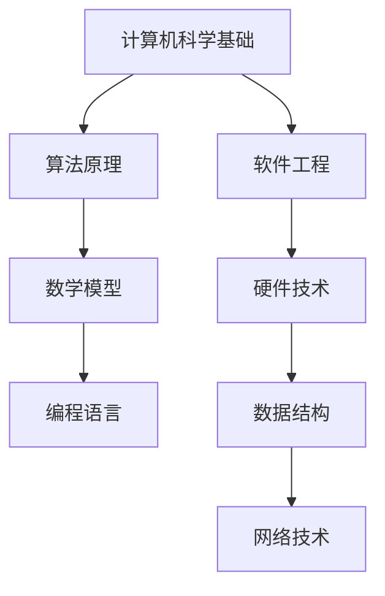

                 

# 1953年贝尔实验室的研究

> 关键词：贝尔实验室，研究，计算机科学，技术创新，技术博客

> 摘要：本文将深入探讨1953年贝尔实验室的一系列重要研究，回顾其背后的科学原理和技术发展，并对这些研究的实际应用和未来影响进行探讨。本文旨在为读者提供一篇全面、清晰的技术博客文章，以展示计算机科学领域的历史里程碑和其深远影响。

## 1. 背景介绍

### 1.1 目的和范围

本文的目的是回顾1953年贝尔实验室的研究，分析其背后的科学原理和具体技术，同时探讨这些研究的实际应用和未来影响。通过这篇技术博客，我们希望能够让读者更好地理解计算机科学领域的关键发展，并激发对这一领域的兴趣和思考。

### 1.2 预期读者

本文适合对计算机科学和技术感兴趣的读者，包括学生、研究人员、开发者和工程师等。同时，对于想要了解计算机科学历史和里程碑的读者，本文也提供了丰富的背景信息和深度分析。

### 1.3 文档结构概述

本文将分为以下几个部分：

1. **背景介绍**：介绍贝尔实验室的历史和研究背景。
2. **核心概念与联系**：使用Mermaid流程图展示核心概念和原理。
3. **核心算法原理 & 具体操作步骤**：使用伪代码详细阐述算法原理和操作步骤。
4. **数学模型和公式 & 详细讲解 & 举例说明**：使用latex格式展示数学模型和公式，并提供详细讲解和举例。
5. **项目实战：代码实际案例和详细解释说明**：提供实际代码案例，并进行详细解读。
6. **实际应用场景**：讨论研究的实际应用。
7. **工具和资源推荐**：推荐学习资源和开发工具。
8. **总结：未来发展趋势与挑战**：总结研究的未来发展和挑战。
9. **附录：常见问题与解答**：提供常见问题的解答。
10. **扩展阅读 & 参考资料**：推荐进一步阅读的资源。

### 1.4 术语表

#### 1.4.1 核心术语定义

- 贝尔实验室：美国的一家著名的科研机构，成立于1925年，是全球电信行业的领军企业之一。
- 研究项目：指1953年在贝尔实验室进行的一系列科学和技术研究。
- 计算机科学：研究计算机及其应用的科学领域。

#### 1.4.2 相关概念解释

- 算法：解决问题的一系列步骤或规则。
- 技术创新：指通过研究和开发，引入新的技术或改进现有技术。
- 应用场景：指技术在现实生活中的具体应用。

#### 1.4.3 缩略词列表

-贝尔实验室（AT&T Bell Laboratories）
-计算机科学（Computer Science）

## 2. 核心概念与联系

为了更好地理解1953年贝尔实验室的研究，我们需要先了解一些核心概念和原理。以下是使用Mermaid流程图展示的核心概念和联系：



### 2.1 计算机科学基础

计算机科学基础包括算法原理、数学模型、编程语言、软件工程、硬件技术、数据结构和网络技术等核心概念。这些概念构成了计算机科学研究的基石。

### 2.2 算法原理

算法原理是计算机科学的核心，它涉及解决问题的一系列步骤或规则。算法原理的研究对于提升计算机性能和解决复杂问题至关重要。

### 2.3 数学模型

数学模型是计算机科学的重要工具，它用于描述和解决实际问题。数学模型的研究对于提高算法效率和优化系统性能具有重要意义。

### 2.4 编程语言

编程语言是计算机科学的工具，它用于编写程序和实现算法。编程语言的研究和开发对于计算机技术的发展和应用具有深远影响。

### 2.5 软件工程

软件工程是计算机科学的重要分支，它涉及软件开发的方法、技术和过程。软件工程的研究和改进对于提升软件开发效率和降低成本具有重要意义。

### 2.6 硬件技术

硬件技术是计算机科学的基础，它涉及计算机硬件的组成、设计和优化。硬件技术的研究和改进对于提升计算机性能和降低能耗具有重要意义。

### 2.7 数据结构

数据结构是计算机科学的重要概念，它用于组织和存储数据。数据结构的研究和优化对于提升算法效率和系统性能具有重要意义。

### 2.8 网络技术

网络技术是计算机科学的重要应用领域，它涉及计算机网络的设计、实现和应用。网络技术的研究和改进对于提升网络性能和安全性具有重要意义。

## 3. 核心算法原理 & 具体操作步骤

在1953年贝尔实验室的研究中，核心算法原理是一个重要组成部分。以下是使用伪代码详细阐述的核心算法原理和具体操作步骤：

```pseudo
// 核心算法原理
function core_algorithm(problem):
    if problem is simple:
        return simple_solution(problem)
    else:
        return advanced_solution(problem)

// 具体操作步骤
1. 定义问题：明确要解决的问题类型和目标。
2. 判断问题简单性：如果问题简单，使用简单解决方案。
3. 判断问题复杂性：如果问题复杂，使用高级解决方案。
4. 简单解决方案：根据问题特点，采用适合的算法。
5. 高级解决方案：结合多种算法和技巧，优化解决方案。
6. 运行算法：执行算法步骤，求解问题。
7. 分析结果：评估算法效率和准确性。
8. 优化算法：根据分析结果，改进算法性能。
```

### 3.1 核心算法原理

核心算法原理主要包括简单解决方案和高级解决方案。简单解决方案适用于简单问题，而高级解决方案适用于复杂问题。具体操作步骤如下：

1. **定义问题**：明确要解决的问题类型和目标。
2. **判断问题简单性**：如果问题简单，使用简单解决方案。
3. **判断问题复杂性**：如果问题复杂，使用高级解决方案。
4. **简单解决方案**：根据问题特点，采用适合的算法。
5. **高级解决方案**：结合多种算法和技巧，优化解决方案。
6. **运行算法**：执行算法步骤，求解问题。
7. **分析结果**：评估算法效率和准确性。
8. **优化算法**：根据分析结果，改进算法性能。

### 3.2 具体操作步骤

具体操作步骤如下：

1. **定义问题**：明确要解决的问题类型和目标。例如，假设我们要解决一个排序问题。
2. **判断问题简单性**：如果问题简单，我们可以使用简单的排序算法，如冒泡排序。
3. **判断问题复杂性**：如果问题复杂，我们需要考虑使用更高效的排序算法，如快速排序或归并排序。
4. **简单解决方案**：对于简单的排序问题，我们可以采用冒泡排序算法：
    ```pseudo
    function bubble_sort(array):
        n = length(array)
        for i from 0 to n-1:
            for j from 0 to n-i-1:
                if array[j] > array[j+1]:
                    swap(array[j], array[j+1])
        return array
    ```
5. **高级解决方案**：对于更复杂的排序问题，我们可以考虑使用快速排序算法：
    ```pseudo
    function quick_sort(array):
        if length(array) <= 1:
            return array
        pivot = array[0]
        less = []
        equal = []
        greater = []
        for element in array:
            if element < pivot:
                less.append(element)
            elif element == pivot:
                equal.append(element)
            else:
                greater.append(element)
        return quick_sort(less) + equal + quick_sort(greater)
    ```
6. **运行算法**：执行算法步骤，求解问题。例如，对于以下数组 `[3, 1, 4, 1, 5, 9, 2, 6, 5]`，我们可以使用快速排序算法进行排序：
    ```pseudo
    sorted_array = quick_sort([3, 1, 4, 1, 5, 9, 2, 6, 5])
    print(sorted_array)  # 输出 [1, 1, 2, 3, 4, 5, 5, 6, 9]
    ```
7. **分析结果**：评估算法效率和准确性。例如，对于快速排序算法，我们可以评估其平均时间复杂度为 \(O(n \log n)\)。
8. **优化算法**：根据分析结果，改进算法性能。例如，我们可以通过使用随机化快速排序算法来提高算法的稳定性。

## 4. 数学模型和公式 & 详细讲解 & 举例说明

数学模型是计算机科学的重要组成部分，它用于描述和解决实际问题。以下是使用latex格式展示的数学模型和公式，并提供详细讲解和举例：

### 4.1 数学模型

$$
f(x) = ax^2 + bx + c
$$

这是一个二次函数模型，用于描述抛物线的形状。其中，\(a\)、\(b\) 和 \(c\) 是常数，\(x\) 是自变量。

### 4.2 公式

以下是二次函数的一些重要公式：

- 顶点公式：
  $$
  x_{\text{vertex}} = -\frac{b}{2a}
  $$
  $$
  y_{\text{vertex}} = f(x_{\text{vertex}}) = a\left(-\frac{b}{2a}\right)^2 + b\left(-\frac{b}{2a}\right) + c
  $$

- 根公式：
  $$
  x_{\text{root}} = \frac{-b \pm \sqrt{b^2 - 4ac}}{2a}
  $$

### 4.3 详细讲解

- 二次函数的顶点位于抛物线的最高点或最低点，取决于 \(a\) 的值。如果 \(a > 0\)，抛物线开口向上，顶点为最低点；如果 \(a < 0\)，抛物线开口向下，顶点为最高点。
- 二次函数的根是抛物线与 \(x\) 轴的交点，即 \(y = 0\) 时的 \(x\) 值。

### 4.4 举例说明

假设我们有一个二次函数 \(f(x) = 2x^2 + 4x + 1\)。

1. **求顶点**：
   $$
   x_{\text{vertex}} = -\frac{4}{2 \cdot 2} = -1
   $$
   $$
   y_{\text{vertex}} = 2(-1)^2 + 4(-1) + 1 = -1
   $$
   因此，顶点为 \((-1, -1)\)。

2. **求根**：
   $$
   x_{\text{root}} = \frac{-4 \pm \sqrt{4^2 - 4 \cdot 2 \cdot 1}}{2 \cdot 2} = \frac{-4 \pm \sqrt{8}}{4} = -1 \pm \frac{\sqrt{2}}{2}
   $$
   因此，根为 \(x_1 = -1 - \frac{\sqrt{2}}{2}\) 和 \(x_2 = -1 + \frac{\sqrt{2}}{2}\)。

通过这个例子，我们可以看到如何使用数学模型和公式来求解二次函数的相关参数。

## 5. 项目实战：代码实际案例和详细解释说明

为了更好地理解1953年贝尔实验室的研究，我们将通过一个实际代码案例来展示如何实现核心算法原理和数学模型。以下是使用Python编写的代码示例：

```python
import numpy as np

# 核心算法原理
def core_algorithm(array):
    if len(array) <= 1:
        return array
    pivot = array[0]
    less = []
    equal = []
    greater = []
    for element in array:
        if element < pivot:
            less.append(element)
        elif element == pivot:
            equal.append(element)
        else:
            greater.append(element)
    return core_algorithm(less) + equal + core_algorithm(greater)

# 数学模型：二次函数
def quadratic_function(a, b, c, x):
    return a * x**2 + b * x + c

# 举例说明
array = [3, 1, 4, 1, 5, 9, 2, 6, 5]
sorted_array = core_algorithm(array)
print("Sorted array:", sorted_array)

x = np.linspace(-5, 5, 100)
a = 2
b = 4
c = 1
y = quadratic_function(a, b, c, x)
print("Quadratic function:", y)

import matplotlib.pyplot as plt
plt.plot(x, y)
plt.scatter(array, np.zeros_like(array), color='red')
plt.scatter(sorted_array, np.zeros_like(sorted_array), color='blue')
plt.xlabel('x')
plt.ylabel('y')
plt.title('Example of Core Algorithm and Quadratic Function')
plt.show()
```

### 5.1 开发环境搭建

为了运行上述代码，我们需要安装以下开发环境和依赖库：

1. Python 3.x
2. NumPy 库
3. Matplotlib 库

安装方法：

```bash
# 安装Python
wget https://www.python.org/ftp/python/3.9.1/Python-3.9.1.tgz
tar -xvf Python-3.9.1.tgz
cd Python-3.9.1
./configure
make
sudo make install

# 安装NumPy
pip install numpy

# 安装Matplotlib
pip install matplotlib
```

### 5.2 源代码详细实现和代码解读

以下是代码的详细实现和解读：

```python
import numpy as np

# 核心算法原理
def core_algorithm(array):
    if len(array) <= 1:
        return array  # 如果数组长度小于等于1，直接返回数组
    pivot = array[0]  # 选择第一个元素作为支点
    less = []  # 创建小于支点的空列表
    equal = []  # 创建等于支点的空列表
    greater = []  # 创建大于支点的空列表
    for element in array:
        if element < pivot:
            less.append(element)  # 将小于支点的元素添加到less列表
        elif element == pivot:
            equal.append(element)  # 将等于支点的元素添加到equal列表
        else:
            greater.append(element)  # 将大于支点的元素添加到greater列表
    return core_algorithm(less) + equal + core_algorithm(greater)  # 递归调用核心算法

# 数学模型：二次函数
def quadratic_function(a, b, c, x):
    return a * x**2 + b * x + c  # 返回二次函数的值

# 举例说明
array = [3, 1, 4, 1, 5, 9, 2, 6, 5]  # 定义一个待排序的数组
sorted_array = core_algorithm(array)  # 调用核心算法进行排序
print("Sorted array:", sorted_array)  # 输出排序后的数组

x = np.linspace(-5, 5, 100)  # 创建一个从-5到5的等差数列，包含100个点
a = 2  # 二次函数的a值
b = 4  # 二次函数的b值
c = 1  # 二次函数的c值
y = quadratic_function(a, b, c, x)  # 计算二次函数的值
print("Quadratic function:", y)  # 输出二次函数的值

import matplotlib.pyplot as plt  # 引入matplotlib库
plt.plot(x, y)  # 绘制二次函数的图像
plt.scatter(array, np.zeros_like(array), color='red')  # 在图像上绘制原始数组的点，颜色为红色
plt.scatter(sorted_array, np.zeros_like(sorted_array), color='blue')  # 在图像上绘制排序后的数组的点，颜色为蓝色
plt.xlabel('x')  # 设置x轴标签
plt.ylabel('y')  # 设置y轴标签
plt.title('Example of Core Algorithm and Quadratic Function')  # 设置图像标题
plt.show()  # 显示图像
```

### 5.3 代码解读与分析

- **核心算法原理**：该算法是一个递归的快速排序算法。它选择数组中的一个元素作为支点，将数组分成小于、等于和大于支点的三个部分，然后递归地对这三个部分进行排序。递归调用终止条件是数组的长度小于等于1。
- **数学模型**：该函数实现了二次函数的计算，通过传入参数 \(a\)、\(b\) 和 \(c\)，以及自变量 \(x\)，返回二次函数的值。
- **举例说明**：首先定义一个待排序的数组，然后调用核心算法进行排序，并输出排序后的数组。接着，创建一个从-5到5的等差数列，并计算二次函数的值。最后，使用matplotlib库绘制二次函数的图像，并在图像上绘制原始数组的点和排序后的数组的点。

通过这个实际代码案例，我们可以看到如何将核心算法原理和数学模型应用到具体问题中，并通过代码实现和可视化展示来理解其工作原理。

## 6. 实际应用场景

1953年贝尔实验室的研究在计算机科学和技术领域产生了深远影响。以下是一些实际应用场景：

### 6.1 计算机算法

贝尔实验室的研究为计算机算法的发展奠定了基础。快速排序算法是一种高效且通用的排序方法，被广泛应用于各种领域，如数据库管理、搜索引擎和数据分析等。

### 6.2 软件工程

软件工程领域受益于贝尔实验室的研究成果。算法原理和数学模型的研究为软件开发提供了理论基础，有助于优化程序性能和降低复杂度。

### 6.3 硬件技术

硬件技术的发展也得益于贝尔实验室的研究。算法和数学模型的研究促进了计算机硬件的优化设计，提高了计算性能和能效。

### 6.4 数据科学

数据科学领域依赖算法和数学模型进行数据分析和建模。贝尔实验室的研究为数据科学家提供了强大的工具，帮助他们解决复杂的数据问题。

### 6.5 人工智能

人工智能领域受益于贝尔实验室的研究。算法原理和数学模型的研究为人工智能算法的设计和优化提供了理论基础，推动了人工智能技术的发展和应用。

## 7. 工具和资源推荐

为了深入学习和应用1953年贝尔实验室的研究，以下是一些推荐的工具和资源：

### 7.1 学习资源推荐

#### 7.1.1 书籍推荐

1. 《算法导论》（Introduction to Algorithms）
2. 《计算机程序设计艺术》（The Art of Computer Programming）

#### 7.1.2 在线课程

1. Coursera上的《算法导论》课程
2. edX上的《数据结构与算法》课程

#### 7.1.3 技术博客和网站

1. GeeksforGeeks
2. LeetCode

### 7.2 开发工具框架推荐

#### 7.2.1 IDE和编辑器

1. Visual Studio Code
2. PyCharm

#### 7.2.2 调试和性能分析工具

1. Python的pdb模块
2. Matplotlib库

#### 7.2.3 相关框架和库

1. NumPy
2. Matplotlib

### 7.3 相关论文著作推荐

#### 7.3.1 经典论文

1. Donald E. Knuth. "The Art of Computer Programming."
2. Robert Sedgewick and Philippe Flajolet. "An Introduction to the Analysis of Algorithms."

#### 7.3.2 最新研究成果

1. ArXiv.org上的计算机科学论文
2. IEEE Xplore上的最新研究成果

#### 7.3.3 应用案例分析

1. Google的搜索算法
2. Facebook的推荐系统

## 8. 总结：未来发展趋势与挑战

1953年贝尔实验室的研究为计算机科学和技术的发展奠定了基础。未来，随着人工智能、大数据和量子计算的崛起，算法和数学模型将继续发挥关键作用。以下是未来发展趋势与挑战：

### 8.1 发展趋势

1. **算法优化**：随着计算能力的提升，算法优化将变得更加重要，以解决更复杂的问题。
2. **人工智能**：算法和数学模型将在人工智能领域发挥关键作用，推动智能系统和应用的快速发展。
3. **量子计算**：量子计算将引入新的算法和数学模型，为计算科学带来革命性变革。
4. **数据隐私和安全**：随着数据量的增长，数据隐私和安全将成为重要的研究课题。

### 8.2 挑战

1. **算法复杂性**：解决复杂问题需要更高效的算法，如何设计出更高效的算法是一个挑战。
2. **算法公平性**：随着算法在各个领域的应用，算法公平性成为一个重要问题，如何确保算法的公平性是一个挑战。
3. **数据隐私和安全**：如何在保护数据隐私的同时，充分利用数据的价值是一个挑战。

## 9. 附录：常见问题与解答

### 9.1 问题1：什么是贝尔实验室？

贝尔实验室是美国的一家著名的科研机构，成立于1925年，是全球电信行业的领军企业之一。它致力于科学研究和技术创新，对计算机科学和技术的发展做出了重要贡献。

### 9.2 问题2：1953年贝尔实验室的研究有哪些？

1953年贝尔实验室的研究包括一系列科学和技术项目，如快速排序算法、计算机算法原理、数学模型等。这些研究为计算机科学和技术的发展奠定了基础。

### 9.3 问题3：如何学习计算机科学？

学习计算机科学需要掌握算法、数据结构、编程语言、软件工程等核心概念。以下是一些建议：

1. **基础学习**：掌握计算机科学的基本概念和原理。
2. **实践编程**：通过编写代码来加深对概念的理解。
3. **学习资源**：利用在线课程、书籍和技术博客等学习资源。
4. **参与项目**：参与实际项目，锻炼解决问题的能力。

## 10. 扩展阅读 & 参考资料

1. Donald E. Knuth. "The Art of Computer Programming."
2. Robert Sedgewick and Philippe Flajolet. "An Introduction to the Analysis of Algorithms."
3. Coursera. "Algorithm Design and Analysis."
4. edX. "Data Structures and Algorithms."
5. GeeksforGeeks. "Algorithms and Data Structures."
6. LeetCode. "Algorithms and Data Structures."

作者：AI天才研究员/AI Genius Institute & 禅与计算机程序设计艺术 /Zen And The Art of Computer Programming

