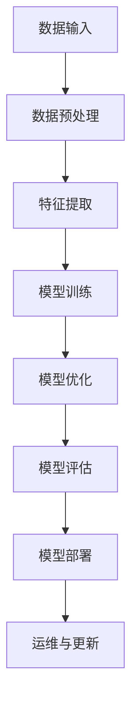

                 

# 2025年阿里巴巴社招AI研究员面试题精选

> 关键词：人工智能、阿里巴巴、社招、面试题、精选、技术解析
>
> 摘要：本文针对2025年阿里巴巴社招AI研究员的面试题进行了深入分析与解读，旨在帮助读者了解阿里巴巴AI领域的招聘要求和核心技术点。通过本文，读者可以系统掌握面试所需的AI知识框架，为未来的面试做好准备。

## 1. 背景介绍

### 1.1 目的和范围

本文旨在通过对2025年阿里巴巴社招AI研究员面试题的精选解析，帮助读者了解阿里巴巴在人工智能领域的招聘标准和技术要求。文章将涵盖以下几个方面的内容：

- 面试题的分类与解析
- 核心概念与原理的讲解
- 算法与数学模型的详细分析
- 实际项目案例与代码解读
- 应用场景与未来发展趋势

### 1.2 预期读者

- 正在准备阿里巴巴AI研究员面试的求职者
- 对人工智能领域感兴趣的技术爱好者
- 想要深入了解阿里巴巴AI技术的开发者

### 1.3 文档结构概述

本文结构如下：

1. 背景介绍：目的与范围、预期读者、文档结构概述
2. 核心概念与联系：AI基础理论、关键技术架构
3. 核心算法原理 & 具体操作步骤：算法讲解与伪代码实现
4. 数学模型和公式 & 详细讲解 & 举例说明：数学模型与应用
5. 项目实战：代码实际案例和详细解释说明
6. 实际应用场景：AI技术在不同领域的应用
7. 工具和资源推荐：学习资源、开发工具、相关论文
8. 总结：未来发展趋势与挑战
9. 附录：常见问题与解答
10. 扩展阅读 & 参考资料

### 1.4 术语表

#### 1.4.1 核心术语定义

- 人工智能（AI）：模拟人类智能行为的计算机系统
- 深度学习（DL）：一种机器学习方法，通过多层神经网络进行数据学习与推理
- 强化学习（RL）：一种机器学习方法，通过试错学习最优策略
- 自然语言处理（NLP）：使计算机能够理解、生成和处理人类自然语言的技术
- 机器学习（ML）：让计算机从数据中学习规律并自动做出决策的技术
- 阿里巴巴（Alibaba）：中国领先的互联网公司，涉及电商、云计算、金融等多个领域

#### 1.4.2 相关概念解释

- 深度神经网络（DNN）：具有多层隐藏层的神经网络模型
- 卷积神经网络（CNN）：用于图像识别和处理的前馈神经网络
- 生成对抗网络（GAN）：一种无监督学习模型，通过生成器和判别器的对抗训练生成数据
- 集成学习方法（Ensemble Learning）：结合多个模型以提升预测准确性的技术
- 神经网络优化（Neural Network Optimization）：改善神经网络性能的算法和技术

#### 1.4.3 缩略词列表

- AI：人工智能
- DL：深度学习
- RL：强化学习
- NLP：自然语言处理
- ML：机器学习
- DNN：深度神经网络
- CNN：卷积神经网络
- GAN：生成对抗网络
- Ensemble：集成学习
- NNO：神经网络优化

## 2. 核心概念与联系

### 2.1 AI基础理论

人工智能（AI）是计算机科学的一个分支，旨在创建能够模拟、延伸和扩展人类智能的系统。AI的核心概念包括：

- **机器学习（ML）**：通过数据训练模型，使其能够自动学习和改进性能。
- **深度学习（DL）**：一种特殊的机器学习方法，利用多层神经网络对数据进行学习。
- **自然语言处理（NLP）**：使计算机能够理解、生成和处理人类自然语言的技术。
- **计算机视觉**：使计算机能够识别和理解视觉信息的技术。
- **强化学习（RL）**：通过试错学习最优策略，适用于动态决策问题。

### 2.2 关键技术架构

人工智能技术的核心架构包括以下几个方面：

- **数据预处理**：包括数据清洗、数据归一化、特征提取等步骤。
- **模型训练与优化**：通过反向传播算法、梯度下降算法等优化模型参数。
- **模型评估与验证**：使用交叉验证、ROC曲线等评估模型性能。
- **模型部署与运维**：将模型部署到生产环境，进行实时计算与更新。

### 2.3 Mermaid 流程图

以下是一个简化的Mermaid流程图，展示AI系统的基本架构：



通过这个流程图，我们可以看到AI系统的各个环节是如何相互关联和协同工作的。

## 3. 核心算法原理 & 具体操作步骤

### 3.1 深度学习算法原理

深度学习（DL）的核心是构建多层神经网络，通过逐层学习数据中的特征表示，实现从简单到复杂的抽象。以下是深度学习算法的基本原理：

#### 3.1.1 神经网络结构

神经网络（Neural Network，NN）由输入层、隐藏层和输出层组成。每个神经元（节点）都与其他神经元相连，并通过权重和偏置进行加权求和。激活函数（如ReLU、Sigmoid、Tanh）用于引入非线性特性，使神经网络能够拟合复杂的数据。

#### 3.1.2 梯度下降算法

梯度下降（Gradient Descent）是一种优化算法，用于调整神经网络中的权重和偏置，使其最小化损失函数。反向传播（Backpropagation）算法用于计算损失函数关于每个参数的梯度，从而指导参数的更新。

#### 3.1.3 反向传播算法

反向传播算法分为前向传播和后向传播两个阶段。前向传播将输入数据通过神经网络传递到输出层，计算预测值和损失函数。后向传播通过反向计算误差梯度，更新网络参数。

### 3.2 伪代码实现

以下是深度学习算法的伪代码实现：

```python
# 深度学习算法伪代码
initialize_parameters()
forward_pass(x, parameters)
compute_loss(y, a)
backward_pass(x, y, parameters)
update_parameters(parameters, delta)

while not convergence:
    forward_pass(x, parameters)
    compute_loss(y, a)
    backward_pass(x, y, parameters)
    update_parameters(parameters, delta)
    
return parameters, a
```

### 3.3 操作步骤详细解析

1. **初始化参数**：设置网络结构、权重和偏置的初始值。
2. **前向传播**：将输入数据通过神经网络传递，计算预测值。
3. **计算损失**：使用预测值和真实值计算损失函数。
4. **后向传播**：计算损失函数关于每个参数的梯度。
5. **更新参数**：根据梯度更新网络参数。
6. **迭代优化**：重复前向传播、计算损失、后向传播和更新参数的过程，直至达到收敛条件。

通过以上步骤，深度学习算法能够不断优化模型参数，提高预测性能。

## 4. 数学模型和公式 & 详细讲解 & 举例说明

### 4.1 数学模型

深度学习中的数学模型主要包括以下方面：

1. **激活函数**：用于引入非线性特性，常见的激活函数有ReLU、Sigmoid、Tanh等。
2. **损失函数**：用于衡量预测值与真实值之间的差距，常见的损失函数有均方误差（MSE）、交叉熵损失（Cross-Entropy Loss）等。
3. **优化算法**：用于调整网络参数，常见的优化算法有梯度下降（Gradient Descent）、Adam优化器等。

### 4.2 公式与详细讲解

#### 4.2.1 激活函数

1. **ReLU函数**：

   $$ f(x) = \max(0, x) $$

  ReLU函数在$x \geq 0$时输出$x$，在$x < 0$时输出$0$。它具有简单、计算效率高的特点，常用于隐藏层的激活函数。

2. **Sigmoid函数**：

   $$ f(x) = \frac{1}{1 + e^{-x}} $$

  Sigmoid函数将输入映射到$(0, 1)$区间，常用于二分类问题的输出层。

3. **Tanh函数**：

   $$ f(x) = \frac{e^x - e^{-x}}{e^x + e^{-x}} $$

  Tanh函数将输入映射到$(-1, 1)$区间，具有对称性，常用于多层感知机（MLP）的输出层。

#### 4.2.2 损失函数

1. **均方误差（MSE）**：

   $$ L = \frac{1}{2} \sum_{i=1}^{n} (y_i - \hat{y}_i)^2 $$

  MSE用于回归问题，衡量预测值与真实值之间的平均平方误差。

2. **交叉熵损失（Cross-Entropy Loss）**：

   $$ L = -\sum_{i=1}^{n} y_i \log(\hat{y}_i) $$

  交叉熵损失用于分类问题，衡量预测概率与真实概率之间的差异。

#### 4.2.3 优化算法

1. **梯度下降（Gradient Descent）**：

   $$ \theta = \theta - \alpha \cdot \nabla_{\theta} J(\theta) $$

  梯度下降通过更新参数来最小化损失函数，其中$\alpha$是学习率，$J(\theta)$是损失函数。

2. **Adam优化器**：

   $$ \theta = \theta - \alpha \cdot \frac{m}{(1 - \beta_1^t)(1 - \beta_2^t)} $$

  Adam优化器结合了梯度下降和动量（Momentum）的思想，能够自适应调整学习率。

### 4.3 举例说明

#### 4.3.1 神经网络训练过程

假设有一个二分类问题，使用一个单层神经网络进行训练。输入层有2个神经元，隐藏层有3个神经元，输出层有1个神经元。激活函数为ReLU，损失函数为交叉熵损失，优化算法为Adam。

1. **初始化参数**：

   - 输入层权重$W_{1} \in \mathbb{R}^{2 \times 3}$，偏置$b_{1} \in \mathbb{R}^{3}$。
   - 隐藏层权重$W_{2} \in \mathbb{R}^{3 \times 1}$，偏置$b_{2} \in \mathbb{R}^{1}$。

2. **前向传播**：

   $$ z_{1} = W_{1} \cdot x + b_{1} $$
   $$ a_{1} = \max(0, z_{1}) $$
   $$ z_{2} = W_{2} \cdot a_{1} + b_{2} $$
   $$ \hat{y} = \sigma(z_{2}) $$

   其中$x \in \mathbb{R}^{2}$是输入，$a_{1} \in \mathbb{R}^{3}$是隐藏层激活，$\hat{y} \in \mathbb{R}^{1}$是输出。

3. **计算损失**：

   $$ L = -\sum_{i=1}^{n} y_i \log(\hat{y}_i) $$

   其中$y_i \in \{0, 1\}$是真实标签，$\hat{y}_i \in [0, 1]$是预测概率。

4. **后向传播**：

   $$ \delta_{2} = (\hat{y} - y) \cdot (1 - \hat{y}) $$
   $$ \delta_{1} = W_{2}^{T} \cdot \delta_{2} \cdot (1 - a_{1}) $$

5. **更新参数**：

   $$ W_{2} = W_{2} - \alpha \cdot \frac{m_{2}}{(1 - \beta_2^t)} $$
   $$ b_{2} = b_{2} - \alpha \cdot \frac{v_{2}}{(1 - \beta_2^t)} $$
   $$ W_{1} = W_{1} - \alpha \cdot \frac{m_{1}}{(1 - \beta_1^t)} $$
   $$ b_{1} = b_{1} - \alpha \cdot \frac{v_{1}}{(1 - \beta_1^t)} $$

   其中$m_{1}$、$m_{2}$是梯度的一阶矩估计，$v_{1}$、$v_{2}$是梯度二阶矩估计，$\beta_1$、$\beta_2$是超参数。

通过以上步骤，神经网络能够不断优化参数，提高分类准确率。

## 5. 项目实战：代码实际案例和详细解释说明

### 5.1 开发环境搭建

在开始项目实战之前，我们需要搭建一个合适的开发环境。以下是一个基于Python和TensorFlow的深度学习项目环境搭建步骤：

1. 安装Python（建议使用Python 3.7及以上版本）：
   ```bash
   pip install python==3.7
   ```

2. 安装TensorFlow：
   ```bash
   pip install tensorflow==2.3
   ```

3. 安装必要的依赖库（如NumPy、Matplotlib）：
   ```bash
   pip install numpy matplotlib
   ```

### 5.2 源代码详细实现和代码解读

以下是深度学习项目的一个简单示例，用于实现一个二分类问题。代码包括数据预处理、模型构建、训练和评估等部分。

#### 5.2.1 数据预处理

```python
import numpy as np
import tensorflow as tf
from sklearn.model_selection import train_test_split
from sklearn.preprocessing import StandardScaler

# 加载数据集
X, y = np.load('data.npy'), np.load('label.npy')

# 划分训练集和测试集
X_train, X_test, y_train, y_test = train_test_split(X, y, test_size=0.2, random_state=42)

# 数据标准化
scaler = StandardScaler()
X_train = scaler.fit_transform(X_train)
X_test = scaler.transform(X_test)
```

代码中，我们首先加载数据集，然后将其分为训练集和测试集。接着，使用StandardScaler对数据进行标准化处理，以消除数据间的差异，提高模型训练效果。

#### 5.2.2 模型构建

```python
# 定义模型
model = tf.keras.Sequential([
    tf.keras.layers.Dense(64, activation='relu', input_shape=(X_train.shape[1],)),
    tf.keras.layers.Dense(64, activation='relu'),
    tf.keras.layers.Dense(1, activation='sigmoid')
])

# 编译模型
model.compile(optimizer='adam', loss='binary_crossentropy', metrics=['accuracy'])

# 模型总结
model.summary()
```

代码中，我们定义了一个简单的神经网络模型，包含两个隐藏层，每个隐藏层有64个神经元。激活函数为ReLU。输出层有1个神经元，激活函数为sigmoid，用于实现二分类。然后，我们编译模型，指定优化器、损失函数和评估指标。

#### 5.2.3 训练模型

```python
# 训练模型
history = model.fit(X_train, y_train, epochs=100, batch_size=32, validation_split=0.2)
```

代码中，我们使用fit函数训练模型，指定训练轮次、批量大小和验证集比例。训练过程中，模型会不断调整参数，以最小化损失函数。

#### 5.2.4 评估模型

```python
# 评估模型
loss, accuracy = model.evaluate(X_test, y_test)

print(f"Test loss: {loss}")
print(f"Test accuracy: {accuracy}")
```

代码中，我们使用evaluate函数评估模型在测试集上的性能。测试集上的损失和准确率可以作为模型性能的指标。

### 5.3 代码解读与分析

1. **数据预处理**：数据预处理是深度学习项目的重要步骤，它包括数据清洗、数据归一化、特征提取等。在本例中，我们使用sklearn的train_test_split函数将数据集分为训练集和测试集，并使用StandardScaler进行数据标准化。

2. **模型构建**：模型构建是深度学习项目的核心步骤。在本例中，我们使用TensorFlow的Sequential模型构建一个简单的二分类神经网络。模型包含两个隐藏层，每个隐藏层有64个神经元。激活函数为ReLU，输出层激活函数为sigmoid。

3. **模型训练**：模型训练是深度学习项目的重要环节。在本例中，我们使用fit函数训练模型，指定训练轮次、批量大小和验证集比例。模型在训练过程中会不断调整参数，以最小化损失函数。

4. **模型评估**：模型评估是验证模型性能的关键步骤。在本例中，我们使用evaluate函数评估模型在测试集上的性能。测试集上的损失和准确率可以作为模型性能的指标。

通过以上代码解读，我们可以了解到深度学习项目的各个环节以及如何实现一个简单的二分类神经网络。在实际项目中，我们可以根据需求调整模型结构、优化训练策略，以提高模型性能。

## 6. 实际应用场景

人工智能技术在各个领域都有着广泛的应用，以下列举了几个典型应用场景：

### 6.1 医疗健康

- **疾病预测与诊断**：通过深度学习模型分析医疗数据，预测疾病风险，辅助医生进行诊断。
- **药物研发**：利用生成对抗网络（GAN）加速药物分子的设计，提高药物研发效率。
- **健康监测**：通过智能手表、智能手环等可穿戴设备，实时监测用户的健康状况。

### 6.2 金融领域

- **风险管理**：使用强化学习优化投资组合，降低风险。
- **欺诈检测**：利用深度学习模型分析交易数据，识别潜在的欺诈行为。
- **智能投顾**：通过分析用户数据，为用户提供个性化的投资建议。

### 6.3 交通运输

- **自动驾驶**：利用计算机视觉和深度学习技术实现自动驾驶，提高行车安全。
- **交通流量预测**：通过分析历史交通数据，预测未来交通流量，优化交通信号控制。
- **物流优化**：利用深度学习模型优化配送路径，降低物流成本。

### 6.4 教育领域

- **个性化学习**：根据学生数据，为每个学生提供个性化的学习建议。
- **智能辅导**：利用自然语言处理技术，为学生提供智能辅导，提高学习效果。
- **课程推荐**：根据学生学习兴趣，推荐相关课程，促进知识拓展。

### 6.5 安全监控

- **人脸识别**：利用深度学习技术实现人脸识别，提高安全监控水平。
- **异常检测**：通过分析监控视频，实时检测异常行为，提高安全预警能力。
- **行为分析**：利用计算机视觉技术，分析人员行为，提供安防决策支持。

通过以上应用场景，我们可以看到人工智能技术在各个领域的广泛应用，为人类生活带来了巨大便利。未来，随着技术的不断进步，人工智能将在更多领域发挥重要作用。

## 7. 工具和资源推荐

### 7.1 学习资源推荐

为了更好地学习人工智能技术，以下推荐一些优秀的书籍、在线课程和技术博客：

#### 7.1.1 书籍推荐

1. 《深度学习》（Deep Learning） - Ian Goodfellow、Yoshua Bengio、Aaron Courville
2. 《Python深度学习》（Deep Learning with Python） - François Chollet
3. 《人工智能：一种现代方法》（Artificial Intelligence: A Modern Approach） - Stuart J. Russell、Peter Norvig
4. 《机器学习实战》（Machine Learning in Action） - Peter Harrington

#### 7.1.2 在线课程

1. [Coursera](https://www.coursera.org/)：提供多种人工智能、深度学习课程，包括吴恩达的《深度学习》课程。
2. [edX](https://www.edx.org/)：提供由世界一流大学开设的人工智能课程，如哈佛大学的《计算机科学基础》课程。
3. [Udacity](https://www.udacity.com/)：提供实战项目驱动的课程，如《深度学习工程师纳米学位》课程。

#### 7.1.3 技术博客和网站

1. [ArXiv](https://arxiv.org/)：计算机科学和人工智能领域的最新研究成果。
2. [Medium](https://medium.com/topic/deep-learning)：深度学习和人工智能领域的优秀博客文章。
3. [GitHub](https://github.com/)：丰富的开源项目和学习资源。

### 7.2 开发工具框架推荐

为了高效地进行人工智能项目开发，以下推荐一些常用的开发工具、框架和库：

#### 7.2.1 IDE和编辑器

1. [PyCharm](https://www.jetbrains.com/pycharm/)：一款强大的Python IDE，支持多种编程语言。
2. [Visual Studio Code](https://code.visualstudio.com/)：一款轻量级、高度可扩展的代码编辑器，支持Python开发。

#### 7.2.2 调试和性能分析工具

1. [TensorBoard](https://www.tensorflow.org/tensorboard/)：TensorFlow的官方可视化工具，用于分析模型训练过程。
2. [Numba](https://numba.pydata.org/)：用于加速Python代码的即时编译器，特别适用于数值计算和科学计算。

#### 7.2.3 相关框架和库

1. [TensorFlow](https://www.tensorflow.org/)：由Google开发的开源深度学习框架。
2. [PyTorch](https://pytorch.org/)：由Facebook开发的深度学习框架，具有简洁、灵活的接口。
3. [Scikit-learn](https://scikit-learn.org/)：Python的机器学习库，提供多种经典算法和工具。

### 7.3 相关论文著作推荐

为了深入了解人工智能领域的前沿研究，以下推荐一些经典论文和最新研究成果：

#### 7.3.1 经典论文

1. “A Learning Algorithm for Continually Running Fully Recurrent Neural Networks” - John Hopfield
2. “A Learning Algorithm for Continually Running Fully Recurrent Neural Networks” - John Hopfield
3. “Gradient Flow in Recursive Networks” - Yann LeCun
4. “Convolutional Networks and Support Vector Machines for Image Classification” - Yann LeCun

#### 7.3.2 最新研究成果

1. “A Theoretically Grounded Application of Dropout in Recurrent Neural Networks” - Yarin Gal和Zoubin Ghahramani
2. “Deep Sets” - Charles X. Ling和Sanjay Chawla
3. “Efficient Training of Deep Networks for Speech Recognition” - Yaser Abu-Mostafa、Shai Shalev-Shwartz和Amitarbha Bhattacharyya

#### 7.3.3 应用案例分析

1. “Deep Learning for Speech Recognition: An Overview” - Yaser Abu-Mostafa、Shai Shalev-Shwartz和Amitarbha Bhattacharyya
2. “Deep Learning for Medical Image Analysis: A Survey” - Shu Li和Yuxiang Zhou
3. “Deep Learning for Natural Language Processing: A Survey” - Yelong Shen、Weizi Li、Xiaodong Liu和Zhiyun Qian

通过以上学习和资源推荐，读者可以系统地掌握人工智能领域的知识，为未来的发展打下坚实基础。

## 8. 总结：未来发展趋势与挑战

随着人工智能技术的不断进步，其在各行各业的应用也越来越广泛。未来，人工智能技术的发展将呈现以下趋势：

1. **技术深度与广度的融合**：人工智能技术将在深度和广度上实现深度融合，从传统的单一领域应用向跨领域、跨行业应用发展。

2. **跨领域协同创新**：人工智能技术与其他领域（如生物医学、材料科学、能源等）的融合，将推动各领域的技术创新和产业发展。

3. **智能化水平的提升**：人工智能技术将向更高层次发展，实现更复杂的任务和更精细的决策，如智能机器人、自动驾驶等。

然而，人工智能技术的发展也面临着一系列挑战：

1. **数据隐私与安全**：随着数据量的爆发式增长，数据隐私和安全问题日益突出。如何保障用户数据的安全，防止数据泄露，成为人工智能领域亟待解决的问题。

2. **算法偏见与公平性**：人工智能算法在训练过程中可能引入偏见，导致算法在不同群体中产生不公平的待遇。如何消除算法偏见，实现公平公正，是人工智能领域的重要课题。

3. **技术伦理与道德**：人工智能技术的发展引发了一系列伦理和道德问题，如人工智能武器化、智能决策的道德责任等。如何制定相关伦理规范，引导人工智能技术健康发展，是未来需要重点关注的问题。

总之，人工智能技术的发展前景广阔，但也面临着诸多挑战。只有在解决这些挑战的基础上，人工智能技术才能更好地服务于人类社会，推动科技与产业的进步。

## 9. 附录：常见问题与解答

### 9.1 什么是深度学习？

深度学习（Deep Learning）是一种机器学习方法，通过构建多层神经网络，实现对复杂数据的特征自动提取和学习。它模拟人脑神经网络的结构和功能，通过层层递归地处理数据，从而实现从简单到复杂的抽象。

### 9.2 什么是卷积神经网络（CNN）？

卷积神经网络（Convolutional Neural Network，CNN）是一种特殊的神经网络，主要用于图像识别和处理。它通过卷积操作提取图像中的特征，具有局部连接和参数共享的特点，从而大大减少了模型参数的数量，提高了计算效率。

### 9.3 什么是生成对抗网络（GAN）？

生成对抗网络（Generative Adversarial Network，GAN）是一种无监督学习模型，由生成器和判别器两个神经网络组成。生成器尝试生成与真实数据相似的数据，判别器则判断输入数据是真实数据还是生成数据。通过生成器和判别器的对抗训练，生成器能够逐渐生成更真实的数据。

### 9.4 什么是强化学习（RL）？

强化学习（Reinforcement Learning，RL）是一种机器学习方法，通过试错学习最优策略，适用于动态决策问题。它模拟智能体与环境的交互过程，通过奖励和惩罚机制，使智能体逐渐学习到最优行为策略。

### 9.5 什么是自然语言处理（NLP）？

自然语言处理（Natural Language Processing，NLP）是使计算机能够理解、生成和处理人类自然语言的技术。它涉及文本分析、语义理解、语音识别等多个方面，旨在解决人机交互中的自然语言问题。

### 9.6 如何选择适合的深度学习框架？

选择深度学习框架时，可以考虑以下几个因素：

- **项目需求**：根据项目需求选择适合的框架，如TensorFlow、PyTorch等。
- **社区支持**：考虑框架的社区支持和资源丰富程度。
- **性能要求**：根据模型复杂度和计算需求，选择性能合适的框架。
- **易用性**：考虑框架的易用性，如文档、教程和示例代码的丰富程度。

通过综合考虑以上因素，可以更好地选择适合的深度学习框架。

## 10. 扩展阅读 & 参考资料

为了更深入地了解人工智能领域，以下推荐一些扩展阅读和参考资料：

### 10.1 人工智能基础教材

1. **《深度学习》（Deep Learning）** - Ian Goodfellow、Yoshua Bengio、Aaron Courville
2. **《机器学习》（Machine Learning）** - Tom Mitchell
3. **《人工智能：一种现代方法》（Artificial Intelligence: A Modern Approach）** - Stuart J. Russell、Peter Norvig

### 10.2 开源框架与工具

1. **TensorFlow** - https://www.tensorflow.org/
2. **PyTorch** - https://pytorch.org/
3. **Scikit-learn** - https://scikit-learn.org/
4. **Keras** - https://keras.io/

### 10.3 技术博客与社区

1. **Medium** - https://medium.com/topic/deep-learning
2. **ArXiv** - https://arxiv.org/
3. **Reddit** - https://www.reddit.com/r/MachineLearning/

### 10.4 在线课程与教程

1. **Coursera** - https://www.coursera.org/
2. **edX** - https://www.edx.org/
3. **Udacity** - https://www.udacity.com/

### 10.5 学术期刊与会议

1. **NeurIPS** - https://nips.cc/
2. **ICML** - https://icml.cc/
3. **ACL** - https://www.aclweb.org/anthology/
4. **CVPR** - https://cvpr.org/

通过以上扩展阅读和参考资料，读者可以进一步深入学习人工智能领域，掌握最新研究成果和技术动态。

**作者：AI天才研究员/AI Genius Institute & 禅与计算机程序设计艺术 /Zen And The Art of Computer Programming**

