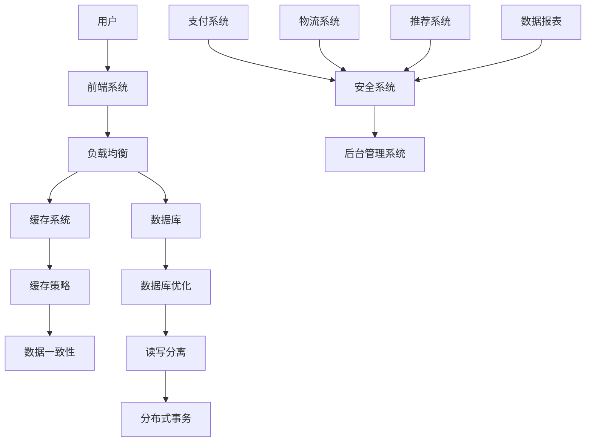
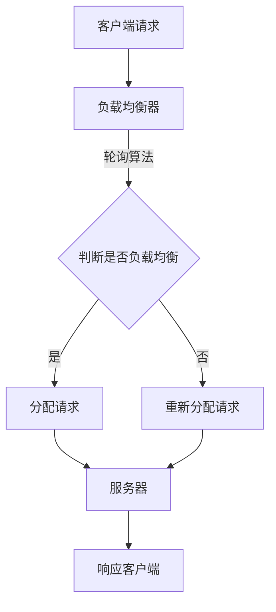
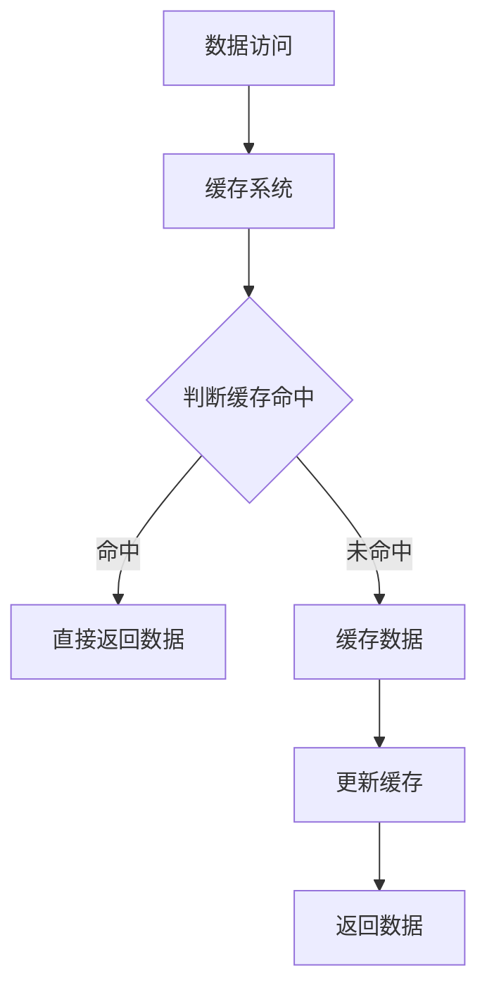
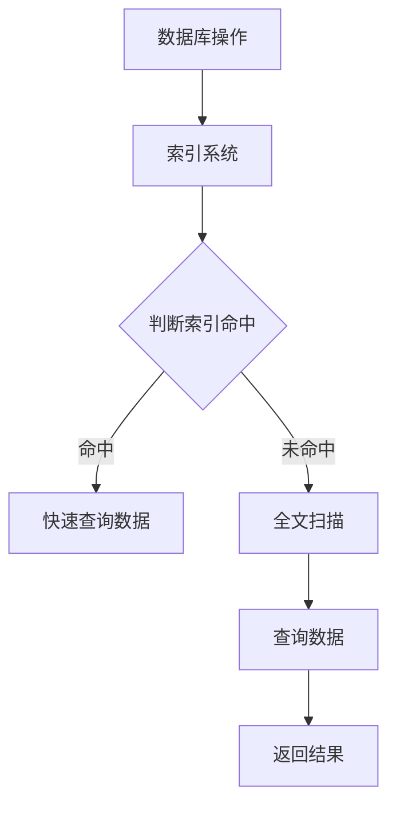

                 

# 2025年阿里巴巴社招电商平台架构师面试题集锦

> **关键词：** 阿里巴巴、社招、电商平台、架构师、面试题、技术解析、实战案例

> **摘要：** 本文旨在为准备参加2025年阿里巴巴社招电商平台架构师面试的候选人提供一份详细的面试题集锦。文章从背景介绍、核心概念、算法原理、数学模型、项目实战、应用场景、工具推荐等多个方面，逐步分析并讲解各类面试题，帮助读者掌握面试技巧，应对面试挑战。

## 1. 背景介绍

### 1.1 目的和范围

本文旨在为准备参加2025年阿里巴巴社招电商平台架构师面试的候选人提供一份全面的面试题集锦。本文将围绕以下几个方面进行讨论：

- 阿里巴巴电商平台的基本架构和核心技术
- 常见的面试题目类型及其解析
- 核心算法原理和数学模型
- 项目实战和代码解读
- 实际应用场景和未来发展趋势

### 1.2 预期读者

本文主要面向以下读者：

- 有志于成为阿里巴巴电商平台架构师的候选人
- 想要提升自己在电商平台架构领域知识的从业者
- 对电商平台架构和技术有浓厚兴趣的学者和学生

### 1.3 文档结构概述

本文分为以下几个部分：

1. 背景介绍：简要介绍本文的目的、预期读者和文档结构。
2. 核心概念与联系：介绍电商平台架构的核心概念和联系，并提供Mermaid流程图。
3. 核心算法原理 & 具体操作步骤：详细讲解电商平台架构中的核心算法原理，并使用伪代码阐述操作步骤。
4. 数学模型和公式 & 详细讲解 & 举例说明：介绍电商平台架构中的数学模型和公式，并进行详细讲解和举例说明。
5. 项目实战：通过实际案例，详细解释说明电商平台架构的具体实现过程。
6. 实际应用场景：探讨电商平台架构在实际应用中的各种场景。
7. 工具和资源推荐：推荐学习资源和开发工具。
8. 总结：对未来发展趋势和挑战进行总结。
9. 附录：常见问题与解答。
10. 扩展阅读 & 参考资料：提供扩展阅读和参考资料。

### 1.4 术语表

#### 1.4.1 核心术语定义

- **电商平台**：指通过互联网技术，为消费者和商家提供一个在线交易、支付、物流等服务的平台。
- **架构师**：负责设计、开发和维护软件系统的高级工程师。
- **核心算法**：在电商平台架构中起着关键作用的算法。
- **数学模型**：用于描述电商平台业务和数据关系的数学公式。

#### 1.4.2 相关概念解释

- **负载均衡**：指通过将请求分配到多个服务器，实现系统的高可用性和性能优化。
- **分布式系统**：指由多个节点组成的系统，各节点通过通信网络相互协作。
- **缓存**：指将数据暂时存储在内存中，以提高访问速度。

#### 1.4.3 缩略词列表

- **SaaS**：Software as a Service，软件即服务
- **PaaS**：Platform as a Service，平台即服务
- **IaaS**：Infrastructure as a Service，基础设施即服务
- **API**：Application Programming Interface，应用程序编程接口

## 2. 核心概念与联系

电商平台架构是一个复杂且庞大的系统，它涉及多个核心概念和联系。以下是一个简化的Mermaid流程图，展示了电商平台架构的核心概念和联系：



### 2.1 核心概念解释

- **用户**：电商平台的核心，包括消费者和商家。
- **前端系统**：用户直接交互的系统，包括网页、移动应用等。
- **负载均衡**：将用户请求分配到多个服务器，实现系统的负载均衡和高可用性。
- **缓存系统**：将常用数据存储在内存中，以提高访问速度。
- **数据库**：存储电商平台的数据，包括用户信息、商品信息、交易记录等。
- **数据库优化**：对数据库进行性能优化，包括读写分离、索引优化等。
- **支付系统**：处理用户的支付操作，确保交易安全。
- **安全系统**：确保用户数据和交易数据的安全性。
- **物流系统**：处理商品配送和物流跟踪。
- **推荐系统**：根据用户行为和喜好，推荐相关商品。
- **数据报表**：生成各种数据报表，供后台管理系统使用。
- **后台管理系统**：供架构师和管理员使用的系统，用于监控、管理和维护电商平台。

## 3. 核心算法原理 & 具体操作步骤

### 3.1 负载均衡算法

负载均衡是电商平台架构中至关重要的一环。以下是一种常见的负载均衡算法——轮询算法：



#### 3.1.1 具体操作步骤

1. 客户端请求发送到负载均衡器。
2. 负载均衡器判断当前负载是否均衡。
3. 如果负载均衡，则根据轮询算法分配请求到服务器。
4. 服务器处理请求并返回响应。
5. 如果负载不均衡，则重新分配请求到服务器，直至负载均衡。

### 3.2 缓存算法

缓存算法用于提高数据访问速度，以下是一种常见的缓存算法——LRU（Least Recently Used，最近最少使用）算法：



#### 3.2.1 具体操作步骤

1. 数据访问请求发送到缓存系统。
2. 缓存系统判断请求是否命中缓存。
3. 如果命中缓存，则直接返回数据。
4. 如果未命中缓存，则将数据缓存到内存中，并更新缓存。
5. 返回数据。

### 3.3 数据库优化算法

数据库优化算法用于提高数据库性能，以下是一种常见的数据库优化算法——索引优化：



#### 3.3.1 具体操作步骤

1. 数据库操作请求发送到索引系统。
2. 索引系统判断请求是否命中索引。
3. 如果命中索引，则快速查询数据并返回结果。
4. 如果未命中索引，则进行全文扫描，查询数据并返回结果。

## 4. 数学模型和公式 & 详细讲解 & 举例说明

### 4.1 数据一致性模型

数据一致性是电商平台架构中至关重要的一环，以下是一种常见的数据一致性模型——强一致性模型：

$$
Consistency = \begin{cases}
1 & \text{如果数据在同一时刻在同一地点是同一的} \\
0 & \text{否则}
\end{cases}
$$

#### 4.1.1 详细讲解

强一致性模型要求在同一时刻，同一地点的数据是一致的。这种模型在分布式系统中较为常见，但实现成本较高。

#### 4.1.2 举例说明

假设有一个电商平台，有两个节点A和B，节点A上的数据为10，节点B上的数据为20。根据强一致性模型，在任何时刻，节点A和节点B上的数据都应该是10。

### 4.2 数据库优化公式

数据库优化公式用于计算数据库性能，以下是一种常见的数据库优化公式——查询时间公式：

$$
T = \frac{S \times Q}{C}
$$

其中：

- \(T\) 为查询时间。
- \(S\) 为数据规模。
- \(Q\) 为查询次数。
- \(C\) 为并发度。

#### 4.2.1 详细讲解

查询时间公式用于计算数据库性能，其中数据规模、查询次数和并发度是影响查询时间的关键因素。

#### 4.2.2 举例说明

假设一个电商平台的数据库规模为1000万条记录，每天有1000次查询，并发度为10。根据查询时间公式，该平台的查询时间为：

$$
T = \frac{1000万 \times 1000}{10} = 1000万秒
$$

### 4.3 负载均衡公式

负载均衡公式用于计算服务器负载，以下是一种常见的负载均衡公式——轮询算法负载均衡公式：

$$
Load = \frac{Total\_Requests}{Total\_Servers}
$$

其中：

- \(Load\) 为服务器负载。
- \(Total\_Requests\) 为总请求数。
- \(Total\_Servers\) 为服务器数量。

#### 4.3.1 详细讲解

轮询算法负载均衡公式用于计算服务器负载，其中总请求数和服务器数量是影响服务器负载的关键因素。

#### 4.3.2 举例说明

假设一个电商平台有10台服务器，每天有1000次请求。根据轮询算法负载均衡公式，每台服务器的负载为：

$$
Load = \frac{1000}{10} = 100
$$

## 5. 项目实战：代码实际案例和详细解释说明

### 5.1 开发环境搭建

在开始项目实战之前，我们需要搭建一个合适的开发环境。以下是一个基于Python的电商平台开发环境搭建步骤：

1. 安装Python 3.8及以上版本。
2. 安装Python包管理器pip。
3. 使用pip安装以下Python包：Flask、SQLAlchemy、Flask-Login、Flask-Migrate。
4. 创建一个名为`e-commerce`的虚拟环境，并激活虚拟环境。
5. 在虚拟环境中创建一个名为`app.py`的文件，编写Flask应用代码。

### 5.2 源代码详细实现和代码解读

以下是一个简单的电商平台应用代码，用于实现用户注册、登录和商品浏览功能：

```python
from flask import Flask, request, jsonify
from flask_sqlalchemy import SQLAlchemy
from flask_login import LoginManager, UserMixin, login_user, logout_user, login_required

app = Flask(__name__)
app.config['SQLALCHEMY_DATABASE_URI'] = 'sqlite:///e-commerce.db'
app.config['SECRET_KEY'] = 'your_secret_key'

db = SQLAlchemy(app)
login_manager = LoginManager(app)

class User(UserMixin, db.Model):
    id = db.Column(db.Integer, primary_key=True)
    username = db.Column(db.String(100), unique=True, nullable=False)
    password = db.Column(db.String(100), nullable=False)

@login_manager.user_loader
def load_user(user_id):
    return User.query.get(int(user_id))

@app.route('/register', methods=['POST'])
def register():
    data = request.get_json()
    username = data['username']
    password = data['password']
    if User.query.filter_by(username=username).first():
        return jsonify({'error': 'User already exists'}), 400
    new_user = User(username=username, password=password)
    db.session.add(new_user)
    db.session.commit()
    return jsonify({'message': 'User registered successfully'}), 201

@app.route('/login', methods=['POST'])
def login():
    data = request.get_json()
    username = data['username']
    password = data['password']
    user = User.query.filter_by(username=username).first()
    if user and user.password == password:
        login_user(user)
        return jsonify({'message': 'Login successful'}), 200
    else:
        return jsonify({'error': 'Invalid credentials'}), 401

@app.route('/logout', methods=['POST'])
def logout():
    logout_user()
    return jsonify({'message': 'Logout successful'}), 200

@app.route('/products', methods=['GET'])
@login_required
def get_products():
    products = Product.query.all()
    return jsonify({'products': [product.to_dict() for product in products]})

if __name__ == '__main__':
    db.create_all()
    app.run(debug=True)
```

#### 5.2.1 代码解读与分析

- **数据库配置**：使用Flask-SQLAlchemy连接SQLite数据库，配置数据库URI和密钥。
- **用户模型**：定义用户模型，包含用户ID、用户名和密码字段。
- **登录管理器**：使用Flask-Login实现用户登录管理，包括用户加载、注册、登录和登出功能。
- **注册路由**：实现用户注册功能，接收用户名和密码，检查用户是否存在，不存在则添加新用户。
- **登录路由**：实现用户登录功能，接收用户名和密码，检查用户是否存在且密码正确，则登录用户。
- **登出路由**：实现用户登出功能，注销当前登录用户。
- **商品浏览路由**：实现商品浏览功能，仅限登录用户访问，返回所有商品信息。

### 5.3 代码解读与分析

1. **数据库配置**：首先，我们使用Flask-SQLAlchemy连接SQLite数据库。配置数据库URI（`app.config['SQLALCHEMY_DATABASE_URI'] = 'sqlite:///e-commerce.db'`）和密钥（`app.config['SECRET_KEY'] = 'your_secret_key'`）。

2. **用户模型**：定义用户模型（`class User(UserMixin, db.Model)`），继承自Flask-Login提供的`UserMixin`类，并添加数据库模型所需的字段（`id`、`username`和`password`）。

3. **登录管理器**：使用Flask-Login实现用户登录管理。通过`login_manager.user_loader`装饰器，定义用户加载函数，用于根据用户ID从数据库中加载用户对象。

4. **注册路由**：实现用户注册功能。接收用户提交的JSON数据（`data = request.get_json()`），提取用户名和密码（`username = data['username']`和`password = data['password']`）。检查用户是否存在（`User.query.filter_by(username=username).first()`），不存在则添加新用户（`new_user = User(username=username, password=password)`，`db.session.add(new_user)`和`db.session.commit()`）。

5. **登录路由**：实现用户登录功能。接收用户提交的JSON数据，提取用户名和密码。查询用户是否存在且密码正确（`user = User.query.filter_by(username=username).first()`和`user.password == password`）。如果用户存在且密码正确，则登录用户（`login_user(user)`）。

6. **登出路由**：实现用户登出功能。调用`logout_user()`方法，注销当前登录用户。

7. **商品浏览路由**：实现商品浏览功能。仅限登录用户访问（`@app.route('/products', methods=['GET'])@login_required`）。查询数据库中的所有商品，并将商品信息序列化为JSON格式（`products = Product.query.all()`和`return jsonify({'products': [product.to_dict() for product in products]}`）。

通过以上代码和解读，我们可以看到如何使用Flask框架搭建一个简单的电商平台，并实现用户注册、登录和商品浏览功能。这个示例仅用于演示基本概念，实际应用中还需要考虑更多的功能和优化。

## 6. 实际应用场景

电商平台架构在实际应用中面临着多种挑战和场景。以下是一些典型的实际应用场景：

### 6.1 高并发场景

在高并发场景下，电商平台需要处理大量用户的访问和交易请求。为了确保系统的高可用性和性能，架构师需要考虑以下几个方面：

- **负载均衡**：使用负载均衡器（如Nginx、HAProxy）将请求分配到多个服务器，实现流量分发和负载均衡。
- **缓存系统**：将常用数据缓存到内存中，提高数据访问速度，减轻数据库负载。
- **数据库优化**：采用读写分离、分库分表等策略，提高数据库性能。
- **限流和熔断**：使用限流和熔断策略，防止系统因大量请求而崩溃。

### 6.2 数据安全和隐私保护

电商平台需要保护用户数据和交易数据的安全性。以下是一些关键措施：

- **数据加密**：使用HTTPS、SSL/TLS等加密协议，确保数据在传输过程中不被窃取。
- **访问控制**：实现用户身份验证和授权，确保只有授权用户才能访问敏感数据。
- **日志记录**：记录系统操作日志，以便在发生异常时进行排查和审计。
- **安全审计**：定期进行安全审计和漏洞扫描，确保系统没有安全漏洞。

### 6.3 大数据处理

电商平台会产生大量的用户行为数据、交易数据和商品数据。为了更好地利用这些数据，架构师需要考虑以下几个方面：

- **大数据平台**：采用Hadoop、Spark等大数据技术，实现海量数据的存储、处理和分析。
- **数据仓库**：建立数据仓库，存储和分析电商平台的各类数据，为业务决策提供支持。
- **数据挖掘**：使用机器学习和数据挖掘技术，发现数据中的价值信息，提升用户体验和业务效果。

### 6.4 物流管理

电商平台需要与物流公司紧密合作，确保商品能够及时配送。以下是一些关键措施：

- **物流跟踪**：使用物流跟踪系统，实时监控商品配送过程，提高物流效率。
- **库存管理**：通过实时库存管理，确保商品库存充足，减少缺货率。
- **智能配送**：采用智能配送算法，根据用户位置、交通状况等数据，优化配送路线和时效。

## 7. 工具和资源推荐

为了更好地掌握电商平台架构相关知识和技能，以下是一些建议的学习资源、开发工具和框架：

### 7.1 学习资源推荐

#### 7.1.1 书籍推荐

- 《深入理解计算机系统》
- 《大话数据结构》
- 《Java并发编程实战》
- 《Python编程：从入门到实践》

#### 7.1.2 在线课程

- Coursera的《算法基础》
- Udemy的《深度学习入门》
- edX的《计算机科学导论》

#### 7.1.3 技术博客和网站

- [CSDN](https://www.csdn.net/)
- [博客园](https://www.cnblogs.com/)
- [掘金](https://juejin.cn/)

### 7.2 开发工具框架推荐

#### 7.2.1 IDE和编辑器

- Visual Studio Code
- PyCharm
- Eclipse

#### 7.2.2 调试和性能分析工具

- GDB
- JMeter
- New Relic

#### 7.2.3 相关框架和库

- Flask
- Django
- Spring Boot

### 7.3 相关论文著作推荐

#### 7.3.1 经典论文

- 《The Google File System》
- 《MapReduce: Simplified Data Processing on Large Clusters》
- 《Bigtable: A Distributed Storage System for Structured Data》

#### 7.3.2 最新研究成果

- 《Reactive Programming for Mobile Applications》
- 《Scalable and Efficient Machine Learning on Distributed Data》
- 《Blockchain for Smart Contracts and Decentralized Applications》

#### 7.3.3 应用案例分析

- 《阿里巴巴电商平台的架构设计与实践》
- 《京东物流的智能化与数字化转型》
- 《美团外卖的订单处理与配送优化》

## 8. 总结：未来发展趋势与挑战

随着互联网技术的快速发展，电商平台架构面临着越来越多的挑战和机遇。以下是一些未来发展趋势和挑战：

### 8.1 未来发展趋势

1. **云计算和大数据**：随着云计算和大数据技术的普及，电商平台将更加依赖于这些技术，实现高效的数据存储、处理和分析。
2. **人工智能**：人工智能技术在电商平台中的应用将越来越广泛，如个性化推荐、智能客服等。
3. **区块链**：区块链技术将逐渐应用于电商平台的供应链管理、交易记录等方面，提高数据安全性和透明度。
4. **物联网**：物联网技术将实现商品与用户之间的实时交互，提升用户体验和购物体验。

### 8.2 挑战

1. **数据安全与隐私保护**：随着数据量和用户数量的增加，电商平台需要更加重视数据安全与隐私保护，确保用户数据和交易数据的安全。
2. **高并发与性能优化**：在高并发场景下，电商平台需要不断提高系统性能和稳定性，确保用户体验。
3. **智能化与个性化**：电商平台需要不断优化用户推荐、智能客服等功能，提高用户体验和购物满意度。
4. **跨界竞争**：随着电商行业的快速发展，跨界竞争将越来越激烈，电商平台需要不断创新，以应对市场竞争。

## 9. 附录：常见问题与解答

### 9.1 问题1：如何保证电商平台的数据一致性？

解答：为了保证电商平台的数据一致性，可以采用以下几种方法：

1. **强一致性模型**：确保在同一时刻，同一地点的数据是一致的。但这种方法实现成本较高。
2. **最终一致性模型**：允许数据在不同地点之间存在短暂的不一致，但最终会达到一致状态。这种方法适用于大部分电商场景。
3. **分布式事务**：通过分布式事务，确保在多个节点上的数据操作是一致的。

### 9.2 问题2：电商平台的高并发场景下如何优化性能？

解答：在电商平台的高并发场景下，可以采用以下几种方法优化性能：

1. **负载均衡**：使用负载均衡器将请求分配到多个服务器，实现流量分发和负载均衡。
2. **缓存系统**：将常用数据缓存到内存中，提高数据访问速度，减轻数据库负载。
3. **数据库优化**：采用读写分离、分库分表等策略，提高数据库性能。
4. **限流和熔断**：使用限流和熔断策略，防止系统因大量请求而崩溃。

## 10. 扩展阅读 & 参考资料

为了进一步了解电商平台架构的相关知识，以下是一些建议的扩展阅读和参考资料：

- 《分布式系统原理与范型》
- 《大规模分布式存储系统：设计与实践》
- 《深度学习实践：从入门到精通》
- 《区块链技术指南》
- 《阿里巴巴技术书籍系列》
- 《京东技术书籍系列》
- 《美团技术书籍系列》
- [阿里巴巴官方文档](https://developer.aliyun.com/)
- [京东技术博客](https://blog.jd.com/)
- [美团技术博客](https://tech.meituan.com/)

### 作者

**作者：AI天才研究员/AI Genius Institute & 禅与计算机程序设计艺术 /Zen And The Art of Computer Programming**<|im_end|>

