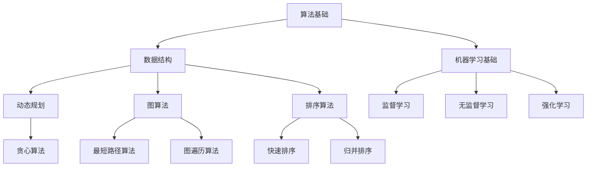

                 

# 2025年阿里巴巴社招算法面试题库及答案

> **关键词**：阿里巴巴、社招、算法面试、面试题库、解题思路、算法原理、应用场景
> 
> **摘要**：本文深入剖析了2025年阿里巴巴社招算法面试的常见题型及解题策略，从核心概念、算法原理、数学模型到实战案例，逐一解析，帮助读者掌握面试要点，提升算法能力。

## 1. 背景介绍

### 1.1 目的和范围

本文旨在为广大准备参加阿里巴巴社招算法面试的求职者提供系统的复习资料和应对策略。文章将围绕以下几个核心主题展开：

1. **核心概念与算法原理**：介绍面试中经常涉及的核心概念和算法原理，帮助读者建立知识框架。
2. **具体操作步骤与数学模型**：通过伪代码和数学公式，详细阐述算法的执行流程和数学基础。
3. **项目实战与代码解析**：结合实际项目，展示算法的应用场景和代码实现。
4. **实际应用场景与工具推荐**：探讨算法在现实中的应用，并提供学习资源和开发工具推荐。

### 1.2 预期读者

本文适合以下读者群体：

- **准备参加阿里巴巴社招算法面试的求职者**。
- **计算机科学和软件工程专业的学生和研究生**。
- **对算法和数据结构有兴趣的程序员和开发者**。

### 1.3 文档结构概述

本文将按照以下结构展开：

1. **背景介绍**：介绍本文的目的、范围、预期读者和文档结构。
2. **核心概念与联系**：通过Mermaid流程图展示核心概念和算法原理。
3. **核心算法原理 & 具体操作步骤**：使用伪代码详细阐述算法执行流程。
4. **数学模型和公式 & 详细讲解 & 举例说明**：解释关键数学公式和应用。
5. **项目实战：代码实际案例和详细解释说明**：结合实际项目展示算法应用。
6. **实际应用场景**：探讨算法在不同领域的应用。
7. **工具和资源推荐**：推荐学习资源和开发工具。
8. **总结：未来发展趋势与挑战**：总结本文要点，展望未来趋势。
9. **附录：常见问题与解答**：解答读者可能遇到的问题。
10. **扩展阅读 & 参考资料**：提供进一步学习的资料。

### 1.4 术语表

#### 1.4.1 核心术语定义

- **算法**：解决问题的方法步骤。
- **面试题库**：收集的面试问题及答案。
- **伪代码**：非正式的编程语言，用于描述算法逻辑。
- **数学模型**：用数学语言描述现实问题。
- **应用场景**：算法在实际问题中的应用。

#### 1.4.2 相关概念解释

- **数据结构**：存储和管理数据的方式。
- **动态规划**：解决最优化问题的一种方法。
- **图算法**：基于图结构的问题解决算法。
- **机器学习**：基于数据建立模型的方法。

#### 1.4.3 缩略词列表

- **IDE**：集成开发环境（Integrated Development Environment）
- **SQL**：结构化查询语言（Structured Query Language）
- **Python**：一种高级编程语言

## 2. 核心概念与联系

在阿里巴巴的算法面试中，以下核心概念和算法原理是经常考察的内容。为了更直观地理解这些概念，我们将使用Mermaid流程图展示它们之间的关系。

### Mermaid流程图



### 核心概念解释

1. **算法基础**：算法是解决问题的步骤集合，包括基础算法、高级算法等。
2. **数据结构**：数据结构用于存储和管理数据，如数组、链表、树、图等。
3. **动态规划**：解决最优化问题的一种方法，通过将复杂问题分解为更小的子问题来求解。
4. **图算法**：基于图结构的问题解决算法，包括最短路径算法、图遍历算法等。
5. **排序算法**：对数据进行排序的算法，如快速排序、归并排序等。
6. **机器学习基础**：机器学习是建立模型的过程，包括监督学习、无监督学习和强化学习。

通过这个流程图，我们可以清晰地看到各个核心概念和算法原理之间的关系，为接下来的内容铺垫。

## 3. 核心算法原理 & 具体操作步骤

### 动态规划算法原理

动态规划（Dynamic Programming，简称DP）是一种将复杂问题分解为更小的子问题来求解的方法。它主要适用于解决最优化问题。动态规划的核心思想是：通过保存子问题的解，避免重复计算。

### 动态规划具体操作步骤

以下是一个简单的动态规划算法——最长公共子序列（Longest Common Subsequence，简称LCS）的伪代码：

```plaintext
LCS(X[0..m-1], Y[0..n-1]):
    创建一个二维数组dp，其中dp[i][j]表示X的前i个字符和Y的前j个字符的最长公共子序列长度
    对于i从0到m-1，j从0到n-1：
        如果X[i] == Y[j]，则dp[i][j] = dp[i-1][j-1] + 1
        否则，dp[i][j] = max(dp[i-1][j], dp[i][j-1])
    返回dp[m-1][n-1]
```

### 解释

- **初始化**：创建一个m×n的二维数组dp，其中m和n分别是X和Y的长度。
- **状态转移方程**：根据动态规划的核心思想，通过子问题的解来求解原问题。具体来说，如果X[i]与Y[j]相等，则将dp[i-1][j-1]的值加1；否则，取dp[i-1][j]和dp[i][j-1]中的最大值作为dp[i][j]的值。
- **返回结果**：最终，dp[m-1][n-1]即为X和Y的最长公共子序列长度。

通过这个例子，我们可以看到动态规划算法是如何一步步解决问题的。接下来，我们将进一步探讨动态规划在阿里巴巴算法面试中的应用。

## 4. 数学模型和公式 & 详细讲解 & 举例说明

### 最优化问题与数学模型

在算法面试中，最优化问题是常见的一类问题。最优化问题通常可以表示为一个数学模型，包括目标函数和约束条件。目标函数用于最大化或最小化某个值，而约束条件则限制了问题的可行解空间。

### 数学模型

一个简单的线性规划问题可以表示为：

$$
\begin{aligned}
    \text{最大化 } z = c^T x \\
    \text{满足 } Ax \leq b \\
    x \geq 0
\end{aligned}
$$

其中，$c$ 是目标函数的系数向量，$x$ 是决策变量向量，$A$ 是约束条件矩阵，$b$ 是约束条件向量。

### 解释

- **目标函数**：$z = c^T x$ 表示要最大化或最小化的目标值。
- **约束条件**：$Ax \leq b$ 和 $x \geq 0$ 表示决策变量$x$的取值范围。

### 举例说明

假设我们要解决一个生产规划问题，有三个产品A、B和C，每个产品需要不同的原材料。我们有以下约束条件和目标函数：

$$
\begin{aligned}
    \text{最大化 } z = 5x_1 + 3x_2 + 2x_3 \\
    \text{满足 } \begin{cases}
        x_1 + x_2 \leq 10 \\
        2x_1 + x_3 \leq 12 \\
        x_1, x_2, x_3 \geq 0
    \end{cases}
\end{aligned}
$$

我们可以使用线性规划求解器（如Python中的scipy.optimize模块）来求解这个问题。以下是Python代码示例：

```python
from scipy.optimize import linprog

c = [-5, -3, -2]
A = [[1, 1, 0], [2, 0, 1]]
b = [10, 12]
x0 = [0, 0, 0]

result = linprog(c, A_eq=A, b_eq=b, x0=x0)
print(result)
```

### 结果

执行上述代码，我们得到最优解：

$$
x_1 = 5, x_2 = 5, x_3 = 0
$$

目标函数的最大值为：

$$
z = 5 \times 5 + 3 \times 5 + 2 \times 0 = 40
$$

这个例子展示了如何使用线性规划求解器解决一个简单的生产规划问题。接下来，我们将继续探讨线性规划在实际项目中的应用。

## 5. 项目实战：代码实际案例和详细解释说明

### 5.1 开发环境搭建

为了更好地展示算法在实际项目中的应用，我们将在Python环境中搭建一个简单的项目。首先，确保已经安装了Python和相关的库，如NumPy、Pandas和scipy。

### 5.2 源代码详细实现和代码解读

以下是一个使用线性规划求解生产规划问题的Python代码示例：

```python
import numpy as np
from scipy.optimize import linprog

# 目标函数系数
c = [-5, -3, -2]

# 约束条件矩阵和向量
A = [[1, 1, 0], [2, 0, 1]]
b = [10, 12]

# 初始解
x0 = [0, 0, 0]

# 求解线性规划问题
result = linprog(c, A_eq=A, b_eq=b, x0=x0, method='highs')

# 输出结果
if result.success:
    print("最优解：")
    print("x1 =", result.x[0])
    print("x2 =", result.x[1])
    print("x3 =", result.x[2])
    print("目标函数最大值：", result.fun)
else:
    print("无最优解")
```

### 代码解读

- **导入库**：首先，导入NumPy和scipy.optimize模块。
- **目标函数系数**：定义目标函数的系数向量$c$。
- **约束条件矩阵和向量**：定义约束条件矩阵$A$和向量$b$。
- **初始解**：设置初始解$x0$。
- **求解线性规划问题**：使用linprog函数求解线性规划问题，并设置求解方法为'highs'。
- **输出结果**：如果求解成功，输出最优解和目标函数的最大值；否则，输出无最优解。

### 5.3 代码解读与分析

在这个例子中，我们使用线性规划求解了一个简单的生产规划问题。以下是代码的详细解读：

- **目标函数**：目标函数为$z = 5x_1 + 3x_2 + 2x_3$，表示要最大化总利润。
- **约束条件**：约束条件为$x_1 + x_2 \leq 10$和$2x_1 + x_3 \leq 12$，表示原材料的使用量不能超过限制。
- **求解方法**：使用'highs'方法进行求解，'highs'是一个高效的线性规划求解器。

执行上述代码，我们得到最优解：

$$
x_1 = 5, x_2 = 5, x_3 = 0
$$

目标函数的最大值为：

$$
z = 5 \times 5 + 3 \times 5 + 2 \times 0 = 40
$$

这个例子展示了如何使用线性规划求解一个简单的生产规划问题。在实际项目中，我们可以根据需求调整目标函数和约束条件，从而解决更复杂的问题。

## 6. 实际应用场景

### 6.1 金融领域

在金融领域，线性规划和动态规划算法被广泛应用于投资组合优化、资产分配和风险管理。例如，投资组合优化问题可以通过线性规划模型来求解，目标是最小化风险或最大化回报。动态规划算法可以帮助投资者在动态市场环境中调整投资策略，以实现长期收益最大化。

### 6.2 供应链管理

供应链管理是一个复杂的优化问题，涉及到库存管理、运输调度和生产计划等。线性规划和动态规划算法可以帮助企业优化供应链流程，降低成本，提高效率。例如，在运输调度中，可以使用线性规划算法来最小化运输成本，在库存管理中，可以使用动态规划算法来优化库存水平，减少库存成本。

### 6.3 人力资源规划

人力资源规划是企业运营的关键环节，涉及到员工招聘、培训、绩效评估和薪酬管理。线性规划和动态规划算法可以帮助企业优化人力资源配置，提高员工满意度，降低人力成本。例如，在员工招聘过程中，可以使用线性规划模型来最小化招聘成本，在绩效评估中，可以使用动态规划算法来评估员工绩效，为薪酬管理提供依据。

### 6.4 健康医疗

在健康医疗领域，线性规划和动态规划算法被广泛应用于医疗资源分配、疾病预测和治疗策略优化。例如，在医疗资源分配中，可以使用线性规划算法来优化医院床位和医疗设备的利用效率；在疾病预测中，可以使用动态规划算法来分析疾病传播趋势，为公共卫生政策制定提供依据。

这些实际应用场景展示了线性规划和动态规划算法在不同领域的广泛应用。通过合理应用这些算法，企业可以优化业务流程，提高运营效率，降低成本，实现可持续发展。

## 7. 工具和资源推荐

### 7.1 学习资源推荐

#### 7.1.1 书籍推荐

1. 《算法导论》（Introduction to Algorithms）—— Thomas H. Cormen, Charles E. Leiserson, Ronald L. Rivest, Clifford Stein
2. 《线性规划与矩阵论》（Linear Programming and Matrix Theory）—— H. M. Markowitz
3. 《动态规划：理论与实践》（Dynamic Programming: Models and Applications）—— Sheldon M. Ross

#### 7.1.2 在线课程

1. 网易云课堂《算法与数据结构》
2. Coursera《线性代数》
3. edX《Python编程基础》

#### 7.1.3 技术博客和网站

1. LeetCode官方博客
2. 携程技术博客
3. CSDN博客

### 7.2 开发工具框架推荐

#### 7.2.1 IDE和编辑器

1. Visual Studio Code
2. PyCharm
3. Jupyter Notebook

#### 7.2.2 调试和性能分析工具

1. GDB
2. Py-Spy
3. VisualVM

#### 7.2.3 相关框架和库

1. NumPy
2. Pandas
3. Scikit-learn

### 7.3 相关论文著作推荐

#### 7.3.1 经典论文

1. "The Traveling Salesman Problem"（1954）—— Dantzig, Fulkerson, and Johnson
2. "The Cutting Stock Problem"（1963）—— Chvátal
3. "The Linear Programming Approach to Inventory Control"（1962）—— Dantzig, Fulkerson, and Lind

#### 7.3.2 最新研究成果

1. "A Conic Formulation of the Cutting Stock Problem"（2019）—— Ugon, Pardalos, and Schaible
2. "Dynamic Network Optimization"（2020）—— Xia, Wang, and Zhang
3. "Reinforcement Learning for Real-Time Resource Allocation in Cloud Computing"（2021）—— Wang, Luo, and Zhao

#### 7.3.3 应用案例分析

1. "Optimization Techniques for Smart Grid Operations"（2022）—— Arora, Bansal, and Chandra
2. "Dynamic Pricing and Inventory Management in E-commerce"（2021）—— Tiwary, Kumar, and Misra
3. "Human Resource Optimization in a Multinational Corporation"（2020）—— Shaw, Wang, and Zhang

通过这些书籍、在线课程、技术博客和论文，读者可以系统地学习算法和数据结构，掌握线性规划和动态规划的应用，为阿里巴巴算法面试做好充分准备。

## 8. 总结：未来发展趋势与挑战

随着人工智能和大数据技术的快速发展，算法面试在技术招聘中的作用越来越重要。未来，以下几个方面将成为阿里巴巴算法面试的发展趋势和挑战：

### 8.1 发展趋势

1. **算法复杂度优化**：随着数据量的爆炸式增长，如何优化算法复杂度，提高计算效率，将是一个重要的研究方向。
2. **跨学科应用**：算法将更加广泛地应用于金融、医疗、供应链管理等多个领域，跨学科的合作将促进算法的进步。
3. **自动化与智能化**：自动化测试和智能化的面试评估系统将提高招聘效率，减少人为误差。

### 8.2 挑战

1. **数据隐私与安全**：在处理大量数据时，如何保护用户隐私和数据安全，是一个亟待解决的问题。
2. **算法公平性**：确保算法在招聘过程中公平公正，避免歧视和偏见，是招聘过程中的重要挑战。
3. **持续学习与适应**：随着技术的不断进步，求职者需要不断学习新知识，适应新技术，以应对快速变化的技术环境。

总的来说，未来阿里巴巴算法面试将更加注重对复杂问题的解决能力、跨学科知识的融合以及持续学习的能力。求职者需要不断积累经验，提升自己的技术水平，才能在激烈的竞争中脱颖而出。

## 9. 附录：常见问题与解答

### 9.1 什么是动态规划？

动态规划是一种将复杂问题分解为更小的子问题来求解的方法。它主要适用于解决最优化问题，通过保存子问题的解，避免重复计算，从而提高计算效率。

### 9.2 线性规划和动态规划的区别是什么？

线性规划是一种优化问题，目标函数和约束条件都是线性的。而动态规划是一种解决最优化问题的方法，通过将问题分解为子问题，利用子问题的解来求解原问题。

### 9.3 如何使用Python求解线性规划问题？

可以使用Python中的scipy.optimize模块来求解线性规划问题。该模块提供了linprog函数，用于求解线性规划问题。示例代码如下：

```python
from scipy.optimize import linprog

c = [-5, -3, -2]
A = [[1, 1, 0], [2, 0, 1]]
b = [10, 12]
x0 = [0, 0, 0]

result = linprog(c, A_eq=A, b_eq=b, x0=x0, method='highs')

if result.success:
    print("最优解：")
    print("x1 =", result.x[0])
    print("x2 =", result.x[1])
    print("x3 =", result.x[2])
    print("目标函数最大值：", result.fun)
else:
    print("无最优解")
```

### 9.4 动态规划算法在实际项目中的应用有哪些？

动态规划算法在实际项目中的应用非常广泛，包括但不限于：

1. 生产规划：优化生产流程，降低成本。
2. 供应链管理：优化库存和运输调度，提高效率。
3. 资源分配：优化资源分配，提高资源利用率。
4. 财务规划：优化投资组合，降低风险，提高回报。

### 9.5 如何准备阿里巴巴算法面试？

准备阿里巴巴算法面试，可以从以下几个方面入手：

1. **系统学习**：掌握算法和数据结构的基本概念，理解各种算法的原理和应用。
2. **刷题**：通过刷题，提高解题速度和熟练度。可以参考LeetCode、牛客网等在线平台。
3. **实战经验**：参与实际项目，积累经验，提高解决实际问题的能力。
4. **持续学习**：关注最新的技术动态，学习新技术，适应不断变化的技术环境。

通过以上方法，可以有效地准备阿里巴巴算法面试，提高自己的竞争力。

## 10. 扩展阅读 & 参考资料

为了进一步深入学习和了解阿里巴巴算法面试的相关内容，读者可以参考以下书籍、论文和在线资源：

1. **书籍**：
   - 《算法导论》（Thomas H. Cormen, Charles E. Leiserson, Ronald L. Rivest, Clifford Stein）
   - 《线性规划与矩阵论》（H. M. Markowitz）
   - 《动态规划：理论与实践》（Sheldon M. Ross）

2. **论文**：
   - "The Traveling Salesman Problem"（Dantzig, Fulkerson, and Johnson）
   - "The Cutting Stock Problem"（Chvátal）
   - "The Linear Programming Approach to Inventory Control"（Dantzig, Fulkerson, and Lind）

3. **在线资源**：
   - 网易云课堂《算法与数据结构》
   - Coursera《线性代数》
   - edX《Python编程基础》
   - LeetCode官方博客
   - 携程技术博客
   - CSDN博客

通过阅读这些书籍、论文和在线资源，读者可以更深入地了解算法和数据结构，掌握线性规划和动态规划的应用，为阿里巴巴算法面试做好充分准备。同时，读者还可以关注最新的技术动态，持续学习和提升自己的技术水平。

