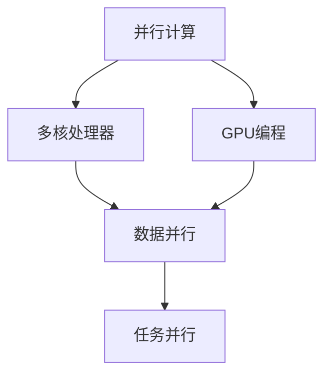
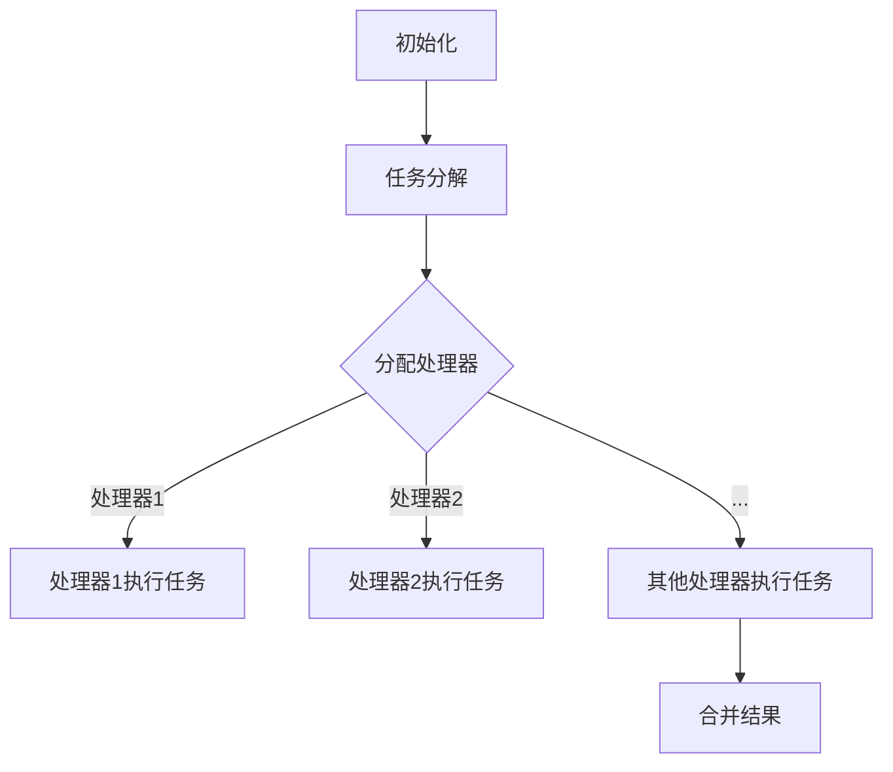

                 

# 并行计算：多核和GPU编程技术

> **关键词：并行计算，多核处理器，GPU编程，性能优化，并发编程**
> 
> **摘要：本文将深入探讨并行计算的基本概念，多核处理器和GPU编程技术，以及如何在实践中实现高性能并行编程。我们将通过详细的分析和实例，帮助读者掌握并行计算的核心原理，优化算法设计，提升计算效率。**

## 1. 背景介绍

### 1.1 目的和范围

本文旨在介绍并行计算的基本概念，探讨多核处理器和GPU编程技术，并详细讲解在实际应用中如何优化并行算法。通过本文的阅读，读者将了解并行计算的优势、关键技术，以及如何在实际项目中实现高效的并行计算。

### 1.2 预期读者

本文适用于具备一定编程基础，希望深入理解并行计算原理和GPU编程技术的开发者，以及对高性能计算感兴趣的读者。

### 1.3 文档结构概述

本文分为以下几个部分：

1. 背景介绍：介绍并行计算的基本概念、目的和范围。
2. 核心概念与联系：讲解并行计算的核心概念及其相互关系。
3. 核心算法原理 & 具体操作步骤：阐述并行算法的基本原理和操作步骤。
4. 数学模型和公式 & 详细讲解 & 举例说明：介绍并行计算中的数学模型和公式，并通过实例进行说明。
5. 项目实战：通过实际代码案例，详细解释并行计算的应用实践。
6. 实际应用场景：分析并行计算在不同领域的应用。
7. 工具和资源推荐：推荐相关学习资源、开发工具和论文著作。
8. 总结：总结并行计算的未来发展趋势和挑战。
9. 附录：常见问题与解答。
10. 扩展阅读 & 参考资料：提供进一步学习的资料。

### 1.4 术语表

#### 1.4.1 核心术语定义

- 并行计算：同时执行多个计算任务，提高计算效率。
- 多核处理器：具有多个独立处理核心的CPU。
- GPU编程：利用图形处理器（GPU）进行并行计算。
- 并发编程：在多核处理器或GPU上同时执行多个任务。

#### 1.4.2 相关概念解释

- 异步执行：不同计算任务在不同的处理器上同时执行。
- 数据并行：将数据分成多个部分，同时在不同的处理器上处理。
- 任务并行：将计算任务分解成多个子任务，同时执行。
- 数据流模型：描述数据流动和处理过程的模型。

#### 1.4.3 缩略词列表

- GPU：Graphics Processing Unit（图形处理器）
- CPU：Central Processing Unit（中央处理器）
- CUDA：Compute Unified Device Architecture（统一计算设备架构）
- OpenCL：Open Computing Language（开放计算语言）

## 2. 核心概念与联系

并行计算的核心概念包括多核处理器、GPU编程、数据并行、任务并行等。以下是一个简单的Mermaid流程图，描述这些核心概念及其相互关系：



### 2.1 并行计算概述

并行计算是一种通过同时执行多个计算任务来提高计算效率的技术。它利用多个处理核心或处理器，将计算任务分解为子任务，从而在多个处理器上同时执行，以减少计算时间和提高性能。

### 2.2 多核处理器

多核处理器是现代计算机系统中的一个关键组成部分。它具有多个独立的处理核心，可以在不同核心上同时执行多个计算任务。多核处理器的主要优点包括：

- 提高计算速度：通过同时执行多个任务，提高计算效率。
- 降低能源消耗：多个核心共享缓存和其他硬件资源，降低功耗。
- 增强可靠性：多个核心可以提高系统的容错能力。

### 2.3 GPU编程

GPU编程是利用图形处理器（GPU）进行并行计算的一种技术。与传统的CPU相比，GPU具有更高的浮点运算能力和更大的内存带宽。这使得GPU在处理大规模并行计算任务时具有明显的优势。GPU编程的主要优势包括：

- 高性能计算：GPU具有数以千计的并行处理单元，可以同时处理大量数据。
- 良好的可扩展性：GPU可以轻松扩展，以满足更大规模计算的需求。
- 节约成本：与构建相同性能的CPU系统相比，GPU系统具有更高的性价比。

### 2.4 数据并行与任务并行

数据并行和任务并行是并行计算中的两种常见并行模式。

- 数据并行：将数据分成多个部分，同时在不同的处理器上处理。这种模式适用于大规模数据处理任务，如图像处理和科学计算。
- 任务并行：将计算任务分解成多个子任务，同时执行。这种模式适用于复杂计算任务，如深度学习和大规模数据分析。

## 3. 核心算法原理 & 具体操作步骤

并行计算的核心在于如何高效地分解计算任务，并在多个处理器上同时执行。以下是一个简单的并行算法原理和具体操作步骤：

### 3.1 数据并行算法原理

数据并行算法将大规模数据处理任务分解为多个子任务，并在不同的处理器上同时执行。以下是一个数据并行算法的伪代码：

```pseudo
function parallelDataProcessing(data, processors):
    // 将数据分成多个部分
    data_parts = splitData(data, processors)

    // 在每个处理器上执行数据处理任务
    for processor in processors:
        processor.execute(data_part)

    // 合并处理结果
    result = mergeResults(processors)
    return result
```

### 3.2 任务并行算法原理

任务并行算法将计算任务分解为多个子任务，并在不同的处理器上同时执行。以下是一个任务并行算法的伪代码：

```pseudo
function parallelTaskProcessing(tasks, processors):
    // 将任务分解成多个子任务
    task_parts = splitTasks(tasks, processors)

    // 在每个处理器上执行子任务
    for processor in processors:
        processor.execute(task_part)

    // 合并处理结果
    result = mergeResults(processors)
    return result
```

### 3.3 并行编程模型

并行编程模型是用于描述如何将计算任务分解为子任务，并在多个处理器上执行的基本框架。以下是一个简单的并行编程模型：



## 4. 数学模型和公式 & 详细讲解 & 举例说明

并行计算中的数学模型和公式对于理解和优化算法性能至关重要。以下是一些关键数学模型和公式的详细讲解：

### 4.1 数据并行算法性能分析

数据并行算法的性能可以通过并行度（P）和并行处理时间（T\_p）来衡量。并行度表示数据被分解的子任务数量，而并行处理时间表示在所有处理器上执行任务所需的时间。

假设一个任务需要处理N个数据元素，每个处理器处理M个数据元素，则并行度P = N/M。并行处理时间T\_p可以通过以下公式计算：

$$ T\_p = \frac{N}{M} \times T\_s $$

其中，T\_s表示单个处理器处理一个数据元素所需的时间。

### 4.2 任务并行算法性能分析

任务并行算法的性能可以通过并行度（P）和并行处理时间（T\_p）来衡量。并行度表示计算任务被分解的子任务数量，而并行处理时间表示在所有处理器上执行任务所需的时间。

假设一个任务需要处理N个计算任务，每个处理器处理M个计算任务，则并行度P = N/M。并行处理时间T\_p可以通过以下公式计算：

$$ T\_p = \frac{N}{M} \times T\_s $$

其中，T\_s表示单个处理器处理一个计算任务所需的时间。

### 4.3 举例说明

假设有一个需要处理1000个数据元素的任务，每个数据元素需要1秒进行处理。使用4个处理器进行数据并行处理，每个处理器处理250个数据元素。

- 并行度：P = 1000 / 250 = 4
- 并行处理时间：T\_p = 4 \times 1 = 4秒

使用4个处理器进行任务并行处理，每个处理器处理100个计算任务，每个计算任务需要0.1秒进行处理。

- 并行度：P = 1000 / 100 = 10
- 并行处理时间：T\_p = 10 \times 0.1 = 1秒

从上述例子可以看出，使用并行计算可以显著减少计算时间。

## 5. 项目实战：代码实际案例和详细解释说明

### 5.1 开发环境搭建

在开始编写并行计算代码之前，需要搭建合适的开发环境。以下是搭建并行计算开发环境的步骤：

1. 安装C++编译器：安装支持并行编程的C++编译器，如GCC或Clang。
2. 安装CUDA：CUDA是NVIDIA推出的并行计算框架，用于在GPU上执行并行计算任务。从NVIDIA官网下载并安装CUDA。
3. 安装OpenCL：OpenCL是跨平台的并行计算框架，支持在多种处理器上执行并行计算任务。从OpenCL官网下载并安装OpenCL。
4. 配置开发工具：选择合适的集成开发环境（IDE），如Visual Studio或Eclipse，并配置CUDA和OpenCL支持。

### 5.2 源代码详细实现和代码解读

以下是一个简单的并行计算代码示例，使用CUDA框架在GPU上执行数据并行计算任务：

```cpp
#include <iostream>
#include <cuda_runtime.h>

__global__ void parallelDataProcessing(float* data, float* result, int dataSize) {
    int index = threadIdx.x + blockIdx.x * blockDim.x;
    if (index < dataSize) {
        result[index] = data[index] * 2;
    }
}

int main() {
    // 初始化数据
    int dataSize = 1000;
    float* data = new float[dataSize];
    float* result = new float[dataSize];

    // 将数据复制到GPU内存
    float* deviceData;
    float* deviceResult;
    cudaMalloc(&deviceData, dataSize * sizeof(float));
    cudaMalloc(&deviceResult, dataSize * sizeof(float));
    cudaMemcpy(deviceData, data, dataSize * sizeof(float), cudaMemcpyHostToDevice);

    // 配置并行计算参数
    int blockSize = 256;
    int gridSize = (dataSize + blockSize - 1) / blockSize;

    // 执行并行计算
    parallelDataProcessing<<<gridSize, blockSize>>>(deviceData, deviceResult, dataSize);

    // 将结果复制回主机内存
    cudaMemcpy(result, deviceResult, dataSize * sizeof(float), cudaMemcpyDeviceToHost);

    // 清理资源
    delete[] data;
    delete[] result;
    cudaFree(deviceData);
    cudaFree(deviceResult);

    return 0;
}
```

#### 5.2.1 代码解读

- 第1行：包含必要的头文件，包括C++标准库和CUDA API。
- 第2行：声明并行计算内核函数`parallelDataProcessing`，使用CUDA的`__global__`关键字。
- 第3行：定义内核函数的输入参数：原始数据数组、结果数据数组和数据大小。
- 第4行：使用`threadIdx.x`和`blockIdx.x`获取线程和块索引，确定当前线程要处理的数据索引。
- 第5行：使用`if`语句判断当前线程是否超出数据范围。
- 第6行：如果当前线程在数据范围内，计算数据元素的值，并将其存储在结果数组中。
- 第7行：在主函数中声明主机内存中的数据数组。
- 第8行：分配GPU内存，用于存储原始数据和结果数据。
- 第9行：使用`cudaMemcpy`将主机内存中的数据复制到GPU内存。
- 第10行：配置并行计算参数，包括块大小和网格大小。
- 第11行：使用`<<<gridSize, blockSize>>>`执行内核函数。
- 第12行：使用`cudaMemcpy`将GPU内存中的结果复制回主机内存。
- 第13行：释放主机和GPU内存资源。

#### 5.2.2 代码分析

- 并行计算内核函数`parallelDataProcessing`使用CUDA的线程索引和块索引，将大规模数据处理任务分解为多个子任务，并在GPU上同时执行。
- 数据处理过程使用CUDA内存分配和复制函数，在主机和GPU内存之间传输数据。
- 通过配置块大小和网格大小，可以控制并行计算的任务分布和执行效率。

## 6. 实际应用场景

并行计算技术广泛应用于多个领域，包括科学计算、图像处理、机器学习和大数据分析等。以下是一些典型的实际应用场景：

### 6.1 科学计算

科学计算领域通常需要处理大量的数值计算任务，如模拟物理现象、预测天气变化等。并行计算可以提高计算速度，缩短计算时间，从而加快科学研究进程。例如，使用并行计算技术可以加速分子动力学模拟，研究复杂化学反应过程。

### 6.2 图像处理

图像处理领域需要处理大量的图像数据，如人脸识别、图像分割和图像增强等。并行计算可以加速图像处理算法的执行，提高图像处理速度和性能。例如，使用GPU并行计算技术可以实现实时人脸识别和图像分割。

### 6.3 机器学习

机器学习领域需要处理大量的数据，如训练深度神经网络、分类和预测等。并行计算可以提高机器学习算法的计算效率，加速模型训练和推理过程。例如，使用GPU并行计算技术可以实现高效的深度学习模型训练和推理。

### 6.4 大数据分析

大数据分析领域需要处理海量的数据，如数据挖掘、数据分析和数据可视化等。并行计算可以提高数据分析的速度和性能，帮助企业和组织从海量数据中提取有价值的信息。例如，使用GPU并行计算技术可以加速大数据分析任务，提高数据处理效率。

## 7. 工具和资源推荐

### 7.1 学习资源推荐

#### 7.1.1 书籍推荐

- 《并行编程：实践指南》
- 《GPU并行编程技术》
- 《深度学习：GPU加速实战》

#### 7.1.2 在线课程

- Coursera上的《并行编程》课程
- Udacity的《GPU编程》课程
- edX上的《深度学习与并行计算》课程

#### 7.1.3 技术博客和网站

- NVIDIA官方博客：https://developer.nvidia.com/blog
- CUDA官网：https://developer.nvidia.com/cuda
- OpenCL官网：https://www.khronos.org/opencl/

### 7.2 开发工具框架推荐

#### 7.2.1 IDE和编辑器

- Visual Studio
- Eclipse
- CLion

#### 7.2.2 调试和性能分析工具

- Nsight Compute：用于CUDA程序的调试和性能分析。
- Nsight Systems：用于分析整个系统的性能，包括CPU和GPU。
- OpenCL SDK：用于OpenCL程序的调试和性能分析。

#### 7.2.3 相关框架和库

- CUDA Toolkit：NVIDIA提供的并行计算框架，支持GPU编程。
- OpenCL SDK：Khronos提供的并行计算框架，支持多种处理器。
- TensorFlow：谷歌开发的深度学习框架，支持GPU和TPU加速。

### 7.3 相关论文著作推荐

#### 7.3.1 经典论文

- "CUDA: A Parallel Computing Platform and Programming Model"
- "OpenCL: A Parallel Computing Standard for Heterogeneous Systems"
- "Scalable Parallelism in Matrix Multiplication using CUDA"

#### 7.3.2 最新研究成果

- "Deep Learning on GPUs: A Brief Introduction"
- "GPU-Accelerated Image Processing: Algorithms and Optimization"
- "Data-Parallel Models in Deep Learning: Motivations and Implications"

#### 7.3.3 应用案例分析

- "GPU-Accelerated Machine Learning: A Case Study on Large-Scale Data Analysis"
- "Parallel Computing for Scientific Research: Insights from Real-World Projects"
- "GPU Acceleration in Financial Modeling and Analysis: Techniques and Strategies"

## 8. 总结：未来发展趋势与挑战

并行计算作为提高计算效率和性能的关键技术，在未来将继续发挥重要作用。以下是一些并行计算的发展趋势和挑战：

### 8.1 发展趋势

1. **异构计算：** 随着处理器技术的发展，异构计算（使用多种不同类型的处理器）将成为并行计算的重要方向。异构计算可以提高计算效率和性能，同时降低能耗。
2. **深度学习：** 深度学习在多个领域取得了显著成果，如计算机视觉、自然语言处理和语音识别等。深度学习的并行计算需求将推动并行计算技术的不断发展。
3. **云计算与边缘计算：** 云计算和边缘计算将并行计算技术推向更广泛的应用场景。通过在云端和边缘设备上部署并行计算任务，可以实现高效的数据处理和智能服务。

### 8.2 挑战

1. **编程复杂性：** 并行计算编程相对复杂，需要开发者具备较高的编程技能和并行计算知识。随着并行计算技术的发展，如何简化并行编程将成为一个重要挑战。
2. **性能优化：** 并行计算的性能优化是一个复杂的过程，需要考虑数据访问模式、任务调度和资源利用率等因素。如何有效优化并行计算性能是一个持续的研究课题。
3. **兼容性与可移植性：** 随着并行计算技术的多样化，如何确保不同平台和架构之间的兼容性与可移植性是一个重要挑战。标准化并行计算接口和工具将是未来的发展方向。

## 9. 附录：常见问题与解答

### 9.1 什么是并行计算？

并行计算是一种通过同时执行多个计算任务来提高计算效率的技术。它利用多个处理核心或处理器，将计算任务分解为子任务，从而在多个处理器上同时执行，以减少计算时间和提高性能。

### 9.2 多核处理器和GPU有什么区别？

多核处理器和GPU都是并行计算平台，但它们在硬件架构和设计目标上有所不同。

- **多核处理器：** 具有多个独立处理核心的CPU，主要用于通用计算任务。多核处理器强调的是在多个处理核心上同时执行多个计算任务。
- **GPU：** 图形处理器，具有大量的并行处理单元，主要用于图形渲染和并行计算任务。GPU强调的是在大量处理单元上同时执行大量计算任务。

### 9.3 并行计算有哪些优点？

并行计算的主要优点包括：

- 提高计算速度：通过同时执行多个计算任务，减少计算时间和提高性能。
- 节约能源消耗：多个核心共享缓存和其他硬件资源，降低功耗。
- 增强可靠性：多个核心可以提高系统的容错能力。

### 9.4 如何优化并行计算性能？

优化并行计算性能可以从以下几个方面入手：

- 数据访问模式：优化数据访问模式，减少数据传输延迟。
- 任务调度：合理调度任务，减少任务间的依赖和等待时间。
- 资源利用率：提高处理器和内存等硬件资源的利用率。
- 算法设计：优化算法设计，减少计算复杂度和数据传输量。

## 10. 扩展阅读 & 参考资料

- CUDA Programming Guide：https://docs.nvidia.com/cuda/cuda-programming-guide/
- OpenCL Programming Guide：https://www.khronos.org/registry/cl/sdk/2.0/docs/man/html/
- Parallel Computing：https://www.researchgate.net/topics/Parallel-computing
- GPU-Accelerated Deep Learning：https://www.deeplearning.ai/gpu-accelerated-deep-learning/

### 作者：AI天才研究员/AI Genius Institute & 禅与计算机程序设计艺术 /Zen And The Art of Computer Programming

