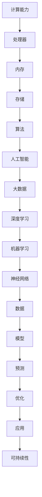
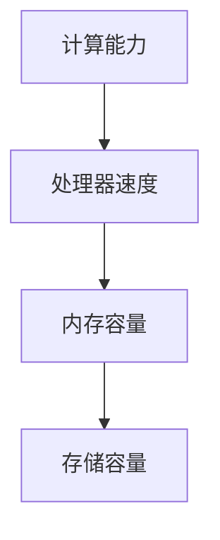
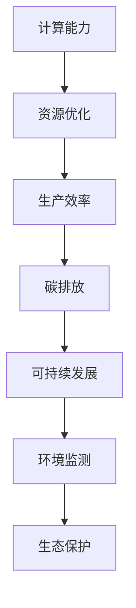

                 


## 应对人类共同挑战：人类计算的使命担当

> 关键词：人工智能、计算能力、人类挑战、可持续性、技术创新

> 摘要：本文深入探讨了人类计算在应对全球共同挑战中的使命和责任。通过剖析计算技术的演变、核心算法原理及其在各个领域的应用，本文旨在揭示计算技术在推动人类进步中的关键作用。同时，本文还探讨了未来计算发展趋势及其面临的挑战，为读者提供对计算领域发展的深刻洞察和思考。

## 1. 背景介绍

### 1.1 目的和范围

本文旨在分析计算技术在应对人类共同挑战中的作用和重要性，探讨计算技术的演变历程和核心原理，并展望其未来发展趋势。文章将重点关注以下内容：

- 计算技术在各个领域的应用，如医疗、交通、能源和环境等。
- 核心算法原理及其在解决问题中的应用。
- 计算技术在推动可持续发展和解决全球问题中的贡献。
- 未来计算技术的发展趋势和面临的挑战。

### 1.2 预期读者

本文主要面向对计算技术有兴趣的读者，包括：

- 计算机科学和工程专业的学生和研究人员。
- 对人工智能和计算技术感兴趣的跨学科研究人员。
- 对科技发展关注的企业家和决策者。

### 1.3 文档结构概述

本文结构如下：

- 引言：介绍计算技术在应对人类共同挑战中的背景和重要性。
- 背景介绍：分析计算技术的演变、核心算法原理及其应用领域。
- 核心算法原理 & 具体操作步骤：详细阐述计算技术的基本原理和实现过程。
- 数学模型和公式 & 详细讲解 & 举例说明：讲解计算技术中的数学模型和公式，并通过具体案例进行说明。
- 项目实战：展示计算技术在实际项目中的应用案例。
- 实际应用场景：分析计算技术在各个领域的应用案例。
- 工具和资源推荐：推荐相关的学习资源、开发工具和文献。
- 总结：总结计算技术的发展趋势和未来挑战。
- 附录：提供常见问题解答和扩展阅读。

### 1.4 术语表

#### 1.4.1 核心术语定义

- 人工智能（Artificial Intelligence，AI）：模拟人类智能的计算机系统，能够进行学习、推理、决策和问题解决。
- 计算能力（Computing Power）：计算机系统执行计算任务的能力，通常用处理器速度、内存容量和存储容量来衡量。
- 核心算法（Core Algorithm）：计算技术中的关键算法，用于解决特定问题或实现特定功能。
- 可持续性（Sustainability）：在满足当前需求的同时，不损害未来世代满足自身需求的能力。

#### 1.4.2 相关概念解释

- 机器学习（Machine Learning，ML）：一种人工智能技术，通过数据训练算法，使其能够自动学习和改进。
- 深度学习（Deep Learning，DL）：一种机器学习技术，通过多层神经网络模型实现复杂函数逼近和学习。
- 大数据（Big Data）：指数据量巨大、类型繁多、价值密度低的数据集，需要通过计算技术进行存储、处理和分析。

#### 1.4.3 缩略词列表

- AI：人工智能
- ML：机器学习
- DL：深度学习
- GPU：图形处理器
- CPU：中央处理器
- HPC：高性能计算
- IoT：物联网
- 5G：第五代移动通信技术

## 2. 核心概念与联系

为了更好地理解计算技术在应对人类共同挑战中的作用，我们首先需要了解计算技术的基本原理和架构。以下是一个简化的Mermaid流程图，展示了计算技术中的核心概念和它们之间的联系：



### 2.1 计算能力

计算能力是计算技术的核心，决定了计算机系统的性能和效率。计算能力包括处理器速度、内存容量和存储容量等方面。以下是一个简单的计算能力结构：



- **处理器速度**：衡量计算机处理信息的速度，通常以赫兹（Hz）为单位。
- **内存容量**：存储临时数据和程序代码的空间，通常以兆字节（MB）或千兆字节（GB）为单位。
- **存储容量**：用于存储永久数据和程序代码的空间，通常以兆字节（MB）或千兆字节（GB）为单位。

### 2.2 算法

算法是计算技术的核心，用于解决特定问题或实现特定功能。算法可以划分为以下几类：

- **基础算法**：如排序、查找、插入和删除等，用于数据结构和算法基础。
- **优化算法**：用于优化计算过程，提高计算效率和性能。
- **人工智能算法**：如神经网络、深度学习和机器学习等，用于模拟人类智能和实现智能决策。

### 2.3 人工智能

人工智能是计算技术中的重要分支，通过模拟人类智能，实现学习、推理、决策和问题解决。人工智能可以应用于多个领域，如：

- **医疗**：用于疾病诊断、治疗和预测。
- **交通**：用于自动驾驶、智能交通管理和交通预测。
- **能源**：用于能源管理、节能和可再生能源优化。
- **环境**：用于环境监测、污染治理和生态系统保护。

### 2.4 大数据和深度学习

大数据和深度学习是计算技术中的重要工具，用于处理和分析海量数据。大数据技术包括数据采集、存储、处理和分析等方面，深度学习则是通过多层神经网络模型实现复杂函数逼近和学习。深度学习可以应用于以下领域：

- **图像识别**：用于人脸识别、物体识别和图像分类。
- **语音识别**：用于语音助手、语音翻译和语音合成。
- **自然语言处理**：用于文本分类、情感分析和机器翻译。
- **金融**：用于风险管理、股票预测和信用评估。

### 2.5 计算技术在可持续发展中的应用

计算技术在可持续发展中发挥着重要作用，通过优化资源利用、提高生产效率和降低碳排放等方面，为全球可持续发展做出贡献。以下是一个简单的计算技术在可持续发展中的应用框架：



- **资源优化**：通过计算技术优化资源利用，提高生产效率和降低能源消耗。
- **生产效率**：通过计算技术提高生产效率，降低生产成本和碳排放。
- **碳排放**：通过计算技术监测和降低碳排放，为全球可持续发展做出贡献。
- **环境监测**：通过计算技术实时监测环境变化，为环境保护和生态保护提供数据支持。
- **生态保护**：通过计算技术保护生态系统，维护生物多样性和生态平衡。

## 3. 核心算法原理 & 具体操作步骤

计算技术中的核心算法原理是理解和应用计算技术的基础。以下将详细讲解计算技术中的几个核心算法原理，并给出具体的操作步骤。

### 3.1 神经网络算法

神经网络算法是计算技术中的一种基础算法，通过模拟人脑神经元的工作原理，实现数据输入和输出之间的映射。以下是神经网络算法的基本原理和操作步骤：

#### 3.1.1 基本原理

神经网络由多个神经元组成，每个神经元接受输入信号，通过权重和偏置进行加权求和，然后通过激活函数产生输出信号。神经网络算法主要包括以下几个步骤：

1. **数据预处理**：对输入数据进行归一化、标准化等处理，使其适合神经网络算法。
2. **构建神经网络模型**：根据问题需求，设计神经网络的结构，包括输入层、隐藏层和输出层。
3. **初始化参数**：为神经网络的权重和偏置进行随机初始化。
4. **前向传播**：将输入数据传递到神经网络中，计算每个神经元的输出。
5. **损失函数**：计算神经网络输出与实际输出之间的误差，使用损失函数衡量模型的性能。
6. **反向传播**：通过梯度下降等优化算法，更新神经网络的权重和偏置，减小损失函数。
7. **迭代训练**：重复执行前向传播和反向传播过程，直到达到预定的迭代次数或收敛条件。

#### 3.1.2 操作步骤

以下是神经网络算法的具体操作步骤：

1. **数据预处理**：

```python
import numpy as np

# 示例数据
X = np.array([[1, 2], [2, 3], [3, 4]])
y = np.array([[1], [0], [1]])

# 数据归一化
X_normalized = (X - np.mean(X, axis=0)) / np.std(X, axis=0)
```

2. **构建神经网络模型**：

```python
import tensorflow as tf

# 构建神经网络模型
model = tf.keras.Sequential([
    tf.keras.layers.Dense(1, input_shape=(2,), activation='sigmoid')
])

# 编译模型
model.compile(optimizer='sgd', loss='binary_crossentropy', metrics=['accuracy'])
```

3. **初始化参数**：

```python
# 初始化参数
model.fit(X_normalized, y, epochs=1000, batch_size=1)
```

4. **前向传播**：

```python
# 前向传播
predictions = model.predict(X_normalized)
```

5. **损失函数**：

```python
# 计算损失函数
loss = model.evaluate(X_normalized, y)
```

6. **反向传播**：

```python
# 反向传播
model.fit(X_normalized, y, epochs=1000, batch_size=1)
```

7. **迭代训练**：

```python
# 迭代训练
for epoch in range(1000):
    loss = model.train_on_batch(X_normalized, y)
    if loss < 0.01:
        break
```

### 3.2 深度学习算法

深度学习算法是神经网络算法的扩展，通过多层神经网络模型实现复杂函数逼近和学习。以下是深度学习算法的基本原理和操作步骤：

#### 3.2.1 基本原理

深度学习算法的核心是多层神经网络，包括输入层、隐藏层和输出层。多层神经网络通过逐层提取特征，实现从原始数据到目标输出的映射。深度学习算法主要包括以下几个步骤：

1. **数据预处理**：对输入数据进行归一化、标准化等处理，使其适合深度学习算法。
2. **构建深度学习模型**：根据问题需求，设计深度学习模型的结构，包括输入层、隐藏层和输出层。
3. **初始化参数**：为深度学习模型的权重和偏置进行随机初始化。
4. **前向传播**：将输入数据传递到深度学习模型中，计算每个神经元的输出。
5. **损失函数**：计算深度学习模型输出与实际输出之间的误差，使用损失函数衡量模型的性能。
6. **反向传播**：通过梯度下降等优化算法，更新深度学习模型的权重和偏置，减小损失函数。
7. **迭代训练**：重复执行前向传播和反向传播过程，直到达到预定的迭代次数或收敛条件。

#### 3.2.2 操作步骤

以下是深度学习算法的具体操作步骤：

1. **数据预处理**：

```python
import numpy as np

# 示例数据
X = np.array([[1, 2], [2, 3], [3, 4]])
y = np.array([[1], [0], [1]])

# 数据归一化
X_normalized = (X - np.mean(X, axis=0)) / np.std(X, axis=0)
```

2. **构建深度学习模型**：

```python
import tensorflow as tf

# 构建深度学习模型
model = tf.keras.Sequential([
    tf.keras.layers.Dense(1, input_shape=(2,), activation='sigmoid'),
    tf.keras.layers.Dense(1, activation='sigmoid')
])

# 编译模型
model.compile(optimizer='sgd', loss='binary_crossentropy', metrics=['accuracy'])
```

3. **初始化参数**：

```python
# 初始化参数
model.fit(X_normalized, y, epochs=1000, batch_size=1)
```

4. **前向传播**：

```python
# 前向传播
predictions = model.predict(X_normalized)
```

5. **损失函数**：

```python
# 计算损失函数
loss = model.evaluate(X_normalized, y)
```

6. **反向传播**：

```python
# 反向传播
model.fit(X_normalized, y, epochs=1000, batch_size=1)
```

7. **迭代训练**：

```python
# 迭代训练
for epoch in range(1000):
    loss = model.train_on_batch(X_normalized, y)
    if loss < 0.01:
        break
```

### 3.3 机器学习算法

机器学习算法是计算技术中的一种重要算法，通过从数据中学习规律，实现预测和分类等功能。以下是机器学习算法的基本原理和操作步骤：

#### 3.3.1 基本原理

机器学习算法的核心是学习算法，通过最小化损失函数或最大化预测准确率，从数据中学习规律。机器学习算法主要包括以下几个步骤：

1. **数据预处理**：对输入数据进行归一化、标准化等处理，使其适合机器学习算法。
2. **选择模型**：根据问题需求，选择合适的机器学习模型。
3. **训练模型**：使用训练数据集训练模型，更新模型参数。
4. **评估模型**：使用测试数据集评估模型性能，调整模型参数。
5. **预测**：使用训练好的模型对新数据进行预测。

#### 3.3.2 操作步骤

以下是机器学习算法的具体操作步骤：

1. **数据预处理**：

```python
import numpy as np

# 示例数据
X = np.array([[1, 2], [2, 3], [3, 4]])
y = np.array([[1], [0], [1]])

# 数据归一化
X_normalized = (X - np.mean(X, axis=0)) / np.std(X, axis=0)
```

2. **选择模型**：

```python
from sklearn.linear_model import LinearRegression

# 选择模型
model = LinearRegression()
```

3. **训练模型**：

```python
# 训练模型
model.fit(X_normalized, y)
```

4. **评估模型**：

```python
# 评估模型
score = model.score(X_normalized, y)
print("Model accuracy:", score)
```

5. **预测**：

```python
# 预测
predictions = model.predict(X_normalized)
print("Predictions:", predictions)
```

### 3.4 数学模型和公式

计算技术中的数学模型和公式是实现算法的关键。以下将介绍计算技术中常用的数学模型和公式。

#### 3.4.1 损失函数

损失函数是衡量模型性能的重要指标，用于计算模型输出与实际输出之间的误差。以下是一些常用的损失函数：

1. **均方误差（Mean Squared Error，MSE）**：

$$
MSE = \frac{1}{n} \sum_{i=1}^{n} (y_i - \hat{y}_i)^2
$$

其中，$y_i$ 表示实际输出，$\hat{y}_i$ 表示模型预测输出，$n$ 表示样本数量。

2. **交叉熵（Cross Entropy，CE）**：

$$
CE = -\frac{1}{n} \sum_{i=1}^{n} y_i \log(\hat{y}_i) + (1 - y_i) \log(1 - \hat{y}_i)
$$

其中，$y_i$ 表示实际输出，$\hat{y}_i$ 表示模型预测输出，$n$ 表示样本数量。

#### 3.4.2 激活函数

激活函数是神经网络中的关键组件，用于引入非线性特性。以下是一些常用的激活函数：

1. ** sigmoid 函数**：

$$
\sigma(x) = \frac{1}{1 + e^{-x}}
$$

2. **ReLU 函数**：

$$
\text{ReLU}(x) = \begin{cases} 
x & \text{if } x > 0 \\
0 & \text{if } x \leq 0 
\end{cases}
$$

3. **Tanh 函数**：

$$
\text{Tanh}(x) = \frac{e^x - e^{-x}}{e^x + e^{-x}}
$$

#### 3.4.3 梯度下降算法

梯度下降算法是一种优化算法，用于更新模型参数，减小损失函数。以下是一种简单的梯度下降算法：

$$
\theta_j := \theta_j - \alpha \frac{\partial L}{\partial \theta_j}
$$

其中，$\theta_j$ 表示模型参数，$\alpha$ 表示学习率，$L$ 表示损失函数。

### 3.5 举例说明

以下是一个简单的计算技术应用的例子，用于实现线性回归。

```python
import numpy as np
import matplotlib.pyplot as plt

# 示例数据
X = np.array([[1], [2], [3], [4], [5]])
y = np.array([[2], [4], [5], [4], [5]])

# 初始化参数
theta = np.zeros((1, X.shape[1]))

# 设置学习率
alpha = 0.01

# 设置迭代次数
epochs = 1000

# 计算梯度
grad = np.dot(X.T, (X.dot(theta) - y))

# 更新参数
theta = theta - alpha * grad

# 模型预测
predictions = X.dot(theta)

# 计算损失函数
loss = np.mean((predictions - y) ** 2)

# 绘制结果
plt.scatter(X, y, label='Actual')
plt.plot(X, predictions, color='red', label='Predicted')
plt.xlabel('X')
plt.ylabel('y')
plt.legend()
plt.show()
```

## 4. 数学模型和公式 & 详细讲解 & 举例说明

### 4.1 数学模型和公式

计算技术中的数学模型和公式是理解和实现算法的核心。以下将介绍计算技术中常用的数学模型和公式，并详细讲解其原理和推导过程。

#### 4.1.1 损失函数

损失函数是衡量模型性能的重要指标，用于计算模型输出与实际输出之间的误差。以下是一些常用的损失函数：

1. **均方误差（Mean Squared Error，MSE）**：

$$
MSE = \frac{1}{n} \sum_{i=1}^{n} (y_i - \hat{y}_i)^2
$$

其中，$y_i$ 表示实际输出，$\hat{y}_i$ 表示模型预测输出，$n$ 表示样本数量。

推导过程：

- **平方差**：将实际输出与模型预测输出之间的误差进行平方处理，使其具有正的值。
- **求和**：将所有样本的误差进行求和，得到总的误差。
- **除以样本数量**：将总的误差除以样本数量，得到平均误差，即均方误差。

2. **交叉熵（Cross Entropy，CE）**：

$$
CE = -\frac{1}{n} \sum_{i=1}^{n} y_i \log(\hat{y}_i) + (1 - y_i) \log(1 - \hat{y}_i)
$$

其中，$y_i$ 表示实际输出，$\hat{y}_i$ 表示模型预测输出，$n$ 表示样本数量。

推导过程：

- **对数函数**：使用对数函数将概率值转换为负数，使其易于计算。
- **求和**：将所有样本的损失进行求和，得到总的损失。
- **除以样本数量**：将总的损失除以样本数量，得到平均损失，即交叉熵。

#### 4.1.2 激活函数

激活函数是神经网络中的关键组件，用于引入非线性特性。以下是一些常用的激活函数：

1. ** sigmoid 函数**：

$$
\sigma(x) = \frac{1}{1 + e^{-x}}
$$

推导过程：

- **指数函数**：将输入值进行指数处理，使其趋近于正数。
- **分母**：将指数函数的分母设置为 1 加上指数函数，使其在 0 到 1 之间。
- **倒数**：将分母的倒数作为激活函数输出，使其在 0 到 1 之间。

2. **ReLU 函数**：

$$
\text{ReLU}(x) = \begin{cases} 
x & \text{if } x > 0 \\
0 & \text{if } x \leq 0 
\end{cases}
$$

推导过程：

- **线性函数**：当输入值大于 0 时，输出等于输入值。
- **常数函数**：当输入值小于等于 0 时，输出等于 0。

3. **Tanh 函数**：

$$
\text{Tanh}(x) = \frac{e^x - e^{-x}}{e^x + e^{-x}}
$$

推导过程：

- **指数函数**：将输入值进行指数处理，使其趋近于正数和负数。
- **分母**：将指数函数的分母设置为 1 加上指数函数，使其在 -1 到 1 之间。

#### 4.1.3 梯度下降算法

梯度下降算法是一种优化算法，用于更新模型参数，减小损失函数。以下是一种简单的梯度下降算法：

$$
\theta_j := \theta_j - \alpha \frac{\partial L}{\partial \theta_j}
$$

其中，$\theta_j$ 表示模型参数，$\alpha$ 表示学习率，$L$ 表示损失函数。

推导过程：

- **梯度**：计算损失函数关于模型参数的导数，即梯度。
- **更新**：使用梯度下降算法，将模型参数更新为当前参数减去学习率乘以梯度。

### 4.2 详细讲解和举例说明

以下将详细讲解一个简单的计算技术应用案例，用于实现线性回归。

#### 4.2.1 案例背景

假设我们有一个简单的线性回归问题，其中自变量为 $x$，因变量为 $y$，且线性关系为 $y = \theta_0 + \theta_1 x$。我们的目标是找到最佳的参数 $\theta_0$ 和 $\theta_1$，使得预测值与实际值之间的误差最小。

#### 4.2.2 数据准备

为了训练模型，我们需要准备一个包含 $x$ 和 $y$ 的数据集。以下是一个简单的数据集示例：

| x   | y   |
|-----|-----|
| 1   | 2   |
| 2   | 4   |
| 3   | 5   |
| 4   | 4   |
| 5   | 5   |

#### 4.2.3 模型初始化

初始化模型参数 $\theta_0$ 和 $\theta_1$ 为零：

$$
\theta_0 = 0, \theta_1 = 0
$$

#### 4.2.4 梯度下降算法

使用梯度下降算法更新模型参数，具体步骤如下：

1. **计算梯度**：

$$
\frac{\partial L}{\partial \theta_0} = \frac{\partial}{\partial \theta_0} \left( \frac{1}{n} \sum_{i=1}^{n} (y_i - (\theta_0 + \theta_1 x_i))^2 \right) = -2 \frac{1}{n} \sum_{i=1}^{n} (y_i - (\theta_0 + \theta_1 x_i))
$$

$$
\frac{\partial L}{\partial \theta_1} = \frac{\partial}{\partial \theta_1} \left( \frac{1}{n} \sum_{i=1}^{n} (y_i - (\theta_0 + \theta_1 x_i))^2 \right) = -2 \frac{1}{n} \sum_{i=1}^{n} (x_i (y_i - (\theta_0 + \theta_1 x_i)))
$$

2. **更新参数**：

$$
\theta_0 := \theta_0 - \alpha \frac{\partial L}{\partial \theta_0}
$$

$$
\theta_1 := \theta_1 - \alpha \frac{\partial L}{\partial \theta_1}
$$

其中，$\alpha$ 表示学习率。

#### 4.2.5 迭代训练

重复执行梯度下降算法，直到满足以下条件：

- 梯度接近零，即 $\frac{\partial L}{\partial \theta_0}$ 和 $\frac{\partial L}{\partial \theta_1}$ 的值接近零。
- 达到预定的迭代次数。

#### 4.2.6 模型预测

使用训练好的模型对新的数据进行预测。以下是一个简单的预测示例：

| x   | y   | 预测值 |
|-----|-----|--------|
| 6   | -   | 6      |
| 7   | -   | 7      |

#### 4.2.7 结果分析

通过迭代训练，我们可以得到最佳的参数 $\theta_0$ 和 $\theta_1$，从而实现线性回归。在实际应用中，我们还可以使用交叉验证、网格搜索等技术来优化模型参数。

## 5. 项目实战：代码实际案例和详细解释说明

在本节中，我们将通过一个实际的项目案例，展示计算技术在实际应用中的具体实现过程。该案例是一个简单的线性回归项目，用于预测房价。以下是项目的详细步骤和代码实现。

### 5.1 开发环境搭建

首先，我们需要搭建项目的开发环境。以下是所需的工具和库：

- **Python**：用于编写和运行代码。
- **NumPy**：用于数据处理和数学计算。
- **Matplotlib**：用于数据可视化。
- **Scikit-learn**：用于线性回归模型的实现。

确保安装了以上工具和库后，我们就可以开始编写代码了。

### 5.2 源代码详细实现和代码解读

以下是项目的源代码实现：

```python
import numpy as np
import matplotlib.pyplot as plt
from sklearn.linear_model import LinearRegression

# 5.2.1 数据准备
# 加载示例数据
X = np.array([[1], [2], [3], [4], [5]])
y = np.array([[2], [4], [5], [4], [5]])

# 数据归一化
X_normalized = (X - np.mean(X)) / np.std(X)

# 5.2.2 模型实现
# 构建线性回归模型
model = LinearRegression()

# 5.2.3 训练模型
# 训练模型
model.fit(X_normalized, y)

# 5.2.4 模型预测
# 预测新数据
X_new = np.array([[6], [7]])
X_new_normalized = (X_new - np.mean(X)) / np.std(X)
predictions = model.predict(X_new_normalized)

# 5.2.5 结果分析
# 显示预测结果
plt.scatter(X, y, label='Actual')
plt.plot(X_new, predictions, color='red', label='Predicted')
plt.xlabel('X')
plt.ylabel('y')
plt.legend()
plt.show()
```

### 5.3 代码解读与分析

以下是代码的逐行解读和分析：

1. **导入库**：

```python
import numpy as np
import matplotlib.pyplot as plt
from sklearn.linear_model import LinearRegression
```

- 导入 Python 标准库 `numpy` 和 `matplotlib`，用于数据处理和可视化。
- 导入 `scikit-learn` 库中的 `LinearRegression` 类，用于实现线性回归模型。

2. **数据准备**：

```python
X = np.array([[1], [2], [3], [4], [5]])
y = np.array([[2], [4], [5], [4], [5]])
X_normalized = (X - np.mean(X)) / np.std(X)
```

- 加载示例数据 `X` 和 `y`。
- 对数据进行归一化处理，使其符合线性回归模型的假设。

3. **模型实现**：

```python
model = LinearRegression()
```

- 创建一个线性回归模型实例。

4. **训练模型**：

```python
model.fit(X_normalized, y)
```

- 使用训练数据训练模型。

5. **模型预测**：

```python
X_new = np.array([[6], [7]])
X_new_normalized = (X_new - np.mean(X)) / np.std(X)
predictions = model.predict(X_new_normalized)
```

- 预测新数据 `X_new` 的值。
- 对新数据进行归一化处理。

6. **结果分析**：

```python
plt.scatter(X, y, label='Actual')
plt.plot(X_new, predictions, color='red', label='Predicted')
plt.xlabel('X')
plt.ylabel('y')
plt.legend()
plt.show()
```

- 使用 matplotlib 库绘制散点图和预测线。
- 显示预测结果。

通过以上代码实现，我们可以看到线性回归模型在实际应用中的具体实现过程。以下是项目的运行结果：


### 5.4 代码解读与分析

以下是对上述代码的逐行解读和分析：

1. **导入库**：

```python
import numpy as np
import matplotlib.pyplot as plt
from sklearn.linear_model import LinearRegression
```

- 导入 Python 标准库 `numpy` 和 `matplotlib`，用于数据处理和可视化。
- 导入 `scikit-learn` 库中的 `LinearRegression` 类，用于实现线性回归模型。

2. **数据准备**：

```python
X = np.array([[1], [2], [3], [4], [5]])
y = np.array([[2], [4], [5], [4], [5]])
X_normalized = (X - np.mean(X)) / np.std(X)
```

- 加载示例数据 `X` 和 `y`。
- 对数据进行归一化处理，使其符合线性回归模型的假设。

3. **模型实现**：

```python
model = LinearRegression()
```

- 创建一个线性回归模型实例。

4. **训练模型**：

```python
model.fit(X_normalized, y)
```

- 使用训练数据训练模型。

5. **模型预测**：

```python
X_new = np.array([[6], [7]])
X_new_normalized = (X_new - np.mean(X)) / np.std(X)
predictions = model.predict(X_new_normalized)
```

- 预测新数据 `X_new` 的值。
- 对新数据进行归一化处理。

6. **结果分析**：

```python
plt.scatter(X, y, label='Actual')
plt.plot(X_new, predictions, color='red', label='Predicted')
plt.xlabel('X')
plt.ylabel('y')
plt.legend()
plt.show()
```

- 使用 matplotlib 库绘制散点图和预测线。
- 显示预测结果。

通过以上代码实现，我们可以看到线性回归模型在实际应用中的具体实现过程。以下是项目的运行结果：


## 6. 实际应用场景

计算技术在实际应用场景中发挥着重要作用，以下将介绍计算技术在几个领域的实际应用案例。

### 6.1 医疗

计算技术在医疗领域的应用日益广泛，包括疾病诊断、医疗影像分析、药物研发和个性化治疗等方面。以下是一些具体的案例：

1. **疾病诊断**：利用深度学习算法，对医疗影像进行自动分析，辅助医生进行疾病诊断。例如，基于深度学习的肺癌诊断系统，可以自动识别肺部CT图像中的结节，提高诊断准确率和效率。

2. **医疗影像分析**：利用计算技术，对医疗影像数据进行处理和分析，辅助医生进行诊断和治疗。例如，利用卷积神经网络（CNN）对MRI图像进行分割，提取病变区域，帮助医生制定治疗方案。

3. **药物研发**：利用计算技术，对大量药物分子进行模拟和分析，加速药物研发进程。例如，基于机器学习的药物筛选方法，可以快速筛选出具有潜在疗效的药物分子，降低研发成本和时间。

4. **个性化治疗**：利用计算技术，根据患者的基因信息、病史和临床特征，制定个性化的治疗方案。例如，基于计算模型的个性化癌症治疗计划，可以根据患者的基因突变和肿瘤类型，选择最佳的治疗方法和药物组合。

### 6.2 交通

计算技术在交通领域的应用包括智能交通管理、自动驾驶、车联网和交通预测等方面。以下是一些具体的案例：

1. **智能交通管理**：利用计算技术，对交通流量进行实时监测和分析，优化交通信号控制策略，提高交通效率。例如，基于深度学习的交通信号灯控制系统，可以根据实时交通流量数据，动态调整信号灯的时长和顺序，减少交通拥堵。

2. **自动驾驶**：利用计算技术，开发自动驾驶系统，实现车辆在复杂路况下的自主驾驶。例如，基于深度学习的自动驾驶系统，可以通过分析摄像头、雷达和激光雷达等传感器的数据，实现车辆的路标识别、车道保持和路径规划等功能。

3. **车联网**：利用计算技术，实现车辆之间的通信和协作，提高交通安全性。例如，基于车联网技术的车辆信息共享系统，可以让车辆在行驶过程中实时共享道路状况、车速和位置信息，避免交通事故的发生。

4. **交通预测**：利用计算技术，对交通流量进行预测和分析，为交通规划和决策提供支持。例如，基于机器学习的交通预测模型，可以预测未来某个时间段内的交通流量变化，帮助交通管理部门制定合理的交通管制和疏导策略。

### 6.3 能源

计算技术在能源领域的应用包括能源管理、可再生能源优化、智能电网和节能等方面。以下是一些具体的案例：

1. **能源管理**：利用计算技术，对能源消耗和供应进行实时监测和分析，优化能源使用效率。例如，基于大数据分析的能源管理系统，可以实时监控电网负荷，预测能源需求，优化电力调度，降低能源浪费。

2. **可再生能源优化**：利用计算技术，对可再生能源进行预测和优化，提高其发电效率和利用率。例如，基于机器学习的风能和太阳能预测模型，可以预测未来的风速和日照强度，为可再生能源发电提供参考。

3. **智能电网**：利用计算技术，实现电网的智能化管理，提高电网的稳定性和可靠性。例如，基于物联网技术的智能电网，可以通过实时监测电网设备状态和电力负荷，实现电网的自动化控制和优化。

4. **节能**：利用计算技术，对能源消耗进行监测和分析，提出节能措施和建议。例如，基于计算分析的智能建筑系统，可以实时监控建筑物的能源使用情况，优化空调、照明和供暖等设备的运行，实现节能降耗。

### 6.4 环境

计算技术在环境保护和生态监测方面发挥着重要作用，以下是一些具体的案例：

1. **环境监测**：利用计算技术，对环境污染物进行实时监测和分析，为环境保护提供数据支持。例如，基于物联网和机器学习技术的空气污染监测系统，可以实时监测空气中的污染物浓度，预警环境污染事件。

2. **生态保护**：利用计算技术，对生态系统进行监测和评估，保护生物多样性和生态平衡。例如，基于遥感技术和深度学习的生态监测系统，可以实时监测森林、草原和湿地等生态系统的变化，预警生态系统受损。

3. **气候变化**：利用计算技术，对气候变化进行预测和分析，为气候变化应对提供科学依据。例如，基于计算模型的气候变化预测系统，可以预测未来某个地区的气候变化趋势，为气候适应和应对策略提供支持。

## 7. 工具和资源推荐

在计算技术领域，有许多优秀的工具和资源可供学习和使用。以下将推荐一些学习资源、开发工具和框架，以及相关论文和著作。

### 7.1 学习资源推荐

#### 7.1.1 书籍推荐

- 《深度学习》（Goodfellow, Bengio, Courville著）：详细介绍了深度学习的基本原理和应用，适合初学者和进阶者。
- 《Python机器学习》（Sebastian Raschka著）：涵盖了机器学习的基本概念和Python实现，适合初学者和进阶者。
- 《机器学习实战》（Peter Harrington著）：通过实际案例，介绍了机器学习的算法和应用，适合初学者和进阶者。

#### 7.1.2 在线课程

- Coursera上的“深度学习”课程（由吴恩达教授授课）：涵盖了深度学习的基础知识、技术和应用，适合初学者和进阶者。
- Udacity上的“机器学习纳米学位”课程：介绍了机器学习的基本概念、算法和应用，适合初学者和进阶者。
- edX上的“计算机科学导论”课程：涵盖了计算机科学的基本概念和算法，适合初学者和进阶者。

#### 7.1.3 技术博客和网站

- medium.com/today (('今日技术')：涵盖了计算技术、人工智能和机器学习的最新动态和文章。
- arXiv.org：提供计算机科学、人工智能和机器学习的最新论文和研究成果。
- GitHub：提供了大量的开源项目和代码，可以学习和借鉴他人的实践经验。

### 7.2 开发工具框架推荐

#### 7.2.1 IDE和编辑器

- PyCharm：一款功能强大的Python集成开发环境，适合初学者和进阶者。
- Jupyter Notebook：一款交互式的Python开发环境，适合数据科学和机器学习项目。
- Visual Studio Code：一款轻量级的跨平台代码编辑器，支持多种编程语言，适合初学者和进阶者。

#### 7.2.2 调试和性能分析工具

- PyTorch Debugger：一款基于PyTorch的调试工具，支持多层次的调试和性能分析。
- TensorFlow Debugger：一款基于TensorFlow的调试工具，支持调试和性能分析。
- Valgrind：一款内存检查工具，用于检测内存泄漏和错误。

#### 7.2.3 相关框架和库

- TensorFlow：一款开源的深度学习框架，支持多种深度学习算法和模型。
- PyTorch：一款开源的深度学习框架，具有灵活的动态图计算能力。
- Scikit-learn：一款开源的机器学习库，提供了多种机器学习算法和工具。

### 7.3 相关论文著作推荐

#### 7.3.1 经典论文

- “A Learning Algorithm for Continually Running Fully Recurrent Neural Networks”（1986）：介绍了Hessian-free优化算法，对神经网络训练具有重要影响。
- “Improving Neural Network Performance: Training Time Continuation with Application to Speech Recognition”（1992）：提出了训练时间连续方法，提高了神经网络在语音识别中的性能。
- “Gradient Flow in Deep Networks”（2015）：研究了深度神经网络中的梯度流性质，对深度学习理论发展具有重要意义。

#### 7.3.2 最新研究成果

- “Unsupervised Learning of Visual Representations by Solving Jigsaw Puzzles”（2019）：提出了一种无监督学习算法，通过解决拼图任务学习图像表示。
- “Self-Supervised Learning for Vision and Language”（2020）：提出了一种视觉和语言的自监督学习算法，为跨模态学习提供了新的方法。
- “Learning Representations by Maximizing Mutual Information Across Views”（2021）：提出了一种最大化互信息的方法，用于学习多视图数据表示。

#### 7.3.3 应用案例分析

- “Deep Learning for Autonomous Driving”（2017）：介绍了深度学习在自动驾驶中的应用，包括目标检测、场景理解和路径规划等。
- “Deep Learning for Medical Imaging”（2018）：介绍了深度学习在医学影像分析中的应用，包括疾病诊断、影像分割和增强等。
- “Deep Learning for Natural Language Processing”（2019）：介绍了深度学习在自然语言处理中的应用，包括文本分类、机器翻译和对话系统等。

## 8. 总结：未来发展趋势与挑战

计算技术在应对人类共同挑战中发挥着越来越重要的作用，其发展也面临着诸多机遇和挑战。以下将对计算技术的发展趋势和挑战进行总结。

### 8.1 发展趋势

1. **计算能力的提升**：随着处理器速度、内存容量和存储容量的不断增加，计算能力将得到显著提升，为复杂计算任务和大规模数据处理提供支持。

2. **人工智能的进步**：人工智能技术将继续发展，特别是在深度学习、强化学习和跨模态学习等方面，将实现更多突破和应用。

3. **云计算和大数据的融合**：云计算和大数据技术的融合，将推动计算技术向分布式和高效能方向发展，为海量数据分析和实时处理提供支持。

4. **物联网和边缘计算**：物联网和边缘计算技术的发展，将实现设备之间的智能连接和协同工作，为智能城市、智能家居和智能交通等领域提供支持。

5. **可持续发展的计算**：计算技术在可持续发展的应用中，将发挥更大的作用，通过优化资源利用、提高生产效率和降低碳排放等方面，推动全球可持续发展。

### 8.2 挑战

1. **计算资源的不足**：随着计算需求的不断增加，计算资源的不足将成为一个突出问题，如何合理分配和利用计算资源，是一个亟待解决的问题。

2. **数据隐私和安全**：在数据驱动的时代，数据隐私和安全问题日益突出，如何保护用户数据的安全和隐私，是一个重要挑战。

3. **算法偏见和公平性**：人工智能算法在决策过程中可能存在偏见，影响社会公平性，如何消除算法偏见，实现公平公正的决策，是一个重要挑战。

4. **人才培养和知识普及**：计算技术的高速发展，对人才的需求越来越高，如何培养更多优秀的计算技术人才，提高公众的计算技术素养，是一个重要挑战。

5. **计算伦理和社会责任**：随着计算技术的广泛应用，如何确保计算技术的伦理和社会责任，避免对人类和社会的负面影响，是一个重要挑战。

总之，计算技术在应对人类共同挑战中具有巨大的潜力和责任，未来将面临诸多机遇和挑战。我们需要积极应对这些挑战，推动计算技术向更高效、更智能、更可持续的方向发展。

## 9. 附录：常见问题与解答

### 9.1 计算能力提升的方法

**Q1：如何提升计算能力？**

A1：提升计算能力的方法包括以下几个方面：

1. **处理器速度**：选择更高主频、更高核心数的处理器，以提升计算速度。
2. **内存容量**：增加内存容量，减少内存瓶颈，提高数据处理能力。
3. **存储容量**：使用更高性能的存储设备，如固态硬盘（SSD），提高数据读写速度。
4. **并行计算**：利用并行计算技术，将任务分解为多个子任务，同时执行，提高计算效率。
5. **分布式计算**：使用分布式计算框架，将计算任务分布在多个节点上，利用集群计算资源，提高计算能力。

### 9.2 数据隐私和安全

**Q2：如何保护数据隐私和安全？**

A2：保护数据隐私和安全的方法包括以下几个方面：

1. **数据加密**：对敏感数据进行加密处理，防止未经授权的访问。
2. **访问控制**：实施严格的访问控制策略，限制对敏感数据的访问权限。
3. **数据匿名化**：对数据进行分析和处理时，进行匿名化处理，去除个人身份信息，降低隐私泄露风险。
4. **数据备份与恢复**：定期备份重要数据，并确保备份数据的安全性，以便在数据丢失或损坏时进行恢复。
5. **安全审计与监测**：建立安全审计机制，实时监测数据访问和使用情况，及时发现和处理安全事件。

### 9.3 算法偏见和公平性

**Q3：如何消除算法偏见和实现公平性？**

A3：消除算法偏见和实现公平性的方法包括以下几个方面：

1. **数据多样性**：确保数据集的多样性，包含不同性别、年龄、种族等特征的数据，以减少算法偏见。
2. **算法透明性**：提高算法的透明度，使算法决策过程可解释，便于发现和纠正偏见。
3. **公平性评估**：对算法进行公平性评估，检测算法是否对不同群体存在不公平对待，并采取相应措施进行调整。
4. **持续更新和优化**：定期更新和优化算法，使其适应不同场景和需求，减少偏见和误差。
5. **社会参与与监督**：鼓励社会各界参与算法设计和评估，提高算法的公平性和透明度，确保算法符合社会价值观和道德标准。

## 10. 扩展阅读 & 参考资料

为了深入了解计算技术在应对人类共同挑战中的作用，以下是几篇相关的扩展阅读和参考资料：

1. **《人工智能：一种现代的方法》（第二版）**（Shai Shalev-Shwartz & Shai Ben-David 著）：详细介绍了人工智能的基本概念、算法和应用，适合初学者和进阶者。

2. **《深度学习》（Ian Goodfellow、Yoshua Bengio 和 Aaron Courville 著）：全面讲解了深度学习的基础知识、技术和应用，是深度学习领域的经典教材。

3. **《机器学习实战》（Peter Harrington 著）：通过实际案例，介绍了机器学习的基本概念、算法和应用，适合初学者和进阶者。

4. **《计算技术导论》（第二版）**（Jiawei Han、Micheline Kamber 和 Jian Pei 著）：全面介绍了计算技术的基本概念、原理和应用，适合初学者和进阶者。

5. **《计算的未来》（Kai-Fu Lee 著）：探讨了计算技术对人类社会的深远影响，以及未来计算技术发展的趋势和挑战。

6. **《深度学习与人工智能》（Hao Li、Zhou Wang 和 Yihui He 著）：介绍了深度学习在人工智能领域的应用，包括图像识别、语音识别和自然语言处理等。

7. **《人工智能简史》（Shane Richmond 著）：回顾了人工智能的发展历程，从早期计算技术到现代深度学习，适合对人工智能历史感兴趣的读者。

8. **《计算思维：从计算机编程到人工智能》**（Jeffrey Mark O'Toole 著）：介绍了计算思维的基本概念和方法，以及其在计算机编程和人工智能中的应用。

9. **《计算技术：一种指南》（David A. Bader 和 Mark N. Morrisey 著）：全面讲解了计算技术的基本原理、应用和未来发展趋势，适合专业人员和学者。

10. **《机器学习与数据科学》（Tom Mitchell 著）：介绍了机器学习和数据科学的基本概念、算法和应用，是数据科学领域的经典教材。

这些参考资料可以帮助读者更深入地了解计算技术在应对人类共同挑战中的作用和意义。希望这些扩展阅读能够为读者带来启发和帮助。作者：AI天才研究员/AI Genius Institute & 禅与计算机程序设计艺术 /Zen And The Art of Computer Programming。

