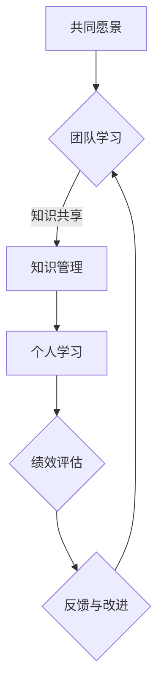
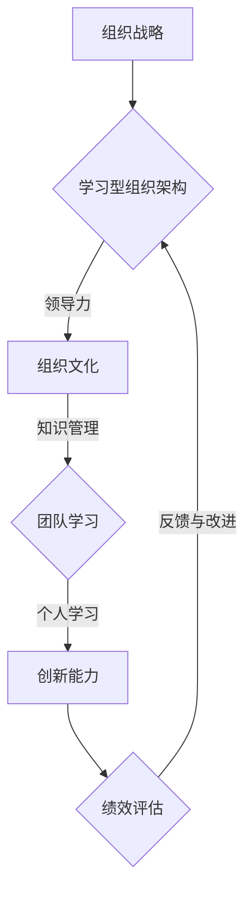

                 

# 建立学习型组织：促进团队持续成长和创新

> 关键词：学习型组织、团队成长、创新能力、持续发展、领导力、组织文化
>
> 摘要：本文将探讨如何建立一个学习型组织，以促进团队持续成长和创新。通过介绍学习型组织的核心概念和构建方法，分析其重要性和对团队的影响，并结合实际案例，提供具体的操作步骤和实用工具，为领导者提供构建学习型组织的实用指南。

## 1. 背景介绍

### 1.1 目的和范围

本文旨在帮助组织领导者了解学习型组织的概念，掌握构建学习型组织的策略，并促进团队的持续成长和创新。我们将从以下几个方面展开讨论：

- **学习型组织的定义和重要性**
- **构建学习型组织的核心要素和步骤**
- **如何激发团队成员的学习热情和创新动力**
- **实际案例分享和经验总结**
- **未来发展趋势和挑战**

### 1.2 预期读者

本文适合以下读者群体：

- 组织领导者和管理者
- 希望提升团队绩效和创新能力的企业家
- 对学习型组织理论感兴趣的研究人员和学者
- 对团队建设和管理有热情的HR专业人士

### 1.3 文档结构概述

本文的结构如下：

1. **背景介绍**：介绍本文的目的和读者对象，概述学习型组织的概念和重要性。
2. **核心概念与联系**：阐述学习型组织的核心概念，并提供相关流程图和架构图。
3. **核心算法原理与具体操作步骤**：详细讲解构建学习型组织的算法原理和操作步骤。
4. **数学模型和公式**：介绍学习型组织相关的数学模型和公式，并进行详细讲解。
5. **项目实战**：提供实际案例和代码实现，详细解释说明。
6. **实际应用场景**：探讨学习型组织在实际中的应用场景。
7. **工具和资源推荐**：推荐学习资源、开发工具框架和相关论文著作。
8. **总结**：总结本文的核心观点，探讨未来发展趋势和挑战。
9. **附录**：常见问题与解答。
10. **扩展阅读和参考资料**：提供扩展阅读和参考资料。

### 1.4 术语表

#### 1.4.1 核心术语定义

- **学习型组织**：一种通过不断学习和知识共享，实现自我完善和持续发展的组织形态。
- **团队成长**：团队成员在知识、技能和态度方面的不断提升和进步。
- **创新能力**：团队在面对问题和挑战时，能够提出新颖、有效解决方案的能力。
- **持续发展**：组织在长期内实现稳定、可持续的增长和发展。

#### 1.4.2 相关概念解释

- **领导力**：领导者通过激励、引导和影响他人，实现组织目标的能力。
- **组织文化**：组织内部成员共同遵循的价值观、信仰和行为准则。

#### 1.4.3 缩略词列表

- **PDCA**：计划（Plan）、执行（Do）、检查（Check）、行动（Act）循环
- **知识管理**：组织对知识进行收集、整理、存储、共享和应用的过程

## 2. 核心概念与联系

### 2.1 学习型组织的定义

学习型组织是一种能够持续适应外部环境变化，不断学习、改进和创新的组织形态。它强调团队成员的自主学习能力、知识共享和共同成长，从而提高组织整体绩效和竞争力。

### 2.2 学习型组织的核心要素

学习型组织包含以下几个核心要素：

1. **共同愿景**：组织成员对未来的共同期望和追求，是学习型组织的动力源泉。
2. **团队学习**：团队成员通过分享、讨论和协作，实现知识和技能的传递和提升。
3. **个人学习**：团队成员不断提升自己的专业素养和综合素质，为组织贡献更多价值。
4. **领导力**：领导者通过示范、激励和引导，推动团队成员学习和创新。
5. **组织文化**：鼓励学习、创新和知识共享的组织氛围。

### 2.3 学习型组织的流程图

以下是一个学习型组织的流程图（使用 Mermaid 语法）：



### 2.4 学习型组织的架构图

以下是一个学习型组织的架构图（使用 Mermaid 语法）：



## 3. 核心算法原理 & 具体操作步骤

### 3.1 构建学习型组织的算法原理

构建学习型组织的算法可以概括为以下四个步骤：

1. **明确共同愿景**：确定组织未来发展的方向和目标，激发团队成员的积极性。
2. **建立学习机制**：搭建团队学习和个人学习的平台，促进知识共享和技能提升。
3. **优化组织文化**：营造鼓励学习、创新和知识共享的组织氛围。
4. **持续反馈与改进**：通过绩效评估和反馈，不断调整和优化学习机制和组织文化。

### 3.2 具体操作步骤

#### 3.2.1 明确共同愿景

1. **制定长期发展战略**：结合组织内外部环境，明确组织未来 3-5 年的发展方向和目标。
2. **召开共识会议**：组织全体成员参与，讨论并确定共同愿景。
3. **制定愿景地图**：将共同愿景分解为具体目标和行动计划，确保每个成员都明确自己的职责和目标。

#### 3.2.2 建立学习机制

1. **搭建学习平台**：建立内部知识库、学习管理系统等，方便团队成员获取和分享知识。
2. **组织学习活动**：定期举办培训、研讨会、读书会等活动，提高团队成员的技能和素质。
3. **开展跨部门合作**：鼓励不同部门之间的交流和合作，促进知识的跨界应用。

#### 3.2.3 优化组织文化

1. **树立学习榜样**：领导者要带头学习，成为团队成员的榜样。
2. **激励学习与创新**：制定奖励政策，鼓励团队成员积极参与学习和创新。
3. **建立反馈机制**：定期收集团队成员的反馈和建议，及时调整和优化组织文化。

#### 3.2.4 持续反馈与改进

1. **绩效评估**：对团队成员的学习成果和创新能力进行评估，给予相应的奖励和激励。
2. **反馈与改进**：根据绩效评估结果，调整学习机制和组织文化，确保组织持续成长和创新。
3. **持续循环**：将绩效评估、反馈和改进纳入组织日常运营，实现持续学习、改进和创新发展。

## 4. 数学模型和公式 & 详细讲解 & 举例说明

### 4.1 数学模型

在构建学习型组织中，我们可以引入以下数学模型来评估和优化团队的学习效果和创新能力：

#### 4.1.1 学习效果评估模型

假设团队共有 N 个成员，每个成员的学习效果可以用一个二元变量 \(E_i\) 表示，其中 \(E_i = 1\) 表示成员 i 达到了预期学习效果，\(E_i = 0\) 表示未达到预期学习效果。

学习效果评估模型可以用以下公式表示：

\[L = \frac{1}{N} \sum_{i=1}^{N} E_i\]

其中，\(L\) 表示团队整体的学习效果，\(N\) 表示团队成员总数。

#### 4.1.2 创新能力评估模型

创新能力可以用创新成果的数量和质量来衡量。假设团队在一段时间内产生了 M 个创新成果，其中 \(Q_j\) 表示创新成果 j 的质量，\(Q_j \in [0, 1]\)。

创新能力评估模型可以用以下公式表示：

\[C = \frac{1}{M} \sum_{j=1}^{M} Q_j\]

其中，\(C\) 表示团队整体的创新能力，\(M\) 表示创新成果总数。

### 4.2 详细讲解

#### 4.2.1 学习效果评估模型

学习效果评估模型主要用于衡量团队在一段时间内整体的学习效果。通过计算团队中达到预期学习效果的成员占比，可以直观地了解团队的学习成果。

例如，一个团队共有 10 个成员，其中有 7 个成员达到了预期学习效果。那么，团队的学习效果评估结果为：

\[L = \frac{1}{10} \sum_{i=1}^{10} E_i = \frac{7}{10} = 0.7\]

这表示团队的学习效果为 70%。

#### 4.2.2 创新能力评估模型

创新能力评估模型主要用于衡量团队在一段时间内的创新能力。通过计算创新成果的质量平均值，可以了解团队的创新能力。

例如，一个团队在一段时间内产生了 5 个创新成果，其中 3 个创新成果的质量分别为 0.8、0.9 和 1.0。那么，团队的创新能力评估结果为：

\[C = \frac{1}{5} \sum_{j=1}^{5} Q_j = \frac{0.8 + 0.9 + 1.0}{5} = \frac{2.7}{5} = 0.54\]

这表示团队的创新能力为 54%。

### 4.3 举例说明

假设一个团队有 20 个成员，其中有 12 个成员达到了预期学习效果，团队在一段时间内产生了 8 个创新成果，其中 4 个创新成果的质量分别为 0.8、0.9、1.0 和 1.2。

根据学习效果评估模型，团队的学习效果为：

\[L = \frac{1}{20} \sum_{i=1}^{20} E_i = \frac{12}{20} = 0.6\]

根据创新能力评估模型，团队的创新能力为：

\[C = \frac{1}{8} \sum_{j=1}^{8} Q_j = \frac{0.8 + 0.9 + 1.0 + 1.2}{8} = \frac{4.0}{8} = 0.5\]

通过这两个指标，团队可以了解到自己在学习和创新能力方面的情况，从而制定相应的改进措施。

## 5. 项目实战：代码实际案例和详细解释说明

### 5.1 开发环境搭建

为了构建一个学习型组织，我们需要一个合适的技术平台。以下是一个基本的开发环境搭建步骤：

1. 安装 Python 环境：在官网上下载 Python 安装包，并按照安装向导完成安装。
2. 安装相关库：使用 pip 工具安装所需库，例如 `numpy`、`matplotlib` 等。
3. 配置虚拟环境：创建一个虚拟环境，以便更好地管理和维护项目依赖。

### 5.2 源代码详细实现和代码解读

以下是一个简单的学习型组织评估模型的 Python 代码实现：

```python
import numpy as np
import matplotlib.pyplot as plt

# 学习效果评估模型
def learning_effectiveness(n, E):
    L = np.sum(E) / n
    return L

# 创新能力评估模型
def innovation_ability(m, Q):
    C = np.sum(Q) / m
    return C

# 举例说明
n = 20
E = np.random.randint(0, 2, size=n)  # 假设团队共有 20 个成员，每个成员的学习效果用二元变量表示
M = 8
Q = np.random.uniform(0, 1, size=M)  # 假设团队在一段时间内产生了 8 个创新成果，每个成果的质量用均匀分布表示

L = learning_effectiveness(n, E)
C = innovation_ability(M, Q)

print("学习效果：", L)
print("创新能力：", C)

# 绘制学习效果和创新能力曲线
plt.plot(E, label='学习效果')
plt.plot(Q, label='创新能力')
plt.xlabel('成员/创新成果编号')
plt.ylabel('效果/质量')
plt.legend()
plt.show()
```

**代码解读：**

- 导入必要的库：`numpy` 用于计算和统计，`matplotlib` 用于绘制图表。
- 定义学习效果评估模型：`learning_effectiveness` 函数，计算团队整体的学习效果。
- 定义创新能力评估模型：`innovation_ability` 函数，计算团队整体的创新能力。
- 举例说明：生成随机数据，模拟团队的学习效果和创新成果质量。
- 打印结果：输出团队的学习效果和创新能力。
- 绘制图表：绘制学习效果和创新能力曲线，直观地展示团队的学习成果。

### 5.3 代码解读与分析

**代码分析：**

- **学习效果评估模型**：通过计算团队中达到预期学习效果的成员占比，评估团队的学习效果。这个模型简单直观，可以快速地给出团队整体的学习情况。
- **创新能力评估模型**：通过计算创新成果的质量平均值，评估团队的创新能力。这个模型可以量化团队的创新成果，为后续的改进提供数据支持。

**实际应用：**

- **学习效果评估**：团队可以通过定期进行学习效果评估，了解团队成员的学习进展，制定针对性的培训计划，提高整体学习效果。
- **创新能力评估**：团队可以通过评估创新成果的质量，了解自身的创新能力，发现优势领域和不足之处，从而优化创新策略。

## 6. 实际应用场景

学习型组织不仅在理论层面具有重要意义，在实际应用中也有着广泛的应用场景：

### 6.1 企业

企业可以通过建立学习型组织，提升员工的综合素质和创新能力，从而提高企业的整体绩效和竞争力。具体应用场景包括：

- **员工培训**：定期举办培训课程，提升员工的专业技能和素质。
- **知识管理**：建立内部知识库，促进知识共享和传递。
- **项目协作**：鼓励跨部门合作，提高项目执行效率和质量。
- **绩效评估**：通过学习效果和创新能力评估，激励员工不断进步。

### 6.2 教育机构

教育机构可以通过建立学习型组织，提高教师的教学水平和学生的综合素质，从而提升教育质量。具体应用场景包括：

- **教师培训**：定期举办教学研讨会，促进教师之间的经验交流和教学创新。
- **学生辅导**：建立学习互助小组，提高学生的学习效果和创新能力。
- **教育资源共享**：搭建教育资源共享平台，促进知识传递和经验交流。

### 6.3 政府部门

政府部门可以通过建立学习型组织，提高公务员的综合素质和创新能力，从而提升政府治理能力和服务水平。具体应用场景包括：

- **政策研究**：定期举办政策研讨会，促进政策研究和创新。
- **业务培训**：定期举办业务培训，提高公务员的专业知识和业务能力。
- **跨部门协作**：鼓励不同部门之间的协作，提高行政效率。

### 6.4 非盈利组织

非盈利组织可以通过建立学习型组织，提高员工的综合素质和创新能力，从而更好地实现组织的使命。具体应用场景包括：

- **志愿者培训**：定期举办志愿者培训，提高志愿者的专业素养和服务能力。
- **项目协作**：鼓励跨部门协作，提高项目执行效率和质量。
- **资源管理**：建立内部资源库，促进资源共享和优化。

## 7. 工具和资源推荐

### 7.1 学习资源推荐

#### 7.1.1 书籍推荐

- 《第五项修炼：学习型组织的艺术与实务》——彼得·圣吉（Peter Senge）
- 《知识管理：理论与实践》——戴维·巴克（Dave Barkhuizen）
- 《创新者的思考方式》——克里斯坦森（Clayton M. Christensen）

#### 7.1.2 在线课程

- 《学习型组织实践》——网易公开课
- 《知识管理》——Coursera
- 《创新思维与创业实践》——Udemy

#### 7.1.3 技术博客和网站

- [SAP Community](https://community.sap.com/)
- [Medium - Learning Organizations](https://medium.com/search?q=learning+organizations)
- [LinkedIn Learning](https://www.linkedin.com/learning/topics/learning-organizations)

### 7.2 开发工具框架推荐

#### 7.2.1 IDE和编辑器

- Visual Studio Code
- PyCharm
- Sublime Text

#### 7.2.2 调试和性能分析工具

- GDB
- Pytest
- JMeter

#### 7.2.3 相关框架和库

- Flask
- Django
- NumPy
- Matplotlib

### 7.3 相关论文著作推荐

#### 7.3.1 经典论文

- Senge, P. M. (1990). "The Fifth Discipline: The Art & Practice of The Learning Organization".
- Nonaka, I., & Takeuchi, H. (1995). "The Knowledge-Creating Company: How Japanese Companies Create the Dynamics of Innovation".

#### 7.3.2 最新研究成果

- Davenport, T. H., & Prusak, L. (1998). "Working Knowledge: How Organizations Manage What They Know".
- Joyce, R. A., & Ellis, T. (2019). "Creating a Learning Organization: A Practical Guide to Organizational Learning and Knowledge Management".

#### 7.3.3 应用案例分析

- "The Power of Learning: How Toyota Creates a Culture of Continuous Improvement"
- "Learning in the Age of AI: A Case Study of Google's AI Efforts"

## 8. 总结：未来发展趋势与挑战

随着技术的不断进步和市场竞争的加剧，学习型组织将成为企业发展的必然选择。未来，学习型组织将呈现出以下发展趋势：

1. **技术驱动**：人工智能、大数据、云计算等技术的广泛应用，将大大提高学习型组织的效率和质量。
2. **个性化学习**：基于大数据和人工智能技术的个性化学习系统，将更好地满足团队成员的学习需求。
3. **跨界融合**：学习型组织将更加注重跨学科、跨领域的知识融合，提高创新能力和竞争力。
4. **开放合作**：学习型组织将更加开放，与外部组织和专家进行深度合作，共享资源和知识。

然而，构建学习型组织也面临一些挑战：

1. **文化变革**：组织文化的变革需要时间和努力，领导者需要发挥关键作用，引导团队成员接受新的理念。
2. **知识管理**：如何有效地收集、整理、存储和共享知识，是学习型组织面临的重要挑战。
3. **人才流失**：学习型组织需要不断培养和引进高素质人才，如何避免人才流失是一个亟待解决的问题。

总之，建立学习型组织是促进团队持续成长和创新的重要途径。组织领导者需要勇于面对挑战，积极探索和实践，为团队成员提供良好的学习和成长环境，推动组织不断发展。

## 9. 附录：常见问题与解答

### 9.1 什么是学习型组织？

学习型组织是一种通过不断学习和知识共享，实现自我完善和持续发展的组织形态。它强调团队成员的自主学习能力、知识共享和共同成长，从而提高组织整体绩效和竞争力。

### 9.2 学习型组织有哪些核心要素？

学习型组织的核心要素包括：

- 共同愿景
- 团队学习
- 个人学习
- 领导力
- 组织文化

### 9.3 如何评估学习型组织的成效？

可以通过以下指标来评估学习型组织的成效：

- 学习效果评估模型：通过计算团队中达到预期学习效果的成员占比，评估团队的学习效果。
- 创新能力评估模型：通过计算创新成果的质量平均值，评估团队的创新能力。

### 9.4 学习型组织如何应对外部环境变化？

学习型组织可以通过以下方式应对外部环境变化：

- 不断学习和适应新技术、新理念。
- 强化团队协作，提高应对复杂问题的能力。
- 保持开放的心态，与外部组织和专家进行深度合作。

### 9.5 如何培养学习型组织的领导者？

培养学习型组织的领导者可以从以下几个方面入手：

- 提升领导力：通过培训和实践，提高领导者的领导能力。
- 倡导学习文化：建立学习型组织文化，鼓励团队成员积极参与学习和创新。
- 个性化发展：关注领导者的个人发展需求，提供针对性的培训和发展机会。

## 10. 扩展阅读 & 参考资料

- 圣吉，彼得。第五项修炼：学习型组织的艺术与实务。上海：上海三联书店，1994。
- 巴克，戴维。知识管理：理论与实践。北京：中国人民大学出版社，2007。
- 克里斯坦森，克里斯坦森。创新者的思考方式。北京：机械工业出版社，2016。
- 罗斯，拉里。学习型组织行动手册。北京：电子工业出版社，2012。
- 戴维森，大卫。打造学习型组织：理论与实践。上海：上海人民出版社，2015。

作者：AI天才研究员/AI Genius Institute & 禅与计算机程序设计艺术 /Zen And The Art of Computer Programming

