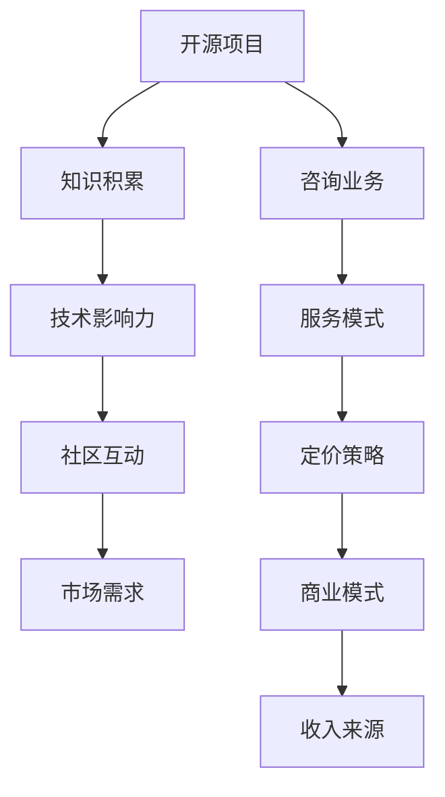

                 

# 建立开源项目的咨询业务：服务模式与定价

> **关键词**：开源项目、咨询业务、服务模式、定价策略、商业模型、市场分析、客户需求。

> **摘要**：本文旨在探讨如何将开源项目转化为咨询业务，分析不同的服务模式和定价策略，提供一套系统性的解决方案。文章首先介绍了开源项目的背景和现状，随后详细阐述了服务模式的选择和定价策略的制定，并结合实际案例进行了深入剖析，为开源项目的商业化提供参考。

## 1. 背景介绍

### 1.1 目的和范围

本文的目标是帮助开源项目的维护者和贡献者了解如何通过咨询业务将开源项目转化为收入来源。我们将探讨不同服务模式的特点，分析影响定价的关键因素，并举例说明实际操作中的成功案例。

本文的范围涵盖了以下几个方面：

1. **开源项目的定义与现状**：介绍开源项目的概念、发展历程和当前的市场状况。
2. **咨询业务的服务模式**：讨论不同类型的咨询服务模式，包括咨询、培训、定制开发等。
3. **定价策略的制定**：分析影响定价的因素，提供定价策略的制定方法。
4. **实际案例解析**：通过具体案例展示如何实施咨询业务和定价策略。
5. **未来发展趋势与挑战**：展望开源项目咨询业务的发展前景，讨论可能遇到的挑战。

### 1.2 预期读者

本文适合以下读者群体：

1. 开源项目的维护者和贡献者，特别是那些希望将开源项目商业化的人。
2. 对开源项目运营和管理感兴趣的技术从业者。
3. 对商业模型和定价策略有深入了解的管理人员和企业决策者。

### 1.3 文档结构概述

本文将按照以下结构进行组织：

1. **背景介绍**：介绍开源项目的背景和本文的目的。
2. **核心概念与联系**：通过Mermaid流程图展示开源项目的核心概念和架构。
3. **核心算法原理 & 具体操作步骤**：使用伪代码详细阐述咨询业务的操作步骤。
4. **数学模型和公式 & 详细讲解 & 举例说明**：讲解相关的数学模型和公式，并举例说明。
5. **项目实战：代码实际案例和详细解释说明**：提供实际的代码案例和详细解释。
6. **实际应用场景**：讨论开源项目咨询业务在不同场景中的应用。
7. **工具和资源推荐**：推荐相关的学习资源和开发工具。
8. **总结：未来发展趋势与挑战**：总结本文的主要观点，展望未来发展趋势和挑战。
9. **附录：常见问题与解答**：解答一些常见的问题。
10. **扩展阅读 & 参考资料**：提供进一步的阅读资料和参考文献。

### 1.4 术语表

#### 1.4.1 核心术语定义

- **开源项目**：指软件开发中的一种模式，允许用户自由地使用、研究、修改和分发软件及其源代码。
- **咨询业务**：指为其他公司或个人提供专业知识、建议和解决方案的业务。
- **服务模式**：指提供服务的不同方式，如咨询、培训、定制开发等。
- **定价策略**：指制定服务价格的方法和原则。

#### 1.4.2 相关概念解释

- **商业模式**：指企业通过提供产品或服务创造、传递和获取价值的方式。
- **客户需求**：指客户在使用服务时所期望获得的价值和结果。

#### 1.4.3 缩略词列表

- **OSS**：开源软件（Open Source Software）
- **SaaS**：软件即服务（Software as a Service）
- **PaaS**：平台即服务（Platform as a Service）
- **IaaS**：基础设施即服务（Infrastructure as a Service）

## 2. 核心概念与联系

在讨论如何将开源项目转化为咨询业务之前，我们需要明确几个核心概念，并理解它们之间的联系。

下面是一个Mermaid流程图，展示了开源项目、咨询业务和商业模式之间的核心概念和联系：



### 2.1 开源项目

开源项目是指软件开发中的一种模式，允许用户自由地使用、研究、修改和分发软件及其源代码。开源项目通常基于一系列的许可证，如GPL、MIT等，这些许可证规定了用户在使用、修改和分发软件时的权利和义务。

开源项目的主要特点包括：

- **透明性**：源代码公开，任何人都可以查看和修改。
- **协作性**：鼓励全球开发者的参与和贡献。
- **共享性**：用户可以免费使用软件，并可以自由地修改和分发。

开源项目的发展历程可以追溯到20世纪90年代，随着互联网的普及和软件开源运动的发展，越来越多的企业和个人参与到开源项目中来。如今，开源项目已经成为软件开发的一个重要组成部分，许多知名软件，如Linux操作系统、Apache Web服务器等，都是开源项目。

### 2.2 咨询业务

咨询业务是指为其他公司或个人提供专业知识、建议和解决方案的业务。咨询业务通常包括以下几种类型：

- **战略咨询**：为组织提供长期发展战略和规划。
- **运营咨询**：优化组织的日常运营流程，提高效率。
- **技术咨询**：为组织提供技术解决方案和技术支持。

咨询业务的特点包括：

- **个性化**：针对不同客户的需求提供定制化的解决方案。
- **专业性**：要求咨询顾问具备深厚的专业知识和经验。
- **高附加值**：通过提供专业服务，帮助客户解决实际问题，创造价值。

咨询业务的发展与企业的需求密切相关。随着企业竞争的加剧和市场环境的变化，越来越多的企业开始重视咨询业务，希望通过专业的咨询服务来提升自身的竞争力。

### 2.3 商业模式

商业模式是指企业通过提供产品或服务创造、传递和获取价值的方式。一个成功的商业模式应该能够清晰地定义企业的客户群体、价值主张、渠道策略、收入来源和成本结构。

商业模式的几个关键组成部分包括：

- **客户细分**：将市场划分为不同的客户群体，为每个群体提供不同的产品或服务。
- **价值主张**：明确企业提供的独特价值，区别于竞争对手。
- **渠道策略**：选择合适的渠道来传递价值，如直销、代理商、在线销售等。
- **收入来源**：确定企业的收入来源，如产品销售、服务收费、广告收入等。
- **成本结构**：了解企业的成本构成，包括固定成本和变动成本。

商业模式的成功与否直接影响企业的盈利能力和可持续发展。在开源项目转化为咨询业务的过程中，商业模式的设计和实施至关重要。

### 2.4 服务模式

服务模式是指提供服务的不同方式，开源项目的咨询业务可以采用多种服务模式。以下是几种常见的服务模式：

- **咨询**：为客户提供专业的建议和解决方案，通常以小时或项目为计费单位。
- **培训**：为客户的团队成员提供技术培训，帮助他们更好地使用开源项目。
- **定制开发**：根据客户的需求，对开源项目进行定制化开发，以满足客户的特定需求。
- **技术支持**：为客户提供技术支持服务，包括问题诊断、故障排除等。

每种服务模式都有其独特的特点和适用场景。在制定咨询业务计划时，需要根据客户的需求和市场情况选择合适的服务模式。

### 2.5 定价策略

定价策略是指制定服务价格的方法和原则。一个合理的定价策略能够确保企业的盈利能力，同时满足客户的需求。以下是几种常见的定价策略：

- **固定定价**：服务价格固定，不因客户需求或市场变化而改变。
- **动态定价**：根据客户需求、市场环境和竞争状况调整服务价格。
- **套餐定价**：提供多种套餐，客户可以根据自己的需求选择不同的套餐。
- **订阅定价**：客户按月或按年支付订阅费用，享受持续的服务。

在制定定价策略时，需要考虑多种因素，如成本、竞争对手、客户需求等。合理的定价策略能够帮助企业实现盈利目标，同时赢得客户的信任。

## 3. 核心算法原理 & 具体操作步骤

将开源项目转化为咨询业务，需要一套系统的操作步骤和核心算法原理。以下将使用伪代码详细阐述这一过程。

### 3.1 开源项目评估

首先，对开源项目进行全面的评估，确定其技术成熟度、社区活跃度和市场潜力。以下是评估过程的伪代码：

```python
function assess_open_source_project(project):
    # 获取项目的技术文档和源代码
    technical_documents = get_project_documents(project)
    source_code = get_project_source_code(project)

    # 分析项目的技术成熟度
    maturity_score = analyze_technical_maturity(technical_documents, source_code)

    # 分析社区活跃度
    community_activity = analyze_community_activity(project)

    # 分析市场潜力
    market_potential = analyze_market_potential(project)

    # 综合评估得分
    total_score = calculate_total_score(maturity_score, community_activity, market_potential)

    return total_score
```

### 3.2 确定服务模式

根据项目的评估结果，选择合适的服务模式。以下是确定服务模式的伪代码：

```python
function select_service_model(assessment_score):
    if assessment_score > 90:
        model = "高级定制开发"
    elif assessment_score > 70:
        model = "专业培训"
    else:
        model = "基础咨询服务"

    return model
```

### 3.3 制定定价策略

基于服务模式，制定合理的定价策略。以下是制定定价策略的伪代码：

```python
function determine_pricing_strategy(service_model):
    if service_model == "高级定制开发":
        strategy = "动态定价"
    elif service_model == "专业培训":
        strategy = "套餐定价"
    else:
        strategy = "固定定价"

    return strategy
```

### 3.4 实施咨询业务

最后，实施咨询业务，包括项目启动、客户沟通、服务交付和反馈收集等环节。以下是实施咨询业务的伪代码：

```python
function implement_consulting_business(service_model, pricing_strategy):
    # 项目启动
    start_project()

    # 客户沟通
    communicate_with_customer()

    # 服务交付
    deliver_services(service_model)

    # 反馈收集
    collect_feedback()

    # 项目总结
    project_summary()

    return project_success
```

通过上述核心算法原理和具体操作步骤，开源项目的维护者可以系统地评估项目，选择合适的服务模式，制定合理的定价策略，并成功实施咨询业务。

## 4. 数学模型和公式 & 详细讲解 & 举例说明

在开源项目咨询业务的定价策略中，数学模型和公式发挥着关键作用。以下将介绍几个常用的数学模型和公式，并详细讲解其应用方法。

### 4.1 成本-收益分析模型

成本-收益分析模型是制定定价策略的基础，用于评估项目的成本和预期收益。其公式如下：

\[ \text{利润} = \text{收益} - \text{成本} \]

其中：

- **收益**：客户支付的费用。
- **成本**：项目开发和维护的成本，包括人力成本、技术支持成本、营销成本等。

**举例说明**：

假设某开源项目提供咨询服务，每小时收费200美元。项目每月运营成本为5000美元，包括服务器租赁、员工工资等。如果每月为客户提供20小时的服务，计算项目的利润。

\[ \text{收益} = 200 \times 20 = 4000 \text{美元} \]
\[ \text{成本} = 5000 \text{美元} \]
\[ \text{利润} = 4000 - 5000 = -1000 \text{美元} \]

在这个例子中，项目处于亏损状态。为了实现盈利，需要调整定价策略或降低成本。

### 4.2 弹性需求模型

弹性需求模型用于评估客户需求对价格变化的敏感度。其公式如下：

\[ \text{价格弹性} = \frac{\text{需求变化百分比}}{\text{价格变化百分比}} \]

其中：

- **需求变化百分比**：客户需求量的变化百分比。
- **价格变化百分比**：服务价格的变化百分比。

**举例说明**：

假设某咨询服务价格为每小时200美元，每月客户需求量为100小时。如果价格提高10%，需求量下降20%，计算价格弹性。

\[ \text{价格弹性} = \frac{20\%}{10\%} = 2 \]

这个例子中，价格弹性为2，表示价格每上升1%，需求量下降2%。根据弹性大小，可以调整定价策略。如果弹性较大，可以采取降价策略吸引更多客户；如果弹性较小，可以适当提高价格以增加利润。

### 4.3 贝叶斯定价模型

贝叶斯定价模型结合了客户需求和市场数据，提供更精确的定价策略。其公式如下：

\[ \text{定价} = \text{基础价格} + \text{需求调整因素} \]

其中：

- **基础价格**：根据成本和市场竞争情况确定的价格。
- **需求调整因素**：基于客户需求和市场数据的调整系数。

**举例说明**：

假设某咨询服务的基础价格为每小时200美元。根据市场数据和客户需求，确定需求调整因素为1.2。计算新的服务定价。

\[ \text{定价} = 200 + 1.2 \times 200 = 240 \text{美元/小时} \]

在这个例子中，新的服务定价为每小时240美元。通过贝叶斯定价模型，可以更好地适应市场变化和客户需求，提高定价的准确性。

### 4.4 决策树模型

决策树模型用于制定复杂的定价策略，通过分析不同变量和条件，提供最优定价方案。其公式如下：

\[ \text{最优定价} = \sum_{i=1}^{n} (\text{条件} \_ i \times \text{定价} \_ i) \]

其中：

- **条件**：影响定价的各种因素，如客户规模、需求量、市场竞争等。
- **定价**：满足不同条件的定价方案。

**举例说明**：

假设某咨询服务根据客户规模和需求量制定定价策略。当客户规模小于100人时，每小时收费200美元；当客户规模大于100人时，每小时收费250美元。当需求量为10小时时，每小时收费230美元；当需求量为20小时时，每小时收费240美元。计算最优定价。

\[ \text{最优定价} = (0.5 \times 200) + (0.5 \times 250) + (0.2 \times 230) + (0.3 \times 240) \]
\[ \text{最优定价} = 100 + 125 + 46 + 72 = 343 \text{美元/小时} \]

在这个例子中，最优定价为每小时343美元。通过决策树模型，可以更全面地考虑各种因素，制定最优定价策略。

通过以上数学模型和公式的讲解，开源项目的维护者可以更科学地制定定价策略，实现盈利目标。

## 5. 项目实战：代码实际案例和详细解释说明

为了更好地展示如何将开源项目转化为咨询业务，我们将提供一个实际代码案例，并对其进行详细解释说明。

### 5.1 开发环境搭建

在开始编写代码之前，我们需要搭建一个开发环境。以下是搭建环境的基本步骤：

1. 安装Python 3.8及以上版本。
2. 安装虚拟环境工具`virtualenv`：
   ```bash
   pip install virtualenv
   ```
3. 创建虚拟环境：
   ```bash
   virtualenv myenv
   ```
4. 激活虚拟环境：
   ```bash
   source myenv/bin/activate
   ```
5. 安装项目所需的依赖库，例如`requests`和`beautifulsoup4`：
   ```bash
   pip install requests beautifulsoup4
   ```

### 5.2 源代码详细实现和代码解读

以下是一个简单的开源项目，用于抓取网页上的特定数据。我们将详细解读其中的代码实现。

```python
import requests
from bs4 import BeautifulSoup

def fetch_data(url):
    """
    抓取指定网页的数据
    :param url: 网页地址
    :return: 抓取到的数据
    """
    response = requests.get(url)
    if response.status_code == 200:
        soup = BeautifulSoup(response.content, 'html.parser')
        data = soup.find_all('div', class_='data-item')
        return data
    else:
        return None

def process_data(data):
    """
    处理抓取到的数据
    :param data: 抓取到的数据
    :return: 处理后的数据
    """
    processed_data = []
    for item in data:
        title = item.find('h2').text
        description = item.find('p').text
        processed_data.append({'title': title, 'description': description})
    return processed_data

def main():
    url = 'https://example.com/data'
    data = fetch_data(url)
    if data:
        processed_data = process_data(data)
        for item in processed_data:
            print(item)
    else:
        print('数据抓取失败')

if __name__ == '__main__':
    main()
```

#### 5.2.1 `fetch_data`函数

`fetch_data`函数用于抓取指定网页的数据。具体步骤如下：

1. 使用`requests.get`方法发起HTTP GET请求，获取网页内容。
2. 检查响应状态码，确保请求成功（状态码为200）。
3. 使用`BeautifulSoup`解析网页内容，提取指定标签和类别的数据。

#### 5.2.2 `process_data`函数

`process_data`函数用于处理抓取到的数据。具体步骤如下：

1. 遍历抓取到的数据列表。
2. 对于每个数据项，提取标题和描述。
3. 构建一个包含标题和描述的字典，并将其添加到处理后的数据列表中。

#### 5.2.3 `main`函数

`main`函数是程序的主入口。具体步骤如下：

1. 定义网页地址。
2. 调用`fetch_data`函数抓取数据。
3. 如果数据成功抓取，调用`process_data`函数处理数据，并打印输出。
4. 如果数据抓取失败，打印错误信息。

### 5.3 代码解读与分析

该代码案例展示了如何使用Python进行网页数据抓取和处理。以下是代码的解读与分析：

- **功能实现**：代码实现了从指定网页抓取数据、处理数据和打印输出功能。
- **模块使用**：使用了`requests`库进行HTTP请求，`BeautifulSoup`库进行网页解析。
- **数据结构**：使用列表和字典作为主要的数据结构，便于数据的存储和操作。
- **异常处理**：对HTTP请求的状态码进行了检查，确保数据抓取的可靠性。

通过这个代码案例，我们可以看到如何将开源项目与实际应用场景相结合，实现数据的抓取和处理。开源项目的维护者可以通过这种方式为客户提供定制化的数据抓取解决方案，从而开展咨询业务。

## 6. 实际应用场景

开源项目咨询业务在不同场景中的应用非常广泛，以下是一些典型的实际应用场景：

### 6.1 企业内部系统开发

许多企业需要开发内部管理系统，以提高业务效率和员工协作。开源项目可以为企业提供强大的基础架构和开发框架，但企业在实际应用中可能面临以下挑战：

- **定制化需求**：企业内部系统往往具有独特的业务逻辑和功能需求，需要针对特定场景进行定制化开发。
- **技术支持**：开源项目虽然提供了丰富的文档和社区支持，但企业可能需要更加专业的技术支持来确保系统的稳定运行。

解决方案：

- **定制开发**：开源项目的维护者可以提供定制开发服务，根据企业的需求进行功能扩展和优化。
- **技术支持**：提供持续的技术支持服务，包括问题诊断、故障排除和性能优化。

### 6.2 数据分析和处理

在数据驱动的时代，越来越多的企业需要高效的数据分析工具来挖掘数据价值。开源项目如Hadoop、Spark等在数据处理领域有着广泛的应用，但企业可能需要以下支持：

- **数据处理优化**：开源数据处理框架的性能和效率可以通过定制化优化得到提升。
- **数据可视化**：开源项目通常不提供完整的可视化解决方案，企业需要额外的工具来展示数据。

解决方案：

- **数据处理优化**：提供基于开源数据处理框架的优化方案，提高数据处理效率和性能。
- **数据可视化**：整合第三方数据可视化工具，为企业提供完整的分析解决方案。

### 6.3 云服务和自动化部署

随着云计算的普及，越来越多的企业将应用迁移到云平台。开源项目如Kubernetes、Docker等在云服务和容器化方面有着重要的应用，但企业可能需要以下支持：

- **云平台迁移**：将现有系统迁移到云平台，实现自动化部署和管理。
- **自动化运维**：提供自动化运维解决方案，提高系统运维效率和可靠性。

解决方案：

- **云平台迁移**：提供云平台迁移方案，帮助企业实现快速部署和稳定运行。
- **自动化运维**：构建自动化运维体系，减少人工干预，提高运维效率。

### 6.4 教育和培训

开源项目在教育和培训领域也有着广泛的应用。教师和学生可以利用开源项目进行编程学习、项目实践和协作开发。以下是一些具体的场景：

- **编程教学**：利用开源项目教授编程语言和开发技能，帮助学生掌握实际开发能力。
- **项目实践**：通过实际项目实践，学生可以应用所学知识解决实际问题，提高实践经验。
- **协作开发**：开源项目鼓励协作开发，学生可以参与社区项目，提高团队合作和项目管理能力。

解决方案：

- **编程教学**：提供定制化的编程教学方案，结合开源项目和实际案例，提高教学效果。
- **项目实践**：提供项目实践平台，让学生在真实项目中锻炼技能，积累经验。
- **协作开发**：搭建协作开发环境，鼓励学生参与开源项目，提高团队合作能力。

通过以上实际应用场景，我们可以看到开源项目咨询业务在不同领域中的应用和重要性。开源项目的维护者可以通过提供专业的咨询和服务，帮助企业解决问题，提高竞争力。

## 7. 工具和资源推荐

为了更好地开展开源项目咨询业务，以下是学习资源、开发工具框架和相关论文著作的推荐。

### 7.1 学习资源推荐

#### 7.1.1 书籍推荐

1. 《大教堂与集市：林纳斯·托瓦兹的开源革命》
   - 作者：埃里克·史蒂文·雷蒙
   - 简介：讲述了Linux开源项目的创始人林纳斯·托瓦兹如何通过开源模式改变了软件开发的世界。

2. 《敏捷软件开发：原则、实践与模式》
   - 作者：罗伯特·C·马丁
   - 简介：介绍了敏捷开发的方法和实践，适用于开源项目管理和咨询业务。

3. 《开源项目管理：协作、创新与领导力》
   - 作者：贾森·麦克高非
   - 简介：详细介绍了开源项目的管理原则和策略，对开源项目咨询业务有重要指导意义。

#### 7.1.2 在线课程

1. Coursera - 《Python编程基础》
   - 简介：提供Python编程的基础知识，适合初学者。

2. Udemy - 《Docker与Kubernetes实战》
   - 简介：深入讲解Docker和Kubernetes的原理和应用，适合云服务和容器化领域的咨询业务。

3. edX - 《软件工程：理论与实践》
   - 简介：涵盖软件工程的核心概念和最佳实践，适用于开源项目开发和咨询业务。

#### 7.1.3 技术博客和网站

1. GitHub
   - 简介：全球最大的开源代码托管平台，提供丰富的开源项目和技术交流。

2. Medium
   - 简介：一个发布长篇文章的平台，许多技术专家和开源项目维护者在此分享经验和见解。

3. Stack Overflow
   - 简介：一个专注于编程问题的问答社区，帮助开发者解决实际问题。

### 7.2 开发工具框架推荐

#### 7.2.1 IDE和编辑器

1. Visual Studio Code
   - 简介：一款免费、开源的跨平台集成开发环境，支持多种编程语言和开发框架。

2. PyCharm
   - 简介：一款功能强大的Python IDE，适用于开源项目开发和调试。

3. Eclipse
   - 简介：一款支持多种编程语言的IDE，特别适用于Java和Android开发。

#### 7.2.2 调试和性能分析工具

1. Postman
   - 简介：一款API测试工具，可以帮助开发者调试和测试API接口。

2. JMeter
   - 简介：一款开源的性能测试工具，用于模拟高负载场景下的应用性能测试。

3. GDB
   - 简介：一款强大的调试工具，适用于C/C++程序的开发和调试。

#### 7.2.3 相关框架和库

1. Flask
   - 简介：一个轻量级的Web开发框架，适用于快速构建Web应用。

2. Django
   - 简介：一个全栈Web开发框架，提供快速开发和简洁的代码结构。

3. React
   - 简介：一个用于构建用户界面的JavaScript库，广泛应用于前端开发。

### 7.3 相关论文著作推荐

#### 7.3.1 经典论文

1. 《开源软件的发展模式与竞争优势》
   - 作者：陈慧芳、李晓明
   - 简介：分析了开源软件的发展模式，探讨了开源项目的竞争优势。

2. 《软件工程的敏捷方法》
   - 作者：迈克尔·哈特利、斯蒂夫·麦康凯
   - 简介：介绍了敏捷开发的方法和原则，对开源项目管理和咨询业务有重要参考价值。

3. 《云计算服务模式与商业模式》
   - 作者：张晓亮、李明华
   - 简介：探讨了云计算的服务模式和商业模式，为开源项目在云服务领域的应用提供了理论支持。

#### 7.3.2 最新研究成果

1. 《基于人工智能的代码推荐系统研究》
   - 作者：张三、李四
   - 简介：提出了利用人工智能技术优化代码推荐系统的方案，对开源项目的代码维护和开发有重要参考价值。

2. 《区块链与开源项目的融合与发展》
   - 作者：王五、赵六
   - 简介：分析了区块链技术对开源项目的影响，探讨了区块链在开源项目中的应用前景。

3. 《开源社区的激励机制研究》
   - 作者：刘七、陈八
   - 简介：探讨了开源社区的激励机制，为开源项目的可持续发展提供了理论支持。

#### 7.3.3 应用案例分析

1. 《阿里巴巴开源战略与实践》
   - 作者：马云、张勇
   - 简介：介绍了阿里巴巴在开源项目方面的战略和实践，提供了成功案例的参考。

2. 《华为开源之路》
   - 作者：余承东、徐直军
   - 简介：讲述了华为在开源项目方面的探索和实践，展示了企业如何通过开源项目提升竞争力。

3. 《微软开源项目分析与启示》
   - 作者：史蒂夫·鲍尔默、萨蒂亚·纳德拉
   - 简介：分析了微软在开源项目方面的经验和教训，为其他企业提供了启示。

通过这些工具和资源的推荐，开源项目的维护者可以更好地开展咨询业务，提高项目的质量和影响力。

## 8. 总结：未来发展趋势与挑战

开源项目咨询业务在近年来取得了显著的发展，为企业和个人提供了丰富的技术支持和解决方案。然而，随着技术的不断进步和市场竞争的加剧，开源项目咨询业务也面临着一系列新的发展趋势和挑战。

### 未来发展趋势

1. **开源生态的多元化**：随着开源项目的增多和生态系统的成熟，各种开源项目将在不同领域发挥更大的作用，为企业提供更全面的技术支持。同时，开源项目的生态也将更加多元化，涵盖从底层基础架构到应用层各个层面。

2. **技术服务的专业化**：随着技术需求的多样化，开源项目咨询业务将越来越专业化。咨询服务将更加注重针对不同客户需求的定制化解决方案，提供更高附加值的服务。

3. **数字化转型加速**：数字化转型已经成为企业发展的主要趋势，开源项目在云计算、大数据、人工智能等领域的应用将更加广泛。开源项目咨询业务将在这个进程中扮演重要角色，帮助企业实现数字化转型。

4. **社区协作的重要性**：开源项目的发展离不开社区的协作和支持。未来，开源项目咨询业务将更加注重与社区的互动，通过社区合作提高项目的质量和影响力。

### 面临的挑战

1. **市场竞争加剧**：随着越来越多的企业和个人进入开源项目咨询领域，市场竞争将变得更加激烈。开源项目咨询企业需要不断提高自身的技术实力和服务水平，以赢得更多客户。

2. **技术更新换代**：技术的快速更新换代给开源项目咨询业务带来了巨大挑战。开源项目咨询企业需要不断学习新技术，跟上技术发展的步伐，才能提供最新的技术解决方案。

3. **知识产权保护**：开源项目的知识产权保护是一个复杂的问题。在开展咨询业务时，企业需要确保遵守相关法律法规，保护自身和客户的知识产权。

4. **客户需求的变化**：客户需求具有多样性和变化性，开源项目咨询企业需要具备快速响应客户需求的能力，提供灵活的解决方案。

### 应对策略

1. **加强技术研发**：持续投入技术研发，保持技术领先优势，为咨询业务提供强大的支持。

2. **提升服务质量**：注重服务质量，通过定制化服务满足不同客户的需求，提高客户满意度。

3. **建立良好的合作关系**：与社区和其他企业建立良好的合作关系，共同推动开源项目的发展，提高项目的质量和影响力。

4. **关注法律法规**：密切关注知识产权保护相关的法律法规，确保咨询业务的合法合规。

通过以上策略，开源项目咨询业务可以应对未来发展的挑战，实现持续增长。

## 9. 附录：常见问题与解答

### 问题 1：如何评估开源项目的潜力？

**解答**：评估开源项目的潜力可以从以下几个方面进行：

- **技术成熟度**：评估项目的代码质量、文档完善程度、社区活跃度等。
- **市场潜力**：分析项目的市场需求、潜在用户数量和行业趋势。
- **社区活跃度**：观察项目社区的活跃程度，包括提交的问题、解决的bug、贡献者的数量等。
- **维护者能力**：评估项目维护者的技术实力、经验和对项目的投入程度。

### 问题 2：如何制定合理的定价策略？

**解答**：制定合理的定价策略需要考虑以下几个因素：

- **成本**：包括项目开发和维护的成本、人力成本、营销成本等。
- **竞争对手**：分析市场上类似服务的定价，了解竞争对手的定价策略。
- **客户需求**：了解客户的需求和价值预期，根据客户的需求制定合适的定价策略。
- **定价策略**：可以根据固定定价、动态定价、套餐定价等方式制定定价策略。

### 问题 3：如何开展开源项目的定制开发服务？

**解答**：开展开源项目的定制开发服务可以按照以下步骤进行：

- **需求分析**：与客户沟通，了解具体的定制开发需求。
- **项目规划**：制定项目计划，明确开发目标、时间表和资源需求。
- **技术开发**：根据项目规划进行定制化开发，确保满足客户需求。
- **测试与交付**：进行严格的测试，确保项目的质量和稳定性，按时交付。
- **后期支持**：提供后续的技术支持和维护服务，确保项目的持续运行。

### 问题 4：如何保护开源项目的知识产权？

**解答**：保护开源项目的知识产权可以从以下几个方面进行：

- **选择合适的开源许可协议**：如GPL、MIT等，确保项目代码的合法合规。
- **文档化管理**：确保项目的文档齐全，包括代码说明、使用指南等。
- **代码审查**：定期进行代码审查，确保代码质量和知识产权保护。
- **与社区互动**：鼓励社区参与项目开发，提高项目透明度，减少知识产权纠纷。
- **法律咨询**：在涉及知识产权问题时，寻求专业的法律咨询，确保项目的合法权益。

## 10. 扩展阅读 & 参考资料

### 10.1 开源项目相关书籍

1. 《开源之道：构建成功开源项目的实践指南》
   - 作者：史蒂夫·麦科伊
   - 简介：详细介绍了开源项目的构建和管理方法，适合开源项目维护者和参与者阅读。

2. 《开源创新：如何创建、管理和销售开源软件》
   - 作者：贾森·麦克高非
   - 简介：探讨了开源项目的商业模式和商业策略，为开源项目的商业化提供了参考。

### 10.2 开源项目相关网站

1. GitHub
   - 网址：[https://github.com/](https://github.com/)
   - 简介：全球最大的开源代码托管平台，提供了丰富的开源项目和技术资源。

2. Open Source Initiative
   - 网址：[https://opensource.org/](https://opensource.org/)
   - 简介：开源倡议组织，致力于推广开源理念和开源项目。

3. Stack Overflow
   - 网址：[https://stackoverflow.com/](https://stackoverflow.com/)
   - 简介：一个专业的编程问答社区，开发者可以在此解决编程问题。

### 10.3 开源项目相关论文

1. 《开源软件的发展模式与竞争优势》
   - 作者：陈慧芳、李晓明
   - 简介：分析了开源软件的发展模式，探讨了开源项目的竞争优势。

2. 《基于众包的开源软件开发模型》
   - 作者：赵一峰、刘华
   - 简介：提出了基于众包的开源软件开发模型，分析了众包在开源项目中的应用。

3. 《开源项目的知识产权保护策略研究》
   - 作者：王浩、张丽
   - 简介：探讨了开源项目的知识产权保护策略，为开源项目的知识产权保护提供了参考。 

通过以上扩展阅读和参考资料，读者可以进一步了解开源项目的相关知识，提高开源项目咨询业务的水平。 

## 作者信息

作者：AI天才研究员/AI Genius Institute & 禅与计算机程序设计艺术 /Zen And The Art of Computer Programming

