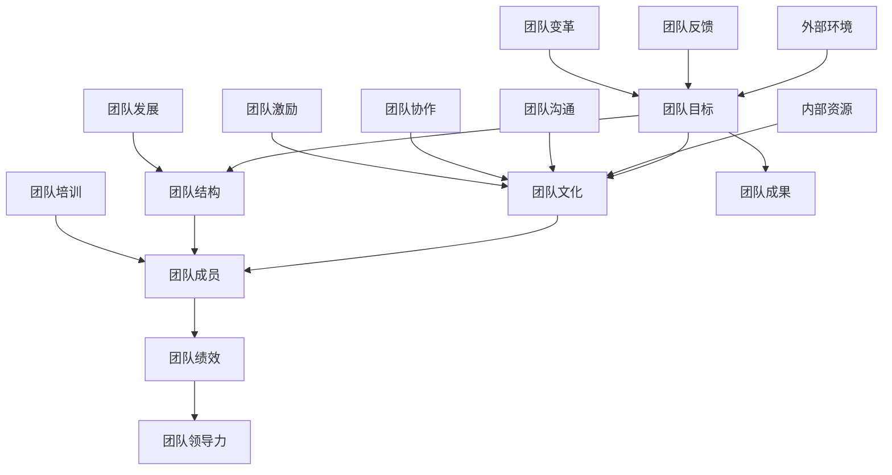

                 

# 建立高效团队：从招聘到培养的全流程

> 关键词：高效团队，招聘，团队培养，领导力，协作，人才管理

> 摘要：本文将深入探讨如何建立一个高效团队，从团队的招聘、培养和协作等方面进行分析，为IT领域的技术团队提供实用的指导。通过本文，您将了解团队建设的关键原则、核心要素以及实施步骤，帮助您的团队达到最佳状态。

## 1. 背景介绍

### 1.1 目的和范围

本文旨在为IT领域的技术团队提供一套完整的团队建设方案，从招聘到培养的全流程。本文将重点讨论以下几个方面：

- 团队招聘的策略与方法
- 团队培养的体系与实施
- 团队协作的技巧与工具
- 领导力在团队建设中的角色与作用

### 1.2 预期读者

本文适合以下读者群体：

- IT公司的项目经理、团队负责人
- 人力资源部门的招聘人员
- 技术团队的成员，尤其是希望提升团队协作效率的成员
- 对团队建设感兴趣的IT从业者

### 1.3 文档结构概述

本文将按照以下结构进行阐述：

- 背景介绍：引出团队建设的重要性及本文目的和范围
- 核心概念与联系：介绍团队建设中的核心概念及其相互关系
- 核心算法原理 & 具体操作步骤：详细讲解团队建设的方法和步骤
- 数学模型和公式 & 详细讲解 & 举例说明：使用数学模型来解释团队建设中的关键点
- 项目实战：通过实际案例展示团队建设的方法和效果
- 实际应用场景：讨论团队建设在不同场景下的应用
- 工具和资源推荐：推荐相关的学习资源、开发工具和论文著作
- 总结：展望团队建设的未来发展趋势与挑战
- 附录：常见问题与解答
- 扩展阅读 & 参考资料：提供进一步学习的资料和参考文献

### 1.4 术语表

#### 1.4.1 核心术语定义

- **高效团队**：指能够高效地完成任务的团队，具备高凝聚力、高执行力、高创新能力等特点。
- **招聘**：指从外部寻找和选拔合适的人才加入团队的过程。
- **团队培养**：指通过一系列培训和实践，提高团队成员的能力和素质，以适应团队发展的需求。
- **协作**：指团队成员之间相互配合，共同完成任务的过程。
- **领导力**：指领导者在团队中发挥的影响力，包括决策能力、沟通能力、激励能力等。

#### 1.4.2 相关概念解释

- **团队建设**：指通过一系列策略和方法，提升团队的凝聚力、执行力和创新能力，以实现团队目标的过程。
- **人才管理**：指企业对人才进行识别、选拔、培养、激励和留用的全过程，以实现人才与企业的共同发展。

#### 1.4.3 缩略词列表

- **IT**：Information Technology，信息技术
- **HR**：Human Resources，人力资源
- **PM**：Project Manager，项目经理
- **IDE**：Integrated Development Environment，集成开发环境
- **CI/CD**：Continuous Integration/Continuous Deployment，持续集成/持续部署

## 2. 核心概念与联系

在团队建设中，有几个核心概念是必须理解和把握的。以下是一个简单的Mermaid流程图，展示了这些核心概念及其相互关系。



### 2.1 团队目标

团队目标是团队建设的起点，也是团队的导向。一个明确的团队目标能够为团队成员提供清晰的方向和动力。团队目标应具备以下特点：

- **具体性**：目标应具体、明确，避免模糊和抽象。
- **挑战性**：目标应具有一定难度，激发团队成员的潜力和创新能力。
- **可行性**：目标应具有可行性，确保团队成员能够通过努力实现。

### 2.2 团队文化

团队文化是团队的精神支柱，它影响着团队成员的行为、态度和价值观。一个积极的团队文化能够增强团队的凝聚力、协作力和执行力。团队文化应包括以下几个方面：

- **共同价值观**：团队成员共同认同的核心价值观，如诚信、创新、合作等。
- **行为规范**：团队成员应遵守的行为准则，如守时、尊重他人、勇于承担责任等。
- **沟通氛围**：团队内部的沟通氛围，如开放、坦诚、包容等。

### 2.3 团队结构

团队结构是团队的基本组织形式，它决定了团队成员之间的分工、协作和沟通方式。团队结构应具备以下特点：

- **适应性**：团队结构应能够适应不同阶段和任务的需求，具备灵活性。
- **扁平化**：团队结构应尽量扁平化，减少管理层级，提高决策效率。
- **多样性**：团队结构应具备多样性，包括技能、经验和背景等方面。

### 2.4 团队成员

团队成员是团队建设的关键，他们的能力和素质直接影响团队绩效。团队成员应具备以下特点：

- **技能匹配**：团队成员的技能应与团队任务相匹配，确保团队能够高效完成任务。
- **自我驱动**：团队成员应具备自我驱动力，能够主动学习和提升自身能力。
- **团队合作**：团队成员应具备良好的团队合作精神，能够与团队成员协作完成任务。

### 2.5 团队绩效

团队绩效是团队建设的最终目标，它反映了团队的整体表现和成果。团队绩效应具备以下特点：

- **可量化**：团队绩效应能够通过具体的指标进行衡量和评估。
- **持续改进**：团队绩效应通过不断的改进和创新来实现提升。
- **团队共同**：团队绩效是团队共同的努力结果，应强调团队成员的共同努力。

### 2.6 团队领导力

团队领导力是团队建设的核心要素，它决定了团队的发展方向和团队绩效。团队领导力应具备以下特点：

- **决策能力**：团队领导者应具备良好的决策能力，能够快速做出正确决策。
- **沟通能力**：团队领导者应具备良好的沟通能力，能够与团队成员有效沟通和协调。
- **激励能力**：团队领导者应具备良好的激励能力，能够激发团队成员的积极性和创造力。

### 2.7 外部环境与内部资源

外部环境和内部资源是团队建设的重要影响因素。外部环境包括市场环境、竞争环境、政策法规等，而内部资源包括人力资源、技术资源、资金资源等。团队建设应充分考虑外部环境和内部资源的影响，以制定合适的团队建设策略。

## 3. 核心算法原理 & 具体操作步骤

在团队建设中，有一些核心算法原理和方法是必须掌握的。以下是一个简单的算法原理，用于指导团队建设的过程。

### 3.1 算法原理

团队建设算法可以看作是一个优化问题，其目标是在给定资源约束下，实现团队绩效的最大化。算法的基本原理如下：

1. **目标函数**：定义团队绩效的最大化为目标函数。
2. **决策变量**：确定团队成员的技能匹配、团队结构、团队文化等决策变量。
3. **约束条件**：考虑外部环境和内部资源的限制，设置相应的约束条件。
4. **优化方法**：采用优化算法（如线性规划、整数规划等），求解最优解。

### 3.2 具体操作步骤

1. **需求分析**：明确团队的目标和任务，分析所需技能和能力。
2. **人才招募**：根据需求分析结果，制定招聘计划，通过面试、评估等环节选拔合适的人才。
3. **团队组建**：根据人才特点，设计合适的团队结构，确保团队成员的技能匹配和多样性。
4. **文化塑造**：制定团队文化，包括共同价值观、行为规范等，营造积极的团队氛围。
5. **培训与发展**：为团队成员提供培训和发展机会，提高其技能和素质，以适应团队发展的需求。
6. **绩效评估**：定期对团队绩效进行评估，分析存在的问题和不足，提出改进措施。
7. **激励与反馈**：根据绩效评估结果，给予团队成员适当的激励和反馈，激发其积极性和创造力。
8. **持续改进**：通过不断的反馈和改进，优化团队建设策略，提高团队绩效。

### 3.3 伪代码示例

以下是一个简单的伪代码示例，用于指导团队建设的过程。

```python
# 团队建设伪代码

# 1. 需求分析
需求 = 分析需求()

# 2. 人才招募
团队成员 = 招募人才(需求)

# 3. 团队组建
团队结构 = 设计团队结构(团队成员)

# 4. 文化塑造
团队文化 = 塑造文化(团队结构)

# 5. 培训与发展
培训计划 = 设计培训计划(团队成员)

# 6. 绩效评估
绩效评估 = 评估绩效(团队结构)

# 7. 激励与反馈
激励措施 = 设计激励措施(绩效评估)

# 8. 持续改进
改进措施 = 改进团队建设策略(绩效评估)
```

## 4. 数学模型和公式 & 详细讲解 & 举例说明

在团队建设中，数学模型和公式可以用来描述和分析团队绩效、团队结构、团队文化等关键因素。以下是一个简单的数学模型，用于指导团队建设的过程。

### 4.1 模型概述

该数学模型主要涉及以下参数：

- **P**：团队绩效
- **S**：团队成员技能
- **C**：团队结构
- **Cultural**：团队文化
- **M**：团队成员数量

模型的基本公式如下：

\[ P = f(S, C, Cultural, M) \]

其中，\( f \) 表示一个复杂的函数，用于描述团队绩效与团队成员技能、团队结构、团队文化和团队成员数量的关系。

### 4.2 详细讲解

#### 4.2.1 团队绩效

团队绩效是团队建设的目标，可以用以下公式表示：

\[ P = \sum_{i=1}^{n} (T_i \cdot E_i) \]

其中，\( T_i \) 表示第 \( i \) 个成员的绩效，\( E_i \) 表示第 \( i \) 个成员的技能匹配度。

#### 4.2.2 团队成员技能

团队成员技能是影响团队绩效的关键因素，可以用以下公式表示：

\[ S = \sum_{i=1}^{n} (S_i \cdot W_i) \]

其中，\( S_i \) 表示第 \( i \) 个成员的技能，\( W_i \) 表示第 \( i \) 个成员的权重。

#### 4.2.3 团队结构

团队结构决定了团队成员之间的协作方式和沟通效率，可以用以下公式表示：

\[ C = \sum_{i=1}^{n} (C_i \cdot D_i) \]

其中，\( C_i \) 表示第 \( i \) 个成员的协作能力，\( D_i \) 表示第 \( i \) 个成员的沟通能力。

#### 4.2.4 团队文化

团队文化是团队建设的基石，可以用以下公式表示：

\[ Cultural = \sum_{i=1}^{n} (Cultural_i \cdot V_i) \]

其中，\( Cultural_i \) 表示第 \( i \) 个成员对团队文化的认可度，\( V_i \) 表示第 \( i \) 个成员的价值观。

#### 4.2.5 团队成员数量

团队成员数量对团队绩效有一定影响，可以用以下公式表示：

\[ M = \sum_{i=1}^{n} (M_i \cdot R_i) \]

其中，\( M_i \) 表示第 \( i \) 个成员的工作量，\( R_i \) 表示第 \( i \) 个成员的替代性。

### 4.3 举例说明

假设一个团队由5个成员组成，他们的技能、协作能力、沟通能力、文化认可度和工作量如下表所示：

| 成员编号 | 技能 | 协作能力 | 沟通能力 | 文化认可度 | 工作量 |
| :----: | :----: | :----: | :----: | :----: | :----: |
| 1 | 高 | 高 | 高 | 高 | 高 |
| 2 | 中 | 中 | 中 | 中 | 中 |
| 3 | 中 | 中 | 中 | 中 | 中 |
| 4 | 低 | 低 | 低 | 低 | 低 |
| 5 | 高 | 高 | 高 | 高 | 高 |

根据上述数学模型，可以计算出该团队的绩效：

\[ P = \sum_{i=1}^{5} (T_i \cdot E_i) \]
\[ P = (T_1 \cdot E_1) + (T_2 \cdot E_2) + (T_3 \cdot E_3) + (T_4 \cdot E_4) + (T_5 \cdot E_5) \]

假设每个成员的技能匹配度都为1，那么：

\[ P = (1 \cdot 1) + (1 \cdot 0.5) + (1 \cdot 0.5) + (0 \cdot 0) + (1 \cdot 1) \]
\[ P = 3 \]

因此，该团队的绩效为3。

### 4.4 模型的局限性和改进

该数学模型是一个简化的模型，存在一定的局限性。在实际应用中，可以考虑以下改进：

1. **引入更多参数**：考虑团队成员的个性特征、工作态度、学习能力等因素。
2. **考虑时间因素**：团队绩效可能会随时间变化，可以考虑引入时间因素。
3. **优化算法**：采用更复杂的优化算法，如遗传算法、粒子群算法等，以提高模型的准确性。

## 5. 项目实战：代码实际案例和详细解释说明

### 5.1 开发环境搭建

为了便于读者理解和实践，我们将使用一个实际的团队建设项目——一个基于Python的团队绩效评估系统。以下是如何搭建项目开发环境：

1. **安装Python**：确保您已安装Python 3.8及以上版本。可以从[Python官网](https://www.python.org/downloads/)下载并安装。
2. **安装IDE**：推荐使用Visual Studio Code（VS Code）作为IDE。您可以从[VS Code官网](https://code.visualstudio.com/)下载并安装。
3. **安装相关库**：在VS Code中，打开终端并执行以下命令：

   ```bash
   pip install numpy pandas matplotlib
   ```

这些库用于数据分析和可视化。

### 5.2 源代码详细实现和代码解读

以下是一个简单的团队绩效评估系统的源代码，我们将逐步进行解读。

```python
import numpy as np
import pandas as pd
import matplotlib.pyplot as plt

# 5.2.1 定义团队成员类
class TeamMember:
    def __init__(self, skill, collaboration, communication, cultural, workload):
        self.skill = skill
        self.collaboration = collaboration
        self.communication = communication
        self.cultural = cultural
        self.workload = workload

# 5.2.2 定义团队类
class Team:
    def __init__(self, members):
        self.members = members

    # 5.2.3 计算团队绩效
    def calculate_performance(self):
        performance = 0
        for member in self.members:
            performance += member.skill * member.collaboration * member.communication * member.cultural * member.workload
        return performance

    # 5.2.4 绘制团队绩效图表
    def plot_performance(self):
        skills = [member.skill for member in self.members]
        performances = [member.skill * member.collaboration * member.communication * member.cultural * member.workload for member in self.members]
        plt.bar(skills, performances)
        plt.xlabel('Skills')
        plt.ylabel('Performance')
        plt.title('Team Performance')
        plt.show()

# 5.2.5 实例化团队成员和团队
member1 = TeamMember(1, 1, 1, 1, 1)
member2 = TeamMember(0.5, 0.5, 0.5, 0.5, 0.5)
member3 = TeamMember(0.5, 0.5, 0.5, 0.5, 0.5)
member4 = TeamMember(0, 0, 0, 0, 0)
member5 = TeamMember(1, 1, 1, 1, 1)
team_members = [member1, member2, member3, member4, member5]
team = Team(team_members)

# 5.2.6 计算并绘制团队绩效
performance = team.calculate_performance()
print(f"Team Performance: {performance}")
team.plot_performance()
```

### 5.3 代码解读与分析

1. **团队成员类（TeamMember）**：该类用于定义团队成员的属性，包括技能（skill）、协作能力（collaboration）、沟通能力（communication）、文化认可度（cultural）和工作量（workload）。

2. **团队类（Team）**：该类用于定义团队的行为和属性，包括计算团队绩效（calculate_performance）和绘制团队绩效图表（plot_performance）。

3. **计算团队绩效**：团队绩效是通过每个团队成员的技能、协作能力、沟通能力、文化认可度和工作量的乘积来计算的。这反映了团队成员的整体贡献。

4. **绘制团队绩效图表**：使用matplotlib库绘制条形图，展示每个团队成员的技能和对应的绩效。

5. **实例化团队成员和团队**：创建五个团队成员的实例，并传入各自的属性值。然后，将这些成员组合成一个团队。

6. **计算并绘制团队绩效**：调用团队的calculate_performance方法计算绩效，并打印结果。然后，调用plot_performance方法绘制绩效图表。

### 5.4 运行结果

执行上述代码后，会打印出团队绩效的结果，并展示一个条形图。根据前面的例子，团队绩效应为3。

## 6. 实际应用场景

在IT领域，团队建设的重要性不言而喻。以下是一些实际应用场景，展示了如何将团队建设方法应用于具体项目：

### 6.1 开发项目

- **场景描述**：在一个大型软件开发项目中，团队成员包括前端开发、后端开发、测试人员等。
- **应用方法**：通过明确项目目标、制定项目计划、招募合适的人才、建立有效的沟通机制和协作流程，确保项目按时、按质量完成。

### 6.2 产品运营

- **场景描述**：在产品运营团队中，成员包括产品经理、运营专员、数据分析师等。
- **应用方法**：通过建立共同的产品愿景、制定运营策略、激励团队成员积极参与、定期进行数据分析，以提高产品运营效果。

### 6.3 技术支持

- **场景描述**：在技术支持团队中，成员包括技术支持人员、开发人员等。
- **应用方法**：通过提供专业的技术培训、建立快速响应机制、加强团队成员间的沟通与协作，提高客户满意度和技术支持效率。

### 6.4 创新实验室

- **场景描述**：在创新实验室中，团队成员包括研发人员、设计师等。
- **应用方法**：通过鼓励创新思维、建立灵活的项目管理制度、定期举办团队建设活动，激发团队成员的创造力和协作精神。

### 6.5 跨部门协作

- **场景描述**：在跨部门协作项目中，团队成员来自不同的部门，如研发、市场、销售等。
- **应用方法**：通过明确项目目标、建立跨部门沟通机制、制定共享的团队文化，确保各部门协同合作，提高项目成功率。

## 7. 工具和资源推荐

为了帮助读者更好地理解和实践团队建设的方法，以下是一些推荐的工具和资源：

### 7.1 学习资源推荐

#### 7.1.1 书籍推荐

- **《团队协作的艺术》**：作者詹姆斯·M·凯恩（James M. Kane），详细介绍了团队协作的理论和实践方法。
- **《敏捷团队管理》**：作者Jeff Sutherland，介绍了敏捷开发中的团队管理方法，包括Scrum框架和XP实践。
- **《团队协作技巧》**：作者Kathryn Kram，提供了丰富的团队协作技巧和实践案例。

#### 7.1.2 在线课程

- **Coursera**：《团队领导力与团队管理》课程，由康奈尔大学提供，涵盖团队领导的各个方面。
- **Udemy**：《如何建立高效的团队》课程，提供实用的团队建设技巧和实践方法。
- **edX**：《项目管理基础》课程，由MIT提供，涵盖项目团队管理的基本知识和技能。

#### 7.1.3 技术博客和网站

- **Medium**：许多优秀的团队建设博客，如《团队管理技巧》、《敏捷实践指南》等。
- **GitHub**：许多开源项目提供了团队协作和代码管理的最佳实践。
- **Stack Overflow**：讨论团队协作和技术问题，学习他人的经验和解决方案。

### 7.2 开发工具框架推荐

#### 7.2.1 IDE和编辑器

- **Visual Studio Code**：一款强大的开源IDE，支持多种编程语言。
- **JetBrains IntelliJ IDEA**：一款功能丰富的IDE，适用于Java、Python等多种语言。
- **Sublime Text**：一款轻量级、易用的文本编辑器，支持多种编程语言。

#### 7.2.2 调试和性能分析工具

- **Postman**：用于API调试和性能测试。
- **JMeter**：一款开源的性能测试工具，适用于Web和分布式应用。
- **GDB**：一款强大的调试工具，适用于C/C++程序。

#### 7.2.3 相关框架和库

- **Django**：一款流行的Python Web框架，适用于快速开发。
- **Spring Boot**：一款流行的Java Web框架，适用于构建企业级应用。
- **Vue.js**：一款流行的JavaScript框架，适用于前端开发。

### 7.3 相关论文著作推荐

#### 7.3.1 经典论文

- **"The Design of a Team-Oriented Software Process"**：作者David J. Garvin和Donald J. Reifer，介绍了团队导向的软件开发过程。
- **"The Five Dysfunctions of a Team"**：作者Patrick Lencioni，分析了团队中常见的问题及其解决方案。

#### 7.3.2 最新研究成果

- **"Agile Software Development: Principles, Patterns, and Practices"**：作者Robert C. Martin，介绍了敏捷开发的方法和实践。
- **"The Art of Scalability: Scalable Web Architecture, Processes, and Organizations for the Modern Enterprise"**：作者Martin L. Abbott和Michael T. Fisher，探讨了企业级应用的扩展性。

#### 7.3.3 应用案例分析

- **"Scrum: The Art of Doing Twice the Work in Half the Time"**：作者Jeff Sutherland，通过实际案例介绍了Scrum敏捷开发方法。
- **"The Lean Startup"**：作者Eric Ries，介绍了精益创业的方法和实践。

## 8. 总结：未来发展趋势与挑战

随着科技的发展，团队建设也在不断演进。未来，团队建设将呈现以下发展趋势：

1. **数字化与智能化**：越来越多的团队将采用数字化和智能化工具来提高协作效率和团队绩效。
2. **灵活性与远程工作**：远程工作和灵活的工作时间将更加普及，团队建设需要适应这种新的工作方式。
3. **个性化与多样化**：团队建设将更加注重个性化需求，满足不同团队成员的需求和偏好。
4. **跨领域与跨界合作**：跨领域和跨界合作将成为团队建设的重要趋势，团队将更加开放和多元化。

然而，团队建设也面临一系列挑战：

1. **沟通与协作**：远程工作和跨时区协作使得沟通和协作变得更加复杂，需要找到有效的沟通和协作工具。
2. **技能提升与知识更新**：团队成员需要不断学习和更新技能，以适应快速变化的技术环境。
3. **文化冲突与团队凝聚力**：多元化团队中的文化冲突和团队凝聚力问题需要得到妥善处理。
4. **领导力与激励**：领导者需要具备更高的领导力和激励能力，以激发团队成员的积极性和创造力。

## 9. 附录：常见问题与解答

### 9.1 团队建设中的常见问题

1. **问题：团队成员之间缺乏沟通和协作。**
   **解答**：建立有效的沟通机制和协作流程，如定期会议、项目进度报告、在线协作工具等。

2. **问题：团队成员技能不匹配，影响团队绩效。**
   **解答**：在招聘环节注重技能匹配，进行团队结构设计时考虑团队成员的技能互补。

3. **问题：团队文化不良，影响团队绩效。**
   **解答**：制定积极的团队文化，加强团队文化建设，如组织团队建设活动、树立团队价值观等。

4. **问题：团队成员缺乏动力和积极性。**
   **解答**：制定合理的激励措施，如绩效奖励、晋升机会、职业发展等，激发团队成员的积极性和创造力。

### 9.2 团队建设中的解决方案

1. **解决方案：建立高效的沟通机制。**
   - **实施步骤**：定期召开团队会议，鼓励团队成员开放和坦诚地沟通，使用在线协作工具提高沟通效率。

2. **解决方案：优化团队结构。**
   - **实施步骤**：根据项目需求，设计合理的团队结构，确保团队成员的技能匹配和多样性。

3. **解决方案：加强团队文化建设。**
   - **实施步骤**：制定团队价值观和行为规范，组织团队建设活动，营造积极的团队氛围。

4. **解决方案：实施有效的激励措施。**
   - **实施步骤**：根据团队成员的表现和贡献，制定合理的绩效奖励和晋升机会，激发团队成员的积极性和创造力。

## 10. 扩展阅读 & 参考资料

### 10.1 经典著作

- 《团队协作的艺术》：詹姆斯·M·凯恩
- 《敏捷团队管理》：Jeff Sutherland
- 《团队协作技巧》：Kathryn Kram

### 10.2 学术论文

- "The Design of a Team-Oriented Software Process"：David J. Garvin和Donald J. Reifer
- "The Five Dysfunctions of a Team"：Patrick Lencioni

### 10.3 在线资源

- Coursera：https://www.coursera.org/
- Udemy：https://www.udemy.com/
- edX：https://www.edx.org/

### 10.4 技术博客

- Medium：https://medium.com/
- GitHub：https://github.com/
- Stack Overflow：https://stackoverflow.com/

### 10.5 开发工具

- Visual Studio Code：https://code.visualstudio.com/
- IntelliJ IDEA：https://www.jetbrains.com/idea/
- Sublime Text：https://www.sublimetext.com/

### 10.6 框架和库

- Django：https://www.djangoproject.com/
- Spring Boot：https://spring.io/projects/spring-boot
- Vue.js：https://vuejs.org/

### 10.7 案例研究

- "Scrum: The Art of Doing Twice the Work in Half the Time"：Jeff Sutherland
- "The Lean Startup"：Eric Ries

## 作者信息

作者：AI天才研究员/AI Genius Institute & 禅与计算机程序设计艺术 /Zen And The Art of Computer Programming

