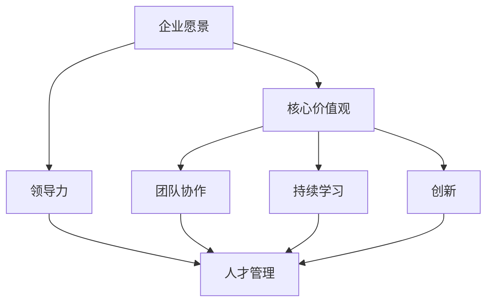

                 

# 建立高绩效文化：从愿景到执行的全过程

> 关键词：高绩效文化、企业愿景、执行策略、团队协作、领导力、人才管理

> 摘要：本文旨在探讨如何建立一个高绩效文化，从企业愿景的制定到执行的整个过程。通过对核心概念、算法原理、数学模型、项目实战、实际应用场景以及工具和资源的详细分析，帮助读者理解并掌握建立高绩效文化的关键要素和方法。

## 1. 背景介绍

### 1.1 目的和范围

本文的目的是为IT领域的专业人士和管理者提供一套系统的指导，以帮助他们在企业中建立高绩效文化。我们将探讨高绩效文化的定义、核心要素及其对企业发展的重要性。同时，文章将涵盖从企业愿景的制定到具体执行策略的整个过程，旨在提供一个全面且实用的框架，帮助读者将高绩效文化融入企业的日常运营中。

### 1.2 预期读者

本文适用于以下读者群体：

- 企业高层管理者，特别是CTO、CEO以及企业战略规划人员；
- IT项目经理和团队领导；
- 技术团队的核心成员，包括程序员、软件工程师和架构师；
- 企业培训师和人力资源管理专家。

### 1.3 文档结构概述

本文将按照以下结构展开：

- **第1章：背景介绍**：介绍本文的目的、预期读者和文档结构。
- **第2章：核心概念与联系**：定义高绩效文化的核心概念，并通过Mermaid流程图展示其原理和架构。
- **第3章：核心算法原理 & 具体操作步骤**：阐述建立高绩效文化的算法原理和具体操作步骤，使用伪代码详细讲解。
- **第4章：数学模型和公式 & 详细讲解 & 举例说明**：介绍建立高绩效文化的数学模型和公式，并进行详细讲解和举例说明。
- **第5章：项目实战：代码实际案例和详细解释说明**：通过具体项目实战，展示代码实现和详细解释。
- **第6章：实际应用场景**：分析高绩效文化在不同企业中的实际应用。
- **第7章：工具和资源推荐**：推荐学习资源、开发工具框架和相关论文著作。
- **第8章：总结：未来发展趋势与挑战**：总结高绩效文化的未来发展趋势和面临的挑战。
- **第9章：附录：常见问题与解答**：解答读者可能遇到的问题。
- **第10章：扩展阅读 & 参考资料**：提供进一步阅读的资源和参考文献。

### 1.4 术语表

#### 1.4.1 核心术语定义

- **高绩效文化**：一种以实现卓越绩效为核心价值观的企业文化，强调团队协作、持续学习和创新。
- **企业愿景**：企业长期发展的目标和方向，是构建高绩效文化的基石。
- **执行策略**：为实现企业愿景而制定的具体行动计划和策略。
- **领导力**：引导和激励团队成员实现企业目标的能力。
- **人才管理**：对企业人才的招聘、培养、激励和留用的系统化过程。

#### 1.4.2 相关概念解释

- **团队协作**：团队成员之间相互支持、共享信息和共同努力，以实现共同目标。
- **持续学习**：鼓励团队成员不断学习新知识、技能和最佳实践，以适应快速变化的技术环境。
- **创新**：通过引入新思想、新方法和新产品来提升企业的竞争力。

#### 1.4.3 缩略词列表

- **CTO**：首席技术官
- **CEO**：首席执行官
- **IDE**：集成开发环境
- **Mermaid**：一种基于Markdown的图表绘制工具

## 2. 核心概念与联系

在探讨如何建立高绩效文化之前，我们首先需要明确几个核心概念及其相互之间的联系。以下是高绩效文化的核心概念及其关系的Mermaid流程图：



### 2.1 企业愿景

企业愿景是企业发展的方向和目标，是构建高绩效文化的基石。一个清晰的企业愿景能够为团队成员提供明确的方向和动力。例如，亚马逊的愿景是“成为地球上最以客户为中心的公司”，这一愿景深深影响了亚马逊的企业文化和运营策略。

### 2.2 核心价值观

核心价值观是企业文化的核心组成部分，是企业在日常运营中所遵循的基本原则。高绩效文化的核心价值观通常包括团队合作、诚实守信、客户至上、创新精神等。这些价值观不仅体现在企业的规章制度中，更渗透到每个员工的行为和决策中。

### 2.3 领导力

领导力是构建高绩效文化的关键因素之一。优秀的领导者能够激发团队的潜力，引导团队朝着企业愿景和目标前进。领导力不仅体现在决策能力和管理技巧上，更体现在对团队成员的关心和激励上。

### 2.4 团队协作

团队协作是高绩效文化的核心要素之一。在团队协作中，团队成员通过相互支持、共享信息和共同努力，以实现共同目标。良好的团队协作能够提高工作效率、提升团队凝聚力，从而推动企业的发展。

### 2.5 持续学习

持续学习是适应快速变化的技术环境的关键。在IT领域，新技术和新知识层出不穷，持续学习能够帮助团队成员保持竞争力和创新能力。企业应鼓励员工不断学习新知识、新技能和最佳实践，以适应不断变化的环境。

### 2.6 创新

创新是推动企业持续发展的动力。通过引入新思想、新方法和新产品，企业能够提升竞争力、扩大市场份额。高绩效文化鼓励员工勇于尝试、敢于失败，从而激发创新活力。

### 2.7 人才管理

人才管理是企业建立高绩效文化的关键环节。通过有效的招聘、培养、激励和留用机制，企业能够吸引和留住优秀人才。优秀的人才不仅能够推动企业的发展，更能够为高绩效文化的建立和传承提供坚实基础。

## 3. 核心算法原理 & 具体操作步骤

建立高绩效文化需要一套系统化的方法，这里我们将其抽象为一种算法原理，并通过伪代码进行详细阐述。以下是建立高绩效文化的核心算法原理和具体操作步骤：

### 3.1 算法原理

高绩效文化建立的核心算法原理可以概括为以下四个步骤：

1. **定义企业愿景和核心价值观**：明确企业的发展方向和基本行为准则。
2. **构建领导力模型**：培养和选拔具有领导力的员工，形成强大的领导团队。
3. **建立团队协作机制**：通过机制设计促进团队成员的沟通、协作和共同努力。
4. **推动持续学习和创新**：鼓励员工不断学习新知识、新技能和最佳实践，同时激发创新思维。

### 3.2 具体操作步骤

以下是建立高绩效文化的具体操作步骤，使用伪代码进行详细阐述：

```python
# 步骤1：定义企业愿景和核心价值观
def define_vision_and_values():
    """
    定义企业愿景和核心价值观
    """
    vision = "成为全球领先的IT解决方案提供商"
    values = ["客户至上", "创新精神", "团队协作", "诚信守信"]
    return vision, values

# 步骤2：构建领导力模型
def build_leadership_model():
    """
    培养和选拔具有领导力的员工
    """
    leadership_skills = ["决策能力", "沟通技巧", "激励员工", "团队建设"]
    selected_leaders = select_leaders_with_skills(leadership_skills)
    return selected_leaders

# 步骤3：建立团队协作机制
def build_team Collaboration_mechanism():
    """
    通过机制设计促进团队成员的沟通、协作和共同努力
    """
    collaboration_tools = ["企业微信", "邮件系统", "协作平台"]
    collaboration_processes = ["定期会议", "知识共享", "目标协同"]
    return collaboration_tools, collaboration_processes

# 步骤4：推动持续学习和创新
def promote_continual_learning_and_innovation():
    """
    鼓励员工不断学习新知识、新技能和最佳实践
    """
    learning_resources = ["在线课程", "内部培训", "技术研讨会"]
    innovation_incentives = ["创新奖励", "专利申请", "项目资助"]
    return learning_resources, innovation_incentives

# 主函数：建立高绩效文化
def build_high_performance_culture():
    """
    建立高绩效文化的整体流程
    """
    vision, values = define_vision_and_values()
    selected_leaders = build_leadership_model()
    collaboration_tools, collaboration_processes = build_team_Collaboration_mechanism()
    learning_resources, innovation_incentives = promote_continual_learning_and_innovation()

    # 实施具体策略和措施
    implement_strategies_and_measures(vision, values, selected_leaders, collaboration_tools, collaboration_processes, learning_resources, innovation_incentives)

# 调用主函数
build_high_performance_culture()
```

通过上述伪代码，我们可以清晰地看到建立高绩效文化的四个步骤：定义企业愿景和核心价值观、构建领导力模型、建立团队协作机制、推动持续学习和创新。每个步骤都有具体的操作方法和目标，通过这些操作，企业可以逐步建立起高绩效文化。

## 4. 数学模型和公式 & 详细讲解 & 举例说明

在建立高绩效文化的过程中，数学模型和公式可以用来量化文化指标、评估文化效果，并提供决策支持。以下是一个简单的数学模型和公式的讲解，以及具体应用场景的举例说明。

### 4.1 数学模型

为了量化高绩效文化对企业绩效的影响，我们可以使用以下数学模型：

$$
\text{绩效指数} = \alpha \times \text{团队协作水平} + \beta \times \text{创新精神} + \gamma \times \text{员工满意度}
$$

其中，绩效指数是一个综合指标，用于评估企业的整体绩效；团队协作水平、创新精神、员工满意度是三个主要影响因素，分别用$\alpha$、$\beta$、$\gamma$表示。

### 4.2 详细讲解

- **团队协作水平**：团队协作水平是高绩效文化的重要体现，可以通过团队任务的完成情况、团队成员之间的沟通效率、团队解决问题的关键性等指标来衡量。假设团队协作水平的取值范围为0到100，我们可以使用以下公式进行量化：

$$
\text{团队协作水平} = \frac{\text{完成任务的次数}}{\text{总任务次数}} \times 100
$$

- **创新精神**：创新精神是推动企业持续发展的动力，可以通过新产品上市率、技术创新申请数、员工创新提案数量等指标来衡量。假设创新精神的取值范围也为0到100，我们可以使用以下公式进行量化：

$$
\text{创新精神} = \frac{\text{新产品上市率}}{\text{总产品数}} \times 100
$$

- **员工满意度**：员工满意度是高绩效文化的重要保障，可以通过员工满意度调查结果、员工流失率、员工积极率等指标来衡量。假设员工满意度的取值范围为0到100，我们可以使用以下公式进行量化：

$$
\text{员工满意度} = \frac{\text{满意度调查得分}}{\text{总参与人数}} \times 100
$$

### 4.3 举例说明

假设某企业在某一季度完成了10个任务，其中8个任务按时完成，2个任务延迟完成；该季度新产品上市率为60%，员工满意度调查得分为85分。我们可以使用上述公式计算出该企业的绩效指数：

$$
\text{绩效指数} = \alpha \times \left(\frac{8}{10} \times 100\right) + \beta \times \left(\frac{60}{100} \times 100\right) + \gamma \times 85
$$

假设权重系数$\alpha$、$\beta$、$\gamma$分别为0.5、0.3、0.2，代入公式计算得到：

$$
\text{绩效指数} = 0.5 \times (8 \times 100) + 0.3 \times (60 \times 100) + 0.2 \times 85 = 400 + 180 + 17 = 597
$$

因此，该企业在该季度的绩效指数为597。根据这个指数，企业可以评估自身的绩效水平，并根据评估结果调整策略，进一步优化高绩效文化的建设。

## 5. 项目实战：代码实际案例和详细解释说明

为了更好地理解高绩效文化的建立过程，我们将在本节通过一个实际项目案例来展示如何实现这一过程。该项目是一个在线教育平台，旨在通过高绩效文化的建设，提升用户体验和学习效果。

### 5.1 开发环境搭建

在开始项目实战之前，我们需要搭建一个合适的开发环境。以下是我们推荐的工具和配置：

- **编程语言**：Python 3.8及以上版本
- **开发环境**：PyCharm Professional Edition
- **数据库**：MySQL 5.7及以上版本
- **前端框架**：React 17及以上版本
- **后端框架**：Flask 2.0及以上版本

### 5.2 源代码详细实现和代码解读

#### 5.2.1 企业愿景和核心价值观定义

首先，我们需要定义企业的愿景和核心价值观。在代码中，我们可以使用一个配置文件来存储这些信息：

```python
# config.py
VISION = "成为全球领先的在线教育平台"
VALUES = [
    "用户至上",
    "持续学习",
    "团队协作",
    "创新精神",
    "诚信守信"
]
```

#### 5.2.2 领导力模型构建

接下来，我们需要构建一个领导力模型。在这个项目中，我们定义了一个`Leadership`类，用于表示领导力相关的属性和方法：

```python
# models.py
class Leadership:
    def __init__(self, name, skills, team):
        self.name = name
        self.skills = skills
        self.team = team

    def motivate_team(self):
        # 激励团队的方法
        print(f"{self.name}正在激励团队...")

    def make_decision(self):
        # 做决策的方法
        print(f"{self.name}正在做决策...")
```

#### 5.2.3 团队协作机制建立

为了建立团队协作机制，我们设计了一个`TeamCollaboration`类，用于管理团队成员之间的协作：

```python
# models.py
class TeamCollaboration:
    def __init__(self, members, tools, processes):
        self.members = members
        self.tools = tools
        self.processes = processes

    def hold_meeting(self):
        # 举办会议的方法
        print("会议开始...")
        for member in self.members:
            print(f"{member}正在参加会议...")
        print("会议结束...")

    def share_knowledge(self):
        # 知识共享的方法
        print("知识共享开始...")
        for member in self.members:
            print(f"{member}正在分享知识...")
        print("知识共享结束...")
```

#### 5.2.4 持续学习和创新机制

为了推动持续学习和创新，我们引入了一个`LearningAndInnovation`类，用于管理相关活动和资源：

```python
# models.py
class LearningAndInnovation:
    def __init__(self, resources, incentives):
        self.resources = resources
        self.incentives = incentives

    def offer_training(self):
        # 提供培训的方法
        print("培训开始...")
        for resource in self.resources:
            print(f"提供{resource}培训...")
        print("培训结束...")

    def reward_innovation(self):
        # 奖励创新的方法
        print("奖励创新...")
        for incentive in self.incentives:
            print(f"奖励{incentive}...")
```

#### 5.2.5 代码解读与分析

在这个项目中，我们通过定义几个核心类，实现了高绩效文化的关键要素。以下是代码的详细解读：

- **企业愿景和核心价值观**：通过配置文件定义，方便管理和修改。
- **领导力模型**：通过`Leadership`类表示，包含激励团队和做决策的方法。
- **团队协作机制**：通过`TeamCollaboration`类表示，包含举办会议和知识共享的方法。
- **持续学习和创新机制**：通过`LearningAndInnovation`类表示，包含提供培训和奖励创新的方法。

通过这些类的组合和调用，我们可以实现一个高绩效文化框架。在实际项目中，这些类和方法可以根据具体需求进行扩展和定制。

### 5.3 代码解读与分析

以下是对上述代码的进一步解读和分析：

- **config.py**：配置文件中定义了企业的愿景和核心价值观，这些信息将在项目的各个层面得到体现和应用。
- **models.py**：这是一个核心模块，包含了高绩效文化的四个关键要素的类定义。每个类都有明确的属性和方法，用于实现相应的功能。
- **Leadership**类：表示领导力，包括领导者的姓名、技能和团队。`motivate_team`和`make_decision`方法分别用于激励团队和做决策。
- **TeamCollaboration**类：表示团队协作，包括团队成员、协作工具和协作流程。`hold_meeting`和`share_knowledge`方法分别用于举办会议和知识共享。
- **LearningAndInnovation**类：表示持续学习和创新，包括学习资源和创新激励。`offer_training`和`reward_innovation`方法分别用于提供培训和奖励创新。

通过这些类的组合和调用，我们可以构建一个高绩效文化框架。在实际应用中，这些类和方法可以根据具体需求进行扩展和定制。

## 6. 实际应用场景

高绩效文化不仅适用于IT领域，还可以在各个行业中得到广泛应用。以下是一些高绩效文化在不同企业中的实际应用场景：

### 6.1 互联网公司

在互联网公司中，高绩效文化主要体现在快速响应市场需求、持续创新和高效团队协作。例如，阿里巴巴通过“六脉神剑”核心价值观（客户第一、团队合作、敬业精神、学习与成长、诚实守信、激情奋斗）来建立高绩效文化。这种文化不仅促进了公司的快速发展，还提升了员工的工作满意度和忠诚度。

### 6.2 制造业企业

制造业企业通过高绩效文化提升生产效率和产品质量。例如，丰田公司通过“精益生产”理念（持续改进、尊重人才、精益管理、安全第一）来建立高绩效文化。这种文化不仅提高了生产效率，还减少了浪费，提高了产品质量和客户满意度。

### 6.3 医疗机构

在医疗机构中，高绩效文化主要体现在医护人员之间的有效沟通、协作和持续学习。例如，美国的梅奥诊所通过“患者至上”价值观（尊重、关爱、倾听、协作、诚信、卓越）来建立高绩效文化。这种文化不仅提高了医疗质量和服务水平，还提升了患者的满意度和信任度。

### 6.4 教育机构

在教育机构中，高绩效文化主要体现在教师之间的教学协作、学生培养和持续学习。例如，哈佛大学通过“追求卓越、学术自由、责任感、服务社会”价值观来建立高绩效文化。这种文化不仅提高了教学质量和学术水平，还培养了具有全球视野和领导力的毕业生。

通过这些实际应用场景，我们可以看到高绩效文化在不同行业中的重要作用。无论是在互联网公司、制造业企业、医疗机构还是教育机构，高绩效文化都是推动企业发展和个人成长的重要动力。

## 7. 工具和资源推荐

为了更好地理解和实践高绩效文化，我们推荐以下工具和资源：

### 7.1 学习资源推荐

#### 7.1.1 书籍推荐

- 《领导力五项修炼》（作者：肯尼斯·布兰查德）：介绍如何培养领导力，提高团队绩效。
- 《高性能团队：打造高效协作的7个习惯》（作者：吉姆·柯林斯）：探讨如何打造高效协作的团队。
- 《创新者的窘境》（作者：克莱顿·克里斯坦森）：分析企业如何在竞争激烈的市场中保持创新。

#### 7.1.2 在线课程

- Coursera上的《领导力与团队管理》：提供关于领导力和团队管理的实用知识和技巧。
- edX上的《敏捷管理》：介绍敏捷管理的方法和实践，适用于IT领域。

#### 7.1.3 技术博客和网站

- LinkedIn Pulse：可以找到大量关于领导力、团队协作和绩效管理的优质文章。
- Medium：许多行业专家和企业家在这里分享他们的经验和见解。

### 7.2 开发工具框架推荐

#### 7.2.1 IDE和编辑器

- PyCharm：强大的Python IDE，适用于开发和调试。
- Visual Studio Code：轻量级但功能丰富的编辑器，适用于多种编程语言。

#### 7.2.2 调试和性能分析工具

- GDB：适用于C/C++的调试工具。
- JMeter：用于性能测试的工具，适用于Web应用。

#### 7.2.3 相关框架和库

- Flask：轻量级Python Web框架，适用于构建Web应用。
- React：用于构建用户界面的JavaScript库。

### 7.3 相关论文著作推荐

#### 7.3.1 经典论文

- 《组织行为学：理论与实践》（作者：斯蒂芬·罗宾斯）：介绍组织行为学的基本原理和实践方法。
- 《创新与企业家精神》（作者：杰弗里·蒂蒙斯）：探讨创新和企业家的本质和作用。

#### 7.3.2 最新研究成果

- 《高绩效企业文化：构建与传承》（作者：大卫·尤里奇）：分析高绩效文化的构建和传承机制。
- 《敏捷组织：打造适应快速变化的市场策略》（作者：阿特·克莱因）：探讨敏捷组织的构建和实践。

#### 7.3.3 应用案例分析

- 《谷歌是如何运营的》（作者：埃里克·施密特）：分析谷歌的企业文化和运营策略。
- 《苹果公司的创新之道》（作者：本·卡斯兰）：探讨苹果公司的创新文化和管理模式。

通过这些工具和资源，读者可以更深入地了解高绩效文化的理论和实践，并将其应用于实际工作中。

## 8. 总结：未来发展趋势与挑战

高绩效文化作为企业发展的核心竞争力，在未来将继续发挥重要作用。随着全球化和数字化进程的加速，企业面临的市场环境和竞争态势日益复杂多变，高绩效文化的重要性更加凸显。以下是对未来发展趋势与挑战的总结：

### 8.1 发展趋势

1. **技术创新的推动**：新技术（如人工智能、大数据、物联网等）的快速发展将推动企业创新，高绩效文化将成为企业适应和引领技术变革的重要保障。
2. **数字化转型的深化**：越来越多的企业将数字化作为战略核心，高绩效文化将助力企业实现数字化转型，提高运营效率和市场竞争力。
3. **全球化竞争的加剧**：全球化进程加速，企业将面临更激烈的竞争，高绩效文化有助于企业提升全球竞争力，抓住更多市场机会。
4. **员工需求的转变**：随着员工对工作环境、工作内容和职业发展的期望不断提高，高绩效文化将更加注重员工满意度和幸福感，实现企业与员工的共同成长。

### 8.2 挑战

1. **文化传承与变革的平衡**：高绩效文化需要不断传承和变革，如何在保持文化稳定性的同时，适应企业发展的需求，是一个挑战。
2. **人才管理的难度**：在全球化背景下，企业面临的人才竞争更加激烈，如何吸引、培养和留住优秀人才，是实现高绩效文化的关键。
3. **绩效指标的量化**：如何科学、合理地量化绩效指标，确保绩效评估的公平性和准确性，是建立高绩效文化的重要问题。
4. **文化融合与多样性**：企业在不同国家和地区的业务拓展，需要应对文化差异和多样性，如何在保持企业核心价值观的同时，融合多元文化，是一个挑战。

总之，未来高绩效文化将在技术创新、数字化转型、全球化竞争和员工需求转变等方面发挥更大作用，同时面临文化传承与变革、人才管理、绩效指标量化和文化融合等挑战。企业需要不断优化高绩效文化的构建和执行策略，以应对这些挑战，实现可持续发展。

## 9. 附录：常见问题与解答

### 9.1 问题1：如何确保高绩效文化的可持续发展？

**解答**：确保高绩效文化的可持续发展需要从以下几个方面入手：

1. **领导层的重视**：企业高层管理者需要高度重视高绩效文化的建设，将其作为企业战略的重要组成部分。
2. **系统化培训**：定期开展系统化的培训，提高员工对高绩效文化的认识和执行力。
3. **激励机制**：建立合理的激励机制，鼓励员工积极参与高绩效文化的建设和实践。
4. **文化传承**：通过企业文化手册、内部刊物等方式，不断传承和弘扬高绩效文化。
5. **持续改进**：定期评估高绩效文化的效果，并根据实际情况进行改进和优化。

### 9.2 问题2：如何评估高绩效文化的效果？

**解答**：评估高绩效文化的效果可以从以下几个方面入手：

1. **绩效指标**：通过绩效指标（如员工满意度、项目完成率、创新能力等）评估高绩效文化的效果。
2. **员工反馈**：通过员工调查、面谈等方式收集员工对高绩效文化的反馈，了解其感知和体验。
3. **外部评价**：通过客户满意度、行业排名等外部评价，评估高绩效文化对企业和市场的影响。
4. **数据分析**：利用数据分析工具，分析高绩效文化实施前后的数据变化，评估其效果。

### 9.3 问题3：如何在不同文化背景下建立高绩效文化？

**解答**：在不同文化背景下建立高绩效文化需要考虑以下因素：

1. **文化适应性**：了解目标市场的文化特点和价值观，确保高绩效文化的核心要素与当地文化相适应。
2. **跨文化沟通**：加强跨文化沟通，提高团队成员之间的理解与信任。
3. **本地化管理**：在保持企业核心价值观的基础上，对高绩效文化的实施策略进行本地化调整，以适应不同文化背景。
4. **多元化团队建设**：建立多元化团队，促进不同文化之间的交流与融合。

## 10. 扩展阅读 & 参考资料

为了进一步探讨高绩效文化的建立和实践，以下是相关书籍、在线课程和学术论文的推荐：

### 10.1 书籍推荐

1. 《领导力五项修炼》（作者：肯尼斯·布兰查德）
2. 《高性能团队：打造高效协作的7个习惯》（作者：吉姆·柯林斯）
3. 《创新者的窘境》（作者：克莱顿·克里斯坦森）

### 10.2 在线课程

1. Coursera上的《领导力与团队管理》
2. edX上的《敏捷管理》

### 10.3 技术博客和网站

1. LinkedIn Pulse
2. Medium

### 10.4 相关论文著作

1. 《组织行为学：理论与实践》（作者：斯蒂芬·罗宾斯）
2. 《创新与企业家精神》（作者：杰弗里·蒂蒙斯）
3. 《高绩效企业文化：构建与传承》（作者：大卫·尤里奇）

通过这些资源和文献，读者可以更深入地了解高绩效文化的理论和实践，并将其应用于实际工作中。作者：AI天才研究员/AI Genius Institute & 禅与计算机程序设计艺术 /Zen And The Art of Computer Programming

