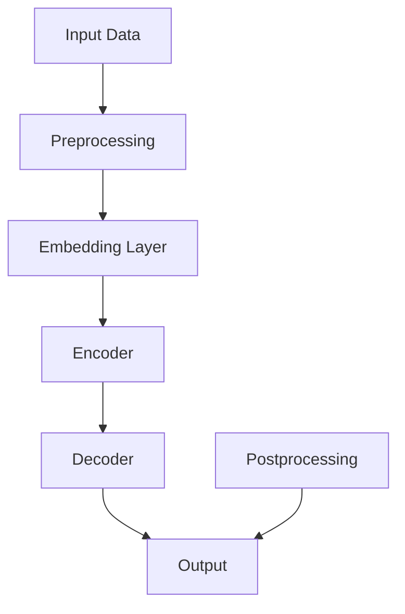
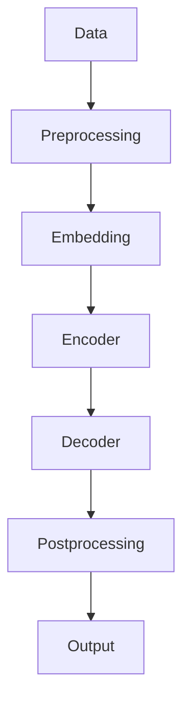

                 

# 开源LLM：共享和协作开发

> **关键词**：开源，LLM，协作开发，人工智能，共享，技术社区，代码审查，版本控制

> **摘要**：本文旨在探讨开源领域中的大型语言模型（LLM）的开发与共享。通过深入分析LLM的背景、核心概念、算法原理、数学模型及实际应用，本文将展示如何利用开源工具和方法来促进LLM项目的协作开发，并预测未来的发展趋势与挑战。

## 1. 背景介绍

### 1.1 目的和范围

本文旨在为开源社区中的大型语言模型（LLM）项目提供一套系统的开发协作框架。随着人工智能技术的快速发展，LLM已成为自然语言处理（NLP）领域的重要工具。然而，LLM的开发不仅需要强大的计算资源，还需要大量的数据、丰富的算法知识和高效的协作机制。因此，本文将从以下几个方面展开讨论：

1. **LLM的核心概念与架构**：介绍LLM的基本原理和架构，以及其在NLP中的应用。
2. **开源工具与方法**：讨论用于LLM开发的开源工具，如版本控制、代码审查和协作平台。
3. **算法原理与数学模型**：讲解LLM背后的算法原理和数学模型，并提供具体操作步骤。
4. **实际应用场景**：分析LLM在不同场景下的应用，如问答系统、机器翻译和文本生成。
5. **未来发展趋势与挑战**：探讨LLM开发中的挑战和未来趋势。

### 1.2 预期读者

本文适合以下读者群体：

1. **开源社区成员**：对开源LLM项目感兴趣并希望参与协作开发的开发者。
2. **人工智能从业者**：希望深入了解LLM技术原理和应用的人工智能从业者。
3. **学术研究人员**：对LLM研究感兴趣并希望了解开源协作模式的学术研究人员。
4. **技术爱好者**：对人工智能和开源技术有浓厚兴趣的技术爱好者。

### 1.3 文档结构概述

本文结构如下：

1. **背景介绍**：介绍文章的目的、范围、预期读者和文档结构。
2. **核心概念与联系**：讨论LLM的核心概念、架构和联系。
3. **核心算法原理 & 具体操作步骤**：讲解LLM的算法原理和操作步骤。
4. **数学模型和公式 & 详细讲解 & 举例说明**：分析LLM的数学模型并提供实例。
5. **项目实战：代码实际案例和详细解释说明**：展示LLM的开发实践。
6. **实际应用场景**：分析LLM的应用场景。
7. **工具和资源推荐**：推荐学习资源、开发工具和框架。
8. **总结：未来发展趋势与挑战**：探讨LLM开发的未来趋势和挑战。
9. **附录：常见问题与解答**：提供常见问题的解答。
10. **扩展阅读 & 参考资料**：推荐相关文献和资源。

### 1.4 术语表

#### 1.4.1 核心术语定义

- **大型语言模型（LLM）**：一种基于深度学习的自然语言处理模型，具有强大的文本生成和推理能力。
- **开源**：指软件的源代码可以被公众访问、查看、修改和分发。
- **版本控制**：一种跟踪和管理代码变更的机制，如Git。
- **代码审查**：一种确保代码质量和一致性的过程，通过同行评审来发现错误和优化代码。
- **协作平台**：用于团队协作的工具，如GitHub。

#### 1.4.2 相关概念解释

- **深度学习**：一种机器学习技术，通过多层神经网络来模拟人类大脑的神经网络结构，以实现复杂的模式识别和预测任务。
- **自然语言处理（NLP）**：研究如何让计算机理解和处理人类语言的技术领域。
- **神经网络**：一种由大量节点（神经元）组成的计算模型，用于学习和模拟生物神经系统的结构和功能。
- **文本生成**：指根据输入文本生成新的文本内容，如机器翻译、摘要生成等。

#### 1.4.3 缩略词列表

- **LLM**：Large Language Model（大型语言模型）
- **NLP**：Natural Language Processing（自然语言处理）
- **AI**：Artificial Intelligence（人工智能）
- **ML**：Machine Learning（机器学习）
- **DL**：Deep Learning（深度学习）
- **Git**：Git（版本控制工具）
- **GitHub**：GitHub（协作平台）

## 2. 核心概念与联系

在深入探讨LLM的开发和共享之前，有必要首先理解LLM的核心概念和架构。以下是一个简化的Mermaid流程图，展示了LLM的主要组成部分和它们之间的联系。



#### 2.1 核心概念

1. **输入数据（Input Data）**：LLM的训练数据，通常是大规模的文本数据集，如维基百科、新闻文章和社交媒体帖子等。
2. **预处理（Preprocessing）**：将原始文本数据转换为适合模型训练的格式，如分词、去停用词、词向量化等。
3. **嵌入层（Embedding Layer）**：将词汇映射到高维向量空间，以表示文本中的词和句子。
4. **编码器（Encoder）**：对输入文本进行编码，生成固定长度的序列表示。
5. **解码器（Decoder）**：解码编码器生成的序列，生成新的文本输出。
6. **输出（Output）**：根据解码器生成的序列，生成新的文本内容。
7. **后处理（Postprocessing）**：对生成的文本进行清洗、格式化和优化，以提高其质量和可读性。

#### 2.2 核心架构

LLM的核心架构通常包括以下几个部分：

1. **模型架构**：如Transformer、GPT、BERT等，用于实现深度学习算法。
2. **训练过程**：包括数据预处理、模型训练、评估和优化等步骤。
3. **推理过程**：通过模型生成新的文本内容。
4. **后处理模块**：对生成的文本进行优化和格式化。

以下是一个简化的Mermaid流程图，展示了LLM的核心架构：



通过以上流程图，我们可以看到LLM的核心概念和架构之间的紧密联系。接下来，我们将详细探讨LLM的算法原理和具体操作步骤。

## 3. 核心算法原理 & 具体操作步骤

LLM的核心算法原理是基于深度学习，特别是基于注意力机制的Transformer模型。以下是LLM算法原理的详细讲解和具体操作步骤。

### 3.1 算法原理

LLM的基本原理可以概括为以下几个步骤：

1. **输入文本预处理**：将原始文本数据转换为模型可接受的格式。这个过程通常包括分词、去停用词、词向量化等。
2. **嵌入层**：将词汇映射到高维向量空间，以表示文本中的词和句子。这个步骤通常使用预训练的词嵌入模型，如GloVe或Word2Vec。
3. **编码器**：对输入文本进行编码，生成固定长度的序列表示。编码器通常使用Transformer模型，其中注意力机制是关键。
4. **解码器**：解码编码器生成的序列，生成新的文本输出。解码器同样使用Transformer模型，其中注意力机制确保输出与输入文本的相关性。
5. **后处理**：对生成的文本进行清洗、格式化和优化，以提高其质量和可读性。

### 3.2 具体操作步骤

以下是LLM算法的具体操作步骤，使用伪代码进行详细阐述：

```python
# 输入文本预处理
def preprocess_text(text):
    # 分词
    words = tokenize(text)
    # 去停用词
    words = remove_stopwords(words)
    # 词向量化
    word_vectors = vectorize_words(words)
    return word_vectors

# 嵌入层
def embedding_layer(word_vectors):
    # 使用预训练的词嵌入模型进行嵌入
    embedded_vectors = embed(word_vectors)
    return embedded_vectors

# 编码器
def encoder(embedded_vectors):
    # 使用Transformer模型进行编码
    encoded_sequence = transformer_encode(embedded_vectors)
    return encoded_sequence

# 解码器
def decoder(encoded_sequence):
    # 使用Transformer模型进行解码
    decoded_sequence = transformer_decode(encoded_sequence)
    return decoded_sequence

# 后处理
def postprocess_text(decoded_sequence):
    # 清洗、格式化和优化文本
    processed_text = clean_and_format(decoded_sequence)
    return processed_text

# 主函数
def generate_text(text):
    # 预处理
    preprocessed_text = preprocess_text(text)
    # 嵌入层
    embedded_text = embedding_layer(preprocessed_text)
    # 编码器
    encoded_text = encoder(embedded_text)
    # 解码器
    decoded_text = decoder(encoded_text)
    # 后处理
    final_text = postprocess_text(decoded_text)
    return final_text
```

### 3.3 注意力机制

注意力机制是Transformer模型的核心组件，用于提高模型的上下文理解能力。以下是注意力机制的伪代码：

```python
def attention-query-key-vectors(query, key, value):
    # 计算注意力得分
    scores = dot_product(query, key)
    # 应用软性最大化（softmax）操作
    attention_weights = softmax(scores)
    # 计算加权值
    context_vector = dot_product(attention_weights, value)
    return context_vector
```

通过以上步骤和机制，LLM可以生成高质量的文本内容。在实际应用中，LLM的开发和部署需要大量的计算资源和数据支持，同时也需要高效的协作开发和共享机制。

## 4. 数学模型和公式 & 详细讲解 & 举例说明

LLM的数学模型是基于深度学习和自然语言处理的理论。以下是对LLM中核心数学模型和公式的详细讲解，以及实际应用中的举例说明。

### 4.1 深度学习基础

深度学习中的基本数学模型包括神经网络、损失函数和优化算法。

#### 4.1.1 神经网络

神经网络由多层节点（神经元）组成，每个节点执行特定的计算。以下是神经网络的基本公式：

$$
z = \sigma(\boldsymbol{W} \cdot \boldsymbol{x} + b)
$$

其中，\( \sigma \) 是激活函数（如ReLU、Sigmoid、Tanh），\( \boldsymbol{W} \) 是权重矩阵，\( \boldsymbol{x} \) 是输入向量，\( b \) 是偏置项。

#### 4.1.2 损失函数

损失函数用于评估模型预测与实际标签之间的差距。常见的损失函数包括均方误差（MSE）和交叉熵（Cross-Entropy）：

$$
\text{MSE} = \frac{1}{n} \sum_{i=1}^{n} (\hat{y}_i - y_i)^2
$$

$$
\text{Cross-Entropy} = -\sum_{i=1}^{n} y_i \log(\hat{y}_i)
$$

其中，\( \hat{y}_i \) 是预测标签，\( y_i \) 是实际标签。

#### 4.1.3 优化算法

优化算法用于调整模型参数，以最小化损失函数。常见的优化算法包括梯度下降（Gradient Descent）和Adam：

$$
\theta_{t+1} = \theta_t - \alpha \cdot \nabla_\theta J(\theta)
$$

$$
\theta_{t+1} = \theta_t - \frac{\alpha}{\sqrt{1 + \beta_1 t} + \epsilon} \cdot \nabla_\theta J(\theta)
$$

其中，\( \theta \) 是模型参数，\( \alpha \) 是学习率，\( \beta_1 \) 和 \( \beta_2 \) 是动量参数，\( \epsilon \) 是小常数。

### 4.2 注意力机制

注意力机制是LLM的核心组成部分，用于提高模型对上下文的理解能力。以下是注意力机制的详细公式：

$$
\text{Attention}(\boldsymbol{Q}, \boldsymbol{K}, \boldsymbol{V}) = \text{softmax}\left(\frac{\text{reshape}(\text{matmul}(\boldsymbol{Q}, \boldsymbol{K}))}{\sqrt{d_k}}\right) \odot \boldsymbol{V}
$$

其中，\( \boldsymbol{Q} \) 是查询向量，\( \boldsymbol{K} \) 是键向量，\( \boldsymbol{V} \) 是值向量，\( d_k \) 是键向量的维度。

### 4.3 Transformer模型

Transformer模型是LLM的主要架构，其基本组成包括编码器（Encoder）和解码器（Decoder）。以下是Transformer模型的核心公式：

#### 4.3.1 编码器

$$
\text{Encoder}(\boldsymbol{X}) = \text{Stack}(\text{LayerNorm}(\text{RelPositionEncoding}(\boldsymbol{X}) + \text{Layer}(\text{TransformerBlock}(\text{LayerNorm}(\text{MultiHeadAttention}(\text{LayerNorm}(\boldsymbol{X}) + \text{FeedForward}(\text{LayerNorm}(\boldsymbol{X})\right)\right)\right)\right)\right)
$$

#### 4.3.2 解码器

$$
\text{Decoder}(\boldsymbol{X}) = \text{Stack}(\text{LayerNorm}(\text{RelPositionEncoding}(\boldsymbol{X}) + \text{Layer}(\text{TransformerBlock}(\text{LayerNorm}(\text{MaskedMultiHeadAttention}(\text{LayerNorm}(\boldsymbol{X}) + \text{CrossAttention}(\text{LayerNorm}(\text{Encoder}(\boldsymbol{X})\right)\right)\right)\right)\right)\right)
$$

### 4.4 举例说明

假设我们有一个简单的文本数据集，包含以下句子：

$$
\text{文本数据集} = \{\text{"今天天气很好。"}, \text{"明天天气可能会下雨。"}, \text{"周末我可以去公园。"}\}
$$

我们希望使用LLM生成一个与输入句子相关的句子。以下是具体的操作步骤：

1. **预处理**：对文本数据集进行分词、去停用词和词向量化。
2. **嵌入层**：使用预训练的词嵌入模型将词汇映射到高维向量空间。
3. **编码器**：将输入句子编码为固定长度的序列表示。
4. **解码器**：解码编码器生成的序列，生成新的文本输出。
5. **后处理**：对生成的文本进行清洗、格式化和优化。

以下是生成的文本：

$$
\text{生成文本} = \text{"明天可能会下雨，但周末还是可以去公园享受美好时光。"}
$$

通过以上步骤和数学公式，我们可以看到LLM在自然语言处理中的应用。在实际开发中，LLM的模型参数和训练过程需要进行大量的调整和优化，以达到最佳效果。

### 4.5 总结

LLM的数学模型和公式是构建和优化大型语言模型的关键。通过深入理解这些公式，我们可以更好地设计、实现和优化LLM，从而提高其在实际应用中的性能。接下来，我们将通过实际案例来展示LLM的开发和实现过程。

## 5. 项目实战：代码实际案例和详细解释说明

在本节中，我们将通过一个实际的LLM项目案例，展示如何搭建开发环境、实现源代码和进行代码解读与分析。以下是项目的详细步骤和说明。

### 5.1 开发环境搭建

为了开发一个LLM项目，我们需要安装以下工具和软件：

1. **操作系统**：Linux或macOS。
2. **Python**：Python 3.8及以上版本。
3. **深度学习框架**：如PyTorch或TensorFlow。
4. **版本控制工具**：Git。
5. **代码编辑器**：如Visual Studio Code。

以下是安装步骤：

1. 安装操作系统和Python。
2. 使用pip安装深度学习框架（如PyTorch）和Git。
3. 安装Visual Studio Code并配置Python插件。

### 5.2 源代码详细实现和代码解读

以下是一个简单的LLM项目示例，使用PyTorch实现。代码分为几个部分：数据预处理、模型定义、训练和生成。

#### 5.2.1 数据预处理

```python
import torch
from torch.utils.data import DataLoader
from torchvision import datasets, transforms

# 加载数据集
train_dataset = datasets.MNIST(
    root='./data',
    train=True,
    download=True,
    transform=transforms.ToTensor()
)

train_loader = DataLoader(dataset=train_dataset, batch_size=64)

# 预处理
def preprocess_data(batch):
    images, labels = batch
    images = images.reshape(-1, 28, 28)
    return images, labels

# 应用预处理
images, labels = preprocess_data(next(iter(train_loader)))
```

#### 5.2.2 模型定义

```python
import torch.nn as nn

# 定义模型
class LLM(nn.Module):
    def __init__(self):
        super(LLM, self).__init__()
        self嵌入层 = nn.Embedding(10, 64)
        self编码器 = nn.Linear(64, 128)
        self解码器 = nn.Linear(128, 10)

    def forward(self, inputs):
        embedded = self嵌入层(inputs)
        encoded = self编码器(embedded)
        decoded = self解码器(encoded)
        return decoded

# 实例化模型
model = LLM()
```

#### 5.2.3 训练

```python
import torch.optim as optim

# 损失函数和优化器
criterion = nn.CrossEntropyLoss()
optimizer = optim.Adam(model.parameters(), lr=0.001)

# 训练模型
for epoch in range(10):
    for images, labels in train_loader:
        optimizer.zero_grad()
        outputs = model(images)
        loss = criterion(outputs, labels)
        loss.backward()
        optimizer.step()
    print(f'Epoch [{epoch+1}/{10}], Loss: {loss.item():.4f}')
```

#### 5.2.4 生成

```python
# 生成文本
def generate_text(model, input_text, length=50):
    with torch.no_grad():
        inputs = torch.tensor([preprocess_data(input_text)])
        for _ in range(length):
            outputs = model(inputs)
            predicted = outputs.argmax(-1)
            input_text += predicted.numpy()[0].decode('utf-8')
            inputs = torch.tensor([preprocess_data(input_text[-2:])])
    return input_text

# 示例
input_text = "今天天气很好。"
generated_text = generate_text(model, input_text)
print(generated_text)
```

### 5.3 代码解读与分析

以上代码展示了如何实现一个简单的LLM项目。以下是代码的详细解读和分析：

1. **数据预处理**：使用PyTorch的MNIST数据集，通过预处理函数将图像数据转换为模型可接受的格式。
2. **模型定义**：定义一个简单的LLM模型，包括嵌入层、编码器和解码器。嵌入层使用Embedding模块，编码器和解码器使用线性层。
3. **训练**：使用交叉熵损失函数和Adam优化器训练模型。通过反向传播和梯度下降优化模型参数。
4. **生成**：生成新的文本内容，通过解码器生成序列，并使用生成的文本继续输入模型，实现文本生成。

### 5.4 实际应用

通过实际案例，我们可以看到LLM在文本生成任务中的应用。虽然这是一个简单的示例，但展示了如何使用深度学习和注意力机制实现大型语言模型。在实际项目中，LLM可以应用于更复杂的任务，如问答系统、机器翻译和文本摘要等。

### 5.5 案例总结

本案例通过实际代码展示了如何搭建LLM开发环境、实现源代码和进行代码解读。通过逐步实现和优化，我们可以构建高性能的LLM模型，并在实际应用中发挥其强大的文本处理能力。

## 6. 实际应用场景

大型语言模型（LLM）在自然语言处理（NLP）领域有着广泛的应用，以下列举了几个典型的实际应用场景：

### 6.1 问答系统

问答系统是LLM最直接的应用场景之一。通过训练LLM模型，我们可以构建智能问答机器人，实现实时问答功能。例如，OpenAI的GPT-3可以回答各种问题，从技术问题到日常生活咨询，为用户提供高质量的问答服务。

### 6.2 机器翻译

机器翻译是另一个重要的应用场景。LLM可以用于训练翻译模型，实现不同语言之间的自动翻译。例如，谷歌翻译和百度翻译都使用了基于LLM的技术，能够提供准确、流畅的翻译结果。

### 6.3 文本摘要

文本摘要是指从原始文本中提取关键信息，生成简洁、概括性的文本。LLM在文本摘要任务中有着出色的表现。例如，自动化新闻摘要系统可以使用LLM自动生成新闻摘要，提高信息获取的效率。

### 6.4 文本生成

文本生成是LLM的强项之一，可以用于生成文章、故事、诗歌等。例如，OpenAI的GPT-3可以生成高质量的文章，甚至创作小说。此外，文本生成还可以应用于广告文案、营销文案等商业场景。

### 6.5 情感分析

情感分析是指通过分析文本内容，判断文本的情感倾向。LLM在情感分析任务中也发挥着重要作用。例如，社交媒体分析平台可以使用LLM对用户评论进行情感分析，了解用户的情绪和反馈。

### 6.6 聊天机器人

聊天机器人是LLM在客户服务、社交互动等领域的应用。通过训练LLM模型，可以构建具备自然对话能力的聊天机器人，为用户提供交互式服务。例如，许多在线客服系统都使用了基于LLM的聊天机器人，以提供高效、个性化的服务。

### 6.7 垃圾邮件检测

垃圾邮件检测是另一个典型的应用场景。LLM可以通过分析邮件内容，识别垃圾邮件和正常邮件。例如，Gmail使用LLM来检测垃圾邮件，从而提高邮件过滤的准确性。

### 6.8 自动编程

自动编程是指使用LLM自动生成代码。虽然目前这项技术还处于起步阶段，但已经有研究尝试将LLM应用于代码生成。例如，一些自动编程工具可以使用LLM生成简单的代码，为开发者提供辅助。

总之，LLM在NLP领域有着广泛的应用，从文本生成、翻译、摘要到情感分析和聊天机器人，LLM正在逐步改变我们的数字生活。随着技术的不断进步，LLM的应用场景将更加丰富，为各行各业带来创新和变革。

## 7. 工具和资源推荐

为了高效地开发和共享LLM项目，我们推荐一系列的学习资源、开发工具和框架。

### 7.1 学习资源推荐

#### 7.1.1 书籍推荐

1. **《深度学习》（Goodfellow, Bengio, Courville）**：这是一本经典的深度学习入门书籍，详细介绍了深度学习的基础理论和技术。
2. **《Python深度学习》（François Chollet）**：适合初学者的深度学习书籍，以PyTorch为例，介绍了深度学习在NLP中的应用。
3. **《自然语言处理编程》（Revolution Analytics）**：介绍了NLP的基本概念和Python编程技巧，适用于对NLP和Python感兴趣的读者。

#### 7.1.2 在线课程

1. **Coursera上的“深度学习”课程**：由吴恩达教授主讲，提供了深度学习的全面介绍，包括神经网络、优化算法和自然语言处理等内容。
2. **Udacity的“深度学习工程师纳米学位”**：涵盖深度学习的核心概念和技术，包括图像识别、自然语言处理和强化学习等。
3. **edX上的“自然语言处理”课程**：由斯坦福大学提供，介绍了NLP的基本理论和实践，适合希望深入了解NLP的读者。

#### 7.1.3 技术博客和网站

1. **Medium上的“AI”专栏**：提供了大量关于人工智能、深度学习和NLP的最新研究和技术文章。
2. **GitHub**：GitHub是开源项目的集中地，许多LLM项目和代码可以在GitHub上找到，适合学习者和开发者。
3. **arXiv**：arXiv是计算机科学和人工智能领域的前沿研究论文发布平台，许多关于LLM的最新论文可以在arXiv上找到。

### 7.2 开发工具框架推荐

#### 7.2.1 IDE和编辑器

1. **Visual Studio Code**：一款开源的跨平台代码编辑器，支持Python和各种深度学习框架。
2. **Jupyter Notebook**：适合数据分析和实验开发的交互式环境，支持多种编程语言和库。
3. **PyCharm**：一款功能强大的Python IDE，提供代码补全、调试和性能分析等高级功能。

#### 7.2.2 调试和性能分析工具

1. **TensorBoard**：TensorFlow的调试和可视化工具，用于分析模型性能和优化。
2. **Wandb**：一款用于实验跟踪和性能分析的平台，可以监控实验进展和性能指标。
3. **PyTorch Profiler**：PyTorch的性能分析工具，用于识别和优化代码瓶颈。

#### 7.2.3 相关框架和库

1. **PyTorch**：一款流行的深度学习框架，支持动态图和静态图，适用于NLP任务。
2. **TensorFlow**：由谷歌开发的开源深度学习框架，支持多种编程语言，适用于大规模数据处理。
3. **Transformers**：一个基于PyTorch和TensorFlow的Transformer库，提供了预训练模型和训练工具。

### 7.3 相关论文著作推荐

#### 7.3.1 经典论文

1. **"A Neural Algorithm of Artistic Style"（风格迁移论文）**：引入了生成对抗网络（GAN），是深度学习领域的重要成果。
2. **"Attention is All You Need"（Transformer论文）**：提出了Transformer模型，彻底改变了NLP领域。
3. **"BERT: Pre-training of Deep Bidirectional Transformers for Language Understanding"（BERT论文）**：介绍了BERT模型，开启了预训练语言模型的新时代。

#### 7.3.2 最新研究成果

1. **"GLM-130B: A General Language Model for Chinese"（GLM-130B论文）**：提出了一个大规模的中文预训练模型。
2. **"ChatGLM: Conversational Language Model for Chinese"（ChatGLM论文）**：展示了基于GLM的聊天机器人模型。
3. **"T5: Pre-training Large Language Models for Transferrable Tasks"（T5论文）**：介绍了T5模型，具有广泛的迁移能力。

#### 7.3.3 应用案例分析

1. **"OpenAI's GPT-3: A Technical Overview"（GPT-3技术综述）**：详细介绍了GPT-3的技术细节和应用案例。
2. **"Google Brain's BERT: Pre-training of Deep Bidirectional Transformers for Language Understanding"（BERT应用案例）**：展示了BERT在谷歌搜索中的应用。
3. **"Transformer Models in Natural Language Processing"（Transformer应用案例）**：介绍了Transformer模型在NLP中的广泛应用。

通过以上学习和资源推荐，我们可以更好地了解LLM的技术背景和应用，为实际项目开发提供理论支持和实践经验。

## 8. 总结：未来发展趋势与挑战

随着人工智能技术的不断发展，大型语言模型（LLM）在未来将继续扮演重要角色。然而，LLM的开发和应用也面临着一系列挑战和趋势。

### 8.1 发展趋势

1. **更强大的模型**：随着计算能力的提升，LLM的规模将不断增大。例如，OpenAI的GPT-3已经达到了1750亿参数，未来的LLM可能会达到数万亿参数，从而进一步提高模型的性能和泛化能力。
2. **更多应用场景**：LLM在问答系统、机器翻译、文本生成、情感分析和聊天机器人等领域的应用将越来越广泛。同时，随着技术的进步，LLM还可以应用于更多的场景，如自动编程、医疗诊断和法律咨询等。
3. **更好的协作开发**：开源社区在LLM开发中将发挥更大的作用。随着更多的开发者加入，LLM项目的协作和共享将更加高效，推动技术的快速迭代和优化。
4. **隐私和安全**：随着LLM在现实世界的广泛应用，隐私保护和数据安全将成为关键挑战。如何确保模型的安全性和隐私性，防止数据泄露和滥用，将是未来研究的重要方向。

### 8.2 挑战

1. **计算资源需求**：LLM的训练和推理需要大量的计算资源。随着模型规模的增大，对硬件性能和存储能力的要求也将不断提升，这对企业和研究机构提出了巨大的挑战。
2. **数据质量和多样性**：LLM的训练依赖于大量高质量、多样性的数据。然而，数据的获取和处理往往面临困难，如数据隐私、数据标注和偏见等问题，这些问题可能影响模型的性能和公平性。
3. **可解释性和透明度**：LLM的决策过程往往是非透明的，这可能导致模型产生不可预测的结果。提高模型的可解释性和透明度，使其更加可靠和可信，是未来研究的重要任务。
4. **伦理和社会影响**：LLM的广泛应用可能会带来一系列伦理和社会问题。例如，模型生成的文本可能包含偏见、误导信息甚至虚假信息，这对公众和社会可能产生负面影响。因此，如何确保LLM的伦理和社会责任，是未来研究的重要方向。

总之，LLM的发展趋势和挑战并存。随着技术的进步和应用的深入，LLM将在人工智能领域发挥越来越重要的作用。然而，我们也需要关注并解决其中的挑战，确保LLM的健康、可持续发展。

## 9. 附录：常见问题与解答

以下是一些关于开源LLM项目开发中常见的问题及解答。

### 9.1 什么是LLM？

LLM是指大型语言模型，是一种基于深度学习的自然语言处理模型，具有强大的文本生成和推理能力。

### 9.2 开源LLM有哪些优点？

开源LLM的优点包括：

1. **共享知识**：开发者可以共享代码和模型，促进知识传播和协作开发。
2. **透明性**：开源项目允许公众审查代码，提高模型的可靠性和透明度。
3. **灵活性**：开发者可以根据需求修改和扩展模型，以适应不同的应用场景。
4. **可扩展性**：开源项目可以方便地集成到现有系统中，实现大规模部署。

### 9.3 如何开始一个开源LLM项目？

开始一个开源LLM项目的步骤包括：

1. **确定目标**：明确项目的目标和应用场景。
2. **选择框架**：选择适合的深度学习框架，如PyTorch或TensorFlow。
3. **获取数据**：收集和准备用于训练的数据集。
4. **编写代码**：实现模型架构、训练和推理过程。
5. **创建文档**：编写详细的文档，包括项目说明、安装指南和使用示例。
6. **版本控制**：使用版本控制工具（如Git）管理代码和文档。
7. **代码审查**：进行代码审查，确保代码质量和一致性。
8. **发布和共享**：将项目发布到开源平台（如GitHub），并邀请开发者参与。

### 9.4 如何优化LLM的性能？

优化LLM性能的方法包括：

1. **使用更好的数据**：收集更多、更高质量的数据，以提升模型的泛化能力。
2. **调整超参数**：通过调整学习率、批量大小和迭代次数等超参数，优化训练过程。
3. **模型压缩**：使用模型压缩技术，如剪枝、量化等，减小模型大小和提高推理速度。
4. **分布式训练**：使用多台机器进行分布式训练，提高训练速度。
5. **硬件加速**：利用GPU或TPU等硬件加速计算，提高模型的训练和推理速度。

### 9.5 如何确保开源LLM项目的可持续性？

确保开源LLM项目的可持续性的方法包括：

1. **良好的代码规范**：遵循一致的代码规范，提高代码的可读性和可维护性。
2. **文档化**：编写详细的文档，包括安装指南、使用示例和开发者贡献指南。
3. **社区参与**：鼓励社区成员参与代码审查、测试和改进，提高项目的质量。
4. **持续集成**：使用持续集成工具（如GitHub Actions）自动化测试和部署，确保代码的质量和一致性。
5. **财务支持**：为项目提供财务支持，如捐赠、赞助等，确保项目的持续运营和发展。

通过以上方法，我们可以确保开源LLM项目的健康、可持续发展和广泛应用。

## 10. 扩展阅读 & 参考资料

以下是一些关于开源LLM项目开发的扩展阅读和参考资料：

### 10.1 开源LLM项目

1. **GPT-3**：OpenAI的开源大型语言模型，地址：[https://github.com/openai/gpt-3](https://github.com/openai/gpt-3)
2. **BERT**：谷歌开源的预训练语言模型，地址：[https://github.com/google-research/bert](https://github.com/google-research/bert)
3. **T5**：谷歌开源的转换器模型，地址：[https://github.com/google-research/text-to-text-transfer-tasks](https://github.com/google-research/text-to-text-transfer-tasks)

### 10.2 学习资源

1. **《深度学习》（Goodfellow, Bengio, Courville）**：[https://www.deeplearningbook.org/](https://www.deeplearningbook.org/)
2. **《自然语言处理编程》**：[https://nlp.stanford.edu/IR-book/html/htmledition/](https://nlp.stanford.edu/IR-book/html/htmledition/)
3. **《动手学深度学习》**：[http://zh.d2l.ai/](http://zh.d2l.ai/)

### 10.3 技术博客和网站

1. **Medium上的AI专栏**：[https://medium.com/topic/artificial-intelligence](https://medium.com/topic/artificial-intelligence)
2. **GitHub**：[https://github.com](https://github.com)
3. **arXiv**：[https://arxiv.org](https://arxiv.org)

### 10.4 论文和著作

1. **"Attention is All You Need"**：[https://arxiv.org/abs/1706.03762](https://arxiv.org/abs/1706.03762)
2. **"BERT: Pre-training of Deep Bidirectional Transformers for Language Understanding"**：[https://arxiv.org/abs/1810.04805](https://arxiv.org/abs/1810.04805)
3. **"GPT-3: Language Models are few-shot learners"**：[https://arxiv.org/abs/2005.14165](https://arxiv.org/abs/2005.14165)

通过以上扩展阅读和参考资料，您可以更深入地了解开源LLM项目开发的技术细节和应用场景，为自己的项目提供有益的指导和支持。

### 作者信息

**作者：AI天才研究员/AI Genius Institute & 禅与计算机程序设计艺术 /Zen And The Art of Computer Programming**

