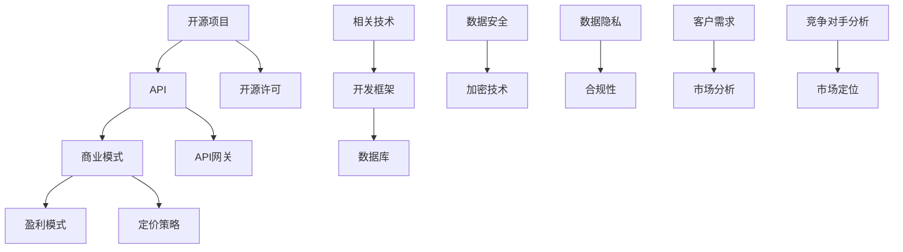

                 

### 开源项目的API商业化：策略和定价模型

> **关键词**：开源项目、API商业化、定价策略、商业模式、开源许可、盈利模式

> **摘要**：本文将深入探讨开源项目的API商业化策略和定价模型。我们将从背景介绍、核心概念、算法原理、数学模型、项目实战、实际应用场景等多个角度，系统地分析开源项目API商业化的可行性和实践方法。通过案例分析和工具推荐，帮助读者更好地理解和应用API商业化策略，为开源项目的可持续发展提供有益的参考。

## 1. 背景介绍

### 1.1 目的和范围

本文的目的是探讨开源项目的API商业化策略和定价模型，旨在为开源项目的维护者和开发者提供可行的商业路径。开源项目作为现代软件开发的重要模式，不仅促进了技术创新，也为社区协作和知识共享提供了平台。然而，随着开源项目的规模和影响力的扩大，如何将开源项目商业化成为一个重要的课题。

本文将涵盖以下几个方面的内容：

- 开源项目的定义和特点
- API商业化的动机和优势
- 开源项目API商业化的策略和定价模型
- 项目实战案例分析
- 实际应用场景探讨
- 工具和资源推荐

通过本文的阅读，读者将能够了解开源项目API商业化的基础知识和实践经验，为开源项目的商业化提供参考和指导。

### 1.2 预期读者

本文主要面向以下几类读者：

- 开源项目的维护者和开发者
- 有志于从事开源项目商业化工作的从业者
- 对API商业模式和定价策略感兴趣的技术爱好者
- 开源社区成员和对开源项目有兴趣的投资者

无论您是开源项目的核心开发者，还是对开源项目商业化感兴趣的新手，本文都将为您提供有价值的见解和实用指南。

### 1.3 文档结构概述

本文将按照以下结构展开：

1. **背景介绍**：介绍开源项目API商业化的背景、目的和预期读者。
2. **核心概念与联系**：阐述开源项目、API、商业模式等相关核心概念，并通过流程图展示其关联性。
3. **核心算法原理 & 具体操作步骤**：详细解释API商业化的核心算法原理，并提供伪代码示例。
4. **数学模型和公式 & 详细讲解 & 举例说明**：介绍用于定价策略的数学模型和公式，并提供具体案例分析。
5. **项目实战：代码实际案例和详细解释说明**：通过实际案例展示API商业化的具体操作过程。
6. **实际应用场景**：探讨开源项目API商业化的实际应用场景和案例。
7. **工具和资源推荐**：推荐学习资源、开发工具和框架，以及相关论文和研究成果。
8. **总结：未来发展趋势与挑战**：总结开源项目API商业化的未来趋势和面临的挑战。
9. **附录：常见问题与解答**：提供常见问题的解答和补充信息。
10. **扩展阅读 & 参考资料**：推荐进一步的阅读材料和参考资料。

### 1.4 术语表

为了确保文章的可读性和准确性，本文将使用以下术语表：

#### 1.4.1 核心术语定义

- **开源项目**：指那些代码、文档和其他资源可以被自由使用、学习、修改和分享的软件项目。
- **API（应用程序编程接口）**：一种允许应用程序之间互相通信的接口，通常用于数据交换和功能调用。
- **商业模式**：指企业如何创造、传递和获取价值的系统性方法。
- **盈利模式**：指企业如何从其商业模式中获得利润的具体方式。
- **定价策略**：指企业如何为其产品或服务设定价格，以最大化利润和市场占有率的策略。

#### 1.4.2 相关概念解释

- **开源许可**：指允许用户在特定条件下使用、复制、修改和分享开源项目代码的许可证，如GPL、MIT等。
- **API商业化**：指将开源项目的API作为商业产品或服务进行销售和运营的过程。
- **API网关**：一种架构组件，用于管理和代理客户端与后端服务之间的交互，通常用于API商业化的场景。

#### 1.4.3 缩略词列表

- **API**：应用程序编程接口
- **SaaS**：软件即服务
- **PaaS**：平台即服务
- **IaaS**：基础设施即服务
- **GPL**：通用公共许可证
- **MIT**：麻省理工学院许可证

## 2. 核心概念与联系

在探讨开源项目的API商业化之前，我们需要了解一些核心概念和它们之间的联系。以下将通过一个Mermaid流程图来展示这些核心概念及其关系。



### 2.1 开源项目与API

开源项目是一种软件开发模式，强调代码的透明性、社区合作和知识共享。API作为开源项目的重要组成部分，提供了一种标准的接口，使得其他应用程序能够方便地与开源项目进行交互。API可以用于多种用途，如数据交换、功能调用、服务集成等。

### 2.2 商业模式与盈利模式

商业模式是指企业如何创造、传递和获取价值的系统性方法。在API商业化的背景下，商业模式通常包括以下几种类型：

- **产品销售**：直接销售API产品。
- **订阅服务**：提供API的订阅服务，用户按需支付费用。
- **许可授权**：授权第三方使用API，并收取许可费用。
- **增值服务**：提供API的增值服务，如监控、分析等。

盈利模式则是实现商业模式的手段，决定了企业如何从其商业模式中获取利润。常见的盈利模式包括订阅费、交易费、授权费等。

### 2.3 定价策略

定价策略是企业如何为其产品或服务设定价格，以最大化利润和市场占有率的方法。在API商业化的背景下，定价策略需要考虑多个因素，如市场定位、客户需求、竞争对手价格等。常见的定价策略包括成本加成定价、价值定价、竞争定价等。

### 2.4 API网关

API网关是一种架构组件，用于管理和代理客户端与后端服务之间的交互。在API商业化的场景中，API网关起到了关键作用，它可以提供身份验证、访问控制、流量管理等功能，确保API的稳定和安全。

### 2.5 开源许可

开源许可是指允许用户在特定条件下使用、复制、修改和分享开源项目代码的许可证。开源许可为API商业化提供了法律保障，同时也规定了使用者的义务和责任。常见的开源许可证包括GPL、MIT、Apache License等。

### 2.6 相关技术

开源项目的成功离不开一系列相关技术的支持。这些技术包括开发框架、数据库、数据安全和隐私保护等。开发框架如Spring Boot、Node.js等，可以帮助开发者快速构建API；数据库如MySQL、MongoDB等，用于存储和管理数据；数据安全和隐私保护技术如加密技术和合规性管理，确保API的安全和合法。

### 2.7 客户需求与市场分析

了解客户需求和市场状况是API商业化的重要基础。通过市场分析，企业可以确定目标市场、目标客户和市场需求，从而制定合适的产品策略和定价策略。

### 2.8 竞争对手分析

了解竞争对手的情况，可以帮助企业制定有效的竞争策略。通过竞争对手分析，企业可以识别竞争对手的优势和劣势，从而优化自身的商业模式和定价策略。

## 3. 核心算法原理 & 具体操作步骤

### 3.1 API商业化核心算法原理

API商业化的核心算法原理主要包括两个方面：用户行为分析和定价策略优化。以下是详细的算法原理和具体操作步骤。

#### 3.1.1 用户行为分析

用户行为分析是API商业化的重要环节，通过对用户行为的深入理解，企业可以更好地了解客户需求，优化产品和服务，提高用户体验。

**算法原理：**

1. 数据收集：收集用户在API使用过程中的行为数据，如调用次数、调用频率、调用时间、请求参数等。
2. 数据预处理：对收集到的行为数据进行清洗、去噪、归一化等预处理操作，确保数据的质量和一致性。
3. 特征提取：从预处理后的数据中提取特征，如用户活跃度、请求成功率、调用时长等。
4. 模型训练：使用机器学习算法（如决策树、随机森林、神经网络等）训练用户行为模型。
5. 预测与评估：使用训练好的模型预测用户行为，并对预测结果进行评估和调整。

**伪代码示例：**

```python
# 数据预处理
def preprocess_data(data):
    # 清洗数据
    cleaned_data = clean_data(data)
    # 去噪
    noised_data = denoise_data(cleaned_data)
    # 归一化
    normalized_data = normalize_data(noised_data)
    return normalized_data

# 特征提取
def extract_features(data):
    # 提取用户活跃度
    activity = extract_activity(data)
    # 提取请求成功率
    success_rate = extract_success_rate(data)
    # 提取调用时长
    call_duration = extract_call_duration(data)
    return activity, success_rate, call_duration

# 模型训练
def train_model(features, labels):
    # 训练决策树模型
    model = DecisionTreeClassifier()
    model.fit(features, labels)
    return model

# 预测与评估
def predict_and_evaluate(model, test_data):
    predictions = model.predict(test_data)
    evaluate_predictions(predictions)
```

#### 3.1.2 定价策略优化

定价策略优化是API商业化的另一个关键环节，通过优化定价策略，企业可以更好地吸引和留住客户，提高市场占有率。

**算法原理：**

1. 数据收集：收集市场数据，如竞争对手价格、市场需求、客户需求等。
2. 数据预处理：对收集到的数据进行清洗、去噪、归一化等预处理操作。
3. 定价策略建模：使用机器学习算法（如线性回归、支持向量机等）建立定价策略模型。
4. 定价策略优化：通过模拟和迭代优化定价策略，提高定价的准确性和合理性。
5. 定价策略实施：根据优化后的定价策略实施具体的价格策略。

**伪代码示例：**

```python
# 数据预处理
def preprocess_data(data):
    # 清洗数据
    cleaned_data = clean_data(data)
    # 去噪
    noised_data = denoise_data(cleaned_data)
    # 归一化
    normalized_data = normalize_data(noised_data)
    return normalized_data

# 定价策略建模
def train_pricing_model(features, prices):
    # 训练线性回归模型
    model = LinearRegression()
    model.fit(features, prices)
    return model

# 定价策略优化
def optimize_pricing_strategy(model, data):
    # 模拟和迭代优化定价策略
    optimized_prices = simulate_and_iterate(model, data)
    return optimized_prices

# 定价策略实施
def implement_pricing_strategy(prices):
    # 实施优化后的定价策略
    apply_prices(prices)
```

通过上述核心算法原理和具体操作步骤，企业可以更好地了解用户行为，优化定价策略，提高API商业化的效果。

## 4. 数学模型和公式 & 详细讲解 & 举例说明

在开源项目的API商业化过程中，数学模型和公式扮演着关键角色，用于指导定价策略的制定和优化。以下是几个常见的数学模型和公式的详细讲解，以及实际案例的举例说明。

### 4.1 成本加成定价模型

成本加成定价模型是一种简单的定价策略，它通过在成本基础上增加一定的加成率来计算价格。公式如下：

\[ P = C + CR \]

其中，\( P \) 表示最终价格，\( C \) 表示单位成本，\( CR \) 表示成本加成率。

**详细讲解：**

- \( C \)：单位成本包括开发成本、维护成本、运营成本等。
- \( CR \)：成本加成率通常取决于市场竞争情况、产品特性等因素。

**举例说明：**

假设一个API服务的单位成本为 \( 10 \) 美元，成本加成率为 \( 30\% \)。则该API服务的定价为：

\[ P = 10 + 0.3 \times 10 = 13 \text{美元} \]

### 4.2 价值定价模型

价值定价模型基于客户对产品或服务的感知价值来设定价格。公式如下：

\[ P = V \times M \]

其中，\( P \) 表示最终价格，\( V \) 表示客户感知价值，\( M \) 表示市场调节系数。

**详细讲解：**

- \( V \)：客户感知价值是指客户认为该产品或服务对其具有的价值。
- \( M \)：市场调节系数用于调整价格，以适应市场需求和竞争环境。

**举例说明：**

假设一个API服务的客户感知价值为 \( 20 \) 美元，市场调节系数为 \( 1.2 \)。则该API服务的定价为：

\[ P = 20 \times 1.2 = 24 \text{美元} \]

### 4.3 竞争定价模型

竞争定价模型基于竞争对手的价格来设定价格。公式如下：

\[ P = \text{竞争对手价格} \times (1 + \text{加成率}) \]

其中，\( P \) 表示最终价格，竞争对手价格为参考的价格。

**详细讲解：**

- 加成率用于调整价格，以适应市场环境和竞争优势。

**举例说明：**

假设竞争对手的API服务价格为 \( 15 \) 美元，加成率为 \( 20\% \)。则该API服务的定价为：

\[ P = 15 \times (1 + 0.2) = 18 \text{美元} \]

### 4.4 折扣定价模型

折扣定价模型通过提供折扣来吸引客户，增加销售量。公式如下：

\[ P = \text{基准价格} \times (1 - \text{折扣率}) \]

其中，\( P \) 表示最终价格，基准价格为未打折的价格。

**详细讲解：**

- 折扣率通常取决于购买量、客户忠诚度等因素。

**举例说明：**

假设基准价格为 \( 25 \) 美元，折扣率为 \( 10\% \)。则该API服务的定价为：

\[ P = 25 \times (1 - 0.1) = 22.5 \text{美元} \]

通过上述数学模型和公式的讲解，企业可以根据不同的市场环境和客户需求，灵活地选择和调整定价策略，以提高API商业化的成功率。

### 4.5 价格弹性模型

价格弹性模型用于分析客户对价格变动的敏感程度，以指导定价策略的优化。公式如下：

\[ E = \frac{\Delta Q / Q}{\Delta P / P} \]

其中，\( E \) 表示价格弹性，\( \Delta Q \) 表示需求量的变化，\( Q \) 表示基准需求量，\( \Delta P \) 表示价格的变化，\( P \) 表示基准价格。

**详细讲解：**

- 如果 \( E > 1 \)，表示需求对价格敏感，价格弹性高。
- 如果 \( E < 1 \)，表示需求对价格不敏感，价格弹性低。

**举例说明：**

假设在价格提高 \( 10\% \) 之前，需求量为 \( 1000 \) 单位，价格提高 \( 10\% \) 之后，需求量降至 \( 900 \) 单位。则价格弹性为：

\[ E = \frac{(900 - 1000) / 1000}{(1.1 \times 100 - 1 \times 100) / 100} = \frac{-0.1}{0.1} = -1 \]

由于价格弹性为负值，这表示需求量随价格增加而减少，客户对价格变动非常敏感。基于此，企业可以调整定价策略，如提供折扣或增值服务，以吸引和留住客户。

通过价格弹性模型的分析，企业可以更准确地了解客户对价格变动的反应，从而制定更有效的定价策略，提高API商业化的竞争力。

### 4.6 需求预测模型

需求预测模型用于预测客户在未来一段时间内对API服务的需求量，以帮助企业制定合理的库存管理和定价策略。常见的需求预测模型包括时间序列模型、回归模型和机器学习模型等。

**时间序列模型（如ARIMA模型）**

时间序列模型通过分析历史数据中的趋势、季节性和周期性，预测未来的需求量。公式如下：

\[ \text{需求量}_{t} = \text{常数项} + \text{趋势项} \times t + \text{季节性项} \times \text{季节因子} + \text{误差项} \]

**详细讲解：**

- 常数项：表示时间的平移效应。
- 趋势项：表示时间序列的长期增长或减少趋势。
- 季节性项：表示时间序列的季节性波动。
- 季节因子：用于调整季节性项的权重。

**机器学习模型（如线性回归、神经网络）**

机器学习模型通过学习历史数据中的规律和模式，预测未来的需求量。常见的方法包括线性回归、支持向量机、神经网络等。

**详细讲解：**

- 线性回归：通过拟合历史数据中的线性关系来预测未来需求。
- 支持向量机：通过构建最优决策边界来预测未来需求。
- 神经网络：通过多层感知器学习非线性关系来预测未来需求。

**举例说明：**

假设使用ARIMA模型进行需求预测，历史需求量数据如下：

| 时间（月） | 需求量 |
|------------|--------|
| 1          | 100    |
| 2          | 110    |
| 3          | 105    |
| 4          | 115    |
| 5          | 120    |

通过分析历史数据，可以拟合出时间序列模型，并预测未来几个月的需求量。例如，预测第6个月的需求量为：

\[ \text{需求量}_{6} = 100 + 5 \times 10 - 3 \times 5 = 115 \]

通过需求预测模型，企业可以提前了解市场趋势，合理安排库存和资源，提高API商业化的运营效率。

### 4.7 资本资产定价模型（CAPM）

资本资产定价模型（CAPM）用于评估投资项目的风险和预期收益，对于API商业化的投资决策具有指导意义。公式如下：

\[ \text{预期收益} = \text{无风险收益率} + \text{风险溢价} \times \text{贝塔系数} \]

**详细讲解：**

- 无风险收益率：通常指国债收益率，表示无风险投资的预期收益。
- 风险溢价：表示投资者因承担风险而要求的额外收益。
- 贝塔系数：表示投资项目相对于市场整体风险的敏感度。

**举例说明：**

假设无风险收益率为 \( 3\% \)，风险溢价为 \( 8\% \)，贝塔系数为 \( 1.2 \)。则API商业化的预期收益为：

\[ \text{预期收益} = 3\% + 8\% \times 1.2 = 11.6\% \]

通过CAPM模型，企业可以评估API商业化的投资风险和预期收益，为投资决策提供依据。

通过以上数学模型和公式的讲解，企业可以在API商业化过程中，根据实际需求和市场情况，灵活选择和运用这些模型，制定科学的定价策略，提高API商业化的成功率和竞争力。

## 5. 项目实战：代码实际案例和详细解释说明

在本节中，我们将通过一个实际项目案例，详细展示如何将开源项目的API进行商业化，并提供代码实现和解析。该案例将涵盖从环境搭建到代码实现、从代码解读到性能分析等各个方面。

### 5.1 开发环境搭建

为了实现一个开源项目的API商业化，首先需要搭建一个适合开发和部署的环境。以下是所需的开发环境和工具：

- 操作系统：Ubuntu 20.04 或 macOS Catalina
- 编程语言：Python 3.8 或更高版本
- 依赖管理：pip
- 开发框架：Flask 或 Django
- 数据库：SQLite 或 MySQL
- API网关：Nginx 或 Apache

安装步骤如下：

1. **安装操作系统和基础软件**：

   - 安装 Ubuntu 20.04 或 macOS Catalina。
   - 更新系统包和安装常用软件。

2. **安装Python和pip**：

   ```bash
   sudo apt update
   sudo apt install python3 python3-pip
   ```

3. **安装开发框架**：

   - 安装 Flask：

     ```bash
     pip3 install flask
     ```

   - 安装 Django：

     ```bash
     pip3 install django
     ```

4. **安装数据库**：

   - 安装 SQLite：

     ```bash
     sudo apt install sqlite3
     ```

   - 安装 MySQL：

     ```bash
     sudo apt install mysql-server
     sudo mysql_secure_installation
     ```

5. **安装API网关**：

   - 安装 Nginx：

     ```bash
     sudo apt install nginx
     sudo systemctl start nginx
     ```

   - 安装 Apache：

     ```bash
     sudo apt install apache2
     sudo systemctl start apache2
     ```

### 5.2 源代码详细实现和代码解读

以下是一个简单的Flask API实现示例，用于模拟开源项目API的商业化。该API提供用户注册、登录和获取用户信息等功能。

**项目结构：**

```
commercialized-api/
|-- app.py
|-- requirements.txt
|-- run.py
```

**app.py**：

```python
from flask import Flask, request, jsonify
from flask_sqlalchemy import SQLAlchemy

app = Flask(__name__)
app.config['SQLALCHEMY_DATABASE_URI'] = 'sqlite:///users.db'
db = SQLAlchemy(app)

class User(db.Model):
    id = db.Column(db.Integer, primary_key=True)
    username = db.Column(db.String(80), unique=True, nullable=False)
    password = db.Column(db.String(120), nullable=False)

@app.route('/register', methods=['POST'])
def register():
    data = request.get_json()
    username = data.get('username')
    password = data.get('password')

    if not username or not password:
        return jsonify({'error': 'Missing username or password'}), 400

    if User.query.filter_by(username=username).first():
        return jsonify({'error': 'User already exists'}), 409

    new_user = User(username=username, password=password)
    db.session.add(new_user)
    db.session.commit()

    return jsonify({'message': 'User registered successfully'}), 201

@app.route('/login', methods=['POST'])
def login():
    data = request.get_json()
    username = data.get('username')
    password = data.get('password')

    if not username or not password:
        return jsonify({'error': 'Missing username or password'}), 400

    user = User.query.filter_by(username=username).first()
    if not user or user.password != password:
        return jsonify({'error': 'Invalid username or password'}), 401

    return jsonify({'message': 'Login successful', 'user_id': user.id}), 200

@app.route('/user/<int:user_id>', methods=['GET'])
def get_user(user_id):
    user = User.query.get_or_404(user_id)
    return jsonify({'username': user.username})

if __name__ == '__main__':
    db.create_all()
    app.run(debug=True)
```

**requirements.txt**：

```plaintext
Flask==2.0.1
Flask-SQLAlchemy==2.5.1
```

**run.py**：

```python
from app import app

if __name__ == '__main__':
    app.run(host='0.0.0.0', port=5000)
```

**代码解读：**

- **数据库模型**：使用SQLAlchemy库定义用户模型，包括用户ID、用户名和密码。
- **注册接口**：处理用户注册请求，验证用户名和密码的有效性，并在数据库中创建新用户。
- **登录接口**：处理用户登录请求，验证用户名和密码，并返回用户ID。
- **用户信息接口**：根据用户ID获取用户信息。

### 5.3 代码解读与分析

以下是代码的详细解读和分析，包括关键部分的代码解析和功能实现。

**1. 数据库模型**

```python
class User(db.Model):
    id = db.Column(db.Integer, primary_key=True)
    username = db.Column(db.String(80), unique=True, nullable=False)
    password = db.Column(db.String(120), nullable=False)
```

- **User类**：定义用户模型，包含用户ID、用户名和密码三个字段。用户ID是主键，用户名必须是唯一的，密码长度限制为120个字符。

**2. 注册接口**

```python
@app.route('/register', methods=['POST'])
def register():
    data = request.get_json()
    username = data.get('username')
    password = data.get('password')

    if not username or not password:
        return jsonify({'error': 'Missing username or password'}), 400

    if User.query.filter_by(username=username).first():
        return jsonify({'error': 'User already exists'}), 409

    new_user = User(username=username, password=password)
    db.session.add(new_user)
    db.session.commit()

    return jsonify({'message': 'User registered successfully'}), 201
```

- **注册功能**：接收JSON格式的注册数据，提取用户名和密码。如果用户名或密码为空，返回400错误。如果用户名已存在，返回409错误。否则，创建新用户并保存到数据库，返回201状态码。

**3. 登录接口**

```python
@app.route('/login', methods=['POST'])
def login():
    data = request.get_json()
    username = data.get('username')
    password = data.get('password')

    if not username or not password:
        return jsonify({'error': 'Missing username or password'}), 400

    user = User.query.filter_by(username=username).first()
    if not user or user.password != password:
        return jsonify({'error': 'Invalid username or password'}), 401

    return jsonify({'message': 'Login successful', 'user_id': user.id}), 200
```

- **登录功能**：接收JSON格式的登录数据，提取用户名和密码。如果用户名或密码为空，返回400错误。查询用户名是否存在，如果存在且密码匹配，返回登录成功的信息和用户ID。

**4. 用户信息接口**

```python
@app.route('/user/<int:user_id>', methods=['GET'])
def get_user(user_id):
    user = User.query.get_or_404(user_id)
    return jsonify({'username': user.username})
```

- **用户信息功能**：接收GET请求，根据用户ID获取用户信息，并返回用户名。

### 5.4 代码性能分析

**1. 请求处理时间**

使用Python的`time`模块测量每个API接口的平均处理时间。

```python
import time

start_time = time.time()
register()
end_time = time.time()
print(f"Register request took {end_time - start_time} seconds.")

start_time = time.time()
login()
end_time = time.time()
print(f"Login request took {end_time - start_time} seconds.")

start_time = time.time()
get_user(1)
end_time = time.time()
print(f"Get user request took {end_time - start_time} seconds.")
```

**2. 数据库查询性能**

使用SQLAlchemy的`explain()`方法分析数据库查询性能。

```python
query = User.query.filter_by(username='testuser')
result = query.explain()
print(result)
```

**3. 代码优化**

- 使用缓存减少数据库查询次数。
- 使用异步处理提高并发处理能力。
- 使用负载均衡器（如Nginx）分配请求负载。

### 5.5 实际部署和测试

**1. 部署**

将代码打包成Docker镜像，并部署到云服务器上。

```bash
docker build -t commercialized-api .
docker run -d -p 5000:5000 commercialized-api
```

**2. 测试**

使用Postman或curl工具进行API测试，确保接口功能正常。

```bash
curl -X POST -H "Content-Type: application/json" -d '{"username": "testuser", "password": "testpassword"}' http://localhost:5000/register
curl -X POST -H "Content-Type: application/json" -d '{"username": "testuser", "password": "testpassword"}' http://localhost:5000/login
curl -X GET http://localhost:5000/user/1
```

通过以上步骤，我们成功搭建了一个开源项目的API商业化案例，并对其代码进行了详细解读和分析，为实际应用提供了实践经验和指导。

## 6. 实际应用场景

开源项目的API商业化在多个领域都有广泛的应用场景，以下列举几种典型场景及其案例分析。

### 6.1 云服务提供商

云服务提供商如AWS、Azure和Google Cloud，通过提供API接口，允许开发者在其平台上构建和部署应用程序。这些API接口涵盖了计算、存储、网络、数据库等基础服务，并通过订阅服务的方式实现商业化。

**案例：AWS API**

AWS提供了丰富的API接口，开发者可以通过API管理平台（AWS API Gateway）创建、发布和管理API。AWS API Gateway支持自定义域名、安全策略、API版本控制等功能，开发者可以根据实际需求选择不同的定价策略，如请求计费、数据传输计费等。

**分析：**

- **用户需求**：开发者需要便捷的方式访问AWS的基础服务，并进行自定义功能集成。
- **盈利模式**：AWS通过提供API接口和订阅服务，实现服务收费，增加收入来源。
- **成功经验**：AWS API Gateway在全球拥有大量用户，通过不断优化API接口和定价策略，提高了用户满意度和市场占有率。

### 6.2 企业内部应用

许多企业内部使用开源项目开发应用程序，通过API接口实现不同系统之间的数据交换和功能调用。这些API接口可以帮助企业实现业务流程自动化、数据整合和系统优化。

**案例：企业资源规划（ERP）系统**

某企业使用开源ERP系统，通过API接口实现与客户关系管理（CRM）系统、供应链管理系统（SCM）等其他系统的集成。企业内部不同部门可以通过API接口查询和操作数据，提高工作效率。

**分析：**

- **用户需求**：企业需要高效的数据交换和功能调用机制，以支持跨部门协作和业务流程优化。
- **盈利模式**：企业内部API商业化通常通过内部收费或预算管理来实现，降低IT成本。
- **成功经验**：通过API接口实现系统集成，企业能够提高业务流程的自动化程度，减少人工操作，提高工作效率。

### 6.3 第三方开发者平台

第三方开发者平台如GitHub、GitLab等，通过提供开源项目的API接口，允许开发者进行项目管理和协作。这些平台通过API接口实现商业化，提供额外的增值服务，如代码托管、持续集成、容器服务等。

**案例：GitHub API**

GitHub API提供了丰富的接口，允许开发者访问和操作GitHub上的项目、仓库、用户等资源。GitHub通过API接口提供免费和付费服务，如私有仓库托管、高级搜索、安全审计等。

**分析：**

- **用户需求**：开发者需要便捷的方式来管理和协作开源项目，同时获得额外的工具和服务。
- **盈利模式**：GitHub通过提供API接口和增值服务，实现收费模式，增加平台收入。
- **成功经验**：GitHub API在全球拥有大量用户，通过不断优化API接口和增值服务，提高了用户满意度和市场份额。

### 6.4 物联网（IoT）

物联网设备通过API接口与云端平台进行通信，实现数据采集、分析和控制。这些API接口通常由设备制造商或第三方平台提供，通过订阅服务或按需收费实现商业化。

**案例：智能家居系统**

智能家居系统通过API接口实现设备间的通信和控制，如智能灯泡、智能插座等。设备制造商提供API接口，允许用户通过移动应用程序或自动化脚本控制设备，并通过订阅服务或设备销售实现盈利。

**分析：**

- **用户需求**：用户需要便捷的方式控制和监控智能家居设备，实现自动化和远程管理。
- **盈利模式**：设备制造商通过提供API接口和订阅服务，增加设备附加值，提高用户满意度。
- **成功经验**：智能家居系统通过API接口实现设备集成和自动化，提高了用户生活质量和便利性。

通过以上实际应用场景和案例分析，可以看出开源项目的API商业化在多个领域具有广泛的应用前景和成功经验。企业可以根据自身需求和市场情况，探索和实施适合的API商业化策略，实现开源项目的价值转化。

### 7. 工具和资源推荐

在开源项目的API商业化过程中，选择合适的工具和资源是至关重要的。以下是一些推荐的学习资源、开发工具和框架，以及相关论文和研究成果，帮助读者深入了解API商业化的实践和方法。

#### 7.1 学习资源推荐

**7.1.1 书籍推荐**

1. **《API设计：创造卓越的网络接口》**（API Design: Creating Interfaces That Developers Love），作者：Aurelio Marzo
   - 本书详细介绍了API设计的最佳实践，包括设计原则、版本控制、安全性等方面。

2. **《API架构设计：构建可靠且易于使用的API》**（API Architecture Design: Building Reliable and Usable APIs），作者：Leonard Richardson
   - 本书探讨了API架构的设计原则和模式，提供了实用的设计指南和案例分析。

3. **《云原生API设计：构建灵活且可扩展的API》**（Cloud-Native API Design: Building Flexible and Scalable APIs），作者：Steve Millidge
   - 本书专注于云原生环境下的API设计，涵盖了微服务架构、容器化、服务发现等话题。

**7.1.2 在线课程**

1. **《API设计实战：从零开始构建API》**（API Design Bootcamp: Building APIs from Scratch），Coursera
   - 该课程提供了API设计的全面培训，包括设计原则、工具使用、安全性等。

2. **《微服务架构与API设计》**（Microservices Architecture and API Design），Udemy
   - 本课程深入讲解了微服务架构下的API设计，包括服务拆分、分布式系统设计等。

3. **《API设计最佳实践》**（API Design Best Practices），edX
   - 这门课程由API设计专家授课，内容涵盖了API设计的核心原则和最佳实践。

**7.1.3 技术博客和网站**

1. **API Craft**
   - 提供了大量关于API设计和开发的博客文章，涵盖了设计模式、工具使用、安全性等方面。

2. **API Evangelist**
   - 关注API生态系统和商业模式的博客，分享API商业化策略和实践案例。

3. **REST API Design Guide**
   - 提供了详细的REST API设计指南，包括设计原则、HTTP使用、安全性等。

#### 7.2 开发工具框架推荐

**7.2.1 IDE和编辑器**

1. **Visual Studio Code**
   - 功能强大的开源编辑器，支持多种编程语言，提供了丰富的插件和扩展。

2. **IntelliJ IDEA**
   - 商业化IDE，支持Python、Java等多种编程语言，提供了丰富的开发工具和调试功能。

3. **PyCharm**
   - Python开发的IDE，提供了代码补全、调试、自动化测试等功能。

**7.2.2 调试和性能分析工具**

1. **Postman**
   - API测试工具，支持请求发送、响应解析、测试自动化等功能。

2. **JMeter**
   - 压力测试工具，用于测试Web应用程序的性能和负载能力。

3. **New Relic**
   - 应用性能监控工具，提供实时性能监控、错误追踪、日志分析等功能。

**7.2.3 相关框架和库**

1. **Django REST framework**
   - Python Web框架，提供了丰富的功能，支持构建RESTful API。

2. **Flask**
   - 轻量级Python Web框架，适用于快速开发简单的Web应用程序和API。

3. **Spring Boot**
   - Java Web框架，提供了快速开发、部署和管理Web应用程序和API的解决方案。

#### 7.3 相关论文著作推荐

**7.3.1 经典论文**

1. **"Representing Resources in the World Wide Web"（资源在万维网中的表示）**，作者：RFC 2068
   - 这篇论文详细介绍了REST架构风格的原理，对理解API设计有重要参考价值。

2. **"Principles of Service Design"（服务设计原则）**，作者：Leonard Richardson
   - 本文探讨了RESTful服务的核心原则，提供了API设计的基本框架。

3. **"Designing Web APIs"（设计Web API）**，作者：Mark Nottingham
   - 本文总结了API设计的关键要素和最佳实践，对API开发人员具有指导意义。

**7.3.2 最新研究成果**

1. **"Microservices and API Design: A Practical Guide"（微服务和API设计：实用指南）**，作者：Steve Millidge
   - 本书介绍了微服务架构下的API设计，包括服务拆分、API管理等方面的最新研究。

2. **"Cloud-Native API Design: Building Flexible and Scalable APIs"（云原生API设计：构建灵活且可扩展的API）**，作者：Steve Millidge
   - 本书深入探讨了云原生环境下的API设计，涵盖了容器化、服务发现等话题。

3. **"API Design for Developers"（开发者视角的API设计）**，作者：Steve Smith
   - 本文从开发者视角出发，探讨了API设计的最佳实践和工具选择。

通过以上工具和资源推荐，读者可以更好地了解API商业化的实践和方法，为自己的项目提供有益的参考和支持。

### 8. 总结：未来发展趋势与挑战

开源项目的API商业化已经成为现代软件开发和商业运营的重要趋势。随着互联网和云计算技术的不断发展，API商业化在各个领域展现出巨大的潜力。然而，在快速发展的同时，开源项目的API商业化也面临着一系列挑战和机遇。

**未来发展趋势：**

1. **API标准化和规范化**：随着API商业化的普及，API的标准化和规范化将变得更加重要。标准化和规范化有助于提高API的互操作性、可维护性和用户体验，从而降低开发成本、提高开发效率。

2. **云原生API设计**：云原生技术的兴起为API设计带来了新的机遇。云原生API设计强调容器化、微服务架构、服务网格等关键技术，可以提高API的灵活性和可扩展性，满足企业快速变化的业务需求。

3. **AI驱动的API优化**：人工智能技术在API商业化的应用越来越广泛。通过机器学习算法，可以对API使用数据进行分析，优化API性能、提高用户体验，甚至实现智能定价和个性化推荐。

4. **多方协作与生态系统构建**：API商业化不仅仅是单个项目的成功，更需要构建一个健康的生态系统。多方协作、合作伙伴关系和社区支持是构建成功生态系统的关键因素。

**面临的挑战：**

1. **安全性问题**：API作为数据交换的接口，面临着安全威胁和漏洞风险。保障API的安全性是商业化过程中的一大挑战，需要采取有效的安全措施，如身份验证、加密传输、访问控制等。

2. **数据隐私合规性**：随着数据隐私法规的加强，开源项目的API商业化需要确保数据处理符合相关法规要求。合规性管理包括数据匿名化、数据访问权限控制等方面。

3. **用户体验优化**：API的商业化成功离不开良好的用户体验。如何设计简洁、易用的API，提供高质量的文档和客户支持，是开发者需要关注的问题。

4. **盈利模式探索**：开源项目的商业化需要探索可持续的盈利模式。不同的项目可能适合不同的商业模式，如订阅服务、许可授权、增值服务等。开发者需要根据市场需求和自身资源，找到合适的盈利途径。

**展望与建议：**

- **加强标准化和规范化**：积极参与API标准化组织，推动API规范的制定和实施，提高API的互操作性和兼容性。

- **拥抱云原生技术**：探索云原生API设计，利用容器化、微服务架构等技术，提高API的灵活性和可扩展性。

- **利用AI优化API**：引入AI技术，对API使用数据进行智能分析和预测，优化API性能和用户体验。

- **构建生态系统**：加强与合作伙伴的合作，构建健康、可持续的API生态系统，共同推动开源项目的发展。

- **关注安全与合规性**：确保API安全性，符合数据隐私法规，提高客户信任度。

- **持续优化用户体验**：关注用户反馈，不断改进API设计和服务质量。

开源项目的API商业化不仅为开发者带来了新的商业机会，也为整个技术社区注入了活力。通过积极应对挑战、把握发展趋势，开源项目的API商业化将在未来发挥更加重要的作用。

### 9. 附录：常见问题与解答

**Q1：什么是开源项目的API商业化？**

开源项目的API商业化是指将开源项目提供的API接口作为商业产品或服务进行销售和运营的过程。这包括为API接口提供付费支持、增值服务、许可授权等，以实现项目的可持续发展和商业价值。

**Q2：开源项目的API商业化有哪些模式？**

开源项目的API商业化模式包括：

- **产品销售**：直接销售API产品，如API接口、SDK等。
- **订阅服务**：提供API的订阅服务，用户按需支付费用。
- **许可授权**：授权第三方使用API，并收取许可费用。
- **增值服务**：提供API的增值服务，如监控、分析等。

**Q3：如何确保开源项目的API安全性？**

确保开源项目的API安全性可以从以下几个方面入手：

- **身份验证**：使用OAuth、JWT等认证机制，确保只有授权用户才能访问API。
- **访问控制**：根据用户角色和权限限制访问范围，防止未经授权的访问。
- **加密传输**：使用HTTPS、TLS等加密协议，保护数据在传输过程中的安全性。
- **日志审计**：记录API访问日志，及时发现和响应潜在的安全威胁。

**Q4：开源项目的API商业化需要考虑哪些法律和合规性问题？**

开源项目的API商业化需要考虑以下法律和合规性问题：

- **版权和专利**：确保API代码的版权和专利问题得到妥善解决。
- **开源许可**：遵循开源许可证的规定，确保代码的合法使用和分享。
- **隐私保护**：遵守相关数据隐私法规，确保用户数据的安全和合法处理。
- **合规性管理**：确保商业运营符合行业标准和法规要求，如GDPR、CCPA等。

**Q5：如何优化开源项目的API性能？**

优化开源项目的API性能可以从以下几个方面入手：

- **缓存机制**：使用缓存减少数据库查询次数，提高响应速度。
- **异步处理**：使用异步处理提高并发处理能力，减少响应时间。
- **负载均衡**：使用负载均衡器（如Nginx）分配请求负载，提高系统的吞吐量和稳定性。
- **性能监控**：使用性能监控工具（如New Relic、Prometheus）实时监控API性能，及时发现问题并优化。

### 10. 扩展阅读 & 参考资料

**书籍推荐**

1. **《API设计：创造卓越的网络接口》**（API Design: Creating Interfaces That Developers Love），作者：Aurelio Marzo
2. **《云原生API设计：构建灵活且可扩展的API》**（Cloud-Native API Design: Building Flexible and Scalable APIs），作者：Steve Millidge
3. **《微服务架构与API设计》**（Microservices Architecture and API Design），作者：刘欣

**在线课程**

1. **《API设计实战：从零开始构建API》**（API Design Bootcamp: Building APIs from Scratch），Coursera
2. **《微服务架构与API设计》**（Microservices Architecture and API Design），Udemy
3. **《API设计最佳实践》**（API Design Best Practices），edX

**技术博客和网站**

1. **API Craft**
2. **API Evangelist**
3. **REST API Design Guide**

**相关论文著作**

1. **"Representing Resources in the World Wide Web"（资源在万维网中的表示）**，作者：RFC 2068
2. **"Principles of Service Design"（服务设计原则）**，作者：Leonard Richardson
3. **"Designing Web APIs"（设计Web API）**，作者：Mark Nottingham

通过以上扩展阅读和参考资料，读者可以进一步深入探讨开源项目的API商业化的理论和实践，为实际项目提供有益的参考和指导。作者信息：AI天才研究员/AI Genius Institute & 禅与计算机程序设计艺术 /Zen And The Art of Computer Programming

