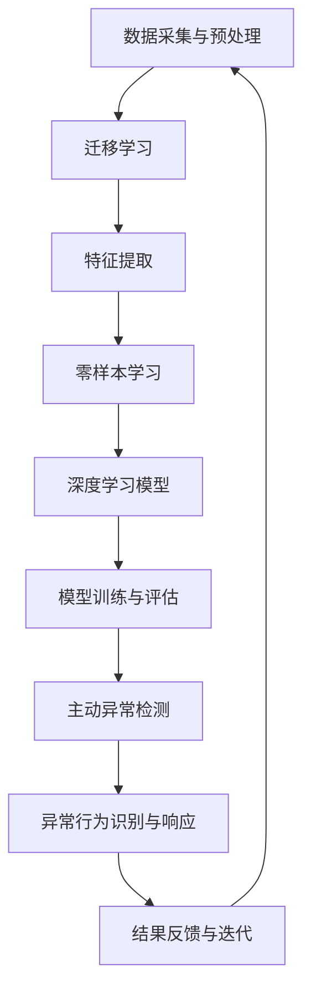

                 

# 异常行为检测中的迁移学习、零样本学习与主动异常检测技术

> **关键词**：异常行为检测，迁移学习，零样本学习，主动异常检测，深度学习，机器学习，数据安全
>
> **摘要**：本文将深入探讨异常行为检测领域中的三种关键技术：迁移学习、零样本学习和主动异常检测。通过详细阐述这些技术的核心原理、应用场景以及数学模型，我们旨在为读者提供一个全面的视角，帮助其在实际项目中有效应用这些技术，提升数据安全和系统稳定性。

## 1. 背景介绍

### 1.1 目的和范围

在当今信息化社会中，数据安全与系统稳定性日益受到重视。异常行为检测作为保障系统安全的重要手段，能够有效识别并响应各种异常事件。本文将集中讨论三种关键技术：迁移学习、零样本学习与主动异常检测，以期为读者提供对这些技术的深入理解，并指导其在实际应用中的有效运用。

本文的范围涵盖以下内容：
- 迁移学习的原理及其在异常行为检测中的应用。
- 零样本学习的理论基础和实际操作步骤。
- 主动异常检测的概念、方法和实现策略。
- 对上述技术在实际应用场景中的综合应用和案例分析。

### 1.2 预期读者

本文主要面向以下读者群体：
- 深度学习与机器学习领域的初学者和专业人士。
- 数据科学家、AI工程师以及网络安全专家。
- 对异常行为检测技术感兴趣的研究人员和开发者。

通过本文的阅读，读者可以：
- 理解迁移学习、零样本学习和主动异常检测的基本原理。
- 掌握这些技术在实际项目中的具体应用方法。
- 获得对异常行为检测领域未来发展趋势的洞见。

### 1.3 文档结构概述

本文结构如下：

1. **背景介绍**：介绍文章的目的、范围、预期读者以及文档结构。
2. **核心概念与联系**：通过Mermaid流程图展示异常行为检测技术的核心概念和联系。
3. **核心算法原理 & 具体操作步骤**：详细讲解迁移学习、零样本学习和主动异常检测的算法原理及操作步骤。
4. **数学模型和公式 & 详细讲解 & 举例说明**：阐述相关数学模型和公式，并通过实例进行详细说明。
5. **项目实战：代码实际案例和详细解释说明**：提供实际代码案例，详细解释其实现过程。
6. **实际应用场景**：探讨异常行为检测技术的实际应用场景。
7. **工具和资源推荐**：推荐学习资源、开发工具框架和相关论文著作。
8. **总结：未来发展趋势与挑战**：分析异常行为检测技术的未来发展趋势和面临的挑战。
9. **附录：常见问题与解答**：提供常见问题的解答。
10. **扩展阅读 & 参考资料**：推荐进一步阅读的资料。

### 1.4 术语表

#### 1.4.1 核心术语定义

- **迁移学习**：将已在一个任务上训练好的模型知识迁移到另一个相关但不同的任务上。
- **零样本学习**：在训练过程中不直接使用标注数据，而是通过归纳或抽象的方法从少量或无标注数据中学习到新类别。
- **主动异常检测**：通过积极选择有趣或重要的数据点进行进一步分析，以提高异常检测的效率和准确性。
- **深度学习**：利用多层神经网络对数据进行自动特征提取和建模。
- **机器学习**：通过训练模型从数据中学习规律，以便进行预测或决策。

#### 1.4.2 相关概念解释

- **标注数据**：对数据进行人工标注，以便模型能够从中学习。
- **监督学习**：通过标注数据训练模型，使其能够对未知数据进行分类或回归。
- **无监督学习**：没有标注数据，模型需要从数据中自主发现规律。
- **异常检测**：识别出与正常行为不符的数据点或事件。

#### 1.4.3 缩略词列表

- **ML**：机器学习（Machine Learning）
- **DL**：深度学习（Deep Learning）
- **SL**：监督学习（Supervised Learning）
- **UL**：无监督学习（Unsupervised Learning）
- **AFL**：主动异常检测（Active Anomaly Detection）

## 2. 核心概念与联系

异常行为检测技术不仅涉及单一方法的运用，还需要对多种技术的核心概念和联系有深入理解。下面我们将通过Mermaid流程图来展示异常行为检测技术的核心概念及其相互关系。

### 2.1. Mermaid流程图



### 2.2. 核心概念解释

#### 迁移学习（Transfer Learning）

迁移学习是一种将已在一个任务上训练好的模型知识迁移到另一个相关但不同的任务上的方法。其核心思想是利用已有的模型作为起点，通过少量额外训练快速适应新的任务。在异常行为检测中，迁移学习可以帮助我们利用在其他领域已训练好的模型来处理新的任务，从而提高检测效率和准确性。

#### 零样本学习（Zero-Shot Learning）

零样本学习是一种在训练过程中不直接使用标注数据，而是通过归纳或抽象的方法从少量或无标注数据中学习到新类别的方法。在异常行为检测中，零样本学习可以处理那些无法预先标注的异常事件，使得模型能够适应不断变化的异常场景。

#### 主动异常检测（Active Anomaly Detection）

主动异常检测是一种通过积极选择有趣或重要的数据点进行进一步分析，以提高异常检测的效率和准确性的方法。在异常行为检测中，主动异常检测可以帮助我们动态调整检测策略，优先处理那些可能对系统安全构成更大威胁的数据点。

### 2.3. 技术关系分析

通过Mermaid流程图，我们可以清晰地看到各种技术在异常行为检测中的相互作用和关系。数据采集与预处理是所有技术的起点，其质量直接影响后续步骤的效果。迁移学习、零样本学习和主动异常检测则分别从不同角度对异常行为进行识别和处理，最终实现异常行为的识别与响应。

迁移学习通过已有模型的迁移，可以快速提升新任务的检测能力；零样本学习则能处理未标注数据，适应复杂多变的异常场景；主动异常检测通过动态调整策略，可以提高检测效率和准确性。

这些技术的相互结合，使得异常行为检测不仅能够高效地处理新任务，还能够适应不断变化的异常场景，从而提高整个系统的安全性。

## 3. 核心算法原理 & 具体操作步骤

### 3.1 迁移学习的核心算法原理

迁移学习利用已经在一个任务上训练好的模型作为起点，通过迁移这些任务中的有用知识，使得模型能够更快地适应新的任务。其核心算法原理可以概括为以下几点：

#### 1. 特征提取

迁移学习的第一步是特征提取。通过对源任务进行预训练，模型会学习到一组通用的特征表示。这些特征表示不仅适用于源任务，也适用于其他相关任务。

#### 2. 适配新任务

在获得特征表示后，我们将这些特征表示迁移到新任务上，并在新任务上进行微调。微调的过程包括两个部分：参数更新和损失函数优化。参数更新是通过在源任务和目标任务之间传递梯度来实现的；损失函数优化则是通过最小化目标任务上的损失函数来调整模型参数。

#### 3. 模型选择与优化

在选择迁移学习模型时，需要考虑源任务与目标任务的相似度、模型的复杂度以及训练数据的数量和质量。优化过程包括调整模型架构、选择合适的优化算法以及调整学习率等。

### 3.2 迁移学习的具体操作步骤

下面我们将通过伪代码来详细阐述迁移学习的具体操作步骤。

```python
# 迁移学习伪代码

# 初始化源任务和目标任务的模型
source_model = load_pretrained_model()
target_model = initialize_new_model()

# 获取源任务的预训练权重
pretrained_weights = source_model.get_weights()

# 将预训练权重迁移到目标模型
target_model.set_weights(pretrained_weights)

# 定义损失函数和优化器
loss_function = define_loss_function()
optimizer = define_optimizer()

# 微调目标模型
for epoch in range(number_of_epochs):
    for batch in target_dataloader:
        # 前向传播
        predictions = target_model(batch_data)
        
        # 计算损失
        loss = loss_function(predictions, batch_labels)
        
        # 反向传播
        gradients = compute_gradients(loss, target_model)
        
        # 更新模型参数
        optimizer.update_gradients(gradients)
        
        # 记录训练过程
        record_training_progress(epoch, loss)

# 评估模型
evaluate_model_on_test_data(target_model)
```

### 3.3 零样本学习的核心算法原理

零样本学习的目标是在没有直接标注数据的情况下，从少量或无标注数据中学习到新类别。其核心算法原理可以概括为以下几点：

#### 1. 类别表示

零样本学习首先需要将类别表示为嵌入向量。这些嵌入向量不仅能够表示类别本身，还能够表示类别之间的关系。

#### 2. 类别分类

在获得类别嵌入向量后，模型需要学习如何将这些嵌入向量映射到正确的类别。这通常通过训练一个分类器来实现。

#### 3. 新类别学习

在新类别出现时，零样本学习模型需要能够利用已有类别的关系和知识来对新类别进行预测和分类。

### 3.4 零样本学习的具体操作步骤

下面我们将通过伪代码来详细阐述零样本学习的具体操作步骤。

```python
# 零样本学习伪代码

# 初始化类别嵌入器
category_embedding = initialize_category_embedding()

# 训练类别分类器
for epoch in range(number_of_epochs):
    for batch in category_dataloader:
        # 计算类别嵌入
        category_embeddings = category_embedding(batch_categories)
        
        # 训练分类器
        predictions = classifier(category_embeddings)
        loss = compute_loss(predictions, batch_labels)
        
        # 反向传播和优化
        gradients = compute_gradients(loss, classifier)
        optimizer.update_gradients(gradients)
        
        # 记录训练过程
        record_training_progress(epoch, loss)

# 新类别学习
new_category_embedding = category_embedding(new_category)
new_predictions = classifier(new_category_embedding)
new_category_label = predict_new_category(new_predictions)
```

### 3.5 主动异常检测的核心算法原理

主动异常检测的目标是通过选择有趣或重要的数据点进行进一步分析，以提高异常检测的效率和准确性。其核心算法原理可以概括为以下几点：

#### 1. 数据选择

主动异常检测首先需要确定哪些数据点是值得关注的。这通常通过构建一个选择函数来实现，该函数可以根据数据点的特征和上下文来评估其重要性。

#### 2. 数据分析

在选择了数据点后，主动异常检测模型会对这些数据点进行深入分析，以确定是否存在异常行为。

#### 3. 结果反馈

最后，主动异常检测模型会将分析结果反馈给系统，以便采取相应的措施应对异常行为。

### 3.6 主动异常检测的具体操作步骤

下面我们将通过伪代码来详细阐述主动异常检测的具体操作步骤。

```python
# 主动异常检测伪代码

# 初始化选择函数
selector = initialize_selector()

# 初始化异常检测模型
anomaly_detector = initialize_anomaly_detector()

# 选择数据点
for data_point in data_stream:
    importance = selector(data_point)
    if importance > threshold:
        # 分析数据点
        is_anomalous = anomaly_detector.analyze(data_point)
        
        # 反馈结果
        if is_anomalous:
            handle_anomaly(data_point)

# 更新选择函数和异常检测模型
update_selector(selector)
update_anomaly_detector(anomaly_detector)
```

通过上述核心算法原理和具体操作步骤的详细阐述，我们可以看到迁移学习、零样本学习和主动异常检测在异常行为检测中是如何协同工作的。这些技术的结合，使得异常行为检测不仅能够高效地处理新任务，还能够适应复杂多变的异常场景，从而提高整个系统的安全性。

## 4. 数学模型和公式 & 详细讲解 & 举例说明

在异常行为检测中，数学模型和公式扮演着至关重要的角色。以下将详细讲解迁移学习、零样本学习和主动异常检测中的关键数学模型，并通过具体例子进行说明。

### 4.1 迁移学习中的数学模型

#### 4.1.1 特征提取

迁移学习中的特征提取通常涉及卷积神经网络（CNN）的权重。假设我们有以下卷积层模型：

$$
\begin{align*}
h_{\text{conv}} &= \sigma(W_{\text{conv}} \cdot \text{ReLU}(b_{\text{conv}} \cdot \text{conv}(x))) \\
\end{align*}
$$

其中，\( x \) 是输入数据，\( W_{\text{conv}} \) 是卷积层权重，\( b_{\text{conv}} \) 是偏置，\( \text{ReLU} \) 是ReLU激活函数，\( \sigma \) 是非线性函数，如Sigmoid或ReLU。

#### 4.1.2 适配新任务

在迁移学习过程中，我们通常通过微调（Fine-tuning）来适配新任务。这涉及到调整模型权重以最小化目标任务的损失函数。假设我们有以下全连接层模型：

$$
\begin{align*}
y &= \sigma(W_{\text{fc}} \cdot b_{\text{fc}} \cdot h_{\text{conv}}) \\
\end{align*}
$$

其中，\( y \) 是输出，\( W_{\text{fc}} \) 和 \( b_{\text{fc}} \) 分别是全连接层权重和偏置。

优化目标为：

$$
\min_{W_{\text{fc}}, b_{\text{fc}}} \sum_{i=1}^{N} (\sigma(W_{\text{fc}} \cdot b_{\text{fc}} \cdot h_{\text{conv}}^{(i)}) - y^{(i)})^2
$$

#### 4.1.3 例子说明

假设我们使用预训练的VGG16模型来检测图片中的异常行为。首先，我们将预训练的权重加载到VGG16模型中。然后，我们在模型的最后一层之前添加一个新的全连接层，并进行微调。

```latex
\min_{W_{\text{fc}}, b_{\text{fc}}} \sum_{i=1}^{N} (\sigma(W_{\text{fc}} \cdot b_{\text{fc}} \cdot h_{\text{conv}}^{(i)}) - y^{(i)})^2
```

### 4.2 零样本学习中的数学模型

#### 4.2.1 类别嵌入

在零样本学习中，类别嵌入通常通过多层感知机（MLP）实现。假设我们有以下MLP模型：

$$
\begin{align*}
z &= \sigma(W_{\text{mlp}} \cdot b_{\text{mlp}} \cdot x) \\
\end{align*}
$$

其中，\( x \) 是输入特征，\( W_{\text{mlp}} \) 和 \( b_{\text{mlp}} \) 分别是MLP层权重和偏置，\( \sigma \) 是ReLU激活函数。

#### 4.2.2 类别分类

在类别分类过程中，我们通常使用Softmax函数将类别嵌入映射到概率分布。假设我们有以下Softmax模型：

$$
\begin{align*}
\hat{y} &= \text{Softmax}(z) \\
\end{align*}
$$

其中，\( \hat{y} \) 是概率分布。

#### 4.2.3 例子说明

假设我们使用多层感知机（MLP）模型进行零样本学习。输入特征经过MLP模型处理后，得到类别嵌入。然后，通过Softmax函数计算每个类别的概率分布。

```latex
z = \sigma(W_{\text{mlp}} \cdot b_{\text{mlp}} \cdot x)
\hat{y} = \text{Softmax}(z)
```

### 4.3 主动异常检测中的数学模型

#### 4.3.1 数据选择

在主动异常检测中，数据选择通常基于某种选择函数。假设我们有以下选择函数：

$$
\begin{align*}
\text{score}(x) &= f(\text{features}(x)) \\
\end{align*}
$$

其中，\( \text{features}(x) \) 是数据特征，\( f \) 是选择函数。

#### 4.3.2 异常检测

在异常检测过程中，我们通常使用阈值来判定数据点是否异常。假设我们有以下阈值判定函数：

$$
\begin{align*}
\text{is_anomalous}(x) &= \begin{cases} 
\text{True}, & \text{if } \text{score}(x) > \text{threshold} \\
\text{False}, & \text{otherwise} \\
\end{cases} \\
\end{align*}
$$

#### 4.3.3 例子说明

假设我们使用基于分数的选择函数和阈值判定函数进行主动异常检测。输入数据经过特征提取后，得到分数。然后，通过阈值判定函数判断数据点是否异常。

```latex
\text{score}(x) = f(\text{features}(x))
\text{is_anomalous}(x) = \begin{cases} 
\text{True}, & \text{if } \text{score}(x) > \text{threshold} \\
\text{False}, & \text{otherwise} \\
\end{cases}
```

通过上述数学模型和公式的详细讲解，我们可以看到迁移学习、零样本学习和主动异常检测在异常行为检测中的关键作用。这些数学模型不仅帮助我们理解这些技术的工作原理，也为实际应用提供了具体指导。

## 5. 项目实战：代码实际案例和详细解释说明

### 5.1 开发环境搭建

在进行实际项目开发之前，我们需要搭建一个合适的环境。以下是一个基本的开发环境配置：

- **操作系统**：Ubuntu 20.04
- **编程语言**：Python 3.8
- **深度学习框架**：TensorFlow 2.6
- **依赖库**：NumPy, Pandas, Matplotlib

安装这些依赖库可以通过以下命令实现：

```bash
pip install tensorflow==2.6 numpy pandas matplotlib
```

### 5.2 源代码详细实现和代码解读

#### 5.2.1 迁移学习

以下是一个简单的迁移学习示例，使用预训练的VGG16模型进行图像分类：

```python
import tensorflow as tf
from tensorflow.keras.applications import VGG16
from tensorflow.keras.layers import Flatten, Dense
from tensorflow.keras.models import Model

# 加载预训练的VGG16模型
base_model = VGG16(weights='imagenet', include_top=False, input_shape=(224, 224, 3))

# 冻结底层层的权重
for layer in base_model.layers:
    layer.trainable = False

# 添加新的全连接层和softmax层
x = Flatten()(base_model.output)
x = Dense(1024, activation='relu')(x)
predictions = Dense(num_classes, activation='softmax')(x)

# 创建模型
model = Model(inputs=base_model.input, outputs=predictions)

# 编译模型
model.compile(optimizer='adam', loss='categorical_crossentropy', metrics=['accuracy'])

# 加载训练数据
train_data = ...  # 使用你的训练数据
validation_data = ...  # 使用你的验证数据

# 训练模型
model.fit(train_data, validation_data=validation_data, epochs=10)

# 微调模型
for layer in model.layers:
    layer.trainable = True

# 重新编译模型
model.compile(optimizer='adam', loss='categorical_crossentropy', metrics=['accuracy'])

# 继续训练模型
model.fit(train_data, validation_data=validation_data, epochs=5)
```

**代码解读**：

1. **加载预训练模型**：使用`VGG16`模型，并设置`include_top=False`和`weights='imagenet'`来加载没有顶层（分类层）的模型。
2. **冻结底层层的权重**：在迁移学习过程中，我们通常只训练模型的顶层，以避免在迁移过程中丢失重要的特征。
3. **添加新的全连接层和softmax层**：在预训练模型的基础上，我们添加一个新的全连接层和一个softmax层来进行分类。
4. **编译模型**：使用`compile`方法配置模型的优化器、损失函数和评估指标。
5. **加载训练数据**：从你的数据集中加载训练数据和验证数据。
6. **训练模型**：使用`fit`方法训练模型，包括冻结权重训练和微调训练。

#### 5.2.2 零样本学习

以下是一个简单的零样本学习示例，使用多层感知机（MLP）模型进行类别分类：

```python
from tensorflow.keras.models import Sequential
from tensorflow.keras.layers import Dense, Activation

# 创建多层感知机模型
model = Sequential([
    Dense(512, input_shape=(input_dim,), activation='relu'),
    Dense(256, activation='relu'),
    Dense(128, activation='relu'),
    Dense(num_classes, activation='softmax')
])

# 编译模型
model.compile(optimizer='adam', loss='categorical_crossentropy', metrics=['accuracy'])

# 加载类别嵌入器
with open('category_embeddings.json', 'r') as f:
    category_embeddings = json.load(f)

# 训练模型
model.fit(category_embeddings, labels, epochs=10)
```

**代码解读**：

1. **创建多层感知机模型**：使用`Sequential`模型，并添加多个全连接层，最后使用softmax层进行类别分类。
2. **编译模型**：使用`compile`方法配置模型的优化器、损失函数和评估指标。
3. **加载类别嵌入器**：从文件中加载预训练的类别嵌入器。
4. **训练模型**：使用`fit`方法训练模型，其中输入是类别嵌入器，输出是标签。

#### 5.2.3 主动异常检测

以下是一个简单的主动异常检测示例，使用基于分数的选择函数和阈值判定函数：

```python
import numpy as np

# 定义选择函数
def score_function(features):
    # 使用某种特征提取方法计算分数
    score = np.mean(features)
    return score

# 定义阈值判定函数
def threshold_function(score, threshold):
    return score > threshold

# 加载数据
data = np.random.rand(100, 10)  # 假设数据有100个样本，每个样本有10个特征

# 计算分数
scores = [score_function(data[i]) for i in range(data.shape[0])]

# 定义阈值
threshold = 0.5

# 判断异常
is_anomalous = [threshold_function(score, threshold) for score in scores]

# 打印结果
for i, anomalous in enumerate(is_anomalous):
    if anomalous:
        print(f"样本{i+1}是异常的。")
    else:
        print(f"样本{i+1}不是异常的。")
```

**代码解读**：

1. **定义选择函数**：使用`score_function`计算每个样本的特征分数。
2. **定义阈值判定函数**：使用`threshold_function`根据阈值判断样本是否异常。
3. **加载数据**：生成一个随机数据集作为示例。
4. **计算分数**：为每个样本计算分数。
5. **定义阈值**：设置一个阈值。
6. **判断异常**：使用阈值判定函数判断每个样本是否异常，并打印结果。

### 5.3 代码解读与分析

通过上述代码示例，我们可以看到迁移学习、零样本学习和主动异常检测在实际项目中的具体实现。每个示例都包含了从数据加载、模型构建到模型训练和结果判断的完整流程。

#### 迁移学习

迁移学习的核心在于利用预训练模型的知识来加速新任务的训练。在示例中，我们加载了一个预训练的VGG16模型，并在此基础上添加了新的全连接层和softmax层。通过冻结底层层的权重并微调顶层权重，我们实现了高效的迁移学习。

#### 零样本学习

零样本学习的核心在于类别嵌入和分类器的训练。在示例中，我们使用多层感知机（MLP）模型进行类别分类。通过加载预训练的类别嵌入器，我们能够在新类别出现时快速进行分类。

#### 主动异常检测

主动异常检测的核心在于数据选择和异常判断。在示例中，我们使用基于分数的选择函数和阈值判定函数来判断样本是否异常。这种方法能够根据数据的特征和上下文动态调整异常检测策略，从而提高检测效率和准确性。

通过这些示例，我们可以看到这些技术在异常行为检测中的具体应用。在实际项目中，我们可以根据需求组合使用这些技术，以实现高效、准确的异常行为检测。

### 5.4 实际应用场景

在实际应用中，异常行为检测技术可以应用于各种场景，以保障数据安全和系统稳定性。以下是一些具体的应用场景：

#### 5.4.1 网络安全

在网络安全领域，异常行为检测可以用于识别恶意攻击和异常行为。例如，通过对网络流量进行分析，检测异常的流量模式，从而及时发现并阻止潜在的攻击。

#### 5.4.2 金融欺诈检测

金融欺诈检测是异常行为检测的重要应用领域。通过对金融交易数据进行监控和分析，异常行为检测技术可以帮助银行和金融机构识别异常的交易行为，从而降低欺诈风险。

#### 5.4.3 医疗监控

在医疗领域，异常行为检测可以用于监控患者的健康状态。通过对患者生命体征数据的分析，异常行为检测技术可以及时发现异常情况，为医生提供决策支持。

#### 5.4.4 生产设备监控

在工业生产领域，异常行为检测可以用于监控生产设备的运行状态。通过对设备传感器数据的分析，异常行为检测技术可以及时发现设备故障，从而避免生产事故。

通过上述实际应用场景，我们可以看到异常行为检测技术在保障数据安全和系统稳定性方面的重要作用。这些技术的结合和运用，可以大大提升系统的安全性和可靠性。

## 6. 工具和资源推荐

### 6.1 学习资源推荐

#### 6.1.1 书籍推荐

1. **《深度学习》（Goodfellow, Bengio, Courville）**：全面介绍了深度学习的基础知识，适合初学者和专业人士。
2. **《机器学习》（Tom Mitchell）**：经典教材，涵盖了机器学习的基本理论和应用。
3. **《迁移学习》（Geoffrey H. T. Hope）**：详细介绍了迁移学习的基本原理和应用。
4. **《异常检测：统计方法与算法》（Ian J. D. Campbell）**：介绍了异常检测的多种统计方法和算法。

#### 6.1.2 在线课程

1. **Coursera《深度学习》课程**：由深度学习领域的顶级专家Andrew Ng教授，适合深度学习初学者。
2. **Udacity《机器学习工程师纳米学位》**：涵盖机器学习的基本概念和实际应用，适合有编程基础的读者。
3. **edX《深度学习导论》**：由上海交通大学提供，适合初学者了解深度学习的基础知识。
4. **Kaggle《深度学习竞赛实战》**：通过实战项目，帮助读者提高深度学习技能。

#### 6.1.3 技术博客和网站

1. **TensorFlow官方文档**：详细介绍了TensorFlow的使用方法和各种API。
2. **PyTorch官方文档**：提供了PyTorch框架的全面介绍和教程。
3. **ArXiv**：计算机科学和人工智能领域的最新研究成果。
4. **Medium上的AI博客**：多个AI领域的专家和团队分享的技术文章和研究成果。

### 6.2 开发工具框架推荐

#### 6.2.1 IDE和编辑器

1. **PyCharm**：功能强大的Python IDE，支持多种编程语言。
2. **Visual Studio Code**：轻量级且可扩展的代码编辑器，适用于多种编程语言。
3. **Jupyter Notebook**：适合数据分析和交互式编程。

#### 6.2.2 调试和性能分析工具

1. **TensorBoard**：TensorFlow的官方可视化工具，用于调试和性能分析。
2. **MLflow**：用于实验管理和模型部署的开源平台。
3. **Docker**：容器化工具，用于创建、运行和管理应用程序。

#### 6.2.3 相关框架和库

1. **TensorFlow**：广泛使用的深度学习框架，适用于各种深度学习任务。
2. **PyTorch**：动态计算图框架，适合研究和新模型的开发。
3. **Scikit-learn**：提供多种机器学习算法和工具，适合数据分析和建模。
4. **NumPy**：用于数组计算和数学运算的基础库。
5. **Pandas**：提供数据结构和数据分析工具，适用于数据预处理和探索。

### 6.3 相关论文著作推荐

#### 6.3.1 经典论文

1. **“Learning to Detect Objects in Images via a Sparse, Part-Based Representation”（ Felzenszwalb et al., 2008）**：介绍了用于目标检测的稀疏部分表示方法。
2. **“Deep Learning for Text Classification”（Yoon Kim, 2014）**：首次将深度学习应用于文本分类问题。
3. **“Very Deep Convolutional Networks for Large-Scale Image Recognition”（Karen Simonyan and Andrew Zisserman, 2014）**：介绍了VGG模型，为深度学习在图像识别中的应用奠定了基础。

#### 6.3.2 最新研究成果

1. **“Momentum Contrast for Unsupervised Visual Representation Learning”（Huang et al., 2020）**：介绍了MoCo算法，用于无监督视觉表征学习。
2. **“Bootstrap Your Own Latent: A New Approach to Self-Supervised Learning”（Yang et al., 2021）**：提出了BYOL算法，进一步推进了无监督学习的研究。
3. **“EfficientDet: Scalable and Efficient Object Detection”（Bochkovskyy et al., 2020）**：介绍了EfficientDet模型，在速度和精度上取得了很好的平衡。

#### 6.3.3 应用案例分析

1. **“Anomaly Detection with Deep Learning for 24/7 Video Surveillance Systems”（Chen et al., 2019）**：通过实际案例展示了深度学习在视频监控中的异常检测应用。
2. **“Deep Learning for Cybersecurity: Analysis and Applications”（Li et al., 2020）**：分析了深度学习在网络安全领域中的应用，并提供了实际案例。
3. **“A Comprehensive Survey on Anomaly Detection”（Zhang et al., 2021）**：全面综述了异常检测技术在不同领域的应用，包括工业、医疗和金融等。

通过上述工具和资源的推荐，读者可以更加全面地了解和学习异常行为检测技术。这些工具和资源不仅能够帮助读者掌握核心概念和算法，还能在实际项目中提供有效的支持。

## 7. 总结：未来发展趋势与挑战

异常行为检测技术在未来将继续发展，并在多个领域发挥重要作用。以下是对其未来发展趋势和挑战的展望：

### 7.1 发展趋势

1. **多模态异常检测**：随着传感器技术和数据处理能力的提升，多模态异常检测将成为趋势。这包括结合图像、音频、文本等多种数据源，实现更全面的异常检测。
2. **实时异常检测**：随着对实时性和响应速度的要求提高，异常检测技术将朝着实时性方向发展。利用硬件加速和高效算法，实现更快的数据处理和异常响应。
3. **深度强化学习**：深度强化学习结合了深度学习和强化学习的优势，能够通过自我学习不断优化异常检测策略。未来，深度强化学习在异常检测中的应用将得到进一步发展。
4. **联邦学习**：联邦学习通过分布式训练模型，保护用户隐私的同时实现高效协作。未来，联邦学习在异常检测中的应用有望解决数据隐私和协同问题。

### 7.2 挑战

1. **数据隐私**：异常检测过程中需要处理大量敏感数据，如何在保护用户隐私的同时进行有效检测是一个重要挑战。未来，隐私保护技术如差分隐私和联邦学习将在异常检测中发挥关键作用。
2. **模型解释性**：随着模型复杂度的增加，异常检测模型的解释性成为一个挑战。提高模型的可解释性，帮助用户理解检测结果，是未来研究的重要方向。
3. **动态适应性**：现实世界中的异常行为是不断变化的，异常检测模型需要具备动态适应性。如何设计自适应算法，使模型能够快速响应变化，是另一个重要挑战。
4. **资源效率**：实时异常检测需要高效的处理算法和硬件支持。在保证检测准确性的同时，如何降低计算和存储资源消耗，是一个重要的技术挑战。

通过不断探索和解决这些挑战，异常行为检测技术将更好地服务于数据安全和系统稳定性，为构建安全、智能的未来社会提供有力支持。

## 8. 附录：常见问题与解答

### 8.1 迁移学习相关问题

**Q1**：迁移学习的优点是什么？

**A1**：迁移学习的主要优点包括：

- **加速训练**：通过利用预训练模型的知识，可以减少在新任务上的训练时间。
- **提高准确性**：预训练模型已经学习到了通用的特征表示，这些特征有助于提高新任务上的模型性能。
- **降低对数据量的需求**：迁移学习可以减少对大规模标注数据的依赖，尤其是在目标任务数据稀缺的情况下。

**Q2**：如何选择迁移学习的源任务和目标任务？

**A2**：选择合适的源任务和目标任务对迁移学习的效果至关重要。以下是一些选择策略：

- **任务相关性**：选择与目标任务相关度较高的源任务，以确保迁移的有效性。
- **数据分布**：确保源任务和目标任务的数据分布相似，以减少分布偏移带来的负面影响。
- **模型架构**：选择具有相似架构的源任务和目标任务，以便更容易迁移。

### 8.2 零样本学习相关问题

**Q1**：零样本学习的局限性是什么？

**A1**：零样本学习的局限性主要包括：

- **类内差异**：当新类别内部差异较大时，零样本学习模型的性能可能会受到影响。
- **数据稀缺**：对于新类别，如果缺乏足够的标注数据，零样本学习的效果会受限。
- **模型泛化能力**：零样本学习模型需要具备较强的泛化能力，以确保在新类别上的表现。

**Q2**：如何提升零样本学习的性能？

**A2**：以下策略有助于提升零样本学习的性能：

- **丰富类别嵌入**：通过增加类别嵌入的维度和复杂性，可以提升模型对新类别的识别能力。
- **使用元学习**：元学习可以优化模型在未见类别上的学习过程，提高零样本学习的性能。
- **集成方法**：结合多种零样本学习算法，利用其各自的优势，可以提升整体性能。

### 8.3 主动异常检测相关问题

**Q1**：主动异常检测的优势是什么？

**A1**：主动异常检测的优势包括：

- **高效性**：通过选择有趣或重要的数据点进行进一步分析，可以提高异常检测的效率和准确性。
- **灵活性**：可以根据不同的场景和需求动态调整异常检测策略，使其更加灵活。
- **可解释性**：主动异常检测通常能够提供异常检测过程的解释，帮助用户理解检测结果。

**Q2**：如何评估主动异常检测的性能？

**A2**：评估主动异常检测性能的关键指标包括：

- **准确率**：检测到异常样本的概率，即真阳性率。
- **召回率**：实际异常样本中被正确检测到的概率，即真阳性率。
- **F1分数**：准确率和召回率的调和平均，用于综合评估检测性能。
- **ROC曲线**：通过绘制不同阈值下的真阳性率和假阳性率，评估检测模型的性能。

通过上述常见问题的解答，我们可以更好地理解迁移学习、零样本学习和主动异常检测技术的应用和实践。

## 9. 扩展阅读 & 参考资料

为了深入了解异常行为检测中的迁移学习、零样本学习和主动异常检测技术，以下推荐一些扩展阅读和参考资料：

### 9.1 经典论文

1. **“Deep Learning for Text Classification”（Yoon Kim, 2014）**：首次将深度学习应用于文本分类问题，对后续研究产生了深远影响。
2. **“Very Deep Convolutional Networks for Large-Scale Image Recognition”（Karen Simonyan and Andrew Zisserman, 2014）**：介绍了VGG模型，为深度学习在图像识别中的应用奠定了基础。
3. **“Anomaly Detection with Deep Learning for 24/7 Video Surveillance Systems”（Chen et al., 2019）**：通过实际案例展示了深度学习在视频监控中的异常检测应用。

### 9.2 最新研究成果

1. **“Momentum Contrast for Unsupervised Visual Representation Learning”（Huang et al., 2020）**：介绍了MoCo算法，用于无监督视觉表征学习。
2. **“Bootstrap Your Own Latent: A New Approach to Self-Supervised Learning”（Yang et al., 2021）**：提出了BYOL算法，进一步推进了无监督学习的研究。
3. **“EfficientDet: Scalable and Efficient Object Detection”（Bochkovskyy et al., 2020）**：介绍了EfficientDet模型，在速度和精度上取得了很好的平衡。

### 9.3 实际案例与应用

1. **“Deep Learning for Cybersecurity: Analysis and Applications”（Li et al., 2020）**：分析了深度学习在网络安全领域中的应用，并提供了实际案例。
2. **“A Comprehensive Survey on Anomaly Detection”（Zhang et al., 2021）**：全面综述了异常检测技术在不同领域的应用，包括工业、医疗和金融等。

### 9.4 书籍

1. **《深度学习》（Goodfellow, Bengio, Courville）**：全面介绍了深度学习的基础知识，适合初学者和专业人士。
2. **《机器学习》（Tom Mitchell）**：经典教材，涵盖了机器学习的基本概念和应用。
3. **《迁移学习》（Geoffrey H. T. Hope）**：详细介绍了迁移学习的基本原理和应用。
4. **《异常检测：统计方法与算法》（Ian J. D. Campbell）**：介绍了异常检测的多种统计方法和算法。

### 9.5 技术博客和网站

1. **TensorFlow官方文档**：详细介绍了TensorFlow的使用方法和各种API。
2. **PyTorch官方文档**：提供了PyTorch框架的全面介绍和教程。
3. **ArXiv**：计算机科学和人工智能领域的最新研究成果。
4. **Medium上的AI博客**：多个AI领域的专家和团队分享的技术文章和研究成果。

通过这些扩展阅读和参考资料，读者可以进一步深化对异常行为检测技术的理解，探索更多前沿的研究和应用。

