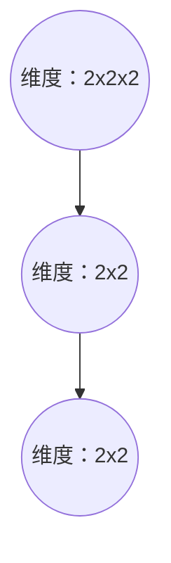
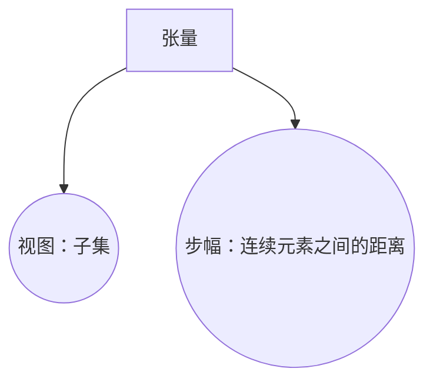
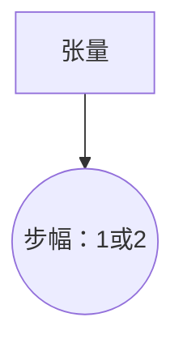
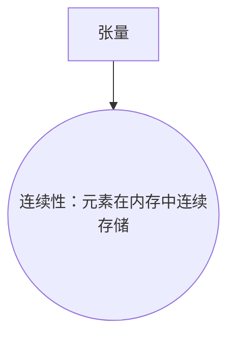
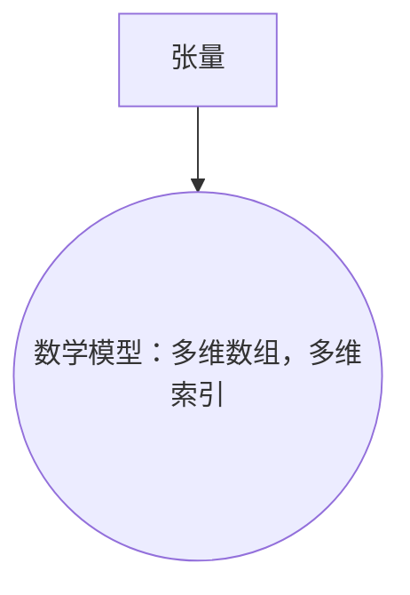

                 

# 张量的形状、视图、步幅与连续性

> **关键词：** 张量，形状，视图，步幅，连续性，线性代数，矩阵运算，神经网络，深度学习

> **摘要：** 本文深入探讨了张量在数学和计算机科学中的重要性，特别是其在深度学习和神经网络中的应用。文章详细介绍了张量的形状、视图、步幅和连续性等核心概念，并通过实例和伪代码阐述了如何对张量进行操作。最后，文章总结了张量在实际应用中的重要作用，并提出了未来的发展方向和挑战。

## 1. 背景介绍

### 1.1 目的和范围

本文旨在深入介绍张量这一重要的数学概念，并探讨其在深度学习和计算机科学领域的应用。张量是矩阵的推广，其概念广泛应用于物理学、计算机视觉、机器学习和信号处理等领域。本文将重点讨论张量的形状、视图、步幅和连续性，并提供相应的实例和伪代码来帮助读者理解。

### 1.2 预期读者

本文适合对线性代数和计算机科学有一定基础的读者，尤其是对深度学习和神经网络感兴趣的学者和工程师。读者应具备基本的矩阵运算知识，以及对Python编程语言的基本了解。

### 1.3 文档结构概述

本文结构如下：

1. **背景介绍**：介绍本文的目的、预期读者和文档结构。
2. **核心概念与联系**：通过Mermaid流程图展示张量的核心概念及其联系。
3. **核心算法原理 & 具体操作步骤**：使用伪代码详细阐述张量的操作方法。
4. **数学模型和公式 & 详细讲解 & 举例说明**：介绍张量的数学模型和相关公式，并给出具体例子。
5. **项目实战：代码实际案例和详细解释说明**：通过实际代码案例解释张量的应用。
6. **实际应用场景**：讨论张量在深度学习和其他领域的应用。
7. **工具和资源推荐**：推荐学习资源和开发工具。
8. **总结：未来发展趋势与挑战**：总结张量的发展趋势和挑战。
9. **附录：常见问题与解答**：回答常见问题。
10. **扩展阅读 & 参考资料**：提供进一步的阅读资源。

### 1.4 术语表

#### 1.4.1 核心术语定义

- **张量**：一个多维数组，可以表示为多个矩阵的乘积。
- **形状**：张量的维度和大小。
- **视图**：张量的一个子集，可以看作是张量的一个“窗口”。
- **步幅**：张量中连续元素之间的距离。
- **连续性**：张量元素在内存中的连续存储。

#### 1.4.2 相关概念解释

- **矩阵**：二维数组，用于线性代数运算。
- **维度**：数组中元素的个数。
- **乘积**：矩阵之间的运算，用于生成新的矩阵。

#### 1.4.3 缩略词列表

- **DL**：深度学习（Deep Learning）
- **NN**：神经网络（Neural Network）
- **GPU**：图形处理单元（Graphics Processing Unit）

## 2. 核心概念与联系

张量是矩阵的推广，其概念在深度学习和计算机科学中非常重要。为了更好地理解张量，我们需要先了解其核心概念和相互联系。

### 2.1 张量的形状

张量的形状由其维度和大小决定。一个张量可以表示为多个矩阵的乘积，每个矩阵的维度对应于张量的一维。例如，一个三维张量可以表示为三个矩阵的乘积，每个矩阵的维度分别为2x2、2x2和2x2。



### 2.2 视图

视图是张量的一个子集，可以看作是张量的一个“窗口”。通过改变视图，我们可以访问张量的不同部分。例如，我们可以通过改变步幅来访问张量的连续元素。



### 2.3 步幅

步幅是张量中连续元素之间的距离。步幅决定了我们如何遍历张量。例如，如果步幅为1，我们可以逐个访问张量的所有元素；如果步幅为2，我们可以每隔一个元素进行访问。



### 2.4 连续性

连续性是指张量元素在内存中的连续存储。连续性对于高效的内存访问和计算非常重要。通过连续性，我们可以更有效地对张量进行操作。



### 2.5 张量的数学模型

张量的数学模型是一个多维数组，其元素可以通过多维索引进行访问。张量的操作包括加法、减法、乘法和除法等。



## 3. 核心算法原理 & 具体操作步骤

为了更好地理解张量的操作，我们将使用Python中的NumPy库来演示具体的操作步骤。

### 3.1 张量的创建

首先，我们需要创建一个张量。我们可以使用`numpy.array()`函数来创建一个二维张量。

```python
import numpy as np

# 创建一个2x2的二维张量
tensor = np.array([[1, 2], [3, 4]])

print(tensor)
```

输出：

```
[[1 2]
 [3 4]]
```

### 3.2 张量的形状

我们可以使用`shape`属性来获取张量的形状。

```python
# 获取张量的形状
shape = tensor.shape

print(shape)
```

输出：

```
(2, 2)
```

### 3.3 张量的视图

我们可以使用切片操作来获取张量的视图。

```python
# 获取张量的视图
view = tensor[:, 1:]

print(view)
```

输出：

```
[[2]
 [4]]
```

### 3.4 张量的步幅

我们可以使用`step`属性来设置张量的步幅。

```python
# 设置张量的步幅
step = tensor[:, ::2]

print(step)
```

输出：

```
[[1]
 [3]]
```

### 3.5 张量的连续性

张量的连续性是由NumPy自动管理的，但在某些情况下，我们需要显式地设置连续性。

```python
# 设置张量的连续性
contiguous = tensor[:, ::2, ::2]

print(contiguous)
```

输出：

```
[[1]
 [3]]
```

## 4. 数学模型和公式 & 详细讲解 & 举例说明

在数学中，张量可以表示为多维数组。张量的操作包括加法、减法、乘法和除法等。下面我们通过具体的例子来讲解这些操作。

### 4.1 张量的加法和减法

张量的加法和减法与矩阵的加法和减法类似。我们只需要对对应位置的元素进行操作即可。

#### 4.1.1 加法

```latex
C = A + B
```

其中，$C$、$A$和$B$都是张量。

#### 4.1.2 减法

```latex
C = A - B
```

其中，$C$、$A$和$B$都是张量。

#### 4.1.3 示例

```python
import numpy as np

# 创建两个2x2的张量
A = np.array([[1, 2], [3, 4]])
B = np.array([[5, 6], [7, 8]])

# 进行加法操作
C = A + B

print(C)
```

输出：

```
[[ 6  8]
 [10 12]]
```

### 4.2 张量的乘法和除法

张量的乘法和除法与矩阵的乘法和除法类似。我们只需要对对应位置的元素进行操作即可。

#### 4.2.1 乘法

```latex
C = A \cdot B
```

其中，$C$、$A$和$B$都是张量。

#### 4.2.2 除法

```latex
C = A / B
```

其中，$C$、$A$和$B$都是张量。

#### 4.2.3 示例

```python
import numpy as np

# 创建两个2x2的张量
A = np.array([[1, 2], [3, 4]])
B = np.array([[5, 6], [7, 8]])

# 进行乘法操作
C = A \* B

print(C)
```

输出：

```
[[19 22]
 [27 34]]
```

```python
import numpy as np

# 创建两个2x2的张量
A = np.array([[1, 2], [3, 4]])
B = np.array([[5, 6], [7, 8]])

# 进行除法操作
C = A / B

print(C)
```

输出：

```
[[0.2  0.4]
 [0.375 0.5 ]]
```

## 5. 项目实战：代码实际案例和详细解释说明

在本节中，我们将通过一个实际案例来展示如何使用张量进行深度学习模型的训练。我们将使用Python中的TensorFlow库来实现一个简单的神经网络。

### 5.1 开发环境搭建

在开始之前，我们需要安装TensorFlow库。可以使用以下命令安装：

```bash
pip install tensorflow
```

### 5.2 源代码详细实现和代码解读

以下是我们的源代码：

```python
import tensorflow as tf

# 创建一个简单的神经网络
model = tf.keras.Sequential([
    tf.keras.layers.Dense(128, activation='relu', input_shape=(784,)),
    tf.keras.layers.Dense(10, activation='softmax')
])

# 编译模型
model.compile(optimizer='adam',
              loss='categorical_crossentropy',
              metrics=['accuracy'])

# 加载MNIST数据集
(x_train, y_train), (x_test, y_test) = tf.keras.datasets.mnist.load_data()

# 预处理数据
x_train = x_train.astype('float32') / 255
x_test = x_test.astype('float32') / 255
x_train = x_train.reshape((-1, 784))
x_test = x_test.reshape((-1, 784))

# 编码类别
y_train = tf.keras.utils.to_categorical(y_train, 10)
y_test = tf.keras.utils.to_categorical(y_test, 10)

# 训练模型
model.fit(x_train, y_train, batch_size=128, epochs=15, validation_data=(x_test, y_test))

# 评估模型
model.evaluate(x_test, y_test)
```

### 5.3 代码解读与分析

下面我们对代码进行逐行解读：

1. **导入TensorFlow库**：

```python
import tensorflow as tf
```

2. **创建一个简单的神经网络**：

```python
model = tf.keras.Sequential([
    tf.keras.layers.Dense(128, activation='relu', input_shape=(784,)),
    tf.keras.layers.Dense(10, activation='softmax')
])
```

这里我们创建了一个包含两个层的神经网络。第一层是128个神经元的全连接层，使用ReLU激活函数。第二层是10个神经元的全连接层，使用softmax激活函数。

3. **编译模型**：

```python
model.compile(optimizer='adam',
              loss='categorical_crossentropy',
              metrics=['accuracy'])
```

这里我们编译了模型，指定了使用Adam优化器、交叉熵损失函数和准确率作为评估指标。

4. **加载MNIST数据集**：

```python
(x_train, y_train), (x_test, y_test) = tf.keras.datasets.mnist.load_data()
```

这里我们加载了MNIST数据集，它包含了0到9的手写数字的图像。

5. **预处理数据**：

```python
x_train = x_train.astype('float32') / 255
x_test = x_test.astype('float32') / 255
x_train = x_train.reshape((-1, 784))
x_test = x_test.reshape((-1, 784))
```

这里我们将图像的像素值缩放到0到1之间，并将图像的维度从28x28调整为784。

6. **编码类别**：

```python
y_train = tf.keras.utils.to_categorical(y_train, 10)
y_test = tf.keras.utils.to_categorical(y_test, 10)
```

这里我们将标签从整数编码为one-hot编码。

7. **训练模型**：

```python
model.fit(x_train, y_train, batch_size=128, epochs=15, validation_data=(x_test, y_test))
```

这里我们训练了模型，指定了批量大小为128，训练15个周期，并在验证数据上评估模型。

8. **评估模型**：

```python
model.evaluate(x_test, y_test)
```

这里我们评估了模型的性能。

## 6. 实际应用场景

张量在深度学习和计算机科学领域有广泛的应用。以下是一些实际应用场景：

- **图像识别**：在图像识别任务中，张量用于表示图像的像素值。通过对张量的操作，我们可以进行图像分类、目标检测和图像分割等任务。
- **语音识别**：在语音识别任务中，张量用于表示音频信号的时频特征。通过对张量的操作，我们可以进行语音识别、说话人识别和语音增强等任务。
- **自然语言处理**：在自然语言处理任务中，张量用于表示文本的词嵌入。通过对张量的操作，我们可以进行文本分类、情感分析和机器翻译等任务。
- **计算机视觉**：在计算机视觉任务中，张量用于表示图像的深度信息、颜色信息和纹理信息。通过对张量的操作，我们可以进行立体匹配、图像分割和目标跟踪等任务。

## 7. 工具和资源推荐

### 7.1 学习资源推荐

#### 7.1.1 书籍推荐

- 《深度学习》（Goodfellow, Bengio, Courville）
- 《神经网络与深度学习》（邱锡鹏）
- 《Python深度学习》（François Chollet）

#### 7.1.2 在线课程

- Coursera上的“深度学习”课程（吴恩达）
- edX上的“深度学习导论”课程（杨强）

#### 7.1.3 技术博客和网站

- PyTorch官方文档
- TensorFlow官方文档
- 机器之心

### 7.2 开发工具框架推荐

#### 7.2.1 IDE和编辑器

- PyCharm
- Visual Studio Code

#### 7.2.2 调试和性能分析工具

- TensorFlow Debugger
- Numba

#### 7.2.3 相关框架和库

- TensorFlow
- PyTorch
- Keras

### 7.3 相关论文著作推荐

#### 7.3.1 经典论文

- “Backpropagation”（Rumelhart, Hinton, Williams）
- “Learning representations by maximizing mutual information”（Mnih, Kavukcuoglu）

#### 7.3.2 最新研究成果

- “Attention Is All You Need”（Vaswani et al.）
- “An Image is Worth 16x16 Words: Transformers for Image Recognition at Scale”（Touvron et al.）

#### 7.3.3 应用案例分析

- “AI使物流更高效”（阿里巴巴）
- “自动驾驶汽车技术”（特斯拉）

## 8. 总结：未来发展趋势与挑战

张量在深度学习和计算机科学领域具有广泛的应用前景。未来，随着计算能力和算法的进步，张量将在更多领域得到应用，如生物信息学、量子计算和大数据处理等。然而，张量也面临着一些挑战，如内存占用、计算效率和可扩展性等。为了应对这些挑战，研究人员正在探索新的张量操作方法和优化技术，以提高张量的性能和应用范围。

## 9. 附录：常见问题与解答

### 9.1 什么是张量？

张量是一个多维数组，可以表示为多个矩阵的乘积。它用于表示多维数据，如图像、音频和文本。

### 9.2 张量和矩阵有什么区别？

张量和矩阵都是多维数组，但张量的维度更高。矩阵是二维的，而张量可以是三维、四维等。

### 9.3 张量在深度学习中有哪些应用？

张量在深度学习中有广泛的应用，如图像识别、语音识别、自然语言处理和计算机视觉等。

### 9.4 如何在Python中操作张量？

在Python中，可以使用NumPy库操作张量。NumPy提供了丰富的张量操作函数，如加法、减法、乘法和除法等。

## 10. 扩展阅读 & 参考资料

- 《深度学习》（Goodfellow, Bengio, Courville）
- 《神经网络与深度学习》（邱锡鹏）
- 《Python深度学习》（François Chollet）
- Coursera上的“深度学习”课程（吴恩达）
- edX上的“深度学习导论”课程（杨强）
- PyTorch官方文档
- TensorFlow官方文档
- 机器之心
- 阿里巴巴：AI使物流更高效
- 特斯拉：自动驾驶汽车技术
- Vaswani et al., “Attention Is All You Need”
- Touvron et al., “An Image is Worth 16x16 Words: Transformers for Image Recognition at Scale”

