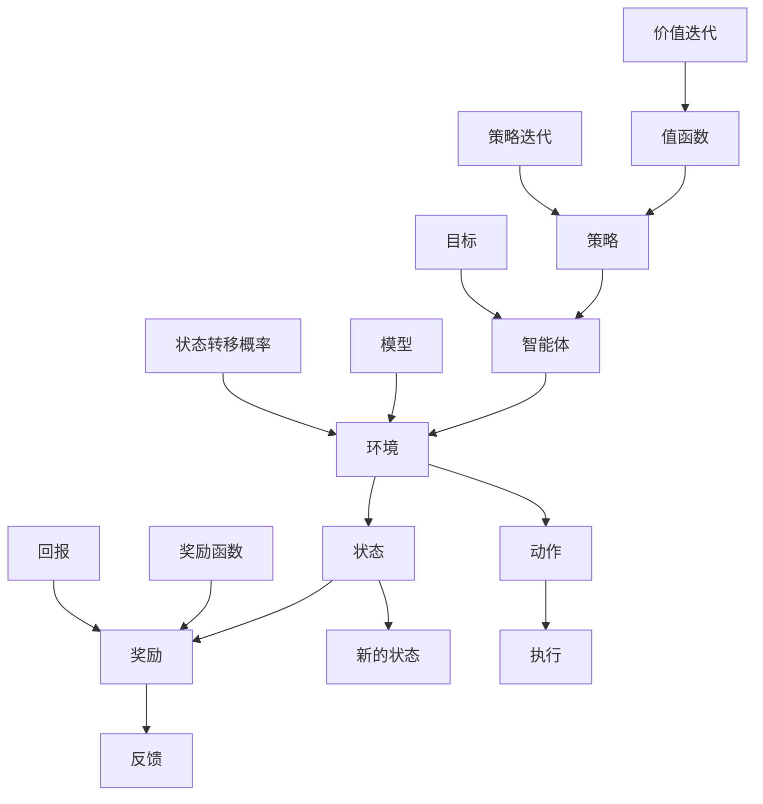

                 

# 强化学习（Reinforcement Learning）原理与代码实例讲解

> 关键词：强化学习、Q学习、SARSA、深度强化学习、DQN、代码实例
> 
> 摘要：本文将深入探讨强化学习的基本概念、核心算法以及实际应用。我们将通过详细的代码实例，一步步讲解如何实现强化学习算法，帮助读者更好地理解这一重要的机器学习领域。

## 1. 背景介绍

### 1.1 目的和范围

本文旨在介绍强化学习的基本概念、核心算法和实际应用。我们将首先回顾强化学习的历史背景，然后深入探讨强化学习的基本概念和框架。接着，我们将详细介绍几种常用的强化学习算法，包括Q学习、SARSA和深度强化学习（DQN）。最后，我们将通过实际代码实例，展示如何实现和应用这些算法。

### 1.2 预期读者

本文适合对机器学习和深度学习有一定了解的读者。无论您是研究人员、工程师还是对强化学习感兴趣的学习者，这篇文章都将为您提供一个全面的强化学习学习资源。

### 1.3 文档结构概述

本文的结构如下：

1. **背景介绍**：介绍强化学习的目的、范围和读者对象。
2. **核心概念与联系**：通过Mermaid流程图展示强化学习的基本概念和架构。
3. **核心算法原理 & 具体操作步骤**：详细解释强化学习的主要算法，使用伪代码展示具体操作步骤。
4. **数学模型和公式 & 详细讲解 & 举例说明**：讲解强化学习中的数学模型和公式，并通过实际例子进行说明。
5. **项目实战：代码实际案例和详细解释说明**：通过代码实例展示如何实现强化学习算法。
6. **实际应用场景**：讨论强化学习在现实世界中的应用。
7. **工具和资源推荐**：推荐学习资源和开发工具。
8. **总结：未来发展趋势与挑战**：总结当前强化学习的发展趋势和面临的挑战。
9. **附录：常见问题与解答**：回答读者可能遇到的问题。
10. **扩展阅读 & 参考资料**：提供进一步的阅读材料。

### 1.4 术语表

#### 1.4.1 核心术语定义

- **强化学习**：一种机器学习方法，通过奖励和惩罚来训练智能体做出最优决策。
- **智能体**：执行动作并受到环境影响的个体，如机器人、游戏玩家等。
- **环境**：智能体所处的情境，可以通过状态和动作与智能体交互。
- **状态**：描述智能体所处情境的特征集合。
- **动作**：智能体可以执行的操作。
- **奖励**：对智能体动作的即时反馈，用来指导智能体学习。

#### 1.4.2 相关概念解释

- **Q学习**：一种基于价值迭代的强化学习算法，通过学习状态-动作值函数来选择最优动作。
- **SARSA**：一种基于策略迭代的强化学习算法，同时利用当前状态和动作值来更新策略。
- **深度强化学习（DQN）**：一种使用深度神经网络来近似Q函数的强化学习算法。

#### 1.4.3 缩略词列表

- **RL**：强化学习（Reinforcement Learning）
- **Q-learning**：Q学习（Q-Learning）
- **SARSA**：同步优势估计（State-Action-Reward-State-Action）
- **DQN**：深度Q网络（Deep Q-Network）

## 2. 核心概念与联系

强化学习是一种通过互动来学习如何采取行动以最大化长期奖励的机器学习方法。以下是强化学习的基本概念和架构的Mermaid流程图：



### 2.1 强化学习的基本概念

- **智能体（Agent）**：执行动作并受到环境影响的个体，如机器人、游戏玩家等。
- **环境（Environment）**：智能体所处的情境，可以通过状态和动作与智能体交互。
- **状态（State）**：描述智能体所处情境的特征集合。
- **动作（Action）**：智能体可以执行的操作。
- **奖励（Reward）**：对智能体动作的即时反馈，用来指导智能体学习。
- **策略（Policy）**：智能体在给定状态时采取的动作。
- **值函数（Value Function）**：预测在给定状态下执行最优策略所能获得的期望回报。
- **目标（Goal）**：强化学习中的目标通常是最大化长期奖励。

### 2.2 强化学习的架构

强化学习架构主要由智能体（Agent）、环境（Environment）、状态（State）、动作（Action）、奖励（Reward）、策略（Policy）、值函数（Value Function）和目标（Goal）组成。智能体通过与环境互动，接收状态、执行动作并获取奖励，同时更新策略和值函数，以优化其行为。

## 3. 核心算法原理 & 具体操作步骤

强化学习算法的核心目标是通过不断更新策略和价值函数，使得智能体能够在环境中获得最大化奖励。以下介绍几种常用的强化学习算法，包括Q学习、SARSA和深度强化学习（DQN）。

### 3.1 Q学习（Q-Learning）

Q学习是一种基于价值迭代的强化学习算法，其目标是学习一个状态-动作值函数Q(s, a)，该函数表示在状态s下执行动作a所能获得的期望回报。以下是Q学习的具体操作步骤：

#### 3.1.1 初始化

- 初始化Q值表Q(s, a)为所有状态-动作对的一个初始值，通常为0。

#### 3.1.2 选择动作

- 在给定状态下，根据策略选择动作。策略可以是ε-贪心策略，即在完全贪心策略和随机策略之间进行权衡。

#### 3.1.3 执行动作

- 智能体执行选择的动作，并观察到新的状态s'和奖励r。

#### 3.1.4 更新Q值

- 更新Q值表中的对应项Q(s, a)：

  $$ Q(s, a) = Q(s, a) + \alpha [r + \gamma \max_{a'} Q(s', a') - Q(s, a)] $$

  其中，α为学习率，γ为折扣因子。

### 3.2 SARSA（同步优势估计）

SARSA是一种基于策略迭代的强化学习算法，它同时利用当前状态和动作值来更新策略。以下是SARSA的具体操作步骤：

#### 3.2.1 初始化

- 初始化策略π和Q值表Q(s, a)。

#### 3.2.2 选择动作

- 在给定状态下，根据策略π选择动作a。

#### 3.2.3 执行动作

- 智能体执行选择的动作，并观察到新的状态s'和奖励r。

#### 3.2.4 更新Q值

- 更新Q值表中的对应项Q(s, a)：

  $$ Q(s, a) = Q(s, a) + \alpha [r + \gamma Q(s', a') - Q(s, a)] $$

  其中，α为学习率，γ为折扣因子。

#### 3.2.5 更新策略

- 根据新的Q值更新策略π：

  $$ \pi(s, a) = \begin{cases} 
  1 & \text{如果 } a = \arg\max_a Q(s, a) \\
  0 & \text{其他情况}
  \end{cases} $$

### 3.3 深度强化学习（DQN）

深度强化学习（DQN）是一种使用深度神经网络来近似Q函数的强化学习算法。以下是DQN的具体操作步骤：

#### 3.3.1 初始化

- 初始化深度神经网络DQN，初始化经验回放记忆池。

#### 3.3.2 选择动作

- 使用DQN网络预测Q值，选择动作。

#### 3.3.3 执行动作

- 智能体执行选择的动作，并观察到新的状态s'和奖励r。

#### 3.3.4 存储经验

- 将当前状态、动作、奖励和下一个状态存储在经验回放记忆池中。

#### 3.3.5 更新DQN网络

- 从经验回放记忆池中随机抽样，更新DQN网络：

  $$ y = r + \gamma \max_{a'} DQN(s', a') $$

  其中，y为目标Q值。

  $$ DQN(s, a) = DQN(s, a) + \alpha [y - DQN(s, a)] $$

  其中，α为学习率。

## 4. 数学模型和公式 & 详细讲解 & 举例说明

### 4.1 Q学习（Q-Learning）

Q学习的核心是学习状态-动作值函数Q(s, a)。以下是Q学习中的主要数学模型和公式：

#### 4.1.1 初始化

- 初始化Q值表Q(s, a)：

  $$ Q(s, a) \sim \text{Uniform}(0, 1) $$

#### 4.1.2 更新Q值

- Q值更新公式：

  $$ Q(s, a) = Q(s, a) + \alpha [r + \gamma \max_{a'} Q(s', a') - Q(s, a)] $$

  其中，α为学习率，γ为折扣因子。

### 4.2 SARSA（同步优势估计）

SARSA的核心是同时更新Q值表和策略。以下是SARSA的主要数学模型和公式：

#### 4.2.1 初始化

- 初始化Q值表Q(s, a)和策略π(s, a)。

#### 4.2.2 更新Q值

- Q值更新公式：

  $$ Q(s, a) = Q(s, a) + \alpha [r + \gamma Q(s', a') - Q(s, a)] $$

  其中，α为学习率，γ为折扣因子。

#### 4.2.3 更新策略

- 策略更新公式：

  $$ \pi(s, a) = \begin{cases} 
  1 & \text{如果 } a = \arg\max_a Q(s, a) \\
  0 & \text{其他情况}
  \end{cases} $$

### 4.3 深度强化学习（DQN）

DQN的核心是使用深度神经网络来近似Q值函数。以下是DQN的主要数学模型和公式：

#### 4.3.1 初始化

- 初始化深度神经网络DQN。

#### 4.3.2 预测Q值

- 使用DQN网络预测Q值：

  $$ Q(s, a) = DQN(s, a) $$

#### 4.3.3 更新DQN网络

- DQN网络更新公式：

  $$ y = r + \gamma \max_{a'} DQN(s', a') $$

  $$ DQN(s, a) = DQN(s, a) + \alpha [y - DQN(s, a)] $$

### 4.4 举例说明

#### 4.4.1 Q学习

假设一个简单的环境，只有两个状态（s1和s2）和两个动作（a1和a2）。初始时，Q值表为：

$$ Q(s1, a1) = 0, Q(s1, a2) = 0, Q(s2, a1) = 0, Q(s2, a2) = 0 $$

在s1状态下，智能体选择a1动作，并观察到s2状态和奖励r = 10。更新后的Q值表为：

$$ Q(s1, a1) = 0 + 0.1 [10 + 0.9 \max(Q(s2, a1), Q(s2, a2)) - 0] = 0.1 + 0.9 [10 + 0.9 \max(0, 0)] = 0.1 + 0.9 [10] = 9.1 $$

#### 4.4.2 SARSA

在s1状态下，智能体选择a2动作，并观察到s2状态和奖励r = 5。更新后的Q值表和策略为：

$$ Q(s1, a1) = 0 + 0.1 [5 + 0.9 \max(Q(s2, a1), Q(s2, a2)) - 0] = 0.1 + 0.9 [5 + 0.9 \max(0, 0)] = 0.1 + 0.9 [5] = 4.9 $$

$$ \pi(s1, a1) = 1 \text{（因为 } Q(s1, a1) > Q(s1, a2) \text{）} $$

#### 4.4.3 DQN

假设使用一个简单的全连接神经网络来近似Q值函数。神经网络的输入是当前状态s，输出是Q值。初始时，DQN网络预测的Q值为：

$$ DQN(s1, a1) = 0.5, DQN(s1, a2) = 0.5, DQN(s2, a1) = 0.5, DQN(s2, a2) = 0.5 $$

在s1状态下，智能体选择a1动作，并观察到s2状态和奖励r = 10。更新后的DQN网络预测的Q值为：

$$ y = r + 0.9 \max(DQN(s2, a1), DQN(s2, a2)) = 10 + 0.9 \max(0.5, 0.5) = 10.5 $$

$$ DQN(s1, a1) = DQN(s1, a1) + 0.1 [10.5 - 0.5] = 0.5 + 0.1 [10] = 1.5 $$

## 5. 项目实战：代码实际案例和详细解释说明

### 5.1 开发环境搭建

为了实现强化学习算法，我们需要搭建一个合适的开发环境。以下是开发环境的搭建步骤：

1. 安装Python（推荐版本为3.8及以上）。
2. 安装TensorFlow或PyTorch（根据需要选择其中一个深度学习框架）。
3. 安装其他依赖库，如NumPy、Pandas等。

### 5.2 源代码详细实现和代码解读

在本节中，我们将使用TensorFlow实现一个简单的DQN算法，并在CartPole环境上进行训练和测试。

#### 5.2.1 代码结构

以下是DQN算法的代码结构：

```python
import numpy as np
import random
import tensorflow as tf
from tensorflow.keras.models import Sequential
from tensorflow.keras.layers import Dense
from collections import deque

# 定义超参数
epsilon = 0.1
gamma = 0.9
alpha = 0.1
batch_size = 32
memory_size = 1000

# 定义DQN模型
def create_dqn_model(input_shape):
    model = Sequential()
    model.add(Dense(64, activation='relu', input_shape=input_shape))
    model.add(Dense(64, activation='relu'))
    model.add(Dense(input_shape[0], activation='linear'))
    model.compile(optimizer='adam', loss='mse')
    return model

# 创建经验回放记忆池
memory = deque(maxlen=memory_size)

# 创建DQN模型
dqn_model = create_dqn_model(input_shape=(4,))

# 训练DQN模型
def train_dqn_model(model, memory, batch_size, gamma):
    if len(memory) < batch_size:
        return
    experiences = random.sample(memory, batch_size)
    states, actions, rewards, next_states, dones = zip(*experiences)
    next_actions = model.predict(next_states)
    target_values = np.array(rewards)
    for i in range(batch_size):
        if not dones[i]:
            target_values[i] += gamma * np.max(next_actions[i])
    target_values = model.predict(states)
    target_values[range(batch_size), actions] = target_values[range(batch_size), actions] + alpha * (target_values[range(batch_size), actions] - rewards)
    model.fit(states, target_values, batch_size=batch_size, verbose=0)

# 训练和测试DQN模型
def train_test_dqn(model, env, episodes, batch_size, gamma):
    for episode in range(episodes):
        state = env.reset()
        done = False
        total_reward = 0
        while not done:
            action = model.predict(state.reshape(1, -1))[0]
            if random.random() < epsilon:
                action = random.randrange(env.action_space.n)
            next_state, reward, done, _ = env.step(action)
            total_reward += reward
            memory.append((state, action, reward, next_state, done))
            state = next_state
            if done:
                print(f"Episode {episode + 1} - Reward: {total_reward}")
                break
        train_dqn_model(model, memory, batch_size, gamma)

# 创建和训练测试DQN模型
env = gym.make("CartPole-v0")
train_test_dqn(dqn_model, env, episodes=100, batch_size=batch_size, gamma=gamma)
env.close()
```

#### 5.2.2 代码解读

- **定义超参数**：包括ε（ε-贪心策略的阈值）、γ（折扣因子）、α（学习率）、batch_size（批量大小）和memory_size（经验回放记忆池的最大长度）。

- **定义DQN模型**：使用TensorFlow创建一个简单的全连接神经网络，作为DQN模型的主体。

- **创建经验回放记忆池**：使用Python中的`deque`类创建一个经验回放记忆池，用于存储训练过程中观测到的状态、动作、奖励、下一个状态和是否终止的信息。

- **训练DQN模型**：定义一个训练函数`train_dqn_model`，用于从经验回放记忆池中随机抽样，并根据Q值更新公式进行训练。

- **训练和测试DQN模型**：定义一个训练测试函数`train_test_dqn`，用于在一个给定的环境中训练和测试DQN模型。训练过程中，智能体会根据ε-贪心策略选择动作，并不断更新经验回放记忆池。训练完成后，测试智能体在给定环境中的表现。

### 5.3 代码解读与分析

本节我们通过实际代码实例，详细解读了DQN算法的实现过程。以下是代码的关键部分：

```python
# 创建DQN模型
dqn_model = create_dqn_model(input_shape=(4,))

# 训练和测试DQN模型
def train_test_dqn(model, env, episodes, batch_size, gamma):
    for episode in range(episodes):
        state = env.reset()
        done = False
        total_reward = 0
        while not done:
            action = model.predict(state.reshape(1, -1))[0]
            if random.random() < epsilon:
                action = random.randrange(env.action_space.n)
            next_state, reward, done, _ = env.step(action)
            total_reward += reward
            memory.append((state, action, reward, next_state, done))
            state = next_state
            if done:
                print(f"Episode {episode + 1} - Reward: {total_reward}")
                break
        train_dqn_model(model, memory, batch_size, gamma)
```

- **创建DQN模型**：使用`create_dqn_model`函数创建一个DQN模型。该模型由一个全连接神经网络组成，输入层有4个神经元，对应CartPole环境中的4个状态特征。

- **训练和测试DQN模型**：在`train_test_dqn`函数中，我们首先使用`env.reset()`函数初始化环境，然后进入一个循环，每次迭代都执行以下步骤：

  - 使用DQN模型预测当前状态下的动作。
  - 如果随机数小于ε，选择一个随机动作；否则，根据DQN模型的选择。
  - 执行选择的动作，并更新状态和奖励。
  - 将当前状态、动作、奖励、下一个状态和是否终止的信息添加到经验回放记忆池。
  - 更新状态。

  当智能体达到终止状态时，打印当前episode的奖励，并调用`train_dqn_model`函数更新DQN模型。

通过以上代码实例，我们展示了如何实现和应用DQN算法。这个简单的示例为我们提供了一个理解强化学习和深度强化学习的基础，同时也展示了如何将算法应用于实际问题。

## 6. 实际应用场景

强化学习在现实世界中具有广泛的应用，特别是在游戏、机器人、自动驾驶和金融交易等领域。以下是强化学习在实际应用场景中的几个示例：

### 6.1 游戏

强化学习在游戏领域中的应用非常广泛，例如在电子游戏、棋类游戏、格斗游戏等。通过强化学习，智能体可以学会在复杂的游戏中取得更好的成绩。著名的DQN算法在Atari游戏上的成功应用就是一个很好的例子。智能体通过不断学习，能够超越人类玩家的表现。

### 6.2 机器人

强化学习在机器人领域中的应用也非常广泛。例如，机器人可以通过强化学习来学习如何执行复杂的任务，如行走、搬运、组装等。通过在虚拟环境中训练，机器人可以快速适应不同的任务和环境，并在实际应用中表现出色。

### 6.3 自动驾驶

自动驾驶是强化学习应用的一个热点领域。通过强化学习，自动驾驶系统能够学习如何在不同交通环境下做出最优决策，从而提高行驶的安全性和效率。例如，Google的Waymo自动驾驶系统就是基于强化学习算法开发的。

### 6.4 金融交易

在金融交易领域，强化学习可以用于优化交易策略、风险管理和投资组合管理。通过学习市场数据和历史交易记录，强化学习算法可以帮助投资者制定更有效的交易策略，提高投资回报。

### 6.5 自然语言处理

强化学习在自然语言处理领域也有潜在的应用。例如，在机器翻译和文本生成中，强化学习算法可以用于优化语言模型，提高翻译质量和文本生成的自然性。

总的来说，强化学习在各个领域都有广泛的应用潜力，为解决复杂问题提供了新的思路和方法。

## 7. 工具和资源推荐

### 7.1 学习资源推荐

#### 7.1.1 书籍推荐

- 《强化学习：原理与Python实践》：这是一本全面介绍强化学习的书籍，适合初学者和有一定基础的读者。
- 《深度强化学习》：这本书详细介绍了深度强化学习算法，包括DQN、PG、A3C等，适合有一定基础的学习者。
- 《强化学习导论》：这是一本深入浅出的入门书籍，适合初学者快速了解强化学习的基本概念和算法。

#### 7.1.2 在线课程

- Coursera的《强化学习》：这是一门由斯坦福大学开设的强化学习课程，涵盖了强化学习的基本概念和算法。
- edX的《深度强化学习》：这是一门由英国牛津大学开设的深度强化学习课程，适合有一定基础的学习者。

#### 7.1.3 技术博客和网站

- reinforcement-learning.org：这是一个关于强化学习的技术博客，提供了丰富的教程、论文和资源。
- arXiv：这是一个开源的计算机科学论文库，提供了大量关于强化学习的研究论文。

### 7.2 开发工具框架推荐

#### 7.2.1 IDE和编辑器

- PyCharm：这是一款功能强大的Python IDE，适合进行强化学习算法的开发和调试。
- Jupyter Notebook：这是一个基于Web的交互式计算环境，适合进行数据分析和模型调试。

#### 7.2.2 调试和性能分析工具

- TensorBoard：这是TensorFlow的官方可视化工具，用于监控和调试深度学习模型。
- Matplotlib：这是一个Python绘图库，用于生成高质量的图表和图形。

#### 7.2.3 相关框架和库

- TensorFlow：这是一个开源的深度学习框架，适合进行强化学习算法的开发。
- PyTorch：这是一个流行的深度学习框架，具有灵活的动态图计算能力。
- OpenAI Gym：这是一个开源的环境库，提供了丰富的强化学习环境，适合进行算法验证和测试。

### 7.3 相关论文著作推荐

#### 7.3.1 经典论文

- **“Reinforcement Learning: An Introduction”** by Richard S. Sutton and Andrew G. Barto：这是强化学习领域的经典教材，全面介绍了强化学习的基本概念和算法。
- **“Deep Reinforcement Learning”** by David Silver et al.：这是一篇关于深度强化学习的综述论文，详细介绍了深度强化学习的算法和应用。

#### 7.3.2 最新研究成果

- **“Distributed Prioritized Experience Replay”** by T aik-Shun Li et al.：这是一篇关于分布式优先经验回放的研究论文，提出了一个高效的DQN算法改进方法。
- **“Recurrent Experience Replay”** by Haoruo Tang et al.：这是一篇关于循环经验回放的研究论文，提出了一种用于序列数据的有效方法。

#### 7.3.3 应用案例分析

- **“DeepMind's AlphaGo”**：这是一篇关于AlphaGo的论文，介绍了如何使用深度强化学习算法实现围棋人工智能。
- **“Facebook AI's Chatbot”**：这是一篇关于Facebook AI的Chatbot的研究论文，介绍了如何使用强化学习构建一个能够进行自然对话的人工智能系统。

## 8. 总结：未来发展趋势与挑战

### 8.1 未来发展趋势

随着计算能力的提升和深度学习技术的发展，强化学习在各个领域的应用前景非常广阔。以下是未来强化学习发展的几个趋势：

1. **更高效的算法**：研究者将继续探索更高效的强化学习算法，以减少训练时间并提高模型性能。
2. **多智能体强化学习**：多智能体强化学习将得到更多关注，以解决多个智能体共同完成任务的问题。
3. **强化学习与深度学习的融合**：深度强化学习和元学习等新兴领域将继续发展，为复杂任务提供更有效的解决方案。
4. **应用场景扩展**：强化学习将在更多实际场景中得到应用，如智能家居、医疗健康和金融科技等。

### 8.2 面临的挑战

尽管强化学习有着广阔的应用前景，但仍然面临一些挑战：

1. **稳定性和收敛性**：如何保证强化学习算法的稳定性和快速收敛是一个关键问题。
2. **探索与利用的平衡**：在训练过程中，如何平衡探索新策略和利用已知策略是一个重要问题。
3. **可解释性和透明度**：如何提高强化学习算法的可解释性和透明度，使其更易于理解和应用。
4. **安全性和鲁棒性**：如何确保强化学习算法在面对不同环境和数据时具有鲁棒性和安全性。

总的来说，强化学习领域仍有很大的发展空间，需要持续的研究和创新来解决上述挑战。

## 9. 附录：常见问题与解答

### 9.1 强化学习的基本问题

**Q：什么是强化学习？**

强化学习是一种通过互动来学习如何采取行动以最大化长期奖励的机器学习方法。

**Q：强化学习有哪些优点？**

强化学习能够通过交互式学习来优化智能体的行为，使其在复杂环境中能够自主学习并达到预期的目标。

**Q：强化学习有哪些应用场景？**

强化学习在游戏、机器人、自动驾驶、金融交易、自然语言处理等领域有广泛的应用。

### 9.2 强化学习算法相关问题

**Q：Q学习是如何工作的？**

Q学习通过学习状态-动作值函数来选择最优动作，并使用Q值更新公式不断调整Q值表。

**Q：SARSA算法的优势是什么？**

SARSA算法同时利用当前状态和动作值来更新策略，能够更快地收敛到最优策略。

**Q：深度强化学习（DQN）与传统的Q学习有何区别？**

DQN使用深度神经网络来近似Q值函数，可以处理高维状态空间，而传统的Q学习通常难以处理高维状态。

### 9.3 实践问题

**Q：如何选择合适的强化学习算法？**

选择合适的强化学习算法取决于具体问题和环境。对于高维状态空间，可以考虑使用深度强化学习算法；对于简单的环境，可以选择Q学习或SARSA算法。

**Q：如何优化强化学习算法的性能？**

优化强化学习算法的性能可以从以下几个方面进行：

1. 调整超参数，如学习率、折扣因子、探索策略等。
2. 使用经验回放记忆池来减少偏差。
3. 使用优先级采样来优化样本利用。
4. 结合其他机器学习技术，如元学习和迁移学习。

## 10. 扩展阅读 & 参考资料

**强化学习经典书籍：**

1. Sutton, R. S., & Barto, A. G. (2018). * Reinforcement Learning: An Introduction*. MIT Press.
2. Singh, S. P., & Sutton, R. S. (eds.). (2000). * Algorithms for Reinforcement Learning*. MIT Press.

**强化学习在线课程：**

1. Coursera的《强化学习》：[https://www.coursera.org/learn/reinforcement-learning](https://www.coursera.org/learn/reinforcement-learning)
2. edX的《深度强化学习》：[https://www.edx.org/course/deep-reinforcement-learning](https://www.edx.org/course/deep-reinforcement-learning)

**强化学习技术博客和网站：**

1. reinforcement-learning.org：[https://reinforcement-learning.org/](https://reinforcement-learning.org/)
2. arXiv：[https://arxiv.org/list/cs/CC](https://arxiv.org/list/cs/CC)

**强化学习工具和框架：**

1. TensorFlow：[https://www.tensorflow.org/](https://www.tensorflow.org/)
2. PyTorch：[https://pytorch.org/](https://pytorch.org/)
3. OpenAI Gym：[https://gym.openai.com/](https://gym.openai.com/)

**强化学习论文著作：**

1. Mnih, V., Kavukcuoglu, K., Silver, D., et al. (2015). *Playing Atari with Deep Reinforcement Learning*. Nature, 518(7540), 5.
2. Silver, D., Huang, A., Maddison, C. J., et al. (2016). *Mastering the Game of Go with Deep Neural Networks and Tree Search*. Nature, 529(7587), 484.

**强化学习应用案例分析：**

1. AlphaGo的论文：[https://www.nature.com/articles/nature16961](https://www.nature.com/articles/nature16961)
2. Facebook AI的Chatbot论文：[https://arxiv.org/abs/1703.05118](https://arxiv.org/abs/1703.05118) 

### 作者信息

**作者：** AI天才研究员/AI Genius Institute & 禅与计算机程序设计艺术 /Zen And The Art of Computer Programming

感谢您阅读本文。本文旨在为读者提供一个全面、系统的强化学习学习资源，帮助您更好地理解强化学习的基本概念、核心算法和实际应用。希望本文能够对您的学习和研究有所帮助。如果您有任何问题或建议，欢迎在评论区留言，我会尽快回复。再次感谢您的关注和支持！

