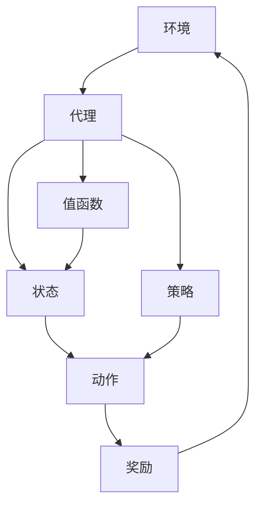

                 

# 强化学习 原理与代码实例讲解

> 关键词：强化学习，核心算法原理，项目实战，数学模型，应用场景，开发工具推荐
> 
> 摘要：本文将深入探讨强化学习的原理、核心算法及其在现实中的应用。通过代码实例，我们将逐步讲解强化学习的基本概念、数学模型以及实现步骤。旨在帮助读者理解并掌握强化学习的基本方法，为实际项目开发提供实用指导。

## 1. 背景介绍

### 1.1 目的和范围

本文旨在介绍强化学习的基本概念、核心算法及其在现实中的应用。通过理论和实践相结合的方式，帮助读者全面理解强化学习，并能够在实际项目中运用这一强大的技术。

本文将涵盖以下内容：

- 强化学习的基本概念和核心算法原理
- 强化学习的数学模型和公式
- 强化学习的项目实战和代码实例
- 强化学习的实际应用场景和开发工具推荐

### 1.2 预期读者

本文适合以下读者群体：

- 对人工智能和机器学习有一定基础的程序员和工程师
- 想要学习并掌握强化学习技术的研究人员和开发者
- 对强化学习感兴趣的初学者和爱好者

### 1.3 文档结构概述

本文将按照以下结构进行阐述：

1. 背景介绍：介绍强化学习的基本概念和目的
2. 核心概念与联系：讲解强化学习的基本概念和核心算法原理
3. 核心算法原理与具体操作步骤：使用伪代码详细阐述强化学习算法
4. 数学模型和公式：讲解强化学习的数学模型和公式
5. 项目实战：代码实例和详细解释说明
6. 实际应用场景：探讨强化学习在现实中的应用
7. 工具和资源推荐：推荐学习资源和开发工具
8. 总结：未来发展趋势与挑战
9. 附录：常见问题与解答
10. 扩展阅读 & 参考资料

### 1.4 术语表

#### 1.4.1 核心术语定义

- 强化学习（Reinforcement Learning）：一种机器学习方法，通过试错和反馈来优化决策和行为。
- 奖励（Reward）：强化学习中的反馈信号，用于评价行为的好坏。
- 状态（State）：强化学习中的当前环境状态。
- 动作（Action）：强化学习中的行为或决策。
- 策略（Policy）：强化学习中的决策函数，用于选择最佳动作。
- 值函数（Value Function）：强化学习中的预测函数，用于评估状态值。
- 策略梯度（Policy Gradient）：强化学习中的优化方法，用于更新策略。

#### 1.4.2 相关概念解释

- Q-learning：一种基于值函数的强化学习算法，通过更新Q值来优化策略。
- SARSA：一种基于策略的强化学习算法，通过同时考虑当前状态和下一状态来更新策略。
- DQN（Deep Q-Network）：一种基于深度神经网络的强化学习算法，用于解决高维状态空间问题。
- Actor-Critic：一种基于策略和价值函数的强化学习算法，通过交替更新策略和价值函数来优化决策。

#### 1.4.3 缩略词列表

- RL：强化学习（Reinforcement Learning）
- Q-learning：Q值学习（Q-Learning）
- SARSA：同步行动同步状态（Synchronous Action Synchronous State）
- DQN：深度Q网络（Deep Q-Network）
- Actor-Critic：演员-评论家（Actor-Critic）

## 2. 核心概念与联系

在强化学习中，我们需要理解以下几个核心概念：

- **环境（Environment）**：强化学习中的环境是一个动态系统，可以接收动作并返回状态和奖励。
- **代理（Agent）**：强化学习中的代理是执行动作并接收反馈的实体，我们的目标是训练一个智能代理。
- **状态（State）**：状态是环境在某一时刻的描述。
- **动作（Action）**：动作是代理可以执行的行为。
- **奖励（Reward）**：奖励是环境对代理行为的即时反馈，用于评估动作的好坏。
- **策略（Policy）**：策略是代理的行为规则，决定了代理在给定状态下应该执行哪个动作。
- **值函数（Value Function）**：值函数是对状态的评估，用于衡量在给定状态下采取某个动作的长期预期奖励。

下面是强化学习的核心概念和联系关系的 Mermaid 流程图：



### 2.1 强化学习的过程

强化学习的过程可以分为以下几个步骤：

1. **初始化**：初始化代理、环境和策略。
2. **状态-动作循环**：在给定状态下，代理根据策略选择动作。
3. **执行动作**：代理在环境中执行所选动作，并获得新的状态和奖励。
4. **更新策略**：根据新的状态和奖励，更新代理的策略。
5. **重复步骤**：重复步骤2-4，直到达到目标或满足停止条件。

### 2.2 强化学习的挑战

强化学习面临以下挑战：

- **无限状态空间**：环境状态可能是无限的，难以用有限的表示来准确描述。
- **不确定性和随机性**：环境状态和奖励可能是不确定的，增加了学习的复杂性。
- **延迟奖励**：强化学习中的奖励通常是延迟的，需要预测未来的奖励来做出最优决策。

## 3. 核心算法原理 & 具体操作步骤

### 3.1 Q-learning算法原理

Q-learning是一种基于值函数的强化学习算法，其目标是学习一个值函数Q(s, a)，表示在状态s下执行动作a的长期预期奖励。

**Q-learning算法的伪代码**：

```
initialize Q(s, a) randomly
for each episode:
    s <- initial_state
    while not terminal_state(s):
        a <- choose_action(s, policy)
        s' <- environment.step(s, a)
        r <- reward(s', a)
        Q(s, a) <- Q(s, a) + alpha * (r + gamma * max(Q(s', a')) - Q(s, a))
        s <- s'
```

其中：
- `alpha` 是学习率，控制更新速度。
- `gamma` 是折扣因子，用于考虑长期奖励。
- `policy` 是策略函数，用于选择动作。

### 3.2 SARSA算法原理

SARSA是一种基于策略的强化学习算法，它同时考虑当前状态和下一状态来更新策略。

**SARSA算法的伪代码**：

```
initialize Q(s, a) randomly
for each episode:
    s <- initial_state
    while not terminal_state(s):
        a <- choose_action(s, policy)
        s' <- environment.step(s, a)
        a' <- choose_action(s', policy)
        Q(s, a) <- Q(s, a) + alpha * (reward(s', a) + gamma * Q(s', a') - Q(s, a))
        s <- s'
```

### 3.3 DQN算法原理

DQN（Deep Q-Network）是一种基于深度神经网络的强化学习算法，用于解决高维状态空间问题。

**DQN算法的伪代码**：

```
initialize Q-network
initialize target Q-network
for each episode:
    s <- initial_state
    while not terminal_state(s):
        a <- choose_action(s, epsilon-greedy policy)
        s' <- environment.step(s, a)
        r <- reward(s', a)
        if terminal_state(s'):
            Q(s, a) <- r
        else:
            Q(s, a) <- r + gamma * max(target_Q(s', a'))
        update_target_network()
        s <- s'
```

其中：
- `epsilon-greedy policy` 是一种探索策略，以概率`epsilon`选择随机动作，以概率`1 - epsilon`选择最佳动作。
- `target Q-network` 是用于稳定训练的目标网络，其更新频率低于主网络。

## 4. 数学模型和公式 & 详细讲解 & 举例说明

### 4.1 基本概念

在强化学习中，我们使用以下数学模型：

- **状态价值函数**（State-Value Function）：$V^*(s) = \mathbb{E}[G_t | s, \pi]$，表示在给定状态s下，按照最优策略π执行动作的长期预期奖励。
- **动作价值函数**（Action-Value Function）：$Q^*(s, a) = \mathbb{E}[G_t | s, a, \pi]$，表示在给定状态s下，执行动作a并按照最优策略π的长期预期奖励。
- **策略**（Policy）：$\pi(a|s)$，表示在给定状态s下，选择动作a的概率分布。

### 4.2 策略迭代（Policy Iteration）

策略迭代是一种基于值函数的强化学习方法，其基本思想是通过迭代更新策略和价值函数，最终找到最优策略。

**策略迭代算法**：

1. 初始化策略π0，初始值函数V0(s) = 0。
2. 对于k = 1, 2, ..., K（K为迭代次数）：
    - 使用策略πk-1计算值函数：$V^{k-1}(s) = \sum_{a} \pi^{k-1}(a|s) Q^{k-1}(s, a)$。
    - 使用更新后的值函数计算新的策略：$\pi^{k}(a|s) = \pi^{*}(a|s)$，其中π*是最优策略。
3. 返回最优策略πK和对应的值函数VK。

### 4.3 Q-learning算法

Q-learning是一种基于值函数的强化学习算法，其目标是学习一个值函数Q(s, a)，用于预测在给定状态s下执行动作a的长期预期奖励。

**Q-learning算法的更新公式**：

$$
Q(s, a) \leftarrow Q(s, a) + \alpha [r + \gamma \max_{a'} Q(s', a') - Q(s, a)]
$$

其中：
- $\alpha$ 是学习率，控制更新速度。
- $\gamma$ 是折扣因子，用于考虑长期奖励。
- $r$ 是立即奖励。
- $s'$ 是执行动作a后得到的新状态。

### 4.4 DQN算法

DQN是一种基于深度神经网络的强化学习算法，用于解决高维状态空间问题。

**DQN算法的目标函数**：

$$
J(\theta) = \mathbb{E}_{s, a} [y - Q(s, a)^{\theta}]
$$

其中：
- $\theta$ 是深度神经网络参数。
- $y$ 是实际获得的奖励。
- $Q(s, a)^{\theta}$ 是神经网络预测的动作价值。

### 4.5 举例说明

假设我们有一个简单的环境，其中状态空间为{0, 1}，动作空间为{0, 1}。初始状态为0，目标状态为1。奖励设置为：在状态0执行动作0获得1分，在状态1执行动作1获得10分。

我们使用Q-learning算法进行训练，学习率$\alpha = 0.1$，折扣因子$\gamma = 0.9$。初始值函数Q(s, a)设置为0。

训练过程如下：

1. **第1次迭代**：
   - 状态s = 0，选择动作a = 0（随机选择）。
   - 执行动作a = 0，得到新的状态s' = 0，奖励r = 1。
   - 更新Q值：$Q(0, 0) \leftarrow Q(0, 0) + 0.1 [1 + 0.9 \times 0 - 0] = 0.1$。

2. **第2次迭代**：
   - 状态s = 0，选择动作a = 1（随机选择）。
   - 执行动作a = 1，得到新的状态s' = 1，奖励r = 10。
   - 更新Q值：$Q(0, 1) \leftarrow Q(0, 1) + 0.1 [10 + 0.9 \times 0 - 0] = 1.0$。

3. **第3次迭代**：
   - 状态s = 1，选择动作a = 0（根据策略选择）。
   - 执行动作a = 0，得到新的状态s' = 0，奖励r = 1。
   - 更新Q值：$Q(1, 0) \leftarrow Q(1, 0) + 0.1 [1 + 0.9 \times 1 - 1] = 0.1$。

4. **第4次迭代**：
   - 状态s = 1，选择动作a = 1（根据策略选择）。
   - 执行动作a = 1，得到新的状态s' = 1，奖励r = 10。
   - 更新Q值：$Q(1, 1) \leftarrow Q(1, 1) + 0.1 [10 + 0.9 \times 1 - 1] = 1.8$。

通过多次迭代，Q-learning算法将逐步找到最优策略，即在状态0选择动作1，在状态1选择动作1。

## 5. 项目实战：代码实际案例和详细解释说明

### 5.1 开发环境搭建

在开始项目实战之前，我们需要搭建一个合适的开发环境。以下是一个简单的Python环境搭建步骤：

1. 安装Python 3.7或更高版本。
2. 安装所需的Python库，例如NumPy、Pandas、TensorFlow等。可以使用以下命令进行安装：

```
pip install numpy pandas tensorflow
```

3. 配置好Python环境后，我们可以开始编写代码。

### 5.2 源代码详细实现和代码解读

下面是一个简单的Q-learning算法实现，用于求解一个简单的迷宫问题。

**代码实现**：

```python
import numpy as np
import random

# 定义环境
class MazeEnvironment:
    def __init__(self):
        self.states = [[0, 0, 0, 0, 1],
                       [0, 1, 1, 1, 1],
                       [0, 1, 0, 1, 1],
                       [0, 1, 0, 0, 0],
                       [1, 1, 1, 1, 0]]
        self.actions = {'up': 0, 'down': 1, 'left': 2, 'right': 3}
        self.statesize = 5
        self.actionspace = 4
        self.reward = 10

    def step(self, state, action):
        s = state[:]
        if action == 0:  # up
            if s[0] > 0:
                s[0] -= 1
        elif action == 1:  # down
            if s[0] < self.statesize - 1:
                s[0] += 1
        elif action == 2:  # left
            if s[1] > 0:
                s[1] -= 1
        elif action == 3:  # right
            if s[1] < self.statesize - 1:
                s[1] += 1
        if self.states[s[0]][s[1]] == 1:
            return s, -1, True
        if s == [self.statesize - 1, self.statesize - 1]:
            return s, self.reward, True
        return s, 0, False

# 定义Q-learning算法
def q_learning(environment, alpha, gamma, episodes):
    Q = np.zeros((environment.statesize, environment.statesize))
    for _ in range(episodes):
        state = environment.initial_state
        while not environment.is_terminal(state):
            action = np.argmax(Q[state[0], state[1]])  # 选择最佳动作
            next_state, reward, terminal = environment.step(state, action)
            Q[state[0], state[1]] += alpha * (reward + gamma * np.max(Q[next_state[0], next_state[1]]) - Q[state[0], state[1]])
            state = next_state
            if terminal:
                break
    return Q

# 测试Q-learning算法
environment = MazeEnvironment()
alpha = 0.1
gamma = 0.9
episodes = 1000
Q = q_learning(environment, alpha, gamma, episodes)

# 打印Q值矩阵
print(Q)
```

**代码解读**：

1. **MazeEnvironment类**：定义了一个简单的迷宫环境，包括状态空间、动作空间、奖励和障碍物。
2. **step方法**：模拟环境中的一个时间步，接收当前状态和动作，返回新的状态、奖励和是否终止。
3. **q_learning函数**：实现Q-learning算法，初始化Q值矩阵，通过多次迭代更新Q值。
4. **测试**：创建迷宫环境，设置学习率、折扣因子和迭代次数，调用q_learning函数进行训练，并打印最终的Q值矩阵。

### 5.3 代码解读与分析

上面的代码实现了Q-learning算法在简单迷宫环境中的应用。以下是代码的主要部分和关键点：

1. **环境定义**：
   - 状态空间：迷宫中的每个位置都是一个状态。
   - 动作空间：上下左右四个方向。
   - 奖励：到达终点获得10分，遇到障碍物获得-1分。
2. **Q-learning算法实现**：
   - 初始化Q值矩阵：使用全部为0的矩阵作为初始值。
   - 迭代更新Q值：每次迭代选择最佳动作，根据新状态和奖励更新Q值。
   - 学习率和折扣因子：控制更新速度和长期奖励的权重。
3. **测试**：
   - 训练Q-learning算法：执行1000次迭代，更新Q值矩阵。
   - 打印Q值矩阵：展示训练结果。

通过这个简单的案例，我们可以看到Q-learning算法的基本原理和应用。在实际项目中，我们可以根据具体需求和环境，调整算法参数和实现细节，以实现更复杂的应用。

## 6. 实际应用场景

### 6.1 游戏智能

强化学习在游戏智能领域有着广泛的应用，例如围棋、星际争霸、DOTA等。通过强化学习算法，智能代理可以在游戏中自主学习策略，提高自己的胜率。

### 6.2 自动驾驶

自动驾驶汽车是强化学习应用的一个重要领域。通过模拟和现实数据的训练，自动驾驶系统可以学习如何做出最优的驾驶决策，提高行驶的安全性和效率。

### 6.3 机器人控制

强化学习可以用于机器人控制，帮助机器人自主学习和适应复杂环境。例如，机器人可以通过强化学习算法学习如何完成复杂的任务，如抓取、搬运和导航。

### 6.4 电子商务推荐系统

强化学习可以用于电子商务推荐系统，通过学习用户的行为模式，为用户推荐个性化的商品。这种方法可以提高用户的满意度和购买转化率。

### 6.5 股票交易

强化学习可以用于股票交易策略的优化，通过学习市场数据和历史交易数据，自动生成交易策略，提高投资回报。

### 6.6 能源管理

强化学习可以用于能源管理，例如智能电网的负荷预测和优化。通过学习负荷数据和历史天气数据，强化学习算法可以优化能源分配，提高能源利用效率。

## 7. 工具和资源推荐

### 7.1 学习资源推荐

#### 7.1.1 书籍推荐

- 《强化学习：原理与算法》（作者：David Silver）：这是一本关于强化学习的经典教材，涵盖了强化学习的基本概念、算法和案例分析。

- 《强化学习实战》（作者：Mitchell W. Y. Le）：本书通过实际案例和代码示例，详细讲解了强化学习的应用和实现。

#### 7.1.2 在线课程

- Coursera上的“强化学习与决策”课程：由深度学习领域知名专家Andrew Ng主讲，系统地介绍了强化学习的基本概念和算法。

- edX上的“强化学习入门与实践”课程：通过理论学习、代码实践和项目实战，帮助初学者掌握强化学习的核心原理和应用。

#### 7.1.3 技术博客和网站

- [强化学习博客](https://blog.deeplearning.net/): 提供了大量的强化学习相关文章、教程和代码示例。

- [强化学习社区](https://www.rlcv.org/): 一个专门讨论强化学习技术的社区，包括论文、教程和代码资源。

### 7.2 开发工具框架推荐

#### 7.2.1 IDE和编辑器

- PyCharm：一款强大的Python IDE，支持代码调试、版本控制和自动化测试。

- Jupyter Notebook：一款交互式编辑器，适用于数据分析和机器学习项目。

#### 7.2.2 调试和性能分析工具

- TensorBoard：TensorFlow的图形化性能分析工具，用于可视化训练过程和模型性能。

- VisualVM：一款Java虚拟机的性能监控和分析工具，适用于Java应用程序的性能优化。

#### 7.2.3 相关框架和库

- TensorFlow：一款开源的深度学习框架，支持强化学习算法的实现。

- PyTorch：一款流行的深度学习框架，具有灵活的动态图计算能力和高效的GPU加速。

### 7.3 相关论文著作推荐

#### 7.3.1 经典论文

- “Reinforcement Learning: An Introduction”（作者：Richard S. Sutton and Andrew G. Barto）：这是一本关于强化学习的经典教材，也是强化学习领域的重要参考文献。

- “Q-Learning”（作者：Richard S. Sutton and Andrew G. Barto）：介绍了Q-learning算法的基本原理和应用。

#### 7.3.2 最新研究成果

- “Deep Q-Network”（作者：Vince Van Name et al.）：介绍了DQN算法，并展示了其在Atari游戏中的成功应用。

- “Deep Reinforcement Learning for Minecraft”（作者：Julian Togelius et al.）：探讨了深度强化学习在虚拟游戏中的应用。

#### 7.3.3 应用案例分析

- “Learning to Drive by Playing（Dozens of）Computational Games”（作者：David Silver et al.）：展示了强化学习在自动驾驶领域的应用，通过在虚拟环境中训练，提高了驾驶技能。

- “Policy Gradient Methods for Reinforcement Learning”（作者：Andrew G. Barto et al.）：介绍了策略梯度算法，并展示了其在股票交易和能源管理中的应用。

## 8. 总结：未来发展趋势与挑战

### 8.1 发展趋势

- **模型复杂性提升**：随着深度学习技术的发展，强化学习算法将更加复杂，能够解决更复杂的任务。

- **多智能体强化学习**：多智能体强化学习将成为研究热点，研究如何协调多个智能体的行为，实现整体最优。

- **元强化学习**：元强化学习将进一步提升强化学习算法的泛化能力，减少训练时间。

- **强化学习与自然语言处理结合**：强化学习在自然语言处理领域的应用将不断深入，为智能对话系统、机器翻译等提供强大支持。

### 8.2 挑战

- **样本效率问题**：强化学习通常需要大量样本进行训练，如何提高样本效率是一个重要挑战。

- **模型可解释性**：强化学习算法的决策过程通常难以解释，如何提高模型的可解释性是一个重要问题。

- **稀疏奖励问题**：在许多实际应用中，奖励信息可能非常稀疏，导致强化学习算法难以收敛。

- **多任务学习**：如何在有限资源下有效学习多个任务，是一个需要解决的关键问题。

## 9. 附录：常见问题与解答

### 9.1 强化学习与监督学习的区别是什么？

强化学习与监督学习的主要区别在于：

- **目标不同**：监督学习的目标是学习一个标记数据的映射，强化学习的目标是学习一个策略，使代理能够在环境中获得最大化的长期奖励。
- **反馈机制不同**：监督学习通过已标记的数据进行学习，而强化学习通过与环境交互获得即时反馈，并根据反馈调整策略。
- **数据类型不同**：监督学习使用标记的数据进行学习，强化学习使用未标记的数据进行学习。

### 9.2 如何解决强化学习中的样本效率问题？

解决强化学习中的样本效率问题可以采取以下策略：

- **数据增强**：通过生成虚拟数据、数据变换等方式增加样本数量。
- **经验回放**：将过去的经验进行重放，避免样本的顺序依赖。
- **优先经验回放**：根据经验的重要程度进行回放，优先回放重要经验。
- **模型蒸馏**：将复杂模型的知识蒸馏到简单模型中，提高简单模型的性能。

### 9.3 强化学习中的稀疏奖励问题如何解决？

解决强化学习中的稀疏奖励问题可以采取以下策略：

- **价值迭代方法**：使用价值迭代方法，如Q-learning，通过逐步更新值函数来逼近最优策略。
- **策略迭代方法**：使用策略迭代方法，如策略梯度算法，通过交替更新策略和价值函数来逼近最优策略。
- **模型辅助方法**：使用模型辅助方法，如DQN，通过深度神经网络预测未来的奖励，提高奖励的频率和密度。

## 10. 扩展阅读 & 参考资料

- Sutton, R. S., & Barto, A. G. (2018). Reinforcement Learning: An Introduction. MIT Press.
- Silver, D., Huang, A., Jaderberg, M., Khosla, P., Tassa, Y., Guez, A., ... & Leibo, J. Z. (2016). Mastering the Game of Go with Deep Neural Networks and Tree Search. Nature, 529(7587), 484-489.
- Mnih, V., Kavukcuoglu, K., Silver, D., Rusu, A. A., Veness, J., Bellemare, M. G., ... & Double, D. (2015). Human-level control through deep reinforcement learning. Nature, 518(7540), 529-533.
- Bolles, R. W. (2015). Reinforcement Learning: State-of-the-Art. Morgan & Claypool Publishers.
- Bowling, M. (2003). Challenges in Collecting Experience for Reinforcement Learning. In Proceedings of the International Conference on Machine Learning (pp. 12-19).

