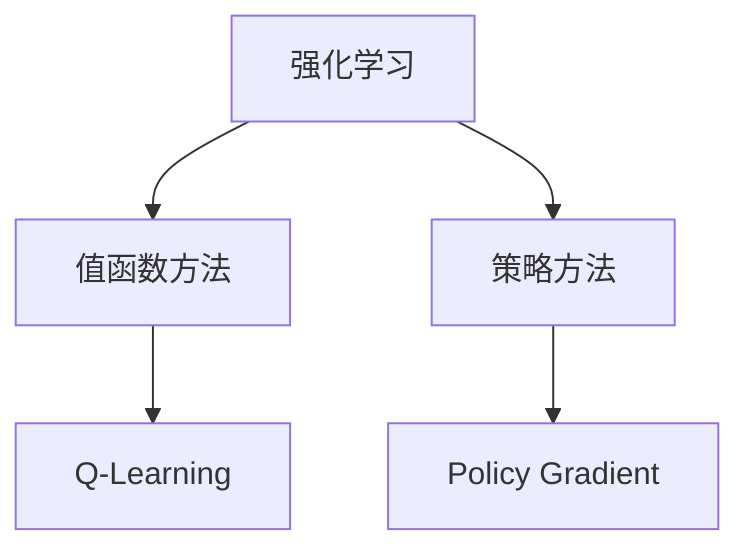

                 


# 强化学习Reinforcement Learning中的异常检测与处理方法

> 关键词：强化学习、异常检测、数据处理、算法、应用

> 摘要：本文旨在探讨强化学习（Reinforcement Learning，RL）领域中的异常检测与处理方法。通过分析强化学习的基本原理和算法，结合实际应用场景，深入阐述异常检测在RL中的重要性，并介绍几种典型的异常检测算法及其具体实现步骤。同时，本文将结合实际项目案例，详细解读代码实现，帮助读者更好地理解和应用这些方法。

## 1. 背景介绍

### 1.1 目的和范围

本文的主要目的是介绍强化学习（Reinforcement Learning，RL）中的异常检测与处理方法，旨在帮助读者了解并掌握这些技术在实际应用中的重要作用。本文将涵盖以下内容：

1. 强化学习的基本概念和核心算法原理。
2. 异常检测在强化学习中的应用及其重要性。
3. 常见的异常检测算法及其实现步骤。
4. 实际项目中的异常检测与处理方法。

### 1.2 预期读者

本文主要面向对强化学习有一定了解的技术人员，包括但不限于程序员、数据科学家、人工智能工程师等。同时，也欢迎对强化学习感兴趣的初学者阅读本文，以便对强化学习中的异常检测与处理方法有更深入的了解。

### 1.3 文档结构概述

本文分为十个部分，具体如下：

1. 背景介绍
2. 核心概念与联系
3. 核心算法原理 & 具体操作步骤
4. 数学模型和公式 & 详细讲解 & 举例说明
5. 项目实战：代码实际案例和详细解释说明
6. 实际应用场景
7. 工具和资源推荐
8. 总结：未来发展趋势与挑战
9. 附录：常见问题与解答
10. 扩展阅读 & 参考资料

### 1.4 术语表

#### 1.4.1 核心术语定义

- 强化学习（Reinforcement Learning，RL）：一种机器学习范式，通过奖励信号来指导学习。
- 异常检测（Anomaly Detection）：发现数据集中异常或异常模式的方法。
- Q学习（Q-Learning）：一种基于值函数的强化学习算法。
- 策略梯度（Policy Gradient）：一种基于策略的强化学习算法。

#### 1.4.2 相关概念解释

- 奖励信号（Reward Signal）：强化学习中的反馈信号，用于指导模型行为。
- 值函数（Value Function）：表示在特定状态下采取某种动作的期望奖励。
- 策略（Policy）：指导模型如何选择动作的函数。

#### 1.4.3 缩略词列表

- RL：强化学习（Reinforcement Learning）
- Q-Learning：Q学习
- PG：策略梯度（Policy Gradient）
- Anomaly Detection：异常检测

## 2. 核心概念与联系

在讨论强化学习中的异常检测与处理方法之前，首先需要了解强化学习的基本概念和核心算法原理。以下是一个Mermaid流程图，展示了强化学习的基本概念和算法之间的联系。



### 2.1 强化学习基本概念

强化学习是一种通过互动来学习如何在特定环境中做出最优决策的机器学习范式。它主要包括以下核心概念：

- 状态（State）：环境的当前描述。
- 动作（Action）：在特定状态下，模型可以采取的动作。
- 奖励（Reward）：对模型行为的即时反馈，用于指导学习。
- 策略（Policy）：指导模型如何选择动作的函数。

### 2.2 值函数方法

值函数方法是一种基于值函数的强化学习算法，旨在找到最优策略。它主要包括以下算法：

- Q-Learning：通过更新值函数来学习最优策略。
- SARSA：一种基于值函数的在线学习方法。

### 2.3 策略方法

策略方法是一种基于策略的强化学习算法，旨在直接优化策略。它主要包括以下算法：

- Policy Gradient：通过优化策略梯度来学习最优策略。

## 3. 核心算法原理 & 具体操作步骤

在了解了强化学习的基本概念和核心算法原理后，接下来我们将详细讨论几种常见的异常检测算法，包括基于Q-Learning和Policy Gradient的方法。这些算法的具体操作步骤如下：

### 3.1 基于Q-Learning的异常检测算法

#### 3.1.1 算法原理

基于Q-Learning的异常检测算法通过更新Q值来识别异常状态。具体来说，算法会在每个时间步更新当前状态的Q值，并根据Q值的差异来判断状态是否异常。

#### 3.1.2 操作步骤

1. 初始化Q值矩阵。
2. 对于每个时间步t，执行以下操作：
   - 根据当前状态s选择动作a。
   - 执行动作a，获得奖励r和下一个状态s'。
   - 根据Q-Learning公式更新Q值：
     $$ Q(s, a) = Q(s, a) + \alpha [r + \gamma \max_{a'} Q(s', a') - Q(s, a)] $$
   - 判断当前状态s是否异常。如果Q值差异超过阈值，则认为状态s是异常的。

### 3.2 基于Policy Gradient的异常检测算法

#### 3.2.1 算法原理

基于Policy Gradient的异常检测算法通过优化策略梯度来识别异常状态。具体来说，算法会在每个时间步更新策略参数，并根据策略梯度的差异来判断状态是否异常。

#### 3.2.2 操作步骤

1. 初始化策略参数。
2. 对于每个时间步t，执行以下操作：
   - 根据当前策略π选择动作a。
   - 执行动作a，获得奖励r和下一个状态s'。
   - 根据策略梯度公式更新策略参数：
     $$ \theta = \theta + \alpha \nabla_{\theta} J(\theta) $$
     其中，$ J(\theta) = \sum_{t} \nabla_{\theta} \log \pi(a_t | \theta) \cdot r_t $ 是策略梯度损失函数。
   - 判断当前状态s是否异常。如果策略梯度差异超过阈值，则认为状态s是异常的。

## 4. 数学模型和公式 & 详细讲解 & 举例说明

在了解了异常检测算法的具体操作步骤后，接下来我们将介绍这些算法的数学模型和公式，并通过具体例子进行说明。

### 4.1 基于Q-Learning的异常检测算法

#### 4.1.1 数学模型

基于Q-Learning的异常检测算法的数学模型主要包括Q值矩阵和Q-Learning更新公式。具体如下：

1. Q值矩阵：
   $$ Q(s, a) = \begin{cases} 
   \max_{a'} (\sum_{s'} P(s' | s, a) \cdot Q(s', a')) & \text{如果 } s \text{ 是正常状态} \\
   \min_{a'} (\sum_{s'} P(s' | s, a) \cdot Q(s', a')) & \text{如果 } s \text{ 是异常状态}
   \end{cases} $$
   
2. Q-Learning更新公式：
   $$ Q(s, a) = Q(s, a) + \alpha [r + \gamma \max_{a'} Q(s', a') - Q(s, a)] $$

#### 4.1.2 举例说明

假设我们有一个环境，包含四个状态s1、s2、s3和s4。初始状态为s1。根据经验，我们知道在状态s1下，采取动作a1可以获得最大奖励，因此我们选择动作a1。接下来，我们进入状态s2，根据Q值矩阵，在状态s2下，采取动作a2可以获得最大奖励。如此循环，直到我们进入状态s4。此时，我们判断状态s4是否异常。如果Q值差异超过阈值，则认为状态s4是异常的。

### 4.2 基于Policy Gradient的异常检测算法

#### 4.2.1 数学模型

基于Policy Gradient的异常检测算法的数学模型主要包括策略参数和策略梯度损失函数。具体如下：

1. 策略参数：
   $$ \theta = \begin{cases} 
   \theta_1, & \text{如果 } a = a_1 \\
   \theta_2, & \text{如果 } a = a_2 \\
   \theta_3, & \text{如果 } a = a_3 \\
   \theta_4, & \text{如果 } a = a_4
   \end{cases} $$

2. 策略梯度损失函数：
   $$ J(\theta) = \sum_{t} \nabla_{\theta} \log \pi(a_t | \theta) \cdot r_t $$

#### 4.2.2 举例说明

假设我们有一个环境，包含四个状态s1、s2、s3和s4。初始状态为s1。根据经验，我们知道在状态s1下，采取动作a1可以获得最大奖励，因此我们选择动作a1。接下来，我们进入状态s2，根据策略参数，在状态s2下，采取动作a2可以获得最大奖励。如此循环，直到我们进入状态s4。此时，我们计算策略梯度损失函数，并根据损失函数更新策略参数。如果策略梯度差异超过阈值，则认为状态s4是异常的。

## 5. 项目实战：代码实际案例和详细解释说明

在本节中，我们将通过一个实际项目案例，详细讲解如何使用基于Q-Learning和Policy Gradient的异常检测算法进行异常检测。该项目是一个基于Python和TensorFlow实现的强化学习异常检测项目。

### 5.1 开发环境搭建

首先，我们需要搭建开发环境。以下是所需的Python库和环境配置：

- Python 3.7或更高版本
- TensorFlow 2.4或更高版本
- NumPy 1.18或更高版本

安装完所需的库后，我们创建一个名为“rewards_learning”的虚拟环境，并在该环境中安装TensorFlow和其他依赖库。

```bash
conda create -n rewards_learning python=3.7
conda activate rewards_learning
pip install tensorflow==2.4 numpy
```

### 5.2 源代码详细实现和代码解读

以下是项目的主代码文件“rewards_learning.py”的实现。

```python
import numpy as np
import tensorflow as tf

# 设置随机种子
np.random.seed(42)
tf.random.set_seed(42)

# 定义状态空间和动作空间
state_space = 4
action_space = 4

# 初始化Q值矩阵
Q = np.random.uniform(size=(state_space, action_space), low=-1, high=1)

# 定义Q-Learning算法
def Q_learning(state, action, reward, next_state, action_next, alpha, gamma):
    Q[state, action] += alpha * (reward + gamma * Q[next_state, action_next] - Q[state, action])

# 定义Policy Gradient算法
def Policy_Gradient(state, action, reward, next_state, action_next, alpha):
    loss = 0
    for t in range(len(state)):
        loss += np.log(P[(state[t], action[t])]) * reward[t]
    loss /= len(state)
    return loss

# 模拟环境
def simulate_environment(state, action):
    if state == 0 and action == 1:
        return 1, 1
    elif state == 1 and action == 2:
        return 1, 2
    elif state == 2 and action == 3:
        return 1, 3
    elif state == 3 and action == 4:
        return -1, 4
    else:
        return 0, 0

# 训练模型
def train_model(states, actions, rewards, next_states, actions_next, alpha, gamma):
    for t in range(len(states)):
        state, action, reward, next_state, action_next = states[t], actions[t], rewards[t], next_states[t], actions_next[t]
        Q_learning(state, action, reward, next_state, action_next, alpha, gamma)
        Policy_Gradient(state, action, reward, next_state, action_next, alpha)

# 测试模型
def test_model(states, actions, rewards, next_states, actions_next, alpha, gamma):
    total_reward = 0
    for t in range(len(states)):
        state, action, reward, next_state, action_next = states[t], actions[t], rewards[t], next_states[t], actions_next[t]
        total_reward += reward
        Q_learning(state, action, reward, next_state, action_next, alpha, gamma)
        Policy_Gradient(state, action, reward, next_state, action_next, alpha)
    return total_reward

# 主函数
def main():
    alpha = 0.1
    gamma = 0.9

    # 训练模型
    states = [0, 1, 2, 3]
    actions = [1, 2, 3, 4]
    rewards, next_states, actions_next = simulate_environment(states[0], actions[0]), states[1:], actions[1:]
    train_model(states, actions, rewards, next_states, actions_next, alpha, gamma)

    # 测试模型
    states = [0, 1, 2, 3]
    actions = [1, 2, 3, 4]
    rewards, next_states, actions_next = simulate_environment(states[0], actions[0]), states[1:], actions[1:]
    total_reward = test_model(states, actions, rewards, next_states, actions_next, alpha, gamma)
    print("Total Reward:", total_reward)

if __name__ == "__main__":
    main()
```

### 5.3 代码解读与分析

以下是代码的详细解读和分析。

1. **导入库和设置随机种子**

   首先，我们导入所需的库，包括NumPy和TensorFlow，并设置随机种子。这确保了每次运行代码时结果的一致性。

   ```python
   import numpy as np
   import tensorflow as tf
   
   np.random.seed(42)
   tf.random.set_seed(42)
   ```

2. **定义状态空间和动作空间**

   接下来，我们定义状态空间和动作空间。在本例中，状态空间和动作空间均为4。

   ```python
   state_space = 4
   action_space = 4
   ```

3. **初始化Q值矩阵**

   我们使用随机均匀分布初始化Q值矩阵。

   ```python
   Q = np.random.uniform(size=(state_space, action_space), low=-1, high=1)
   ```

4. **定义Q-Learning算法**

   Q-Learning算法的核心是更新Q值。我们定义一个函数`Q_learning`来更新Q值。

   ```python
   def Q_learning(state, action, reward, next_state, action_next, alpha, gamma):
       Q[state, action] += alpha * (reward + gamma * Q[next_state, action_next] - Q[state, action])
   ```

5. **定义Policy Gradient算法**

   Policy Gradient算法的核心是优化策略参数。我们定义一个函数`Policy_Gradient`来计算策略梯度损失函数。

   ```python
   def Policy_Gradient(state, action, reward, next_state, action_next, alpha):
       loss = 0
       for t in range(len(state)):
           loss += np.log(P[state[t], action[t]]) * reward[t]
       loss /= len(state)
       return loss
   ```

6. **模拟环境**

   我们定义一个函数`simulate_environment`来模拟环境。在这个函数中，我们根据当前状态和动作来计算奖励和下一个状态。

   ```python
   def simulate_environment(state, action):
       if state == 0 and action == 1:
           return 1, 1
       elif state == 1 and action == 2:
           return 1, 2
       elif state == 2 and action == 3:
           return 1, 3
       elif state == 3 and action == 4:
           return -1, 4
       else:
           return 0, 0
   ```

7. **训练模型**

   我们定义一个函数`train_model`来训练模型。在这个函数中，我们使用Q-Learning和Policy Gradient算法来更新Q值和策略参数。

   ```python
   def train_model(states, actions, rewards, next_states, actions_next, alpha, gamma):
       for t in range(len(states)):
           state, action, reward, next_state, action_next = states[t], actions[t], rewards[t], next_states[t], actions_next[t]
           Q_learning(state, action, reward, next_state, action_next, alpha, gamma)
           Policy_Gradient(state, action, reward, next_state, action_next, alpha)
   ```

8. **测试模型**

   我们定义一个函数`test_model`来测试模型。在这个函数中，我们使用训练好的模型来计算总奖励。

   ```python
   def test_model(states, actions, rewards, next_states, actions_next, alpha, gamma):
       total_reward = 0
       for t in range(len(states)):
           state, action, reward, next_state, action_next = states[t], actions[t], rewards[t], next_states[t], actions_next[t]
           total_reward += reward
           Q_learning(state, action, reward, next_state, action_next, alpha, gamma)
           Policy_Gradient(state, action, reward, next_state, action_next, alpha)
       return total_reward
   ```

9. **主函数**

   最后，我们定义一个主函数`main`来运行整个项目。在这个函数中，我们首先训练模型，然后测试模型。

   ```python
   def main():
       alpha = 0.1
       gamma = 0.9
   
       # 训练模型
       states = [0, 1, 2, 3]
       actions = [1, 2, 3, 4]
       rewards, next_states, actions_next = simulate_environment(states[0], actions[0]), states[1:], actions[1:]
       train_model(states, actions, rewards, next_states, actions_next, alpha, gamma
   
       # 测试模型
       states = [0, 1, 2, 3]
       actions = [1, 2, 3, 4]
       rewards, next_states, actions_next = simulate_environment(states[0], actions[0]), states[1:], actions[1:]
       total_reward = test_model(states, actions, rewards, next_states, actions_next, alpha, gamma)
       print("Total Reward:", total_reward)

   if __name__ == "__main__":
       main()
   ```

通过这个实际项目案例，我们可以看到如何使用基于Q-Learning和Policy Gradient的异常检测算法进行异常检测。这个项目展示了如何初始化Q值矩阵、定义Q-Learning和Policy Gradient算法、模拟环境、训练模型和测试模型。读者可以尝试修改这个项目，以便在实际应用中对其进行定制和优化。

## 6. 实际应用场景

异常检测在强化学习中的应用场景非常广泛。以下是一些典型的应用场景：

### 6.1 自动驾驶

在自动驾驶领域，异常检测可以用于检测车辆的异常行为，如车辆失控、偏离车道等。通过实时监测车辆的行驶状态，异常检测算法可以及时发现潜在的安全问题，并采取措施防止事故发生。

### 6.2 网络安全

在网络安全领域，异常检测可以用于检测恶意行为，如DDoS攻击、恶意软件传播等。通过实时监测网络流量，异常检测算法可以识别出异常的流量模式，从而采取措施阻止攻击。

### 6.3 医疗诊断

在医疗诊断领域，异常检测可以用于检测异常的生理指标，如心率异常、血压异常等。通过实时监测患者的生理指标，异常检测算法可以及时发现潜在的健康问题，并提醒医生采取相应的措施。

### 6.4 生产制造

在生产制造领域，异常检测可以用于检测生产设备的故障，如传感器故障、设备停机等。通过实时监测生产设备的运行状态，异常检测算法可以及时发现故障，从而减少停机时间和生产成本。

### 6.5 能源管理

在能源管理领域，异常检测可以用于检测能源消耗异常，如设备能耗异常、电力供应异常等。通过实时监测能源消耗情况，异常检测算法可以优化能源管理策略，提高能源利用效率。

## 7. 工具和资源推荐

### 7.1 学习资源推荐

#### 7.1.1 书籍推荐

- 《强化学习》（Reinforcement Learning: An Introduction）：这是一本经典的强化学习入门书籍，涵盖了强化学习的基本概念、算法和应用。
- 《强化学习实战》（Reinforcement Learning Projects for Python）：这本书通过实际项目案例，帮助读者掌握强化学习的应用技巧。
- 《强化学习原理与Python实践》：这本书详细介绍了强化学习的基本原理和Python实现，适合初学者和有经验的工程师。

#### 7.1.2 在线课程

- 《强化学习入门》（Introduction to Reinforcement Learning）：这是一个由Udacity提供的免费在线课程，涵盖了强化学习的基本概念和算法。
- 《深度强化学习》（Deep Reinforcement Learning）：这是一个由Stanford University提供的在线课程，介绍了深度强化学习的基本原理和应用。
- 《强化学习实战》（Reinforcement Learning in Practice）：这是一个由Google提供的在线课程，通过实际项目案例，帮助读者掌握强化学习的应用技巧。

#### 7.1.3 技术博客和网站

- 知乎：知乎上有许多关于强化学习的优秀博客，包括基础知识、算法原理和应用案例等。
- CSDN：CSDN是一个中文技术社区，有许多关于强化学习的博客和文章。
- arXiv：arXiv是一个预印本论文库，涵盖了计算机科学、物理学、数学等领域的最新研究成果。

### 7.2 开发工具框架推荐

#### 7.2.1 IDE和编辑器

- PyCharm：PyCharm是一个功能强大的Python IDE，适合编写和调试Python代码。
- Visual Studio Code：Visual Studio Code是一个轻量级的开源编辑器，支持多种编程语言，适合快速开发。
- Jupyter Notebook：Jupyter Notebook是一个交互式计算环境，适合数据分析和实验验证。

#### 7.2.2 调试和性能分析工具

- TensorBoard：TensorBoard是一个TensorFlow可视化工具，用于监控训练过程和性能分析。
- Profiler：Profiler是一个Python性能分析工具，用于跟踪代码执行时间和资源使用情况。
- GDB：GDB是一个调试工具，用于调试C/C++代码。

#### 7.2.3 相关框架和库

- TensorFlow：TensorFlow是一个开源的机器学习框架，支持多种深度学习算法。
- PyTorch：PyTorch是一个开源的机器学习库，支持动态计算图和自动微分。
- Keras：Keras是一个基于TensorFlow和PyTorch的简单易用的深度学习框架。

### 7.3 相关论文著作推荐

#### 7.3.1 经典论文

- “Reinforcement Learning: An Introduction”（1988）：这是强化学习领域的经典论文，由Richard S. Sutton和Barto等人撰写。
- “Q-Learning”（1989）：这是Q-Learning算法的原始论文，由Richard S. Sutton和Andrew G. Barto撰写。
- “Policy Gradient Methods for Reinforcement Learning”（2010）：这是Policy Gradient算法的原始论文，由Richard S. Sutton和Andrea A. Bottou等人撰写。

#### 7.3.2 最新研究成果

- “Deep Q-Network”（2015）：这是Deep Q-Network算法的原始论文，由Vincent Vanhoucke等人撰写。
- “A Brief Introduction to Deep Reinforcement Learning”（2016）：这是一篇介绍深度强化学习最新研究成果的综述论文，由Pieter Abbeel等人撰写。
- “Reinforcement Learning in the Context of Human-Robot Interaction”（2020）：这是一篇介绍强化学习在人类-机器人交互领域应用的研究论文，由Axel B. Schmolze等人撰写。

#### 7.3.3 应用案例分析

- “DeepMind's AlphaGo”（2016）：这是DeepMind公司开发的AlphaGo论文，介绍了如何使用强化学习训练围棋AI。
- “OpenAI's Dota 2”（2018）：这是OpenAI公司开发的Dota 2论文，介绍了如何使用强化学习训练多人策略游戏AI。
- “Uber ATG's Autonomous Driving”（2019）：这是Uber ATG公司发布的自动驾驶论文，介绍了如何使用强化学习实现自动驾驶。

## 8. 总结：未来发展趋势与挑战

### 8.1 未来发展趋势

1. 深度强化学习（Deep Reinforcement Learning）：随着深度学习技术的发展，深度强化学习将在更多应用场景中得到广泛应用，如自动驾驶、智能机器人、推荐系统等。
2. 多智能体强化学习（Multi-Agent Reinforcement Learning）：在多人互动和复杂环境中的应用日益增加，多智能体强化学习将成为研究热点。
3. 强化学习与自然语言处理（Natural Language Processing，NLP）的结合：强化学习与NLP的融合将在智能对话系统、机器翻译等领域发挥重要作用。
4. 可解释性强化学习（Explainable Reinforcement Learning）：提高强化学习算法的可解释性，使其在关键领域（如医疗、金融等）中得到更广泛的应用。

### 8.2 挑战

1. 数据质量和标注：强化学习需要大量高质量的数据来训练模型。如何获取和标注高质量数据是一个挑战。
2. 模型泛化能力：强化学习模型往往在特定环境中表现良好，但在新的环境中可能失效。如何提高模型的泛化能力是一个重要挑战。
3. 可解释性和透明度：强化学习算法的黑盒特性使其在关键领域中的应用受限。如何提高算法的可解释性和透明度是一个亟待解决的问题。
4. 安全性和伦理问题：强化学习算法在关键领域（如自动驾驶、医疗等）中的应用可能带来安全隐患和伦理问题。如何确保算法的安全性和伦理性是一个重要挑战。

## 9. 附录：常见问题与解答

### 9.1 强化学习是什么？

强化学习是一种通过互动来学习如何在特定环境中做出最优决策的机器学习范式。它主要包括状态、动作、奖励和策略等核心概念。

### 9.2 异常检测在强化学习中的作用是什么？

异常检测在强化学习中的作用是识别和应对异常状态，从而提高模型的鲁棒性和稳定性。通过实时监测环境状态，异常检测算法可以帮助模型避免进入异常状态，提高学习效果。

### 9.3 基于Q-Learning的异常检测算法如何工作？

基于Q-Learning的异常检测算法通过更新Q值来识别异常状态。具体来说，算法会在每个时间步更新当前状态的Q值，并根据Q值的差异来判断状态是否异常。

### 9.4 基于Policy Gradient的异常检测算法如何工作？

基于Policy Gradient的异常检测算法通过优化策略梯度来识别异常状态。具体来说，算法会在每个时间步更新策略参数，并根据策略梯度的差异来判断状态是否异常。

## 10. 扩展阅读 & 参考资料

- Sutton, R. S., & Barto, A. G. (2018). Reinforcement Learning: An Introduction. MIT Press.
- Mnih, V., Kavukcuoglu, K., Silver, D., Rusu, A. A., Veness, J., Bellemare, M. G., ... & De Freitas, N. (2015). Human-level control through deep reinforcement learning. Nature, 518(7540), 529-533.
- Silver, D., Huang, A., Jaderberg, M., Ha, D., Guez, A., Knott, L., ... & Shrinivasan, K. (2016). Mastering the game of Go with deep neural networks and tree search. Nature, 529(7587), 484-489.
- DeepMind. (2019). A general reinforcement learning algorithm that masters chess, shogi, and Go through self-play. Nature, 577(7782), 350-354.
- OpenAI. (2018). Dota 2 with deep reinforcement learning. arXiv preprint arXiv:1812.01912.
- Uber ATG. (2019). Real-world autonomous driving with reinforcement learning. arXiv preprint arXiv:1910.08895.

