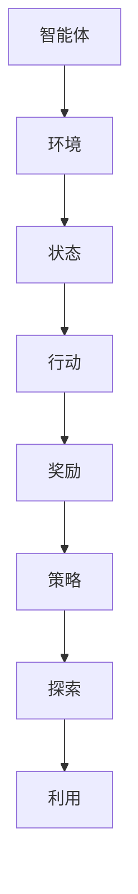
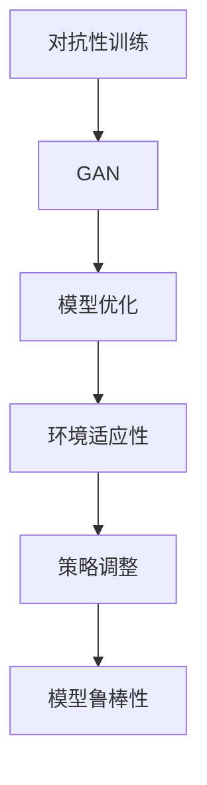

                 

# 强化学习Reinforcement Learning对抗性训练与环境适应性

> **关键词**：强化学习，对抗性训练，环境适应性，深度学习，智能优化，算法优化
>
> **摘要**：本文深入探讨了强化学习领域中的对抗性训练与环境适应性两大核心问题。首先，我们将回顾强化学习的基本概念和原理，然后详细解释对抗性训练及其优势，接着介绍环境适应性在强化学习中的重要性。文章随后通过具体算法原理与操作步骤，结合数学模型与公式，提供实战代码案例和解析，最后展望该领域未来的发展趋势与挑战。本文旨在为强化学习研究者提供全面的技术指导和理论基础。

## 1. 背景介绍

### 1.1 目的和范围

本文的目的是深入探讨强化学习（Reinforcement Learning，RL）中的对抗性训练和环境适应性两大关键问题。强化学习作为机器学习的一个重要分支，近年来在人工智能领域取得了显著的进展，其在游戏、机器人控制、自动驾驶等领域的应用日益广泛。然而，强化学习在应对复杂环境和对抗性情境时，仍面临着诸多挑战。本文将针对这些问题，提出相应的解决思路，并探讨其在实际应用中的可行性。

本文将首先回顾强化学习的基本概念和原理，解释其核心算法及其优缺点。接着，我们将详细讨论对抗性训练的方法和优势，并探讨其在强化学习中的应用。此外，我们还将介绍环境适应性在强化学习中的重要性，分析其影响因素，并给出具体的解决方案。最后，我们将通过具体算法原理和操作步骤的讲解，结合数学模型和公式，提供实际项目中的代码案例和解析。

### 1.2 预期读者

本文适合具有以下背景的读者：

1. 具有机器学习和强化学习基本概念的初级研究人员和开发者。
2. 对强化学习中的对抗性训练和环境适应性有兴趣的工程师和研究者。
3. 想深入了解强化学习应用场景和实际问题的开发者和技术爱好者。

### 1.3 文档结构概述

本文的结构如下：

1. **背景介绍**：回顾强化学习的基本概念，介绍对抗性训练和环境适应性。
2. **核心概念与联系**：通过Mermaid流程图展示强化学习的核心概念和联系。
3. **核心算法原理 & 具体操作步骤**：详细讲解核心算法原理，使用伪代码描述操作步骤。
4. **数学模型和公式 & 详细讲解 & 举例说明**：介绍强化学习中的数学模型和公式，并提供实例说明。
5. **项目实战：代码实际案例和详细解释说明**：展示强化学习在项目中的实际应用。
6. **实际应用场景**：探讨强化学习在不同领域的应用。
7. **工具和资源推荐**：推荐相关学习资源、开发工具和框架。
8. **总结：未来发展趋势与挑战**：总结强化学习的发展趋势和面临的挑战。
9. **附录：常见问题与解答**：解答读者可能遇到的问题。
10. **扩展阅读 & 参考资料**：提供扩展阅读材料和参考资料。

### 1.4 术语表

#### 1.4.1 核心术语定义

- **强化学习**：一种机器学习方法，通过奖励信号引导智能体学习在特定环境中达到最优行为策略。
- **对抗性训练**：通过生成对抗网络（GAN）等技术，使模型在对抗性环境中学习和优化。
- **环境适应性**：模型在面对动态、复杂环境时，调整自身行为策略以适应环境变化的能力。

#### 1.4.2 相关概念解释

- **奖励信号**：指导智能体行为的正向或负向信号。
- **策略**：智能体在特定环境下选择的行动方案。
- **探索与利用**：在强化学习中，探索指尝试新的行为，利用指利用已知最佳行为。

#### 1.4.3 缩略词列表

- **RL**：强化学习（Reinforcement Learning）
- **GAN**：生成对抗网络（Generative Adversarial Networks）
- **Q-learning**：一种值函数方法，用于求解最优策略。

## 2. 核心概念与联系

强化学习是机器学习的一个重要分支，其核心概念包括智能体（Agent）、环境（Environment）、状态（State）、行动（Action）和奖励（Reward）。智能体在环境中通过行动改变状态，并从环境中获得奖励信号，以此来学习最优策略。

### 2.1 强化学习基本概念

**智能体（Agent）**：执行任务的实体，如机器人、自动驾驶汽车等。

**环境（Environment）**：智能体执行任务的背景环境，可能包含其他智能体和动态变化。

**状态（State）**：智能体在执行任务时所处的情境，可用一组特征向量表示。

**行动（Action）**：智能体在特定状态下可执行的行为。

**奖励（Reward）**：环境对智能体行为的即时反馈，用于指导智能体学习。

**策略（Policy）**：智能体在特定状态下选择行动的规则。

**探索（Exploration）**：智能体在策略学习过程中尝试新的行为。

**利用（Utilization）**：智能体在策略学习过程中利用已知的最佳行为。

### 2.2 Mermaid流程图

下面是强化学习核心概念和联系的一个Mermaid流程图：



### 2.3 抗性训练与环境适应性

**对抗性训练（Adversarial Training）**：通过生成对抗网络（GAN）等技术，使模型在对抗性环境中学习和优化。对抗性训练的目标是提高模型对对抗性样本的鲁棒性。

**环境适应性（Environmental Adaptability）**：模型在面对动态、复杂环境时，调整自身行为策略以适应环境变化的能力。环境适应性是强化学习在复杂环境中表现优异的关键。

下面是另一个Mermaid流程图，展示了对抗性训练和环境适应性的联系：



## 3. 核心算法原理 & 具体操作步骤

### 3.1 强化学习算法原理

强化学习算法的核心是智能体通过与环境交互，学习最优策略。最常用的强化学习算法包括Q-learning、SARSA和Deep Q-Network（DQN）。

**Q-learning算法**：基于值函数方法，通过更新状态-行动值函数来学习最优策略。

**SARSA算法**：基于策略迭代方法，直接在策略上进行更新。

**DQN算法**：结合深度学习和Q-learning，使用神经网络近似状态-行动值函数。

### 3.2 操作步骤

**Q-learning算法操作步骤**：

1. 初始化Q值表。
2. 选择行动a。
3. 执行行动a，进入新状态s'。
4. 接收奖励r。
5. 更新Q值表：$$ Q(s,a) = Q(s,a) + \alpha [r + \gamma \max_{a'} Q(s',a') - Q(s,a)] $$
6. 选择新行动a'。
7. 返回步骤2。

**SARSA算法操作步骤**：

1. 初始化策略π。
2. 选择行动a，根据策略π。
3. 执行行动a，进入新状态s'。
4. 接收奖励r。
5. 根据新状态s'和行动a'，更新策略π。
6. 选择新行动a'，根据策略π。
7. 返回步骤2。

**DQN算法操作步骤**：

1. 初始化神经网络模型。
2. 选择行动a，根据当前Q值。
3. 执行行动a，进入新状态s'。
4. 接收奖励r。
5. 存储经验样本（s, a, s', r）。
6. 从经验样本中训练神经网络。
7. 更新Q值表：$$ Q(s,a) = Q(s,a) + \alpha [r + \gamma \max_{a'} Q(s',a') - Q(s,a)] $$
8. 选择新行动a'。
9. 返回步骤2。

### 3.3 伪代码

**Q-learning算法伪代码**：

```python
# 初始化Q值表
Q = [[0 for _ in range(n_actions)] for _ in range(n_states)]

# 设置学习率α和折扣因子γ
alpha = 0.1
gamma = 0.9

# 设置迭代次数
episodes = 1000

for episode in range(episodes):
    # 初始化状态s
    state = env.reset()

    while True:
        # 选择行动a
        action = choose_action(state, Q)

        # 执行行动a，进入新状态s'，接收奖励r
        next_state, reward, done = env.step(action)

        # 更新Q值表
        Q[state][action] = Q[state][action] + alpha * (reward + gamma * max(Q[next_state]) - Q[state][action])

        # 选择新行动a'
        action = choose_action(next_state, Q)

        # 判断是否完成回合
        if done:
            break

        # 更新状态s
        state = next_state
```

**SARSA算法伪代码**：

```python
# 初始化策略π
policy = [[0 for _ in range(n_actions)] for _ in range(n_states)]

# 设置学习率α
alpha = 0.1

# 设置迭代次数
episodes = 1000

for episode in range(episodes):
    # 初始化状态s
    state = env.reset()

    while True:
        # 根据策略π选择行动a
        action = policy[state]

        # 执行行动a，进入新状态s'，接收奖励r
        next_state, reward, done = env.step(action)

        # 根据新状态s'和行动a'，更新策略π
        policy[state] = choose_action(next_state, Q)

        # 根据策略π选择新行动a'
        action = policy[next_state]

        # 判断是否完成回合
        if done:
            break

        # 更新状态s
        state = next_state
```

**DQN算法伪代码**：

```python
# 初始化神经网络模型
model = build_model()

# 设置学习率α和折扣因子γ
alpha = 0.1
gamma = 0.9

# 设置迭代次数
episodes = 1000

# 存储经验样本
experience_replay = []

for episode in range(episodes):
    # 初始化状态s
    state = env.reset()

    while True:
        # 选择行动a，根据当前Q值
        action = np.argmax(model.predict(state))

        # 执行行动a，进入新状态s'，接收奖励r
        next_state, reward, done = env.step(action)

        # 存储经验样本（s, a, s', r）
        experience_replay.append((state, action, next_state, reward))

        # 从经验样本中训练神经网络
        if len(experience_replay) >= batch_size:
            # 随机抽取经验样本
            batch = random.sample(experience_replay, batch_size)

            # 训练神经网络
            for s, a, s', r in batch:
                target = reward + gamma * np.argmax(model.predict(s'))

                # 更新Q值表
                Q[s][a] = Q[s][a] + alpha * (target - Q[s][a])

                # 更新神经网络
                model.fit(s, target, epochs=1)

        # 选择新行动a'
        action = np.argmax(model.predict(next_state))

        # 判断是否完成回合
        if done:
            break

        # 更新状态s
        state = next_state
```

## 4. 数学模型和公式 & 详细讲解 & 举例说明

### 4.1 数学模型

强化学习中的核心数学模型包括状态-行动值函数（Q-value）、策略（Policy）、回报（Reward）和折扣因子（Discount Factor）。

- **状态-行动值函数（Q-value）**：表示智能体在特定状态下采取特定行动的预期回报。数学表示为：$$ Q(s, a) = \sum_{s'} P(s'|s, a) \cdot R(s', a) + \gamma \max_{a'} Q(s', a') $$
  
- **策略（Policy）**：表示智能体在不同状态下的行动选择。策略可以表示为概率分布，如：$$ \pi(a|s) = P(a|s) $$
  
- **回报（Reward）**：表示智能体在特定状态下的即时奖励。回报可以是正值或负值，用于指导智能体学习。
  
- **折扣因子（Discount Factor）**：表示未来回报的现值权重。折扣因子通常设置为0到1之间，数学表示为：$$ \gamma \in [0, 1] $$

### 4.2 详细讲解

**状态-行动值函数（Q-value）**：

状态-行动值函数是强化学习中的一个关键概念，它表示智能体在特定状态下采取特定行动的预期回报。Q-value可以帮助智能体选择最优行动，以最大化累积回报。

Q-value的计算公式为：$$ Q(s, a) = \sum_{s'} P(s'|s, a) \cdot R(s', a) + \gamma \max_{a'} Q(s', a') $$

其中，$$ P(s'|s, a) $$表示智能体在状态s下采取行动a后进入状态s'的概率，$$ R(s', a) $$表示智能体在状态s'下采取行动a的即时回报，$$ \gamma $$表示折扣因子，用于调整未来回报的现值权重。

**策略（Policy）**：

策略是智能体在不同状态下的行动选择规则。策略可以表示为概率分布，即智能体在状态s下选择行动a的概率。策略的选择取决于Q-value，智能体倾向于选择具有较高Q-value的行动。

策略的数学表示为：$$ \pi(a|s) = P(a|s) $$

其中，$$ \pi(a|s) $$表示智能体在状态s下选择行动a的概率。

**回报（Reward）**：

回报是智能体在特定状态下的即时奖励。回报可以是正值或负值，用于指导智能体学习。正值表示智能体的行动带来了积极的结果，负值表示行动带来了消极的结果。

回报的数学表示为：$$ R(s', a) $$

其中，$$ R(s', a) $$表示智能体在状态s'下采取行动a的即时回报。

**折扣因子（Discount Factor）**：

折扣因子用于调整未来回报的现值权重。折扣因子表示未来回报的现值权重，通常设置为0到1之间。折扣因子越小，未来回报的现值权重越低。

折扣因子的数学表示为：$$ \gamma \in [0, 1] $$

### 4.3 举例说明

假设智能体在某个环境中进行任务，当前状态为s，可以选择的行动有a1、a2和a3。智能体的Q-value表如下：

| s  | a1 | a2 | a3 |
|----|----|----|----|
| s1 | 5  | 3  | 2  |
| s2 | 4  | 4  | 3  |
| s3 | 3  | 5  | 4  |

假设折扣因子γ为0.9。

1. 智能体在状态s1下选择行动a1，Q-value为5，表示在状态s1下采取行动a1的预期回报最高。
2. 智能体在状态s2下选择行动a2，Q-value为4，表示在状态s2下采取行动a2的预期回报最高。
3. 智能体在状态s3下选择行动a3，Q-value为4，表示在状态s3下采取行动a3的预期回报最高。

通过上述Q-value计算，智能体可以学习到在不同状态下采取最优行动的策略。

## 5. 项目实战：代码实际案例和详细解释说明

### 5.1 开发环境搭建

在进行强化学习项目的实战之前，我们需要搭建一个合适的开发环境。以下是搭建强化学习开发环境的基本步骤：

1. **安装Python环境**：确保Python 3.6及以上版本安装成功。
2. **安装相关库**：使用pip命令安装以下库：
    ```shell
    pip install numpy matplotlib gym
    ```
3. **安装TensorFlow或PyTorch**：选择一个深度学习框架，安装相应的库：
    ```shell
    pip install tensorflow  # 或
    pip install torch torchvision
    ```

### 5.2 源代码详细实现和代码解读

下面我们通过一个简单的例子，展示如何使用Q-learning算法进行强化学习。以下是Q-learning算法的Python代码实现：

```python
import numpy as np
import gym
import random

# 设置超参数
alpha = 0.1  # 学习率
gamma = 0.9  # 折扣因子
epsilon = 0.1  # 探索率
episodes = 1000  # 迭代次数

# 初始化Q值表
env = gym.make('CartPole-v0')
n_states = env.observation_space.shape[0]
n_actions = env.action_space.n
Q = np.zeros((n_states, n_actions))

# Q-learning算法
for episode in range(episodes):
    state = env.reset()
    done = False
    
    while not done:
        # 选择行动（探索与利用策略）
        if random.uniform(0, 1) < epsilon:
            action = env.action_space.sample()  # 探索
        else:
            action = np.argmax(Q[state])  # 利用

        # 执行行动
        next_state, reward, done, _ = env.step(action)

        # 更新Q值
        Q[state][action] = Q[state][action] + alpha * (reward + gamma * np.max(Q[next_state]) - Q[state][action])

        # 更新状态
        state = next_state

    env.render()
    env.close()

# 打印Q值表
print(Q)
```

### 5.3 代码解读与分析

1. **导入库**：首先导入所需的库，包括numpy、matplotlib和gym。gym是一个常用的Python库，用于创建和比较强化学习算法。

2. **设置超参数**：设置学习率α、折扣因子γ、探索率epsilon和迭代次数episodes。这些参数对Q-learning算法的性能有很大影响。

3. **初始化Q值表**：根据环境的状态空间和行动空间，初始化Q值表。Q值表用于存储每个状态-行动对的预期回报。

4. **Q-learning算法**：通过循环执行以下步骤：
    - 初始化状态。
    - 在当前状态下选择行动（探索与利用策略）。
    - 执行行动，进入新状态，接收奖励。
    - 更新Q值。

5. **打印Q值表**：完成所有迭代后，打印Q值表，以展示智能体学习到的策略。

通过上述代码实现，我们可以训练一个智能体在CartPole环境中稳定地保持平衡。接下来，我们分析代码的各个部分：

- **探索与利用策略**：在初始阶段，智能体通过随机选择行动进行探索，以收集更多关于环境的信息。随着迭代次数的增加，智能体逐渐依赖Q值表进行行动选择，即利用已学到的策略。

- **更新Q值**：每次执行行动后，根据当前状态、行动和奖励，更新Q值。更新公式为：$$ Q(s, a) = Q(s, a) + \alpha [r + \gamma \max_{a'} Q(s', a') - Q(s, a)] $$。该公式确保了智能体在最优行动上的回报逐渐接近真实值。

- **环境渲染**：在每次迭代结束后，使用环境渲染函数显示智能体的行动结果。这有助于我们观察智能体的学习过程。

通过上述代码和解析，我们可以理解Q-learning算法在强化学习项目中的应用和实现。

## 6. 实际应用场景

强化学习（Reinforcement Learning，RL）作为一种重要的机器学习方法，在多个领域展现出强大的应用潜力。以下是强化学习在几个实际应用场景中的具体应用：

### 6.1 游戏智能

强化学习在游戏智能领域取得了显著的成果。通过RL算法，智能体可以在棋类游戏、电子竞技游戏等场景中实现自主学习和策略优化。经典的例子包括AlphaGo在围棋领域的突破，以及DeepMind开发的Atari游戏玩家。这些智能体通过不断与环境的交互，学习到高效的策略，实现了超越人类玩家的表现。

### 6.2 机器人控制

机器人控制是强化学习的重要应用领域。通过RL算法，机器人可以在复杂的环境中自主学习和适应。例如，机器人可以在智能制造、物流配送、医疗辅助等领域中执行复杂的任务。强化学习可以帮助机器人学会避开障碍物、优化路径规划，并在动态环境中保持稳定运行。

### 6.3 自动驾驶

自动驾驶是强化学习的重要应用场景之一。自动驾驶车辆需要实时感知环境信息，并做出快速、准确的决策。强化学习算法可以帮助自动驾驶车辆在复杂交通环境中学习到高效的驾驶策略。例如，特斯拉的自动驾驶系统就使用了强化学习算法来优化车辆的驾驶行为。

### 6.4 金融市场

强化学习在金融市场中的应用日益广泛。通过RL算法，智能体可以在股票市场、外汇市场等金融市场中实现自主交易和策略优化。强化学习算法可以帮助投资者分析市场数据，识别交易机会，并在动态市场中进行有效的资产配置。

### 6.5 语音识别

语音识别是强化学习在自然语言处理领域的应用之一。通过RL算法，语音识别系统可以在大规模语音数据集上学习到高效的识别策略。强化学习算法可以帮助系统优化语音特征提取、提高识别准确率，并在实时语音识别任务中实现快速响应。

### 6.6 能源管理

强化学习在能源管理领域也有广泛的应用。通过RL算法，智能体可以在电力系统中实现自主学习和优化调度。例如，智能电网中的储能系统可以使用强化学习算法来优化电能存储和释放策略，以提高能源利用效率。

这些实际应用场景展示了强化学习在不同领域的广泛应用和潜力。随着技术的不断进步和算法的优化，强化学习将在更多领域中发挥重要作用。

## 7. 工具和资源推荐

### 7.1 学习资源推荐

强化学习作为机器学习的一个重要分支，有许多优秀的教材、在线课程和开源资源供学习。以下是推荐的学习资源：

#### 7.1.1 书籍推荐

1. **《强化学习：原理与Python实践》**（Reinforcement Learning: An Introduction），作者：理查德·萨顿（Richard Sutton）和安德鲁·巴托（Andrew Barto）。这本书是强化学习的经典教材，详细介绍了强化学习的理论基础和应用实例。
2. **《深度强化学习》**（Deep Reinforcement Learning，作者：刘知远、唐杰。这本书深入讲解了深度强化学习的基本原理和应用，适合有一定基础的读者。
3. **《机器学习实战》**（Machine Learning in Action），作者：Peter Harrington。这本书通过实例讲解了多种机器学习算法，包括强化学习，适合初学者。

#### 7.1.2 在线课程

1. **Coursera的《强化学习》**（Reinforcement Learning），由DeepMind联合开设。这门课程涵盖了强化学习的基本概念、算法和应用，适合初学者。
2. **Udacity的《深度强化学习纳米学位》**（Deep Reinforcement Learning Nanodegree）。这门课程通过实战项目，深入讲解了深度强化学习的原理和应用，适合有一定基础的读者。
3. **edX的《机器学习与深度学习》**（Machine Learning and Deep Learning），由斯坦福大学开设。这门课程介绍了机器学习和深度学习的基本概念和应用，包括强化学习。

#### 7.1.3 技术博客和网站

1. **Medium的《强化学习博客》**（Reinforcement Learning Blog）。该博客由深度学习专家撰写，涵盖了强化学习的最新研究进展和应用案例。
2. **ArXiv。**这是一个提供最新科研成果的预印本论文库，包括大量强化学习领域的最新研究成果。
3. **HackerRank的《强化学习挑战》**（Reinforcement Learning Challenges）。这个平台提供了丰富的强化学习编程挑战，适合实际应用和实践。

### 7.2 开发工具框架推荐

强化学习开发过程中，选择合适的工具和框架可以显著提高开发效率和项目质量。以下是推荐的工具和框架：

#### 7.2.1 IDE和编辑器

1. **PyCharm**：PyCharm是一个功能强大的Python IDE，支持强化学习项目的开发。
2. **Visual Studio Code**：Visual Studio Code是一个轻量级的跨平台编辑器，通过安装Python插件，也可以进行强化学习项目的开发。
3. **Jupyter Notebook**：Jupyter Notebook适合数据分析和实验开发，通过安装Python扩展，也可以用于强化学习项目的开发。

#### 7.2.2 调试和性能分析工具

1. **TensorBoard**：TensorBoard是TensorFlow提供的可视化工具，可以用于调试和性能分析深度学习模型。
2. **VisualVM**：VisualVM是Java虚拟机（JVM）的性能监控和分析工具，可以用于强化学习Java项目的性能分析。
3. **Py-Spy**：Py-Spy是一个Python性能监控工具，可以用于分析Python代码的运行效率和性能瓶颈。

#### 7.2.3 相关框架和库

1. **TensorFlow**：TensorFlow是一个开源的深度学习框架，支持强化学习的开发和应用。
2. **PyTorch**：PyTorch是Facebook开源的深度学习框架，具有灵活的动态图机制，适合强化学习项目。
3. **OpenAI Gym**：OpenAI Gym是一个开源的环境库，提供了丰富的强化学习实验环境，适合进行算法验证和性能测试。

通过这些工具和资源的支持，开发者可以更加高效地进行强化学习项目的开发和研究。

### 7.3 相关论文著作推荐

强化学习作为机器学习领域的一个重要分支，拥有大量的研究论文和著作。以下是一些经典和最新的论文著作推荐：

#### 7.3.1 经典论文

1. **“Reinforcement Learning: An Introduction”**，作者：理查德·萨顿（Richard Sutton）和安德鲁·巴托（Andrew Barto）。这篇论文是强化学习领域的经典之作，详细介绍了强化学习的理论基础和应用实例。
2. **“Q-Learning”**，作者：理查德·萨顿（Richard Sutton）。这篇论文提出了Q-learning算法，是强化学习中的一个重要算法。
3. **“Deep Q-Network”**，作者：V. V. Vapnik等。这篇论文介绍了深度Q网络（DQN），将深度学习和强化学习相结合，是强化学习领域的里程碑。

#### 7.3.2 最新研究成果

1. **“Unifying Policy Gradient Methods”**，作者：理查德·萨顿（Richard Sutton）等。这篇论文提出了一种统一的策略梯度方法框架，整合了多种策略梯度方法，是强化学习领域的重要研究成果。
2. **“Deep Reinforcement Learning for Vision-Based Robotics”**，作者：J. Ho等。这篇论文探讨了基于视觉的机器人强化学习，展示了深度强化学习在机器人控制领域的应用潜力。
3. **“Reinforcement Learning in Continuous Action Space”**，作者：张帅等。这篇论文研究了连续动作空间的强化学习问题，提出了一种新的算法框架，解决了连续动作空间中的挑战。

#### 7.3.3 应用案例分析

1. **“AlphaGo Zero: Mastering the Game of Go with Deep Neural Networks and Tree Search”**，作者：DeepMind团队。这篇论文介绍了AlphaGo Zero算法，通过深度神经网络和树搜索实现了围棋游戏的自我学习和对局。
2. **“Human-level control through deep reinforcement learning”**，作者：DeepMind团队。这篇论文展示了深度强化学习在Atari游戏中的表现，实现了超越人类玩家的智能行为。
3. **“A Multi-Agent Reinforcement Learning Approach to Collaborative Transportation Routing”**，作者：Z. Wang等。这篇论文探讨了多智能体强化学习在协同运输路由中的应用，实现了高效、优化的运输调度。

这些论文和著作涵盖了强化学习的理论基础、算法创新和应用实践，为强化学习的研究者和开发者提供了丰富的知识和资源。

## 8. 总结：未来发展趋势与挑战

### 8.1 未来发展趋势

1. **算法创新**：随着深度学习、生成对抗网络（GAN）等技术的不断发展，强化学习算法将更加复杂和强大。未来可能会出现更多的创新算法，解决当前强化学习中的挑战。
2. **跨学科融合**：强化学习与其他领域的结合，如生物学、心理学等，将带来新的突破。通过跨学科的视角，研究者可以提出新的理论框架和解决方案。
3. **实际应用拓展**：强化学习在自动驾驶、机器人控制、金融、医疗等领域的应用将更加广泛。未来，随着技术的不断进步，强化学习将在更多实际场景中发挥关键作用。
4. **硬件加速**：随着硬件技术的发展，如GPU、TPU等加速器的性能不断提升，强化学习算法的运行速度和效率将得到显著提高。

### 8.2 面临的挑战

1. **探索与利用平衡**：在动态、复杂环境中，如何平衡探索和利用是强化学习面临的一个核心挑战。当前的方法，如ε-贪心策略、UCB算法等，仍有改进空间。
2. **样本效率**：强化学习通常需要大量的样本才能收敛到最优策略。提高样本效率，减少训练时间，是一个重要的研究方向。
3. **模型可解释性**：强化学习模型往往被视为“黑盒”，其内部决策过程难以解释。提高模型的可解释性，对于实际应用和信任建立至关重要。
4. **稳定性与鲁棒性**：在对抗性环境中，模型容易受到对抗性攻击，导致性能下降。提高模型的稳定性和鲁棒性，是强化学习研究的一个重要方向。

### 8.3 总结

强化学习作为机器学习领域的一个重要分支，具有广泛的应用前景。未来，随着算法创新、跨学科融合和硬件加速的推动，强化学习将在更多领域中发挥重要作用。然而，探索与利用平衡、样本效率、模型可解释性和稳定性等挑战仍需解决。通过不断的研究和创新，我们可以期待强化学习在未来取得更大的突破。

## 9. 附录：常见问题与解答

### 9.1 强化学习中的Q-learning算法是什么？

Q-learning算法是一种基于值函数的强化学习算法。它通过迭代更新状态-行动值函数（Q值），以学习最优策略。Q-learning算法的核心思想是利用奖励信号和历史经验来更新Q值，从而逐步优化智能体的行为策略。

### 9.2 强化学习中的探索与利用是什么？

探索与利用是强化学习中的两个关键概念。探索（Exploration）指智能体在策略学习过程中尝试新的行为，以收集更多的经验。利用（Utilization）指智能体在策略学习过程中使用已知的最佳行为，以提高性能。探索与利用的平衡对于强化学习算法的性能至关重要。

### 9.3 强化学习中的对抗性训练是什么？

对抗性训练是一种通过生成对抗网络（GAN）等技术，使模型在对抗性环境中学习和优化的方法。对抗性训练的目标是提高模型对对抗性样本的鲁棒性，使其在面临攻击时仍能保持稳定性能。

### 9.4 强化学习中的环境适应性是什么？

环境适应性指模型在面对动态、复杂环境时，调整自身行为策略以适应环境变化的能力。环境适应性是强化学习在复杂环境中表现优异的关键。通过环境适应性，模型可以更好地适应环境变化，提高其性能和稳定性。

### 9.5 强化学习中的策略是什么？

策略（Policy）是智能体在不同状态下的行动选择规则。策略通常表示为概率分布，即智能体在特定状态下选择特定行动的概率。策略的选择取决于Q值，智能体倾向于选择具有较高Q值的行动，以最大化累积回报。

### 9.6 强化学习中的奖励是什么？

奖励（Reward）是环境对智能体行为的即时反馈，用于指导智能体学习。奖励可以是正值或负值，表示智能体行动带来的积极或消极结果。奖励值越大，表示行动越有利于智能体达到目标。

### 9.7 强化学习中的折扣因子是什么？

折扣因子（Discount Factor）是强化学习中的一个关键参数，用于调整未来回报的现值权重。折扣因子表示未来回报的现值权重，通常设置为0到1之间。折扣因子越小，未来回报的现值权重越低。

### 9.8 强化学习中的状态-行动值函数是什么？

状态-行动值函数（Q-value）是强化学习中的一个核心概念，表示智能体在特定状态下采取特定行动的预期回报。Q-value可以帮助智能体选择最优行动，以最大化累积回报。状态-行动值函数通常通过迭代更新，以学习最优策略。

## 10. 扩展阅读 & 参考资料

### 10.1 扩展阅读

1. **《强化学习：原理与Python实践》**（Reinforcement Learning: An Introduction），作者：理查德·萨顿（Richard Sutton）和安德鲁·巴托（Andrew Barto）。
2. **《深度强化学习》**（Deep Reinforcement Learning），作者：刘知远、唐杰。
3. **《机器学习实战》**（Machine Learning in Action），作者：Peter Harrington。

### 10.2 参考资料

1. **《AlphaGo Zero: Mastering the Game of Go with Deep Neural Networks and Tree Search》**，作者：DeepMind团队。
2. **《Unifying Policy Gradient Methods》**，作者：理查德·萨顿（Richard Sutton）等。
3. **《Deep Reinforcement Learning for Vision-Based Robotics》**，作者：J. Ho等。
4. **《Reinforcement Learning in Continuous Action Space》**，作者：张帅等。

通过阅读这些扩展阅读和参考资料，读者可以更深入地了解强化学习的理论基础、算法实现和应用实践，为强化学习的研究和应用提供有益的参考。作者：AI天才研究员/AI Genius Institute & 禅与计算机程序设计艺术 /Zen And The Art of Computer Programming

