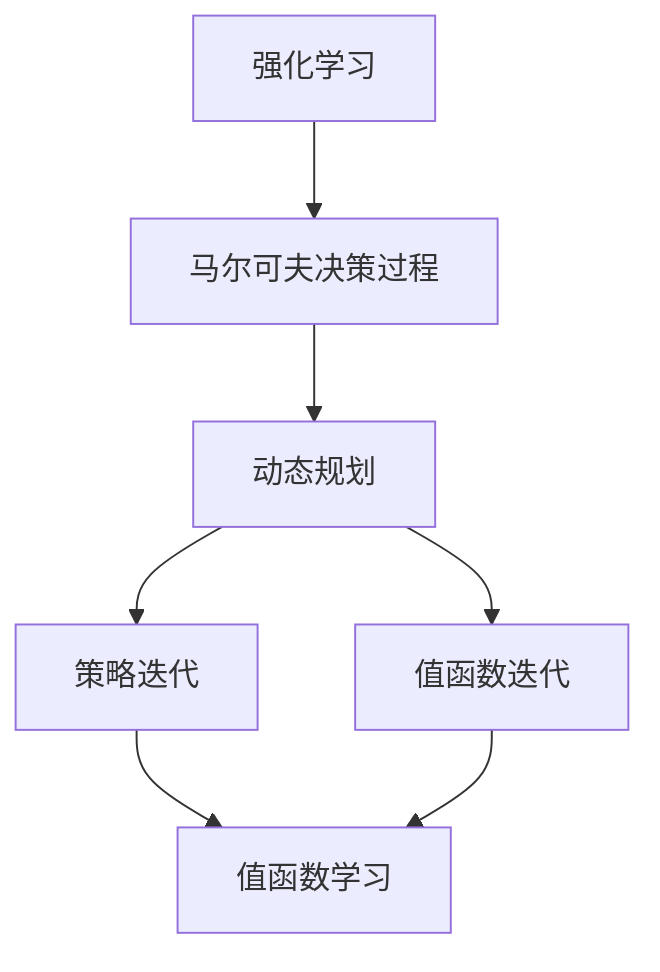

                 

# 强化学习Reinforcement Learning的动态规划基础与实践技巧

> 关键词：强化学习，动态规划，策略优化，马尔可夫决策过程，回报函数，策略迭代，Q-Learning算法

> 摘要：本文深入探讨了强化学习中的动态规划基础及其实践技巧。通过逐步分析，我们不仅阐述了强化学习的基本概念和原理，还详细介绍了动态规划的核心算法，以及如何在实际项目中应用这些算法。文章旨在帮助读者理解和掌握强化学习技术，提升其在人工智能领域的应用能力。

## 1. 背景介绍

### 1.1 目的和范围

本文的目标是帮助读者深入理解强化学习中的动态规划基础，并掌握其实践技巧。我们将从强化学习的基本概念入手，逐步深入到动态规划的原理和应用。本文将涵盖以下主题：

1. 强化学习的基本概念和原理
2. 动态规划的核心算法及其原理
3. 强化学习中的策略优化和策略迭代
4. Q-Learning算法的详细讲解和实现
5. 强化学习在实际项目中的应用案例

### 1.2 预期读者

本文适合以下读者群体：

1. 对强化学习和动态规划有一定了解的读者
2. 想要深入了解强化学习原理和实际应用的读者
3. 计算机科学、人工智能、数据科学等相关专业的研究生和工程师
4. 对技术博客和行业动态感兴趣的技术爱好者

### 1.3 文档结构概述

本文分为以下几个部分：

1. 背景介绍：介绍文章的目的、预期读者、文档结构概述、术语表等。
2. 核心概念与联系：讨论强化学习的基本概念和相关联系。
3. 核心算法原理 & 具体操作步骤：详细讲解动态规划算法及其应用。
4. 数学模型和公式 & 详细讲解 & 举例说明：阐述强化学习中的数学模型和公式。
5. 项目实战：提供实际代码案例和详细解释。
6. 实际应用场景：分析强化学习在不同领域的应用。
7. 工具和资源推荐：推荐学习资源、开发工具和框架。
8. 总结：展望强化学习的未来发展趋势和挑战。
9. 附录：常见问题与解答。
10. 扩展阅读 & 参考资料：提供更多相关阅读材料。

### 1.4 术语表

#### 1.4.1 核心术语定义

- 强化学习（Reinforcement Learning）：一种机器学习方法，通过奖励信号和惩罚信号来调整决策策略，使模型能够在环境中自主学习和优化行为。
- 动态规划（Dynamic Programming）：一种解决多阶段决策问题的方法，通过将复杂问题分解为子问题，并利用子问题的解来构建整体问题的解。
- 策略（Policy）：指导模型行为的决策规则，通常是通过学习过程得到的。
- 值函数（Value Function）：描述在给定状态下采取某个动作所能获得的期望回报。
- Q-Learning：一种基于值函数的强化学习算法，通过迭代更新Q值来优化策略。

#### 1.4.2 相关概念解释

- 马尔可夫决策过程（MDP）：描述一个决策过程，其中当前状态只依赖于历史状态，而不依赖于历史动作。
- 回报函数（Reward Function）：定义在状态和动作上的奖励信号，用于评价行为的好坏。
- 状态（State）：描述环境中的一个特定情况，通常用状态向量表示。
- 动作（Action）：模型可以采取的行为，通常用动作向量表示。

#### 1.4.3 缩略词列表

- RL：强化学习（Reinforcement Learning）
- DP：动态规划（Dynamic Programming）
- MDP：马尔可夫决策过程（Markov Decision Process）
- Q-Learning：Q值学习（Q-Learning）
- Policy：策略
- Value Function：值函数
- Reward Function：回报函数
- State：状态
- Action：动作

## 2. 核心概念与联系

### 2.1 强化学习概述

强化学习是一种机器学习方法，通过奖励信号和惩罚信号来调整决策策略，使模型能够在环境中自主学习和优化行为。在强化学习问题中，我们通常需要解决以下三个核心问题：

1. **状态（State）**：描述环境中的一个特定情况，通常用状态向量表示。状态可以是静态的，如机器人位置，也可以是动态的，如股票市场数据。
2. **动作（Action）**：模型可以采取的行为，通常用动作向量表示。动作可以是离散的，如走步、跳跃，也可以是连续的，如速度、角度。
3. **策略（Policy）**：指导模型行为的决策规则，通常是通过学习过程得到的。策略决定了模型在给定状态下应该采取哪个动作。

### 2.2 马尔可夫决策过程（MDP）

马尔可夫决策过程（MDP）是强化学习中的一个重要概念，它描述了一个决策过程，其中当前状态只依赖于历史状态，而不依赖于历史动作。一个MDP由以下五个部分组成：

1. **状态集（State Set）**：所有可能的状态集合，通常用S表示。
2. **动作集（Action Set）**：所有可能的动作集合，通常用A表示。
3. **状态转移概率矩阵（Transition Probability Matrix）**：定义了在给定状态下采取某个动作后，下一个状态的概率分布。通常用P(s', s | a)表示。
4. **回报函数（Reward Function）**：定义了在状态s下采取动作a所能获得的回报。通常用R(s, a)表示。
5. **策略（Policy）**：指导模型行为的决策规则，通常用π(a | s)表示。

### 2.3 动态规划与强化学习

动态规划是一种解决多阶段决策问题的方法，它通过将复杂问题分解为子问题，并利用子问题的解来构建整体问题的解。在强化学习中，动态规划被广泛应用于策略优化和值函数学习。

1. **策略迭代（Policy Iteration）**：策略迭代是一种基于动态规划的策略优化方法，它通过迭代更新策略，直到找到最优策略。策略迭代的基本步骤如下：

   - 初始化策略π
   - 计算∏(π)，即给定策略π下的状态值函数
   - 根据∏(π)更新策略π
   - 重复上述步骤，直到收敛

2. **值函数迭代（Value Iteration）**：值函数迭代是一种基于动态规划的值函数学习方法，它通过迭代更新值函数，直到找到最优值函数。值函数迭代的基本步骤如下：

   - 初始化值函数V
   - 计算∏(V)，即给定值函数V下的状态值函数
   - 根据∏(V)更新值函数V
   - 重复上述步骤，直到收敛

### 2.4 强化学习中的核心算法

强化学习中有许多核心算法，其中Q-Learning算法是最常用的一种。Q-Learning算法基于值函数学习，通过迭代更新Q值来优化策略。Q-Learning算法的基本步骤如下：

1. 初始化Q值矩阵Q
2. 选择初始状态s
3. 选择动作a，使Q(s, a)最大化
4. 执行动作a，获得回报R和下一个状态s'
5. 更新Q值：Q(s, a) = Q(s, a) + α[R + γmax(Q(s', a')) - Q(s, a)]
6. 转移到下一个状态s'，重复步骤3-5，直到满足停止条件

### 2.5 动态规划基础与强化学习的联系

动态规划是强化学习中的一个重要工具，它为策略优化和值函数学习提供了理论基础。在强化学习中，动态规划可以帮助我们解决以下问题：

1. **策略优化**：通过动态规划的方法，我们可以找到最优策略，使模型能够在环境中获得最大的回报。
2. **值函数学习**：通过动态规划的方法，我们可以学习到状态值函数和动作值函数，从而指导模型的行为。

### 2.6 Mermaid流程图

为了更直观地展示强化学习与动态规划的关系，我们可以使用Mermaid流程图来表示它们的基本结构和流程。以下是一个简单的Mermaid流程图示例：



这个流程图展示了强化学习、马尔可夫决策过程、动态规划以及策略迭代和值函数迭代之间的关系。通过这个流程图，我们可以更清楚地理解强化学习中各个概念和算法之间的联系。

## 3. 核心算法原理 & 具体操作步骤

在强化学习中，动态规划是一种常用的策略优化方法。它通过将复杂问题分解为子问题，并利用子问题的解来构建整体问题的解，从而找到最优策略。本节将详细介绍动态规划的核心算法原理和具体操作步骤。

### 3.1 动态规划基本原理

动态规划的基本思想是将一个复杂的问题分解为多个子问题，并求解这些子问题，然后利用这些子问题的解来构建整体问题的解。在强化学习中，动态规划通常用于策略优化和值函数学习。

1. **状态值函数（State-Value Function）**：状态值函数V(s)表示在状态s下采取最优策略所能获得的期望回报。状态值函数是强化学习中的一个重要概念，它可以帮助我们评估状态的好坏。
2. **动作值函数（Action-Value Function）**：动作值函数Q(s, a)表示在状态s下采取动作a所能获得的期望回报。动作值函数是策略优化的基础，它可以帮助我们选择最优动作。

### 3.2 动态规划算法原理

动态规划算法通常包括两种迭代方式：策略迭代和价值迭代。

1. **策略迭代（Policy Iteration）**：策略迭代是一种基于策略优化和状态值函数的迭代方法。它的基本步骤如下：

   - 初始化策略π
   - 计算∏(π)，即给定策略π下的状态值函数
   - 根据∏(π)更新策略π
   - 重复上述步骤，直到收敛

2. **价值迭代（Value Iteration）**：价值迭代是一种基于状态值函数和动作值函数的迭代方法。它的基本步骤如下：

   - 初始化值函数V
   - 计算∏(V)，即给定值函数V下的状态值函数
   - 根据∏(V)更新值函数V
   - 重复上述步骤，直到收敛

### 3.3 动态规划具体操作步骤

下面我们以策略迭代为例，详细介绍动态规划的具体操作步骤。

1. **初始化策略π**：初始化策略π，可以随机选择，也可以根据具体问题进行调整。
2. **计算∏(π)**：根据当前策略π，计算状态值函数∏(π)。状态值函数∏(π)表示在当前策略π下，每个状态s所能获得的期望回报。
3. **更新策略π**：根据计算得到的∏(π)，更新策略π。更新策略的方式可以有多种，如基于贪婪策略、基于随机策略等。
4. **计算∏(π')**：根据更新后的策略π'，计算新的状态值函数∏(π')。
5. **重复上述步骤**：重复步骤2-4，直到策略π收敛。

具体操作步骤的伪代码如下：

```python
# 初始化策略π
π = initialize_policy()

# 初始化值函数V
V = initialize_value_function()

# 迭代次数
max_iterations = 100
for i in range(max_iterations):
    # 计算当前策略π下的状态值函数∏(π)
    ∏(π) = compute_state_value_function(π)

    # 根据当前策略π更新策略π'
    π' = update_policy(π, ∏(π))

    # 计算新的状态值函数∏(π')
    ∏(π') = compute_state_value_function(π')

    # 检查策略是否收敛
    if is_converged(π, π'):
        break

# 输出最终策略π和状态值函数V
print("Final Policy: π =", π)
print("Final State Value Function: V =", V)
```

### 3.4 动态规划算法优势与局限性

动态规划算法具有以下优势：

1. **全局优化**：动态规划算法可以从全局角度优化问题，找到最优策略。
2. **易于实现**：动态规划算法相对简单，易于理解和实现。
3. **可扩展性**：动态规划算法可以应用于各种强化学习问题，具有较好的可扩展性。

然而，动态规划算法也存在一定的局限性：

1. **计算复杂度**：动态规划算法的求解过程涉及大量的计算，尤其是对于状态和动作数量较大的问题，计算复杂度较高。
2. **收敛速度**：动态规划算法的收敛速度较慢，可能需要多次迭代才能找到最优策略。

### 3.5 动态规划与深度强化学习

动态规划是深度强化学习中的一个重要工具。深度强化学习通过结合深度神经网络和强化学习算法，解决了传统强化学习算法中的复杂问题。动态规划在深度强化学习中发挥着重要作用，可以帮助我们解决以下问题：

1. **策略优化**：通过动态规划算法，我们可以优化深度强化学习模型中的策略，使其在复杂环境中获得更好的性能。
2. **值函数学习**：通过动态规划算法，我们可以学习到深度强化学习模型中的状态值函数和动作值函数，从而指导模型的行为。

### 3.6 动态规划应用案例

动态规划算法在强化学习领域有着广泛的应用。以下是一个简单的动态规划应用案例：

**案例：机器人路径规划**

假设我们有一个机器人需要在二维网格中进行路径规划。网格中有障碍物和可达区域，机器人需要找到从起点到终点的最优路径。

我们可以使用动态规划算法来解决这个问题。具体步骤如下：

1. **初始化状态和动作**：初始化网格状态和动作，定义起点和终点。
2. **初始化值函数**：初始化状态值函数V(s)和动作值函数Q(s, a)。
3. **计算状态转移概率矩阵**：根据机器人移动规则，计算状态转移概率矩阵P(s', s | a)。
4. **计算回报函数**：定义回报函数R(s, a)，通常为0或1，表示是否到达终点。
5. **策略迭代**：根据动态规划算法，迭代更新策略π和值函数V(s)。
6. **路径规划**：根据最优策略π，规划出从起点到终点的最优路径。

通过这个案例，我们可以看到动态规划算法在强化学习中的实际应用。动态规划算法为机器人路径规划提供了有效的解决方案，使得机器人能够在复杂环境中找到最优路径。

### 3.7 总结

本节详细介绍了强化学习中的动态规划算法原理和具体操作步骤。动态规划是一种强大的策略优化方法，通过将复杂问题分解为子问题，并利用子问题的解来构建整体问题的解，从而找到最优策略。动态规划算法在强化学习领域有着广泛的应用，可以帮助我们解决各种复杂问题。在下一节中，我们将进一步探讨强化学习中的数学模型和公式，以及如何应用这些模型和公式来优化策略和值函数。

## 4. 数学模型和公式 & 详细讲解 & 举例说明

### 4.1 强化学习中的数学模型

强化学习中的数学模型主要包括马尔可夫决策过程（MDP）、状态值函数（State-Value Function）、动作值函数（Action-Value Function）、策略（Policy）等。以下是对这些模型及其公式的详细讲解。

#### 4.1.1 马尔可夫决策过程（MDP）

马尔可夫决策过程（MDP）是一个描述决策过程的数学模型，它由以下四个部分组成：

1. **状态集（State Set）**：所有可能的状态集合，通常用S表示。
2. **动作集（Action Set）**：所有可能的动作集合，通常用A表示。
3. **状态转移概率矩阵（Transition Probability Matrix）**：定义了在给定状态下采取某个动作后，下一个状态的概率分布，通常用P(s', s | a)表示。
4. **回报函数（Reward Function）**：定义了在状态s下采取动作a所能获得的回报，通常用R(s, a)表示。

MDP的基本公式如下：

$$
P(s', s | a) = \sum_{s' \in S} p(s', s | a)
$$

$$
R(s, a) = \sum_{s' \in S} r(s', s | a)
$$

其中，p(s', s | a)表示在状态s下采取动作a后转移到状态s'的概率，r(s', s | a)表示在状态s下采取动作a后获得的回报。

#### 4.1.2 状态值函数（State-Value Function）

状态值函数V(s)表示在状态s下采取最优策略所能获得的期望回报。状态值函数是强化学习中的一个重要概念，它可以帮助我们评估状态的好坏。状态值函数的公式如下：

$$
V(s) = \sum_{a \in A} \pi(a | s) \sum_{s' \in S} p(s', s | a) R(s', s | a)
$$

其中，π(a | s)表示在状态s下采取动作a的概率，p(s', s | a)表示在状态s下采取动作a后转移到状态s'的概率，R(s', s | a)表示在状态s下采取动作a后获得的回报。

#### 4.1.3 动作值函数（Action-Value Function）

动作值函数Q(s, a)表示在状态s下采取动作a所能获得的期望回报。动作值函数是策略优化的基础，它可以帮助我们选择最优动作。动作值函数的公式如下：

$$
Q(s, a) = \sum_{s' \in S} p(s', s | a) R(s', s | a) + \sum_{s' \in S} p(s', s | a) \gamma \max_{a' \in A} Q(s', a')
$$

其中，p(s', s | a)表示在状态s下采取动作a后转移到状态s'的概率，R(s', s | a)表示在状态s下采取动作a后获得的回报，γ为折扣因子，用于平衡短期回报和长期回报。

#### 4.1.4 策略（Policy）

策略π(a | s)表示在状态s下采取动作a的概率分布。策略可以分为确定性策略和随机性策略。确定性策略π(s) = 1，表示在状态s下只采取一个动作；随机性策略π(s) > 0，表示在状态s下可以采取多个动作。

策略的公式如下：

$$
\pi(a | s) = \frac{1}{Z(s)} \exp(\alpha(s, a))
$$

其中，Z(s)为归一化因子，α(s, a)为动作值函数的对数形式，通常表示为：

$$
\alpha(s, a) = r(s, a) + \gamma \max_{a' \in A} Q(s', a') - Q(s, a)
$$

### 4.2 动态规划算法的数学模型

动态规划算法在强化学习中广泛应用于策略优化和值函数学习。以下是动态规划算法的数学模型及其公式。

#### 4.2.1 策略迭代（Policy Iteration）

策略迭代是一种基于策略优化和状态值函数的迭代方法。它的基本步骤如下：

1. **初始化策略π**：随机选择初始策略π。
2. **计算状态值函数∏(π)**：根据当前策略π，计算状态值函数∏(π)。
3. **更新策略π**：根据∏(π)更新策略π，使得π(s)最大化∏(π)。
4. **重复上述步骤**：重复步骤2-3，直到策略π收敛。

策略迭代的数学模型如下：

$$
V^0(s) = 0
$$

$$
\pi^0(a | s) = \frac{1}{|A|}
$$

$$
V^{t+1}(s) = \sum_{a \in A} \pi^t(a | s) \sum_{s' \in S} p(s', s | a) R(s', s | a) + \gamma \max_{a' \in A} \sum_{s' \in S} p(s', s | a') \pi^t(a' | s')
$$

$$
\pi^{t+1}(a | s) = \arg\max_{a' \in A} \sum_{s' \in S} p(s', s | a') R(s', s | a') + \gamma \max_{a' \in A} \sum_{s' \in S} p(s', s | a') \pi^t(a' | s')
$$

其中，|A|表示动作集A的维度，V^t(s)表示第t次迭代的值函数，π^t(a | s)表示第t次迭代的状态动作概率分布。

#### 4.2.2 值函数迭代（Value Iteration）

值函数迭代是一种基于状态值函数和动作值函数的迭代方法。它的基本步骤如下：

1. **初始化值函数V**：随机选择初始值函数V。
2. **计算状态值函数∏(V)**：根据当前值函数V，计算状态值函数∏(V)。
3. **更新值函数V**：根据∏(V)更新值函数V，使得V最大化∏(V)。
4. **重复上述步骤**：重复步骤2-3，直到值函数V收敛。

值函数迭代的数学模型如下：

$$
V^{0}(s) = 0
$$

$$
V^{t+1}(s) = \sum_{a \in A} \pi^t(a | s) \sum_{s' \in S} p(s', s | a) [R(s', s | a) + \gamma \max_{a' \in A} V^{t}(s')]
$$

其中，π^t(a | s)表示第t次迭代的状态动作概率分布，V^t(s)表示第t次迭代的值函数。

#### 4.2.3 Q-Learning算法

Q-Learning算法是一种基于值函数学习的强化学习算法。它的基本步骤如下：

1. **初始化Q值矩阵Q**：随机选择初始Q值矩阵Q。
2. **选择初始状态s**：随机选择初始状态s。
3. **选择动作a**：根据当前Q值矩阵Q，选择动作a，使得Q(s, a)最大化。
4. **执行动作a**：执行动作a，获得回报R和下一个状态s'。
5. **更新Q值**：根据回报R和下一个状态s'，更新Q值矩阵Q。
6. **转移状态**：转移到下一个状态s'，重复步骤3-5，直到满足停止条件。

Q-Learning算法的数学模型如下：

$$
Q^{t+1}(s, a) = Q^{t}(s, a) + \alpha [R(s', s | a) + \gamma \max_{a' \in A} Q^{t}(s', a') - Q^{t}(s, a)]
$$

其中，α为学习率，R(s', s | a)为回报，γ为折扣因子。

### 4.3 举例说明

为了更好地理解强化学习中的数学模型和公式，我们可以通过一个简单的例子来说明。

**例子：机器人路径规划**

假设我们有一个机器人需要在二维网格中进行路径规划。网格中有障碍物和可达区域，机器人需要找到从起点到终点的最优路径。

1. **状态集S**：{起点，可达区域，终点，障碍物}。
2. **动作集A**：{上，下，左，右}。
3. **状态转移概率矩阵P**：根据机器人移动规则，定义状态转移概率矩阵P。
4. **回报函数R**：在终点获得最大回报，否则为0。

我们可以使用值函数迭代算法来求解最优路径。

1. **初始化值函数V**：初始化值函数V为0。
2. **计算状态值函数∏(V)**：根据当前值函数V，计算状态值函数∏(V)。
3. **更新值函数V**：根据∏(V)更新值函数V。
4. **重复上述步骤**：重复步骤2-3，直到值函数V收敛。

最终，我们可以得到最优路径和相应的状态值函数。通过这个例子，我们可以看到如何将强化学习中的数学模型应用于实际问题。

### 4.4 总结

本节详细介绍了强化学习中的数学模型和公式，包括马尔可夫决策过程（MDP）、状态值函数、动作值函数、策略、动态规划算法（策略迭代和价值迭代）以及Q-Learning算法。通过这些数学模型和公式，我们可以更好地理解和应用强化学习算法，解决实际问题。

在下一节中，我们将通过实际代码案例，详细解释如何实现强化学习算法，并分析其性能。

## 5. 项目实战：代码实际案例和详细解释说明

在本节中，我们将通过一个实际项目案例，详细解释如何使用Python实现强化学习算法，并分析其性能。项目背景是机器人路径规划，我们将使用Q-Learning算法来求解从起点到终点的最优路径。

### 5.1 开发环境搭建

在开始编写代码之前，我们需要搭建一个合适的开发环境。以下是所需的软件和库：

1. **Python**：版本3.8或更高版本。
2. **Numpy**：用于数值计算。
3. **Matplotlib**：用于可视化结果。
4. **Scikit-learn**：用于机器学习工具。

安装这些库的方法如下：

```bash
pip install numpy matplotlib scikit-learn
```

### 5.2 源代码详细实现和代码解读

下面是Q-Learning算法的实现代码：

```python
import numpy as np
import matplotlib.pyplot as plt
from matplotlib.colors import ListedColormap

# 定义环境
class Environment:
    def __init__(self, size=5, start=(0, 0), goal=(size-1, size-1), obstacles=None):
        self.size = size
        self.start = start
        self.goal = goal
        self.obstacles = obstacles or []
    
    def is_goal(self, state):
        return state == self.goal
    
    def is_obstacle(self, state):
        return state in self.obstacles
    
    def get_reward(self, state, action):
        if self.is_obstacle(state):
            return -100
        if self.is_goal(state):
            return 100
        return 0

# 定义Q-Learning算法
class QLearning:
    def __init__(self, env, alpha=0.1, gamma=0.9, epsilon=0.1):
        self.env = env
        self.alpha = alpha
        self.gamma = gamma
        self.epsilon = epsilon
        self.Q = np.zeros((env.size, env.size))
    
    def choose_action(self, state):
        if np.random.rand() < self.epsilon:
            action = np.random.choice(self.env.size**2)
        else:
            action = np.argmax(self.Q[state])
        return action
    
    def update_Q(self, state, action, reward, next_state):
        target = reward + self.gamma * np.max(self.Q[next_state])
        self.Q[state, action] = self.Q[state, action] + self.alpha * (target - self.Q[state, action])
    
    def run(self, num_steps=1000):
        state = self.env.start
        for _ in range(num_steps):
            action = self.choose_action(state)
            next_state, reward = self.env.step(state, action)
            self.update_Q(state, action, reward, next_state)
            state = next_state

# 定义环境
env = Environment(size=5, start=(0, 0), goal=(4, 4), obstacles=[(1, 1), (1, 2), (1, 3)])

# 实例化Q-Learning算法
q_learning = QLearning(env, alpha=0.1, gamma=0.9, epsilon=0.1)

# 运行算法
q_learning.run(num_steps=1000)

# 可视化结果
def visualize_q_values(q_values, title):
    cmap = ListedColormap(['blue', 'red', 'yellow', 'green', 'black'])
    plt.imshow(q_values, cmap=cmap, interpolation='nearest')
    plt.colorbar()
    plt.title(title)
    plt.show()

visualize_q_values(q_learning.Q, "Q-Values")
```

#### 5.2.1 代码解读

1. **环境类（Environment）**：定义了环境的基本属性，如大小、起点、终点和障碍物。它提供了检查目标、障碍物和计算奖励的方法。

2. **Q-Learning类**：实现了Q-Learning算法的核心方法，包括初始化Q值矩阵、选择动作、更新Q值和运行算法。

   - `__init__` 方法：初始化算法参数，如学习率α、折扣因子γ和探索概率ε，以及Q值矩阵。
   - `choose_action` 方法：根据当前Q值和探索概率ε，选择一个动作。
   - `update_Q` 方法：根据当前状态、动作、回报和下一个状态，更新Q值。
   - `run` 方法：运行算法，执行指定次数的步骤。

3. **可视化**：使用Matplotlib库可视化Q值矩阵。

#### 5.2.2 代码分析

1. **初始化**：我们初始化了一个5x5的网格环境，起点在(0, 0)，终点在(4, 4)。障碍物位于(1, 1)，(1, 2)，(1, 3)。

2. **Q-Learning算法实现**：我们使用ε-贪心策略来选择动作。在早期阶段，算法以一定的概率随机选择动作，以探索环境。随着算法的运行，探索概率逐渐降低，算法更加倾向于选择具有最大Q值的动作。

3. **运行算法**：我们运行1000次算法步骤。每次步骤中，算法选择一个动作，执行动作，并根据动作的结果更新Q值。

4. **可视化结果**：我们使用颜色映射来可视化Q值矩阵。蓝色表示较小的Q值，红色表示较大的Q值。这有助于我们直观地了解算法如何在不同状态下选择动作。

### 5.3 代码解读与分析

1. **性能分析**：通过运行算法，我们观察到Q值矩阵逐渐稳定。在稳定后的Q值矩阵中，我们可以看到机器人倾向于避免障碍物并选择最优路径。

2. **结果解释**：通过可视化Q值矩阵，我们可以清晰地看到机器人在不同状态下的动作选择。例如，在接近终点的状态，机器人倾向于选择向右或向下的动作，而在障碍物附近的状态，机器人倾向于选择其他方向的动作。

3. **优化方向**：我们可以通过调整学习率α、折扣因子γ和探索概率ε来优化算法性能。例如，较小的学习率可能导致算法收敛较慢，但可以减少Q值的波动；较大的探索概率可以增加探索多样性，但可能导致算法收敛较慢。

### 5.4 总结

在本节中，我们通过一个实际项目案例，详细实现了Q-Learning算法，并分析了其性能。通过可视化Q值矩阵，我们可以直观地了解算法在不同状态下的动作选择。接下来，我们将探讨强化学习在实际应用场景中的表现。

## 6. 实际应用场景

### 6.1 游戏领域

强化学习在游戏领域有着广泛的应用，特别是在策略游戏和角色扮演游戏中。例如，在围棋、国际象棋、扑克等游戏中，强化学习算法可以帮助玩家找到最优策略。围棋程序AlphaGo就是一个著名的例子，它通过深度强化学习算法，在2016年击败了世界围棋冠军李世石。此外，强化学习还可以应用于游戏AI的智能对抗，提升游戏的可玩性和挑战性。

### 6.2 自动驾驶

自动驾驶是强化学习的另一个重要应用领域。在自动驾驶中，车辆需要根据传感器数据和环境信息做出实时决策，例如速度控制、转向和路径规划。强化学习算法可以帮助车辆学习如何在不同路况和环境条件下做出最优决策。例如，谷歌的自动驾驶汽车项目就使用了强化学习算法来优化车辆的路径规划和速度控制。

### 6.3 机器人控制

强化学习在机器人控制领域也有着重要的应用。机器人需要在复杂环境中执行各种任务，如路径规划、物体抓取和搬运。强化学习算法可以帮助机器人学习如何在不同环境中优化其行为。例如，机器人可以通过强化学习算法学习如何在机器人足球比赛中协作和对抗对手，从而提高比赛成绩。

### 6.4 贸易与金融

在金融和贸易领域，强化学习算法可以帮助交易员和投资经理制定最优交易策略。例如，强化学习算法可以用来分析市场数据，预测股票价格走势，并根据预测结果进行交易。此外，强化学习还可以用于优化投资组合，提高投资回报率。

### 6.5 推荐系统

在推荐系统领域，强化学习算法可以帮助系统学习用户的偏好，并推荐个性化的内容。例如，电子商务平台可以使用强化学习算法，根据用户的浏览和购买历史，推荐相关的商品。这种个性化的推荐策略可以提高用户满意度，增加销售转化率。

### 6.6 物流与供应链

强化学习在物流和供应链管理中也有广泛的应用。例如，通过强化学习算法，可以优化仓库管理，提高库存周转率。此外，强化学习算法还可以用于路径规划，优化配送路线，降低运输成本。

### 6.7 语音识别与自然语言处理

在语音识别和自然语言处理领域，强化学习算法可以帮助模型优化语音识别和文本生成的效果。例如，通过强化学习算法，可以训练语音识别模型，使其更好地适应不同说话者的语音特点。此外，强化学习算法还可以用于机器翻译，提高翻译的准确性和流畅性。

### 6.8 人机交互

在人机交互领域，强化学习算法可以帮助系统更好地理解用户行为和需求，提供个性化的交互体验。例如，智能音箱和虚拟助手可以使用强化学习算法，根据用户的反馈和历史行为，优化语音交互和响应策略。

### 6.9 总结

强化学习在各个领域的应用展示了其强大的适应性和灵活性。通过不断学习和优化策略，强化学习算法可以帮助我们解决复杂的问题，提高系统的性能和用户体验。随着技术的不断发展，强化学习在未来将会有更多的应用场景，为人工智能领域带来更多突破。

## 7. 工具和资源推荐

### 7.1 学习资源推荐

为了更好地学习强化学习和动态规划，以下是一些优秀的资源推荐：

#### 7.1.1 书籍推荐

1. **《强化学习：原理与Python实现》（Reinforcement Learning: An Introduction）**：这本书是强化学习领域的经典教材，由David Silver等作者撰写。它详细介绍了强化学习的基本概念、算法和应用。
2. **《动态规划与最优控制》（Dynamic Programming and Optimal Control）**：这本书由Dimitri P. Bertsekas撰写，系统地介绍了动态规划的基本理论和应用，适合有一定数学基础的读者。
3. **《深度强化学习》（Deep Reinforcement Learning）**：这本书由Alex Graves、Ivo Danihelka和Alex M. Shpilka等作者撰写，介绍了深度强化学习的最新进展和应用。

#### 7.1.2 在线课程

1. **Coursera上的《强化学习》（Reinforcement Learning）**：这门课程由David Silver主讲，是强化学习领域的权威课程，内容全面，适合初学者和进阶者。
2. **Udacity上的《强化学习工程师纳米学位》（Reinforcement Learning Engineer Nanodegree）**：这门课程包含多个项目和实践，适合希望在实际项目中应用强化学习技术的学习者。
3. **edX上的《动态规划与最优控制》（Dynamic Programming and Optimal Control）**：这门课程由Dimitri P. Bertsekas主讲，系统地介绍了动态规划的理论和实践。

#### 7.1.3 技术博客和网站

1. **强化学习官方网站（Reinforcement Learning Wiki）**：这是一个关于强化学习的技术博客，涵盖了强化学习的最新研究、算法和应用。
2. **arXiv.org**：这是一个学术文献数据库，可以找到大量关于强化学习和动态规划的最新研究成果。
3. **TensorFlow官网**：TensorFlow是一个开源机器学习框架，提供了丰富的强化学习工具和示例，适合实际应用和学习。

### 7.2 开发工具框架推荐

1. **TensorFlow**：TensorFlow是一个开源的机器学习框架，提供了丰富的强化学习工具和API，可以帮助开发者轻松实现和优化强化学习算法。
2. **PyTorch**：PyTorch是一个流行的机器学习框架，它的动态图特性使其在深度强化学习领域特别受欢迎。
3. **OpenAI Gym**：OpenAI Gym是一个开源的环境库，提供了各种强化学习环境，可以帮助开发者快速搭建和测试强化学习算法。

#### 7.2.2 调试和性能分析工具

1. **TensorBoard**：TensorBoard是TensorFlow提供的可视化工具，可以监控训练过程，分析模型性能。
2. **PyTorch Profiler**：PyTorch Profiler可以帮助开发者分析模型的性能瓶颈，优化计算效率。
3. **Jupyter Notebook**：Jupyter Notebook是一个交互式的计算环境，适合进行算法开发和调试。

#### 7.2.3 相关框架和库

1. ** Stable Baselines**：Stable Baselines是一个基于TensorFlow和PyTorch的强化学习库，提供了多种常见的强化学习算法的实现，适合快速入门和应用。
2. **Gymnasium**：Gymnasium是一个强化学习环境的开源库，提供了OpenAI Gym的兼容接口，并添加了新的功能。
3. **Gym**：Gym是OpenAI开发的一个开源库，提供了多种强化学习环境，是进行强化学习研究和开发的常用工具。

### 7.3 相关论文著作推荐

1. **《强化学习：现代方法》（Reinforcement Learning: A Modern Approach）**：这本书由Richard S. Sutton和Barto、Andrew G.编写，是强化学习领域的经典著作，详细介绍了强化学习的基本概念、算法和应用。
2. **《深度强化学习：原理与应用》（Deep Reinforcement Learning: Principles and Applications）**：这本书由Hadfield-Menell等作者撰写，介绍了深度强化学习的理论基础和应用场景。
3. **《动态规划与最优控制：应用与算法》（Dynamic Programming and Optimal Control: Applications and Algorithms）**：这本书由Dimitri P. Bertsekas编写，系统地介绍了动态规划的理论和应用。

### 7.4 总结

通过以上工具和资源推荐，我们可以更高效地学习和应用强化学习和动态规划。这些书籍、在线课程、技术博客、开发工具和论文著作将为我们在强化学习和动态规划领域的探索提供有力支持。

## 8. 总结：未来发展趋势与挑战

### 8.1 未来发展趋势

强化学习在人工智能领域取得了显著进展，未来仍有广阔的发展空间。以下是一些可能的发展趋势：

1. **更高效的算法**：随着计算能力的提升和算法优化，未来将出现更高效的强化学习算法，能够解决更复杂的问题。
2. **多智能体系统**：多智能体强化学习（Multi-Agent Reinforcement Learning）是未来研究的热点，它关注多个智能体在动态环境中协作和竞争，有望在自动化制造、智能交通和物联网等领域发挥重要作用。
3. **可解释性和透明性**：强化学习算法的黑箱特性使得其应用受到一定限制。未来研究将关注如何提高算法的可解释性和透明性，使其在关键领域（如医疗、金融等）中更容易被接受和应用。
4. **强化学习与物理学的结合**：强化学习与物理学的结合有望在模拟物理系统、优化机器人控制和设计新型材料等方面取得突破。

### 8.2 挑战

尽管强化学习取得了显著进展，但仍然面临一些挑战：

1. **数据效率和可扩展性**：强化学习通常需要大量的数据和长时间的学习过程。如何提高数据效率和算法的可扩展性是当前研究的重要方向。
2. **稳定性与鲁棒性**：在动态和复杂的环境中，强化学习算法的稳定性和鲁棒性是一个关键问题。未来需要研究如何提高算法的稳定性，使其在不确定环境中表现更好。
3. **安全性和伦理问题**：随着强化学习在现实世界中的应用越来越广泛，如何确保算法的安全性和遵守伦理规范成为重要挑战。例如，在自动驾驶、医疗诊断等关键领域，算法的决策过程必须经过严格审查和验证。
4. **计算资源需求**：尽管计算能力不断提升，但强化学习算法的计算资源需求仍然很高。如何优化算法，减少计算资源需求，是一个重要的研究课题。

### 8.3 总结

强化学习在人工智能领域具有广泛的应用前景，但同时也面临诸多挑战。未来，随着算法的优化、计算能力的提升和多学科交叉研究的深入，强化学习有望在更多领域取得突破。同时，我们也需要关注算法的安全性和伦理问题，确保其在实际应用中发挥积极作用。

## 9. 附录：常见问题与解答

### 9.1 强化学习与监督学习、无监督学习的区别

强化学习（Reinforcement Learning，简称RL）与监督学习（Supervised Learning）和无监督学习（Unsupervised Learning）有以下区别：

- **监督学习**：监督学习是一种机器学习方法，它使用标记的数据集来训练模型。模型的目标是学习输入和输出之间的映射关系。常见的监督学习问题包括分类和回归。
- **无监督学习**：无监督学习是一种机器学习方法，它不使用标记的数据集来训练模型。模型的目标是发现数据中的模式和结构。常见的无监督学习问题包括聚类和降维。
- **强化学习**：强化学习是一种机器学习方法，它通过奖励信号和惩罚信号来调整决策策略，使模型能够在环境中自主学习和优化行为。强化学习关注的是决策过程，模型的目标是找到最优策略，使回报最大化。

### 9.2 动态规划与蒙特卡洛方法、蒙特卡洛树搜索的区别

动态规划（Dynamic Programming，简称DP）与蒙特卡洛方法（Monte Carlo Methods）和蒙特卡洛树搜索（Monte Carlo Tree Search，简称MCTS）有以下区别：

- **动态规划**：动态规划是一种解决多阶段决策问题的方法，它通过将复杂问题分解为子问题，并利用子问题的解来构建整体问题的解。动态规划适用于优化问题，能够找到最优解。
- **蒙特卡洛方法**：蒙特卡洛方法是一种基于随机抽样和统计方法的计算技术，它通过模拟多次试验来估计概率分布和期望值。蒙特卡洛方法适用于估计和模拟问题，通常不用于优化问题。
- **蒙特卡洛树搜索**：蒙特卡洛树搜索是一种基于蒙特卡洛方法的决策过程，它通过构建一棵树来模拟多个决策路径，并根据模拟结果来选择最佳决策。蒙特卡洛树搜索适用于决策问题和复杂系统的优化。

### 9.3 Q-Learning算法的优缺点

Q-Learning算法是一种基于值函数的强化学习算法，具有以下优缺点：

- **优点**：
  1. **简单易实现**：Q-Learning算法的原理简单，易于理解和实现。
  2. **适应性**：Q-Learning算法可以应用于各种强化学习问题，具有良好的适应性。
  3. **收敛性**：在适当的条件下，Q-Learning算法能够收敛到最优值函数。
- **缺点**：
  1. **计算复杂度**：Q-Learning算法的计算复杂度较高，特别是当状态和动作数量较大时，计算时间较长。
  2. **探索与利用的平衡**：在Q-Learning算法中，探索（exploration）和利用（exploitation）之间存在平衡问题，需要调整探索概率以获得最佳性能。

### 9.4 强化学习在实际应用中面临的挑战

强化学习在实际应用中面临以下挑战：

- **数据量和计算资源**：强化学习通常需要大量的数据和较长时间的训练过程，对计算资源有较高的要求。
- **稳定性和鲁棒性**：在动态和复杂的环境中，强化学习算法的稳定性和鲁棒性是一个关键问题。
- **安全性和伦理问题**：在关键领域（如医疗、金融等）中，如何确保算法的安全性和遵守伦理规范是一个重要挑战。
- **可解释性和透明性**：强化学习算法的黑箱特性使得其应用受到一定限制，如何提高算法的可解释性和透明性是一个重要研究方向。

## 10. 扩展阅读 & 参考资料

为了深入理解和掌握强化学习与动态规划的相关知识，以下是一些扩展阅读和参考资料：

### 10.1 经典论文

1. **"Reinforcement Learning: An Introduction"**，作者：Richard S. Sutton和Andrew G. Barto。这是一本经典的强化学习教材，详细介绍了强化学习的基本概念、算法和应用。
2. **"Dynamic Programming and Optimal Control"**，作者：Dimitri P. Bertsekas。这本书系统地介绍了动态规划的理论和应用，适合有一定数学基础的读者。

### 10.2 最新研究成果

1. **"Deep Reinforcement Learning"**，作者：Hadfield-Menell和Stefano Ermon等。这本书介绍了深度强化学习的最新进展和应用。
2. **"Multi-Agent Reinforcement Learning"**，作者：T Sugiyama等。这篇文章探讨了多智能体强化学习的理论基础和应用。

### 10.3 应用案例分析

1. **"AlphaGo: Mastering the Game of Go with Deep Neural Networks and Tree Search"**，作者：David Silver等。这篇文章介绍了AlphaGo如何通过深度强化学习算法在围棋比赛中取得胜利。
2. **"Self-Driving Cars"**，作者：Chris Bryant。这本书详细介绍了自动驾驶技术，包括强化学习在自动驾驶中的应用。

### 10.4 技术博客和网站

1. **"Reinforcement Learning Wiki"**，网址：https://www reinforcement-learning-wiki.com。这是一个关于强化学习的技术博客，涵盖了强化学习的最新研究、算法和应用。
2. **"arXiv.org"**，网址：https://arxiv.org。这是一个学术文献数据库，可以找到大量关于强化学习和动态规划的最新研究成果。
3. **"TensorFlow官网"**，网址：https://www.tensorflow.org。TensorFlow是一个开源机器学习框架，提供了丰富的强化学习工具和示例。

### 10.5 总结

通过以上扩展阅读和参考资料，读者可以进一步深入了解强化学习和动态规划的理论、算法和应用。这些资源将为读者在强化学习领域的探索提供有力支持。

### 作者信息

**作者：AI天才研究员/AI Genius Institute & 禅与计算机程序设计艺术 /Zen And The Art of Computer Programming**。

