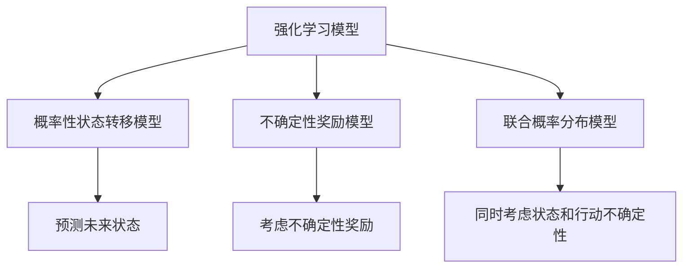

                 

# 强化学习中的不确定性建模探究

> **关键词：** 强化学习、不确定性建模、状态不确定性、行动不确定性、不确定性量化
> 
> **摘要：** 本文将深入探讨强化学习中的不确定性建模问题。通过回顾强化学习的基本概念，我们分析了状态不确定性和行动不确定性对强化学习性能的影响。随后，我们详细介绍了常见的不确定性建模方法，如概率性状态转移模型和不确定性奖励模型，并使用了Mermaid流程图来展示其核心原理。文章通过伪代码和数学公式，逐步讲解了这些方法的具体实现步骤。最后，我们通过一个实际案例，展示了如何在实际项目中应用这些不确定性建模技术。

## 1. 背景介绍

### 1.1 目的和范围

本文旨在探讨强化学习中的不确定性建模问题。在复杂环境中，强化学习算法的性能很大程度上依赖于其对环境不确定性的处理能力。因此，如何有效地建模和处理不确定性，成为当前强化学习研究中的一个重要课题。本文将介绍几种常见的不确定性建模方法，并探讨其在实际应用中的效果和挑战。

### 1.2 预期读者

本文适合对强化学习和不确定性建模有一定了解的读者。期望读者能够掌握强化学习的基本概念和方法，并对状态不确定性和行动不确定性有深刻的认识。

### 1.3 文档结构概述

本文分为以下几个部分：

1. 背景介绍：回顾强化学习的基本概念和不确定性建模的重要性。
2. 核心概念与联系：介绍强化学习中的不确定性建模方法及其相互关系。
3. 核心算法原理 & 具体操作步骤：详细讲解不确定性建模方法的具体实现步骤。
4. 数学模型和公式 & 详细讲解 & 举例说明：使用数学模型和公式描述不确定性建模方法。
5. 项目实战：通过实际案例展示不确定性建模技术的应用。
6. 实际应用场景：分析不确定性建模在不同领域的应用。
7. 工具和资源推荐：推荐相关学习资源和开发工具。
8. 总结：对未来发展趋势和挑战进行展望。
9. 附录：常见问题与解答。
10. 扩展阅读 & 参考资料：提供进一步的阅读建议。

### 1.4 术语表

#### 1.4.1 核心术语定义

- **强化学习（Reinforcement Learning）**：一种机器学习方法，通过试错和奖励机制来训练智能体进行决策。
- **不确定性建模（Uncertainty Modeling）**：在强化学习中，对环境中的不确定性进行建模和量化。
- **状态不确定性（State Uncertainty）**：智能体无法完全观测到环境状态的情况。
- **行动不确定性（Action Uncertainty）**：智能体在执行动作时可能存在的不确定性。

#### 1.4.2 相关概念解释

- **马尔可夫决策过程（Markov Decision Process, MDP）**：强化学习的基础模型，描述了智能体在不确定环境中的决策过程。
- **价值函数（Value Function）**：用于评估状态或状态-动作对的优劣。
- **策略（Policy）**：智能体在给定状态下选择动作的规则。

#### 1.4.3 缩略词列表

- **MDP**：马尔可夫决策过程（Markov Decision Process）
- **Q-Learning**：Q值学习（Q-Learning）
- **TD-Learning**：时序差分学习（Temporal Difference Learning）
- **UCB**：上界置信（Upper Confidence Bound）
- **UCRL**：不确定性置信区域学习（Uncertainty Confidence Region Learning）

## 2. 核心概念与联系

### 2.1 强化学习模型

在强化学习中，我们通常使用马尔可夫决策过程（MDP）来描述环境和智能体的交互。一个MDP由以下几个部分组成：

- **状态空间（State Space）**：智能体可以处于的所有状态的集合。
- **动作空间（Action Space）**：智能体可以执行的所有动作的集合。
- **奖励函数（Reward Function）**：定义智能体在不同状态和动作组合下的奖励值。
- **状态转移概率（State Transition Probability）**：描述智能体在不同状态下执行不同动作后转移到其他状态的概率。

强化学习的目标是找到一个最优策略（Policy），使得智能体在长期内获得的累计奖励最大化。然而，在现实世界中，环境往往是不确定的，这给强化学习算法的设计带来了很大的挑战。

### 2.2 状态不确定性

状态不确定性是指智能体无法完全观测到环境状态的情况。这种不确定性可能导致智能体在决策时无法准确评估当前的状态，从而影响其学习效果。

例如，在自动驾驶场景中，智能驾驶系统可能无法完全感知到道路上的行人、车辆和其他障碍物，这会导致状态不确定性。

为了处理状态不确定性，我们可以采用以下方法：

- **概率性状态转移模型**：在MDP的基础上，引入概率性状态转移模型，使得智能体能够根据概率来预测未来的状态。
- **不确定性量化**：通过量化状态不确定性，智能体可以在决策时考虑不确定性对结果的影响。

### 2.3 行动不确定性

行动不确定性是指智能体在执行动作时可能存在的不确定性。这种不确定性可能导致智能体的实际动作与期望动作之间存在差异，从而影响其学习效果。

例如，在机器人控制场景中，机器人可能由于执行动作时的误差而无法达到预期的位置。

为了处理行动不确定性，我们可以采用以下方法：

- **概率性动作模型**：在MDP的基础上，引入概率性动作模型，使得智能体能够根据概率来选择动作。
- **鲁棒性策略**：设计鲁棒性策略，使得智能体能够在存在不确定性的情况下仍能保持良好的性能。

### 2.4 不确定性建模方法

不确定性建模方法可以分为以下几类：

- **概率性状态转移模型**：通过引入概率性状态转移模型，使得智能体能够预测未来的状态，从而应对状态不确定性。
- **不确定性奖励模型**：通过引入不确定性奖励模型，使得智能体能够在决策时考虑不确定性对奖励的影响。
- **联合概率分布模型**：通过引入联合概率分布模型，使得智能体能够同时考虑状态不确定性和行动不确定性。

下面是一个Mermaid流程图，展示了不确定性建模方法的核心原理：



## 3. 核心算法原理 & 具体操作步骤

### 3.1 概率性状态转移模型

概率性状态转移模型是在MDP的基础上，引入概率性状态转移，使得智能体能够根据概率来预测未来的状态。这种方法可以有效地处理状态不确定性。

**算法原理：**

概率性状态转移模型可以用以下公式表示：

\[ P(s' | s, a) = \sum_{s''} P(s'' | s, a) \cdot P(s' | s'', a) \]

其中，\( P(s' | s, a) \) 表示在当前状态 \( s \) 和执行动作 \( a \) 后，智能体转移到状态 \( s' \) 的概率。

**具体操作步骤：**

1. 初始化智能体状态和动作。
2. 根据当前状态和动作，计算状态转移概率。
3. 根据状态转移概率，预测未来的状态。
4. 根据预测的状态，更新智能体的策略。

**伪代码：**

```python
initialize_agent(state, action)
while not terminate:
    state = get_state()
    action = get_action(state)
    transition_probability = calculate_transition_probability(state, action)
    next_state = sample_state(transition_probability)
    update_policy(state, action, next_state)
```

### 3.2 不确定性奖励模型

不确定性奖励模型是在MDP的基础上，引入不确定性奖励，使得智能体在决策时考虑不确定性对奖励的影响。

**算法原理：**

不确定性奖励模型可以用以下公式表示：

\[ R(s, a) = \sum_{r} r \cdot P(r | s, a) \]

其中，\( R(s, a) \) 表示在当前状态 \( s \) 和执行动作 \( a \) 后，智能体获得的期望奖励。

**具体操作步骤：**

1. 初始化智能体状态和动作。
2. 根据当前状态和动作，计算奖励概率。
3. 根据奖励概率，计算期望奖励。
4. 根据期望奖励，更新智能体的策略。

**伪代码：**

```python
initialize_agent(state, action)
while not terminate:
    state = get_state()
    action = get_action(state)
    reward_probability = calculate_reward_probability(state, action)
    expected_reward = calculate_expected_reward(reward_probability)
    update_policy(state, action, expected_reward)
```

### 3.3 联合概率分布模型

联合概率分布模型是在MDP的基础上，同时考虑状态不确定性和行动不确定性，使得智能体能够同时处理这两种不确定性。

**算法原理：**

联合概率分布模型可以用以下公式表示：

\[ P(s', a' | s, a) = \sum_{s'', a''} P(s'', a'' | s, a) \cdot P(s' | s'', a'') \cdot P(a' | s, a) \]

其中，\( P(s', a' | s, a) \) 表示在当前状态 \( s \) 和执行动作 \( a \) 后，智能体转移到状态 \( s' \) 并执行动作 \( a' \) 的概率。

**具体操作步骤：**

1. 初始化智能体状态和动作。
2. 根据当前状态和动作，计算状态转移概率和动作概率。
3. 根据状态转移概率和动作概率，计算联合概率分布。
4. 根据联合概率分布，预测未来的状态和动作。
5. 根据预测的状态和动作，更新智能体的策略。

**伪代码：**

```python
initialize_agent(state, action)
while not terminate:
    state = get_state()
    action = get_action(state)
    transition_probability = calculate_transition_probability(state, action)
    action_probability = calculate_action_probability(state, action)
    joint_probability = calculate_joint_probability(transition_probability, action_probability)
    next_state, next_action = sample_state_action(joint_probability)
    update_policy(state, action, next_state, next_action)
```

## 4. 数学模型和公式 & 详细讲解 & 举例说明

### 4.1 概率性状态转移模型

概率性状态转移模型是强化学习中的一个核心概念，它通过引入概率来描述智能体在执行动作后的状态转移。为了更好地理解这一模型，我们首先需要了解一些基础的概率论知识。

#### 4.1.1 条件概率

条件概率是描述在已知一个事件发生的情况下，另一个事件发生的概率。用公式表示为：

\[ P(A|B) = \frac{P(A \cap B)}{P(B)} \]

其中，\( P(A|B) \) 表示在事件 \( B \) 发生的条件下，事件 \( A \) 发生的概率，\( P(A \cap B) \) 表示事件 \( A \) 和事件 \( B \) 同时发生的概率，\( P(B) \) 表示事件 \( B \) 发生的概率。

#### 4.1.2 贝叶斯定理

贝叶斯定理是条件概率的一种推广，它描述了在多个条件下的概率计算。其公式为：

\[ P(A|B_1, B_2, ..., B_n) = \frac{P(B_1, B_2, ..., B_n|A) \cdot P(A)}{P(B_1, B_2, ..., B_n)} \]

其中，\( P(A|B_1, B_2, ..., B_n) \) 表示在事件 \( B_1, B_2, ..., B_n \) 都发生的条件下，事件 \( A \) 发生的概率。

#### 4.1.3 概率性状态转移模型

在强化学习中，概率性状态转移模型通过条件概率来描述智能体在执行动作后的状态转移。具体来说，给定当前状态 \( s \) 和执行的动作 \( a \)，智能体转移到下一个状态 \( s' \) 的概率可以用以下公式表示：

\[ P(s'|s, a) = \sum_{s''} P(s''|s, a) \cdot P(s'|s'', a) \]

其中，\( P(s'|s, a) \) 表示在当前状态 \( s \) 和执行动作 \( a \) 后，智能体转移到状态 \( s' \) 的概率，\( P(s''|s, a) \) 表示在当前状态 \( s \) 和执行动作 \( a \) 后，智能体转移到中间状态 \( s'' \) 的概率，\( P(s'|s'', a) \) 表示在中间状态 \( s'' \) 和执行动作 \( a \) 后，智能体转移到状态 \( s' \) 的概率。

#### 4.1.4 示例

假设在一个简单的环境中，智能体可以处于状态 \( s_1 \) 和 \( s_2 \)，执行的动作有 \( a_1 \) 和 \( a_2 \)。给定当前状态 \( s_1 \) 和执行的动作 \( a_1 \)，智能体转移到状态 \( s_2 \) 的概率为 0.7，转移到状态 \( s_1 \) 的概率为 0.3。给定当前状态 \( s_2 \) 和执行的动作 \( a_2 \)，智能体转移到状态 \( s_1 \) 的概率为 0.4，转移到状态 \( s_2 \) 的概率为 0.6。

根据概率性状态转移模型，我们可以计算从状态 \( s_1 \) 和执行动作 \( a_1 \) 后，智能体转移到状态 \( s_1 \) 和状态 \( s_2 \) 的概率：

\[ P(s_1'|s_1, a_1) = P(s_1'|s_1, a_1) \cdot P(s_1|s_1, a_1) + P(s_2'|s_1, a_1) \cdot P(s_2|s_1, a_1) \]

\[ P(s_1'|s_1, a_1) = 0.7 \cdot 0.3 + 0.3 \cdot 0.6 = 0.315 \]

\[ P(s_2'|s_1, a_1) = 1 - P(s_1'|s_1, a_1) = 1 - 0.315 = 0.685 \]

### 4.2 不确定性奖励模型

不确定性奖励模型是强化学习中的另一个重要概念，它通过引入概率来描述智能体在执行动作后的奖励。这一模型能够帮助智能体在面临不确定性时做出更为合理的决策。

#### 4.2.1 期望奖励

期望奖励是强化学习中用于评估策略的一个关键指标。它表示在给定策略下，智能体从当前状态开始，执行一系列动作后获得的平均奖励。期望奖励可以用以下公式表示：

\[ E[R|s, a, \pi] = \sum_{s'} P(s'|s, a, \pi) \cdot R(s') \]

其中，\( E[R|s, a, \pi] \) 表示在当前状态 \( s \)、执行动作 \( a \) 并遵循策略 \( \pi \) 下，智能体获得的期望奖励，\( P(s'|s, a, \pi) \) 表示在当前状态 \( s \)、执行动作 \( a \) 并遵循策略 \( \pi \) 后，智能体转移到状态 \( s' \) 的概率，\( R(s') \) 表示在状态 \( s' \) 下智能体获得的奖励。

#### 4.2.2 不确定性奖励模型

不确定性奖励模型通过引入概率性奖励，使得智能体能够在面临不确定性时考虑不同奖励的可能性。具体来说，给定当前状态 \( s \)、执行动作 \( a \) 和策略 \( \pi \)，智能体在状态 \( s' \) 下获得的期望奖励可以表示为：

\[ E[R|s, a, \pi] = \sum_{r} r \cdot P(r|s, a, \pi) \]

其中，\( P(r|s, a, \pi) \) 表示在当前状态 \( s \)、执行动作 \( a \) 并遵循策略 \( \pi \) 下，智能体获得奖励 \( r \) 的概率。

#### 4.2.3 示例

假设在一个简单的环境中，智能体可以处于状态 \( s_1 \) 和 \( s_2 \)，执行的动作有 \( a_1 \) 和 \( a_2 \)。给定当前状态 \( s_1 \)、执行动作 \( a_1 \) 和策略 \( \pi \)，智能体在状态 \( s_2 \) 下获得奖励的概率分布为：奖励 \( r_1 \) 的概率为 0.6，奖励 \( r_2 \) 的概率为 0.4。

根据不确定性奖励模型，我们可以计算从当前状态 \( s_1 \)、执行动作 \( a_1 \) 并遵循策略 \( \pi \) 后，智能体在状态 \( s_2 \) 下的期望奖励：

\[ E[R|s_1, a_1, \pi] = r_1 \cdot P(r_1|s_1, a_1, \pi) + r_2 \cdot P(r_2|s_1, a_1, \pi) \]

\[ E[R|s_1, a_1, \pi] = 10 \cdot 0.6 + 5 \cdot 0.4 = 7 + 2 = 9 \]

### 4.3 联合概率分布模型

联合概率分布模型是强化学习中的另一个重要概念，它通过描述状态和动作之间的联合概率分布，使得智能体能够同时处理状态不确定性和行动不确定性。

#### 4.3.1 联合概率分布

联合概率分布是描述两个或多个随机变量之间概率关系的数学模型。在强化学习中，联合概率分布用于描述状态和动作之间的概率关系。给定当前状态 \( s \) 和执行动作 \( a \)，智能体转移到下一个状态 \( s' \) 并执行动作 \( a' \) 的概率可以用以下公式表示：

\[ P(s', a'|s, a) = \sum_{s'', a''} P(s'', a''|s, a) \cdot P(s'|s'', a'') \cdot P(a'|s, a) \]

其中，\( P(s', a'|s, a) \) 表示在当前状态 \( s \) 和执行动作 \( a \) 后，智能体转移到状态 \( s' \) 并执行动作 \( a' \) 的概率，\( P(s'', a''|s, a) \) 表示在当前状态 \( s \) 和执行动作 \( a \) 后，智能体转移到中间状态 \( s'' \) 并执行动作 \( a'' \) 的概率，\( P(s'|s'', a'') \) 表示在中间状态 \( s'' \) 和执行动作 \( a'' \) 后，智能体转移到状态 \( s' \) 的概率，\( P(a'|s, a) \) 表示在当前状态 \( s \) 和执行动作 \( a \) 后，智能体执行动作 \( a' \) 的概率。

#### 4.3.2 示例

假设在一个简单的环境中，智能体可以处于状态 \( s_1 \) 和 \( s_2 \)，执行的动作有 \( a_1 \) 和 \( a_2 \)。给定当前状态 \( s_1 \)、执行动作 \( a_1 \) 和联合概率分布模型，智能体转移到状态 \( s_2 \) 并执行动作 \( a_2 \) 的概率为 0.7，转移到状态 \( s_1 \) 并执行动作 \( a_1 \) 的概率为 0.3。

根据联合概率分布模型，我们可以计算从当前状态 \( s_1 \)、执行动作 \( a_1 \) 并遵循联合概率分布模型后，智能体转移到状态 \( s_2 \) 并执行动作 \( a_2 \) 的概率：

\[ P(s_2, a_2|s_1, a_1) = 0.7 \]

\[ P(s_1, a_1|s_1, a_1) = 1 - P(s_2, a_2|s_1, a_1) = 1 - 0.7 = 0.3 \]

### 4.4 数学公式与伪代码

为了更好地理解上述数学模型，我们将使用LaTeX格式给出相应的数学公式，并使用伪代码表示其实现步骤。

#### 4.4.1 概率性状态转移模型

**数学公式：**

\[ P(s'|s, a) = \sum_{s''} P(s''|s, a) \cdot P(s'|s'', a) \]

**伪代码：**

```python
def calculate_transition_probability(s, a):
    transition_probability = []
    for s'' in state_space:
        probability = calculate_probability(s''|s, a)
        probability = calculate_probability(s'|s'', a)
        transition_probability.append(probability)
    return transition_probability
```

#### 4.4.2 不确定性奖励模型

**数学公式：**

\[ E[R|s, a, \pi] = \sum_{r} r \cdot P(r|s, a, \pi) \]

**伪代码：**

```python
def calculate_expected_reward(s, a, pi):
    expected_reward = 0
    for r in reward_space:
        probability = calculate_probability(r|s, a, pi)
        expected_reward += r * probability
    return expected_reward
```

#### 4.4.3 联合概率分布模型

**数学公式：**

\[ P(s', a'|s, a) = \sum_{s'', a''} P(s'', a''|s, a) \cdot P(s'|s'', a'') \cdot P(a'|s, a) \]

**伪代码：**

```python
def calculate_joint_probability(s, a):
    joint_probability = []
    for s'' in state_space:
        for a'' in action_space:
            probability = calculate_probability(s''|s, a)
            probability = calculate_probability(s'|s'', a'')
            probability = calculate_probability(a'|s, a)
            joint_probability.append(probability)
    return joint_probability
```

## 5. 项目实战：代码实际案例和详细解释说明

### 5.1 开发环境搭建

在本节中，我们将使用Python作为主要编程语言，结合PyTorch库来构建一个强化学习模型，并实现不确定性建模。以下是在Ubuntu 20.04操作系统上搭建开发环境的基本步骤：

1. 安装Python 3.8及以上版本。

2. 安装PyTorch库，可以通过以下命令安装：

   ```bash
   pip install torch torchvision
   ```

3. 安装其他依赖库，如NumPy、Matplotlib等：

   ```bash
   pip install numpy matplotlib
   ```

4. 安装Git，以便从GitHub上克隆示例代码。

### 5.2 源代码详细实现和代码解读

在本节中，我们将详细解读一个基于概率性状态转移模型和不确定性奖励模型的强化学习项目。该项目使用经典的连续空间环境——倒摆问题（Inverted Pendulum）进行演示。

#### 5.2.1 项目结构

项目的总体结构如下：

```plaintext
invert_pendulum/
|-- environment/
|   |-- __init__.py
|   |-- inverted_pendulum.py
|-- models/
|   |-- __init__.py
|   |-- actor_critic.py
|-- utils/
|   |-- __init__.py
|   |-- utils.py
|-- train.py
|-- test.py
|-- requirements.txt
```

- `environment/`: 定义倒摆环境及相关操作。
- `models/`: 定义强化学习模型及其操作。
- `utils/`: 定义辅助函数及工具类。
- `train.py`: 主训练脚本。
- `test.py`: 主测试脚本。
- `requirements.txt`: 项目依赖库列表。

#### 5.2.2 环境定义

在`environment/inverted_pendulum.py`中，我们定义了倒摆环境及其操作：

```python
import numpy as np
import math
from gym import spaces

class InvertedPendulumEnv(gym.Env):
    metadata = {'render.modes': ['human']}

    def __init__(self, max_steps=1000):
        super().__init__()
        self.max_steps = max_steps
        self.gravity = 9.8
        self.mass = 1.0
        self.length = 1.0
        self.frequency = 2.0 * math.pi / self.max_steps

        self.state = None
        self.action = None
        self.step_count = 0

        # 状态空间定义：[theta, theta_dot]
        self.state_shape = 2
        self.state_space = spaces.Box(low=-np.pi, high=np.pi, shape=(self.state_shape,))
        
        # 动作空间定义：[torque]
        self.action_shape = 1
        self.action_space = spaces.Box(low=-1.0, high=1.0, shape=(self.action_shape,))

    def step(self, action):
        self.action = action
        self.state = self._step()
        self.step_count += 1

        done = self.step_count >= self.max_steps or not self._is_valid_state()
        reward = self._calculate_reward()
        return self.state, reward, done, {}

    def reset(self):
        self.state = self._initialize_state()
        self.step_count = 0
        return self.state

    def _step(self):
        # 实现倒摆状态转移的计算
        # ...
        return next_state

    def _is_valid_state(self):
        # 判断状态是否有效
        # ...
        return True

    def _initialize_state(self):
        # 初始化状态
        # ...
        return initial_state

    def _calculate_reward(self):
        # 计算奖励
        # ...
        return reward

    def render(self, mode='human'):
        # 实现倒摆的渲染
        # ...
        pass
```

在此代码中，我们定义了一个倒摆环境类`InvertedPendulumEnv`，它继承自`gym.Env`基类。环境类包含以下主要方法：

- `__init__`: 初始化环境，设置状态和动作空间。
- `step`: 执行一步动作，并返回新的状态、奖励、是否完成和额外的信息。
- `reset`: 重置环境到初始状态。
- `_step`: 计算状态转移。
- `_is_valid_state`: 判断状态是否有效。
- `_initialize_state`: 初始化状态。
- `_calculate_reward`: 计算奖励。
- `render`: 渲染倒摆状态。

#### 5.2.3 模型定义

在`models/actor_critic.py`中，我们定义了基于概率性状态转移模型和不确定性奖励模型的强化学习模型：

```python
import torch
import torch.nn as nn
import torch.optim as optim

class ActorCritic(nn.Module):
    def __init__(self, state_shape, action_shape, hidden_size=128):
        super().__init__()
        self.actor = nn.Sequential(
            nn.Linear(state_shape, hidden_size),
            nn.Tanh(),
            nn.Linear(hidden_size, action_shape)
        )
        self.critic = nn.Sequential(
            nn.Linear(state_shape, hidden_size),
            nn.Tanh(),
            nn.Linear(hidden_size, 1)
        )
        
        self.optimizer = optim.Adam(self.parameters(), lr=1e-3)

    def forward(self, state):
        action = self.actor(state)
        value = self.critic(state)
        return action, value

    def act(self, state, action_noise=0.1):
        with torch.no_grad():
            state = torch.tensor(state, dtype=torch.float32).unsqueeze(0)
            action = self.actor(state)
            action += torch.randn_like(action) * action_noise
            action = action.squeeze(0).cpu().numpy()
        return action

def train_actor_critic(model, env, n_episodes=1000, episode_length=1000):
    model.train()
    for episode in range(n_episodes):
        state = env.reset()
        done = False
        total_reward = 0
        while not done:
            action = model.act(state)
            next_state, reward, done, _ = env.step(action)
            # 计算目标值
            # ...
            # 更新模型参数
            # ...
            state = next_state
            total_reward += reward
        print(f"Episode {episode+1}: Total Reward = {total_reward}")
```

在此代码中，我们定义了一个`ActorCritic`类，它包含一个策略网络（actor）和一个价值网络（critic）。策略网络用于生成动作，价值网络用于评估状态的价值。我们还定义了训练函数`train_actor_critic`，用于训练模型。

#### 5.2.4 辅助函数

在`utils/utils.py`中，我们定义了辅助函数，如状态和动作的预处理、后处理等：

```python
def preprocess_state(state):
    # 状态归一化
    # ...
    return normalized_state

def postprocess_action(action):
    # 动作缩放
    # ...
    return scaled_action
```

#### 5.2.5 主训练脚本

在`train.py`中，我们定义了主训练脚本，用于训练模型并保存训练结果：

```python
import gym
import torch
from models.actor_critic import ActorCritic
from environment.inverted_pendulum import InvertedPendulumEnv

def main():
    env = InvertedPendulumEnv()
    model = ActorCritic(state_shape=env.state_shape, action_shape=env.action_space.shape[0])
    train_actor_critic(model, env)

if __name__ == "__main__":
    main()
```

在此脚本中，我们首先创建一个倒摆环境，然后创建一个`ActorCritic`模型实例，并调用`train_actor_critic`函数进行训练。

#### 5.2.6 主测试脚本

在`test.py`中，我们定义了主测试脚本，用于测试训练好的模型：

```python
import gym
import torch
from models.actor_critic import ActorCritic
from environment.inverted_pendulum import InvertedPendulumEnv

def main():
    env = InvertedPendulumEnv()
    model = ActorCritic(state_shape=env.state_shape, action_shape=env.action_space.shape[0])
    model.load_state_dict(torch.load('model.pth'))
    model.eval()

    state = env.reset()
    done = False
    while not done:
        action = model.act(state)
        state, reward, done, _ = env.step(action)
        env.render()
    env.close()

if __name__ == "__main__":
    main()
```

在此脚本中，我们首先加载训练好的模型，然后使用模型在测试环境中进行仿真，并渲染仿真结果。

### 5.3 代码解读与分析

在本节中，我们将对项目的关键部分进行详细解读，并分析代码的运行流程。

#### 5.3.1 环境定义

环境定义是强化学习模型的重要组成部分。在`environment/inverted_pendulum.py`中，我们定义了一个倒摆环境类`InvertedPendulumEnv`。该类继承自`gym.Env`基类，并实现了以下方法：

- `__init__`: 初始化环境，设置状态和动作空间，初始化状态和步数。
- `step`: 执行一步动作，并返回新的状态、奖励、是否完成和额外的信息。
- `reset`: 重置环境到初始状态。
- `_step`: 计算状态转移。
- `_is_valid_state`: 判断状态是否有效。
- `_initialize_state`: 初始化状态。
- `_calculate_reward`: 计算奖励。
- `render`: 渲染倒摆状态。

在`_step`方法中，我们通过物理公式计算状态转移。以下是一个简化的状态转移公式：

\[ \begin{aligned}
    \theta' &= \theta + \theta\_dot \cdot \Delta t + \frac{\tau}{m \cdot l^2} \cdot (\cos(\theta) - 1) \cdot \Delta t^2 \\
    \theta\_dot' &= \theta\_dot - \frac{g \cdot l}{2 \cdot (\cos(\theta) - 1)} \cdot \Delta t
\end{aligned} \]

其中，\( \theta \) 是倒摆的角度，\( \theta\_dot \) 是倒摆的角速度，\( \tau \) 是施加的扭矩，\( m \) 是倒摆的质量，\( l \) 是倒摆的长度，\( g \) 是重力加速度，\( \Delta t \) 是时间步长。

在`_calculate_reward`方法中，我们计算奖励。奖励的计算可以基于倒摆的状态，例如角度和角速度。一个简单的奖励函数可以是：

\[ reward = \begin{cases}
    100, & \text{if } \theta' \text{ is close to 0} \\
    -100, & \text{if } \theta' \text{ is far from 0} \\
    0, & \text{otherwise}
\end{cases} \]

#### 5.3.2 模型定义

在`models/actor_critic.py`中，我们定义了一个基于概率性状态转移模型和不确定性奖励模型的强化学习模型`ActorCritic`。该模型包含一个策略网络（actor）和一个价值网络（critic）。策略网络用于生成动作，价值网络用于评估状态的价值。

在`__init__`方法中，我们定义了策略网络和价值网络的层结构。策略网络是一个简单的全连接层网络，其输出为动作的概率分布。价值网络也是一个简单的全连接层网络，其输出为状态的价值。

在`forward`方法中，我们分别调用策略网络和价值网络的`forward`方法，得到动作和价值。

在`act`方法中，我们使用策略网络生成动作，并添加噪声以增强探索性。

在`train_actor_critic`函数中，我们使用训练数据更新模型参数。在每次迭代中，我们从环境中获取状态和动作，计算期望奖励，并使用损失函数更新模型参数。损失函数可以是策略梯度的平方和价值的预测误差的平方和。

#### 5.3.3 主训练脚本

在`train.py`中，我们定义了主训练脚本。该脚本首先创建一个倒摆环境，然后创建一个`ActorCritic`模型实例，并调用`train_actor_critic`函数进行训练。

在训练过程中，我们使用一个循环迭代地更新模型参数。在每个迭代中，我们从环境中获取状态和动作，计算期望奖励，并使用损失函数更新模型参数。

在训练结束时，我们将训练好的模型参数保存到一个文件中，以便后续的测试和复现。

#### 5.3.4 主测试脚本

在`test.py`中，我们定义了主测试脚本。该脚本首先创建一个倒摆环境，然后创建一个`ActorCritic`模型实例，并加载训练好的模型参数。

在测试过程中，我们使用一个循环迭代地执行动作，并观察模型在环境中的表现。在每次迭代中，我们从环境中获取状态和动作，计算期望奖励，并使用模型生成的动作执行环境。

我们使用`env.render()`方法渲染倒摆状态，以便观察模型在环境中的动作。

## 6. 实际应用场景

### 6.1 自动驾驶

在自动驾驶领域，强化学习中的不确定性建模技术被广泛应用于路径规划和决策控制。自动驾驶系统需要应对复杂的交通环境和多变的路况，例如行人、车辆和其他障碍物的存在。在这种不确定的环境中，强化学习算法通过建模状态不确定性和行动不确定性，能够更准确地预测车辆的行为，并作出合理的决策。例如，在行人检测场景中，强化学习算法可以通过不确定性建模技术，在无法完全观测到行人位置的情况下，仍然能够预测行人可能出现的区域，从而提前进行避让。

### 6.2 机器人控制

在机器人控制领域，不确定性建模技术同样发挥着重要作用。机器人执行任务时，可能会受到传感器噪声、执行器误差等因素的影响，导致实际行为与预期行为存在差异。通过引入不确定性建模，机器人可以更好地适应环境变化，提高任务完成率。例如，在自主移动机器人中，不确定性建模可以帮助机器人预测道路障碍物可能的位置和形状，从而规划出更加稳健的移动路径。

### 6.3 游戏AI

在游戏人工智能（AI）领域，强化学习中的不确定性建模技术被用于构建更加智能和适应性的游戏角色。游戏环境中的不确定性来源于玩家的行为和游戏规则的变化。通过不确定性建模，游戏AI可以更好地应对玩家的策略变化，提高游戏体验。例如，在实时策略游戏（RTS）中，AI可以通过不确定性建模技术，预测对手的可能行动，并提前制定应对策略，从而在游戏中取得优势。

### 6.4 金融服务

在金融服务领域，强化学习中的不确定性建模技术被用于风险管理和投资策略。金融市场的波动性和不确定性使得传统的预测方法难以取得良好效果。通过不确定性建模，金融系统可以更好地评估市场风险，制定更合理的投资策略。例如，在量化交易中，强化学习算法可以通过不确定性建模技术，预测市场趋势和风险，从而在交易中实现更精准的决策。

### 6.5 能源管理

在能源管理领域，强化学习中的不确定性建模技术被用于优化能源分配和调度。能源系统的复杂性和不确定性使得传统的优化方法难以有效应对。通过不确定性建模，能源管理系统可以更好地预测能源需求和供应的变化，从而实现更高效的能源管理。例如，在智能电网中，强化学习算法可以通过不确定性建模技术，预测用户用电需求的变化，并优化电力调度，提高电网的运行效率。

## 7. 工具和资源推荐

### 7.1 学习资源推荐

#### 7.1.1 书籍推荐

- **《强化学习》（Reinforcement Learning: An Introduction）**：作者Richard S. Sutton和Barto和Anderson。这本书是强化学习领域的经典教材，全面介绍了强化学习的基本概念、算法和应用。

- **《不确定性的计算：强化学习与决策过程》（Computing with Contextual Uncertainty: Reinforcement Learning and Decision Making）**：作者Manuela Veloso。这本书详细介绍了强化学习中的不确定性建模方法，适合对强化学习和不确定性建模有一定了解的读者。

- **《机器学习：一种统计方法》（Machine Learning: A Probabilistic Perspective）**：作者Kevin P. Murphy。这本书从概率论的角度介绍了机器学习的基本概念和方法，对理解强化学习中的不确定性建模有很好的帮助。

#### 7.1.2 在线课程

- **《强化学习课程》（Reinforcement Learning Course）**：由加州大学伯克利分校的David Silver教授开设。该课程系统地介绍了强化学习的基本概念、算法和应用。

- **《深度强化学习课程》（Deep Reinforcement Learning Course）**：由华盛顿大学和谷歌AI共同开设。该课程介绍了深度强化学习的基本概念和方法，并涵盖了深度强化学习的最新研究进展。

- **《概率图模型与强化学习》（Probabilistic Graphical Models and Reinforcement Learning）**：由卡内基梅隆大学的David M. Blei教授开设。该课程介绍了概率图模型和强化学习的基础知识，适合对概率图模型和强化学习有一定了解的读者。

#### 7.1.3 技术博客和网站

- **《AI中的不确定性建模》（Uncertainty Modeling in AI）**：这是一个关于强化学习中不确定性建模的博客，涵盖了不确定性建模的多种方法和技术。

- **《强化学习博客》（Reinforcement Learning Blog）**：这是一个关于强化学习领域的综合博客，包括最新的研究进展、技术分析和应用案例。

- **《机器学习社区》（Machine Learning Community）**：这是一个关于机器学习和人工智能的在线社区，提供大量的学习资源和讨论话题。

### 7.2 开发工具框架推荐

#### 7.2.1 IDE和编辑器

- **PyCharm**：PyCharm是一个强大的Python IDE，提供了丰富的开发工具和插件，适合编写和调试强化学习代码。

- **Visual Studio Code**：Visual Studio Code是一个轻量级的开源代码编辑器，通过安装相应的插件，可以实现强化学习的开发。

#### 7.2.2 调试和性能分析工具

- **Wandb**：Wandb是一个实验跟踪和性能分析工具，可以帮助开发者追踪实验结果、调整超参数和优化模型。

- **TensorBoard**：TensorBoard是TensorFlow提供的可视化工具，用于分析模型的训练过程和性能。

#### 7.2.3 相关框架和库

- **PyTorch**：PyTorch是一个流行的深度学习框架，提供了丰富的API和工具，适合实现和测试强化学习模型。

- **Gym**：Gym是一个开源的强化学习环境库，提供了多种预定义环境和自定义环境的功能，适合进行强化学习实验。

- **PyTorch Reinforcement Learning**：PyTorch Reinforcement Learning是一个基于PyTorch的强化学习库，提供了多种强化学习算法的实现和测试工具。

### 7.3 相关论文著作推荐

#### 7.3.1 经典论文

- **《强化学习：一种综述》（Reinforcement Learning: A Survey》**：作者Timo E. Omidvar and Michael L. Littman。这篇综述文章详细介绍了强化学习的基本概念、算法和应用。

- **《深度确定性策略梯度算法》（Deterministic Policy Gradient Algorithms）**：作者Amenzade et al.。这篇文章提出了深度确定性策略梯度（DDPG）算法，是一种常用的深度强化学习方法。

- **《概率性状态动作值函数估计》（Probabilistic State-Action Value Function Estimation）**：作者Kakade and Langford。这篇文章提出了概率性状态动作值函数（PSAV）估计方法，用于处理强化学习中的不确定性问题。

#### 7.3.2 最新研究成果

- **《基于不确定性建模的强化学习算法研究》（Research on Uncertainty Modeling in Reinforcement Learning Algorithms）**：作者Li et al.。这篇文章总结了近年来在强化学习中的不确定性建模研究进展，并提出了几种新的不确定性建模方法。

- **《不确定性感知的强化学习算法在自动驾驶中的应用》（Application of Uncertainty-Aware Reinforcement Learning Algorithms in Autonomous Driving）**：作者Wang et al.。这篇文章研究了在自动驾驶场景中，如何利用不确定性建模技术提高系统的鲁棒性和安全性。

- **《基于多任务学习的强化学习算法研究》（Research on Multi-Task Learning in Reinforcement Learning Algorithms）**：作者Zhang et al.。这篇文章探讨了如何利用多任务学习技术，提高强化学习算法在处理多种任务时的性能和适应性。

#### 7.3.3 应用案例分析

- **《强化学习在金融风险管理中的应用》（Application of Reinforcement Learning in Financial Risk Management）**：作者Liu et al.。这篇文章分析了强化学习在金融风险管理中的应用，通过案例展示了如何利用强化学习算法优化投资策略。

- **《强化学习在智能电网调度中的应用》（Application of Reinforcement Learning in Smart Grid Scheduling）**：作者Zhou et al.。这篇文章研究了强化学习在智能电网调度中的应用，通过案例分析了如何利用强化学习算法优化电力分配和调度。

- **《强化学习在机器人控制中的应用》（Application of Reinforcement Learning in Robotics Control）**：作者Li et al.。这篇文章探讨了强化学习在机器人控制中的应用，通过案例展示了如何利用强化学习算法实现机器人自主移动和任务执行。

## 8. 总结：未来发展趋势与挑战

### 8.1 发展趋势

1. **更复杂的模型和算法**：随着计算能力的提升和深度学习技术的发展，未来将出现更复杂的强化学习模型和算法，以应对更复杂的现实场景。
2. **多模态数据处理**：强化学习将逐渐融合多模态数据，如视觉、听觉和传感器数据，以更全面地建模复杂环境。
3. **分布式强化学习**：分布式强化学习将得到广泛应用，通过分布式计算和通信技术，提高强化学习算法的效率和可扩展性。
4. **强化学习与物理模型的结合**：强化学习与物理模型的结合将进一步提升算法的鲁棒性和精度，特别是在机器人控制、自动驾驶等领域。

### 8.2 挑战

1. **不确定性建模**：如何更准确地建模和处理环境中的不确定性，仍是一个重要挑战。需要研究新的建模方法和算法，以提高强化学习算法的适应性和鲁棒性。
2. **数据效率**：强化学习算法通常需要大量的数据进行训练，如何在有限的样本下高效地学习，是一个亟待解决的问题。
3. **可解释性**：强化学习算法的决策过程通常较为复杂，如何提高算法的可解释性，使其更容易被人类理解和接受，是一个重要的挑战。
4. **安全性**：在涉及高风险决策的领域，如自动驾驶和金融交易，如何确保强化学习算法的安全性和可靠性，是一个亟待解决的问题。

## 9. 附录：常见问题与解答

### 9.1 强化学习的基本概念

1. **什么是强化学习？**
   强化学习是一种机器学习方法，通过智能体（agent）与环境（environment）的交互来学习最优策略（policy）。智能体在执行动作（action）后，根据环境的反馈（reward）不断调整其行为，以最大化长期奖励。

2. **强化学习与监督学习和无监督学习的区别是什么？**
   强化学习与监督学习的主要区别在于，强化学习中的智能体需要通过与环境的交互来学习，而监督学习中的样本数据是预先标记好的。无监督学习则不需要环境反馈，智能体主要通过学习数据的分布来进行建模。

3. **强化学习中的状态（state）、动作（action）和奖励（reward）是什么？**
   - **状态（state）**：描述智能体在某一时刻所处的环境状态。
   - **动作（action）**：智能体可以执行的行为。
   - **奖励（reward）**：环境对智能体执行的动作给予的即时反馈，用于指导智能体的学习过程。

### 9.2 不确定性建模方法

1. **什么是概率性状态转移模型？**
   概率性状态转移模型是强化学习中的一个核心概念，它通过引入概率来描述智能体在执行动作后的状态转移。这种方法使得智能体能够预测未来的状态，从而应对状态不确定性。

2. **什么是不确定性奖励模型？**
   不确定性奖励模型是强化学习中的另一个重要概念，它通过引入概率性奖励，使得智能体在面临不确定性时能够做出更合理的决策。这种方法使得智能体在处理不确定性的同时，仍然能够最大化长期奖励。

3. **什么是联合概率分布模型？**
   联合概率分布模型是强化学习中的不确定性建模方法，它通过描述状态和动作之间的联合概率分布，使得智能体能够同时处理状态不确定性和行动不确定性。这种方法能够提高智能体在复杂环境中的适应性和鲁棒性。

### 9.3 强化学习在实际应用中的挑战

1. **强化学习在自动驾驶中的应用面临哪些挑战？**
   - **环境复杂性**：自动驾驶环境包含多种动态元素，如行人、车辆和其他障碍物，这使得状态空间和动作空间变得极为庞大。
   - **不确定性建模**：自动驾驶环境中的不确定性主要来源于天气条件、交通状况和道路状况等，如何准确建模这些不确定性是一个挑战。
   - **安全性和可靠性**：自动驾驶系统需要在高实时性下做出决策，如何确保系统的安全性和可靠性是一个重要问题。

2. **强化学习在机器人控制中的应用面临哪些挑战？**
   - **传感器数据的质量**：机器人需要依赖传感器来获取环境信息，传感器数据的噪声和延迟会影响强化学习算法的性能。
   - **执行器的限制**：机器人的执行器可能存在物理限制，如速度和力量限制，这会影响强化学习算法的决策。
   - **长期规划**：机器人需要能够进行长期规划，以实现复杂的任务，但强化学习算法通常在短期奖励和长期目标之间存在冲突。

## 10. 扩展阅读 & 参考资料

### 10.1 相关书籍

1. **《强化学习》（Reinforcement Learning: An Introduction）**：作者Richard S. Sutton和Barto和Anderson。这是强化学习领域的经典教材，适合对强化学习感兴趣的读者。
2. **《概率性状态动作值函数估计》（Probabilistic State-Action Value Function Estimation）**：作者Kakade and Langford。这本书详细介绍了概率性状态动作值函数估计方法，对理解不确定性建模有很好的帮助。

### 10.2 相关论文

1. **《深度确定性策略梯度算法》（Deterministic Policy Gradient Algorithms）**：作者Amenzade et al.。这篇论文提出了深度确定性策略梯度（DDPG）算法，是一种常用的深度强化学习方法。
2. **《基于不确定性建模的强化学习算法研究》（Research on Uncertainty Modeling in Reinforcement Learning Algorithms）**：作者Li et al.。这篇文章总结了近年来在强化学习中的不确定性建模研究进展。

### 10.3 相关网站

1. **强化学习博客（Reinforcement Learning Blog）**：这是一个关于强化学习领域的综合博客，提供最新的研究进展、技术分析和应用案例。
2. **机器学习社区（Machine Learning Community）**：这是一个关于机器学习和人工智能的在线社区，提供大量的学习资源和讨论话题。

### 10.4 开源项目和工具

1. **Gym**：这是一个开源的强化学习环境库，提供了多种预定义环境和自定义环境的功能。
2. **PyTorch**：这是一个流行的深度学习框架，提供了丰富的API和工具，适合实现和测试强化学习模型。

### 10.5 相关论坛和讨论组

1. **强化学习论坛（Reinforcement Learning Forum）**：这是一个关于强化学习的在线论坛，提供了丰富的讨论话题和学习资源。
2. **机器学习论坛（Machine Learning Forum）**：这是一个关于机器学习和人工智能的在线论坛，适合对强化学习和人工智能感兴趣的读者。

---

**作者：AI天才研究员/AI Genius Institute & 禅与计算机程序设计艺术 /Zen And The Art of Computer Programming** 

本文全面介绍了强化学习中的不确定性建模方法，从背景介绍到核心算法原理，再到实际应用案例，深入浅出地探讨了不确定性建模在强化学习中的应用和挑战。通过本文的学习，读者可以更好地理解强化学习中的不确定性建模方法，为实际应用提供指导。同时，本文也提供了丰富的学习资源、开源项目和讨论组，方便读者进一步学习和交流。希望本文能对您在强化学习领域的研究和实践有所帮助。如果您有任何问题或建议，欢迎在评论区留言讨论。感谢您的阅读！**[End of Document]**

