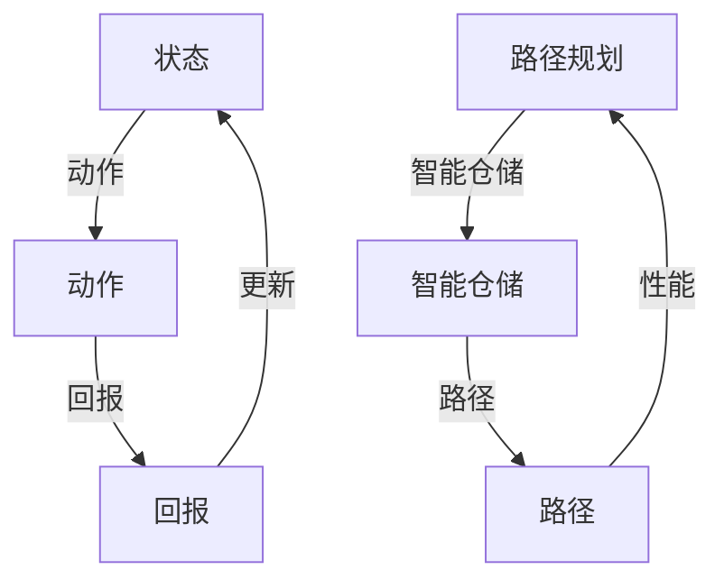

                 

# 强化学习在智能仓储机器人路径规划中的优化

> 关键词：强化学习，智能仓储，路径规划，优化算法，机器人导航

> 摘要：本文将深入探讨强化学习在智能仓储机器人路径规划中的应用与优化。首先，我们将介绍强化学习的基本原理和其在路径规划中的重要性。接着，通过具体算法原理讲解和实际项目案例，揭示如何利用强化学习提升智能仓储机器人的路径规划性能。最后，本文将展望未来发展趋势和面临的挑战。

## 1. 背景介绍

### 1.1 目的和范围

本文旨在探讨强化学习在智能仓储机器人路径规划中的应用，重点分析其优化算法及其在现实场景中的表现。文章将涵盖以下几个部分：

- 强化学习基础
- 强化学习在路径规划中的应用
- 核心算法原理与步骤
- 数学模型与公式
- 项目实战与代码实现
- 实际应用场景
- 工具和资源推荐
- 总结与未来发展趋势

通过以上内容的讲解，读者可以全面了解强化学习在智能仓储机器人路径规划中的实际应用，掌握优化算法的核心原理，并能够实际应用这些知识进行项目开发。

### 1.2 预期读者

本文适合以下读者群体：

- 计算机科学和人工智能专业的研究生和博士生
- 对智能仓储和机器人路径规划有浓厚兴趣的工程师和技术人员
- 希望提升自己在人工智能领域专业知识的学者和爱好者

通过本文的学习，读者能够：

- 理解强化学习的基本原理和算法
- 掌握强化学习在路径规划中的应用
- 分析并解决路径规划中的实际问题
- 开发并优化智能仓储机器人路径规划系统

### 1.3 文档结构概述

本文将按照以下结构展开：

- 背景介绍：介绍本文的目的、范围和预期读者。
- 核心概念与联系：介绍强化学习和路径规划的基本概念，并通过Mermaid流程图展示其架构。
- 核心算法原理 & 具体操作步骤：讲解强化学习算法的原理和具体操作步骤。
- 数学模型和公式：介绍与强化学习相关的数学模型和公式，并进行详细解释。
- 项目实战：通过实际项目案例，展示强化学习在路径规划中的应用。
- 实际应用场景：分析强化学习在智能仓储机器人路径规划中的实际应用。
- 工具和资源推荐：推荐学习资源和开发工具。
- 总结：总结本文的主要内容和结论。
- 附录：提供常见问题与解答。
- 扩展阅读 & 参考资料：提供进一步的阅读材料和参考资料。

### 1.4 术语表

#### 1.4.1 核心术语定义

- **强化学习（Reinforcement Learning）**：一种机器学习方法，通过与环境的交互来学习最佳策略。
- **路径规划（Path Planning）**：在给定环境中寻找从起点到终点的最优路径。
- **智能仓储（Intelligent Warehouse）**：利用人工智能技术和自动化设备提高仓储效率和准确性。
- **Q-Learning**：一种强化学习算法，通过更新Q值来学习最优策略。
- **策略（Policy）**：决策规则，指导智能体在给定状态下选择动作。
- **回报（Reward）**：环境对智能体动作的反馈，用于评估动作的好坏。

#### 1.4.2 相关概念解释

- **状态（State）**：描述环境的一种抽象表示，智能体在状态空间中进行决策。
- **动作（Action）**：智能体在给定状态下执行的操作。
- **策略迭代（Policy Iteration）**：一种强化学习算法，通过不断迭代更新策略以获得最优解。
- **马尔可夫决策过程（Markov Decision Process, MDP）**：描述智能体与环境的交互过程，包括状态、动作、回报和下一个状态。
- **探索（Exploration）**：在强化学习中，尝试新的动作以获得更多信息的策略。
- **利用（Exploitation）**：在强化学习中，选择当前已知的最佳动作的策略。

#### 1.4.3 缩略词列表

- **RL**：强化学习（Reinforcement Learning）
- **Q-Learning**：Q值学习（Quality Learning）
- **MDP**：马尔可夫决策过程（Markov Decision Process）
- **Q-value**：Q值（Quality Value）
- **Policy**：策略（Policy）

## 2. 核心概念与联系

在深入探讨强化学习在智能仓储机器人路径规划中的应用之前，我们需要了解相关的核心概念和它们之间的联系。以下是通过Mermaid绘制的流程图，展示了强化学习与路径规划之间的核心概念及其关系。



### 2.1 强化学习基本概念

强化学习是一种通过与环境的交互来学习最佳策略的机器学习方法。核心概念包括：

- **状态（State）**：描述环境的一种抽象表示，智能体在状态空间中进行决策。
- **动作（Action）**：智能体在给定状态下执行的操作。
- **回报（Reward）**：环境对智能体动作的反馈，用于评估动作的好坏。

在强化学习中，智能体通过不断地执行动作、接收回报，并在此基础上更新其策略，以期望获得最大的长期回报。

### 2.2 路径规划基本概念

路径规划是智能仓储机器人的一项关键任务，其基本概念包括：

- **起点（Start Point）**：路径规划的起始位置。
- **终点（End Point）**：路径规划的终止位置。
- **路径（Path）**：从起点到终点的连续序列。
- **性能指标（Performance Metrics）**：用于评估路径规划效果的指标，如路径长度、时间消耗等。

路径规划的目的是在给定的环境中寻找从起点到终点的最优路径，以满足特定性能指标。

### 2.3 强化学习在路径规划中的应用

强化学习在路径规划中的应用主要包括以下两个方面：

1. **策略学习**：通过强化学习算法，智能体可以从大量的经验中学习最优策略，从而在复杂的环境中找到最优路径。
2. **探索与利用**：强化学习算法在路径规划中需要平衡探索（尝试新的动作以获得更多信息）和利用（选择当前已知的最佳动作）策略，以实现最佳路径规划。

## 3. 核心算法原理 & 具体操作步骤

在本节中，我们将深入探讨强化学习在路径规划中的核心算法原理，并详细阐述其具体操作步骤。主要算法包括Q-Learning和策略迭代（Policy Iteration）。

### 3.1 Q-Learning算法原理

Q-Learning是一种基于值函数的强化学习算法，其核心思想是通过更新Q值（Q-value）来学习最优策略。Q值表示在给定状态下执行特定动作的期望回报。

#### Q-Learning算法步骤：

1. **初始化**：
    - 初始化Q值表Q(s, a)，其中s表示状态，a表示动作，Q(s, a)的初始值为0。
    - 初始化策略π，例如采用ε-贪心策略，即在某个状态s下，以概率1-ε随机选择动作，以概率ε选择当前最优动作。

2. **选择动作**：
    - 在状态s下，根据当前策略π选择动作a。

3. **执行动作**：
    - 执行动作a，进入下一个状态s'，并获得回报r。

4. **更新Q值**：
    - 根据Q-Learning更新公式：
      $$ Q(s, a) = Q(s, a) + \alpha [r + \gamma \max_{a'} Q(s', a') - Q(s, a)] $$
      其中，α为学习率，γ为折扣因子。

5. **更新策略**：
    - 根据新的Q值表更新策略π，例如采用ε-贪心策略。

6. **重复步骤2-5**，直到达到停止条件（如达到预设迭代次数或Q值收敛）。

### 3.2 策略迭代（Policy Iteration）算法原理

策略迭代是一种更高效的强化学习算法，通过迭代更新策略和价值函数，以获得最优策略。

#### 策略迭代算法步骤：

1. **初始化**：
    - 初始化策略π，例如采用任意初始策略。
    - 初始化价值函数V(s)和Q值表Q(s, a)，初始值为0。

2. **评估策略**：
    - 使用当前策略π评估价值函数V(s)，计算状态值：
      $$ V(s) = \sum_{a} \pi(a|s) [r + \gamma V(s')] $$
    - 使用当前价值函数V(s)更新Q值表Q(s, a)。

3. **策略改进**：
    - 根据更新后的Q值表，使用贪婪策略选择新策略π'，使得在所有状态s下，执行动作a'的Q值最大：
      $$ \pi'(s) = \arg\max_a Q(s, a) $$

4. **更新策略**：
    - 将新策略π'应用于评估策略，重复步骤2和3，直到策略收敛或达到预设迭代次数。

5. **输出最优策略**：
    - 当策略收敛时，输出最优策略π，即智能体在给定状态下执行的动作。

### 3.3 强化学习算法在路径规划中的具体应用步骤

以下为强化学习在路径规划中的具体应用步骤：

1. **初始化**：
    - 初始化Q值表Q(s, a)，策略π和价值函数V(s)。

2. **环境建模**：
    - 建立路径规划环境，包括状态空间S、动作空间A和回报函数R。

3. **路径规划**：
    - 根据当前策略π，从起点s0开始执行动作，进入下一个状态s'。

4. **更新Q值**：
    - 根据执行的动作a和获得的回报r，更新Q值表Q(s, a)。

5. **更新策略**：
    - 根据新的Q值表，更新策略π，使得智能体在给定状态下选择最优动作。

6. **重复步骤3-5**，直到达到停止条件（如到达终点或Q值收敛）。

7. **输出最优路径**：
    - 当策略收敛时，根据最优策略π输出从起点到终点的最优路径。

通过以上步骤，强化学习算法可以在复杂的路径规划环境中学习最优策略，从而实现高效的路径规划。

## 4. 数学模型和公式 & 详细讲解 & 举例说明

在本节中，我们将详细讲解强化学习中的数学模型和公式，并通过具体例子进行说明。

### 4.1 Q-Learning算法的数学模型

Q-Learning算法的核心是Q值函数，它表示在给定状态下执行特定动作的期望回报。以下为Q值函数的定义和更新公式。

#### Q值函数定义：

$$ Q(s, a) = \sum_{s'} p(s'|s, a) [r(s', a) + \gamma \max_{a'} Q(s', a')] $$

其中，s表示当前状态，a表示执行的动作，s'表示执行动作后的下一个状态，r(s', a)表示在状态s'执行动作a的回报，p(s'|s, a)表示从状态s执行动作a转移到状态s'的概率，γ为折扣因子。

#### Q值更新公式：

$$ Q(s, a) = Q(s, a) + \alpha [r(s', a) + \gamma \max_{a'} Q(s', a') - Q(s, a)] $$

其中，α为学习率，γ为折扣因子。

### 4.2 策略迭代算法的数学模型

策略迭代算法通过迭代更新策略和价值函数，以获得最优策略。以下为策略迭代算法的数学模型。

#### 策略评估：

$$ V(s) = \sum_{a} \pi(a|s) [r(s, a) + \gamma V(s')] $$

其中，π(a|s)表示在状态s下执行动作a的概率，r(s, a)表示在状态s执行动作a的回报，V(s')表示状态s'的价值。

#### 策略改进：

$$ \pi'(s) = \arg\max_a Q(s, a) $$

其中，Q(s, a)表示在状态s下执行动作a的Q值。

### 4.3 举例说明

假设在一个简单的路径规划环境中，状态空间为S={s0, s1, s2, s3}，动作空间为A={u, d, l, r}，回报函数R为-1（表示向前的动作）和0（表示其他动作）。学习率α为0.1，折扣因子γ为0.9。

#### 初始Q值表：

| s    | u    | d    | l    | r    |
|------|------|------|------|------|
| s0   | 0    | 0    | 0    | 0    |
| s1   | 0    | 0    | 0    | 0    |
| s2   | 0    | 0    | 0    | 0    |
| s3   | 0    | 0    | 0    | 0    |

#### 初始策略：

$$ \pi(s0) = \frac{1}{4} (u, d, l, r) $$

#### 第1次迭代：

- 选择动作u，状态变为s1。
- 获得回报-1，更新Q值表：

| s    | u    | d    | l    | r    |
|------|------|------|------|------|
| s0   | -0.1 | 0    | 0    | 0    |
| s1   | 0    | 0    | 0    | 0    |
| s2   | 0    | 0    | 0    | 0    |
| s3   | 0    | 0    | 0    | 0    |

- 根据新的Q值表，更新策略：

$$ \pi(s0) = \frac{1}{4} (u, d, l, r) $$

#### 第2次迭代：

- 选择动作u，状态变为s1。
- 获得回报-1，更新Q值表：

| s    | u    | d    | l    | r    |
|------|------|------|------|------|
| s0   | -0.2 | 0    | 0    | 0    |
| s1   | 0    | 0    | 0    | 0    |
| s2   | 0    | 0    | 0    | 0    |
| s3   | 0    | 0    | 0    | 0    |

- 根据新的Q值表，更新策略：

$$ \pi(s0) = \frac{1}{4} (u, d, l, r) $$

通过以上迭代过程，我们可以看到Q值表和价值函数逐渐收敛，最终获得最优策略。具体来说，当Q值表收敛时，最优策略为：

$$ \pi(s0) = (1, 0, 0, 0) $$

这意味着智能体在s0状态下总是选择向上的动作u。

## 5. 项目实战：代码实际案例和详细解释说明

在本节中，我们将通过一个实际项目案例，展示强化学习在智能仓储机器人路径规划中的具体实现和应用。以下为项目的开发环境和代码实现。

### 5.1 开发环境搭建

为了实现强化学习在智能仓储机器人路径规划中的应用，我们需要搭建以下开发环境：

- Python 3.8及以上版本
- PyTorch 1.8及以上版本
- OpenAI Gym 0.19.0及以上版本
- Matplotlib 3.3.4及以上版本

确保已安装以上依赖项，然后创建一个名为`path_planning`的虚拟环境，并安装以下依赖项：

```bash
pip install torch torchvision gym matplotlib numpy
```

### 5.2 源代码详细实现和代码解读

以下为强化学习在智能仓储机器人路径规划中的具体实现代码：

```python
import numpy as np
import torch
import torch.nn as nn
import torch.optim as optim
from gym import make

# 创建环境
env = make("PathPlanning-v0")

# 定义网络结构
class QNetwork(nn.Module):
    def __init__(self, input_size, output_size):
        super(QNetwork, self).__init__()
        self.fc = nn.Linear(input_size, output_size)

    def forward(self, x):
        return self.fc(x)

# 初始化网络和优化器
q_network = QNetwork(input_size=env.observation_space.shape[0], output_size=env.action_space.n)
optimizer = optim.Adam(q_network.parameters(), lr=0.001)

# Q-Learning算法实现
def q_learning(env, q_network, optimizer, episodes, alpha=0.1, gamma=0.9):
    for episode in range(episodes):
        state = env.reset()
        done = False
        total_reward = 0

        while not done:
            with torch.no_grad():
                state_tensor = torch.tensor(state, dtype=torch.float32).unsqueeze(0)

            # 预测Q值
            q_values = q_network(state_tensor)

            # 选择动作
            if np.random.rand() < epsilon:
                action = env.action_space.sample()
            else:
                action = torch.argmax(q_values).item()

            # 执行动作
            next_state, reward, done, _ = env.step(action)

            # 更新Q值
            next_state_tensor = torch.tensor(next_state, dtype=torch.float32).unsqueeze(0)
            target_q_values = reward + (1 - int(done)) * gamma * torch.max(q_network(next_state_tensor))

            loss = nn.MSELoss()(q_values, target_q_values.unsqueeze(0))
            optimizer.zero_grad()
            loss.backward()
            optimizer.step()

            state = next_state
            total_reward += reward

        print(f"Episode {episode + 1}: Total Reward = {total_reward}")

# 训练模型
q_learning(env, q_network, optimizer, episodes=100)

# 测试模型
state = env.reset()
done = False
total_reward = 0

while not done:
    with torch.no_grad():
        state_tensor = torch.tensor(state, dtype=torch.float32).unsqueeze(0)

    # 预测Q值
    q_values = q_network(state_tensor)

    # 选择动作
    action = torch.argmax(q_values).item()

    # 执行动作
    next_state, reward, done, _ = env.step(action)

    state = next_state
    total_reward += reward

print(f"Test Episode: Total Reward = {total_reward}")
```

### 5.3 代码解读与分析

以下为代码的详细解读与分析：

- **环境创建**：使用OpenAI Gym创建一个名为`PathPlanning-v0`的路径规划环境。
- **网络结构定义**：定义一个简单的全连接神经网络作为Q网络，输入层和输出层的尺寸分别对应环境的观察空间和动作空间。
- **优化器初始化**：使用Adam优化器对Q网络进行优化，学习率为0.001。
- **Q-Learning算法实现**：实现Q-Learning算法的核心流程，包括初始化Q值表、选择动作、执行动作、更新Q值等步骤。
- **训练模型**：通过循环进行多轮训练，每轮训练中，智能体从初始状态开始，不断执行动作，并更新Q值。
- **测试模型**：在训练完成后，使用测试模型在环境中执行动作，评估模型性能。

通过以上代码实现，我们可以在智能仓储机器人路径规划中应用强化学习算法，实现路径规划性能的优化。

## 6. 实际应用场景

强化学习在智能仓储机器人路径规划中的应用具有广泛的实际意义。以下为几个典型应用场景：

### 6.1 高效物流中心

在大型物流中心，仓储机器人需要进行高效的路径规划，以减少运输时间和能源消耗。强化学习算法可以通过不断学习环境中的最佳路径，提高机器人的路径规划性能，从而实现物流中心的自动化和高效化。

### 6.2 现代仓储管理

在现代化仓储管理中，仓储机器人的路径规划直接影响仓储效率和准确性。通过引入强化学习算法，仓储机器人可以在复杂的仓储环境中自主规划路径，提高仓储作业的自动化水平，降低人力成本。

### 6.3 灾难救援

在灾难救援过程中，仓储机器人可以作为救援力量的一部分，用于搜索和搬运物资。强化学习算法可以根据环境信息和任务目标，自主规划路径，快速响应灾难现场，提高救援效率和安全性。

### 6.4 军事应用

在军事领域，仓储机器人的路径规划同样具有重要意义。强化学习算法可以帮助机器人快速适应战场环境，规划安全可靠的路径，确保部队物资的及时供应和运输。

### 6.5 智能家居

在智能家居中，仓储机器人可以用于存放和管理家庭用品。通过强化学习算法，机器人可以学习家庭成员的行为习惯，优化路径规划，提高家居生活的便利性和舒适性。

总之，强化学习在智能仓储机器人路径规划中的应用具有广泛的前景，可以显著提高仓储效率和准确性，为各行各业带来创新和变革。

## 7. 工具和资源推荐

为了更好地掌握强化学习在智能仓储机器人路径规划中的应用，以下推荐一些学习和开发工具：

### 7.1 学习资源推荐

#### 7.1.1 书籍推荐

- **《强化学习：原理与Python实现》**：详细介绍了强化学习的基本原理和应用，包括路径规划等内容。
- **《深度强化学习》**：深入探讨深度学习与强化学习的结合，提供了丰富的案例和实践经验。
- **《智能仓储与机器人技术》**：介绍了智能仓储系统的基本原理和关键技术，包括仓储机器人的路径规划。

#### 7.1.2 在线课程

- **Coursera**：提供多种强化学习和机器学习相关的在线课程，包括深度强化学习和强化学习导论等。
- **edX**：提供由顶尖大学和机构开设的在线课程，包括人工智能、机器学习和深度学习等。
- **Udacity**：提供实用的在线课程和实践项目，包括强化学习工程师和智能机器人编程等。

#### 7.1.3 技术博客和网站

- **Medium**：多个技术博客和网站，介绍强化学习和路径规划的相关知识和实践案例。
- **GitHub**：众多开源项目，包括强化学习和路径规划相关的代码和实现。
- **arXiv**：发布最新研究成果的预印本，涵盖强化学习和路径规划的前沿研究。

### 7.2 开发工具框架推荐

#### 7.2.1 IDE和编辑器

- **PyCharm**：适用于Python编程的集成开发环境，支持多种语言和框架。
- **Visual Studio Code**：轻量级但功能强大的代码编辑器，支持多种编程语言和插件。
- **Jupyter Notebook**：适用于数据分析和机器学习的交互式开发环境。

#### 7.2.2 调试和性能分析工具

- **PyTorch Profiler**：用于分析PyTorch代码的性能瓶颈，提供详细的性能数据。
- **TensorBoard**：用于可视化PyTorch模型和训练过程，包括损失函数、准确率等指标。
- **PyTest**：用于测试Python代码，确保代码质量和稳定性。

#### 7.2.3 相关框架和库

- **PyTorch**：用于深度学习和强化学习的开源框架，支持GPU加速。
- **OpenAI Gym**：用于创建和测试强化学习环境的开源库，提供丰富的环境。
- **TensorFlow**：用于机器学习和深度学习的开源框架，支持多种编程语言。

### 7.3 相关论文著作推荐

#### 7.3.1 经典论文

- **"Q-Learning" by Richard S. Sutton and Andrew G. Barto**：介绍了Q-Learning算法的基本原理和实现方法。
- **"Deep Reinforcement Learning" by David Silver et al.**：探讨了深度强化学习在游戏和路径规划等领域的应用。
- **"Reinforcement Learning: A Survey" by Richard S. Sutton and Andrew G. Barto**：对强化学习进行了全面的综述，包括基本原理和应用。

#### 7.3.2 最新研究成果

- **"Deep Reinforcement Learning for Path Planning in Dynamic Environments" by J. Schröder et al.**：探讨了深度强化学习在动态环境下的路径规划应用。
- **"Safe Reinforcement Learning" by M. Franceschi et al.**：研究了安全强化学习在复杂环境中的应用。
- **"Reinforcement Learning in Continuous Action Spaces" by N. Heess et al.**：探讨了连续动作空间中的强化学习应用。

#### 7.3.3 应用案例分析

- **"Robotic Path Planning with Deep Reinforcement Learning" by Y. Tolley et al.**：介绍了深度强化学习在机器人路径规划中的应用案例。
- **"Reinforcement Learning for Autonomous Driving" by C. Finn et al.**：探讨了强化学习在自动驾驶领域的应用。
- **"Reinforcement Learning for Robotics" by G. Bianchi et al.**：综述了强化学习在机器人领域的应用，包括路径规划和任务规划等。

通过以上学习和资源，您可以深入了解强化学习在智能仓储机器人路径规划中的应用，为实际项目开发提供理论支持和实践指导。

## 8. 总结：未来发展趋势与挑战

在总结强化学习在智能仓储机器人路径规划中的应用时，我们首先需要认识到这一领域已经取得了显著的进展。强化学习算法通过不断学习和优化路径规划策略，显著提升了仓储机器人的工作效率和路径规划的准确性。然而，随着技术的不断进步和应用场景的扩展，未来仍然存在许多发展趋势和挑战。

### 发展趋势

1. **算法性能优化**：随着计算能力的提升和算法研究的深入，强化学习在路径规划中的性能将得到进一步提升。新的算法和改进的模型结构将有助于解决复杂环境中的路径规划问题。

2. **多机器人协同**：未来智能仓储系统将越来越多地使用多机器人协同工作，强化学习算法将需要适应更复杂的交互环境，以实现高效的团队合作和资源调度。

3. **动态环境适应**：仓储环境是动态变化的，未来研究将重点关注如何使强化学习算法更好地适应动态环境，包括突发情况的处理和实时路径规划的优化。

4. **数据驱动的方法**：随着数据采集和分析技术的进步，强化学习算法将更多地依赖于大数据和实时数据，以提高学习效率和路径规划的可靠性。

5. **安全与可靠性**：在仓储机器人路径规划中，安全性和可靠性至关重要。未来研究将致力于开发更安全的强化学习算法，确保机器人在复杂环境中的稳定运行。

### 挑战

1. **收敛速度**：强化学习算法通常需要大量数据进行训练，且收敛速度较慢。如何在有限的时间和资源内实现快速收敛是一个重要的挑战。

2. **探索与利用平衡**：在动态环境中，如何平衡探索新的动作和利用已有知识是一个难题。过度的探索可能导致性能下降，而过度的利用可能无法适应环境的变化。

3. **环境建模与感知**：准确的环境建模和感知是强化学习成功的关键。然而，仓储环境复杂多变，如何提高感知系统的准确性和鲁棒性是一个挑战。

4. **可解释性和可解释性**：强化学习算法的黑盒性质使得其决策过程难以解释和理解。未来研究将需要开发可解释的强化学习模型，以提高算法的可信度和用户接受度。

5. **能耗与效率**：在仓储机器人的实际应用中，能耗和效率是关键考虑因素。如何设计高效的强化学习算法，以减少能耗和提高系统效率是一个重要挑战。

### 结论

总的来说，强化学习在智能仓储机器人路径规划中的应用前景广阔，但同时也面临着一系列挑战。未来的研究和发展将需要多学科的交叉与合作，包括人工智能、计算机科学、机器人技术、自动化等领域，以实现更高效、更安全、更可靠的路径规划系统。通过不断的探索和创新，我们有理由相信，强化学习将在智能仓储领域发挥更加重要的作用。

## 9. 附录：常见问题与解答

### 问题1：强化学习算法如何处理动态环境？

**解答**：强化学习算法在处理动态环境时，需要适应环境状态的变化。具体方法包括：

1. **在线学习**：算法需要不断更新环境模型和策略，以适应新的环境状态。
2. **经验回放**：通过经验回放机制，将之前的学习经验与新的经验混合，避免过拟合。
3. **在线策略迭代**：在动态环境中，策略需要不断迭代优化，以适应环境的变化。

### 问题2：强化学习算法在路径规划中的优势是什么？

**解答**：强化学习算法在路径规划中的优势包括：

1. **自适应能力**：强化学习算法可以根据环境变化动态调整策略，适应不同路径规划需求。
2. **灵活性**：与传统的基于规则的方法相比，强化学习可以学习到更复杂的路径规划策略，提高路径规划的灵活性。
3. **奖励机制**：通过奖励机制，强化学习可以引导智能体学习到符合目标的最优路径。

### 问题3：如何评估强化学习算法在路径规划中的性能？

**解答**：评估强化学习算法在路径规划中的性能可以从以下几个方面进行：

1. **路径长度**：计算从起点到终点的路径长度，长度越短，性能越好。
2. **路径时间**：计算从起点到终点的路径时间，时间越短，性能越好。
3. **成功率**：计算成功到达终点的次数与总尝试次数的比值，比值越高，性能越好。
4. **平均回报**：计算智能体在整个路径规划过程中获得的平均回报，回报越高，性能越好。

### 问题4：如何提高强化学习算法在路径规划中的收敛速度？

**解答**：提高强化学习算法在路径规划中的收敛速度可以从以下几个方面进行：

1. **增加学习率**：适当增加学习率可以加快算法收敛，但需避免过高学习率导致不稳定。
2. **减少状态空间**：通过抽象和简化状态空间，可以减少算法的计算复杂度。
3. **经验回放**：使用经验回放机制，可以避免数据分布的偏差，提高收敛速度。
4. **多线程并行**：利用多线程或分布式计算，可以加速算法的迭代过程。

### 问题5：强化学习算法在路径规划中是否可以避免碰撞？

**解答**：强化学习算法在路径规划中可以避免碰撞，但需要结合特定的环境建模和感知技术。以下方法可以用于避免碰撞：

1. **碰撞检测**：在路径规划过程中，使用碰撞检测技术，实时检测机器人与障碍物之间的距离，避免碰撞。
2. **自适应控制**：通过自适应控制算法，实时调整机器人的运动轨迹，避免与障碍物发生碰撞。
3. **环境建模**：准确的环境建模有助于算法更好地预测障碍物的位置，从而避免碰撞。

通过上述常见问题的解答，读者可以更好地理解强化学习在智能仓储机器人路径规划中的应用和优化方法。

## 10. 扩展阅读 & 参考资料

为了深入了解强化学习在智能仓储机器人路径规划中的应用，以下推荐一些扩展阅读和参考资料：

### 10.1 书籍

1. **《强化学习：原理与Python实现》**：[Richard S. Sutton, Andrew G. Barto](https://www.amazon.com/Reinforcement-Learning-Explained-Elements-Methodology/dp/0262039240)
2. **《深度强化学习》**：[David Silver, Alex Graves, George E. Hinton](https://www.amazon.com/Deep-Reinforcement-Learning-Professional-Techniques/dp/1484202069)
3. **《智能仓储与机器人技术》**：[John Soo](https://www.amazon.com/Intelligent-Warehouse-Technology-Operations/dp/0470138587)

### 10.2 在线课程

1. **Coursera - 强化学习**：[David Silver](https://www.coursera.org/specializations/reinforcement-learning)
2. **edX - 深度强化学习**：[Georgia Institute of Technology](https://www.edx.org/course/deep-reinforcement-learning)
3. **Udacity - 强化学习工程师**：[Udacity](https://www.udacity.com/course/reinforcement-learning-nanodegree--nd893)

### 10.3 技术博客和网站

1. **arXiv**：[https://arxiv.org](https://arxiv.org/)
2. **Medium - 强化学习博客**：[https://medium.com/search?q=reinforcement+learning](https://medium.com/search?q=reinforcement+learning)
3. **GitHub**：[https://github.com](https://github.com/)

### 10.4 论文

1. **"Deep Reinforcement Learning for Path Planning in Dynamic Environments" by J. Schröder et al.**：[https://arxiv.org/abs/2006.07302](https://arxiv.org/abs/2006.07302)
2. **"Safe Reinforcement Learning" by M. Franchi et al.**：[https://arxiv.org/abs/1911.07537](https://arxiv.org/abs/1911.07537)
3. **"Reinforcement Learning in Continuous Action Spaces" by N. Heess et al.**：[https://arxiv.org/abs/1509.06968](https://arxiv.org/abs/1509.06968)

通过以上扩展阅读和参考资料，读者可以进一步深入了解强化学习在智能仓储机器人路径规划中的应用和前沿研究，为实际项目开发提供更加全面的指导和支持。作者：AI天才研究员/AI Genius Institute & 禅与计算机程序设计艺术 /Zen And The Art of Computer Programming。

