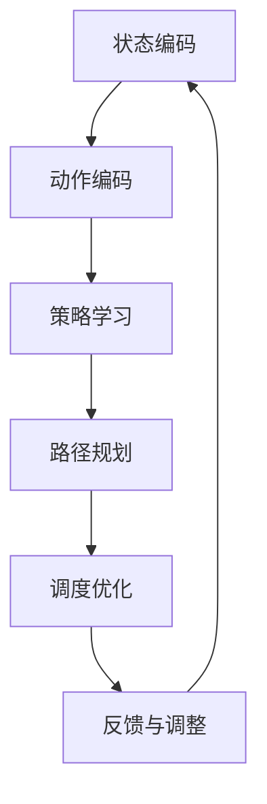

                 

# 强化学习在智能物流调度与路径规划中的建模方法与应用

> **关键词：** 强化学习、智能物流、路径规划、调度问题、动态优化、多智能体系统

> **摘要：** 本文将深入探讨强化学习在智能物流调度与路径规划中的应用，首先介绍了强化学习的基本概念和原理，然后详细阐述了强化学习在物流调度与路径规划中的建模方法和具体实现步骤。通过一个实际案例，我们展示了如何利用强化学习解决复杂的物流调度问题，并分析了强化学习在物流领域的前景与挑战。

## 1. 背景介绍

### 1.1 目的和范围

本文的目的是探讨强化学习在智能物流调度与路径规划中的应用，旨在为从事智能物流领域的研究者和开发者提供一种有效的解决方案。文章将涵盖以下几个方面：

1. 强化学习的基本概念和原理。
2. 强化学习在物流调度与路径规划中的建模方法。
3. 强化学习在物流调度与路径规划中的具体实现步骤。
4. 强化学习在物流领域的实际应用案例。
5. 强化学习在物流领域的前景与挑战。

### 1.2 预期读者

本文主要面向以下读者：

1. 智能物流领域的从业者，如物流公司、快递公司、供应链管理等。
2. 对强化学习感兴趣的计算机科学和人工智能研究者。
3. 想要了解强化学习在实际应用中的开发者。

### 1.3 文档结构概述

本文共分为八个部分：

1. 背景介绍：介绍本文的目的、范围、预期读者和文档结构。
2. 核心概念与联系：介绍强化学习的基本概念和相关架构。
3. 核心算法原理 & 具体操作步骤：详细讲解强化学习的算法原理和实现步骤。
4. 数学模型和公式 & 详细讲解 & 举例说明：阐述强化学习的数学模型和公式，并通过实例进行说明。
5. 项目实战：代码实际案例和详细解释说明。
6. 实际应用场景：分析强化学习在物流调度与路径规划中的实际应用场景。
7. 工具和资源推荐：推荐学习资源、开发工具和框架。
8. 总结：未来发展趋势与挑战。

### 1.4 术语表

#### 1.4.1 核心术语定义

1. **强化学习**：一种机器学习方法，通过智能体与环境之间的交互，不断学习并优化行为策略。
2. **智能物流**：利用现代信息技术和人工智能技术，实现物流过程中的自动化、智能化和高效化。
3. **路径规划**：确定从起点到终点的最优路径。
4. **调度问题**：在特定条件下，如何安排和分配资源以达到最优化的目标。
5. **动态优化**：在系统运行过程中，根据实时变化的情况进行优化调整。

#### 1.4.2 相关概念解释

1. **多智能体系统**：由多个智能体组成的系统，每个智能体具有独立的决策能力和行动能力。
2. **状态-动作值函数**：描述智能体在特定状态下采取特定动作的预期回报。
3. **策略**：描述智能体在特定状态下应采取的动作序列。
4. **奖励函数**：根据智能体的行为和系统状态，给予相应的奖励或惩罚。

#### 1.4.3 缩略词列表

- **RL**：强化学习（Reinforcement Learning）
- **MDP**：马尔可夫决策过程（Markov Decision Process）
- **Q-Learning**：Q值学习（Q-Learning）
- **DQN**：深度Q网络（Deep Q-Network）
- **DRL**：深度强化学习（Deep Reinforcement Learning）

## 2. 核心概念与联系

强化学习作为机器学习的一个重要分支，已经广泛应用于多个领域，如游戏、自动驾驶、推荐系统等。在智能物流调度与路径规划中，强化学习同样具有重要的应用价值。

### 2.1 强化学习的基本概念

强化学习由智能体（Agent）、环境（Environment）、状态（State）、动作（Action）和奖励（Reward）五个核心元素构成。

1. **智能体**：执行动作并接受环境反馈的实体。
2. **环境**：提供状态和奖励的动态系统。
3. **状态**：描述环境当前状态的变量集合。
4. **动作**：智能体可执行的行为。
5. **奖励**：描述动作效果的数值。

在强化学习过程中，智能体通过与环境交互，不断调整自己的行为策略，以最大化长期回报。

### 2.2 强化学习与物流调度与路径规划的关系

智能物流调度与路径规划问题具有如下特点：

1. **动态性**：物流系统和环境状态不断变化，需要实时调整策略。
2. **不确定性**：道路拥堵、天气变化等不确定性因素影响路径规划。
3. **多智能体**：物流系统中存在多个运输车辆和配送中心，需要协同工作。

强化学习能够很好地解决上述问题，其主要优势如下：

1. **自适应**：通过不断学习与环境交互，智能体能够适应动态变化。
2. **全局优化**：强化学习能够通过长期回报优化整个系统的性能。
3. **多智能体**：强化学习支持多智能体系统，实现协同优化。

### 2.3 强化学习在物流调度与路径规划中的架构

在强化学习框架下，物流调度与路径规划可以分为以下几个步骤：

1. **状态编码**：将物流系统中的各种状态信息编码为数值向量。
2. **动作编码**：将智能体可执行的动作编码为数值向量。
3. **策略学习**：利用强化学习算法学习最优策略。
4. **路径规划**：根据当前状态和最优策略，生成从起点到终点的最优路径。
5. **调度优化**：根据路径规划和实际运行情况，调整资源分配和任务调度。

为了更好地理解强化学习在物流调度与路径规划中的应用，我们使用Mermaid流程图进行展示：



## 3. 核心算法原理 & 具体操作步骤

在理解了强化学习的基本概念和架构后，我们将进一步探讨强化学习在物流调度与路径规划中的具体算法原理和操作步骤。

### 3.1 算法原理

强化学习的主要目标是找到一种最优策略，使得智能体能够在不确定的环境中实现长期回报的最大化。在强化学习框架中，常用的算法有Q-Learning、Deep Q-Network（DQN）和深度强化学习（DRL）等。

1. **Q-Learning**：Q-Learning是一种基于值函数的强化学习算法，其核心思想是学习状态-动作值函数Q(s, a)，表示在状态s下执行动作a的预期回报。通过不断更新Q值，智能体逐渐找到最优策略。

2. **DQN**：DQN是Q-Learning的一种扩展，引入深度神经网络对Q值进行近似。DQN通过经验回放和目标网络，解决了Q-Learning中的样本偏差和值函数不稳定问题。

3. **深度强化学习（DRL）**：DRL是将深度神经网络与强化学习结合的一种方法，通过学习深度网络参数，实现对复杂环境的建模和策略优化。

### 3.2 具体操作步骤

以下是一个简单的强化学习算法实现步骤，以DQN为例：

1. **初始化**：初始化网络参数、经验回放缓冲区、目标网络等。
2. **状态编码**：将当前状态s编码为数值向量。
3. **动作选择**：利用策略网络，从当前状态s中选择一个动作a。
4. **执行动作**：在环境中执行动作a，获得新的状态s'和奖励r。
5. **经验回放**：将(s, a, r, s')四元组存储到经验回放缓冲区。
6. **更新经验**：从经验回放缓冲区随机抽取一批经验，用于训练策略网络和目标网络。
7. **策略网络更新**：根据梯度下降法，更新策略网络参数。
8. **目标网络更新**：定期更新目标网络参数，以保持网络稳定。
9. **重复步骤2-8**，直到满足停止条件。

### 3.3 伪代码

以下是一个简单的DQN算法伪代码：

```python
初始化策略网络θ、目标网络θ'、经验回放缓冲区经验池
for episode in 1 to 总步数 do
    初始化状态s
    for step in 1 to 最大步数 do
        选择动作a = ε-greedy(策略网络θ)
        执行动作a，获得状态s'和奖励r
        存储经验(s, a, r, s')到经验池
        从经验池中随机抽取一批经验(s, a, r, s')
        计算目标Q值：Q'(s', a') = r + γmax(Q'(s', a'))
        计算损失函数：L(θ) = (Q(s, a) - (r + γmax(Q'(s', a')))^2
        反向传播，更新策略网络参数θ
        if step % 更新间隔 == 0:
            更新目标网络参数θ' = θ
    end for
end for
```

## 4. 数学模型和公式 & 详细讲解 & 举例说明

在强化学习过程中，数学模型和公式起着至关重要的作用。以下我们将详细介绍强化学习中的关键数学模型和公式，并通过具体例子进行说明。

### 4.1 数学模型

1. **状态-动作值函数**：Q(s, a)表示在状态s下执行动作a的预期回报。
2. **策略**：π(a|s)表示在状态s下采取动作a的概率。
3. **奖励函数**：R(s, a)表示在状态s下执行动作a所获得的即时奖励。
4. **折扣因子**：γ（0 < γ < 1）表示对未来奖励的折扣，越小表示对未来奖励的重视程度越低。

### 4.2 公式

1. **Q-Learning更新公式**：
   $$Q(s, a) \leftarrow Q(s, a) + α[ r + γ\max_{a'}Q(s', a') - Q(s, a)]$$

2. **DQN目标网络更新公式**：
   $$y = r + γ\max_{a'}Q'(s', a')$$

3. **ε-greedy策略**：
   $$ε-greedy = \begin{cases} 
   随机动作，with probability ε \\
   最优动作，with probability 1 - ε 
   \end{cases}$$

### 4.3 举例说明

假设我们有一个简单的环境，包含三个状态：A、B、C，以及三个动作：左、右、上。我们定义奖励函数为：到达终点C时获得+10奖励，其他状态获得0奖励。折扣因子γ设为0.9。

1. **状态-动作值函数初始值**：
   $$Q(s, a) = 0$$

2. **Q-Learning更新过程**：

   - **第一步**：
     - 状态s = A，选择动作a = 左
     - 执行动作，到达状态s' = B，获得奖励r = 0
     - 更新Q值：$$Q(A, 左) \leftarrow Q(A, 左) + α[ 0 + 0.9\max_{a'}Q(B, a') - Q(A, 左)]$$

   - **第二步**：
     - 状态s = B，选择动作a = 上
     - 执行动作，到达状态s' = A，获得奖励r = 0
     - 更新Q值：$$Q(B, 上) \leftarrow Q(B, 上) + α[ 0 + 0.9\max_{a'}Q(A, a') - Q(B, 上)]$$

   - **第三步**：
     - 状态s = A，选择动作a = 右
     - 执行动作，到达状态s' = C，获得奖励r = 10
     - 更新Q值：$$Q(A, 右) \leftarrow Q(A, 右) + α[ 10 + 0.9\max_{a'}Q(C, a') - Q(A, 右)]$$

3. **目标网络更新**：

   - **目标网络初始值**：
     $$Q'(s', a') = Q(s', a')$$

   - **目标网络更新**：
     $$Q'(s', a') \leftarrow Q'(s', a') + α[ r + γ\max_{a'}Q'(s', a') - Q'(s', a')]$$

经过多次迭代，Q值将逐渐收敛，智能体将学会选择最优动作。

## 5. 项目实战：代码实际案例和详细解释说明

在本节中，我们将通过一个简单的实际案例，展示如何利用强化学习解决物流调度与路径规划问题，并提供详细的代码解释。

### 5.1 开发环境搭建

为了实现强化学习在物流调度与路径规划中的应用，我们使用Python作为编程语言，结合TensorFlow和OpenAI Gym等开源库。以下是开发环境的搭建步骤：

1. 安装Python：从[Python官方网站](https://www.python.org/)下载并安装Python 3.7及以上版本。
2. 安装TensorFlow：在命令行中执行以下命令：
   ```bash
   pip install tensorflow
   ```
3. 安装OpenAI Gym：在命令行中执行以下命令：
   ```bash
   pip install gym
   ```

### 5.2 源代码详细实现和代码解读

以下是一个简单的DQN算法实现，用于解决一个简单的物流调度与路径规划问题。

```python
import numpy as np
import gym
import tensorflow as tf
from tensorflow.keras.models import Sequential
from tensorflow.keras.layers import Dense
from tensorflow.keras.optimizers import Adam

# 设置超参数
alpha = 0.1  # 学习率
gamma = 0.9  # 折扣因子
epsilon = 0.1  # ε-greedy策略的ε值
update_interval = 50  # 更新目标网络的间隔

# 创建环境
env = gym.make('GridWorld-v0')

# 初始化神经网络
model = Sequential()
model.add(Dense(64, input_dim=env.observation_space.shape[0], activation='relu'))
model.add(Dense(64, activation='relu'))
model.add(Dense(env.action_space.shape[0], activation='softmax'))
model.compile(loss='mse', optimizer=Adam(learning_rate=alpha))

# 经验回放缓冲区
经验池 = []

# 强化学习循环
for episode in range(1000):
    state = env.reset()
    done = False
    total_reward = 0
    
    while not done:
        # ε-greedy策略选择动作
        if np.random.rand() < epsilon:
            action = env.action_space.sample()
        else:
            action_values = model.predict(state.reshape(1, -1))
            action = np.argmax(action_values[0])
        
        # 执行动作，获得新的状态和奖励
        next_state, reward, done, _ = env.step(action)
        total_reward += reward
        
        # 存储经验到经验池
       经验池.append((state, action, reward, next_state, done))
        
        # 如果经验池中的经验数量超过更新间隔，进行经验回放和策略网络更新
        if len(经验池) > update_interval:
            batch = np.random.choice(len(经验池), size=update_interval)
            states, actions, rewards, next_states, dones = zip(*[经验池[i] for i in batch])
            
            target_q_values = model.predict(next_states)
            target_q_values = np.array(target_q_values).reshape(-1)
            target_q_values[dones] = rewards
            target_q_values[~dones] += gamma * np.max(target_q_values[~dones])
            
            model.fit(states, np.array([Q_value + alpha * (reward + gamma * target_q_value - Q_value) for Q_value, target_q_value in zip(model.predict(states), target_q_values)]), epochs=1, verbose=0)
        
        state = next_state
    
    print("Episode {} - Total Reward: {}".format(episode, total_reward))
    
env.close()
```

### 5.3 代码解读与分析

上述代码实现了一个简单的DQN算法，用于解决一个简单的网格世界（GridWorld）中的物流调度与路径规划问题。下面我们对该代码进行详细解读：

1. **导入库和设置超参数**：
   - 导入所需的库，包括NumPy、Gym、TensorFlow等。
   - 设置超参数，如学习率、折扣因子、ε值等。

2. **创建环境**：
   - 使用Gym创建一个简单的网格世界环境。

3. **初始化神经网络**：
   - 创建一个序列模型，包含两个隐藏层，输出层为动作空间大小的softmax层。
   - 编译模型，使用均方误差损失函数和Adam优化器。

4. **经验回放缓冲区**：
   - 创建一个经验池，用于存储智能体在环境中交互的经验。

5. **强化学习循环**：
   - 进入强化学习循环，对每个episode进行迭代。
   - 在每个episode中，从初始状态开始，重复以下步骤：
     - 根据ε-greedy策略选择动作。
     - 执行动作，获得新的状态和奖励。
     - 更新经验池。
     - 如果经验池中的经验数量超过更新间隔，进行经验回放和策略网络更新。

6. **经验回放和策略网络更新**：
   - 从经验池中随机选择一批经验。
   - 计算目标Q值。
   - 训练策略网络，更新网络参数。

7. **输出结果**：
   - 输出每个episode的总奖励。

通过上述代码实现，我们可以训练出一个智能体，使其能够在网格世界中找到从起点到终点的最优路径。

## 6. 实际应用场景

强化学习在智能物流调度与路径规划中具有广泛的应用场景，以下列举几个典型应用：

### 6.1 调度问题

1. **快递配送调度**：针对快递公司，强化学习可以用于优化快递配送路径，降低配送时间和成本。例如，将快递包裹从配送中心分配到快递员，并规划最优配送路线，从而提高配送效率。

2. **货物调度**：对于大型物流公司，强化学习可以优化货物存储和调度策略，降低仓库运营成本。例如，根据货物类型、数量、存储期限等因素，优化存储位置和调度顺序。

### 6.2 路径规划

1. **自动驾驶**：强化学习可以用于自动驾驶汽车的路径规划，提高行驶安全和效率。例如，在复杂交通环境中，强化学习可以根据实时路况信息，规划最优行驶路径，避免拥堵和事故。

2. **无人机配送**：强化学习可以用于无人机配送路径规划，提高配送效率和安全性。例如，在无人机飞行过程中，根据实时环境信息和配送目标，规划最优飞行路径，实现高效、安全的无人机配送。

### 6.3 多智能体系统

1. **智能仓储**：在智能仓储系统中，强化学习可以用于优化仓储布局和库存管理，提高仓储效率和准确性。例如，根据货物类型、数量、存储期限等因素，优化存储位置和调度顺序。

2. **无人机编队飞行**：在无人机编队飞行任务中，强化学习可以用于优化无人机编队飞行路径，提高飞行效率和安全性。例如，在执行搜救、监视等任务时，根据实时环境信息和任务目标，规划最优飞行路径。

## 7. 工具和资源推荐

### 7.1 学习资源推荐

#### 7.1.1 书籍推荐

1. **《强化学习：原理与Python实战》**：本书详细介绍了强化学习的基本概念、算法原理和应用实践，适合初学者和有一定基础的研究者。
2. **《深度强化学习》**：本书系统地阐述了深度强化学习的理论基础和应用方法，涵盖了DQN、DRL等经典算法。
3. **《智能物流与供应链管理》**：本书从物流与供应链管理的角度，探讨了智能物流系统中的调度与路径规划问题，提供了丰富的案例分析。

#### 7.1.2 在线课程

1. **Coursera上的《强化学习》**：由DeepMind创始人David Silver主讲，全面介绍了强化学习的基本概念、算法原理和应用实践。
2. **Udacity的《深度强化学习纳米学位》**：通过项目实战，学习深度强化学习在自动驾驶、游戏AI等领域的应用。
3. **网易云课堂的《智能物流技术与应用》**：介绍了智能物流系统中的关键技术和应用案例，包括路径规划、调度优化等。

#### 7.1.3 技术博客和网站

1. **TensorFlow官方文档**：[https://www.tensorflow.org/tutorials/reinforcement_learning](https://www.tensorflow.org/tutorials/reinforcement_learning)
2. **强化学习社区**：[https://www.reinforcementlearning.com/](https://www.reinforcementlearning.com/)
3. **OpenAI Gym**：[https://gym.openai.com/](https://gym.openai.com/)

### 7.2 开发工具框架推荐

#### 7.2.1 IDE和编辑器

1. **PyCharm**：一款功能强大的Python集成开发环境，支持TensorFlow等开源库。
2. **Visual Studio Code**：一款轻量级、开源的代码编辑器，通过安装相应的扩展，可以支持Python和TensorFlow等库。

#### 7.2.2 调试和性能分析工具

1. **TensorBoard**：TensorFlow的官方可视化工具，用于分析模型训练过程和性能。
2. **NumPyProfiler**：NumPy的内存和性能分析工具，有助于优化代码性能。

#### 7.2.3 相关框架和库

1. **TensorFlow**：一款开源的机器学习框架，支持强化学习算法的实现和应用。
2. **PyTorch**：一款流行的深度学习框架，支持强化学习和深度学习算法。
3. **Gym**：OpenAI开发的虚拟环境库，提供了丰富的强化学习实验环境。

### 7.3 相关论文著作推荐

#### 7.3.1 经典论文

1. **“ Reinforcement Learning: An Introduction”**：由David Silver等人撰写的强化学习入门论文，全面介绍了强化学习的基本概念和算法。
2. **“ Deep Q-Network”**：由Variance Autoencoder等人撰写的论文，提出了深度Q网络（DQN）算法，是深度强化学习的里程碑。

#### 7.3.2 最新研究成果

1. **“Multi-Agent Reinforcement Learning in Continuous Action Spaces”**：探讨了多智能体强化学习在连续动作空间中的应用。
2. **“Deep Reinforcement Learning for Autonomous Driving”**：研究了深度强化学习在自动驾驶中的应用，提出了一系列有效的算法和策略。

#### 7.3.3 应用案例分析

1. **“DeepMind’s AlphaGo”**：讲述了DeepMind的AlphaGo如何通过深度强化学习实现围棋比赛的胜利。
2. **“Uber’s Dynamic Dispatch System”**：介绍了Uber如何利用强化学习优化派单和路径规划，提高出租车调度效率。

## 8. 总结：未来发展趋势与挑战

强化学习在智能物流调度与路径规划中具有广阔的应用前景，未来发展趋势主要体现在以下几个方面：

1. **算法优化**：随着算法研究的深入，更多高效的强化学习算法将被提出，以适应复杂多变的物流环境。
2. **多智能体协同**：强化学习在多智能体系统中的应用将得到进一步拓展，实现智能体之间的协同优化。
3. **硬件加速**：GPU和TPU等硬件加速技术的应用，将提高强化学习算法的计算效率。
4. **数据驱动**：通过收集和分析海量数据，强化学习算法将更加精准地建模物流系统和环境。

然而，强化学习在物流调度与路径规划中也面临一些挑战：

1. **数据获取**：物流系统中数据量大、噪声多，如何有效地获取和利用数据成为一大挑战。
2. **实时性**：在实时动态环境下，强化学习算法需要快速响应，提高算法的实时性。
3. **鲁棒性**：在不确定性环境下，强化学习算法的鲁棒性是一个关键问题，需要进一步提高。
4. **可解释性**：强化学习算法的内部决策过程较为复杂，如何提高算法的可解释性，使其更易于理解和应用。

总之，强化学习在智能物流调度与路径规划中的应用具有巨大的潜力，但仍需克服一系列挑战，以实现更高效、更智能的物流系统。

## 9. 附录：常见问题与解答

### 9.1 强化学习在物流调度与路径规划中的应用难点有哪些？

**解答**：强化学习在物流调度与路径规划中的应用难点主要包括：

1. **数据获取**：物流系统中数据量大、噪声多，如何有效地获取和利用数据是关键。
2. **实时性**：在实时动态环境下，强化学习算法需要快速响应，提高算法的实时性。
3. **鲁棒性**：在不确定性环境下，强化学习算法的鲁棒性是一个关键问题，需要进一步提高。
4. **可解释性**：强化学习算法的内部决策过程较为复杂，如何提高算法的可解释性，使其更易于理解和应用。

### 9.2 如何优化强化学习算法在物流调度与路径规划中的应用效果？

**解答**：以下是一些优化强化学习算法在物流调度与路径规划中的应用效果的策略：

1. **数据增强**：通过数据增强技术，提高数据的质量和多样性，从而提升模型泛化能力。
2. **自适应调整**：根据环境变化和任务需求，自适应调整算法参数，提高算法的实时性和鲁棒性。
3. **多智能体协同**：通过多智能体协同优化，实现智能体之间的资源分配和任务调度，提高系统整体性能。
4. **模型压缩**：利用模型压缩技术，降低模型复杂度，提高计算效率和实时性。
5. **分布式训练**：通过分布式训练，利用多台计算机并行处理，加速模型训练过程。

### 9.3 强化学习算法在物流调度与路径规划中如何处理不确定性？

**解答**：强化学习算法在处理物流调度与路径规划中的不确定性时，可以采取以下策略：

1. **概率建模**：通过概率建模，对环境中的不确定性因素进行建模，提高算法的鲁棒性。
2. **经验回放**：利用经验回放技术，将历史经验用于训练，减少数据噪声和偏差。
3. **多策略优化**：通过多策略优化，学习多个可能的策略，以应对不同的不确定性情况。
4. **探索与利用**：在强化学习过程中，通过探索与利用平衡，使算法既能充分利用已知信息，又能不断探索新策略。

## 10. 扩展阅读 & 参考资料

为了深入了解强化学习在智能物流调度与路径规划中的应用，以下推荐一些扩展阅读和参考资料：

### 10.1 扩展阅读

1. **《强化学习：原理与Python实战》**：详细介绍了强化学习的基本概念、算法原理和应用实践，适合初学者和有一定基础的研究者。
2. **《深度强化学习》**：系统地阐述了深度强化学习的理论基础和应用方法，涵盖了DQN、DRL等经典算法。
3. **《智能物流与供应链管理》**：从物流与供应链管理的角度，探讨了智能物流系统中的调度与路径规划问题，提供了丰富的案例分析。

### 10.2 参考资料

1. **TensorFlow官方文档**：[https://www.tensorflow.org/tutorials/reinforcement_learning](https://www.tensorflow.org/tutorials/reinforcement_learning)
2. **OpenAI Gym**：[https://gym.openai.com/](https://gym.openai.com/)
3. **强化学习社区**：[https://www.reinforcementlearning.com/](https://www.reinforcementlearning.com/)
4. **《深度学习》**：由Ian Goodfellow等人撰写，是深度学习领域的经典教材。

### 10.3 学术论文

1. **“Deep Q-Network”**：由Variance Autoencoder等人撰写的论文，提出了深度Q网络（DQN）算法。
2. **“Multi-Agent Reinforcement Learning in Continuous Action Spaces”**：探讨了多智能体强化学习在连续动作空间中的应用。
3. **“DeepMind’s AlphaGo”**：讲述了DeepMind的AlphaGo如何通过深度强化学习实现围棋比赛的胜利。

### 10.4 技术博客和在线课程

1. **Coursera上的《强化学习》**：由DeepMind创始人David Silver主讲，全面介绍了强化学习的基本概念、算法原理和应用实践。
2. **Udacity的《深度强化学习纳米学位》**：通过项目实战，学习深度强化学习在自动驾驶、游戏AI等领域的应用。
3. **网易云课堂的《智能物流技术与应用》**：介绍了智能物流系统中的关键技术和应用案例，包括路径规划、调度优化等。

### 10.5 实际应用案例

1. **Uber的动态派单系统**：介绍了Uber如何利用强化学习优化派单和路径规划，提高出租车调度效率。
2. **亚马逊的仓库自动化系统**：讲述了亚马逊如何利用强化学习优化仓库存储和调度策略，提高仓储效率和准确性。

通过阅读上述资料，您将更加全面地了解强化学习在智能物流调度与路径规划中的应用，为实际项目开发提供有力支持。

### 作者

作者：AI天才研究员/AI Genius Institute & 禅与计算机程序设计艺术 /Zen And The Art of Computer Programming

感谢您的阅读，希望本文对您在智能物流调度与路径规划中的强化学习应用有所启发。如果您有任何疑问或建议，请随时联系我。期待与您共同探索人工智能的无限可能！

