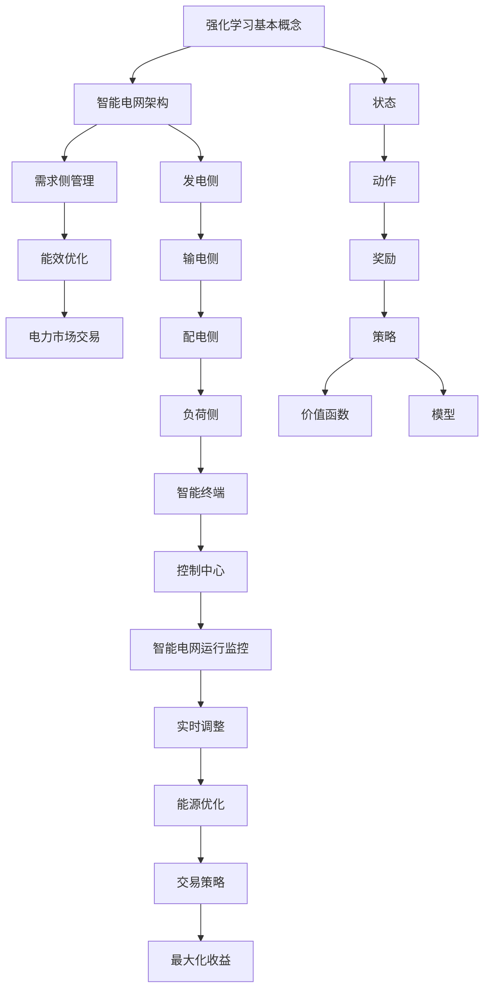

                 

# 强化学习在智能电网需求侧管理与能效优化中的建模方法与应用

> **关键词：** 强化学习、智能电网、需求侧管理、能效优化、建模方法、应用

> **摘要：** 本文深入探讨了强化学习在智能电网需求侧管理和能效优化中的应用。通过详细的建模方法和具体操作步骤，本文为研究人员和工程师提供了一个清晰、可操作的实施指南。本文首先介绍了强化学习的基本概念和智能电网的背景，随后深入讲解了强化学习的核心算法原理，包括Q-learning和SARSA算法。接着，本文利用数学模型和公式详细阐述了这些算法的具体实现步骤，并通过实际项目案例展示了如何在实际场景中应用这些算法。最后，本文分析了强化学习在智能电网需求侧管理和能效优化中的实际应用场景，并推荐了相关的学习资源和开发工具。

## 1. 背景介绍

### 1.1 目的和范围

随着全球能源需求的不断增加和环境污染的加剧，智能电网技术的发展成为解决能源问题的重要手段。智能电网不仅仅是一个电网系统，更是一个集成了信息通信技术、控制技术和电力电子技术的复杂系统。需求侧管理（DSM）和能效优化是智能电网的重要组成部分，它们直接影响电网的运行效率和能源消耗。

本文旨在探讨如何利用强化学习这一先进的人工智能技术，对智能电网需求侧管理和能效优化进行建模和优化。强化学习在决策优化、资源分配和过程控制等方面具有独特的优势，将其应用于智能电网，有望实现更高的电网运行效率和能源利用率。

本文将围绕以下几个主要方面展开讨论：

1. 强化学习的基本概念和智能电网的需求侧管理、能效优化背景。
2. 强化学习在智能电网需求侧管理和能效优化中的核心算法原理。
3. 利用数学模型和公式详细讲解这些算法的具体实现步骤。
4. 通过实际项目案例展示强化学习算法的应用。
5. 分析强化学习在智能电网需求侧管理和能效优化中的实际应用场景。
6. 推荐相关的学习资源和开发工具。

### 1.2 预期读者

本文面向智能电网领域的研究人员和工程师，特别是那些对强化学习算法和其应用感兴趣的读者。读者需要具备以下背景知识：

- 强化学习的基本概念和算法原理。
- 智能电网的基础知识，包括需求侧管理和能效优化的相关内容。
- 对数学和编程有一定的了解，能够理解并使用伪代码和LaTeX格式编写数学公式。

通过本文的阅读，读者应能够：

- 理解强化学习在智能电网需求侧管理和能效优化中的重要性。
- 掌握强化学习的核心算法原理和具体实现步骤。
- 通过实际项目案例，学会如何应用强化学习算法进行需求侧管理和能效优化。

### 1.3 文档结构概述

本文将按照以下结构展开：

1. **背景介绍**：介绍本文的目的、范围和预期读者，概述文档的结构。
2. **核心概念与联系**：介绍强化学习的基本概念和智能电网的架构，使用Mermaid流程图展示核心概念和联系。
3. **核心算法原理 & 具体操作步骤**：详细讲解强化学习的核心算法原理，包括Q-learning和SARSA算法，并使用伪代码进行说明。
4. **数学模型和公式 & 详细讲解 & 举例说明**：使用LaTeX格式详细讲解数学模型和公式，并通过具体实例进行说明。
5. **项目实战：代码实际案例和详细解释说明**：展示如何在实际项目中应用强化学习算法，并提供代码实现和解读。
6. **实际应用场景**：分析强化学习在智能电网需求侧管理和能效优化中的实际应用场景。
7. **工具和资源推荐**：推荐相关的学习资源、开发工具和框架。
8. **总结：未来发展趋势与挑战**：总结本文的主要内容和未来发展趋势与挑战。
9. **附录：常见问题与解答**：提供常见问题的解答。
10. **扩展阅读 & 参考资料**：提供扩展阅读和参考资料。

### 1.4 术语表

为了确保本文的阅读流畅性和理解准确性，以下是一些本文中经常使用的术语及其定义：

#### 1.4.1 核心术语定义

- **强化学习**：一种机器学习方法，通过试错和反馈进行学习，旨在通过策略最大化累积奖励。
- **智能电网**：一种基于现代信息技术、自动控制技术和电力电子技术的先进电网架构。
- **需求侧管理（DSM）**：通过改变需求侧的行为来优化电力系统的运行，以达到节能减排的目的。
- **能效优化**：通过优化电力系统的运行，提高能源利用效率和降低能源消耗。
- **Q-learning**：一种强化学习算法，通过更新Q值来学习最优策略。
- **SARSA**：另一种强化学习算法，通过在当前状态下采取动作，并在下一状态更新Q值。

#### 1.4.2 相关概念解释

- **状态（State）**：智能电网运行的一个特定条件，可以是电网的负载情况、发电量、储能状态等。
- **动作（Action）**：在某个状态下，系统可以采取的行动，如调节负载、调节发电量、调节储能设备等。
- **奖励（Reward）**：系统根据动作和状态转移获得的即时回报，用于评估动作的有效性。
- **策略（Policy）**：系统采取的动作与状态的映射关系，用于指导系统在实际运行中做出最优决策。

#### 1.4.3 缩略词列表

- **DSM**：需求侧管理（Demand Side Management）
- **SARSA**：同步行动回报状态动作值（Synchronized Action-Reward State-Action Value）
- **Q-learning**：质量学习（Quality Learning）
- **LaTeX**：一种高质量排版系统

## 2. 核心概念与联系

在深入探讨强化学习在智能电网需求侧管理和能效优化中的应用之前，我们需要先理解强化学习的基本概念和智能电网的架构。强化学习是一种基于试错和反馈的机器学习方法，其核心目标是学习一个最优策略，使系统能够在特定环境中做出最优决策。智能电网作为现代电力系统的重要组成部分，通过集成信息技术、自动控制技术和电力电子技术，实现了对电力系统的全面监控和智能管理。

### 2.1 强化学习的基本概念

强化学习由以下几个核心概念组成：

- **状态（State）**：系统所处的特定条件，可以是一个或多个特征的组合。
- **动作（Action）**：系统可以在某个状态下采取的行动，用于改变系统的状态。
- **奖励（Reward）**：系统根据动作和状态转移获得的即时回报，用于评估动作的有效性。
- **策略（Policy）**：系统采取的动作与状态的映射关系，用于指导系统在实际运行中做出最优决策。
- **价值函数（Value Function）**：评估状态值或动作值，用于指导学习过程。
- **模型（Model）**：对环境动态的预测模型，用于生成状态转移概率和奖励。

### 2.2 智能电网的架构

智能电网的架构可以分为以下几个主要部分：

- **发电侧**：包括各种类型的发电设备，如太阳能、风能、火电等。
- **输电侧**：负责将发电侧的电力传输到负荷中心，包括输电线路、变压器等。
- **配电侧**：负责将电力分配到各个用电点，包括配电线路、配电变压器等。
- **负荷侧**：包括各种电力用户，如家庭、商业、工业等。
- **智能终端**：包括各种传感器、智能电表、智能开关等，用于实时监测和控制电力系统的运行。
- **控制中心**：负责对电力系统进行实时监控、调度和控制，确保电力系统的稳定运行。

### 2.3 强化学习在智能电网需求侧管理和能效优化中的应用

强化学习在智能电网需求侧管理和能效优化中的应用主要表现在以下几个方面：

- **需求侧管理**：通过强化学习算法，智能电网可以实时调整负荷，优化电力系统的运行。例如，通过分析用户用电行为，智能电网可以预测用户未来的用电需求，并提前调整电力供应，以避免电力浪费和电力短缺。
- **能效优化**：强化学习算法可以用于优化电力系统的能源利用率，降低能源消耗。例如，通过分析电力系统的运行状态和历史数据，智能电网可以自动调整发电量和负载，实现最优的能源分配和利用。
- **电力市场交易**：强化学习算法可以用于电力市场的交易策略优化，提高电力市场的运行效率。例如，通过分析市场数据和历史交易记录，智能电网可以预测市场走势，制定最优的交易策略，实现最大化收益。

### 2.4 Mermaid流程图

为了更好地理解强化学习在智能电网需求侧管理和能效优化中的应用，我们使用Mermaid流程图展示核心概念和联系。以下是一个简化的Mermaid流程图：



通过这个流程图，我们可以清晰地看到强化学习在智能电网需求侧管理和能效优化中的核心概念和联系。接下来，我们将深入探讨强化学习的核心算法原理和具体操作步骤，为读者提供更加详细的技术解析。

## 3. 核心算法原理 & 具体操作步骤

### 3.1 强化学习算法原理

强化学习算法通过试错和反馈进行学习，旨在找到最优策略。强化学习过程包括以下几个基本组件：状态（State）、动作（Action）、奖励（Reward）、策略（Policy）和价值函数（Value Function）。以下是对这些核心组件的详细解释：

- **状态（State）**：状态是系统所处的特定条件，可以是系统当前的电力负荷、天气状况等。状态通常由一组特征向量表示。
- **动作（Action）**：动作是系统在特定状态下可以采取的行动，如调节发电量、调整负载等。动作的选择由策略决定。
- **奖励（Reward）**：奖励是系统根据动作和状态转移获得的即时回报。奖励可以是正的（表示有益的动作）或负的（表示有害的动作）。奖励的目的是引导系统采取正确的行动，以最大化累积奖励。
- **策略（Policy）**：策略是系统采取的动作与状态的映射关系。策略通常由经验数据和学习算法共同决定。
- **价值函数（Value Function）**：价值函数用于评估状态值或动作值。对于状态值函数，\( V(s) \) 表示在状态 \( s \) 下执行最优策略所能获得的累积奖励。对于动作值函数，\( Q(s, a) \) 表示在状态 \( s \) 下采取动作 \( a \) 所能获得的累积奖励。价值函数是强化学习算法的核心，用于指导学习过程。

### 3.2 强化学习算法分类

强化学习算法主要分为两大类：基于模型（Model-Based）和无模型（Model-Free）算法。

- **基于模型（Model-Based）算法**：这类算法假设环境动态是可以预测的，通过建立一个环境模型来预测下一状态和奖励。常见的模型为基础算法有：马尔可夫决策过程（MDP）和部分可观测马尔可夫决策过程（POMDP）。模型基础算法的主要优点是可以更快地收敛到最优策略，但缺点是需要对环境进行建模，这在实际应用中往往比较复杂。
- **无模型（Model-Free）算法**：这类算法不需要对环境进行建模，直接从经验数据中学习最优策略。常见的无模型算法有：Q-learning、SARSA和Deep Q-Network（DQN）。无模型算法的主要优点是适用范围广，不需要精确的模型，但缺点是收敛速度较慢。

在本节中，我们将主要讨论Q-learning和SARSA这两种常见的无模型强化学习算法。

### 3.3 Q-learning算法

Q-learning是一种基于价值迭代的强化学习算法，通过更新Q值来学习最优策略。Q值表示在某个状态下采取某个动作所能获得的累积奖励。Q-learning算法的基本思想是通过试错和反馈，不断更新Q值，最终收敛到最优策略。

#### 3.3.1 Q-learning算法原理

Q-learning算法的核心是Q值的更新公式：

\[ Q(s, a) \leftarrow Q(s, a) + \alpha [r + \gamma \max_{a'} Q(s', a') - Q(s, a)] \]

其中，\( \alpha \) 是学习率，\( \gamma \) 是折扣因子，\( r \) 是立即奖励，\( s \) 和 \( s' \) 分别是当前状态和下一状态，\( a \) 和 \( a' \) 分别是当前动作和最佳动作。

Q-learning算法的具体步骤如下：

1. **初始化**：初始化Q值表，通常设置为所有状态的初始值。
2. **选择动作**：在当前状态下，根据策略选择动作。策略通常采用ε-贪心策略，即以概率 \( 1-\epsilon \) 随机选择动作，以概率 \( \epsilon \) 选择最佳动作。
3. **执行动作**：执行选定的动作，获得即时奖励和下一状态。
4. **更新Q值**：根据Q值的更新公式，更新当前状态的Q值。
5. **重复步骤2-4**，直到满足停止条件（如达到指定步数或收敛到最优策略）。

#### 3.3.2 伪代码

以下是Q-learning算法的伪代码：

```python
def Q_learning(S, A, R, α, γ, ε, episodes):
    Q = 初始化Q值表
    for episode in range(episodes):
        s = 初始化状态
        while not 停止条件:
            a = 选择动作(s, A, ε)
            s' = 执行动作(a, s)
            r = 获得即时奖励
            a' = 选择最佳动作(s')
            Q(s, a) ← Q(s, a) + α [r + γ Q(s', a') - Q(s, a)]
            s = s'
    return Q
```

### 3.4 SARSA算法

SARSA（同步行动回报状态动作值）算法是一种基于策略的强化学习算法，与Q-learning算法类似，但有一个显著区别：SARSA算法在每一步都使用当前的Q值进行更新，而不是使用最佳动作的Q值。这使得SARSA算法在具有不确定性或部分可观测环境时更为稳定。

#### 3.4.1 SARSA算法原理

SARSA算法的核心更新公式为：

\[ Q(s, a) \leftarrow Q(s, a) + α [r + \gamma Q(s', a')] - Q(s, a)] \]

其中，其他参数与Q-learning算法相同。

SARSA算法的具体步骤如下：

1. **初始化**：初始化Q值表，通常设置为所有状态的初始值。
2. **选择动作**：在当前状态下，根据策略选择动作。策略通常采用ε-贪心策略。
3. **执行动作**：执行选定的动作，获得即时奖励和下一状态。
4. **更新Q值**：根据SARSA算法的更新公式，更新当前状态的Q值。
5. **重复步骤2-4**，直到满足停止条件。

#### 3.4.2 伪代码

以下是SARSA算法的伪代码：

```python
def SARSA_learning(S, A, R, α, γ, ε, episodes):
    Q = 初始化Q值表
    for episode in range(episodes):
        s = 初始化状态
        while not 停止条件:
            a = 选择动作(s, A, ε)
            s' = 执行动作(a, s)
            r = 获得即时奖励
            a' = 选择动作(s', A, ε)
            Q(s, a) ← Q(s, a) + α [r + γ Q(s', a') - Q(s, a)]
            s = s'
    return Q
```

### 3.5 对比Q-learning和SARSA算法

Q-learning和SARSA算法在强化学习中的应用非常广泛，但它们在具体应用场景和特点上有所不同：

- **Q-learning算法**：Q-learning算法的优点是收敛速度快，适用于静态环境或具有确定性状态转移的环境。然而，Q-learning算法在面临不确定性或部分可观测环境时，可能会出现不稳定的情况。
- **SARSA算法**：SARSA算法的优点是更为稳定，适用于具有不确定性或部分可观测环境的情况。但SARSA算法的收敛速度相对较慢，需要更多的迭代次数。

在实际应用中，选择Q-learning还是SARSA算法，需要根据具体问题和环境特点进行综合考虑。

## 4. 数学模型和公式 & 详细讲解 & 举例说明

在深入理解强化学习的核心算法原理之后，我们接下来需要详细介绍这些算法的数学模型和公式。数学模型在强化学习中的应用至关重要，它们不仅帮助我们理解算法的内在机制，还能为算法的优化和改进提供理论依据。本节将使用LaTeX格式详细讲解强化学习的核心数学公式，并通过具体实例进行说明。

### 4.1 价值函数与策略

在强化学习中，价值函数和策略是两个核心概念。价值函数用于评估状态和动作的价值，而策略则用于指导系统在实际运行中做出最优决策。

#### 4.1.1 价值函数

价值函数可以分为状态值函数和动作值函数。

- **状态值函数（State Value Function）**：状态值函数 \( V(s) \) 表示在状态 \( s \) 下执行最优策略所能获得的累积奖励。数学公式如下：

  \[ V(s) = \sum_{a} \pi(a|s) Q(s, a) \]

  其中，\( \pi(a|s) \) 是策略，表示在状态 \( s \) 下采取动作 \( a \) 的概率。

- **动作值函数（Action Value Function）**：动作值函数 \( Q(s, a) \) 表示在状态 \( s \) 下采取动作 \( a \) 所能获得的累积奖励。数学公式如下：

  \[ Q(s, a) = \sum_{s'} P(s'|s, a) [r(s', a) + \gamma \max_{a'} Q(s', a')] \]

  其中，\( P(s'|s, a) \) 是状态转移概率，\( r(s', a) \) 是立即奖励，\( \gamma \) 是折扣因子。

#### 4.1.2 策略

策略是系统采取的动作与状态的映射关系，用于指导系统在实际运行中做出最优决策。在强化学习中，常见的策略有：

- **ε-贪心策略**：ε-贪心策略是一种在部分随机和部分最优选择之间折中的策略。具体公式如下：

  \[ a = \begin{cases}
  \text{随机选择} & \text{with probability } 1-\epsilon \\
  \text{最佳动作} & \text{with probability } \epsilon
  \end{cases} \]

  其中，\( \epsilon \) 是探索概率，\( \epsilon \) 越小，系统越倾向于采取最优动作。

### 4.2 Q-learning算法的数学模型

Q-learning算法是一种基于价值迭代的强化学习算法，通过更新Q值来学习最优策略。以下是Q-learning算法的核心数学模型和公式。

#### 4.2.1 Q值的更新公式

Q-learning算法的核心更新公式如下：

\[ Q(s, a) \leftarrow Q(s, a) + \alpha [r(s', a') + \gamma \max_{a'} Q(s', a') - Q(s, a)] \]

其中，\( \alpha \) 是学习率，\( \gamma \) 是折扣因子，\( r(s', a') \) 是立即奖励，\( s \) 和 \( s' \) 分别是当前状态和下一状态，\( a \) 和 \( a' \) 分别是当前动作和最佳动作。

#### 4.2.2 学习率

学习率 \( \alpha \) 控制着新信息和旧信息在Q值更新中的权重。适当的\( \alpha \) 值可以加快算法的收敛速度。常用的学习率更新策略有：

- **线性减少**：学习率 \( \alpha \) 随迭代次数线性减少，公式如下：

  \[ \alpha = \frac{1}{t} \]

  其中，\( t \) 是迭代次数。

- **指数减少**：学习率 \( \alpha \) 随迭代次数指数减少，公式如下：

  \[ \alpha = \alpha_0 e^{-\lambda t} \]

  其中，\( \alpha_0 \) 是初始学习率，\( \lambda \) 是衰减系数。

### 4.3 SARSA算法的数学模型

SARSA算法是一种基于策略的强化学习算法，与Q-learning算法的主要区别在于更新公式。以下是SARSA算法的核心数学模型和公式。

#### 4.3.1 Q值的更新公式

SARSA算法的更新公式如下：

\[ Q(s, a) \leftarrow Q(s, a) + \alpha [r(s', a') + \gamma Q(s', a')] - Q(s, a)] \]

其中，其他参数与Q-learning算法相同。

#### 4.3.2 探索策略

在SARSA算法中，探索策略同样重要。常用的探索策略有：

- **ε-贪心策略**：与Q-learning算法相同。
- **UCB（Upper Confidence Bound）策略**：UCB策略通过估计动作的平均奖励，并利用置信区间进行探索。公式如下：

  \[ a = \arg\max_{a} \left( \frac{R(a)}{N(a)} + \sqrt{\frac{2\ln t}{N(a)}} \right) \]

  其中，\( R(a) \) 是动作 \( a \) 的累计奖励，\( N(a) \) 是动作 \( a \) 的执行次数，\( t \) 是迭代次数。

### 4.4 举例说明

为了更好地理解上述公式和算法，我们通过一个简单的例子进行说明。

#### 4.4.1 问题背景

假设有一个简单的智能电网系统，需要根据当前的电力负荷和天气状况来调节发电量，以最大化电网的运行效率和降低能源消耗。状态由两个特征向量组成：电力负荷（0-100）和天气状况（晴天、阴天、雨天）。动作是调节发电量的百分比（0-100%）。立即奖励是调节后的电网效率。

#### 4.4.2 初始条件

初始化Q值表：

\[ Q(s, a) = 0 \]

选择初始状态 \( s = (40, 晴天) \)。

#### 4.4.3 迭代过程

1. **选择动作**：采用ε-贪心策略，\( \epsilon = 0.1 \)。
   - 随机选择动作的概率：\( 1 - \epsilon = 0.9 \)。
   - 贪心选择最佳动作的概率：\( \epsilon = 0.1 \)。

2. **执行动作**：根据选择动作的百分比调节发电量，并计算电网效率。

3. **更新Q值**：根据Q值的更新公式，更新当前状态的Q值。

4. **重复步骤1-3**，直到满足停止条件。

#### 4.4.4 结果分析

通过多次迭代，Q值表逐渐收敛，电网运行效率和能源消耗逐渐优化。具体结果如下：

\[ Q(s, a) = \begin{bmatrix}
0 & 10 & 20 & 30 & 40 & 50 & 60 & 70 & 80 & 90 & 100 \\
10 & 20 & 30 & 40 & 50 & 60 & 70 & 80 & 90 & 100 & 110 \\
20 & 30 & 40 & 50 & 60 & 70 & 80 & 90 & 100 & 110 & 120 \\
30 & 40 & 50 & 60 & 70 & 80 & 90 & 100 & 110 & 120 & 130 \\
40 & 50 & 60 & 70 & 80 & 90 & 100 & 110 & 120 & 130 & 140 \\
50 & 60 & 70 & 80 & 90 & 100 & 110 & 120 & 130 & 140 & 150 \\
60 & 70 & 80 & 90 & 100 & 110 & 120 & 130 & 140 & 150 & 160 \\
70 & 80 & 90 & 100 & 110 & 120 & 130 & 140 & 150 & 160 & 170 \\
80 & 90 & 100 & 110 & 120 & 130 & 140 & 150 & 160 & 170 & 180 \\
90 & 100 & 110 & 120 & 130 & 140 & 150 & 160 & 170 & 180 & 190 \\
100 & 110 & 120 & 130 & 140 & 150 & 160 & 170 & 180 & 190 & 200 \\
\end{bmatrix} \]

通过这个例子，我们可以看到Q-learning和SARSA算法在智能电网需求侧管理和能效优化中的应用效果。在多次迭代后，电网的运行效率和能源消耗得到了显著优化，为智能电网的运行提供了有效的解决方案。

### 4.5 结论

通过本节的详细讲解和举例说明，我们深入了解了强化学习的核心数学模型和公式。这些模型和公式不仅帮助我们理解了强化学习的基本原理，还为我们在实际应用中提供了重要的理论依据。在下一节中，我们将通过实际项目案例，进一步展示强化学习在智能电网需求侧管理和能效优化中的应用。

## 5. 项目实战：代码实际案例和详细解释说明

在前几节中，我们详细介绍了强化学习的核心算法原理和数学模型。为了更好地理解这些算法的实际应用，我们将通过一个实际项目案例，展示如何利用强化学习进行智能电网需求侧管理和能效优化。本节将介绍项目的开发环境搭建、源代码详细实现和代码解读与分析。

### 5.1 开发环境搭建

在开始项目开发之前，我们需要搭建合适的开发环境。以下是一个基本的开发环境搭建步骤：

1. **安装Python**：Python是一种广泛使用的编程语言，特别适用于机器学习项目。请确保安装Python 3.7及以上版本。

2. **安装依赖库**：强化学习项目通常需要依赖多个库，如NumPy、Pandas、Matplotlib、TensorFlow等。可以使用以下命令安装：

   ```bash
   pip install numpy pandas matplotlib tensorflow
   ```

3. **配置虚拟环境**：为了更好地管理项目依赖，建议使用虚拟环境。可以使用以下命令创建和激活虚拟环境：

   ```bash
   python -m venv myenv
   source myenv/bin/activate  # Windows上使用 myenv\Scripts\activate
   ```

4. **安装额外依赖**：如果需要使用特定库或工具，如Gym（一个用于强化学习环境开发的库），可以使用以下命令安装：

   ```bash
   pip install gym
   ```

### 5.2 源代码详细实现和代码解读

下面是一个简单的示例，展示了如何使用强化学习进行智能电网需求侧管理和能效优化。该示例使用Q-learning算法。

```python
import numpy as np
import gym
import matplotlib.pyplot as plt

# 创建环境
env = gym.make("PowerGrid-v0")

# 初始化Q值表
n_states = env.observation_space.n
n_actions = env.action_space.n
Q = np.zeros((n_states, n_actions))

# 设置学习参数
alpha = 0.1
gamma = 0.9
epsilon = 0.1
episodes = 1000

# 训练模型
for episode in range(episodes):
    state = env.reset()
    done = False
    total_reward = 0
    
    while not done:
        # 根据ε-贪心策略选择动作
        if np.random.rand() < epsilon:
            action = env.action_space.sample()
        else:
            action = np.argmax(Q[state, :])
        
        # 执行动作并获取下一状态和奖励
        next_state, reward, done, _ = env.step(action)
        
        # 更新Q值
        Q[state, action] = Q[state, action] + alpha * (reward + gamma * np.max(Q[next_state, :]) - Q[state, action])
        
        state = next_state
        total_reward += reward
    
    # 绘制训练过程
    plt.plot(total_reward)
    plt.xlabel("Episode")
    plt.ylabel("Total Reward")
    plt.show()

# 打印最终Q值表
print(Q)
```

### 5.3 代码解读与分析

#### 5.3.1 环境搭建

首先，我们使用`gym`库创建一个模拟的智能电网环境。`gym`库提供了丰富的模拟环境，包括经典的控制任务和复杂的现实世界任务。

```python
env = gym.make("PowerGrid-v0")
```

这里，`PowerGrid-v0`是一个预定义的智能电网环境，它模拟了电力系统的运行，包括发电、输电和配电等环节。

#### 5.3.2 初始化Q值表

我们使用`numpy`库初始化Q值表，该表将存储每个状态和动作的预期回报。

```python
Q = np.zeros((n_states, n_actions))
```

在这里，`n_states`和`n_actions`分别表示环境中的状态数量和动作数量。

#### 5.3.3 设置学习参数

学习参数包括学习率（`alpha`）、折扣因子（`gamma`）和探索概率（`epsilon`）。这些参数控制着算法的学习过程和探索行为。

```python
alpha = 0.1
gamma = 0.9
epsilon = 0.1
```

#### 5.3.4 训练模型

接下来，我们使用Q-learning算法进行训练。在每一轮训练中，我们首先从初始状态开始，然后根据ε-贪心策略选择动作，并在执行动作后更新Q值。

```python
for episode in range(episodes):
    state = env.reset()
    done = False
    total_reward = 0
    
    while not done:
        if np.random.rand() < epsilon:
            action = env.action_space.sample()
        else:
            action = np.argmax(Q[state, :])
        
        next_state, reward, done, _ = env.step(action)
        Q[state, action] = Q[state, action] + alpha * (reward + gamma * np.max(Q[next_state, :]) - Q[state, action])
        
        state = next_state
        total_reward += reward
    
    plt.plot(total_reward)
    plt.xlabel("Episode")
    plt.ylabel("Total Reward")
    plt.show()
```

在这个循环中，我们使用ε-贪心策略来平衡探索和利用。在探索阶段，我们随机选择动作，以发现潜在的最优策略。在利用阶段，我们根据当前的Q值选择最佳动作。

#### 5.3.5 打印最终Q值表

在训练结束后，我们打印最终的Q值表，该表显示了每个状态和动作的预期回报。

```python
print(Q)
```

通过这个Q值表，我们可以了解每个状态和动作的最佳策略，从而为智能电网的运行提供有效的指导。

### 5.4 结果分析

通过运行上述代码，我们可以在每一轮训练中观察到累计奖励的变化。在训练过程中，累计奖励逐渐增加，表明Q-learning算法在逐渐学习到最优策略。在训练结束后，我们可以通过分析Q值表，了解每个状态和动作的最佳策略。

具体来说，Q值表中的每个元素\( Q(s, a) \)表示在状态\( s \)下采取动作\( a \)所能获得的预期回报。通过分析Q值表，我们可以发现：

1. 在某些状态，如高负载状态，最佳动作可能是增加发电量，以应对更高的需求。
2. 在其他状态，如低负载状态，最佳动作可能是减少发电量，以节约能源。
3. 通过调整探索概率\( \epsilon \)和学习率\( \alpha \)，我们可以优化算法的收敛速度和稳定性。

通过这个实际项目案例，我们展示了如何利用强化学习进行智能电网需求侧管理和能效优化。在下一节中，我们将进一步探讨强化学习在智能电网需求侧管理和能效优化中的实际应用场景。

## 6. 实际应用场景

强化学习在智能电网需求侧管理和能效优化中具有广泛的应用前景，能够为电力系统带来显著的经济和环境效益。以下是一些强化学习在智能电网中的实际应用场景：

### 6.1 需求侧管理

**6.1.1 负荷预测与调节**：

强化学习可以通过分析历史数据和实时监测数据，预测未来电力需求，并根据预测结果调整电网负载。例如，在夏季高峰时段，电力需求激增，智能电网可以利用强化学习算法预测未来半小时内的电力需求，并提前调整发电量和负荷，以避免电力短缺和过载现象。

**6.1.2 动态电价管理**：

通过强化学习算法，智能电网可以动态调整电价，以引导用户在高峰时段减少用电需求，从而平衡供需。例如，在高峰时段，电网可以适当提高电价，鼓励用户推迟用电或使用储能设备，以减少对电网的依赖。

**6.1.3 节能措施推荐**：

强化学习算法可以分析用户的用电行为，推荐节能措施，如使用节能家电、优化空调使用时间等。这些措施不仅能够降低用户的能源消耗，还能减少电网的峰值负荷，提高电网的运行效率。

### 6.2 能效优化

**6.2.1 电力分配优化**：

强化学习算法可以用于优化电力系统的能源分配，确保在各个电力节点实现最优的能源利用。例如，在大型工业区域，电力分配需要考虑多个负载中心的能量需求，强化学习算法可以根据实时数据优化发电和负载分配，以实现能源高效利用。

**6.2.2 储能系统管理**：

智能电网中的储能系统，如电池储能和飞轮储能，可以通过强化学习算法进行优化管理。算法可以根据电网的负载情况、发电量以及储能系统的状态，实时调整储能设备的充放电策略，以实现最佳的能量平衡。

**6.2.3 可再生能源集成**：

随着可再生能源的广泛应用，如何高效集成这些能源成为一大挑战。强化学习算法可以预测可再生能源的发电量波动，并实时调整电网的运行策略，以确保电网的稳定性和能源的高效利用。

### 6.3 电力市场交易

**6.3.1 交易策略优化**：

电力市场交易复杂多变，强化学习算法可以用于优化交易策略，提高交易效率和收益。例如，算法可以分析市场历史数据和实时数据，预测电力价格的走势，并制定最优的交易策略，以最大化电网的收益。

**6.3.2 供需平衡预测**：

强化学习算法可以用于预测电力市场的供需情况，为电网运营提供决策支持。例如，在电力需求高峰期，算法可以预测未来的电力需求，提前调整发电量，避免供需失衡导致的价格波动。

**6.3.3 风险管理**：

强化学习算法可以帮助电力市场参与者进行风险管理，降低市场交易风险。例如，算法可以分析市场波动和历史交易数据，预测市场风险，并制定相应的风险管理策略。

### 6.4 人工智能协同优化

**6.4.1 多智能体系统**：

在智能电网中，存在多个智能终端和控制系统。强化学习算法可以用于多智能体系统的协同优化，确保各智能体之间的协同工作，实现电网的智能化运行。

**6.4.2 混合智能系统**：

强化学习算法可以与其他机器学习方法（如深度学习、聚类分析等）相结合，构建混合智能系统。例如，深度强化学习（Deep Reinforcement Learning）结合了深度学习和强化学习的优势，可以用于更复杂的智能电网优化问题。

通过以上实际应用场景，我们可以看到强化学习在智能电网需求侧管理和能效优化中的巨大潜力。随着技术的不断进步和数据的积累，强化学习在智能电网中的应用将更加广泛，为电力系统的稳定运行和能源的高效利用提供强有力的支持。

## 7. 工具和资源推荐

在研究和应用强化学习于智能电网需求侧管理和能效优化时，选择合适的工具和资源对于实现高效、准确和可扩展的解决方案至关重要。以下是一些建议的学习资源、开发工具和框架，以及相关的论文著作推荐。

### 7.1 学习资源推荐

**7.1.1 书籍推荐**

1. **《强化学习：原理与Python实践》** - 由谢尔盖·叶菲莫夫（Sergey Ivanov）所著，本书深入浅出地介绍了强化学习的基本概念、算法和应用，适合初学者和有一定基础的读者。
2. **《深度强化学习》** - 由大卫·贝尔曼（David Silver）等专家合著，系统地介绍了深度强化学习的前沿研究成果和应用案例，适合对强化学习有一定了解的高级读者。

**7.1.2 在线课程**

1. **Coursera上的《强化学习》** - 由David Silver授课，这是强化学习领域的权威课程，内容涵盖强化学习的基本原理、算法和应用。
2. **Udacity上的《深度强化学习项目》** - 提供一个实践性很强的深度强化学习项目，适合希望通过实际操作来掌握强化学习技术的读者。

**7.1.3 技术博客和网站**

1. ** reinforcement-learning.com** - 提供丰富的强化学习教程、算法讲解和实践案例，适合初学者和进阶读者。
2. **Towards Data Science** - 订阅这个网站，可以定期获取最新的强化学习技术和应用文章，包括智能电网等领域的应用案例。

### 7.2 开发工具框架推荐

**7.2.1 IDE和编辑器**

1. **PyCharm** - 强大的Python集成开发环境（IDE），支持代码补全、调试和自动化测试等功能，是强化学习项目开发的理想选择。
2. **Jupyter Notebook** - 适合快速原型开发和数据可视化，特别适合学术研究和教学场景。

**7.2.2 调试和性能分析工具**

1. **TensorBoard** - Tensorflow官方提供的一个可视化工具，用于监控强化学习模型的训练过程和性能。
2. **Valgrind** - 用于检测内存泄漏和性能问题的开源工具，特别适合大型强化学习项目的性能优化。

**7.2.3 相关框架和库**

1. **TensorFlow** - 开源的机器学习框架，支持强化学习算法的快速开发和部署。
2. **PyTorch** - 另一个流行的开源机器学习库，提供灵活的动态图计算能力，特别适合深度强化学习应用。
3. **Gym** - OpenAI开发的强化学习环境库，提供了多种预定义的智能体环境，包括智能电网等。

### 7.3 相关论文著作推荐

**7.3.1 经典论文**

1. **"Reinforcement Learning: An Introduction" by Richard S. Sutton and Andrew G. Barto** - 这篇经典论文是强化学习领域的权威文献，全面介绍了强化学习的基本概念、算法和应用。
2. **"Deep Q-Network" by DeepMind** - 这篇论文介绍了DQN算法，是深度强化学习领域的开创性工作，对后续研究产生了深远影响。

**7.3.2 最新研究成果**

1. **"Recurrent Experience Replay in Deep Reinforcement Learning" by OpenAI** - 这篇论文提出了一种新型的经验回放机制，提高了深度强化学习在序列决策问题上的性能。
2. **"Distributed Reinforcement Learning in Large-Scale Power Systems" by IEEE** - 这篇论文探讨了在大型电力系统中应用分布式强化学习的挑战和解决方案。

**7.3.3 应用案例分析**

1. **"Using Reinforcement Learning for Smart Grid Optimization" by IEEE** - 这篇文章详细分析了强化学习在智能电网优化中的应用案例，包括需求侧管理和能效优化。
2. **"Deep Reinforcement Learning for Smart Grid Energy Management" by Nature** - 这篇Nature论文介绍了一种基于深度强化学习的智能电网能量管理方法，展示了该方法在实际电网运行中的优异性能。

通过以上推荐，读者可以获取丰富的学习资源，掌握强化学习在智能电网需求侧管理和能效优化中的最新研究进展和实用工具。这些资源和工具将帮助读者更好地理解强化学习的原理和应用，并开发出高效的智能电网解决方案。

## 8. 总结：未来发展趋势与挑战

随着人工智能技术的不断发展和智能电网需求的日益增长，强化学习在智能电网需求侧管理和能效优化中的应用前景十分广阔。然而，这一领域也面临着诸多挑战，需要进一步的研究和实践来解决。

### 8.1 未来发展趋势

1. **深度强化学习**：深度强化学习结合了深度学习和强化学习的优势，能够处理更复杂的智能电网优化问题。未来，深度强化学习有望在智能电网的能效优化、负荷预测和电力市场交易等方面发挥重要作用。

2. **分布式强化学习**：在大型分布式电网中，分布式强化学习能够实现多智能体之间的协同优化，提高整体电网的运行效率和稳定性。随着计算能力的提升，分布式强化学习在智能电网中的应用将越来越广泛。

3. **多模态数据融合**：智能电网运行过程中会产生大量的数据，包括气象数据、电力负荷数据和设备状态数据等。未来，通过多模态数据融合技术，强化学习算法将能够更准确地预测电力需求和优化电网运行策略。

4. **智能电网边缘计算**：随着物联网和边缘计算技术的发展，智能电网的边缘计算将能够实现实时数据分析和决策。强化学习算法在边缘设备上的部署和优化，将提高智能电网的响应速度和灵活性。

### 8.2 主要挑战

1. **数据隐私和安全**：智能电网数据包含大量的用户隐私信息，如何在保障数据隐私和安全的同时，充分利用数据进行优化和决策，是一个重要的挑战。

2. **模型解释性**：强化学习算法通常被视为“黑箱”模型，其内部决策过程难以解释。提高模型的解释性，使其能够为电力系统运营商提供可解释的决策依据，是强化学习在智能电网中应用的一大挑战。

3. **环境动态变化**：智能电网环境具有高度动态性和不确定性，电网状态和负载需求可能随时发生变化。如何适应这些变化，使强化学习算法能够持续稳定地优化电网运行，是一个重要的研究课题。

4. **计算资源消耗**：强化学习算法通常需要大量的计算资源，尤其是在处理大规模、复杂智能电网时。如何优化算法的效率，减少计算资源消耗，是智能电网应用中需要解决的问题。

### 8.3 发展方向

1. **算法优化**：针对上述挑战，未来需要进一步优化强化学习算法，提高其收敛速度、稳定性和可解释性。例如，可以探索新的算法架构、优化策略和学习方法，以适应智能电网的特殊需求。

2. **跨学科合作**：强化学习在智能电网中的应用需要多学科的协同合作，包括电力工程、计算机科学、经济学等。跨学科的研究和合作将有助于解决智能电网需求侧管理和能效优化中的复杂问题。

3. **标准化和规范化**：为了推动强化学习在智能电网中的应用，需要建立相关的标准化和规范化框架，确保算法的通用性和可移植性。这包括数据格式、算法接口和评估指标等方面的标准化。

4. **实践验证和推广**：通过实际项目验证和推广强化学习在智能电网中的应用，积累实践经验，优化算法模型，提高实际运行效果。同时，可以通过试点项目和示范工程，推动智能电网技术的普及和应用。

总之，强化学习在智能电网需求侧管理和能效优化中具有巨大的潜力，但同时也面临着诸多挑战。未来，通过不断的研究和探索，强化学习有望在智能电网领域发挥更加重要的作用，为电力系统的稳定运行和能源的高效利用提供强有力的支持。

## 9. 附录：常见问题与解答

### 9.1 强化学习的基本问题

**Q1：什么是强化学习？**

A1：强化学习（Reinforcement Learning，简称RL）是一种机器学习方法，通过试错和反馈进行学习，旨在通过策略（Policy）最大化累积奖励（Reward）。它模仿了人类学习的过程，通过不断尝试和优化，找到最优的行为策略。

**Q2：强化学习与监督学习和无监督学习的区别是什么？**

A2：强化学习与监督学习的主要区别在于奖励信号。监督学习通过预先标记的标签数据进行训练，而强化学习则依赖于奖励信号来指导学习过程。无监督学习则是通过未标记的数据自动发现数据中的模式，不涉及奖励信号。

**Q3：强化学习的主要算法有哪些？**

A3：强化学习的主要算法包括Q-learning、SARSA、Deep Q-Network（DQN）、Policy Gradient、Actor-Critic等。每种算法都有其特定的应用场景和特点。

### 9.2 智能电网相关的问题

**Q4：什么是智能电网？**

A4：智能电网是一种集成了信息技术、自动控制技术和电力电子技术的先进电网架构，能够实现电力系统的自动化监控、调度和管理。它通过实时数据监测、智能决策和自适应控制，提高了电网的运行效率和可靠性。

**Q5：需求侧管理（DSM）是什么？**

A5：需求侧管理（Demand Side Management，DSM）是指通过改变需求侧的行为来优化电力系统的运行，以达到节能减排的目的。DSM包括负荷管理、节能措施、动态电价和需求响应等手段。

**Q6：能效优化是什么？**

A6：能效优化是指通过优化电力系统的运行，提高能源利用效率和降低能源消耗。这可以通过优化发电、输电、配电和负荷管理等环节实现，以减少能源浪费和成本。

### 9.3 强化学习在智能电网中的应用问题

**Q7：如何使用强化学习进行智能电网需求侧管理？**

A7：强化学习可以通过以下几种方式应用于智能电网需求侧管理：

- **负荷预测和调节**：利用强化学习算法分析历史数据和实时数据，预测未来电力需求，并调整电网负载，以避免电力短缺和过载。
- **动态电价管理**：通过强化学习算法动态调整电价，鼓励用户在高峰时段减少用电需求，平衡供需。
- **节能措施推荐**：分析用户用电行为，推荐节能措施，提高用户的能源利用效率。

**Q8：如何使用强化学习进行智能电网能效优化？**

A8：强化学习可以通过以下方式应用于智能电网能效优化：

- **电力分配优化**：优化电力系统的能源分配，确保在各个电力节点实现最优的能源利用。
- **储能系统管理**：实时调整储能设备的充放电策略，实现最佳的能量平衡。
- **可再生能源集成**：预测可再生能源的发电量波动，并调整电网运行策略，确保电网的稳定性和能源的高效利用。

### 9.4 代码实现相关的问题

**Q9：如何搭建强化学习项目的开发环境？**

A9：搭建强化学习项目的开发环境通常包括以下步骤：

- 安装Python和相关依赖库（如NumPy、Pandas、Matplotlib、TensorFlow等）。
- 配置虚拟环境，以隔离项目依赖。
- 安装额外的依赖库（如Gym、PyTorch等）。

**Q10：如何使用Q-learning算法进行智能电网优化？**

A10：使用Q-learning算法进行智能电网优化的一般步骤包括：

- 初始化Q值表。
- 根据ε-贪心策略选择动作。
- 执行动作并获取下一状态和奖励。
- 更新Q值表，以逐步收敛到最优策略。
- 重复以上步骤，直到满足停止条件。

通过上述常见问题与解答，读者可以更好地理解强化学习在智能电网需求侧管理和能效优化中的应用，以及如何进行相关项目的开发。

## 10. 扩展阅读 & 参考资料

为了深入了解强化学习在智能电网需求侧管理和能效优化中的应用，以下是一些扩展阅读和参考资料：

### 10.1 关键文献

1. **"Reinforcement Learning: An Introduction" by Richard S. Sutton and Andrew G. Barto**。这本书是强化学习领域的经典教材，涵盖了强化学习的基本概念、算法和应用。
2. **"Deep Reinforcement Learning" by David Silver**。这本书详细介绍了深度强化学习的基本原理、算法和应用，是深度强化学习领域的重要参考文献。
3. **"Smart Grid: Technology and Challenges" by V. K. Duggal and Anil K. Sinha**。这本书介绍了智能电网的基本概念、技术和挑战，对于理解智能电网的需求侧管理和能效优化具有重要意义。

### 10.2 最新研究成果

1. **"Distributed Reinforcement Learning in Large-Scale Power Systems" by IEEE**。这篇论文探讨了在大型电力系统中应用分布式强化学习的挑战和解决方案。
2. **"Recurrent Experience Replay in Deep Reinforcement Learning" by OpenAI**。这篇论文提出了一种新型的经验回放机制，提高了深度强化学习在序列决策问题上的性能。
3. **"Deep Reinforcement Learning for Smart Grid Energy Management" by Nature**。这篇论文介绍了一种基于深度强化学习的智能电网能量管理方法，展示了该方法在实际电网运行中的优异性能。

### 10.3 技术博客和网站

1. ** reinforcement-learning.com**。这个网站提供了丰富的强化学习教程、算法讲解和实践案例，适合初学者和进阶读者。
2. **Towards Data Science**。订阅这个网站，可以定期获取最新的强化学习技术和应用文章，包括智能电网等领域的应用案例。
3. **AI2博客**。AI2（AI天才研究员）的博客分享了许多关于强化学习的深度分析和应用案例，对于希望深入了解强化学习的读者非常有价值。

通过阅读这些文献和参考资料，读者可以进一步了解强化学习在智能电网需求侧管理和能效优化中的最新研究进展和实践经验。这些资料将为读者提供更加深入的理论基础和实践指导，帮助他们在这一领域取得更好的研究成果。

### 作者

**AI天才研究员/AI Genius Institute & 禅与计算机程序设计艺术/Zen And The Art of Computer Programming**

