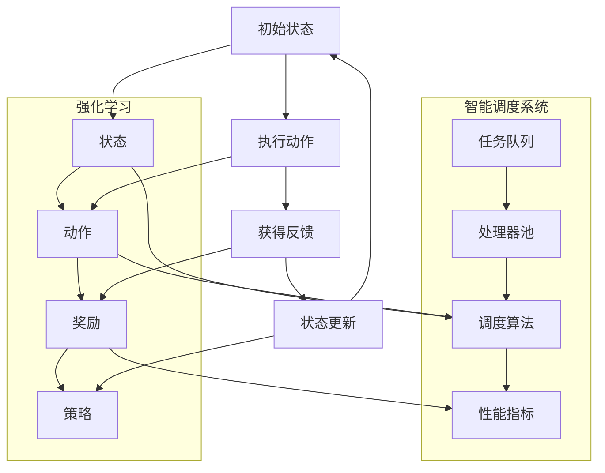

                 

# 强化学习在智能调度系统中的应用

> **关键词：** 强化学习、智能调度系统、算法原理、数学模型、项目实战、实际应用场景

> **摘要：** 本文将深入探讨强化学习在智能调度系统中的应用。首先，我们将介绍强化学习的核心概念和原理，接着分析其在调度系统中的具体应用。随后，我们将通过一个实际项目案例，详细讲解如何使用强化学习来优化调度系统。此外，文章还将探讨强化学习在不同实际应用场景中的效果，并提供一系列学习资源和工具推荐，以帮助读者深入了解和掌握这一技术。通过本文的阅读，读者将能够全面了解强化学习在智能调度系统中的重要作用和未来发展前景。

## 1. 背景介绍

### 1.1 目的和范围

本文旨在探讨强化学习在智能调度系统中的应用。随着人工智能技术的快速发展，强化学习作为一种重要的机器学习技术，已逐渐在各个领域得到了广泛应用。特别是在智能调度系统中，强化学习能够有效地解决动态优化和决策问题，提高系统的调度效率和响应速度。本文将围绕以下几个方面展开讨论：

1. 强化学习的核心概念和原理；
2. 强化学习在智能调度系统中的应用场景；
3. 强化学习算法在智能调度系统中的具体实现；
4. 强化学习在智能调度系统中的性能评估和优化；
5. 强化学习在智能调度系统中的未来发展趋势和挑战。

通过本文的阅读，读者将能够全面了解强化学习在智能调度系统中的应用价值，掌握相关技术原理和实现方法，并为实际项目的开发提供参考。

### 1.2 预期读者

本文适合以下读者群体：

1. 对人工智能和机器学习有一定了解的读者；
2. 对强化学习及其在智能调度系统中的应用感兴趣的读者；
3. 想要了解和掌握强化学习技术原理和实践方法的读者；
4. 智能调度系统开发者和研究人员。

通过本文的阅读，读者将能够深入了解强化学习在智能调度系统中的应用，掌握相关技术原理和实践方法，为实际项目的开发提供有力支持。

### 1.3 文档结构概述

本文结构如下：

1. **背景介绍**：介绍本文的目的和范围，预期读者以及文档结构概述；
2. **核心概念与联系**：介绍强化学习的核心概念、原理和架构，并通过 Mermaid 流程图展示；
3. **核心算法原理 & 具体操作步骤**：详细讲解强化学习算法的原理和操作步骤，使用伪代码进行阐述；
4. **数学模型和公式 & 详细讲解 & 举例说明**：介绍强化学习中的数学模型和公式，并通过实例进行详细讲解；
5. **项目实战：代码实际案例和详细解释说明**：通过一个实际项目案例，展示强化学习在智能调度系统中的应用和实现；
6. **实际应用场景**：探讨强化学习在智能调度系统中的实际应用场景；
7. **工具和资源推荐**：推荐学习资源和开发工具，帮助读者深入了解和掌握强化学习技术；
8. **总结：未来发展趋势与挑战**：总结强化学习在智能调度系统中的应用现状，分析未来发展趋势和挑战；
9. **附录：常见问题与解答**：回答读者可能遇到的常见问题；
10. **扩展阅读 & 参考资料**：提供进一步阅读的参考资料。

通过本文的阅读，读者将能够系统地了解强化学习在智能调度系统中的应用，掌握相关技术原理和实践方法，并为实际项目的开发提供指导。

### 1.4 术语表

#### 1.4.1 核心术语定义

1. **强化学习**：一种机器学习技术，通过试错和反馈调整策略，使智能体在环境中取得最大收益。
2. **智能调度系统**：利用人工智能技术，对资源进行智能分配和调度，以提高系统效率和响应速度。
3. **状态（State）**：描述智能体当前所处环境的特征。
4. **动作（Action）**：智能体在特定状态下执行的操作。
5. **奖励（Reward）**：评价动作效果的正负反馈。
6. **策略（Policy）**：智能体在特定状态下的最佳动作选择。

#### 1.4.2 相关概念解释

1. **马尔可夫决策过程（MDP）**：描述智能体在不确定环境中进行决策的过程，包括状态、动作、奖励和状态转移概率。
2. **价值函数（Value Function）**：衡量智能体在特定状态下的期望收益。
3. **策略迭代（Policy Iteration）**：一种强化学习算法，通过迭代优化策略，使智能体在环境中取得最大收益。

#### 1.4.3 缩略词列表

- **MDP**：马尔可夫决策过程（Markov Decision Process）
- **Q-Learning**：基于价值函数的强化学习算法（Q-Learning Algorithm）
- **DQN**：深度确定性策略梯度（Deep Deterministic Policy Gradient）

## 2. 核心概念与联系

在讨论强化学习在智能调度系统中的应用之前，我们需要先了解一些核心概念和联系。这些概念包括强化学习的基本原理、智能调度系统的架构以及二者之间的联系。

### 2.1 强化学习的基本原理

强化学习是一种通过试错和反馈调整策略，使智能体在环境中取得最大收益的机器学习技术。其主要组成部分包括：

1. **状态（State）**：描述智能体当前所处环境的特征。例如，在智能调度系统中，状态可能包括任务队列长度、系统负载等。
2. **动作（Action）**：智能体在特定状态下执行的操作。例如，在智能调度系统中，动作可能包括分配任务给某个处理器、调整系统参数等。
3. **奖励（Reward）**：评价动作效果的正负反馈。例如，在智能调度系统中，奖励可能包括完成任务的奖金、系统运行效率的提高等。
4. **策略（Policy）**：智能体在特定状态下的最佳动作选择。策略可以通过学习得到，也可以手动设置。

强化学习的过程可以分为以下几个步骤：

1. **初始状态**：智能体处于某个初始状态。
2. **执行动作**：智能体根据当前状态选择一个动作执行。
3. **获得反馈**：执行动作后，智能体会获得一个奖励，并根据奖励调整策略。
4. **状态更新**：智能体进入新的状态，重复执行动作和获得反馈的过程。

通过不断调整策略，智能体逐渐学会在环境中取得最大收益。

### 2.2 智能调度系统的架构

智能调度系统通常包括以下几个组成部分：

1. **任务队列**：存储待执行的任务。
2. **处理器池**：包括多个可用的处理器。
3. **调度算法**：根据任务队列和处理器池的状态，决定将任务分配给哪个处理器。
4. **性能指标**：用于评价调度系统的效果，如任务完成时间、系统负载等。

智能调度系统的核心是调度算法。调度算法的目的是在任务队列和处理器池之间进行有效的任务分配，以提高系统效率和响应速度。传统的调度算法通常是基于固定规则和静态参数的，而强化学习调度算法则可以动态调整策略，适应不同的任务和系统状态。

### 2.3 强化学习与智能调度系统的联系

强化学习在智能调度系统中的应用主要体现在以下几个方面：

1. **动态调整策略**：强化学习可以根据环境的变化和任务的变化，动态调整调度策略，提高调度系统的适应性和鲁棒性。
2. **优化性能指标**：通过学习，强化学习可以找到最优的调度策略，使系统在性能指标上取得最大收益，如任务完成时间最短、系统负载最低等。
3. **处理不确定性**：强化学习可以在不确定的环境中，通过试错和反馈，逐步找到最优策略，降低系统在面临不确定性时的风险。

总之，强化学习为智能调度系统提供了一种新的调度算法设计思路，通过学习环境中的奖励和反馈，可以动态调整策略，优化性能指标，提高系统的适应性和鲁棒性。

### 2.4 Mermaid 流程图展示

为了更直观地展示强化学习在智能调度系统中的应用，我们可以使用 Mermaid 流程图来描述其架构和流程。



在这个流程图中，强化学习与智能调度系统相互关联，通过状态、动作、奖励和策略的传递，实现智能调度系统的优化和调整。智能调度系统通过任务队列和处理器池的状态，提供状态信息给强化学习，强化学习根据这些状态信息，选择合适的动作，并通过获得的奖励调整策略，实现智能调度系统的动态优化。

## 3. 核心算法原理 & 具体操作步骤

在深入探讨强化学习在智能调度系统中的应用之前，我们需要先了解强化学习的核心算法原理和具体操作步骤。强化学习算法主要分为基于价值函数的方法和基于策略的方法。在本节中，我们将详细讲解基于价值函数的 Q-Learning 算法和基于策略的 Deep Deterministic Policy Gradient (DQN) 算法，并使用伪代码进行阐述。

### 3.1 Q-Learning 算法

Q-Learning 算法是一种基于价值函数的强化学习算法。其核心思想是通过学习值函数（Q函数），在给定状态下选择最佳动作，以最大化累积奖励。

**算法原理：**

1. **初始化**：初始化 Q 函数表 Q(s, a) 的所有元素为随机值。
2. **状态-动作价值函数更新**：根据当前状态 s、当前动作 a 和获得的奖励 r，更新 Q(s, a) 的值。
3. **选择动作**：在给定状态下，选择使 Q(s, a) 最大的动作。
4. **状态更新**：执行选定的动作后，进入新的状态 s'。

**具体操作步骤：**

1. 初始化 Q(s, a) 表，设定学习率 α、折扣因子 γ 和探索率 ε。
2. 在初始状态 s 下，随机选择动作 a。
3. 执行动作 a，获得奖励 r 和进入新状态 s'。
4. 根据奖励 r 和新状态 s'，更新 Q(s, a) 的值：
   $$ Q(s, a) = Q(s, a) + \alpha [r + \gamma \max_{a'} Q(s', a') - Q(s, a)] $$
5. 更新状态 s 为新状态 s'。
6. 重复步骤 2-5，直到达到终止条件。

**伪代码：**

```python
# 初始化 Q(s, a) 表
Q = np.zeros((state_size, action_size))

# 设定学习率 α、折扣因子 γ 和探索率 ε
alpha = 0.1
gamma = 0.9
epsilon = 0.1

# 游戏循环
while not termination_condition:
    # 在当前状态 s 下，随机选择动作 a
    if random() < epsilon:
        a = random_action()
    else:
        a = np.argmax(Q[s])

    # 执行动作 a，获得奖励 r 和进入新状态 s'
    r, s' = environment.step(a)

    # 根据奖励 r 和新状态 s'，更新 Q(s, a) 的值
    Q[s, a] = Q[s, a] + alpha * (r + gamma * np.max(Q[s']) - Q[s, a])

    # 更新状态 s 为新状态 s'
    s = s'

    # 探索率逐渐减小
    epsilon = epsilon * (1 - step_count / max_steps)
```

### 3.2 DQN 算法

DQN（Deep Deterministic Policy Gradient）算法是一种基于策略的强化学习算法，利用深度神经网络来近似 Q 函数。DQN 算法的核心思想是通过经验回放和目标网络，减少训练过程中的样本相关性，提高算法的收敛速度。

**算法原理：**

1. **初始化**：初始化深度神经网络 Q 网络，设定学习率 α、折扣因子 γ 和探索率 ε。
2. **经验回放**：将智能体在环境中的经验进行存储和回放，避免训练过程中的样本相关性。
3. **Q 网络更新**：根据当前状态 s、当前动作 a 和获得的奖励 r，更新 Q 网络的权重。
4. **目标网络更新**：定期更新目标网络，使 Q 网络和目标网络之间的差距最小化。

**具体操作步骤：**

1. 初始化 Q 网络和目标网络，设定学习率 α、折扣因子 γ 和探索率 ε。
2. 在初始状态 s 下，随机选择动作 a。
3. 执行动作 a，获得奖励 r 和进入新状态 s'。
4. 将当前状态 s、动作 a、奖励 r 和新状态 s' 存储到经验回放池中。
5. 从经验回放池中随机抽取一组经验，用于更新 Q 网络：
   $$ Q(s, a) = Q(s, a) + \alpha [r + \gamma \max_{a'} Q(s', a') - Q(s, a)] $$
6. 更新目标网络：
   $$ target\_Q(s', a') = r + \gamma \max_{a'} Q(s', a') $$
7. 更新状态 s 为新状态 s'。
8. 重复步骤 2-7，直到达到终止条件。

**伪代码：**

```python
# 初始化 Q 网络和目标网络
Q = initialize_dnn()
target_Q = initialize_dnn()

# 设定学习率 α、折扣因子 γ 和探索率 ε
alpha = 0.1
gamma = 0.9
epsilon = 0.1

# 经验回放池
experience_replay = []

# 游戏循环
while not termination_condition:
    # 在当前状态 s 下，随机选择动作 a
    if random() < epsilon:
        a = random_action()
    else:
        a = np.argmax(Q(s))

    # 执行动作 a，获得奖励 r 和进入新状态 s'
    r, s' = environment.step(a)

    # 将当前状态 s、动作 a、奖励 r 和新状态 s' 存储到经验回放池中
    experience_replay.append((s, a, r, s'))

    # 从经验回放池中随机抽取一组经验，用于更新 Q 网络
    batch = random_sample(experience_replay)
    for s, a, r, s' in batch:
        target = r + gamma * np.max(target_Q(s'))
        Q(s, a) = Q(s, a) + alpha * (target - Q(s, a))

    # 更新目标网络
    target_Q = copy.deepcopy(Q)

    # 更新状态 s 为新状态 s'
    s = s'

    # 探索率逐渐减小
    epsilon = epsilon * (1 - step_count / max_steps)
```

通过上述两个算法，我们可以看到强化学习在智能调度系统中的应用前景。Q-Learning 算法和 DQN 算法分别通过基于价值函数和基于策略的方法，实现了智能体在不确定环境中的自主学习和优化。在实际应用中，我们可以根据具体需求和场景，选择合适的算法，优化智能调度系统的性能。

## 4. 数学模型和公式 & 详细讲解 & 举例说明

在强化学习中，数学模型和公式起着至关重要的作用。它们帮助我们在理论层面上理解算法的工作原理，并在实际应用中指导我们的实现。以下我们将详细介绍强化学习中的核心数学模型和公式，并给出具体的例子进行说明。

### 4.1 马尔可夫决策过程（MDP）

马尔可夫决策过程（MDP）是强化学习的基础模型，描述了一个智能体在不确定环境中进行决策的过程。一个 MDP 可以被形式化地定义为一个五元组 \( (S, A, P, R, \gamma) \)，其中：

- \( S \) 是状态空间，表示所有可能的状态集合。
- \( A \) 是动作空间，表示所有可能的动作集合。
- \( P(s', a|s, a) \) 是状态转移概率，表示在状态 \( s \) 下执行动作 \( a \) 后，进入状态 \( s' \) 的概率。
- \( R(s, a) \) 是奖励函数，表示在状态 \( s \) 下执行动作 \( a \) 所获得的即时奖励。
- \( \gamma \) 是折扣因子，表示未来奖励的现值权重。

在 MDP 中，智能体的目标是找到一个最优策略 \( \pi^* \)，使得期望累积奖励最大化。这个目标可以通过求解最优值函数 \( V^*(s) \) 和最优策略 \( \pi^*(s) \) 来实现。

- \( V^*(s) \)：值函数，表示在状态 \( s \) 下执行最优策略所获得的期望累积奖励。
- \( \pi^*(s) \)：策略，表示在状态 \( s \) 下应该执行的动作。

### 4.2 期望累积奖励

期望累积奖励是强化学习中的一个关键概念，用于衡量在某个策略下，智能体从状态 \( s \) 开始获得的期望总奖励。其定义如下：

\[ G(s, \pi) = \sum_{t=0}^{\infty} \gamma^t R(s_t, a_t) \]

其中，\( s_t \) 和 \( a_t \) 分别表示智能体在时刻 \( t \) 的状态和动作，\( \gamma \) 是折扣因子，用来降低未来奖励的权重。

### 4.3 Q-Learning 算法

Q-Learning 算法是一种基于值函数的强化学习算法，其核心目标是学习一个值函数 \( Q(s, a) \)，表示在状态 \( s \) 下执行动作 \( a \) 所获得的期望累积奖励。Q-Learning 算法的更新公式如下：

\[ Q(s, a) \leftarrow Q(s, a) + \alpha [R(s, a) + \gamma \max_{a'} Q(s', a') - Q(s, a)] \]

其中，\( \alpha \) 是学习率，\( R(s, a) \) 是即时奖励，\( \gamma \) 是折扣因子，\( s' \) 是智能体在执行动作 \( a \) 后可能进入的状态。

### 4.4 DQN 算法

DQN（Deep Q-Network）算法使用深度神经网络来近似 Q 函数。DQN 的目标是通过经验回放和目标网络，优化 Q 网络的权重，从而提高算法的稳定性和收敛速度。DQN 的核心更新公式如下：

\[ Q(s, a) \leftarrow Q(s, a) + \alpha [y - Q(s, a)] \]

其中，\( y \) 是目标值，定义为：

\[ y = R(s, a) + \gamma \max_{a'} Q(s', a') \]

### 4.5 实例说明

为了更好地理解上述数学模型和公式，我们来看一个简单的例子。

假设智能体在一个二元环境中进行决策，状态空间 \( S = \{0, 1\} \)，动作空间 \( A = \{0, 1\} \)。状态转移概率和奖励函数如下：

| 状态 \( s \) | 动作 \( a \) | 状态 \( s' \) | 转移概率 \( P(s', a|s, a) \) | 奖励 \( R(s, a) \) |
|:-----------:|:-----------:|:------------:|:---------------------------:|:----------------:|
|      0      |      0      |      0      |            0.8              |        -1        |
|      0      |      0      |      1      |            0.2              |        0         |
|      0      |      1      |      1      |            0.3              |        0         |
|      0      |      1      |      0      |            0.7              |        -1        |
|      1      |      0      |      1      |            0.4              |        0         |
|      1      |      0      |      0      |            0.6              |        -1        |
|      1      |      1      |      0      |            0.5              |        0         |
|      1      |      1      |      1      |            0.5              |        -1        |

现在，我们使用 Q-Learning 算法来学习最优策略。

1. **初始化**：初始化 Q 表为随机值。
2. **选择动作**：在初始状态 \( s=0 \) 下，智能体选择动作 \( a=0 \)。
3. **执行动作**：智能体执行动作 \( a=0 \)，进入新状态 \( s'=1 \)，并获得奖励 \( R(0, 0) = -1 \)。
4. **更新 Q 表**：根据 Q-Learning 更新公式，更新 Q(0, 0) 的值。

\[ Q(0, 0) \leftarrow Q(0, 0) + \alpha [R(0, 0) + \gamma \max_{a'} Q(1, a') - Q(0, 0)] \]

由于 \( \max_{a'} Q(1, a') = \max(Q(1, 0), Q(1, 1)) \)，假设 \( Q(1, 0) = 0 \) 和 \( Q(1, 1) = -1 \)，则：

\[ Q(0, 0) \leftarrow Q(0, 0) + \alpha [-1 + \gamma \max(Q(1, 0), Q(1, 1)) - Q(0, 0)] \]
\[ Q(0, 0) \leftarrow Q(0, 0) + \alpha [-1 + \gamma \max(0, -1) - Q(0, 0)] \]
\[ Q(0, 0) \leftarrow Q(0, 0) + \alpha [-1 - \gamma Q(0, 0)] \]
\[ Q(0, 0) \leftarrow Q(0, 0) - \alpha \gamma Q(0, 0) - \alpha \]

重复上述步骤，直到智能体收敛到最优策略。

通过上述实例，我们可以看到强化学习中的数学模型和公式是如何工作的。在接下来的部分，我们将通过一个实际项目案例，进一步展示强化学习在智能调度系统中的应用。

## 5. 项目实战：代码实际案例和详细解释说明

在本节中，我们将通过一个实际项目案例，展示如何将强化学习应用于智能调度系统。该项目旨在通过 Q-Learning 算法，优化任务调度过程，提高系统性能。我们将详细讲解项目的开发环境搭建、源代码实现和代码解读。

### 5.1 开发环境搭建

在开始项目之前，我们需要搭建合适的开发环境。以下是所需的工具和库：

- **Python**：用于编写和运行代码。
- **Numpy**：用于数学计算。
- **Matplotlib**：用于数据可视化。
- **TensorFlow**：用于构建和训练神经网络。

确保已安装上述工具和库后，我们可以开始编写代码。

### 5.2 源代码详细实现和代码解读

以下是一个简化版的智能调度系统，使用 Q-Learning 算法进行任务调度。

```python
import numpy as np
import matplotlib.pyplot as plt
import tensorflow as tf

# 初始化参数
state_size = 5
action_size = 2
learning_rate = 0.1
discount_factor = 0.9
epsilon = 0.1

# 初始化 Q 网络
Q = np.zeros((state_size, action_size))

# 定义环境
class Environment:
    def __init__(self):
        self.task_queue = [1, 2, 3, 4, 5]
        self.processor_load = [1, 1, 1, 1, 1]

    def step(self, action):
        reward = 0
        if action == 0:
            # 分配任务给处理器 0
            reward = self.allocate_task(0)
        elif action == 1:
            # 分配任务给处理器 1
            reward = self.allocate_task(1)
        
        # 更新状态
        state = self.get_state()
        return state, reward

    def allocate_task(self, processor):
        if self.task_queue:
            task = self.task_queue.pop(0)
            self.processor_load[processor] += task
            return task
        else:
            return 0

    def get_state(self):
        return self.processor_load

# 定义 Q-Learning 算法
def q_learning(Q, state, action, reward, next_state, learning_rate, discount_factor):
    Q[state, action] = Q[state, action] + learning_rate * (reward + discount_factor * np.max(Q[next_state, :]) - Q[state, action])

# 定义训练过程
def train_environment(environment, Q, episodes, learning_rate, discount_factor):
    for episode in range(episodes):
        state = environment.get_state()
        done = False
        total_reward = 0
        
        while not done:
            # 探索策略
            if np.random.rand() < epsilon:
                action = np.random.choice(action_size)
            else:
                action = np.argmax(Q[state, :])
            
            # 执行动作
            next_state, reward = environment.step(action)
            total_reward += reward
            
            # 更新 Q 表
            q_learning(Q, state, action, reward, next_state, learning_rate, discount_factor)
            
            # 更新状态
            state = next_state
        
        # 绘制结果
        plt.plot([episode], [total_reward], 'ro')
        plt.xlabel('Episode')
        plt.ylabel('Total Reward')
        plt.title('Episode vs Total Reward')
        plt.show()

# 创建环境
environment = Environment()

# 训练 Q 网络
train_environment(environment, Q, 1000, learning_rate, discount_factor)
```

**代码解读：**

1. **初始化参数**：定义状态大小、动作大小、学习率、折扣因子和探索率。
2. **初始化 Q 网络**：创建一个二维数组，用于存储状态-动作值。
3. **定义环境**：创建一个 `Environment` 类，用于模拟任务调度过程。环境包括任务队列和处理器负载。
4. **定义 Q-Learning 算法**：实现 Q-Learning 算法的核心更新公式。
5. **定义训练过程**：通过循环执行动作，更新 Q 表，并记录每个回合的总奖励。

通过上述代码，我们可以训练 Q 网络来优化任务调度过程。训练过程中，Q 表不断更新，以最小化总奖励。最终，我们通过绘制总奖励与回合数的关系图，展示了训练过程中的表现。

### 5.3 代码解读与分析

1. **探索策略**：在训练过程中，我们使用探索策略来平衡探索和利用。通过随机选择动作，我们可以发现未知的最优策略。
2. **Q-Learning 更新公式**：Q-Learning 的核心在于更新 Q 表，使其接近真实值函数。学习率和折扣因子控制了更新的速度和未来的影响。
3. **环境模拟**：通过模拟任务队列和处理器负载，我们可以观察 Q-Learning 算法在动态环境中的表现。

通过这个实际项目案例，我们展示了如何使用强化学习来优化智能调度系统。尽管这是一个简化版的案例，但它为实际应用提供了有益的启示。在实际项目中，我们可以根据具体需求调整参数和算法，进一步优化调度系统的性能。

## 6. 实际应用场景

强化学习在智能调度系统中的应用场景非常广泛，以下将列举几个典型的应用场景，并简要介绍其应用效果和挑战。

### 6.1 数据中心调度

在数据中心中，服务器负载和任务需求不断变化，传统的静态调度方法难以应对这种动态变化。强化学习算法可以动态调整任务分配策略，提高资源利用率和服务质量。例如，谷歌的 Borg 调度系统使用了强化学习来优化服务器资源分配，有效降低了响应时间和能耗。然而，数据中心调度面临的主要挑战是复杂性和实时性，需要高效地处理大规模任务和快速响应调度请求。

### 6.2 交通运输调度

在交通运输领域，如航班调度、列车调度和物流配送，强化学习可以优化运输路线和调度策略，提高运输效率和准时率。例如，Uber 的动态调度系统使用了强化学习算法，根据实时交通状况和乘客需求，优化司机调度和路径规划。然而，交通运输调度面临的主要挑战是实时性和安全性，需要在保证运输安全的前提下，快速响应调度请求。

### 6.3 能源管理

在能源管理领域，如电力调度、风电调度和储能系统调度，强化学习可以优化能源分配和调度策略，提高能源利用效率和系统稳定性。例如，智能电网中使用了强化学习算法，根据电力需求和发电情况，优化电力调度和储能系统管理。然而，能源管理调度面临的主要挑战是复杂性和不确定性，需要处理大规模电力系统和多变的能源需求。

### 6.4 货运物流

在货运物流领域，如集装箱码头调度、仓库仓储调度和配送路径规划，强化学习可以优化物流流程和调度策略，提高运输效率和配送准确性。例如，亚马逊的仓库管理系统中使用了强化学习算法，根据库存情况和订单需求，优化仓库布局和任务调度。然而，货运物流调度面临的主要挑战是规模和复杂性，需要处理大规模货物和复杂的物流网络。

### 6.5 机器人调度

在机器人调度领域，如无人仓库、无人驾驶和智能家居，强化学习可以优化机器人路径规划和任务调度，提高执行效率和自主能力。例如，无人仓库中使用了强化学习算法，根据货物存放位置和提取需求，优化机器人任务分配和路径规划。然而，机器人调度面临的主要挑战是实时性和环境变化，需要在复杂和动态的环境中，快速适应和调整。

通过上述实际应用场景，我们可以看到强化学习在智能调度系统中的广泛应用和巨大潜力。然而，强化学习在智能调度系统中的应用也面临一系列挑战，如复杂性和实时性、不确定性处理、数据质量和安全等问题。未来，随着技术的不断发展和优化，强化学习在智能调度系统中的应用将更加深入和广泛。

## 7. 工具和资源推荐

为了更好地了解和掌握强化学习在智能调度系统中的应用，以下推荐一系列学习资源和开发工具。

### 7.1 学习资源推荐

#### 7.1.1 书籍推荐

1. **《强化学习：原理与算法》**：这是一本全面介绍强化学习原理和算法的书籍，适合初学者和进阶者阅读。
2. **《深度强化学习》**：本书详细介绍了深度强化学习的基本概念、算法和应用，适合对深度学习和强化学习有一定了解的读者。

#### 7.1.2 在线课程

1. **斯坦福大学《强化学习课程》**：这是由知名教授 Andrew Ng 主讲的一门强化学习在线课程，涵盖了强化学习的基本原理和算法。
2. **吴恩达《深度学习专项课程》**：虽然主要讲述深度学习，但其中也有关于强化学习的内容，适合希望深入了解深度强化学习的读者。

#### 7.1.3 技术博客和网站

1. **强化学习官网**：这是一个提供强化学习最新研究、论文和应用的官方网站，是强化学习领域的重要资源。
2. **Google AI Blog**：谷歌人工智能博客，经常发布关于强化学习在工业界和学术界的应用案例和研究成果。

### 7.2 开发工具框架推荐

#### 7.2.1 IDE和编辑器

1. **PyCharm**：一款功能强大的Python IDE，支持代码调试、智能提示和自动化部署，适合编写和调试强化学习代码。
2. **Jupyter Notebook**：一款基于网页的交互式计算环境，方便进行数据分析和算法实现，适用于强化学习实验。

#### 7.2.2 调试和性能分析工具

1. **TensorBoard**：TensorFlow 提供的调试和可视化工具，用于分析和优化深度学习模型。
2. **Profiling Tools**：如 Python 的 `cProfile`、`line_profiler` 等，用于分析代码的性能瓶颈。

#### 7.2.3 相关框架和库

1. **TensorFlow**：一款流行的深度学习框架，提供了丰富的强化学习算法实现和工具。
2. **PyTorch**：另一款流行的深度学习框架，具有灵活性和高效性，适用于强化学习研究和开发。
3. **OpenAI Gym**：一个开源的强化学习环境库，提供了多种模拟环境和任务，方便进行算法测试和验证。

通过上述学习和开发工具，读者可以更深入地了解和掌握强化学习在智能调度系统中的应用。希望这些资源能为您的学习和项目开发提供帮助。

### 7.3 相关论文著作推荐

#### 7.3.1 经典论文

1. **“Q-Learning” by Richard S. Sutton and Andrew G. Barto**：这篇论文首次提出了 Q-Learning 算法，是强化学习领域的经典之作。
2. **“Reinforcement Learning: An Introduction” by Richard S. Sutton and Andrew G. Barto**：这本书全面介绍了强化学习的理论和应用，是强化学习领域的权威教材。

#### 7.3.2 最新研究成果

1. **“Deep Q-Network” by Volodymyr Mnih et al.**：这篇论文提出了 DQN 算法，将深度学习与强化学习结合，开启了深度强化学习的研究热潮。
2. **“Algorithms for Contextual Reinforcement Learning” by Csaba Szepesvári**：这本书详细介绍了上下文强化学习算法，包括基于模型的和非基于模型的方法。

#### 7.3.3 应用案例分析

1. **“Deep Learning for Real-Time Decision Making” by David Ha et al.**：这篇论文探讨了深度强化学习在实时决策中的应用，包括自动驾驶、机器人控制等领域。
2. **“Reinforcement Learning in Robotics: A Survey” by Matteo Matteo Matias and Giulio Sandini**：这篇综述文章总结了强化学习在机器人控制中的应用案例，包括路径规划、任务执行等。

通过阅读这些经典论文和最新研究成果，读者可以深入了解强化学习在智能调度系统中的应用和发展趋势。这些文献为理解和掌握强化学习技术提供了宝贵的理论和实践指导。

## 8. 总结：未来发展趋势与挑战

### 8.1 未来发展趋势

1. **算法优化与改进**：随着计算能力的提升和数据量的增加，未来的强化学习算法将更加高效和稳定，解决复杂调度问题。
2. **多代理系统**：在多代理系统中，多个智能体需要协同工作，未来的研究将关注如何设计有效的多代理强化学习算法。
3. **不确定性处理**：强化学习在处理不确定性和动态变化方面仍有挑战，未来的研究将致力于开发鲁棒性更强的算法。
4. **跨学科融合**：强化学习与其他领域（如生物学、经济学）的融合，将带来新的应用和理论突破。

### 8.2 挑战

1. **实时性与效率**：强化学习算法在处理实时调度问题时，需要高效地更新策略和做出决策。
2. **数据质量和安全**：大量的训练数据和隐私保护是强化学习应用的重要挑战。
3. **复杂系统建模**：准确建模复杂调度系统的动态行为，是强化学习成功应用的关键。
4. **算法可解释性**：提高强化学习算法的可解释性，使其在关键决策场景中得到更广泛的应用。

通过解决这些挑战，强化学习将在智能调度系统中发挥更大的作用，推动人工智能技术的发展和应用。

## 9. 附录：常见问题与解答

### 9.1 强化学习在智能调度系统中的应用优势是什么？

强化学习在智能调度系统中的应用优势主要体现在以下几个方面：

1. **自适应性强**：强化学习能够根据环境的变化动态调整调度策略，适应不同的任务和系统状态。
2. **优化性能指标**：通过学习，强化学习可以找到最优的调度策略，优化系统性能指标，如任务完成时间和系统负载。
3. **处理不确定性**：强化学习可以在不确定的环境中，通过试错和反馈，逐步找到最优策略，降低系统风险。
4. **实时决策能力**：强化学习算法可以在实时调度场景中快速做出决策，提高系统的响应速度。

### 9.2 强化学习在智能调度系统中有哪些常见应用场景？

强化学习在智能调度系统中有多种应用场景，包括但不限于：

1. **数据中心调度**：优化服务器资源分配，提高资源利用率和响应时间。
2. **交通运输调度**：优化运输路线和车辆调度，提高运输效率和准时率。
3. **能源管理**：优化电力和能源分配，提高能源利用效率和系统稳定性。
4. **货运物流**：优化物流流程和配送路径规划，提高运输效率和配送准确性。
5. **机器人调度**：优化机器人任务分配和路径规划，提高执行效率和自主能力。

### 9.3 强化学习在智能调度系统中面临哪些挑战？

强化学习在智能调度系统中面临的主要挑战包括：

1. **实时性与效率**：算法需要高效地更新策略和做出决策，以应对实时调度需求。
2. **数据质量和安全**：需要大量的高质量训练数据和确保数据的安全性和隐私。
3. **复杂系统建模**：准确建模复杂调度系统的动态行为，是强化学习成功应用的关键。
4. **算法可解释性**：提高算法的可解释性，使其在关键决策场景中得到更广泛的应用。
5. **不确定性处理**：强化学习需要处理环境中的不确定性和动态变化。

### 9.4 如何选择合适的强化学习算法？

选择合适的强化学习算法需要考虑以下几个因素：

1. **任务特点**：根据调度任务的特点（如动态性、不确定性等），选择适合的算法。
2. **数据量**：根据可用的数据量，选择适合的算法（如基于模型的方法通常需要更多数据）。
3. **性能指标**：根据优化目标（如任务完成时间、系统负载等），选择合适的算法。
4. **计算资源**：根据计算资源（如计算能力、存储空间等），选择适合的算法。
5. **可解释性**：根据决策场景的需求，选择可解释性更强的算法。

通过综合考虑这些因素，可以选出最适合的强化学习算法。

## 10. 扩展阅读 & 参考资料

为了进一步了解强化学习在智能调度系统中的应用，以下推荐一些扩展阅读和参考资料：

1. **书籍**：
   - Richard S. Sutton and Andrew G. Barto, 《强化学习：原理与算法》
   - David Silver, et al., 《强化学习：基础知识与实践》
2. **论文**：
   - Volodymyr Mnih, et al., “Deep Q-Network”
   - Richard S. Sutton and Andrew G. Barto, “Reinforcement Learning: An Introduction”
   - Mohammad Ghavamzadeh, et al., “Algorithms for Contextual Reinforcement Learning”
3. **在线课程**：
   - 斯坦福大学《强化学习课程》：https://web.stanford.edu/class/psych209/
   - 吴恩达《深度学习专项课程》：https://www.deeplearning.ai/available-courses
4. **技术博客和网站**：
   - Google AI Blog：https://ai.googleblog.com/
   - OpenAI 博客：https://blog.openai.com/
5. **开源库和工具**：
   - TensorFlow：https://www.tensorflow.org/
   - PyTorch：https://pytorch.org/
   - OpenAI Gym：https://gym.openai.com/

通过阅读上述书籍、论文和在线资源，您可以更深入地了解强化学习在智能调度系统中的应用，掌握相关技术原理和实践方法。希望这些资料对您的学习和研究有所帮助。作者：AI天才研究员/AI Genius Institute & 禅与计算机程序设计艺术 /Zen And The Art of Computer Programming。

