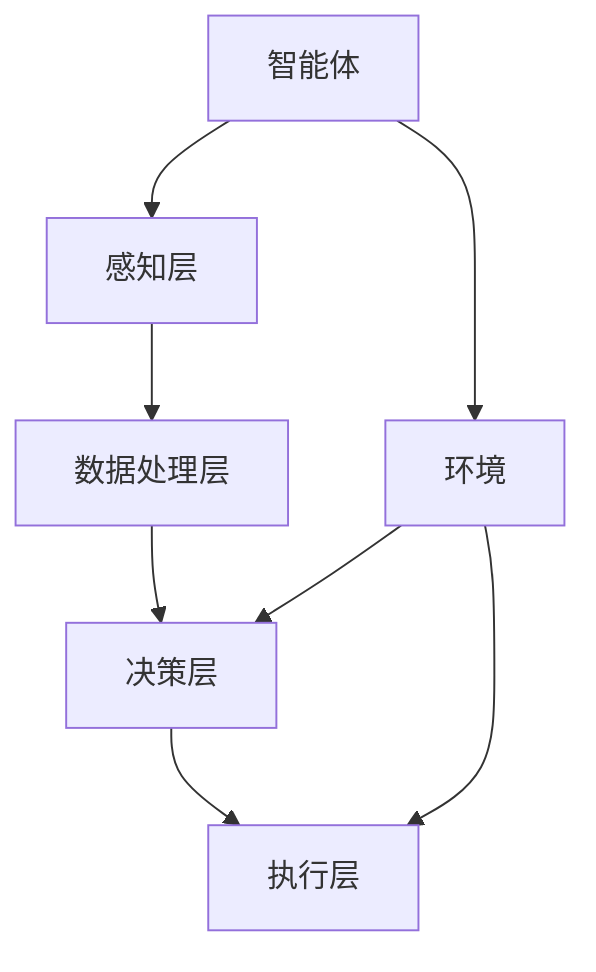

                 

# 强化学习在自动驾驶决策系统中的应用

> **关键词**：强化学习、自动驾驶、决策系统、深度学习、神经网络、算法、数学模型、应用场景、技术趋势

> **摘要**：本文将深入探讨强化学习在自动驾驶决策系统中的应用，通过介绍强化学习的核心概念、算法原理、数学模型以及实际应用案例，帮助读者全面了解强化学习在自动驾驶领域的重要作用和未来发展前景。文章结构清晰，步骤明确，适合对强化学习和自动驾驶有兴趣的读者阅读和学习。

## 1. 背景介绍

### 1.1 目的和范围

本文旨在探讨强化学习在自动驾驶决策系统中的应用，通过详细的分析和实例讲解，帮助读者了解强化学习在自动驾驶领域的实际价值。本文将涵盖以下内容：

1. 强化学习的基础概念和原理。
2. 强化学习算法在自动驾驶决策系统中的具体应用。
3. 强化学习的数学模型及其在自动驾驶决策系统中的应用。
4. 实际应用案例及其代码实现。
5. 强化学习在自动驾驶领域的未来发展趋势和挑战。

### 1.2 预期读者

本文适合对强化学习、自动驾驶以及相关技术有一定了解的读者。无论是研究人员、开发者，还是对自动驾驶技术感兴趣的普通读者，都可以通过本文获取到有用的知识和启示。

### 1.3 文档结构概述

本文分为十个部分，具体结构如下：

1. 引言
2. 背景介绍
3. 核心概念与联系
4. 核心算法原理与具体操作步骤
5. 数学模型和公式及详细讲解
6. 项目实战：代码实际案例和详细解释说明
7. 实际应用场景
8. 工具和资源推荐
9. 总结：未来发展趋势与挑战
10. 附录：常见问题与解答

### 1.4 术语表

#### 1.4.1 核心术语定义

- **强化学习**：一种机器学习范式，通过智能体与环境之间的交互，不断调整其行为策略，以实现最大化累积奖励。
- **自动驾驶**：利用计算机视觉、传感器等技术，实现车辆在无人干预下自主行驶的技术。
- **决策系统**：用于辅助或替代人类驾驶员做出行驶决策的计算机系统。
- **智能体**：在强化学习框架中，负责与环境交互并执行动作的实体。

#### 1.4.2 相关概念解释

- **环境**：自动驾驶系统中，车辆所面临的各种路况和情境。
- **状态**：描述环境当前状态的属性和特征。
- **动作**：智能体在给定状态下执行的行为。
- **奖励**：描述智能体执行动作后，从环境中获得的正面或负面反馈。

#### 1.4.3 缩略词列表

- **RL**：强化学习（Reinforcement Learning）
- **DRL**：深度强化学习（Deep Reinforcement Learning）
- **SLAM**：同时定位与地图构建（Simultaneous Localization and Mapping）
- **CNN**：卷积神经网络（Convolutional Neural Network）
- **RNN**：循环神经网络（Recurrent Neural Network）

## 2. 核心概念与联系

强化学习在自动驾驶决策系统中的应用，需要理解以下几个核心概念和其相互之间的联系。

### 2.1 强化学习基本概念

- **智能体**：自动驾驶系统中的车辆。
- **环境**：道路、交通状况、其他车辆和行人等。
- **状态**：车辆的位置、速度、道路信息等。
- **动作**：车辆的转向、加速、刹车等行为。
- **奖励**：奖励函数根据车辆的行为和环境的反馈，给予智能体正负反馈。

### 2.2 自动驾驶决策系统架构

- **感知层**：传感器采集道路、交通信息，如摄像头、雷达、激光雷达等。
- **数据处理层**：对感知层获取的数据进行处理，提取车辆状态。
- **决策层**：利用强化学习算法，根据当前状态选择最佳动作。
- **执行层**：执行决策层生成的动作，控制车辆行驶。

### 2.3 强化学习与深度学习结合

- **深度强化学习**（DRL）：将深度学习模型（如CNN、RNN）应用于强化学习中的状态和动作空间，提高决策能力。
- **卷积神经网络**（CNN）：用于处理视觉信息，提取道路、车辆、行人等特征。
- **循环神经网络**（RNN）：用于处理时间序列数据，如车辆轨迹。

### 2.4 Mermaid 流程图



## 3. 核心算法原理与具体操作步骤

强化学习算法的核心在于智能体通过与环境交互，不断学习并优化其行为策略。以下是一个简单的强化学习算法原理和具体操作步骤：

### 3.1 算法原理

1. **初始化**：设定智能体初始状态S。
2. **选择动作**：智能体根据当前状态S和策略π，选择一个动作A。
3. **执行动作**：智能体在环境中执行动作A，并获得新的状态S'和奖励R。
4. **更新状态**：智能体更新当前状态S为新的状态S'。
5. **重复**：重复步骤2-4，直到达到目标状态或终止条件。

### 3.2 具体操作步骤

1. **定义状态空间S和动作空间A**：确定状态和动作的取值范围。
2. **初始化策略π**：设定初始策略，通常为随机策略。
3. **迭代学习**：不断迭代执行以下步骤：
    - **选择动作**：根据当前状态S和策略π，选择动作A。
    - **执行动作**：在环境中执行动作A，获得新的状态S'和奖励R。
    - **更新策略**：根据奖励R和新的状态S'，更新策略π。
4. **评估策略**：评估当前策略π的性能，如累积奖励。

### 3.3 伪代码

```python
# 初始化
S = 初始状态
π = 初始化策略

# 迭代学习
while 没有达到终止条件：
    A = π(S)
    S', R = 环境执行动作A
    S = S'
    π = 更新策略π

# 评估策略
累积奖励 = 计算累积奖励
性能 = 评估策略π的性能
```

## 4. 数学模型和公式及详细讲解

强化学习中的数学模型主要包括状态、动作、奖励、策略、价值函数等。以下将对这些模型进行详细讲解。

### 4.1 状态（State）

状态S是描述环境当前状态的属性和特征。在自动驾驶决策系统中，状态S可能包括车辆的位置、速度、道路信息、交通状况等。

### 4.2 动作（Action）

动作A是智能体在给定状态下执行的行为。在自动驾驶决策系统中，动作A可能包括转向、加速、刹车等。

### 4.3 奖励（Reward）

奖励R是描述智能体执行动作后，从环境中获得的正面或负面反馈。奖励函数通常根据车辆的行为和环境的反馈来设计，以鼓励智能体采取正确的行动。

### 4.4 策略（Policy）

策略π是一个从状态空间到动作空间的映射，描述了智能体如何根据当前状态选择动作。策略π可以是固定的，也可以是自适应的，以适应不同的环境和任务。

### 4.5 价值函数（Value Function）

价值函数V(s)是评估状态s的预期累积奖励。对于每个状态s，价值函数V(s)给出了在s状态下执行最优策略π的累积奖励的期望值。

### 4.6 Q函数（Q-Function）

Q函数Q(s, a)是评估状态s下执行动作a的预期累积奖励。Q函数是强化学习中的重要工具，用于指导智能体选择最优动作。

### 4.7 数学公式

$$
V^*(s) = \mathbb{E}_{\pi^*}[R_{t+1} + \gamma R_{t+2} + \gamma^2 R_{t+3} + \ldots | S_t = s]
$$

$$
Q^*(s, a) = \mathbb{E}_{\pi^*}[R_{t+1} + \gamma V^*(S_{t+1}) | S_t = s, A_t = a]
$$

### 4.8 详细讲解与举例说明

#### 4.8.1 价值函数V(s)

假设一个简单的自动驾驶场景，状态S包括车辆位置x和速度v，奖励函数R(x, v)为车辆到达目的地所获得的奖励。

$$
V^*(s) = \sum_{a \in A} \pi^*(a|s) \cdot Q^*(s, a)
$$

#### 4.8.2 Q函数Q(s, a)

在同一个场景下，假设动作A包括加速、减速和保持当前速度，Q函数用于评估每个动作的预期累积奖励。

$$
Q^*(s, a) = \sum_{s' \in S} p(s'|s, a) \cdot [R(s, a) + \gamma V^*(s')]
$$

其中，p(s'|s, a)是状态转移概率，γ是折扣因子。

## 5. 项目实战：代码实际案例和详细解释说明

### 5.1 开发环境搭建

在开始代码实战之前，我们需要搭建一个合适的开发环境。以下是一个基于Python和TensorFlow的强化学习开发环境搭建步骤：

1. 安装Python 3.7及以上版本。
2. 安装TensorFlow 2.0及以上版本。
3. 安装其他依赖库，如NumPy、Pandas等。

### 5.2 源代码详细实现和代码解读

下面是一个简单的强化学习代码示例，用于实现一个自动驾驶车辆在模拟环境中进行决策。

```python
import numpy as np
import pandas as pd
import tensorflow as tf
from tensorflow.keras.models import Sequential
from tensorflow.keras.layers import Dense
from tensorflow.keras.optimizers import Adam

# 设置参数
num_states = 100
num_actions = 4
learning_rate = 0.001
gamma = 0.9
epsilon = 0.1

# 初始化Q网络
model = Sequential()
model.add(Dense(64, input_dim=num_states, activation='relu'))
model.add(Dense(64, activation='relu'))
model.add(Dense(num_actions, activation='linear'))
model.compile(loss='mse', optimizer=Adam(lr=learning_rate))

# 初始化经验回放
replay_memory = pd.DataFrame(columns=['state', 'action', 'reward', 'next_state', 'done'])

# 训练模型
for episode in range(1000):
    state = env.reset()
    done = False
    total_reward = 0
    
    while not done:
        # 根据epsilon贪婪策略选择动作
        if np.random.rand() < epsilon:
            action = env.action_space.sample()
        else:
            action = np.argmax(model.predict(state.reshape(1, num_states)))
        
        # 执行动作并获取新状态和奖励
        next_state, reward, done, _ = env.step(action)
        total_reward += reward
        
        # 将经验添加到经验回放中
        replay_memory = replay_memory.append({
            'state': state,
            'action': action,
            'reward': reward,
            'next_state': next_state,
            'done': done
        }, ignore_index=True)
        
        # 从经验回放中随机采样一批数据
        batch = replay_memory.sample(n=32)
        
        # 更新Q网络权重
        states = batch['state'].values
        actions = batch['action'].values
        rewards = batch['reward'].values
        next_states = batch['next_state'].values
        dones = batch['done'].values
        
        targets = model.predict(states)
        next_targets = model.predict(next_states)
        
        for i in range(len(states)):
            target = rewards[i]
            
            if not dones[i]:
                target += gamma * np.max(next_targets[i])
            
            targets[i][actions[i]] = target
        
        model.fit(states, targets, verbose=0)
        
        state = next_state
    
    print(f"Episode {episode}: Total Reward = {total_reward}")

# 评估模型
state = env.reset()
done = False
total_reward = 0

while not done:
    action = np.argmax(model.predict(state.reshape(1, num_states)))
    next_state, reward, done, _ = env.step(action)
    total_reward += reward
    state = next_state

print(f"Test Total Reward = {total_reward}")
```

### 5.3 代码解读与分析

1. **环境设置**：初始化环境，定义状态空间和动作空间。
2. **模型构建**：构建Q网络模型，使用Dense层实现神经网络结构。
3. **经验回放**：使用Pandas DataFrame构建经验回放，存储每次交互的经验。
4. **训练模型**：使用epsilon贪婪策略选择动作，根据经验回放更新Q网络权重。
5. **评估模型**：在测试环境中评估Q网络模型性能。

## 6. 实际应用场景

强化学习在自动驾驶决策系统中的应用场景非常广泛，以下列举几个典型的应用场景：

1. **路径规划**：利用强化学习算法，自动规划车辆的行驶路径，避免碰撞和交通拥堵。
2. **交通信号灯控制**：通过强化学习算法，自动调整交通信号灯的切换策略，提高道路通行效率。
3. **驾驶行为预测**：利用强化学习算法，预测其他车辆和行人的行为，提前做出相应的驾驶决策。
4. **停车辅助**：利用强化学习算法，辅助车辆在停车位周围进行自主泊车。

## 7. 工具和资源推荐

### 7.1 学习资源推荐

#### 7.1.1 书籍推荐

1. 《强化学习：原理与Python实现》
2. 《深度强化学习》
3. 《自动驾驶：从感知到决策》

#### 7.1.2 在线课程

1. Coursera - 《强化学习基础》
2. Udacity - 《自动驾驶工程师纳米学位》
3. edX - 《深度学习与强化学习》

#### 7.1.3 技术博客和网站

1. AI博客：https://www.ai-blog.cn/
2. 自动驾驶之家：https://www.autonomous drivinghome.com/
3. 知乎 - 自动驾驶话题：https://www.zhihu.com/topic/19552850

### 7.2 开发工具框架推荐

#### 7.2.1 IDE和编辑器

1. PyCharm
2. VSCode
3. Jupyter Notebook

#### 7.2.2 调试和性能分析工具

1. TensorBoard
2. wandb
3. MLflow

#### 7.2.3 相关框架和库

1. TensorFlow
2. PyTorch
3. Keras

### 7.3 相关论文著作推荐

#### 7.3.1 经典论文

1. 《Reinforcement Learning: An Introduction》
2. 《Deep Reinforcement Learning》
3. 《A Model-Based Approach to Planning with Deep Reinforcement Learning》

#### 7.3.2 最新研究成果

1. NeurIPS 2020 - 《Learning to Drive by Predicting the Future》
2. ICRA 2021 - 《Deep reinforcement learning for autonomous driving: a survey》
3. CVPR 2022 - 《Learning to Drive in the Real World》

#### 7.3.3 应用案例分析

1. 百度Apollo - 《Apollo自动驾驶系统技术白皮书》
2. NVIDIA Drive - 《NVIDIA Drive平台技术解析》
3. Waymo - 《Waymo自动驾驶技术解析》

## 8. 总结：未来发展趋势与挑战

强化学习在自动驾驶决策系统中的应用前景广阔，但也面临着诸多挑战。未来发展趋势包括：

1. **深度强化学习模型优化**：通过改进算法和模型结构，提高决策效率和鲁棒性。
2. **多模态数据处理**：结合不同传感器数据，提高自动驾驶系统的感知能力和决策准确性。
3. **大规模数据训练**：利用更多数据训练模型，增强模型泛化能力。
4. **安全与可靠性**：确保自动驾驶系统在复杂环境下稳定运行，提高安全性。

然而，强化学习在自动驾驶决策系统中的应用仍需解决以下挑战：

1. **数据隐私和安全**：保护用户隐私和车辆数据安全。
2. **模型解释性**：提高模型解释性，便于调试和优化。
3. **实时性能**：提高模型实时性，以满足自动驾驶系统的低延迟要求。
4. **多场景适应性**：确保模型在不同环境和场景下具有良好性能。

## 9. 附录：常见问题与解答

1. **Q：强化学习在自动驾驶决策系统中的主要应用是什么？**
   **A：强化学习在自动驾驶决策系统中的应用主要包括路径规划、交通信号灯控制、驾驶行为预测和停车辅助等。通过学习环境中的状态和奖励，智能体能够做出合理的驾驶决策。**

2. **Q：如何评估强化学习算法在自动驾驶决策系统中的性能？**
   **A：评估强化学习算法在自动驾驶决策系统中的性能通常通过评估模型在测试环境中的累积奖励、平均奖励、路径长度等指标。此外，还可以通过可视化工具查看模型在测试环境中的运行过程，以进一步评估其性能。**

3. **Q：如何保证强化学习模型的安全性和可靠性？**
   **A：保证强化学习模型的安全性和可靠性需要从多个方面进行考虑，包括数据安全、模型验证、实时监控等。例如，可以使用差分隐私技术保护用户隐私，进行模型验证以确保模型满足安全性要求，以及使用实时监控工具检测模型异常行为。**

## 10. 扩展阅读 & 参考资料

1. Sutton, R. S., & Barto, A. G. (2018). 《强化学习：原理与练习》。
2. Silver, D., Huang, A., Maddison, C. J., Guez, A., Sifre, L., van den Driessche, G., ... & Lillicrap, T. P. (2016). 《Mastering the Game of Go with Deep Neural Networks and Tree Search》。
3. Kaelbling, L. P., Littman, M. L., & Moore, A. W. (1996). 《Reinforcement Learning: A Survey》。
4. LeCun, Y., Bengio, Y., & Hinton, G. (2015). 《Deep Learning》。
5. 《百度Apollo自动驾驶系统技术白皮书》。
6. 《NVIDIA Drive平台技术解析》。
7. 《Waymo自动驾驶技术解析》。

