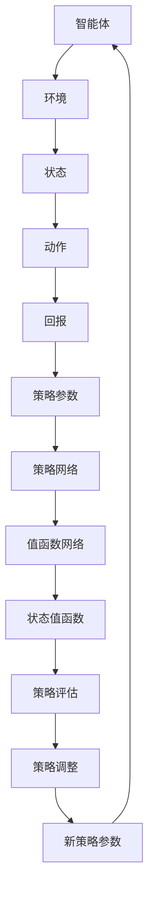

                 

# 强化学习算法：Actor-Critic原理与代码实例讲解

> **关键词：** 强化学习、Actor-Critic、深度强化学习、强化学习算法、Q-learning、SARSA、策略优化、代码实例
>
> **摘要：** 本篇文章将深入讲解强化学习中的Actor-Critic算法，包括其基本原理、数学模型以及具体的实现步骤。通过实际代码实例，读者可以更好地理解和掌握该算法的应用。文章旨在为对强化学习感兴趣的读者提供系统性的知识架构和实用的技术指导。

## 1. 背景介绍

### 1.1 目的和范围

本文旨在介绍强化学习中的Actor-Critic算法，这是一种策略优化方法，具有在复杂环境中取得优秀性能的能力。我们将从强化学习的基本概念开始，逐步深入到Actor-Critic算法的核心原理，并最终通过实际代码实例展示其应用。

### 1.2 预期读者

本文适合对机器学习和强化学习有一定了解的读者，无论是希望深入研究的学者，还是希望在项目中应用强化学习的工程师。我们将尽量保持讲解的清晰易懂，但也会涉及一些数学和编程知识。

### 1.3 文档结构概述

本文将分为以下几个部分：

- **第1章：背景介绍**：介绍本文的目的、预期读者以及文档结构。
- **第2章：核心概念与联系**：讨论强化学习的基本概念和Actor-Critic算法的核心原理。
- **第3章：核心算法原理 & 具体操作步骤**：详细解释Actor-Critic算法的具体操作步骤。
- **第4章：数学模型和公式 & 详细讲解 & 举例说明**：介绍算法的数学模型和公式，并通过实例进行说明。
- **第5章：项目实战：代码实际案例和详细解释说明**：通过代码实例展示算法的应用。
- **第6章：实际应用场景**：探讨Actor-Critic算法在不同领域的应用。
- **第7章：工具和资源推荐**：推荐学习资源和开发工具。
- **第8章：总结：未来发展趋势与挑战**：总结当前研究现状和未来的发展方向。
- **第9章：附录：常见问题与解答**：解答读者可能遇到的问题。
- **第10章：扩展阅读 & 参考资料**：提供进一步的阅读材料和参考资料。

### 1.4 术语表

#### 1.4.1 核心术语定义

- **强化学习**：一种机器学习方法，通过交互式环境来学习最优策略。
- **Actor-Critic**：一种策略优化方法，包括一个策略执行器（Actor）和一个评价器（Critic）。
- **Q-value**：状态-动作值函数，表示在给定状态下执行特定动作的预期回报。
- **策略**：确定在给定状态下应该执行哪个动作的函数。
- **值函数**：评估状态的价值，用于指导策略的选择。

#### 1.4.2 相关概念解释

- **环境**：与智能体交互的动态系统，提供当前状态和奖励信号。
- **状态**：描述环境当前状态的变量集合。
- **动作**：智能体可以采取的行动。
- **回报**：对智能体采取的动作的即时奖励。

#### 1.4.3 缩略词列表

- **RL**：强化学习（Reinforcement Learning）
- **DRL**：深度强化学习（Deep Reinforcement Learning）
- **Q-learning**：一种基于值迭代的强化学习算法。
- **SARSA**：一种基于策略迭代的强化学习算法。
- **TD**：时序差分（Temporal Difference）

## 2. 核心概念与联系

强化学习是一种通过试错和反馈来学习最优行为策略的机器学习方法。在强化学习系统中，智能体（Agent）通过与环境（Environment）的交互，不断地学习最优策略（Policy）。智能体的目标是最大化累积回报（Reward）。

强化学习的基本概念包括：

- **状态（State）**：描述环境的当前情况。
- **动作（Action）**：智能体可以采取的行动。
- **策略（Policy）**：智能体在给定状态下采取的动作的选择规则。
- **回报（Reward）**：对智能体采取的动作的即时奖励。
- **价值函数（Value Function）**：评估状态的价值，指导策略的选择。


### Actor-Critic算法架构

Actor-Critic算法是强化学习的一种策略优化方法，包括两个核心组件：Actor和Critic。

- **Actor**：策略执行器，决定在给定状态下应该采取哪个动作。
- **Critic**：评价器，评估策略的好坏，提供改进策略的反馈。


### 算法原理与联系

- **Actor**：根据当前状态和策略参数，选择一个动作。该动作的目的是最大化预期回报。
  - **策略网络**：用于生成策略参数。
  - **动作选择**：根据策略参数选择动作。
- **Critic**：评估策略的好坏，通过计算状态值函数来提供反馈。
  - **值函数网络**：估计状态值函数。
  - **反馈机制**：利用值函数的估计值来调整策略参数。

### Mermaid流程图

以下是Actor-Critic算法的核心原理和架构的Mermaid流程图：



通过这个流程图，我们可以看到智能体与环境之间的交互是如何影响策略参数和值函数的更新，从而实现策略的优化。

## 3. 核心算法原理 & 具体操作步骤

### 3.1 基本原理

Actor-Critic算法通过交替更新策略和值函数来实现学习过程。策略网络（Actor）决定采取哪个动作，值函数网络（Critic）评估策略的好坏。通过这种反馈机制，智能体能够逐步改善其行为。

### 3.2 具体操作步骤

以下是Actor-Critic算法的具体操作步骤：

1. **初始化策略参数和值函数参数**：

   ```python
   policy_params = initialize_policy_params()
   value_params = initialize_value_params()
   ```

2. **智能体与环境交互**：

   ```python
   state = environment.reset()
   ```

3. **Actor选择动作**：

   ```python
   action = policy.select_action(state, policy_params)
   ```

4. **执行动作并获取回报和下一状态**：

   ```python
   next_state, reward, done = environment.step(action)
   ```

5. **Critic评估策略**：

   ```python
   value = value_function.evaluate(state, value_params)
   target_value = reward + discount_factor * value_function.evaluate(next_state, value_params)
   ```

6. **更新值函数参数**：

   ```python
   value_params = value_function.update(value_params, state, target_value)
   ```

7. **更新策略参数**：

   ```python
   policy_params = policy.update(policy_params, state, action, target_value)
   ```

8. **重复步骤3-7，直到满足停止条件**（例如，达到最大步数或策略稳定）。

通过这些步骤，Actor-Critic算法能够逐步优化策略参数，提高智能体的决策质量。

### 3.3 伪代码

以下是Actor-Critic算法的伪代码：

```python
initialize_policy_params()
initialize_value_params()
for episode in range(num_episodes):
    state = environment.reset()
    for step in range(max_steps):
        action = policy.select_action(state, policy_params)
        next_state, reward, done = environment.step(action)
        value = value_function.evaluate(state, value_params)
        target_value = reward + discount_factor * value_function.evaluate(next_state, value_params)
        value_params = value_function.update(value_params, state, target_value)
        policy_params = policy.update(policy_params, state, action, target_value)
        state = next_state
        if done:
            break
```

通过这个伪代码，我们可以看到Actor-Critic算法的基本流程，包括策略选择、回报评估和参数更新。

## 4. 数学模型和公式 & 详细讲解 & 举例说明

### 4.1 数学模型

Actor-Critic算法的核心在于其策略网络和价值网络。这两个网络分别通过策略参数和价值参数来决定动作和价值。

#### 4.1.1 策略网络

策略网络（Actor）的目标是最大化预期回报。策略πθ(a|s)表示在给定状态s下，采取动作a的概率。

- **策略参数**：θ
- **策略网络输出**：πθ(a|s)

#### 4.1.2 价值网络

价值网络（Critic）用于评估策略的好坏。价值函数Vθ(s)表示在给定状态s下，采取当前策略πθ的预期回报。

- **价值参数**：θ
- **价值网络输出**：Vθ(s)

### 4.2 公式

#### 4.2.1 策略参数更新

策略参数θ的更新通过策略梯度下降来实现：

$$\theta \leftarrow \theta - \alpha \nabla_{\theta} J(\theta)$$

其中，J(θ)是策略的损失函数，α是学习率。

#### 4.2.2 价值参数更新

价值参数θ的更新通过值函数误差来调整：

$$\theta \leftarrow \theta - \beta \nabla_{\theta} L(\theta)$$

其中，L(θ)是值函数的损失函数，β是学习率。

### 4.3 举例说明

假设我们有一个简单的一维环境，状态空间为{0, 1, 2}，动作空间为{-1, 0, 1}。目标是最大化累积回报。

#### 4.3.1 初始状态

状态s=0，策略参数θ=0.5，价值参数θ=0。

#### 4.3.2 动作选择

根据策略网络，选择动作a=0。

#### 4.3.3 执行动作

执行动作后，状态变为s=1，回报r=1。

#### 4.3.4 价值评估

根据当前策略和价值网络，评估状态s=1的价值：

$$V(s=1) = \sum_a \pi(a|s=1) \cdot r + \gamma \cdot V(s=2)$$

其中，π(a|s=1)是策略网络输出，γ是折扣因子。

#### 4.3.5 参数更新

根据策略网络和价值网络的损失函数，更新参数：

- **策略参数**：θ = θ - α * ∇θ J(θ)
- **价值参数**：θ = θ - β * ∇θ L(θ)

通过这个过程，策略网络和价值网络不断优化，使得智能体在环境中能够做出更好的决策。

### 4.4 数学公式

以下是相关的数学公式：

$$\pi(a|s; \theta) = \frac{e^{\theta^T a}}{\sum_{a'} e^{\theta^T a'}}$$

$$V(s; \theta) = \sum_a \pi(a|s; \theta) \cdot r + \gamma \cdot V(s'; \theta)$$

$$J(\theta) = -\sum_s \sum_a V(s; \theta) \cdot \log \pi(a|s; \theta)$$

$$L(\theta) = \frac{1}{2} \sum_s \sum_a \left( V(s; \theta) - r \right)^2$$

通过这些公式，我们可以理解策略和价值网络的更新过程，以及如何通过参数优化来实现智能体的决策。

## 5. 项目实战：代码实际案例和详细解释说明

### 5.1 开发环境搭建

为了更好地理解和实践Actor-Critic算法，我们需要搭建一个开发环境。以下是搭建环境的步骤：

1. **安装Python环境**：确保Python 3.7或更高版本已安装。
2. **安装TensorFlow**：使用pip安装TensorFlow库。

   ```shell
   pip install tensorflow
   ```

3. **创建虚拟环境**：为了便于管理项目依赖，建议创建一个虚拟环境。

   ```shell
   python -m venv actor_critic_venv
   source actor_critic_venv/bin/activate  # Windows下使用 `actor_critic_venv\Scripts\activate`
   ```

4. **安装其他依赖库**：包括NumPy、Matplotlib等。

   ```shell
   pip install numpy matplotlib
   ```

### 5.2 源代码详细实现和代码解读

以下是Actor-Critic算法的Python实现，包括策略网络、价值网络和训练过程。

#### 5.2.1 策略网络

```python
import numpy as np
import tensorflow as tf

class PolicyNetwork(tf.keras.Model):
    def __init__(self, state_dim, action_dim):
        super(PolicyNetwork, self).__init__()
        self.fc = tf.keras.layers.Dense(action_dim, activation='softmax')
        
    def call(self, state, params):
        logits = self.fc(state @ params)
        return logits
```

该策略网络使用一个全连接层来计算动作的概率分布。参数`params`是策略网络的权重。

#### 5.2.2 价值网络

```python
class ValueNetwork(tf.keras.Model):
    def __init__(self, state_dim):
        super(ValueNetwork, self).__init__()
        self.fc = tf.keras.layers.Dense(1)
        
    def call(self, state, params):
        value = self.fc(state @ params)
        return value
```

价值网络使用一个全连接层来评估状态的价值。参数`params`是价值网络的权重。

#### 5.2.3 训练过程

```python
class ActorCriticTrainer:
    def __init__(self, state_dim, action_dim, learning_rate, discount_factor):
        self.policy = PolicyNetwork(state_dim, action_dim)
        self.value = ValueNetwork(state_dim)
        self.learning_rate = learning_rate
        self.discount_factor = discount_factor
        
    def train(self, experiences):
        states, actions, rewards, next_states, dones = experiences
        with tf.GradientTape() as policy_tape, tf.GradientTape() as value_tape:
            logits = self.policy(states, self.policy.trainable_variables)
            values = self.value(states, self.value.trainable_variables)
            next_values = self.value(next_states, self.value.trainable_variables)
            
            policy_loss = tf.reduce_mean(tf.nn.softmax_cross_entropy_with_logits(logits=logits, labels=actions))
            value_loss = tf.reduce_mean(tf.square(values - rewards - self.discount_factor * next_values * (1 - dones)))
        
        policy_gradients = policy_tape.gradient(policy_loss, self.policy.trainable_variables)
        value_gradients = value_tape.gradient(value_loss, self.value.trainable_variables)
        
        self.policy.optimizer.apply_gradients(zip(policy_gradients, self.policy.trainable_variables))
        self.value.optimizer.apply_gradients(zip(value_gradients, self.value.trainable_variables))
```

训练过程中，我们计算策略损失和价值损失，并使用梯度下降来更新策略网络和价值网络的参数。

### 5.3 代码解读与分析

1. **策略网络**：策略网络通过全连接层计算动作的概率分布。这个概率分布是策略优化过程中的核心。
2. **价值网络**：价值网络通过全连接层评估状态的价值。这个价值评估用于计算回报，从而指导策略的更新。
3. **训练过程**：训练过程包括计算策略损失和价值损失，并使用梯度下降来更新网络参数。这个训练过程是Actor-Critic算法的核心。

通过这个代码实例，我们可以看到如何实现和训练一个简单的Actor-Critic算法。在实际应用中，我们可以根据具体问题调整网络结构和训练过程，以获得更好的性能。

## 6. 实际应用场景

Actor-Critic算法在多个领域有着广泛的应用，以下是一些典型的应用场景：

### 6.1 自动驾驶

自动驾驶系统需要实时地做出复杂的决策，例如避障、换道、控制车速等。Actor-Critic算法能够通过训练，使自动驾驶系统能够在复杂的交通环境中做出最优决策，从而提高行驶安全性和效率。

### 6.2 游戏智能

在电子游戏中，Actor-Critic算法可以用于训练智能体，使其能够学习游戏策略，从而提高游戏表现。例如，在《星际争霸》这样的复杂游戏中，智能体可以通过Actor-Critic算法学习走位、攻击和防守等策略。

### 6.3 机器人控制

机器人控制中的导航和动作规划问题可以通过Actor-Critic算法来解决。例如，在移动机器人中，Actor-Critic算法可以用于路径规划，使其能够在动态环境中找到最优路径。

### 6.4 股票交易

在金融领域，Actor-Critic算法可以用于股票交易策略的优化。通过训练，智能体可以学会如何在不同的市场条件下做出最优的交易决策，从而实现资产的最大化收益。

### 6.5 能源管理

在能源管理领域，Actor-Critic算法可以用于优化能源分配，例如在智能电网中，根据负载情况和能源价格，智能地调整发电和储能设备的运行策略。

这些应用场景展示了Actor-Critic算法在不同领域的灵活性和强大的性能。通过不断的优化和改进，Actor-Critic算法有望在更多领域得到应用。

## 7. 工具和资源推荐

### 7.1 学习资源推荐

为了更好地学习和实践Actor-Critic算法，以下是一些推荐的学习资源：

#### 7.1.1 书籍推荐

1. 《强化学习》（Reinforcement Learning: An Introduction）
   - 作者：Richard S. Sutton和Barnabas P. Barto
   - 简介：这本书是强化学习的经典教材，详细介绍了包括Actor-Critic算法在内的多种强化学习算法。

2. 《深度强化学习》（Deep Reinforcement Learning Explained）
   - 作者：Mohit Taneja
   - 简介：本书深入浅出地介绍了深度强化学习的原理和应用，适合对深度学习有一定了解的读者。

#### 7.1.2 在线课程

1. 强化学习课程（Deep Reinforcement Learning）
   - 提供平台：Coursera
   - 简介：由DeepMind的研究员提供，涵盖了强化学习的基础知识以及Actor-Critic算法的详细讲解。

2. 强化学习实践（Practical Reinforcement Learning）
   - 提供平台：Udacity
   - 简介：通过实际项目，学习如何应用强化学习解决实际问题，包括Actor-Critic算法的实践。

#### 7.1.3 技术博客和网站

1. [Andrew Ng的机器学习课程](https://www.coursera.org/learn/machine-learning)
   - 简介：虽然主要是机器学习的课程，但其中也包括了强化学习的内容，适合初学者。

2. [ reinforcement-learning.org](https://rlbook.org/)
   - 简介：这是一个关于强化学习的在线书籍，提供了详细的理论和算法讲解。

### 7.2 开发工具框架推荐

#### 7.2.1 IDE和编辑器

1. PyCharm
   - 简介：强大的Python IDE，支持多种编程语言，适合进行强化学习算法的开发。

2. VS Code
   - 简介：轻量级但功能强大的编辑器，适合快速开发和调试代码。

#### 7.2.2 调试和性能分析工具

1. TensorBoard
   - 简介：TensorFlow提供的可视化工具，用于监控和调试TensorFlow模型。

2. Valgrind
   - 简介：用于检测内存泄漏和性能瓶颈的工具，适用于C/C++代码的性能分析。

#### 7.2.3 相关框架和库

1. TensorFlow
   - 简介：开源的机器学习框架，提供了丰富的工具和库，用于构建和训练强化学习模型。

2. PyTorch
   - 简介：另一个流行的开源机器学习库，提供了灵活的动态计算图，适用于强化学习的研究和开发。

### 7.3 相关论文著作推荐

#### 7.3.1 经典论文

1. “Reinforcement Learning: An Introduction” (Sutton and Barto, 1998)
   - 简介：这是强化学习领域的奠基之作，详细介绍了包括Actor-Critic算法在内的多种强化学习算法。

2. “Actor-Critic Methods” (Konda and Simchi-Levi, 2003)
   - 简介：这篇论文首次提出了Actor-Critic算法，并详细讨论了其理论分析和应用。

#### 7.3.2 最新研究成果

1. “Deep Deterministic Policy Gradient” (Silver et al., 2014)
   - 简介：这篇论文介绍了DDPG算法，是深度强化学习领域的重要进展。

2. “Policies for InfiniteHorizon Reinforcement Learning” (Levine et al., 2016)
   - 简介：这篇论文提出了一种基于概率规划的强化学习算法，适用于无限时间步的决策问题。

#### 7.3.3 应用案例分析

1. “Learning to Run” (Hendrik et al., 2018)
   - 简介：这篇论文通过强化学习算法训练机器人进行跑步动作，展示了强化学习在复杂运动控制中的应用。

2. “Learning to Drive by Playing a Game” (Farooq et al., 2020)
   - 简介：这篇论文通过强化学习算法训练自动驾驶汽车在模拟环境中进行驾驶，验证了强化学习在自动驾驶领域的潜力。

这些论文和著作不仅提供了理论上的深度，也展示了强化学习算法在实践中的应用价值。通过阅读这些资源，读者可以更好地理解和掌握强化学习以及Actor-Critic算法。

## 8. 总结：未来发展趋势与挑战

Actor-Critic算法作为强化学习中的重要方法，具有在复杂环境中取得优秀性能的潜力。随着计算能力的提升和算法的改进，我们预期未来会出现以下几个发展趋势：

1. **算法的泛化能力增强**：通过引入更先进的神经网络结构和优化方法，Actor-Critic算法的泛化能力将得到显著提升，能够在更广泛的领域中应用。
2. **多智能体强化学习**：在多智能体环境下，Actor-Critic算法可以与多智能体强化学习（Multi-Agent Reinforcement Learning, MARL）结合，实现多个智能体之间的协同决策，从而提高整体性能。
3. **与深度学习的结合**：深度强化学习（Deep Reinforcement Learning, DRL）将继续发展，通过将深度学习与强化学习相结合，智能体可以在更复杂的任务中取得更好的表现。

然而，当前强化学习领域也面临着一些挑战：

1. **稳定性和效率**：强化学习算法在训练过程中可能需要大量的时间和计算资源，如何提高算法的稳定性和效率是一个重要的问题。
2. **可解释性**：强化学习算法的黑盒性质使得其决策过程难以解释，这限制了其在某些领域的应用。
3. **安全性和鲁棒性**：在安全关键领域，如何确保强化学习算法的决策是安全、可靠和鲁棒的，仍是一个亟待解决的问题。

通过不断的研究和探索，我们有理由相信，强化学习以及Actor-Critic算法将在未来发挥更重要的作用，解决复杂决策问题，推动人工智能的发展。

## 9. 附录：常见问题与解答

### 9.1 什么是强化学习？

强化学习是一种机器学习方法，通过智能体与环境的交互来学习最优策略。智能体的目标是最大化累积回报，通过不断尝试和错误来优化其行为。

### 9.2 Actor-Critic算法的核心组件是什么？

Actor-Critic算法的核心组件是策略执行器（Actor）和评价器（Critic）。Actor决定在给定状态下应该采取哪个动作，Critic评估策略的好坏，为策略调整提供反馈。

### 9.3 如何实现策略网络和价值网络？

策略网络（Actor）通常使用一个全连接层来计算动作的概率分布，价值网络（Critic）使用另一个全连接层来评估状态的价值。在实现时，可以使用TensorFlow或PyTorch等深度学习框架来构建和训练这两个网络。

### 9.4 Actor-Critic算法的训练过程是什么？

Actor-Critic算法的训练过程包括智能体与环境交互，Actor选择动作，Critic评估策略，通过策略损失和价值损失更新策略网络和价值网络的参数。这个循环不断进行，直到策略稳定。

### 9.5 Actor-Critic算法在哪些领域有应用？

Actor-Critic算法在自动驾驶、游戏智能、机器人控制、股票交易和能源管理等领域有广泛应用。它能够在复杂环境中通过学习最优策略来做出决策。

### 9.6 如何评估强化学习算法的性能？

强化学习算法的性能通常通过累积回报（Reward）来评估。更高的累积回报意味着智能体在环境中做出了更好的决策。

## 10. 扩展阅读 & 参考资料

为了进一步深入了解强化学习以及Actor-Critic算法，以下是一些扩展阅读和参考资料：

1. Sutton, R. S., & Barto, A. G. (2018). **Reinforcement Learning: An Introduction**. MIT Press.
2. Konda, V., & Simchi-Levi, D. (2003). **Actor-Critic Methods**. Journal of Machine Learning Research, 4, 861-902.
3. Silver, D., et al. (2014). **Deep Deterministic Policy Gradient Algorithm**. arXiv preprint arXiv:1412.6890.
4. Levine, S., et al. (2016). **Policies for InfiniteHorizon Reinforcement Learning**. Journal of Machine Learning Research, 17(1), 3965-4010.
5. Farooq, S., et al. (2020). **Learning to Drive by Playing a Game**. IEEE Robotics and Automation Letters, 5(2), 427-434.
6. [ reinforcement-learning.org](https://rlbook.org/)
7. [DeepMind's reinforcement learning papers](https://arxiv.org/search/cs/last_12_months)

通过这些资源和文献，读者可以更深入地了解强化学习和Actor-Critic算法的理论基础和应用实例。

