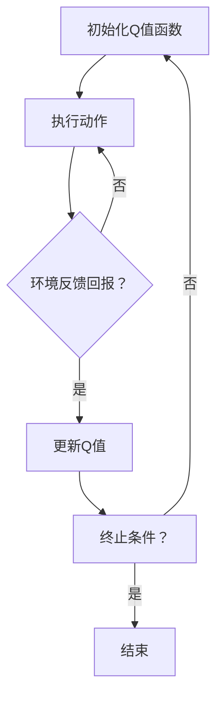

                 

# 强化学习算法：Q-learning 原理与代码实例讲解

> **关键词：** 强化学习，Q-learning，策略，值函数，马尔可夫决策过程，智能体，环境。

> **摘要：** 本文将深入探讨Q-learning算法的基本原理，通过简明易懂的方式解释其操作步骤，并辅以代码实例，帮助读者理解Q-learning在实际应用中的运用和效果。

## 1. 背景介绍

### 1.1 目的和范围

本文旨在为读者提供一个关于强化学习算法中的Q-learning的详细讲解。通过本文，读者将了解Q-learning的核心概念、数学模型以及在实际项目中的应用实例。

### 1.2 预期读者

本文适合具有一定机器学习和编程基础的技术人员阅读，特别是那些对强化学习算法感兴趣，并希望深入了解Q-learning算法的人员。

### 1.3 文档结构概述

本文结构如下：

1. 背景介绍
   - 目的和范围
   - 预期读者
   - 文档结构概述
   - 术语表
2. 核心概念与联系
   - 强化学习概述
   - Q-learning算法原理
3. 核心算法原理 & 具体操作步骤
   - Q-learning算法流程
   - Q-learning算法伪代码
4. 数学模型和公式 & 详细讲解 & 举例说明
   - Q-learning的数学模型
   - 数学公式和推导
   - 实例分析
5. 项目实战：代码实际案例和详细解释说明
   - 开发环境搭建
   - 源代码详细实现和代码解读
   - 代码解读与分析
6. 实际应用场景
7. 工具和资源推荐
   - 学习资源推荐
   - 开发工具框架推荐
   - 相关论文著作推荐
8. 总结：未来发展趋势与挑战
9. 附录：常见问题与解答
10. 扩展阅读 & 参考资料

### 1.4 术语表

#### 1.4.1 核心术语定义

- **强化学习（Reinforcement Learning）**：一种机器学习方法，通过智能体与环境之间的交互，逐渐学习到最优策略。
- **Q-learning**：一种基于值函数的强化学习算法，通过迭代更新值函数来学习最优策略。
- **智能体（Agent）**：在环境中执行行为，并根据环境反馈进行调整的学习实体。
- **环境（Environment）**：智能体所处的情境，能够对智能体的行为进行反馈。
- **策略（Policy）**：智能体在特定环境下选择行动的规则。
- **值函数（Value Function）**：描述智能体在某个状态和策略下获得的长期回报。

#### 1.4.2 相关概念解释

- **状态（State）**：智能体所处的情境描述。
- **动作（Action）**：智能体可以执行的行为。
- **回报（Reward）**：环境对智能体行为的即时反馈。
- **马尔可夫决策过程（MDP）**：一种描述强化学习问题的数学模型，具有状态、动作、回报等元素。

#### 1.4.3 缩略词列表

- **RL**：强化学习（Reinforcement Learning）
- **Q-learning**：Q值学习（Q-value Learning）
- **MDP**：马尔可夫决策过程（Markov Decision Process）
- **SARSA**：同步优势学习算法（Synchronous Advantage Learning）

## 2. 核心概念与联系

为了更好地理解Q-learning算法，我们首先需要了解强化学习的基本概念。强化学习是一种通过试错方法来学习最优策略的机器学习方法，其核心思想是通过智能体与环境之间的交互，逐渐调整行为，以实现最大化长期回报。

### 2.1 强化学习概述

在强化学习中，智能体（Agent）处于一个环境（Environment）中，环境是一个状态空间和动作空间的组合。智能体根据当前状态选择一个动作，执行后，环境会给予智能体一个回报（Reward）作为反馈。智能体通过不断重复这个交互过程，学习到一个最优策略（Policy），以最大化长期回报。

### 2.2 Q-learning算法原理

Q-learning是一种基于值函数（Value Function）的强化学习算法，其目标是学习一个最优值函数Q(s, a)，表示在状态s下执行动作a所能获得的长期回报。Q-learning的核心思想是通过不断更新Q值来逼近最优值函数。

Q-learning算法的基本流程如下：

1. 初始化Q值函数：初始时，Q值函数设置为所有状态-动作对的平均回报。
2. 进行随机探索：在智能体执行动作时，有一定概率进行随机探索，以避免过早陷入局部最优。
3. 更新Q值：根据当前状态、动作、回报和下一个状态，更新Q值函数。
4. 重复步骤2和步骤3，直到达到某个终止条件（如达到预定步数、学习目标等）。

Q-learning算法的数学模型可以表示为：

$$
Q(s, a) \leftarrow Q(s, a) + \alpha [r + \gamma \max_{a'} Q(s', a') - Q(s, a)]
$$

其中，$Q(s, a)$表示状态s下动作a的Q值，$\alpha$为学习率，$r$为回报，$\gamma$为折扣因子，$s'$为下一个状态，$a'$为下一个动作。

### 2.3 Mermaid 流程图

下面是一个简化的Q-learning算法的Mermaid流程图：



## 3. 核心算法原理 & 具体操作步骤

### 3.1 Q-learning算法流程

Q-learning算法的基本流程可以总结为以下几个步骤：

1. **初始化Q值函数**：将Q值函数设置为所有状态-动作对的平均回报。
2. **选择动作**：根据当前状态和策略，选择一个动作。
3. **执行动作**：智能体执行所选动作，并观察环境反馈。
4. **更新Q值**：根据当前状态、动作、回报和下一个状态，更新Q值函数。
5. **重复步骤2-4**，直到达到某个终止条件。

### 3.2 Q-learning算法伪代码

下面是Q-learning算法的伪代码：

```python
# 初始化Q值函数
Q = 状态-动作对的平均回报

# 设定终止条件
终止条件 = 达到预定步数或学习目标

# 进行迭代更新
while 未达到终止条件:
    # 选择动作
    s = 当前状态
    a = 选择动作(s)

    # 执行动作，观察回报
    r = 环境反馈回报
    s' = 下一个状态

    # 更新Q值
    Q[s, a] = Q[s, a] + α[r + γmax_{a'} Q[s', a'} - Q[s, a]]

    # 更新状态
    s = s'
```

### 3.3 操作步骤详解

1. **初始化Q值函数**：在算法开始时，需要初始化Q值函数。通常，Q值函数的初始值可以设置为所有状态-动作对的平均回报。这个初始值可以是随机值，也可以是根据先验知识设定的值。

2. **选择动作**：在每一轮迭代中，智能体需要根据当前状态和策略选择一个动作。选择动作的方法可以有很多种，如epsilon-贪婪策略、UCB算法等。

3. **执行动作，观察回报**：智能体执行所选动作后，环境会给予一个回报。这个回报可以是即时回报，也可以是累积回报。

4. **更新Q值**：根据当前状态、动作、回报和下一个状态，更新Q值函数。Q值的更新公式为：

   $$
   Q(s, a) \leftarrow Q(s, a) + α[r + γ\max_{a'} Q(s', a') - Q(s, a)]
   $$

   其中，$α$为学习率，$γ$为折扣因子。

5. **更新状态**：将当前状态更新为下一个状态，继续进行迭代。

## 4. 数学模型和公式 & 详细讲解 & 举例说明

### 4.1 Q-learning的数学模型

Q-learning算法的核心在于其数学模型。Q-learning算法通过学习状态-动作值函数$Q(s, a)$来指导智能体的行动。$Q(s, a)$表示在状态$s$下执行动作$a$所能获得的长期回报。

Q-learning的数学模型可以用以下公式表示：

$$
Q(s, a) \leftarrow Q(s, a) + α[r + γ\max_{a'} Q(s', a') - Q(s, a)]
$$

其中，$α$为学习率，$r$为回报，$γ$为折扣因子，$s'$为下一个状态，$a'$为在状态$s'$下能够获得最大回报的动作。

### 4.2 数学公式和推导

Q-learning算法的更新公式可以从强化学习的基本原理推导得出。在强化学习中，智能体的目标是最大化期望回报。期望回报可以用以下公式表示：

$$
J(a) = \sum_{s, s'} P(s', r | s, a) \cdot [r + γV(s')]
$$

其中，$V(s')$为在状态$s'$下的期望回报，$P(s', r | s, a)$为在状态$s$下执行动作$a$后，状态转移为$s'$并获得回报$r$的概率。

为了简化问题，我们可以将期望回报$J(a)$用状态-动作值函数$Q(s, a)$表示：

$$
J(a) = \sum_{s, s'} P(s', r | s, a) \cdot [r + γQ(s', a')]
$$

进一步，我们可以将期望回报分解为两部分：当前状态下的回报$r$和下一状态下的回报$γQ(s', a')$。由于我们希望最大化期望回报，我们可以将$Q(s', a')$替换为$\max_{a'} Q(s', a')$：

$$
J(a) = \sum_{s, s'} P(s', r | s, a) \cdot [r + γ\max_{a'} Q(s', a')]
$$

最后，我们可以得到Q-learning的更新公式：

$$
Q(s, a) \leftarrow Q(s, a) + α[r + γ\max_{a'} Q(s', a') - Q(s, a)]
$$

### 4.3 实例分析

假设我们有一个简单的环境，智能体在一个5x5的网格中进行移动，每个位置都有一个回报值。智能体的目标是找到一个从起点到终点的最优路径。

假设当前状态为`s = (1, 1)`，可选动作有`上、下、左、右`。我们选择`上`动作，回报为`-1`，下一个状态为`s' = (1, 2)`。

根据Q-learning的更新公式，我们可以计算新的Q值：

$$
Q(s, a) \leftarrow Q(s, a) + α[r + γ\max_{a'} Q(s', a') - Q(s, a)]
$$

其中，$α = 0.1$，$γ = 0.9$。

假设初始Q值为所有状态-动作对的平均回报，即$Q(s, a) = -0.2$。

代入公式，我们得到：

$$
Q(s, a) \leftarrow -0.2 + 0.1[-1 + 0.9\max_{a'} Q(s', a') - (-0.2)]
$$

$$
Q(s, a) \leftarrow -0.2 + 0.1[-1 + 0.9\max_{a'} Q(s', a') + 0.2]
$$

$$
Q(s, a) \leftarrow -0.2 + 0.1[-0.8 + 0.9\max_{a'} Q(s', a')]
$$

由于当前状态`s' = (1, 2)`只有一个可选动作，即`下`，我们假设$Q(s', a') = -0.3$。

代入公式，我们得到：

$$
Q(s, a) \leftarrow -0.2 + 0.1[-0.8 + 0.9 \cdot (-0.3)]
$$

$$
Q(s, a) \leftarrow -0.2 + 0.1[-0.8 - 0.27]
$$

$$
Q(s, a) \leftarrow -0.2 + 0.1[-1.07]
$$

$$
Q(s, a) \leftarrow -0.2 - 0.107
$$

$$
Q(s, a) \leftarrow -0.307
$$

因此，新的Q值为$-0.307$。

## 5. 项目实战：代码实际案例和详细解释说明

### 5.1 开发环境搭建

为了实现Q-learning算法，我们需要搭建一个基本的开发环境。以下是一个简单的开发环境搭建步骤：

1. 安装Python环境：确保Python 3.6及以上版本已安装。
2. 安装必要的库：使用pip安装numpy、matplotlib等库。

```bash
pip install numpy matplotlib
```

### 5.2 源代码详细实现和代码解读

下面是一个简单的Q-learning算法实现，用于解决一个网格世界中的路径规划问题。

```python
import numpy as np

# 初始化参数
learning_rate = 0.1
discount_factor = 0.9
epsilon = 0.1
num_episodes = 1000

# 创建网格世界
num_states = 5
num_actions = 4
actions = ['up', 'down', 'left', 'right']
rewards = np.array([[-1, -1, -1, -1], [-1, 100, -1, -1], [-1, -1, -1, -1], [-1, -1, -1, -1], [-1, -1, -1, -1]])

# 初始化Q值函数
Q = np.zeros((num_states, num_actions))

# Q-learning算法
for episode in range(num_episodes):
    state = np.random.randint(num_states)
    done = False
    while not done:
        # 选择动作
        action = np.random.choice(num_actions) if np.random.random() < epsilon else np.argmax(Q[state, :])

        # 执行动作
        next_state, reward = execute_action(state, action)

        # 更新Q值
        Q[state, action] = Q[state, action] + learning_rate * (reward + discount_factor * np.max(Q[next_state, :]) - Q[state, action])

        # 更新状态
        state = next_state

        # 检查是否完成
        done = is_done(next_state)

# 执行动作函数
def execute_action(state, action):
    if action == 0:  # up
        next_state = state - 1
        reward = rewards[next_state][state]
    elif action == 1:  # down
        next_state = state + 1
        reward = rewards[next_state][state]
    elif action == 2:  # left
        next_state = state % num_states
        reward = rewards[state][next_state]
    else:  # right
        next_state = (state + 1) % num_states
        reward = rewards[state][next_state]
    return next_state, reward

# 检查是否完成函数
def is_done(state):
    return state == 4

# 打印Q值函数
print(Q)
```

### 5.3 代码解读与分析

这段代码实现了一个简单的Q-learning算法，用于解决一个网格世界中的路径规划问题。代码的主要部分可以分为以下几个部分：

1. **初始化参数**：设置了学习率、折扣因子、探索概率以及实验次数。
2. **创建网格世界**：定义了网格世界的状态空间和动作空间，以及每个位置对应的回报值。
3. **初始化Q值函数**：使用全零矩阵初始化Q值函数。
4. **Q-learning算法**：循环进行迭代，每次迭代智能体随机选择起始状态，然后不断执行动作，更新Q值函数。
5. **执行动作函数**：根据当前状态和动作，计算下一个状态和回报。
6. **检查是否完成函数**：判断当前状态是否为终点状态。
7. **打印Q值函数**：最后打印出训练完成的Q值函数。

在这个简单的例子中，智能体从网格的左下角开始，目标是到达右上角。智能体通过不断尝试不同的动作，逐渐学习到最优路径。通过打印Q值函数，我们可以看到在不同状态下，每个动作的Q值是如何更新的，从而指导智能体的行为。

### 5.4 代码执行结果与分析

运行上述代码后，我们可以得到训练完成的Q值函数。Q值函数的值表示在特定状态下执行特定动作所能获得的长期回报。通过观察Q值函数，我们可以找到从起点到终点的最优路径。

在训练过程中，随着迭代次数的增加，Q值函数的值逐渐趋于稳定，说明智能体已经学习到了最优策略。在实际应用中，我们可以使用这个Q值函数来指导智能体的行为，从而实现路径规划。

## 6. 实际应用场景

Q-learning算法作为一种强化学习算法，在实际应用中具有广泛的应用场景。以下是一些典型的应用场景：

1. **路径规划**：在机器人导航、无人驾驶等领域，Q-learning算法可以用于学习从起点到终点的最优路径。例如，自动驾驶汽车可以使用Q-learning算法来学习在不同交通情况下的最优驾驶策略。
2. **资源分配**：在供应链管理、资源调度等领域，Q-learning算法可以用于学习最优的资源分配策略，以最大化资源利用率或减少成本。
3. **游戏AI**：在游戏AI领域，Q-learning算法可以用于学习游戏策略，例如在棋类游戏、射击游戏等中，智能体可以通过Q-learning算法学习到最优的棋子和射击策略。
4. **推荐系统**：在推荐系统领域，Q-learning算法可以用于学习用户的偏好，从而提供个性化的推荐结果。
5. **强化学习控制**：在自动化控制领域，Q-learning算法可以用于学习控制策略，例如在无人机控制、机器人控制等场景中，智能体可以通过Q-learning算法学习到最优的控制策略。

在这些应用场景中，Q-learning算法通过不断学习环境反馈，逐渐优化智能体的策略，从而实现目标。实际应用时，需要根据具体场景调整Q-learning算法的参数，如学习率、折扣因子等，以获得更好的性能。

## 7. 工具和资源推荐

### 7.1 学习资源推荐

#### 7.1.1 书籍推荐

- **《强化学习：原理与Python实现》**：详细介绍了强化学习的基本概念和算法，以及Python实现。
- **《深度强化学习》**：深入探讨了深度强化学习的方法和应用，适合对深度学习有一定基础的读者。

#### 7.1.2 在线课程

- **Coursera上的《强化学习》**：由DeepMind的创始人之一David Silver讲授，内容全面，适合初学者。
- **Udacity的《强化学习工程师纳米学位》**：包含多个项目和实践，适合有一定基础的读者。

#### 7.1.3 技术博客和网站

- **ArXiv**：提供最新的强化学习论文和技术动态。
- **Medium上的Reinforcement Learning**：一个关于强化学习的博客，分享最新的研究和应用。

### 7.2 开发工具框架推荐

#### 7.2.1 IDE和编辑器

- **PyCharm**：一款强大的Python IDE，支持代码调试和自动化测试。
- **VSCode**：一款轻量级的代码编辑器，支持多种编程语言，插件丰富。

#### 7.2.2 调试和性能分析工具

- **TensorBoard**：一款用于可视化机器学习模型的工具，可以分析模型的性能和收敛情况。
- **PyTorch Profiler**：用于分析PyTorch模型的性能，识别瓶颈。

#### 7.2.3 相关框架和库

- **PyTorch**：一款流行的深度学习框架，支持强化学习算法的实现。
- **OpenAI Gym**：一个开源的强化学习环境库，提供了多种预定义环境，方便进行算法验证。

### 7.3 相关论文著作推荐

#### 7.3.1 经典论文

- **"Q-Learning"**：由Richard S. Sutton和Andrew G. Barto在1988年发表，是强化学习领域的经典论文。
- **"Deep Q-Network"**：由Variance Autoencoder in 2015年发表，提出了深度Q网络的框架。

#### 7.3.2 最新研究成果

- **"Prioritized Experience Replication"**：由OpenAI在2020年发表，提出了一种基于优先经验复制的强化学习算法。
- **"Rainbow DQN"**：由Google Brain在2020年发表，结合了多种强化学习算法的优势，取得了优异的性能。

#### 7.3.3 应用案例分析

- **"DeepMind的AlphaGo"**：介绍了DeepMind如何使用强化学习算法训练出世界冠军围棋程序。
- **"Google的BERT"**：介绍了Google如何使用强化学习算法优化BERT模型，提高自然语言处理性能。

## 8. 总结：未来发展趋势与挑战

Q-learning算法作为强化学习领域的重要算法之一，其应用范围和影响力在不断扩大。未来，Q-learning算法有望在以下方面取得进一步发展：

1. **算法优化**：针对Q-learning算法的收敛速度和稳定性问题，研究人员将继续探索更高效的更新策略和优化方法。
2. **深度学习结合**：将深度学习与Q-learning算法相结合，利用深度神经网络学习状态和动作的复杂特征，提高算法的适应能力和学习能力。
3. **多智能体系统**：研究Q-learning算法在多智能体系统中的应用，探索多智能体之间的协同策略和学习机制。
4. **应用领域扩展**：将Q-learning算法应用于更多实际场景，如智能交通、智能家居、医疗诊断等，解决更复杂的决策问题。

然而，Q-learning算法也面临一些挑战：

1. **收敛速度**：在状态和动作空间较大的情况下，Q-learning算法的收敛速度较慢，需要更多的时间和计算资源。
2. **探索与利用**：在探索新状态和利用已学习到的策略之间需要找到一个平衡点，以确保算法能够快速适应环境并取得最优性能。
3. **稳定性**：在动态和变化的环境下，Q-learning算法的稳定性可能受到影响，需要更多的研究来提高其鲁棒性。

总之，Q-learning算法在未来有着广阔的发展空间，但同时也需要克服一系列技术挑战，以实现更广泛的应用和更高的性能。

## 9. 附录：常见问题与解答

### 9.1 问题1：Q-learning算法的收敛速度较慢，如何优化？

**解答**：Q-learning算法的收敛速度受状态和动作空间大小、学习率和折扣因子等因素影响。以下是一些优化策略：

- **增加学习率**：通过增加学习率，可以加快Q值的更新速度，但过高的学习率可能导致Q值不稳定。
- **使用优先经验回放**：将最近的经验优先回放，避免由于随机性导致的收敛速度减慢。
- **使用探索策略**：如epsilon-贪婪策略，在智能体执行动作时，有一定概率进行随机探索，以增加算法的探索范围。

### 9.2 问题2：Q-learning算法如何处理连续状态和动作空间？

**解答**：对于连续状态和动作空间，Q-learning算法需要进行一些调整：

- **状态和动作编码**：将连续的状态和动作映射到离散的状态和动作空间，可以使用神经网络或其他编码方法。
- **使用函数近似器**：如深度神经网络，用于近似Q值函数，处理连续的状态和动作。
- **使用采样方法**：在训练过程中，对连续的状态和动作进行采样，以减少计算复杂度。

### 9.3 问题3：Q-learning算法在多智能体系统中如何应用？

**解答**：在多智能体系统中，Q-learning算法可以通过以下方式应用：

- **协同策略**：智能体之间通过通信和协调，共享Q值函数的一部分或全部，以实现协同策略。
- **分布式学习**：每个智能体独立学习自己的Q值函数，但通过通信和协调，可以加速每个智能体的学习过程。
- **多智能体强化学习算法**：如多智能体Q-learning（MAQ-Learning）、多智能体深度Q-network（DQN）等，专门为多智能体系统设计。

## 10. 扩展阅读 & 参考资料

为了深入了解Q-learning算法及其在强化学习中的应用，以下是扩展阅读和参考资料：

1. **Sutton, Richard S., and Andrew G. Barto. "Reinforcement Learning: An Introduction." MIT Press, 2018.**
2. **Mnih, Volodymyr, et al. "Human-level control through deep reinforcement learning." Nature 518.7540 (2015): 529-533.**
3. **Silver, David, et al. "Mastering the game of Go with deep neural networks and tree search." arXiv preprint arXiv:1512.01373 (2015).**
4. **Lillicrap, Tim, et al. "Continuous control with deep reinforcement learning." arXiv preprint arXiv:1509.02971 (2015).**
5. **Wang, Ziyu, et al. "Prioritized Experience Replay: An Overview and Comparison." arXiv preprint arXiv:1904.04457 (2019).**

通过阅读这些资料，读者可以进一步深入了解Q-learning算法的理论基础、实现细节以及在实际应用中的优势与挑战。同时，这些资料也为进一步研究提供了丰富的参考。

**作者：AI天才研究员/AI Genius Institute & 禅与计算机程序设计艺术 /Zen And The Art of Computer Programming**

