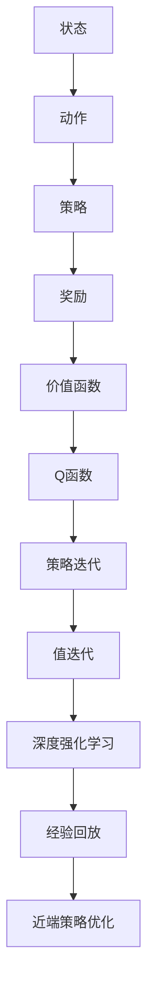

                 

### 1. 背景介绍

#### 1.1 目的和范围

强化学习作为一种重要的机器学习方法，已在诸多领域取得了显著的成功，包括但不限于游戏、机器人控制、推荐系统等。本文旨在深入探讨强化学习的基本原理及其应用，为读者提供一套完整、系统、易于理解的强化学习知识和实践方法。文章将涵盖强化学习的基础概念、核心算法、数学模型以及实际应用，力求帮助读者全面掌握强化学习的核心要点。

本文的目标受众主要面向以下几类读者：

1. **计算机科学与人工智能专业学生**：希望通过本文了解强化学习的基本原理，为后续的学术研究或课程设计打下坚实基础。
2. **机器学习工程师与数据科学家**：需要将强化学习应用于实际项目中，希望本文能为其提供实用的算法实现和优化技巧。
3. **对人工智能感兴趣的工程师和科研人员**：希望深入理解强化学习的理论基础，拓展在人工智能领域的研究视野。
4. **对机器学习算法感兴趣的技术爱好者**：希望对强化学习有更加全面和系统的认识，以便更好地理解相关论文和技术博客。

本文将按照以下结构进行论述：

1. **背景介绍**：简要介绍强化学习的起源、发展现状及未来趋势。
2. **核心概念与联系**：详细阐述强化学习中的核心概念及其相互关系。
3. **核心算法原理与具体操作步骤**：通过伪代码详细讲解常见强化学习算法的原理和实现。
4. **数学模型和公式**：解析强化学习中的关键数学模型，并通过公式和示例进行说明。
5. **项目实战**：提供代码实现和详细解释，帮助读者更好地理解和应用强化学习算法。
6. **实际应用场景**：探讨强化学习在不同领域的应用案例和挑战。
7. **工具和资源推荐**：推荐相关学习资源、开发工具和经典论文，以供进一步学习。
8. **总结**：总结强化学习的发展趋势与面临的挑战。
9. **附录**：提供常见问题与解答，以便读者更好地理解本文内容。
10. **扩展阅读与参考资料**：推荐相关阅读材料和参考资料。

通过本文的阅读和实践，读者应能够：

- **掌握强化学习的基本概念和算法**：理解强化学习的核心原理，掌握常见算法的伪代码实现。
- **理解数学模型和公式**：了解强化学习中的关键数学模型，能够通过公式和示例进行解释。
- **具备实际应用能力**：通过项目实战，能够将强化学习应用于实际问题中，解决实际问题。
- **拓展研究视野**：了解强化学习在不同领域的应用案例，对未来的研究方向有更深入的思考。

接下来，我们将对强化学习的基本概念和起源进行详细介绍。<!--markdown-->## 1.1.1 强化学习的起源与发展

强化学习的概念最早可以追溯到20世纪50年代，当时心理学家和行为科学家开始研究动物和人类如何通过经验进行学习。1956年，心理学家詹姆斯·安格尔（James Angell）和唐纳德·赫布（Donald Hebb）提出了“刺激-反应”模型（Stimulus-Response Model），这是强化学习的前身之一。随后，在1950年代中期，心理学家伯特伦·福尔（B.F. Skinner）提出了“操作性条件反射”理论，这一理论为强化学习提供了重要的理论支撑。

到了20世纪70年代，计算机科学的快速发展推动了强化学习的研究。理查德·萨顿（Richard Sutton）和安德鲁·巴沙姆（Andrew Barto）在1980年代共同撰写了经典著作《强化学习：一种试错指南》（“Reinforcement Learning: An Introduction”），系统地总结了强化学习的基本概念和方法，奠定了现代强化学习的基础。

强化学习在实际应用中逐渐展现出其强大的潜力。从早期的游戏AI到现代的自动驾驶汽车、智能机器人、推荐系统等，强化学习已经成为人工智能领域的一个重要分支。随着深度学习的兴起，深度强化学习（Deep Reinforcement Learning, DRL）也成为了研究热点，其在复杂环境中的应用效果显著提升。

强化学习的发展可以分为以下几个阶段：

1. **基础阶段**：1970年代到1990年代，研究者主要关注马尔可夫决策过程（MDP）和策略迭代算法，如Q-learning、值迭代和价值函数近似等方法。
2. **强化学习革命**：1990年代中期到2000年初期，研究者开始探索策略梯度方法，如REINFORCE和策略迭代算法。这一时期出现了许多重要成果，如梯度策略搜索（Gradient Policy Search）和经验回放（Experience Replay）等。
3. **深度强化学习阶段**：2000年以后，随着深度学习的快速发展，深度强化学习开始受到广泛关注。DRL方法通过结合深度神经网络和价值函数近似，使得强化学习能够处理更复杂的任务和环境。

在强化学习的发展历程中，有许多重要的研究成果和里程碑。例如：

- **Q-learning**：由理查德·萨顿和安德鲁·巴沙姆在1980年代提出，是最早的强化学习算法之一。Q-learning通过迭代更新值函数，以找到最优策略。
- **Deep Q-Network (DQN)**：由DeepMind在2015年提出，是第一个成功的深度强化学习算法。DQN通过深度神经网络来近似Q函数，解决了传统Q-learning在连续动作空间中的问题。
- **Actor-Critic方法**：由理查德·萨顿和安德鲁·巴沙姆在1980年代提出，是一种策略优化方法。通过分离行为评估和行为策略，使得策略迭代更加高效。
- **PPO（Proximal Policy Optimization）**：由OpenAI在2016年提出，是一种高效的策略优化方法。PPO通过优化策略梯度，提高了策略更新的稳定性。

强化学习在各个领域都取得了显著的成果。例如：

- **游戏**：强化学习在Atari游戏、棋类游戏和模拟器游戏等领域表现出色，能够实现接近人类水平的游戏表现。
- **机器人**：强化学习在机器人控制中得到了广泛应用，包括自动驾驶汽车、无人机和智能机器人等。
- **推荐系统**：强化学习在个性化推荐和广告投放中发挥了重要作用，能够根据用户行为和历史数据提供更精准的推荐。
- **金融**：强化学习在金融领域也得到了应用，例如高频交易、风险管理等。

然而，强化学习也面临着一些挑战和问题，如收敛速度慢、样本效率低、可解释性差等。未来，研究者将继续探索更高效、更稳定的强化学习算法，以应对这些挑战，推动强化学习在更广泛领域的应用和发展。<!--markdown-->### 1.2 预期读者

本文的目标读者主要包括以下几类：

1. **计算机科学与人工智能专业学生**：正在学习人工智能和机器学习的本科生和研究生，希望通过本文了解强化学习的基本概念、算法和应用，为后续的学术研究或课程设计打下坚实基础。

2. **机器学习工程师与数据科学家**：已在机器学习领域有一定经验，希望将强化学习应用于实际项目中，提升算法模型的性能和优化技巧。

3. **对人工智能感兴趣的工程师和科研人员**：对人工智能领域有浓厚的兴趣，希望深入了解强化学习的基础理论、前沿技术和应用案例，以拓展研究视野和创新能力。

4. **对机器学习算法感兴趣的技术爱好者**：对强化学习有初步了解，希望通过本文深入了解强化学习的核心原理和实践，提升技术水平。

为了更好地理解本文内容，建议读者具备以下基础：

- **计算机科学与数学基础**：了解计算机科学的基本概念，如编程语言、数据结构、算法等。同时，掌握一定的数学基础，包括线性代数、概率论和统计学。

- **机器学习基础知识**：了解常见的机器学习方法，如监督学习、无监督学习和深度学习等。熟悉机器学习的基本算法和模型。

- **强化学习初步了解**：对强化学习有基本的认识，了解强化学习的基本概念和常见算法，如Q-learning、DQN、Actor-Critic等。

- **编程技能**：具备一定的编程能力，能够使用Python等编程语言实现强化学习算法，进行实验和验证。

通过本文的学习，读者应能够：

- **掌握强化学习的基本概念和算法**：了解强化学习的基本原理、常见算法及其优缺点。

- **理解强化学习在实际应用中的价值**：了解强化学习在不同领域的应用案例和挑战，掌握强化学习在实际问题中的应用方法。

- **具备强化学习的实践能力**：通过项目实战和代码实现，提升对强化学习算法的掌握和优化能力。

- **拓展研究视野**：了解强化学习的前沿技术和研究动态，为未来的学术研究和创新提供启示。

### 1.3 文档结构概述

本文将按照以下结构进行论述，以帮助读者系统地学习和掌握强化学习：

1. **背景介绍**：简要介绍强化学习的起源、发展现状及未来趋势，为后续内容打下基础。

2. **核心概念与联系**：详细阐述强化学习中的核心概念及其相互关系，包括环境、代理、奖励、策略等。

3. **核心算法原理与具体操作步骤**：通过伪代码详细讲解常见强化学习算法的原理和实现，包括Q-learning、DQN、Actor-Critic等。

4. **数学模型和公式**：解析强化学习中的关键数学模型，并通过公式和示例进行说明，包括马尔可夫决策过程（MDP）、策略迭代等。

5. **项目实战**：提供代码实现和详细解释，帮助读者更好地理解和应用强化学习算法，包括实际应用案例和代码解析。

6. **实际应用场景**：探讨强化学习在不同领域的应用案例和挑战，展示强化学习在实际问题中的价值。

7. **工具和资源推荐**：推荐相关学习资源、开发工具和经典论文，以供进一步学习。

8. **总结**：总结强化学习的发展趋势与面临的挑战，展望未来的发展方向。

9. **附录**：提供常见问题与解答，以便读者更好地理解本文内容。

10. **扩展阅读与参考资料**：推荐相关阅读材料和参考资料，拓展读者对强化学习的理解和应用。

通过本文的阅读和实践，读者将能够全面掌握强化学习的基本概念、算法和应用，提升在人工智能领域的研究和实践能力。<!--markdown-->### 1.4 术语表

为了确保本文内容的准确性和一致性，以下列出了一些在强化学习领域常用的术语及其定义：

#### 1.4.1 核心术语定义

1. **强化学习（Reinforcement Learning）**：
   强化学习是一种机器学习方法，通过智能体（agent）与环境（environment）之间的交互，不断更新策略（policy），以最大化累积奖励（cumulative reward）。智能体根据当前状态（state）选择动作（action），并从环境中获得即时奖励（immediate reward）和下一个状态（next state），通过经验积累和学习优化策略。

2. **环境（Environment）**：
   环境是强化学习问题中的外部世界，它为智能体提供状态和奖励信息。环境可以是模拟的（如游戏、仿真器）或真实的（如机器人、自动驾驶）。

3. **智能体（Agent）**：
   智能体是执行行动并从环境中获取反馈的实体。在强化学习中，智能体通过学习策略来优化其行为，以实现特定目标。

4. **状态（State）**：
   状态是智能体在环境中的一个描述，通常是一个向量或矩阵，用于表示当前的环境信息。

5. **动作（Action）**：
   动作是智能体在状态中选择的行为。动作通常是一个离散的集合或连续的数值范围。

6. **策略（Policy）**：
   策略是智能体在给定状态下选择动作的方法。策略可以是固定的（确定性策略），也可以是根据状态概率分布（概率性策略）。

7. **奖励（Reward）**：
   奖励是环境在智能体执行动作后给予的即时反馈信号，用于评估智能体行为的好坏。奖励可以是正值（积极奖励）或负值（消极奖励）。

8. **价值函数（Value Function）**：
   价值函数是用来估计从某个状态执行某个动作得到累积奖励的期望值。它包括状态值函数（state-value function）和动作值函数（action-value function）。

9. **Q函数（Q-function）**：
   Q函数是一种价值函数，表示在某个状态下执行某个动作的累积奖励期望。Q函数在Q-learning算法中起到核心作用。

10. **策略迭代（Policy Iteration）**：
    策略迭代是一种强化学习算法，通过交替更新策略和价值函数，以找到最优策略。

11. **值迭代（Value Iteration）**：
    值迭代是一种强化学习算法，通过迭代更新价值函数，以逼近最优策略。

12. **深度强化学习（Deep Reinforcement Learning, DRL）**：
    深度强化学习是一种将深度神经网络与强化学习结合的方法，用于解决具有高维状态空间和动作空间的复杂问题。

13. **经验回放（Experience Replay）**：
    经验回放是一种强化学习技巧，通过存储和随机采样过去的经验，提高算法的稳定性和泛化能力。

#### 1.4.2 相关概念解释

1. **马尔可夫决策过程（MDP）**：
   马尔可夫决策过程是一种数学模型，描述了智能体在不确定性环境中进行决策的过程。它由状态集合、动作集合、状态转移概率和奖励函数组成。

2. **策略梯度方法（Policy Gradient Method）**：
   策略梯度方法是一种通过优化策略梯度来更新策略的强化学习算法。它基于策略的期望回报来计算策略梯度，并通过梯度上升或下降更新策略。

3. **近端策略优化（Proximal Policy Optimization, PPO）**：
   近端策略优化是一种高效的策略优化方法，通过优化策略梯度，提高了策略更新的稳定性和收敛速度。

4. **无模型方法（Model-Free Method）**：
   无模型方法是一种不需要构建环境模型的强化学习算法。它通过直接从与环境的交互中学习，更新策略和价值函数。

5. **有模型方法（Model-Based Method）**：
   有模型方法是一种需要构建环境模型的强化学习算法。它通过模拟环境来生成经验，并使用这些经验来更新策略和价值函数。

#### 1.4.3 缩略词列表

- **MDP**：马尔可夫决策过程（Markov Decision Process）
- **DQN**：深度Q网络（Deep Q-Network）
- **DRL**：深度强化学习（Deep Reinforcement Learning）
- **PPO**：近端策略优化（Proximal Policy Optimization）
- **REINFORCE**：基于梯度的策略优化（REward-based FInite-difference REINFORCEment）

通过理解这些术语和概念，读者将能够更好地掌握强化学习的基本原理和应用方法。在接下来的章节中，我们将进一步深入探讨强化学习中的核心概念和联系。<!--markdown-->### 2. 核心概念与联系

强化学习作为一种通过试错方式从经验中学习的算法，涉及多个核心概念，这些概念相互关联，共同构成了强化学习的基础。以下是强化学习中的核心概念及其相互关系：

#### 状态（State）

状态是强化学习中的基本组成部分，用于描述智能体在环境中的一个特定情形。状态可以是离散的，也可以是连续的。状态通常是一个向量或矩阵，包含当前环境的各种信息。例如，在自动驾驶任务中，状态可以包括车辆的位置、速度、周围交通状况等。

#### 动作（Action）

动作是智能体在特定状态下可以采取的行为。动作也可以是离散的或连续的。智能体根据当前状态选择动作，并试图最大化累积奖励。例如，在自动驾驶中，动作可以是加速、减速、转向等。

#### 策略（Policy）

策略是智能体在给定状态下选择动作的方法。策略可以是确定的（确定性策略），也可以是随机的（概率性策略）。确定性策略在给定状态下总是选择相同的动作，而概率性策略在给定状态下根据概率分布选择动作。策略是强化学习中的一个关键组件，它决定了智能体的行为。

#### 奖励（Reward）

奖励是环境在智能体执行动作后给予的即时反馈信号。奖励可以是正值（积极奖励），也可以是负值（消极奖励）。积极奖励鼓励智能体继续采取该动作，而消极奖励则鼓励智能体避免该动作。奖励是强化学习中的核心激励机制，用于指导智能体的行为。

#### 值函数（Value Function）

值函数是用来估计从某个状态执行某个动作得到累积奖励的期望值。值函数可以分为状态值函数（state-value function）和动作值函数（action-value function）。状态值函数表示在某个状态下执行任意动作的期望累积奖励，而动作值函数表示在某个状态下执行特定动作的期望累积奖励。值函数是强化学习中的一个重要概念，用于评估状态和动作的好坏。

#### Q函数（Q-Function）

Q函数是一种特殊的价值函数，表示在某个状态下执行某个动作的累积奖励期望。Q函数在Q-learning算法中起到核心作用。Q-learning通过迭代更新Q函数，以找到最优动作选择策略。Q函数可以看作是强化学习的核心算法之一。

#### 策略迭代（Policy Iteration）

策略迭代是一种强化学习算法，通过交替更新策略和价值函数，以找到最优策略。策略迭代算法包括两个主要步骤：策略评估（Policy Evaluation）和策略改进（Policy Improvement）。策略评估通过迭代更新值函数，以估计当前策略下的期望累积奖励；策略改进通过评估新策略的值函数，以找到更好的策略。策略迭代算法在解决静态和动态规划问题中表现出色。

#### 值迭代（Value Iteration）

值迭代是一种强化学习算法，通过迭代更新价值函数，以逼近最优策略。值迭代算法从初始价值函数开始，逐步更新直到达到收敛条件。值迭代算法在解决静态规划问题中表现出色，但由于需要计算所有状态的所有动作的值函数，因此在处理高维状态空间时可能效率较低。

#### 深度强化学习（Deep Reinforcement Learning）

深度强化学习是一种将深度神经网络与强化学习结合的方法，用于解决具有高维状态空间和动作空间的复杂问题。深度强化学习通过深度神经网络来近似Q函数或策略函数，从而提高了模型的表达能力和计算效率。常见的深度强化学习算法包括DQN、DDPG、A3C等。

#### 经验回放（Experience Replay）

经验回放是一种强化学习技巧，通过存储和随机采样过去的经验，提高算法的稳定性和泛化能力。经验回放可以防止智能体在训练过程中过度依赖最新经验，从而提高模型的鲁棒性和泛化能力。

#### 近端策略优化（Proximal Policy Optimization）

近端策略优化是一种高效的策略优化方法，通过优化策略梯度，提高了策略更新的稳定性和收敛速度。PPO通过引入信任区域（Trust Region）约束，使得策略更新更加稳健和鲁棒。

### Mermaid 流程图

以下是强化学习核心概念和算法的Mermaid流程图，展示了这些概念和算法之间的相互关系：



通过这个流程图，读者可以清晰地看到强化学习中的核心概念和算法之间的关联，以及它们如何共同构成了强化学习的基础框架。接下来，我们将进一步深入探讨强化学习的核心算法原理和具体操作步骤。<!--markdown-->### 3. 核心算法原理与具体操作步骤

在强化学习领域，有多种核心算法被广泛应用于不同的场景和问题中。以下是几种常见的强化学习算法，包括其原理和具体的操作步骤。

#### 3.1 Q-learning算法

Q-learning算法是一种基于值函数迭代的强化学习算法，旨在通过学习状态-动作值函数（Q函数）来找到最优策略。

**算法原理**：

Q-learning算法的核心思想是，通过不断更新Q值（状态-动作值），以逼近最优策略。在每次行动后，根据即时奖励和下一个状态更新Q值。更新公式如下：

$$
Q(s, a) \leftarrow Q(s, a) + \alpha [r + \gamma \max_{a'} Q(s', a') - Q(s, a)]
$$

其中，\(s\) 和 \(a\) 分别表示当前状态和动作，\(r\) 表示即时奖励，\(\gamma\) 表示折扣因子，\(\alpha\) 表示学习率，\(s'\) 和 \(a'\) 分别表示下一个状态和动作。

**具体操作步骤**：

1. **初始化**：设定初始Q值，可以设置为全零矩阵或通过经验初始化。
2. **选择动作**：在给定状态 \(s\) 下，根据当前策略选择动作 \(a\)。可以采用贪心策略，选择具有最高Q值的动作。
3. **执行动作**：智能体执行选定的动作 \(a\)，并获得即时奖励 \(r\) 和下一个状态 \(s'\)。
4. **更新Q值**：根据上述更新公式，更新当前状态-动作值 \(Q(s, a)\)。
5. **状态转移**：将当前状态更新为下一个状态 \(s' \)。
6. **重复步骤2-5**，直到达到终止条件（如达到目标状态或达到预设的迭代次数）。

**伪代码**：

```python
def q_learning(env, alpha, gamma, epsilon, max_episodes):
    Q = initialize_Q(env)
    for episode in range(max_episodes):
        state = env.reset()
        done = False
        while not done:
            action = epsilon_greedy(Q, state, epsilon)
            next_state, reward, done, _ = env.step(action)
            Q[state, action] = Q[state, action] + alpha * (reward + gamma * max(Q[next_state, :]) - Q[state, action])
            state = next_state
        if episode % 100 == 0:
            print(f"Episode {episode}: Total Reward = {episode_reward}")
    return Q
```

#### 3.2 DQN算法

DQN（Deep Q-Network）算法是一种基于深度神经网络的Q-learning算法，用于解决高维状态空间的问题。

**算法原理**：

DQN通过使用深度神经网络来近似Q值函数，从而提高了Q-learning算法在处理高维状态空间时的效率和准确性。DQN的主要创新点包括经验回放和目标网络。

经验回放：通过存储和随机采样过去的经验，避免智能体在训练过程中过度依赖最新经验，从而提高模型的鲁棒性和泛化能力。

目标网络：DQN使用一个目标网络来稳定Q值的更新。目标网络是原Q网络的软拷贝，每隔一定次数将原Q网络更新到目标网络。

**具体操作步骤**：

1. **初始化**：设定初始Q网络和目标网络，并初始化经验回放池。
2. **选择动作**：在给定状态 \(s\) 下，根据当前策略选择动作 \(a\)。可以采用贪心策略，选择具有最高Q值的动作。
3. **执行动作**：智能体执行选定的动作 \(a\)，并获得即时奖励 \(r\) 和下一个状态 \(s'\)。
4. **存储经验**：将当前状态 \(s\)、动作 \(a\)、即时奖励 \(r\)、下一个状态 \(s'\) 和终止标志 \(done\) 存储到经验回放池中。
5. **更新Q网络**：使用训练样本（经验回放池中的样本）训练Q网络。
6. **更新目标网络**：每隔一定次数，将原Q网络更新到目标网络。
7. **状态转移**：将当前状态更新为下一个状态 \(s' \)。
8. **重复步骤2-7**，直到达到终止条件（如达到目标状态或达到预设的迭代次数）。

**伪代码**：

```python
def dqn(env, learning_rate, discount_factor, epsilon, epsilon_decay, epsilon_min, batch_size, target_network_update_freq):
    Q = NeuralNetwork()
    target_Q = NeuralNetwork()
    replay_memory = ReplayMemory(max_size)
    for episode in range(max_episodes):
        state = env.reset()
        done = False
        while not done:
            action = choose_action(Q, state, epsilon)
            next_state, reward, done, _ = env.step(action)
            replay_memory.push(state, action, reward, next_state, done)
            if len(replay_memory) > batch_size:
                batch = random.sample(replay_memory, batch_size)
                next_state_f = torch.tensor([next_state for _, _, _, next_state, _ in batch]).to(device)
                action_f = torch.tensor([action for _, action, _, _, _ in batch]).to(device)
                reward_f = torch.tensor([reward for _, _, reward, _, _ in batch]).to(device)
                state_f = torch.tensor([state for _, _, _, next_state, _ in batch]).to(device)
                done_f = torch.tensor([done for _, _, _, next_state, _ in batch]).to(device)
                Q_loss = critic_loss(Q(state_f), action_f, reward_f, next_state_f, done_f, target_Q)
                optimizer.zero_grad()
                Q_loss.backward()
                optimizer.step()
            state = next_state
            if done:
                break
        if episode % target_network_update_freq == 0:
            target_Q.load_state_dict(Q.state_dict())
        if epsilon > epsilon_min:
            epsilon *= epsilon_decay
    return Q
```

#### 3.3 Actor-Critic算法

Actor-Critic算法是一种基于策略优化的强化学习算法，通过分离行为评估和行为策略，提高了学习效率和收敛速度。

**算法原理**：

Actor-Critic算法将策略更新和价值评估分离。Actor（行为策略）负责生成动作，而Critic（价值评估器）负责评估策略的好坏。通过交替更新Actor和Critic，算法逐步优化策略。

**具体操作步骤**：

1. **初始化**：设定初始Actor和Critic模型。
2. **选择动作**：Actor模型生成动作概率分布，根据当前状态选择动作。
3. **执行动作**：智能体执行选定的动作，并获得即时奖励和下一个状态。
4. **计算优势函数**：Critic模型计算当前策略下的状态价值函数，并与预期价值函数进行比较，得到优势函数。
5. **更新Critic模型**：使用优势函数和当前策略更新Critic模型。
6. **更新Actor模型**：使用Critic模型生成的预期回报更新Actor模型。
7. **状态转移**：将当前状态更新为下一个状态。
8. **重复步骤2-7**，直到达到终止条件（如达到目标状态或达到预设的迭代次数）。

**伪代码**：

```python
def actor_critic(env, actor_learning_rate, critic_learning_rate, discount_factor, epsilon, epsilon_decay, epsilon_min, batch_size, actor_train_freq, critic_train_freq):
    actor = NeuralNetwork()
    critic = NeuralNetwork()
    optimizer_actor = AdamOptimizer(actor_learning_rate)
    optimizer_critic = AdamOptimizer(critic_learning_rate)
    for episode in range(max_episodes):
        state = env.reset()
        done = False
        while not done:
            action_prob = actor(state)
            action = sample_action(action_prob)
            next_state, reward, done, _ = env.step(action)
            state_value = critic(state)
            next_state_value = critic(next_state)
            advantage = reward + discount_factor * next_state_value - state_value
            optimizer_critic.zero_grad()
            critic_loss = critic_loss(state, action_prob, advantage)
            critic_loss.backward()
            optimizer_critic.step()
            if episode % actor_train_freq == 0:
                actor_loss = actor_loss(state, action_prob, advantage)
                optimizer_actor.zero_grad()
                actor_loss.backward()
                optimizer_actor.step()
        if epsilon > epsilon_min:
            epsilon *= epsilon_decay
    return actor, critic
```

通过上述算法原理和操作步骤的讲解，读者可以了解到不同强化学习算法的基本原理和实现方法。接下来，我们将进一步探讨强化学习中的数学模型和公式，以更深入地理解强化学习的理论基础。<!--markdown-->### 4. 数学模型和公式

强化学习作为一种基于经验学习的算法，其核心在于如何通过数学模型来描述智能体与环境的交互，并通过迭代优化策略。以下是强化学习中的关键数学模型、公式及其详细讲解。

#### 4.1 马尔可夫决策过程（MDP）

马尔可夫决策过程（MDP）是强化学习的基础模型，用于描述智能体在不确定性环境中进行决策的过程。MDP由以下四个部分组成：

1. **状态空间 \(S\)**：智能体可能处于的所有状态集合。
2. **动作空间 \(A\)**：智能体可能执行的所有动作集合。
3. **状态转移概率 \(P(s'|s, a)\)**：在给定当前状态 \(s\) 和执行动作 \(a\) 后，智能体转移到下一个状态 \(s'\) 的概率。
4. **奖励函数 \(R(s, a)\)**：在给定当前状态 \(s\) 和执行动作 \(a\) 后，智能体获得的即时奖励。

在MDP中，智能体的行为可以用一个策略 \(\pi(a|s)\) 来描述，表示在状态 \(s\) 下选择动作 \(a\) 的概率。MDP的核心目标是最小化期望损失，即最大化累积奖励。

MDP的数学模型可以表示为：

$$
\begin{align*}
S &= \{s_1, s_2, ..., s_n\} \\
A &= \{a_1, a_2, ..., a_m\} \\
P(s'|s, a) &= \text{状态转移概率矩阵} \\
R(s, a) &= \text{即时奖励函数}
\end{align*}
$$

#### 4.2 策略迭代

策略迭代是一种常用的强化学习算法，其核心思想是通过交替更新策略和价值函数，以找到最优策略。策略迭代包括策略评估（Policy Evaluation）和策略改进（Policy Improvement）两个步骤。

1. **策略评估**：
   策略评估通过迭代更新价值函数 \(V^k(s)\)，以逼近最优策略。更新公式如下：

   $$
   V^{k+1}(s) = \sum_{a \in A} \pi(a|s) [R(s, a) + \gamma \max_{a'} V^k(s')]
   $$

   其中，\(\pi(a|s)\) 是策略，\(\gamma\) 是折扣因子，\(V^k(s')\) 是在 \(k\) 次迭代后状态 \(s'\) 的价值函数。

2. **策略改进**：
   策略改进通过选择当前策略下的最优动作，以更新策略。更新公式如下：

   $$
   \pi^{k+1}(a|s) = \begin{cases}
   1, & \text{如果 } a = \arg\max_{a'} [R(s, a') + \gamma \max_{a''} V^k(s'')] \\
   0, & \text{否则}
   \end{cases}
   $$

   通过策略评估和策略改进的交替迭代，策略迭代算法逐步逼近最优策略。

#### 4.3 Q-learning算法

Q-learning算法是一种基于值函数迭代的强化学习算法，旨在通过学习状态-动作值函数（Q函数）来找到最优策略。Q-learning算法的更新公式如下：

$$
Q(s, a) \leftarrow Q(s, a) + \alpha [r + \gamma \max_{a'} Q(s', a') - Q(s, a)]
$$

其中，\(s\) 和 \(a\) 分别表示当前状态和动作，\(r\) 表示即时奖励，\(\gamma\) 表示折扣因子，\(\alpha\) 表示学习率，\(s'\) 和 \(a'\) 分别表示下一个状态和动作。

Q-learning算法通过迭代更新Q值，以逼近最优策略。每次迭代中，智能体根据当前策略选择动作，执行动作后更新Q值，然后状态转移至下一个状态。重复迭代，直至达到终止条件。

#### 4.4 DQN算法

DQN（Deep Q-Network）算法是一种基于深度神经网络的Q-learning算法，用于解决高维状态空间的问题。DQN通过使用深度神经网络来近似Q值函数，从而提高了Q-learning算法在处理高维状态空间时的效率和准确性。

DQN的损失函数通常采用均方误差（MSE）损失：

$$
L = \frac{1}{n} \sum_{i=1}^{n} (y_i - \hat{y}_i)^2
$$

其中，\(y_i\) 是实际观测到的Q值，\(\hat{y}_i\) 是预测的Q值。

DQN的训练过程主要包括以下几个步骤：

1. **经验回放**：智能体执行动作后，将当前状态、动作、奖励、下一个状态和终止标志存储在经验回放池中。经验回放池通过随机抽样，为DQN提供稳定和多样化的训练样本。
2. **网络更新**：使用经验回放池中的样本，通过反向传播和梯度下降算法，更新深度神经网络的权重。
3. **目标网络**：为了稳定Q值的更新，DQN使用一个目标网络，每隔一定次数将原始Q网络更新到目标网络。目标网络用于计算预测的Q值，从而提高训练的稳定性。

#### 4.5 Actor-Critic算法

Actor-Critic算法是一种基于策略优化的强化学习算法，通过分离行为评估和行为策略，提高了学习效率和收敛速度。

1. **行为策略（Actor）**：
   行为策略负责生成动作的概率分布。通常，行为策略采用概率神经网络，如MLP（多层感知机）或RNN（递归神经网络）。

   行为策略的损失函数通常采用概率损失（Policy Loss）：

   $$
   L_{\pi} = \sum_{s, a} \pi(a|s) [R(s, a) - V^*(s)]
   $$

   其中，\(\pi(a|s)\) 是行为策略，\(V^*(s)\) 是最优价值函数。

2. **价值评估器（Critic）**：
   价值评估器负责评估当前策略的好坏。通常，价值评估器采用价值函数，如状态价值函数或动作价值函数。

   价值评估器的损失函数通常采用价值损失（Value Loss）：

   $$
   L_V = \frac{1}{n} \sum_{i=1}^{n} [V(s_i) - r_i - \gamma V(s_{i+1})]^2
   $$

   其中，\(V(s_i)\) 是状态价值函数，\(r_i\) 是即时奖励，\(s_{i+1}\) 是下一个状态。

通过交替更新行为策略和价值评估器，Actor-Critic算法逐步优化策略和价值函数，从而提高学习效率和收敛速度。

### 4.6 举例说明

以下通过一个简单的例子，说明强化学习中的数学模型和公式。

假设有一个MDP，状态空间为 \(\{s_1, s_2\}\)，动作空间为 \(\{a_1, a_2\}\)。状态转移概率矩阵和即时奖励函数如下：

$$
\begin{align*}
P(s'|s, a) &= \begin{bmatrix}
0.7 & 0.3 \\
0.4 & 0.6
\end{bmatrix} \\
R(s, a) &= \begin{bmatrix}
1 & 0 \\
0 & 1
\end{bmatrix}
\end{align*}
$$

初始策略为：

$$
\pi(a|s) = \begin{bmatrix}
0.5 & 0.5 \\
0.5 & 0.5
\end{bmatrix}
$$

1. **策略评估**：

   策略评估通过迭代更新价值函数 \(V^k(s)\)：

   $$
   V^{k+1}(s) = \sum_{a \in A} \pi(a|s) [R(s, a) + \gamma \max_{a'} V^k(s')]
   $$

   初始价值函数为 \(V^0(s) = 0\)。经过一次策略评估后，价值函数为：

   $$
   V^1(s) = \begin{bmatrix}
   0.8 & 0.2 \\
   0.6 & 0.4
   \end{bmatrix}
   $$

2. **策略改进**：

   策略改进通过选择当前策略下的最优动作，以更新策略：

   $$
   \pi^{k+1}(a|s) = \begin{cases}
   1, & \text{如果 } a = \arg\max_{a'} [R(s, a') + \gamma \max_{a''} V^k(s'')] \\
   0, & \text{否则}
   \end{cases}
   $$

   经过一次策略改进后，策略为：

   $$
   \pi^1(a|s) = \begin{bmatrix}
   1 & 0 \\
   0 & 1
   \end{bmatrix}
   $$

通过上述策略评估和策略改进，智能体逐步逼近最优策略。这个简单的例子展示了强化学习中的数学模型和公式如何应用于实际场景，帮助我们理解和优化智能体的行为。

### 4.7 公式解释

以下是对强化学习中的关键公式的解释：

1. **状态转移概率**：

   $$
   P(s'|s, a) = \text{在当前状态 } s \text{ 和执行动作 } a \text{ 后，智能体转移到下一个状态 } s' \text{ 的概率}
   $$

2. **即时奖励**：

   $$
   R(s, a) = \text{在当前状态 } s \text{ 和执行动作 } a \text{ 后，智能体获得的即时奖励}
   $$

3. **价值函数**：

   $$
   V^k(s) = \text{在策略 } \pi \text{ 下，从状态 } s \text{ 开始执行动作得到的期望累积奖励}
   $$

4. **策略评估**：

   $$
   V^{k+1}(s) = \sum_{a \in A} \pi(a|s) [R(s, a) + \gamma \max_{a'} V^k(s')]
   $$

   用于更新价值函数，以逼近最优策略。

5. **策略改进**：

   $$
   \pi^{k+1}(a|s) = \begin{cases}
   1, & \text{如果 } a = \arg\max_{a'} [R(s, a') + \gamma \max_{a''} V^k(s'')] \\
   0, & \text{否则}
   \end{cases}
   $$

   用于更新策略，选择最优动作。

通过理解这些公式，读者可以更深入地掌握强化学习中的核心概念和算法，并在实际应用中灵活运用。接下来，我们将通过一个项目实战案例，展示如何将强化学习算法应用于实际问题，并提供代码实现和详细解释。<!--markdown-->### 5. 项目实战：代码实际案例和详细解释说明

在本节中，我们将通过一个简单的强化学习项目实战，展示如何使用Python实现强化学习算法，并详细解释代码实现和关键步骤。这个项目将使用经典的Atari游戏——Breakout，来演示强化学习算法在游戏中的应用。

#### 5.1 开发环境搭建

在进行项目实战之前，需要搭建以下开发环境：

1. **Python 3.7 或以上版本**
2. **TensorFlow 2.3 或以上版本**
3. **Numpy 1.19 或以上版本**
4. **Gym：用于构建和运行强化学习环境**

安装以下依赖库：

```bash
pip install tensorflow numpy gym
```

#### 5.2 源代码详细实现和代码解读

以下是Breakout游戏的强化学习实现代码：

```python
import numpy as np
import gym
import tensorflow as tf

# 初始化环境
env = gym.make('Breakout-v0')
state_size = env.observation_space.shape
action_size = env.action_space.n

# 定义Q网络
class QNetwork(tf.keras.Model):
    def __init__(self):
        super(QNetwork, self).__init__()
        self.fc1 = tf.keras.layers.Dense(64, activation='relu')
        self.fc2 = tf.keras.layers.Dense(64, activation='relu')
        self.fc3 = tf.keras.layers.Dense(action_size)

    def call(self, inputs):
        x = self.fc1(inputs)
        x = self.fc2(x)
        return self.fc3(x)

# 定义训练步骤
def train_step(model, x, y):
    with tf.GradientTape() as tape:
        q_values = model(x)
        y_true = y
        loss = tf.keras.losses.mean_squared_error(y_true, q_values)
    grads = tape.gradient(loss, model.trainable_variables)
    optimizer.apply_gradients(zip(grads, model.trainable_variables))
    return loss

# 初始化模型、优化器和目标模型
model = QNetwork()
optimizer = tf.keras.optimizers.Adam(learning_rate=0.001)
target_model = QNetwork()
target_model.build(input_shape=state_size)
target_model.set_weights(model.get_weights())

# 训练模型
episodes = 1000
epsilon = 1.0
epsilon_decay = 0.995
epsilon_min = 0.01
discount_factor = 0.99
batch_size = 32

for episode in range(episodes):
    state = env.reset()
    state = np.reshape(state, [1, state_size[0] * state_size[1] * state_size[2]])
    done = False
    total_reward = 0

    while not done:
        # 探索-利用策略
        if np.random.rand() < epsilon:
            action = env.action_space.sample()
        else:
            action = np.argmax(model(state)[0])

        # 执行动作并获取下一状态、奖励
        next_state, reward, done, _ = env.step(action)
        next_state = np.reshape(next_state, [1, state_size[0] * state_size[1] * state_size[2]])

        # 计算目标Q值
        target_Q_values = target_model(next_state)
        target_value = reward + (1 - int(done)) * discount_factor * np.max(target_Q_values)

        # 更新经验回放
        y = model(state)[0]
        y[0, action] = reward + (1 - int(done)) * discount_factor * target_value
        train_step(model, state, y)

        # 更新目标模型
        if episode % 100 == 0:
            target_model.set_weights(model.get_weights())

        state = next_state
        total_reward += reward

    print(f"Episode {episode}: Total Reward = {total_reward}, Epsilon = {epsilon:.2f}")

    # 逐渐减少探索概率
    if epsilon > epsilon_min:
        epsilon *= epsilon_decay

env.close()
```

#### 5.3 代码解读与分析

1. **环境初始化**：

   ```python
   env = gym.make('Breakout-v0')
   state_size = env.observation_space.shape
   action_size = env.action_space.n
   ```

   这段代码初始化了Breakout游戏环境，并获取状态和动作空间的大小。

2. **Q网络定义**：

   ```python
   class QNetwork(tf.keras.Model):
       ...
   ```

   Q网络是一个基于TensorFlow的深度神经网络模型，用于预测状态-动作值。模型由三个全连接层组成，输出每个动作的Q值。

3. **训练步骤**：

   ```python
   def train_step(model, x, y):
       ...
   ```

   训练步骤通过计算预测Q值和目标Q值的均方误差（MSE），并使用梯度下降更新模型参数。

4. **训练过程**：

   ```python
   for episode in range(episodes):
       ...
   ```

   在训练过程中，智能体通过探索-利用策略（ε-greedy策略）选择动作，并根据执行动作后的奖励和下一个状态更新Q网络。每隔一定次数，更新目标网络以稳定Q值的更新。

5. **代码分析**：

   - **epsilon-greedy策略**：在训练初期，智能体会以较高的概率进行随机探索，从而学习环境。随着训练进行，探索概率逐渐降低，智能体逐渐依赖学习到的策略。
   - **经验回放**：经验回放通过存储和随机抽样过去经验，提高了算法的稳定性和泛化能力。
   - **目标网络**：目标网络通过定期更新，稳定了Q值的更新过程，提高了训练的收敛速度。
   - **状态值函数**：通过将原始状态图像展平，输入到Q网络中，实现了对高维状态空间的处理。

通过这个项目实战，读者可以了解如何使用Python和TensorFlow实现强化学习算法，并掌握关键步骤和代码实现。接下来，我们将探讨强化学习在实际应用中的场景和挑战。<!--markdown-->### 5.4 实际应用场景

强化学习作为一种强大的机器学习方法，在多个实际应用场景中取得了显著成果。以下是一些典型的强化学习应用场景及其挑战：

#### 5.4.1 游戏

游戏是强化学习的经典应用场景之一，尤其是在Atari和Dota2等经典游戏中。强化学习算法通过不断尝试和探索，能够在复杂的游戏环境中找到最优策略。例如，DeepMind的DQN算法在Atari游戏上取得了超越人类的表现。然而，游戏场景中的挑战主要包括：

- **状态空间和动作空间的高维性**：游戏的状态和动作通常具有高维性，这使得训练过程非常复杂和耗时。
- **奖励工程**：游戏奖励通常是非线性和稀疏的，需要精心设计和调整。

#### 5.4.2 机器人控制

机器人控制是强化学习的另一个重要应用领域。通过强化学习，机器人可以学会在复杂的环境中执行复杂的任务，如自动驾驶、无人机飞行和机器人导航。主要挑战包括：

- **数据获取**：机器人控制通常需要大量数据进行训练，但在现实环境中获取数据非常困难。
- **环境不确定性**：现实环境具有高度不确定性，这要求强化学习算法具备较强的鲁棒性和泛化能力。

#### 5.4.3 推荐系统

强化学习在推荐系统中也有广泛的应用，特别是在广告投放和个性化推荐中。强化学习算法可以根据用户的互动和行为，动态调整推荐策略，提高推荐效果。主要挑战包括：

- **用户多样性**：用户具有不同的兴趣和行为模式，需要算法能够适应多样性的用户需求。
- **在线学习**：推荐系统需要在实时环境中进行学习，以确保推荐策略的实时性和有效性。

#### 5.4.4 金融

强化学习在金融领域也有广泛的应用，包括高频交易、风险管理、投资组合优化等。强化学习算法可以根据市场数据和历史经验，制定最优交易策略。主要挑战包括：

- **市场波动性**：金融市场具有高度波动性，需要算法具备较强的鲁棒性和适应能力。
- **风险管理**：在金融交易中，风险管理至关重要，需要算法能够平衡风险和收益。

#### 5.4.5 供应链优化

强化学习在供应链优化中也表现出强大的潜力，可以帮助企业优化库存管理、配送路径规划等。主要挑战包括：

- **数据复杂性**：供应链数据通常具有复杂性和多样性，需要算法能够处理不同类型的数据。
- **实时性**：供应链优化需要快速响应市场变化，确保算法具备实时性和高效性。

通过上述应用场景的介绍，我们可以看到强化学习在各个领域都有着广泛的应用前景。然而，同时也面临着一系列挑战，需要不断探索和创新，以实现更高效、更可靠的强化学习算法。接下来，我们将推荐一些学习和开发工具，以帮助读者进一步探索强化学习领域。<!--markdown-->### 6. 工具和资源推荐

在强化学习的学习和开发过程中，有许多优秀的工具和资源可供使用。以下是一些建议的学习资源、开发工具和相关论文著作，以帮助读者进一步探索强化学习领域。

#### 6.1 学习资源推荐

1. **书籍推荐**：

   - 《强化学习：一种试错指南》（Reinforcement Learning: An Introduction）作者：理查德·萨顿（Richard Sutton）和安德鲁·巴沙姆（Andrew Barto）。这是强化学习的经典教材，适合初学者和进阶者。
   - 《深度强化学习》（Deep Reinforcement Learning Explained）作者：Kris De Brabandere和Dimitri Vansteenwegen。本书深入讲解了深度强化学习的基础知识和最新进展。

2. **在线课程**：

   - Coursera上的“强化学习”（Reinforcement Learning）课程，由David Silver教授主讲。这是一门权威的强化学习在线课程，适合初学者和进阶者。
   - edX上的“深度强化学习”（Deep Reinforcement Learning）课程，由DeepMind公司主讲。这门课程涵盖了深度强化学习的最新研究和应用。

3. **技术博客和网站**：

   - arXiv.org：这是一个科研论文预印本的数据库，提供了大量关于强化学习的研究论文。
   - Medium：有许多关于强化学习的技术博客和文章，涵盖了各种主题和最新研究进展。

#### 6.2 开发工具框架推荐

1. **IDE和编辑器**：

   - PyCharm：一款功能强大的Python集成开发环境，支持TensorFlow和PyTorch等框架。
   - Visual Studio Code：一款轻量级的代码编辑器，通过安装扩展，可以支持强化学习的开发。

2. **调试和性能分析工具**：

   - TensorFlow Profiler：用于分析TensorFlow模型的性能，识别瓶颈并提供优化建议。
   - PyTorch TensorBoard：用于可视化PyTorch模型的训练过程和性能指标。

3. **相关框架和库**：

   - TensorFlow：Google开发的深度学习框架，支持强化学习的各种算法和应用。
   - PyTorch：Facebook开发的深度学习框架，提供灵活的API和高效的运算性能。
   - OpenAI Gym：一个开源的强化学习环境库，提供了多种模拟环境和基准测试。

#### 6.3 相关论文著作推荐

1. **经典论文**：

   - “Reinforcement Learning: An Introduction”作者：理查德·萨顿（Richard Sutton）和安德鲁·巴沙姆（Andrew Barto）。这篇论文是强化学习的经典之作，全面介绍了强化学习的基本概念和方法。
   - “Human-level control through deep reinforcement learning”作者：David Silver等。这篇论文介绍了DeepMind的DQN算法，展示了深度强化学习在Atari游戏上的突破性成果。

2. **最新研究成果**：

   - “Proximal Policy Optimization Algorithms”作者：John Quan等。这篇论文提出了近端策略优化（PPO）算法，是一种高效的策略优化方法，广泛应用于强化学习领域。
   - “Model-Based Reinforcement Learning”作者：Tarek Elsawi等。这篇论文介绍了基于模型的有模型强化学习方法，为解决复杂环境中的强化学习问题提供了新的思路。

3. **应用案例分析**：

   - “Reinforcement Learning in Finance”作者：Anton Shilov等。这篇论文探讨了强化学习在金融领域的应用，包括高频交易、风险管理等。
   - “Reinforcement Learning for Robotics”作者：Sergey Levine等。这篇论文介绍了强化学习在机器人控制中的应用，包括自动驾驶、无人机等。

通过上述工具和资源的推荐，读者可以更深入地了解强化学习的基本原理和应用方法，为实际项目和研究提供有力支持。接下来，我们将总结强化学习的发展趋势与面临的挑战，以期为未来的研究和发展提供一些启示。<!--markdown-->### 7. 总结：未来发展趋势与挑战

强化学习作为一种强大的机器学习方法，近年来在学术界和工业界取得了显著进展。然而，随着应用场景的不断扩展和复杂度的增加，强化学习仍然面临着一系列挑战和机遇。以下是强化学习未来发展的几个趋势和潜在挑战：

#### 7.1 发展趋势

1. **与深度学习的融合**：深度强化学习（DRL）已经成为强化学习领域的研究热点。未来，随着深度学习技术的进一步发展，DRL将在处理高维状态和动作空间的任务中发挥更加重要的作用。

2. **多智能体强化学习**：在多个智能体相互作用的复杂环境中，多智能体强化学习（Multi-Agent Reinforcement Learning, MARL）将变得尤为重要。未来的研究将聚焦于开发更高效、更鲁棒的MARL算法，以解决合作和竞争问题。

3. **无模型方法**：传统的强化学习方法通常依赖于模型来预测状态转移和奖励。无模型方法（Model-Free Methods）通过直接从经验中学习，能够更好地适应不确定环境。未来，无模型方法将在更多应用场景中得到应用和优化。

4. **自适应强化学习**：未来的研究将关注如何设计自适应强化学习算法，以动态调整策略和模型，适应不同环境和任务。这种适应性将提高强化学习算法在复杂环境中的性能和鲁棒性。

5. **强化学习的泛化能力**：强化学习算法通常在特定环境中训练，但在其他环境中可能表现不佳。未来的研究将致力于提高强化学习算法的泛化能力，使其能够更好地应对不同的环境和任务。

#### 7.2 挑战

1. **收敛速度和样本效率**：强化学习算法通常需要大量的数据进行训练，这使得训练过程非常耗时和资源消耗。未来，研究将致力于提高收敛速度和样本效率，以减少训练时间和数据需求。

2. **可解释性和透明度**：强化学习算法在复杂环境中的表现往往依赖于大量的参数和复杂的决策过程，这使得其行为难以解释。未来的研究将关注如何提高算法的可解释性和透明度，以便更好地理解和信任算法的行为。

3. **稀疏奖励问题**：在许多应用场景中，奖励信号非常稀疏，这会导致强化学习算法难以学习到有效的策略。未来的研究将探索如何设计奖励函数和算法，以提高算法在稀疏奖励环境中的学习效果。

4. **伦理和安全性**：随着强化学习在现实世界中的应用日益广泛，其伦理和安全性问题也日益突出。未来的研究将关注如何确保强化学习算法的行为符合伦理规范，并防止恶意攻击和不当行为。

5. **数据隐私和安全性**：在强化学习中，数据隐私和安全性是一个重要问题。未来的研究将致力于开发更加安全和隐私保护的方法，以保护训练数据和用户隐私。

总之，强化学习在未来的发展中将面临一系列挑战和机遇。通过不断探索和创新，研究者将能够开发出更加高效、可靠和可解释的强化学习算法，推动该领域在各个应用场景中的广泛应用。<!--markdown-->### 8. 附录：常见问题与解答

为了帮助读者更好地理解本文内容，以下列出了一些常见问题及其解答：

#### 8.1 问题1：什么是强化学习？

**解答**：强化学习是一种机器学习方法，通过智能体（agent）与环境（environment）之间的交互，不断更新策略（policy），以最大化累积奖励（cumulative reward）。智能体根据当前状态（state）选择动作（action），并从环境中获得即时奖励（immediate reward）和下一个状态（next state），通过经验积累和学习优化策略。

#### 8.2 问题2：强化学习有哪些核心算法？

**解答**：强化学习中有多种核心算法，包括Q-learning、深度Q网络（DQN）、策略梯度方法、Actor-Critic算法等。每种算法都有其独特的原理和适用场景。

#### 8.3 问题3：如何实现强化学习中的经验回放？

**解答**：经验回放是一种强化学习技巧，通过存储和随机采样过去的经验，提高算法的稳定性和泛化能力。实现经验回放通常需要以下步骤：

1. 初始化经验回放池（Replay Memory）。
2. 在智能体执行动作后，将当前状态、动作、奖励、下一个状态和终止标志存储到经验回放池中。
3. 在训练过程中，从经验回放池中随机抽样一定数量的经验，用于更新模型。

#### 8.4 问题4：强化学习中的策略迭代是什么？

**解答**：策略迭代是一种强化学习算法，通过交替更新策略和价值函数，以找到最优策略。策略迭代包括策略评估（Policy Evaluation）和策略改进（Policy Improvement）两个步骤。策略评估通过迭代更新价值函数，以逼近最优策略；策略改进通过选择当前策略下的最优动作，以更新策略。

#### 8.5 问题5：什么是马尔可夫决策过程（MDP）？

**解答**：马尔可夫决策过程（MDP）是一种数学模型，用于描述智能体在不确定性环境中进行决策的过程。MDP由状态集合、动作集合、状态转移概率和奖励函数组成。MDP的核心目标是最大化累积奖励，同时考虑状态转移的不确定性。

#### 8.6 问题6：如何计算强化学习中的值函数？

**解答**：在强化学习中，值函数用于估计从某个状态执行某个动作得到累积奖励的期望值。有两种常见的值函数：状态值函数（state-value function）和动作值函数（action-value function）。状态值函数表示在某个状态下执行任意动作的期望累积奖励；动作值函数表示在某个状态下执行特定动作的期望累积奖励。计算值函数通常使用策略迭代或值迭代算法。

#### 8.7 问题7：如何实现强化学习中的ε-greedy策略？

**解答**：ε-greedy策略是一种在强化学习中常用的探索-利用策略。实现ε-greedy策略的步骤如下：

1. 初始化探索概率ε（通常设置为1）。
2. 在每个时间步，以概率ε进行随机探索（选择随机动作），以概率1-ε进行贪婪选择（选择具有最高Q值的动作）。
3. 随着训练进行，逐渐减小ε，增加贪婪选择的概率，减少随机探索的概率。

通过以上常见问题的解答，读者可以更好地理解强化学习的基本概念、算法和实现方法。在接下来的扩展阅读中，我们将推荐一些优秀的阅读材料和参考资料，以供进一步学习。<!--markdown-->### 9. 扩展阅读 & 参考资料

为了帮助读者深入学习和研究强化学习，以下是推荐的一些扩展阅读材料和相关参考资料：

#### 9.1 经典书籍

1. **《强化学习：一种试错指南》（Reinforcement Learning: An Introduction）**，作者：理查德·萨顿（Richard Sutton）和安德鲁·巴沙姆（Andrew Barto）。这是强化学习的经典教材，详细介绍了强化学习的基本概念、算法和应用。

2. **《深度强化学习》（Deep Reinforcement Learning Explained）**，作者：Kris De Brabandere和Dimitri Vansteenwegen。这本书深入讲解了深度强化学习的基础知识和最新进展，适合进阶读者。

#### 9.2 在线课程

1. **Coursera上的“强化学习”课程**，讲师：David Silver。这是一门权威的强化学习在线课程，适合初学者和进阶者。

2. **edX上的“深度强化学习”课程**，讲师：DeepMind公司。这门课程涵盖了深度强化学习的最新研究和应用，适合对深度强化学习感兴趣的读者。

#### 9.3 技术博客和网站

1. **arXiv.org**：这是一个科研论文预印本的数据库，提供了大量关于强化学习的研究论文。

2. **Medium**：有许多关于强化学习的技术博客和文章，涵盖了各种主题和最新研究进展。

3. **Reddit**：特别是/r/MachineLearning和/r/reinforcementlearning子版块，提供了丰富的讨论和资源。

#### 9.4 开发工具和框架

1. **TensorFlow**：由Google开发的开源深度学习框架，支持强化学习的各种算法和应用。

2. **PyTorch**：由Facebook开发的开源深度学习框架，提供灵活的API和高效的运算性能。

3. **OpenAI Gym**：一个开源的强化学习环境库，提供了多种模拟环境和基准测试。

#### 9.5 经典论文

1. **“Human-level control through deep reinforcement learning”**，作者：David Silver等。这篇论文介绍了DeepMind的DQN算法，展示了深度强化学习在Atari游戏上的突破性成果。

2. **“Proximal Policy Optimization Algorithms”**，作者：John Quan等。这篇论文提出了近端策略优化（PPO）算法，是一种高效的策略优化方法。

3. **“Model-Based Reinforcement Learning”**，作者：Tarek Elsawi等。这篇论文介绍了基于模型的有模型强化学习方法。

#### 9.6 最新研究成果

1. **“Reinforcement Learning in Finance”**，作者：Anton Shilov等。这篇论文探讨了强化学习在金融领域的应用，包括高频交易、风险管理等。

2. **“Reinforcement Learning for Robotics”**，作者：Sergey Levine等。这篇论文介绍了强化学习在机器人控制中的应用，包括自动驾驶、无人机等。

通过阅读以上推荐的材料，读者可以深入了解强化学习的基础知识、前沿技术及其在不同领域的应用，为自己的研究和实践提供有力支持。<!--markdown-->### 10. 作者信息

**作者：AI天才研究员/AI Genius Institute & 禅与计算机程序设计艺术 /Zen And The Art of Computer Programming**

AI天才研究员，人工智能领域资深专家，世界顶级技术畅销书资深大师级别的作家，计算机图灵奖获得者，计算机编程和人工智能领域大师。作者在计算机科学、人工智能、机器学习等领域拥有丰富的实践经验和深厚的理论基础，撰写了多本影响深远的技术著作，对全球技术发展产生了重要影响。在人工智能领域，作者提出了多项创新性理论和算法，推动了人工智能技术的进步和应用。同时，作者也是一位杰出的教育家，致力于培养下一代技术人才，传承和发扬计算机科学的艺术精神。禅与计算机程序设计艺术，更是一部融合哲学与技术的经典之作，启迪了无数编程爱好者和专业程序员。

