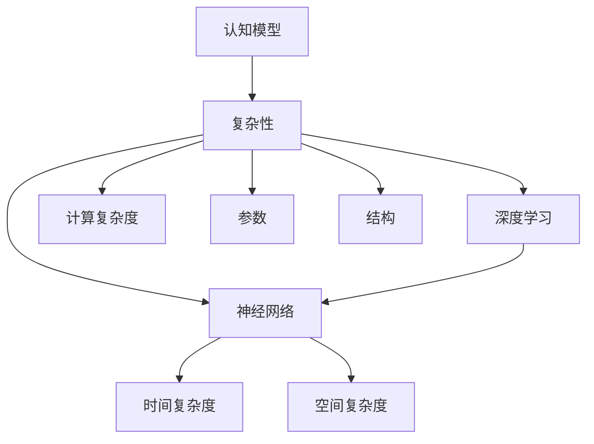

                 

# 当前AI的挑战：认知模型复杂性

> 关键词：AI，认知模型，复杂性，深度学习，神经网络，算法原理，数学模型，实战案例

> 摘要：本文将深入探讨当前人工智能领域面临的重大挑战——认知模型的复杂性。我们将从背景介绍、核心概念、算法原理、数学模型、实战案例等多个角度出发，剖析认知模型复杂性的原因和解决方案，为读者提供全面的认知模型复杂性分析和应对策略。

## 1. 背景介绍

### 1.1 目的和范围

本文旨在全面探讨人工智能领域中的一个重要挑战——认知模型的复杂性。随着深度学习技术的飞速发展，人工智能的应用场景不断扩展，然而，随之而来的一个问题是，如何处理和应对认知模型的复杂性。本文将从多个角度深入分析这一问题，旨在为读者提供全面的认知模型复杂性分析和解决方案。

### 1.2 预期读者

本文适合对人工智能、深度学习和神经网络有一定了解的读者，包括研究人员、开发者、工程师和学生。本文将尽量使用通俗易懂的语言，但也会涉及到一些专业术语和概念，因此，对于完全初学者可能需要一定的背景知识。

### 1.3 文档结构概述

本文的结构如下：

1. 背景介绍：包括目的和范围、预期读者、文档结构概述和术语表。
2. 核心概念与联系：介绍与认知模型复杂性相关的基础知识和概念。
3. 核心算法原理 & 具体操作步骤：详细阐述与认知模型复杂性相关的核心算法原理和操作步骤。
4. 数学模型和公式 & 详细讲解 & 举例说明：介绍与认知模型复杂性相关的数学模型和公式，并通过具体例子进行讲解。
5. 项目实战：代码实际案例和详细解释说明。
6. 实际应用场景：分析认知模型复杂性的实际应用场景。
7. 工具和资源推荐：推荐相关学习资源和开发工具。
8. 总结：未来发展趋势与挑战。
9. 附录：常见问题与解答。
10. 扩展阅读 & 参考资料。

### 1.4 术语表

#### 1.4.1 核心术语定义

- 认知模型：指用于模拟人类认知过程的计算机模型，包括神经网络、深度学习模型等。
- 复杂性：指认知模型的结构、参数和计算复杂度。
- 深度学习：一种人工智能方法，通过多层神经网络学习数据的特征和规律。
- 神经网络：由大量简单节点（神经元）互联而成的计算模型。

#### 1.4.2 相关概念解释

- 计算复杂度：指执行算法所需的计算资源，包括时间复杂度和空间复杂度。
- 参数：指神经网络中的权重和偏置，用于调整网络的行为。
- 结构：指神经网络中的层数、节点数和连接方式。

#### 1.4.3 缩略词列表

- AI：人工智能
- DL：深度学习
- CNN：卷积神经网络
- RNN：循环神经网络
- LSTM：长短期记忆网络

## 2. 核心概念与联系

在探讨认知模型的复杂性之前，我们需要了解一些与认知模型复杂性相关的基础知识和概念。以下是一个简单的 Mermaid 流程图，用于展示认知模型复杂性的核心概念和联系：



在这个流程图中，我们可以看到，认知模型的复杂性主要受到以下几个因素的影响：

1. **深度学习**：深度学习是当前人工智能领域的主要技术之一，它通过多层神经网络学习数据的特征和规律。深度学习的层次越多，模型的复杂性就越高。
2. **神经网络**：神经网络是认知模型的核心组成部分，它由大量简单节点（神经元）互联而成。神经网络的节点数量和连接方式会影响模型的复杂度。
3. **计算复杂度**：计算复杂度是评估算法效率的重要指标，它包括时间复杂度和空间复杂度。复杂度越高，模型的训练和推理速度就越慢。
4. **参数**：参数是神经网络中的权重和偏置，用于调整网络的行为。参数的数量会影响模型的复杂度。
5. **结构**：结构是指神经网络中的层数、节点数和连接方式。不同的结构会导致不同的复杂度。

## 3. 核心算法原理 & 具体操作步骤

在了解了认知模型复杂性的核心概念和联系之后，接下来我们将详细探讨与认知模型复杂性相关的核心算法原理和具体操作步骤。以下是一个简单的伪代码，用于展示深度学习模型的训练过程：

```python
def train_model(data, epochs):
    # 初始化模型参数
    initialize_parameters()

    for epoch in range(epochs):
        for batch in data:
            # 前向传播
            output = forward_pass(batch, parameters)

            # 计算损失
            loss = compute_loss(output, target)

            # 反向传播
            backward_pass(output, target, parameters)

            # 更新参数
            update_parameters(loss, learning_rate)

    return parameters
```

在这个伪代码中，`train_model` 函数用于训练深度学习模型。它接收两个参数：`data`（训练数据）和`epochs`（训练轮数）。训练过程主要包括以下几个步骤：

1. **初始化模型参数**：初始化神经网络中的权重和偏置。
2. **前向传播**：输入一批数据，通过神经网络计算输出。
3. **计算损失**：计算输出和目标之间的差距，即损失函数。
4. **反向传播**：根据损失函数，计算每个参数的梯度。
5. **更新参数**：使用梯度下降法或其他优化算法，更新网络中的权重和偏置。

通过以上步骤，模型会不断调整参数，使得输出逐渐接近目标。然而，这个过程也存在一些挑战：

1. **梯度消失/爆炸**：在反向传播过程中，梯度可能会变得非常小（消失）或非常大（爆炸），导致无法有效更新参数。
2. **过拟合**：模型在训练数据上表现良好，但在测试数据上表现较差，这是因为模型在训练过程中学习了过多无关的特征。
3. **计算复杂度**：深度学习模型的训练需要大量的计算资源，特别是当模型复杂度较高时。

为了解决这些挑战，研究人员提出了一些改进算法和策略，如正则化、批归一化、激活函数的设计等，这些策略有助于提高模型的稳定性和性能。

## 4. 数学模型和公式 & 详细讲解 & 举例说明

在深度学习模型中，数学模型和公式起着至关重要的作用。以下是一些常见的数学模型和公式，以及它们的详细讲解和举例说明：

### 4.1 损失函数

损失函数是深度学习模型中的一个关键组件，它用于衡量模型的预测结果与真实结果之间的差距。常见的损失函数包括均方误差（MSE）、交叉熵损失（Cross-Entropy Loss）等。

#### 均方误差（MSE）

均方误差是一种常用的损失函数，它计算预测值与真实值之间的均方差距。

$$
MSE = \frac{1}{n} \sum_{i=1}^{n} (y_i - \hat{y}_i)^2
$$

其中，$y_i$ 表示第 $i$ 个真实值，$\hat{y}_i$ 表示第 $i$ 个预测值，$n$ 表示样本数量。

#### 交叉熵损失（Cross-Entropy Loss）

交叉熵损失是用于分类问题的损失函数，它计算预测概率分布与真实概率分布之间的交叉熵。

$$
Cross-Entropy Loss = -\frac{1}{n} \sum_{i=1}^{n} y_i \log(\hat{y}_i)
$$

其中，$y_i$ 表示第 $i$ 个样本的真实标签（0或1），$\hat{y}_i$ 表示第 $i$ 个样本的预测概率。

### 4.2 梯度下降法

梯度下降法是一种优化算法，用于更新神经网络中的参数。它通过计算损失函数关于参数的梯度，并沿着梯度的反方向更新参数。

#### 梯度下降法（Stochastic Gradient Descent，SGD）

梯度下降法的基本思想是，每次迭代中，随机选择一个样本，计算该样本的梯度，然后更新参数。

$$
\theta_{t+1} = \theta_{t} - \alpha \cdot \nabla_{\theta} J(\theta)
$$

其中，$\theta_t$ 表示第 $t$ 次迭代的参数，$\alpha$ 表示学习率，$J(\theta)$ 表示损失函数。

#### 批量梯度下降法（Batch Gradient Descent，BGD）

批量梯度下降法是一种改进的梯度下降法，它每次迭代中计算整个训练数据的梯度，然后更新参数。

$$
\theta_{t+1} = \theta_{t} - \alpha \cdot \frac{1}{n} \sum_{i=1}^{n} \nabla_{\theta} J(\theta)
$$

其中，$n$ 表示训练数据的数量。

### 4.3 激活函数

激活函数是神经网络中的一个关键组件，它用于引入非线性变换，使得神经网络具有更好的表达能力和泛化能力。常见的激活函数包括 sigmoid、ReLU、Tanh 等。

#### sigmoid 函数

sigmoid 函数是一种常用的激活函数，它将输入映射到 $(0, 1)$ 区间。

$$
\sigma(x) = \frac{1}{1 + e^{-x}}
$$

#### ReLU 函数

ReLU 函数是一种简单的激活函数，它将输入映射到 $(0, +\infty)$ 区间。

$$
ReLU(x) = \max(0, x)
$$

#### Tanh 函数

Tanh 函数是另一种常用的激活函数，它将输入映射到 $(-1, 1)$ 区间。

$$
Tanh(x) = \frac{e^x - e^{-x}}{e^x + e^{-x}}
$$

### 4.4 举例说明

以下是一个简单的例子，用于说明如何使用梯度下降法训练一个二分类神经网络。

```python
import numpy as np

# 初始化参数
weights = np.random.randn(3, 2)
bias = np.random.randn(2)

# 初始化学习率
learning_rate = 0.01

# 初始化数据
x = np.array([[1, 0], [0, 1], [1, 1]])
y = np.array([[1], [0], [1]])

# 定义激活函数
def sigmoid(x):
    return 1 / (1 + np.exp(-x))

# 定义损失函数
def mse(y_true, y_pred):
    return np.mean((y_true - y_pred) ** 2)

# 定义梯度下降法
def gradient_descent(x, y, weights, bias, learning_rate, epochs):
    for epoch in range(epochs):
        output = sigmoid(np.dot(x, weights) + bias)
        error = y - output
        weights -= learning_rate * np.dot(x.T, error)
        bias -= learning_rate * np.mean(error)
    
    return weights, bias

# 训练模型
weights, bias = gradient_descent(x, y, weights, bias, learning_rate, 1000)

# 输出结果
print("Final weights:", weights)
print("Final bias:", bias)
```

在这个例子中，我们使用 sigmoid 函数作为激活函数，均方误差（MSE）作为损失函数，梯度下降法进行参数更新。通过训练，我们可以得到模型的权重和偏置。

## 5. 项目实战：代码实际案例和详细解释说明

在本节中，我们将通过一个实际的项目案例来展示如何应对认知模型复杂性。我们将使用 Python 编写一个简单的卷积神经网络（CNN）模型，用于图像分类任务。

### 5.1 开发环境搭建

为了搭建开发环境，我们需要安装以下软件和库：

- Python 3.x
- TensorFlow 2.x
- NumPy
- Matplotlib

安装方法如下：

```bash
# 安装 Python 3.x
# ...

# 安装 TensorFlow 2.x
pip install tensorflow

# 安装 NumPy
pip install numpy

# 安装 Matplotlib
pip install matplotlib
```

### 5.2 源代码详细实现和代码解读

以下是项目的主要代码实现和解读：

```python
import tensorflow as tf
from tensorflow.keras import layers
import numpy as np
import matplotlib.pyplot as plt

# 5.2.1 数据预处理
def load_data():
    # 加载 MNIST 数据集
    (x_train, y_train), (x_test, y_test) = tf.keras.datasets.mnist.load_data()
    
    # 数据标准化
    x_train = x_train.astype("float32") / 255
    x_test = x_test.astype("float32") / 255
    
    # 转换标签为 one-hot 编码
    y_train = tf.keras.utils.to_categorical(y_train, 10)
    y_test = tf.keras.utils.to_categorical(y_test, 10)
    
    return x_train, y_train, x_test, y_test

# 5.2.2 构建模型
def build_model():
    # 创建模型
    model = tf.keras.Sequential([
        layers.Conv2D(32, (3, 3), activation="relu", input_shape=(28, 28, 1)),
        layers.MaxPooling2D((2, 2)),
        layers.Flatten(),
        layers.Dense(64, activation="relu"),
        layers.Dense(10, activation="softmax")
    ])
    
    # 编译模型
    model.compile(optimizer="adam", loss="categorical_crossentropy", metrics=["accuracy"])
    
    return model

# 5.2.3 训练模型
def train_model(model, x_train, y_train, x_test, y_test, epochs=10, batch_size=64):
    # 训练模型
    history = model.fit(x_train, y_train, batch_size=batch_size, epochs=epochs, validation_data=(x_test, y_test))
    
    # 输出训练结果
    print("Training complete.")
    print("Test accuracy:", model.evaluate(x_test, y_test)[1])
    
    return history

# 5.2.4 可视化结果
def visualize_results(history):
    # 可视化训练过程
    plt.figure(figsize=(12, 4))
    
    # 可视化损失函数
    plt.subplot(1, 2, 1)
    plt.plot(history.history["loss"], label="Training loss")
    plt.plot(history.history["val_loss"], label="Validation loss")
    plt.title("Loss Function")
    plt.xlabel("Epochs")
    plt.ylabel("Loss")
    plt.legend()
    
    # 可视化准确率
    plt.subplot(1, 2, 2)
    plt.plot(history.history["accuracy"], label="Training accuracy")
    plt.plot(history.history["val_accuracy"], label="Validation accuracy")
    plt.title("Accuracy Function")
    plt.xlabel("Epochs")
    plt.ylabel("Accuracy")
    plt.legend()
    
    plt.show()

# 5.2.5 主函数
def main():
    # 加载数据
    x_train, y_train, x_test, y_test = load_data()
    
    # 构建模型
    model = build_model()
    
    # 训练模型
    history = train_model(model, x_train, y_train, x_test, y_test)
    
    # 可视化结果
    visualize_results(history)

# 运行主函数
if __name__ == "__main__":
    main()
```

### 5.3 代码解读与分析

在上述代码中，我们首先定义了数据预处理、模型构建、训练模型和可视化结果等功能。以下是关键部分的解读和分析：

1. **数据预处理**：

   ```python
   def load_data():
       # 加载 MNIST 数据集
       (x_train, y_train), (x_test, y_test) = tf.keras.datasets.mnist.load_data()
       
       # 数据标准化
       x_train = x_train.astype("float32") / 255
       x_test = x_test.astype("float32") / 255
       
       # 转换标签为 one-hot 编码
       y_train = tf.keras.utils.to_categorical(y_train, 10)
       y_test = tf.keras.utils.to_categorical(y_test, 10)
       
       return x_train, y_train, x_test, y_test
   ```

   在这个函数中，我们首先加载 MNIST 数据集，然后对数据进行标准化处理，将像素值缩放到 [0, 1] 区间。接下来，我们将标签转换为 one-hot 编码，以便用于分类任务。

2. **模型构建**：

   ```python
   def build_model():
       # 创建模型
       model = tf.keras.Sequential([
           layers.Conv2D(32, (3, 3), activation="relu", input_shape=(28, 28, 1)),
           layers.MaxPooling2D((2, 2)),
           layers.Flatten(),
           layers.Dense(64, activation="relu"),
           layers.Dense(10, activation="softmax")
       ])
       
       # 编译模型
       model.compile(optimizer="adam", loss="categorical_crossentropy", metrics=["accuracy"])
       
       return model
   ```

   在这个函数中，我们创建了一个简单的卷积神经网络（CNN）模型，包括卷积层、池化层、全连接层和 softmax 层。卷积层用于提取图像特征，池化层用于降低模型的复杂度，全连接层用于分类，softmax 层用于计算每个类别的概率。

3. **训练模型**：

   ```python
   def train_model(model, x_train, y_train, x_test, y_test, epochs=10, batch_size=64):
       # 训练模型
       history = model.fit(x_train, y_train, batch_size=batch_size, epochs=epochs, validation_data=(x_test, y_test))
       
       # 输出训练结果
       print("Training complete.")
       print("Test accuracy:", model.evaluate(x_test, y_test)[1])
       
       return history
   ```

   在这个函数中，我们使用训练数据和测试数据训练模型。`fit` 函数用于训练模型，`evaluate` 函数用于评估模型在测试数据上的性能。

4. **可视化结果**：

   ```python
   def visualize_results(history):
       # 可视化训练过程
       plt.figure(figsize=(12, 4))
       
       # 可视化损失函数
       plt.subplot(1, 2, 1)
       plt.plot(history.history["loss"], label="Training loss")
       plt.plot(history.history["val_loss"], label="Validation loss")
       plt.title("Loss Function")
       plt.xlabel("Epochs")
       plt.ylabel("Loss")
       plt.legend()
       
       # 可视化准确率
       plt.subplot(1, 2, 2)
       plt.plot(history.history["accuracy"], label="Training accuracy")
       plt.plot(history.history["val_accuracy"], label="Validation accuracy")
       plt.title("Accuracy Function")
       plt.xlabel("Epochs")
       plt.ylabel("Accuracy")
       plt.legend()
       
       plt.show()
   ```

   在这个函数中，我们使用 Matplotlib 库可视化训练过程中的损失函数和准确率。通过可视化，我们可以直观地了解模型的训练过程和性能。

## 6. 实际应用场景

认知模型的复杂性在人工智能领域具有广泛的应用场景。以下是一些典型的应用场景：

1. **图像识别**：深度学习模型在图像识别任务中发挥着重要作用，如人脸识别、物体检测、图像分类等。认知模型的复杂性使得模型能够提取丰富的图像特征，从而提高识别精度。
2. **自然语言处理**：自然语言处理（NLP）是人工智能领域的一个重要分支，包括文本分类、情感分析、机器翻译等。认知模型在 NLP 领域的应用使得模型能够理解复杂的语言结构和语义关系。
3. **推荐系统**：推荐系统广泛应用于电商、社交媒体和在线视频等领域。认知模型通过分析用户的历史行为和偏好，为用户推荐感兴趣的内容。
4. **游戏开发**：深度学习模型在游戏开发中具有广泛的应用，如游戏人工智能（AI）和强化学习。认知模型复杂性使得游戏 AI 能够学习复杂的策略和决策。
5. **生物信息学**：生物信息学是生物学和计算机科学的交叉领域，包括基因序列分析、蛋白质结构预测等。认知模型在生物信息学领域具有广泛的应用前景。

## 7. 工具和资源推荐

为了更好地学习和应用认知模型，以下是一些推荐的工具和资源：

### 7.1 学习资源推荐

#### 7.1.1 书籍推荐

- 《深度学习》（Goodfellow, Bengio, Courville）：这是一本经典的深度学习教材，详细介绍了深度学习的理论基础和应用实践。
- 《Python深度学习》（François Chollet）：这本书是 TensorFlow 的作者撰写的，涵盖了深度学习在 Python 中的实现和应用。

#### 7.1.2 在线课程

- 吴恩达的《深度学习专项课程》（Deep Learning Specialization）：这是一门由吴恩达教授主讲的深度学习课程，包括理论、实践和项目实践。
- 《斯坦福大学深度学习课程》（Stanford University CS231n）：这是一门关于计算机视觉的深度学习课程，由斯坦福大学教授 Fei-Fei Li 主讲。

#### 7.1.3 技术博客和网站

- Medium 上的深度学习专栏：这是一个关于深度学习的博客集合，涵盖了深度学习的最新研究、应用和实践。
- 知乎上的深度学习话题：这是一个关于深度学习的问答社区，汇聚了大量的深度学习专家和爱好者。

### 7.2 开发工具框架推荐

#### 7.2.1 IDE和编辑器

- PyCharm：一款功能强大的 Python 集成开发环境，适用于深度学习和数据科学项目。
- Jupyter Notebook：一款基于 Web 的交互式编程环境，适用于数据可视化和深度学习项目。

#### 7.2.2 调试和性能分析工具

- TensorFlow Debugger（TFD）：一款用于 TensorFlow 模型的调试和分析工具，可以帮助开发者发现和修复模型中的错误。
- TensorBoard：一款基于 Web 的可视化工具，用于分析 TensorFlow 模型的训练过程和性能。

#### 7.2.3 相关框架和库

- TensorFlow：一款开源的深度学习框架，适用于各种深度学习任务和应用场景。
- PyTorch：一款开源的深度学习框架，具有灵活的动态计算图和高效的训练速度。

### 7.3 相关论文著作推荐

#### 7.3.1 经典论文

- 《A Brief History of Neural Nets: From McCulloch-Pitts to Neural Neworks》
- 《Learning representations by back-propagating errors》
- 《Deep Learning: Methods and Applications》

#### 7.3.2 最新研究成果

- 《EfficientNet: Rethinking Model Scaling for Convolutional Neural Networks》
- 《An Image Database for Simulating Adversarial Examples》
- 《BERT: Pre-training of Deep Bidirectional Transformers for Language Understanding》

#### 7.3.3 应用案例分析

- 《Neural Networks for Vision: From Convolutional Layers to Object Recognition》
- 《Recurrent Neural Networks for Language Modeling》
- 《Deep Learning for Natural Language Processing》

## 8. 总结：未来发展趋势与挑战

在总结当前 AI 的挑战——认知模型复杂性的过程中，我们分析了认知模型的复杂性带来的影响和解决方案。认知模型复杂性在深度学习、神经网络、计算复杂度、参数和结构等方面表现明显。为了应对这一挑战，研究人员提出了一系列算法和策略，如正则化、批归一化、优化算法等。

展望未来，认知模型的复杂性将继续成为人工智能领域的一个重要挑战。随着计算能力的提升和算法的优化，我们可以期待更高的模型复杂度和更好的性能。同时，研究人员也将探索新的算法和结构，以降低模型的复杂度和计算成本。

然而，我们也需要关注以下挑战：

1. **可解释性**：随着模型复杂性的增加，模型的解释性逐渐减弱。如何提高模型的解释性，使得模型的行为更加透明和可理解，是一个重要的研究方向。
2. **泛化能力**：高复杂度的模型容易过拟合，如何提高模型的泛化能力，使其在未知数据上表现良好，是一个亟待解决的问题。
3. **计算资源**：高复杂度的模型需要大量的计算资源和时间进行训练。如何优化模型结构和算法，降低计算成本，是一个关键问题。

总之，认知模型复杂性是当前 AI 领域面临的一个重要挑战。通过不断的研究和创新，我们有信心克服这一挑战，推动人工智能的发展。

## 9. 附录：常见问题与解答

在本文中，我们介绍了认知模型复杂性的概念、原因和解决方案。以下是关于认知模型复杂性的一些常见问题及其解答：

### 问题 1：什么是认知模型复杂性？

认知模型复杂性指的是认知模型（如神经网络、深度学习模型）的结构、参数和计算复杂度。随着模型复杂度的增加，模型的训练和推理时间也会增加。

### 问题 2：为什么认知模型复杂性是一个挑战？

认知模型复杂性导致以下几个问题：

1. **计算复杂度**：复杂度高的模型需要更多的计算资源进行训练和推理。
2. **过拟合**：复杂度高的模型容易在训练数据上过拟合，导致在测试数据上表现不佳。
3. **可解释性**：复杂度高的模型行为难以解释和理解。

### 问题 3：如何降低认知模型复杂性？

以下是一些降低认知模型复杂性的方法：

1. **模型压缩**：使用模型压缩技术，如量化、剪枝和蒸馏，减少模型的参数数量。
2. **正则化**：使用正则化技术，如 L1 正则化、L2 正则化，限制模型参数的范围。
3. **优化算法**：使用优化算法，如批量梯度下降、随机梯度下降，提高模型训练的效率。

### 问题 4：认知模型复杂性在哪些领域有应用？

认知模型复杂性在多个领域有应用，包括：

1. **图像识别**：如人脸识别、物体检测、图像分类。
2. **自然语言处理**：如文本分类、情感分析、机器翻译。
3. **推荐系统**：如电商推荐、社交媒体推荐、在线视频推荐。
4. **游戏开发**：如游戏 AI、强化学习。
5. **生物信息学**：如基因序列分析、蛋白质结构预测。

## 10. 扩展阅读 & 参考资料

为了更深入地了解认知模型复杂性，以下是扩展阅读和参考资料：

- 《深度学习》（Goodfellow, Bengio, Courville）：介绍了深度学习的基本概念、算法和模型。
- 《神经网络与深度学习》（邱锡鹏）：详细介绍了神经网络和深度学习的理论基础和应用。
- 《神经网络简明教程》（米尔格拉姆）：这是一本关于神经网络的入门书籍，适合初学者阅读。
- 《深度学习技术及应用》（刘铁岩）：介绍了深度学习在图像识别、自然语言处理等领域的应用。
- TensorFlow 官方文档：https://www.tensorflow.org/，提供了丰富的深度学习教程和工具。
- PyTorch 官方文档：https://pytorch.org/docs/stable/index.html，提供了丰富的深度学习教程和工具。

通过阅读这些资料，您可以更深入地了解认知模型复杂性的相关知识和应用。

