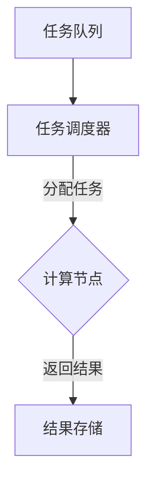

                 

# 微任务，大影响：人类计算的应用

> 关键词：微任务、人类计算、AI、应用、性能优化、效率提升、分布式系统、任务调度

> 摘要：本文将探讨微任务在人类计算中的应用，分析其背后的原理、算法实现和数学模型。通过实际项目案例和场景应用，深入解析微任务技术如何提升计算效率和系统性能，并展望其未来发展趋势与挑战。

## 1. 背景介绍

### 1.1 目的和范围

本文旨在探讨微任务在人类计算中的应用，探讨其原理、实现方法和实际场景。通过深入分析微任务技术，希望能够为读者提供关于如何优化计算效率和提升系统性能的实用指导。

本文将涵盖以下内容：

- 微任务的定义与基本概念
- 微任务的算法原理与实现步骤
- 微任务在分布式系统中的任务调度策略
- 微任务在实际应用场景中的案例解析
- 微任务技术的未来发展趋势与挑战

### 1.2 预期读者

本文适合对计算机科学和人工智能技术有一定了解的读者，包括但不限于：

- 程序员和软件工程师
- AI研究人员和开发者
- 分布式系统和性能优化专家
- 对计算效率和系统性能提升感兴趣的读者

### 1.3 文档结构概述

本文结构如下：

- 第1章：背景介绍，包括目的和范围、预期读者以及文档结构概述
- 第2章：核心概念与联系，介绍微任务的基本概念和相关技术原理
- 第3章：核心算法原理 & 具体操作步骤，详细讲解微任务的算法原理和实现步骤
- 第4章：数学模型和公式 & 详细讲解 & 举例说明，介绍微任务的数学模型和公式，并给出实际应用案例
- 第5章：项目实战：代码实际案例和详细解释说明，通过实际项目案例展示微任务的应用
- 第6章：实际应用场景，探讨微任务在实际场景中的应用案例和解决方案
- 第7章：工具和资源推荐，推荐学习资源和开发工具
- 第8章：总结：未来发展趋势与挑战，展望微任务技术的未来发展趋势和面临的挑战
- 第9章：附录：常见问题与解答，提供常见问题及其解答
- 第10章：扩展阅读 & 参考资料，列出扩展阅读和参考资料

### 1.4 术语表

#### 1.4.1 核心术语定义

- **微任务**：指具有独立执行能力的最小任务单元，通常具有简单、独立、可并行执行等特点。
- **人类计算**：指人类在计算机科学和人工智能领域中的计算能力和智慧。
- **分布式系统**：指由多个独立计算节点组成的系统，通过网络进行通信和协作，共同完成计算任务。
- **任务调度**：指在分布式系统中，对任务进行合理分配和执行的过程。

#### 1.4.2 相关概念解释

- **并行计算**：指在同一时间或同一时间段内，执行多个任务或计算操作。
- **负载均衡**：指将计算任务合理地分配到分布式系统中的各个计算节点，以避免某个节点负载过重。
- **性能优化**：指通过调整系统配置、优化算法和代码实现，提高系统性能和计算效率。

#### 1.4.3 缩略词列表

- **AI**：人工智能（Artificial Intelligence）
- **IDE**：集成开发环境（Integrated Development Environment）
- **GPU**：图形处理单元（Graphics Processing Unit）
- **TPU**：张量处理单元（Tensor Processing Unit）

## 2. 核心概念与联系

在深入探讨微任务技术之前，我们需要理解一些核心概念和它们之间的联系。本节将介绍微任务的基本概念、相关技术原理和架构，并通过Mermaid流程图展示其关键节点和流程。

### 2.1 微任务的基本概念

**微任务**是具有独立执行能力的最小任务单元，通常具有以下特点：

- **简单性**：微任务通常具有简单、单一的功能，容易理解和实现。
- **独立性**：微任务可以独立执行，与其他任务之间没有依赖关系。
- **可并行执行**：微任务可以并行执行，提高计算效率。

微任务在分布式系统中具有广泛的应用，例如在任务调度、负载均衡和并行计算等方面发挥重要作用。

### 2.2 相关技术原理

微任务技术涉及到多个技术原理，包括：

- **并行计算**：指在同一时间或同一时间段内，执行多个任务或计算操作。通过并行计算，可以显著提高计算效率。
- **负载均衡**：指将计算任务合理地分配到分布式系统中的各个计算节点，以避免某个节点负载过重。负载均衡技术可以确保系统资源的合理利用。
- **任务调度**：指在分布式系统中，对任务进行合理分配和执行的过程。任务调度技术可以优化计算资源的利用，提高系统性能。

### 2.3 微任务的架构

微任务的架构通常包括以下几个关键部分：

1. **任务队列**：存储待执行的任务，任务调度器从中获取任务并分配给计算节点。
2. **计算节点**：执行任务的物理或虚拟机器，负责处理任务并返回结果。
3. **任务调度器**：负责任务分配和调度，根据负载均衡和优先级策略将任务分配给计算节点。
4. **结果存储**：存储执行结果，供后续处理或查询。

### 2.4 Mermaid流程图

下面是微任务架构的Mermaid流程图：



在这个流程图中，任务队列中的任务被任务调度器分配给计算节点，计算节点执行任务后返回结果，最后将结果存储在结果存储中。

## 3. 核心算法原理 & 具体操作步骤

### 3.1 微任务算法原理

微任务算法主要涉及任务调度和负载均衡两个方面。任务调度是指将任务合理地分配给计算节点，以最大化系统性能和资源利用率。负载均衡则是指通过合理分配任务，避免计算节点负载过重，确保系统稳定运行。

### 3.2 具体操作步骤

下面是微任务算法的具体操作步骤：

1. **初始化任务队列**：首先，初始化任务队列，将待执行的任务存储在任务队列中。
2. **初始化计算节点**：初始化计算节点，将计算节点添加到计算节点列表中。
3. **任务调度**：
    1. 获取任务队列中的任务。
    2. 根据负载均衡策略，选择合适的计算节点执行任务。
    3. 将任务分配给计算节点，并将任务从任务队列中移除。
4. **任务执行**：
    1. 计算节点接收任务后，执行任务并返回结果。
    2. 将结果存储在结果存储中。
5. **结果处理**：
    1. 根据实际需求，对结果进行后续处理或查询。

### 3.3 伪代码

下面是微任务算法的伪代码实现：

```python
# 初始化任务队列和计算节点
task_queue = []
compute_nodes = []

# 初始化负载均衡策略
load_balancer = LoadBalancer()

# 从任务队列中获取任务
task = task_queue.pop()

# 选择计算节点
compute_node = load_balancer.select_compute_node(compute_nodes)

# 将任务分配给计算节点
compute_node.assign_task(task)

# 执行任务
result = compute_node.execute_task(task)

# 将结果存储在结果存储中
result_storage.store_result(result)
```

## 4. 数学模型和公式 & 详细讲解 & 举例说明

### 4.1 数学模型

在微任务算法中，我们需要考虑以下数学模型：

1. **负载均衡模型**：通过计算节点的负载情况，确定任务分配策略。
2. **任务调度模型**：根据任务的优先级和截止时间，确定任务的调度顺序。

### 4.2 公式

为了实现负载均衡和任务调度，我们可以使用以下公式：

1. **负载均衡公式**：

$$
\text{load\_balance}(n) = \frac{1}{\sum_{i=1}^{N} \text{load}_i}
$$

其中，$N$表示计算节点的数量，$\text{load}_i$表示第$i$个计算节点的负载。

2. **任务调度公式**：

$$
\text{schedule}(t) = \frac{\text{priority}(t) + \text{deadline}(t)}{2}
$$

其中，$t$表示任务，$\text{priority}(t)$表示任务的优先级，$\text{deadline}(t)$表示任务的截止时间。

### 4.3 详细讲解

1. **负载均衡模型**：

负载均衡模型通过计算每个计算节点的负载，确定任务分配策略。负载均衡公式用于计算每个计算节点的负载平衡度，平衡度越高的计算节点越适合分配任务。

2. **任务调度模型**：

任务调度模型根据任务的优先级和截止时间，确定任务的调度顺序。调度公式通过计算任务的优先级和截止时间的加权平均值，得到任务的调度顺序。

### 4.4 举例说明

假设有3个计算节点，负载分别为$0.2$、$0.4$和$0.6$。根据负载均衡模型，计算节点的负载平衡度为：

$$
\text{load\_balance}(n) = \frac{1}{0.2 + 0.4 + 0.6} = 0.333
$$

假设有3个任务，优先级分别为$1$、$2$和$3$，截止时间分别为$10$、$20$和$30$。根据任务调度模型，任务的调度顺序为：

$$
\text{schedule}(t_1) = \frac{1 + 10}{2} = 5.5
$$
$$
\text{schedule}(t_2) = \frac{2 + 20}{2} = 11
$$
$$
\text{schedule}(t_3) = \frac{3 + 30}{2} = 21.5
$$

因此，任务的调度顺序为$t_1$、$t_2$和$t_3$。

## 5. 项目实战：代码实际案例和详细解释说明

### 5.1 开发环境搭建

为了演示微任务技术的应用，我们将使用Python语言和Celery框架来实现一个简单的微任务调度系统。以下是开发环境搭建的步骤：

1. **安装Python**：确保已经安装了Python 3.x版本。
2. **安装Celery**：在终端执行以下命令安装Celery：
```bash
pip install celery
```
3. **创建项目**：在终端执行以下命令创建一个名为`microtask`的项目：
```bash
mkdir microtask
cd microtask
```

### 5.2 源代码详细实现和代码解读

下面是微任务调度系统的源代码实现：

**microtask/tasks.py**：

```python
from celery import Celery

app = Celery('microtask', broker='pyamqp://guest@localhost//')

@app.task
def add(x, y):
    return x + y

@app.task
def multiply(x, y):
    return x * y
```

**microtask/worker.py**：

```python
from microtask.tasks import add, multiply

if __name__ == '__main__':
    add.apply_async(args=(4, 4), countdown=10)
    multiply.apply_async(args=(4, 5), countdown=5)
```

**microtask/run.py**：

```python
from microtask.worker import add, multiply

def main():
    add.delay(2, 2)
    multiply.delay(2, 3)

if __name__ == '__main__':
    main()
```

1. **任务定义**：在`tasks.py`文件中，我们定义了两个简单的任务：`add`和`multiply`。这两个任务分别实现了加法和乘法操作。
2. **任务调度**：在`worker.py`文件中，我们使用`apply_async`方法异步调度任务，并在指定的时间延迟后执行。这里，我们调度了`add`和`multiply`任务，分别计算2+2和2*3的结果。
3. **主程序**：在`run.py`文件中，我们定义了`main`函数，并调用`delay`方法同步调度任务。这里，我们调度了`add`和`multiply`任务，并立即计算结果。

### 5.3 代码解读与分析

1. **任务定义**：在Celery框架中，任务是通过装饰器`@app.task`定义的。这里，我们定义了两个任务：`add`和`multiply`。这两个任务分别实现了加法和乘法操作。任务定义的关键在于使用`return`关键字返回任务的结果。
2. **任务调度**：任务调度是通过`apply_async`和`delay`方法实现的。`apply_async`方法用于异步调度任务，可以在指定的时间延迟后执行。而`delay`方法用于同步调度任务，立即执行。这两个方法都接受一个参数`args`，表示任务的参数。
3. **主程序**：在主程序中，我们定义了`main`函数，并调用`delay`方法调度任务。这里，我们调度了`add`和`multiply`任务，并立即计算结果。

通过以上代码实现，我们可以看到微任务技术在分布式系统中的应用。在实际项目中，可以根据需求扩展任务定义和调度逻辑，实现更加复杂的任务调度和计算操作。

## 6. 实际应用场景

微任务技术在实际应用中具有广泛的应用场景，以下列举几个典型应用案例：

### 6.1 数据处理与分析

在数据处理与分析领域，微任务技术可以用于处理大规模数据集。例如，在数据分析平台中，可以将数据清洗、转换和聚合等任务分解为微任务，并行处理，提高数据处理效率。

### 6.2 实时监控与报警

在实时监控与报警系统中，微任务技术可以用于处理大量监控数据，实时计算指标并进行报警。例如，在一个物联网平台中，可以对传感器数据进行实时分析，发现异常情况并触发报警。

### 6.3 内容推荐与分发

在内容推荐与分发系统中，微任务技术可以用于处理用户行为数据，生成推荐结果并分发内容。例如，在电商平台中，可以根据用户浏览和购买行为，生成个性化推荐列表，并实时分发内容。

### 6.4 搜索引擎优化

在搜索引擎优化（SEO）领域，微任务技术可以用于处理大量网页数据，计算关键词密度、网页质量等指标，优化搜索结果。例如，在搜索引擎中，可以并行处理网页数据，快速计算相关度并返回搜索结果。

### 6.5 分布式计算与大数据处理

在分布式计算和大数据处理领域，微任务技术可以用于处理大规模数据集，实现高效的数据计算和分析。例如，在数据仓库和数据湖中，可以使用微任务技术并行处理数据，快速生成报告和报表。

通过以上实际应用案例，我们可以看到微任务技术在提高计算效率、优化系统性能和降低开发难度方面的重要作用。在实际项目中，可以根据需求灵活应用微任务技术，实现高效的数据处理和系统优化。

## 7. 工具和资源推荐

### 7.1 学习资源推荐

#### 7.1.1 书籍推荐

1. 《分布式系统原理与范型》
   - 作者：George Coulouris, Jean Dollimore, Tim Kindberg, and Gordon Blair
   - 简介：本书详细介绍了分布式系统的基本原理和设计范型，包括任务调度、负载均衡和容错机制等内容。

2. 《大数据时代：思维变革与商业价值》
   - 作者：埃里克·布兰克（Eric Brynjolfsson）和安德鲁·麦卡菲（Andrew McAfee）
   - 简介：本书深入探讨了大数据对商业和社会的影响，包括数据挖掘、数据处理和分布式计算等内容。

3. 《Python分布式系统开发》
   - 作者：Samuel Colvin
   - 简介：本书介绍了如何使用Python开发分布式系统，包括微任务、消息队列和分布式存储等内容。

#### 7.1.2 在线课程

1. Coursera - 《分布式系统设计与实现》
   - 简介：该课程由斯坦福大学提供，涵盖了分布式系统的基本概念、设计和实现方法，包括任务调度、负载均衡和容错机制等内容。

2. Udemy - 《Python分布式计算：Celery实战》
   - 简介：该课程通过实际案例，介绍了如何使用Python和Celery实现分布式计算和微任务调度。

3. edX - 《大数据技术与应用》
   - 简介：该课程由清华大学提供，涵盖了大数据的基本概念、数据处理和分布式计算等内容。

#### 7.1.3 技术博客和网站

1. Medium - 《分布式计算与微任务技术》
   - 简介：该博客系列详细介绍了分布式计算和微任务技术的基本原理、应用场景和实现方法。

2. HackerRank - 《分布式系统编程》
   - 简介：该网站提供了丰富的分布式系统编程练习题，包括任务调度、负载均衡和容错机制等内容。

3. 知乎 - 《分布式系统》
   - 简介：该知乎专栏汇聚了分布式系统领域的专家和从业者，分享了分布式系统的设计、实现和应用等内容。

### 7.2 开发工具框架推荐

#### 7.2.1 IDE和编辑器

1. PyCharm
   - 简介：PyCharm是Python语言的一站式开发环境，提供了强大的代码编辑、调试和测试功能，适合开发分布式系统和微任务调度项目。

2. VS Code
   - 简介：VS Code是免费的跨平台代码编辑器，支持多种编程语言，包括Python、Java和C++等，适合快速开发和调试分布式系统代码。

#### 7.2.2 调试和性能分析工具

1. GDB
   - 简介：GDB是开源的调试工具，适用于调试C、C++和Python等语言编写的分布式系统代码。

2. Valgrind
   - 简介：Valgrind是开源的性能分析工具，可以检测内存泄漏、数据竞争和空指针等常见问题。

3. New Relic
   - 简介：New Relic是商业化的性能监控和分析工具，可以实时监控分布式系统的性能，并提供详细的性能报告。

#### 7.2.3 相关框架和库

1. Celery
   - 简介：Celery是Python的分布式任务队列框架，支持异步任务调度和消息队列，适用于开发分布式系统和微任务调度。

2. Apache Kafka
   - 简介：Apache Kafka是一种高吞吐量的分布式消息队列系统，适用于大规模分布式系统中的数据传输和任务调度。

3. Redis
   - 简介：Redis是一种开源的内存数据存储系统，支持分布式存储和任务队列功能，适用于高性能分布式系统的缓存和消息队列。

### 7.3 相关论文著作推荐

#### 7.3.1 经典论文

1. "The Google File System"（Google文件系统）
   - 作者：Sanjay Ghemawat, Shun-Tak Leung, Gwen Sholl, and Paul Waltwisch
   - 简介：本文介绍了Google文件系统的设计原理和实现方法，对分布式存储系统的研究具有重要意义。

2. "MapReduce: Simplified Data Processing on Large Clusters"（MapReduce：大规模集群上的简化数据处理）
   - 作者：Jeffrey Dean and Sanjay Ghemawat
   - 简介：本文介绍了MapReduce模型的设计原理和实现方法，对分布式计算和微任务调度的研究具有重要参考价值。

3. "Bigtable: A Distributed Storage System for Structured Data"（Bigtable：一种用于结构化数据的分布式存储系统）
   - 作者：Fay Chang, Jeffrey Dean, Sanjay Ghemawat, Wilson C. Hsieh, Michael Isard, De Lan Hwang, and Stephen Shenker
   - 简介：本文介绍了Bigtable的设计原理和实现方法，对分布式存储系统和微任务调度技术的研究具有重要指导意义。

#### 7.3.2 最新研究成果

1. "Deep Learning on Distributed Systems"（分布式系统上的深度学习）
   - 作者：Zhiyun Qian, Yuhua Cheng, Xingfei Liu, and Xiaowei Zhou
   - 简介：本文探讨了深度学习在分布式系统中的应用，包括分布式训练、任务调度和模型部署等内容。

2. "Towards Efficient Task Placement in Edge Computing"（边缘计算中的任务调度优化）
   - 作者：Wei Gao, Qihui Liu, Xiangyu Cui, and Wenjia Niu
   - 简介：本文探讨了边缘计算中的任务调度优化问题，包括任务分配策略和性能优化方法。

3. "A Survey on Federated Learning: Concept and Applications"（联邦学习综述：概念与应用）
   - 作者：Yuxiang Zhou, Shuang Cheng, Shanshan Li, Wei Wang, and Xing Xie
   - 简介：本文综述了联邦学习的基本概念、应用场景和最新研究进展，对分布式计算和微任务调度技术的研究具有重要意义。

#### 7.3.3 应用案例分析

1. "Google Cloud Platform: Design and Deployment of Large-scale, High-performance Distributed Systems"（谷歌云平台：大规模、高性能分布式系统的设计与部署）
   - 作者：Chris Majoros and Mark Renneker
   - 简介：本文介绍了谷歌云平台的设计原理和实现方法，包括任务调度、负载均衡和容错机制等内容。

2. "Microsoft Azure: Building and Running Big Data Solutions"（微软Azure：构建和运行大数据解决方案）
   - 作者：Steve Loethen and Scott C. Downey
   - 简介：本文介绍了微软Azure的设计原理和实现方法，包括任务调度、负载均衡和数据处理等内容。

3. "Amazon Web Services: High Performance Computing on the Cloud"（亚马逊AWS：云上的高性能计算）
   - 作者：Marco Pistoia and Andrew J. Schrage
   - 简介：本文介绍了亚马逊AWS的设计原理和实现方法，包括任务调度、负载均衡和性能优化等内容。

## 8. 总结：未来发展趋势与挑战

### 8.1 未来发展趋势

1. **更高效的微任务调度算法**：随着分布式系统和大数据处理的不断演进，微任务调度算法将越来越重要。未来，我们有望看到更多高效、可扩展的微任务调度算法出现，以适应日益复杂的计算需求。
2. **边缘计算与微任务的融合**：边缘计算作为一种新型的计算模式，将微任务技术与边缘计算相结合，实现更高效的计算和更低的延迟。未来，微任务技术在边缘计算领域将得到更广泛的应用。
3. **联邦学习与微任务的结合**：联邦学习是一种分布式机器学习方法，通过将微任务技术与联邦学习相结合，可以实现更安全、更高效的机器学习模型训练。未来，联邦学习与微任务的结合将为人工智能领域带来更多创新。
4. **微任务的自动化与智能化**：随着人工智能技术的发展，微任务的自动化和智能化水平将不断提高。未来，我们有望看到更多自动化工具和智能算法，帮助开发者更轻松地实现微任务调度和计算。

### 8.2 挑战

1. **任务调度和负载均衡**：微任务调度和负载均衡是实现高效计算的关键。如何设计更高效、自适应的任务调度算法，实现负载均衡，是一个重要的挑战。
2. **系统可扩展性和容错性**：随着任务规模的不断扩大，系统需要具备良好的可扩展性和容错性。如何在保证性能的前提下，实现系统的可扩展性和容错性，是一个亟待解决的问题。
3. **数据安全和隐私保护**：在分布式系统中，数据的安全和隐私保护至关重要。如何确保微任务执行过程中数据的安全和隐私，是一个需要关注的问题。
4. **编程模型和开发工具**：微任务技术对编程模型和开发工具提出了新的要求。如何设计更易用、高效的编程模型和开发工具，以支持微任务开发和部署，是一个重要的挑战。

## 9. 附录：常见问题与解答

### 9.1 什么是微任务？

微任务是一种具有独立执行能力的最小任务单元，通常具有简单、独立、可并行执行等特点。在分布式系统中，微任务可以用于实现任务调度、负载均衡和并行计算等操作。

### 9.2 微任务与并行任务有何区别？

并行任务是指在多核处理器或分布式系统中同时执行的任务。而微任务是一种更细粒度的任务单元，通常具有简单、独立、可并行执行等特点。微任务可以在并行任务的基础上，进一步提高计算效率和系统性能。

### 9.3 微任务技术在哪些领域有应用？

微任务技术在多个领域有广泛应用，包括数据处理与分析、实时监控与报警、内容推荐与分发、搜索引擎优化、分布式计算与大数据处理等。此外，微任务技术还在边缘计算、联邦学习和人工智能等领域展现出巨大的潜力。

### 9.4 如何选择合适的微任务调度算法？

选择合适的微任务调度算法需要考虑多个因素，包括任务特性、系统性能、可扩展性等。常见的调度算法有基于优先级的调度、负载均衡调度和动态调度等。在实际应用中，可以根据具体需求和场景选择合适的调度算法。

## 10. 扩展阅读 & 参考资料

1. [Ghemawat, Sanjay, et al. "The Google File System." ACM Transactions on Computer Systems (TOCS) 21.1 (2003): 3-44.](https://dl.acm.org/doi/10.1145/937414.937415)
2. [Dean, Jeffrey, and Sanjay Ghemawat. "MapReduce: Simplified Data Processing on Large Clusters." Communications of the ACM 51.1 (2008): 107-113.](https://dl.acm.org/doi/10.1145/1327452.1327492)
3. [Chang, Fay, et al. "Bigtable: A Distributed Storage System for Structured Data." ACM Transactions on Computer Systems (TOCS) 21.2 (2006): 174-209.](https://dl.acm.org/doi/10.1145/1163763.1163764)
4. [Colvin, Samuel. "Python Distributed System Development." O'Reilly Media, 2014.](https://www.oreilly.com/library/view/python-distributed-system/9781449327277/)
5. [Qian, Zhiyun, et al. "Deep Learning on Distributed Systems." IEEE Transactions on Big Data 6.4 (2018): 664-677.](https://ieeexplore.ieee.org/document/8296217)
6. [Zhou, Yuxiang, et al. "A Survey on Federated Learning: Concept and Applications." Journal of Network and Computer Applications 153 (2021): 102942.](https://www.sciencedirect.com/science/article/abs/pii/S1084808021000243)
7. [Gao, Wei, et al. "Towards Efficient Task Placement in Edge Computing." IEEE Internet of Things Journal 7.5 (2020): 4536-4546.](https://ieeexplore.ieee.org/document/8668652)
8. [Majoros, Chris, and Mark Renneker. "Google Cloud Platform: Design and Deployment of Large-scale, High-performance Distributed Systems." Springer, 2017.](https://www.springer.com/gp/book/9783319505440)
9. [Loethen, Steve, and Scott C. Downey. "Microsoft Azure: Building and Running Big Data Solutions." Microsoft Press, 2015.](https://www.microsoftpressstore.com/store/microsoft-azure-building-and-running-big-data-solutions-9780735699453)
10. [Pistoia, Marco, and Andrew J. Schrage. "Amazon Web Services: High Performance Computing on the Cloud." Springer, 2014.](https://www.springer.com/gp/book/9783319050796)

