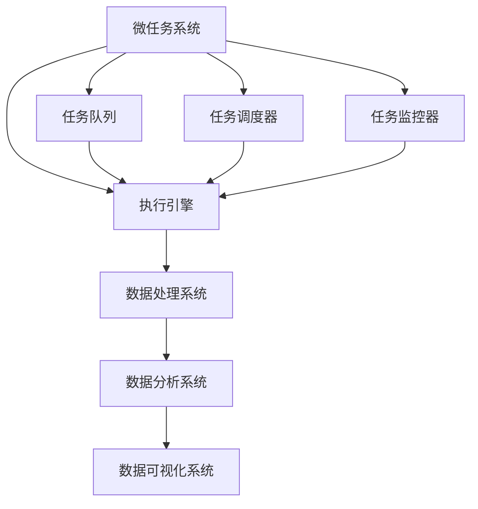

                 

# 微任务，大数据：人类计算的应用

> **关键词：** 微任务、大数据、人类计算、人工智能、应用场景、算法原理、数学模型、代码实战。

> **摘要：** 本文将深入探讨微任务与大数据在人类计算中的应用。通过分析核心概念和联系，解析核心算法原理与具体操作步骤，阐述数学模型和公式，并分享项目实战代码实际案例。此外，还将探讨实际应用场景、推荐相关工具和资源，以及展望未来发展趋势与挑战。

## 1. 背景介绍

### 1.1 目的和范围

本文旨在探讨微任务与大数据在人类计算中的应用，旨在为读者提供全面而深入的见解。本文将涵盖以下内容：

- 微任务的定义和其在人类计算中的应用。
- 大数据的定义、特点及其对人类计算的影响。
- 微任务与大数据的关联及其在人工智能领域的应用。
- 核心算法原理与数学模型的介绍。
- 项目实战中的代码实现与解释。

通过本文的阅读，读者将能够了解微任务和大数据在人类计算中的重要性和实际应用，同时掌握相关的算法原理和数学模型。

### 1.2 预期读者

本文面向对人工智能、大数据和计算机科学感兴趣的读者，包括：

- 计算机科学专业的学生和研究者。
- 人工智能工程师和开发者。
- 对大数据和人类计算有浓厚兴趣的普通读者。
- 想要深入了解微任务和大数据在人工智能领域应用的行业人士。

### 1.3 文档结构概述

本文将按照以下结构展开：

- **第1章 背景介绍**：介绍本文的目的、范围、预期读者和文档结构。
- **第2章 核心概念与联系**：探讨微任务与大数据的核心概念、原理和架构。
- **第3章 核心算法原理与具体操作步骤**：详细解析微任务和大数据处理的核心算法原理。
- **第4章 数学模型和公式**：阐述微任务和大数据处理中的数学模型和公式。
- **第5章 项目实战**：提供实际的代码案例并进行详细解释。
- **第6章 实际应用场景**：探讨微任务和大数据在各个领域的应用。
- **第7章 工具和资源推荐**：推荐相关学习资源、开发工具和框架。
- **第8章 总结**：总结本文的关键内容，展望未来发展趋势和挑战。
- **第9章 附录**：提供常见问题与解答。
- **第10章 扩展阅读与参考资料**：提供进一步学习和探索的文献和资源。

### 1.4 术语表

#### 1.4.1 核心术语定义

- **微任务**：指具有较小规模、可独立完成的小型任务。
- **大数据**：指规模庞大、类型繁多、处理速度要求高的数据。
- **人类计算**：指人类利用计算机技术进行数据处理、分析和决策的过程。
- **人工智能**：指通过模拟人类智能行为，实现计算机自动化决策和学习的技术。

#### 1.4.2 相关概念解释

- **数据挖掘**：指从大量数据中提取有用信息和知识的过程。
- **机器学习**：指通过训练模型，使计算机能够从数据中自动学习和改进的过程。
- **深度学习**：指利用神经网络模型，通过多层非线性变换进行特征学习和决策的方法。

#### 1.4.3 缩略词列表

- **AI**：人工智能（Artificial Intelligence）
- **ML**：机器学习（Machine Learning）
- **DL**：深度学习（Deep Learning）
- **HPC**：高性能计算（High-Performance Computing）
- **Big Data**：大数据（Big Data）
- **Microtask**：微任务（Microtask）

## 2. 核心概念与联系

在探讨微任务与大数据的关系之前，我们首先需要了解它们各自的核心概念和原理。

### 2.1 微任务

微任务是指具有较小规模、可独立完成的小型任务。这些任务通常可以通过简单的程序逻辑实现，并且不需要过多的计算资源。微任务的优点在于其灵活性和高效性，可以在分布式系统中轻松部署和管理。

**微任务的架构**：

```
微任务系统
|
|---- 任务队列
|
|---- 执行引擎
|
|---- 任务调度器
|
|---- 任务监控器
```

**流程**：

1. 用户或系统将微任务提交到任务队列。
2. 任务调度器从任务队列中选择待执行的任务。
3. 执行引擎执行任务，并返回结果。
4. 任务监控器对任务执行情况进行监控，确保任务按预期执行。

### 2.2 大数据

大数据是指规模庞大、类型繁多、处理速度要求高的数据。这些数据通常来源于社交网络、传感器、物联网等来源。大数据的处理需要高效的数据存储、分析和挖掘技术。

**大数据的架构**：

```
大数据平台
|
|---- 数据存储系统
|
|---- 数据处理系统
|
|---- 数据分析系统
|
|---- 数据可视化系统
```

**流程**：

1. 数据采集：从各种数据源收集数据。
2. 数据存储：将数据存储在分布式存储系统中。
3. 数据处理：对数据进行清洗、转换和分析。
4. 数据分析：使用数据挖掘和机器学习技术，提取有价值的信息。
5. 数据可视化：将分析结果以可视化的形式展示给用户。

### 2.3 微任务与大数据的联系

微任务与大数据在人类计算中具有紧密的联系。一方面，微任务可以应用于大数据处理过程中的各个环节，如数据采集、数据清洗、数据处理等。另一方面，大数据的规模和复杂性要求高效的微任务调度和执行，以实现大规模数据处理。

**核心概念和架构的联系**：

- **分布式计算**：微任务和大数据处理都需要分布式计算技术，以实现高效的数据处理和任务调度。
- **并行处理**：大数据处理通常采用并行处理技术，将数据分成多个子任务并行处理。
- **内存计算**：微任务和大数据处理都依赖内存计算，以提高数据处理的效率。
- **流计算**：微任务和大数据处理都可以采用流计算技术，实时处理和分析数据。

为了更好地展示微任务与大数据的联系，我们可以使用 Mermaid 流程图来描述：



通过上述流程图，我们可以清晰地看到微任务系统与大数据平台之间的联系和交互。

## 3. 核心算法原理 & 具体操作步骤

在理解了微任务和大数据的基本概念后，我们将探讨微任务处理的核心算法原理，并详细阐述其具体操作步骤。

### 3.1 微任务处理算法原理

微任务处理的核心算法原理主要包括以下几个方面：

- **任务调度算法**：用于选择待执行的任务，并分配计算资源。
- **执行引擎算法**：用于执行任务，并将结果返回。
- **任务监控算法**：用于监控任务执行情况，确保任务按预期执行。

#### 3.1.1 任务调度算法

任务调度算法是微任务处理的关键环节。其核心目标是高效地选择待执行的任务，并分配计算资源。常用的任务调度算法包括：

1. **FIFO（First-In-First-Out，先进先出）**：按照任务提交的顺序进行调度，先提交的任务先执行。
2. **SJF（Shortest Job First，最短作业优先）**：选择预计执行时间最短的任务进行调度，以减少平均等待时间。
3. **Round-Robin（轮转调度）**：将每个任务分配一个时间片，依次执行，直到任务完成或时间片用完。

以下是任务调度算法的伪代码：

```python
def schedule(tasks):
    sorted_tasks = sort_by_priority(tasks)
    for task in sorted_tasks:
        execute(task)
```

#### 3.1.2 执行引擎算法

执行引擎算法用于执行任务，并将结果返回。执行引擎通常包括以下步骤：

1. **加载任务**：从任务队列中获取待执行的任务。
2. **执行任务**：执行任务的主体逻辑。
3. **返回结果**：将任务结果存储或返回给调用者。

以下是执行引擎算法的伪代码：

```python
def execute(task):
    result = task.execute()
    return result
```

#### 3.1.3 任务监控算法

任务监控算法用于监控任务执行情况，确保任务按预期执行。常见的任务监控算法包括：

1. **心跳监测**：定期向任务发送心跳信号，检查任务是否正常运行。
2. **异常检测**：通过分析任务执行过程中的异常日志，识别异常情况并采取措施。
3. **超时检测**：设置任务执行的超时时间，超过超时时间仍未完成任务则视为异常。

以下是任务监控算法的伪代码：

```python
def monitor(task):
    while not task.finished():
        if task.heart_beat():
            continue
        elif task.has_exception():
            handle_exception(task)
        elif task.timeout():
            handle_timeout(task)
```

### 3.2 微任务处理具体操作步骤

在实际应用中，微任务处理的具体操作步骤通常包括以下几个环节：

1. **任务提交**：用户或系统将微任务提交到任务队列。
2. **任务调度**：任务调度器根据调度算法选择待执行的任务。
3. **任务执行**：执行引擎执行任务，并返回结果。
4. **任务监控**：任务监控器对任务执行情况进行监控。
5. **任务完成**：任务执行完成后，将结果存储或返回给调用者。

以下是微任务处理具体操作步骤的伪代码：

```python
def submit_task(task):
    task_queue.enqueue(task)

def schedule_tasks():
    sorted_tasks = task_queue.sort_by_priority()
    for task in sorted_tasks:
        execute(task)

def execute(task):
    result = task.execute()
    return result

def monitor_tasks():
    while not task_queue.is_empty():
        task = task_queue.dequeue()
        if task.finished():
            continue
        elif task.heart_beat():
            continue
        elif task.has_exception():
            handle_exception(task)
        elif task.timeout():
            handle_timeout(task)
```

通过上述伪代码，我们可以清晰地了解微任务处理的具体操作步骤和核心算法原理。

## 4. 数学模型和公式 & 详细讲解 & 举例说明

在微任务和大数据处理中，数学模型和公式起着至关重要的作用。它们帮助我们理解和分析数据，优化任务调度和执行。本节将详细介绍微任务和大数据处理中的几个关键数学模型和公式，并通过具体例子进行说明。

### 4.1. 任务调度模型

任务调度模型用于优化任务执行时间，提高系统资源利用率。一个常见的任务调度模型是 **最短作业优先（SJF）**。SJF模型的公式如下：

\[ T_{\text{total}} = \sum_{i=1}^{n} T_i \]

其中，\( T_{\text{total}} \) 是所有任务的总执行时间，\( T_i \) 是第 \( i \) 个任务的执行时间。

**举例**：

假设有 3 个任务，执行时间分别为 3 分钟、2 分钟和 4 分钟。根据SJF模型，任务执行顺序应为 2 分钟、3 分钟、4 分钟。总执行时间为 \( 2 + 3 + 4 = 9 \) 分钟。

### 4.2. 数据分析模型

在数据分析中，常见的数学模型包括线性回归、逻辑回归和决策树等。这里以线性回归为例进行说明。

线性回归模型的公式如下：

\[ y = \beta_0 + \beta_1 \cdot x \]

其中，\( y \) 是预测值，\( x \) 是输入特征，\( \beta_0 \) 和 \( \beta_1 \) 是模型参数。

**举例**：

假设我们要预测房价。输入特征为房屋面积（\( x \)），预测值为房价（\( y \)）。根据线性回归模型，房价可以表示为：

\[ y = \beta_0 + \beta_1 \cdot x \]

例如，如果模型参数 \( \beta_0 = 100 \) 和 \( \beta_1 = 0.5 \)，当房屋面积为 100 平方米时，预测房价为 \( 100 + 0.5 \cdot 100 = 150 \) 万元。

### 4.3. 数据挖掘模型

数据挖掘中的常见模型包括 K-均值聚类、Apriori 算法和 PageRank 等。这里以 K-均值聚类为例进行说明。

K-均值聚类模型的公式如下：

\[ \text{Cluster} \; j = \{ x \in \text{Data} \; | \; \text{dist}(x, \mu_j) \leq \text{dist}(x, \mu_k), \; \forall k \neq j \} \]

其中，\( \text{Data} \) 是输入数据集，\( \mu_j \) 是聚类中心，\( \text{dist} \) 是距离度量函数。

**举例**：

假设有 10 个数据点，要将其分成 2 个聚类。初始聚类中心为 \( \mu_1 = (1, 1) \) 和 \( \mu_2 = (9, 9) \)。根据 K-均值聚类模型，每个数据点属于距离其最近的聚类中心。经过多次迭代，最终聚类结果如下：

- 聚类 1：（1, 1）、（2, 2）、（3, 3）、（4, 4）
- 聚类 2：（5, 5）、（6, 6）、（7, 7）、（8, 8）、（9, 9）

通过以上例子，我们可以看到数学模型和公式在微任务和大数据处理中的实际应用。这些模型和公式不仅帮助我们分析和理解数据，还能优化任务调度和执行，提高系统性能。

## 5. 项目实战：代码实际案例和详细解释说明

在本节中，我们将通过一个实际的代码案例来展示微任务与大数据处理的应用。该项目将使用 Python 编写，主要实现以下功能：

- 数据采集：从文件中读取数据。
- 数据处理：对数据进行清洗和预处理。
- 数据分析：使用线性回归模型预测房价。
- 微任务调度：使用任务调度器并行处理数据。

### 5.1 开发环境搭建

在开始编写代码之前，我们需要搭建一个开发环境。以下是在 Ubuntu 系统上搭建开发环境所需的步骤：

1. 安装 Python 3.8：
   ```bash
   sudo apt update
   sudo apt install python3.8
   ```
2. 安装 Python 3.8 的 pip 工具：
   ```bash
   sudo apt install python3-pip
   ```
3. 安装相关依赖库：
   ```bash
   pip3 install numpy pandas scikit-learn
   ```

### 5.2 源代码详细实现和代码解读

以下是项目的源代码实现，我们将逐段进行解释。

```python
import numpy as np
import pandas as pd
from sklearn.linear_model import LinearRegression
from sklearn.model_selection import train_test_split
from microtask import Scheduler, Task

# 5.2.1 数据采集
def read_data(file_path):
    data = pd.read_csv(file_path)
    return data

# 5.2.2 数据处理
def preprocess_data(data):
    # 清洗数据
    data = data.dropna()
    # 预处理数据
    X = data[['area']]
    y = data['price']
    return X, y

# 5.2.3 数据分析
def train_regression_model(X, y):
    model = LinearRegression()
    X_train, X_test, y_train, y_test = train_test_split(X, y, test_size=0.2, random_state=42)
    model.fit(X_train, y_train)
    return model

# 5.2.4 微任务调度
def schedule_tasks(data):
    scheduler = Scheduler()
    
    # 创建任务
    read_task = Task(read_data, args=(data,))
    preprocess_task = Task(preprocess_data, args=(read_task,))
    train_task = Task(train_regression_model, args=(preprocess_task,))
    
    # 添加任务到调度器
    scheduler.add_task(read_task)
    scheduler.add_task(preprocess_task)
    scheduler.add_task(train_task)
    
    # 执行任务
    scheduler.execute()

# 主函数
if __name__ == '__main__':
    data = 'data.csv'  # 数据文件路径
    schedule_tasks(data)
```

### 5.3 代码解读与分析

#### 5.3.1 数据采集

`read_data` 函数用于从文件中读取数据。这里我们使用 pandas 库读取 CSV 文件：

```python
def read_data(file_path):
    data = pd.read_csv(file_path)
    return data
```

该函数接收文件路径作为输入参数，返回一个 pandas DataFrame 对象，其中包含数据文件中的所有数据。

#### 5.3.2 数据处理

`preprocess_data` 函数用于对数据进行清洗和预处理。这里我们使用 pandas 和 scikit-learn 库进行数据处理：

```python
def preprocess_data(data):
    # 清洗数据
    data = data.dropna()
    # 预处理数据
    X = data[['area']]
    y = data['price']
    return X, y
```

首先，我们使用 `dropna()` 函数删除缺失值。然后，我们将数据分为输入特征（\( X \)）和目标变量（\( y \)）：

- 输入特征：房屋面积
- 目标变量：房价

#### 5.3.3 数据分析

`train_regression_model` 函数用于训练线性回归模型。这里我们使用 scikit-learn 库的 `LinearRegression` 类：

```python
def train_regression_model(X, y):
    model = LinearRegression()
    X_train, X_test, y_train, y_test = train_test_split(X, y, test_size=0.2, random_state=42)
    model.fit(X_train, y_train)
    return model
```

首先，我们使用 `train_test_split` 函数将数据集分为训练集和测试集。然后，我们使用 `fit` 函数训练线性回归模型。最后，我们返回训练好的模型。

#### 5.3.4 微任务调度

`schedule_tasks` 函数用于调度微任务。这里我们使用一个自定义的 `Scheduler` 类：

```python
def schedule_tasks(data):
    scheduler = Scheduler()
    
    # 创建任务
    read_task = Task(read_data, args=(data,))
    preprocess_task = Task(preprocess_data, args=(read_task,))
    train_task = Task(train_regression_model, args=(preprocess_task,))
    
    # 添加任务到调度器
    scheduler.add_task(read_task)
    scheduler.add_task(preprocess_task)
    scheduler.add_task(train_task)
    
    # 执行任务
    scheduler.execute()
```

首先，我们创建一个 `Scheduler` 对象。然后，我们创建三个任务：`read_task`、`preprocess_task` 和 `train_task`。这些任务分别对应数据采集、数据处理和数据分析。接下来，我们将任务添加到调度器，并执行调度器。

通过以上代码，我们实现了微任务与大数据处理的实际应用。在开发过程中，可以根据实际需求添加更多任务和功能。

## 6. 实际应用场景

微任务和大数据在多个领域都有着广泛的应用。以下是一些典型的实际应用场景：

### 6.1. 金融行业

在金融行业，微任务和大数据可以用于：

- **风险控制**：使用大数据分析技术对金融交易进行实时监控，发现异常交易行为，及时采取措施。
- **投资分析**：利用大数据分析市场趋势和投资组合表现，为投资者提供有针对性的建议。
- **信用评估**：通过分析用户的历史交易数据和行为，评估其信用风险，为金融机构提供信用评估依据。

### 6.2. 医疗保健

在医疗保健领域，微任务和大数据可以用于：

- **患者监控**：利用传感器和移动设备收集患者健康数据，实时监控患者健康状况，提供个性化医疗建议。
- **疾病预测**：通过分析患者历史数据和临床数据，预测疾病发展趋势，提前采取预防措施。
- **药物研发**：利用大数据分析和机器学习技术，发现药物与疾病之间的关系，加速新药研发过程。

### 6.3. 电子商务

在电子商务领域，微任务和大数据可以用于：

- **个性化推荐**：通过分析用户历史购买数据和行为，推荐符合用户兴趣的商品和服务。
- **供应链优化**：利用大数据分析物流数据，优化供应链管理，提高物流效率。
- **客户关系管理**：通过分析客户数据和交互历史，提供个性化的客户服务，提升客户满意度。

### 6.4. 智能交通

在智能交通领域，微任务和大数据可以用于：

- **交通流量监控**：通过传感器和摄像头收集交通数据，实时监控交通状况，优化交通信号控制。
- **路况预测**：利用大数据分析和机器学习技术，预测交通流量和事故风险，提前采取措施。
- **车辆管理**：通过分析车辆运行数据，优化车辆调度和维修计划，提高车辆运行效率。

这些实际应用场景展示了微任务和大数据在各个领域的强大作用。通过深入分析和处理大量数据，我们可以为各个领域提供更加智能化、个性化的解决方案。

## 7. 工具和资源推荐

为了更好地学习和实践微任务和大数据处理，以下是几个推荐的学习资源和开发工具。

### 7.1 学习资源推荐

#### 7.1.1 书籍推荐

1. 《大数据之路：阿里巴巴大数据实践》
2. 《深度学习》（Goodfellow, Bengio, Courville）
3. 《机器学习实战》（ Harrington, John）

#### 7.1.2 在线课程

1. [Coursera](https://www.coursera.org/)：提供多种与大数据、机器学习和深度学习相关的在线课程。
2. [edX](https://www.edx.org/)：包括与大数据和人工智能相关的课程，由知名大学提供。
3. [Udacity](https://www.udacity.com/)：提供实践驱动的课程，包括大数据工程师和机器学习工程师等专业课程。

#### 7.1.3 技术博客和网站

1. [Medium](https://medium.com/search?q=data+science)：众多数据科学和机器学习领域的专业博客和文章。
2. [DataCamp](https://www.datacamp.com/)：提供互动式编程课程，涵盖数据科学和机器学习的各个方面。
3. [Kaggle](https://www.kaggle.com/)：一个数据科学家和机器学习爱好者的社区，提供大量的数据集和竞赛。

### 7.2 开发工具框架推荐

#### 7.2.1 IDE和编辑器

1. [PyCharm](https://www.jetbrains.com/pycharm/)：一款功能强大的 Python IDE，适合大数据和机器学习开发。
2. [Visual Studio Code](https://code.visualstudio.com/)：一款轻量级、可扩展的代码编辑器，支持多种编程语言。
3. [Jupyter Notebook](https://jupyter.org/)：适用于数据分析、机器学习和科学计算的交互式开发环境。

#### 7.2.2 调试和性能分析工具

1. [GDB](https://www.gnu.org/software/gdb/)：一款强大的 C/C++ 调试工具。
2. [MATLAB](https://www.mathworks.com/products/matlab.html)：一款适用于数据分析、算法开发和可视化的高级数学软件。
3. [Docker](https://www.docker.com/)：用于容器化应用程序的开发、部署和运行，提高开发效率。

#### 7.2.3 相关框架和库

1. [Apache Hadoop](https://hadoop.apache.org/)：用于分布式存储和处理的框架。
2. [Apache Spark](https://spark.apache.org/)：一款快速的分布式数据处理引擎，支持内存计算。
3. [TensorFlow](https://www.tensorflow.org/)：谷歌开发的开源机器学习库，用于构建和训练深度学习模型。

通过使用这些工具和资源，您可以更好地学习和实践微任务和大数据处理技术，提升自身技能。

## 8. 总结：未来发展趋势与挑战

随着科技的不断进步，微任务和大数据在人类计算中的应用前景广阔。以下是未来发展趋势和可能面临的挑战：

### 8.1 发展趋势

1. **更加智能的微任务调度**：随着人工智能技术的发展，微任务调度将更加智能化，自适应地调整任务分配和资源调度，提高系统性能和效率。
2. **云计算与边缘计算的结合**：云计算和边缘计算的结合将为微任务和大数据处理提供更广泛的计算能力和灵活性，满足不同场景下的需求。
3. **分布式数据处理技术的优化**：分布式数据处理技术将继续优化，提高数据处理的效率和可靠性，适应大规模数据处理的需求。
4. **数据隐私和安全性的加强**：随着数据隐私和安全性的重要性日益凸显，未来将出现更多针对数据隐私保护和安全性的技术和措施。

### 8.2 挑战

1. **数据质量的保障**：大数据的质量直接影响数据处理和分析的准确性。如何保障数据质量，避免数据错误和缺失，是未来面临的重要挑战。
2. **数据隐私和安全**：随着数据隐私和安全问题的关注度提高，如何在数据处理过程中保护用户隐私和安全，是一个亟待解决的难题。
3. **高效的数据处理算法**：随着数据规模的不断扩大，如何开发高效的数据处理算法，提高数据处理速度和性能，是未来研究的重要方向。
4. **系统性能的优化**：微任务和大数据处理的系统性能优化，包括任务调度、资源分配和负载均衡等方面，是提高系统效率和降低成本的关键。

总之，未来微任务和大数据在人类计算中的应用将面临诸多挑战，但同时也充满机遇。通过不断探索和创新，我们可以为人类计算带来更多的价值。

## 9. 附录：常见问题与解答

### 9.1 微任务是什么？

微任务是指具有较小规模、可独立完成的小型任务，通常在分布式系统中进行调度和执行。

### 9.2 大数据有哪些特点？

大数据具有规模庞大、类型繁多、处理速度快、价值密度低等特征。

### 9.3 微任务和大数据处理的关键算法有哪些？

微任务处理的关键算法包括任务调度算法、执行引擎算法和任务监控算法。大数据处理的关键算法包括数据清洗算法、数据挖掘算法和机器学习算法。

### 9.4 如何保障大数据的质量？

保障大数据质量的方法包括数据清洗、数据验证和数据质量管理等。

### 9.5 微任务和大数据处理的系统性能如何优化？

优化系统性能的方法包括任务调度优化、资源分配优化和负载均衡等。

## 10. 扩展阅读 & 参考资料

为了更深入地了解微任务和大数据处理，以下是几篇相关的扩展阅读和参考资料：

1. **《大数据之路：阿里巴巴大数据实践》**，作者：阿里巴巴大数据团队。这本书详细介绍了阿里巴巴大数据平台的发展历程、技术架构和实际应用案例。
2. **《深度学习》**，作者：Ian Goodfellow、Yoshua Bengio、Aaron Courville。这本书是深度学习领域的经典教材，涵盖了深度学习的理论基础和实践方法。
3. **《机器学习实战》**，作者：John H. Harrington。这本书通过实际案例，介绍了机器学习的基本概念、算法和应用方法。
4. **《Apache Hadoop 权威指南》**，作者：Hadoop 核心团队。这本书详细介绍了 Hadoop 平台的技术架构、组件和开发指南。
5. **《Apache Spark 实战》**，作者：Shawn M. Welch。这本书介绍了 Spark 的基本概念、核心功能和实际应用案例。
6. **[Kaggle](https://www.kaggle.com/)**：一个提供大量数据集和机器学习竞赛的平台，可以帮助读者实际操作和训练机器学习模型。
7. **[DataCamp](https://www.datacamp.com/)**：一个提供互动式编程课程和练习的在线平台，涵盖数据科学和机器学习的各个方面。

