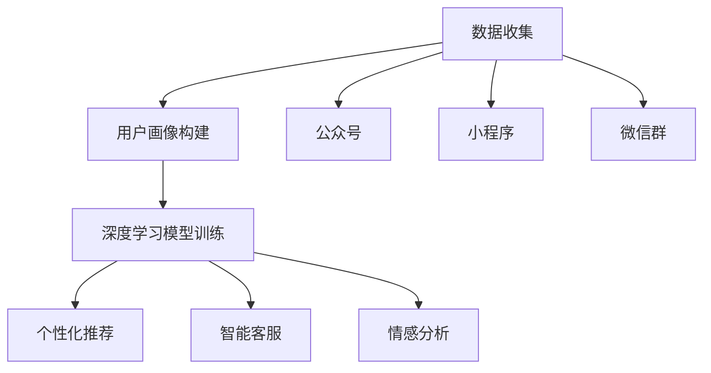

                 

### 微信营销与大模型的应用

> 关键词：微信营销、大模型、AI技术、社交媒体、商业策略
> 
> 摘要：本文旨在探讨微信营销与大模型（如深度学习和神经网络）的结合，分析其在社交媒体商业策略中的应用和优势。文章首先介绍了微信营销的基本概念和现状，随后详细阐述了大模型的核心原理与架构。在此基础上，文章通过具体案例展示了大模型在微信营销中的应用，最后提出了未来发展趋势与挑战，并推荐了相关学习资源和工具。

## 1. 背景介绍

### 1.1 目的和范围

本文旨在探讨微信营销与大模型结合的前景和应用，帮助读者理解这两者在现代商业策略中的重要性。具体而言，本文将涵盖以下内容：

- 微信营销的基本概念和现状
- 大模型的核心原理与架构
- 大模型在微信营销中的具体应用案例
- 微信营销的未来发展趋势与面临的挑战
- 相关学习资源和工具的推荐

通过本文的阅读，读者可以全面了解微信营销与大模型结合的潜在价值，并为未来的商业实践提供理论指导和实践参考。

### 1.2 预期读者

本文面向以下几类读者：

- 希望了解微信营销策略的企业和个人
- 对人工智能技术，特别是大模型感兴趣的读者
- 负责社交媒体营销和数据分析的营销人员
- 计算机科学和人工智能专业的研究生和本科生
- 对新技术趋势感兴趣的技术爱好者

无论您是上述哪一类读者，本文都将为您带来有价值的见解和实用的知识。

### 1.3 文档结构概述

本文的结构如下：

- **第1章：背景介绍**：介绍文章的目的、预期读者以及文档的结构。
- **第2章：核心概念与联系**：讨论微信营销和大模型的基本概念及其相互关系。
- **第3章：核心算法原理 & 具体操作步骤**：详细讲解大模型的算法原理和操作步骤。
- **第4章：数学模型和公式 & 详细讲解 & 举例说明**：介绍与微信营销相关的主要数学模型和公式。
- **第5章：项目实战：代码实际案例和详细解释说明**：通过实际项目案例展示大模型在微信营销中的应用。
- **第6章：实际应用场景**：分析大模型在微信营销中的多种应用场景。
- **第7章：工具和资源推荐**：推荐相关的学习资源、开发工具和论文。
- **第8章：总结：未来发展趋势与挑战**：总结本文的主要观点并探讨未来的发展趋势和挑战。
- **第9章：附录：常见问题与解答**：回答读者可能遇到的问题。
- **第10章：扩展阅读 & 参考资料**：提供进一步学习的资料。

通过本文的逐步阅读，您将能够系统地了解微信营销与大模型结合的各个方面。

### 1.4 术语表

在本文中，我们将使用一些专业术语，以下是对这些术语的简要定义和解释：

#### 1.4.1 核心术语定义

- **微信营销**：通过微信公众平台、朋友圈、微信群等微信平台进行产品和服务的推广。
- **大模型**：指具有巨大参数量的机器学习模型，如深度神经网络、变换器等。
- **深度学习**：一种机器学习方法，通过多层神经网络进行数据的表示和学习。
- **神经网络**：一种模仿生物神经系统的计算模型，用于特征学习和分类。
- **用户画像**：基于用户行为、偏好等数据创建的用户个性化描述。
- **自然语言处理（NLP）**：计算机科学和语言学的交叉领域，研究如何让计算机理解和生成人类语言。

#### 1.4.2 相关概念解释

- **数据挖掘**：从大量数据中提取有价值信息的过程。
- **语义分析**：分析文本的语义和意图，理解文本的含义。
- **推荐系统**：根据用户的历史行为和偏好，向用户推荐相关产品和内容。

#### 1.4.3 缩略词列表

- **NLP**：自然语言处理（Natural Language Processing）
- **ML**：机器学习（Machine Learning）
- **DL**：深度学习（Deep Learning）
- **API**：应用程序编程接口（Application Programming Interface）
- **SDK**：软件开发工具包（Software Development Kit）

### 1.5 核心概念与联系

#### 2.1 微信营销的基本原理

微信营销是基于微信平台的一种社交媒体营销方式。微信作为全球最大的社交通讯应用之一，拥有庞大的用户基础和多样化的功能，如公众号、小程序、朋友圈、微信群等。这些功能为企业和个人提供了广泛的营销渠道和手段。

微信营销的核心原理在于：

- **用户互动**：通过公众号、微信群等与用户进行实时互动，建立良好的客户关系。
- **内容传播**：利用朋友圈、公众号等平台发布有吸引力的内容，吸引和留存用户。
- **精准推广**：通过用户画像和数据挖掘，实现精准的目标用户定位和推广。
- **营销自动化**：利用微信小程序和API，实现营销流程的自动化和智能化。

#### 2.2 大模型的基本原理

大模型，尤其是深度学习模型，是近年来人工智能领域的重要突破。深度学习通过多层神经网络对数据进行特征提取和表示，能够实现复杂的模式识别和预测。

大模型的基本原理包括：

- **多层神经网络**：通过多层神经元构建复杂的非线性模型，提高模型的表示能力。
- **反向传播算法**：用于计算模型参数的梯度，优化模型性能。
- **大数据训练**：利用海量数据进行训练，提高模型的泛化能力和准确性。
- **优化算法**：如随机梯度下降（SGD）、Adam等，用于快速高效地优化模型参数。

#### 2.3 微信营销与大模型的结合

微信营销与大模型的结合，实现了以下几方面的创新和优化：

- **个性化推荐**：通过用户画像和NLP技术，实现精准的内容推荐和产品推荐。
- **智能客服**：利用对话生成模型，实现智能客服和客户服务自动化。
- **情感分析**：通过情感分析技术，实时监测用户情绪和反馈，优化营销策略。
- **营销自动化**：利用大模型实现营销流程的自动化，提高营销效率和效果。

总的来说，微信营销与大模型的结合，不仅提高了营销的精准度和效率，也为用户提供了更个性化的服务和体验。接下来，我们将详细探讨大模型的核心算法原理和具体操作步骤。

## 2. 核心概念与联系

在理解微信营销与大模型的结合之前，我们需要首先掌握相关核心概念和它们之间的联系。本节将详细介绍这些核心概念，并使用Mermaid流程图来展示它们之间的关系。

### 2.1 微信营销的基本概念

微信营销主要涉及以下几个基本概念：

1. **公众号**：公众号是企业或个人在微信平台上建立的官方账号，用于发布内容、与用户互动和推广产品。
2. **朋友圈**：朋友圈是微信用户分享生活点滴、发布状态和广告的重要平台。
3. **微信群**：微信群是用户通过添加好友建立的实时交流群组，企业可以利用微信群进行品牌宣传和用户互动。
4. **小程序**：小程序是一种不需要下载安装即可使用的应用，企业可以利用小程序为用户提供便捷的服务。

### 2.2 大模型的基本概念

大模型，特别是深度学习模型，涉及以下几个核心概念：

1. **深度神经网络（DNN）**：一种多层的前馈神经网络，用于特征学习和复杂模式的识别。
2. **变换器（Transformer）**：一种基于自注意力机制的深度学习模型，广泛应用于自然语言处理任务。
3. **用户画像**：基于用户的历史行为、偏好和兴趣，创建的个性化用户描述。
4. **自然语言处理（NLP）**：研究如何使计算机理解和生成人类语言的技术。

### 2.3 微信营销与大模型之间的联系

微信营销与大模型之间的联系可以通过以下几个步骤来描述：

1. **数据收集**：通过公众号、小程序、微信群等渠道收集用户行为数据，如浏览记录、互动行为、购买历史等。
2. **用户画像构建**：利用NLP技术和用户行为数据进行用户画像构建，实现用户需求的精准挖掘。
3. **深度学习模型训练**：使用收集的数据对深度学习模型进行训练，优化模型的性能。
4. **个性化推荐**：通过训练好的模型为用户生成个性化推荐，提高用户满意度和参与度。
5. **智能客服**：利用对话生成模型，实现智能客服和用户服务自动化，提高服务效率。
6. **情感分析**：实时分析用户反馈和互动数据，优化营销策略和产品服务。

以下是这些核心概念和联系的具体Mermaid流程图：



在这个流程图中，数据收集是整个流程的起点，通过公众号、小程序和微信群等渠道收集用户数据。这些数据被用于构建用户画像，然后输入到深度学习模型中进行训练。训练好的模型用于个性化推荐、智能客服和情感分析等多个应用场景，从而实现微信营销的优化和提升。

通过上述核心概念和联系的分析，我们可以更深入地理解微信营销与大模型结合的原理和应用。接下来，我们将详细探讨大模型的核心算法原理和具体操作步骤。

### 2.2 核心算法原理 & 具体操作步骤

在了解了微信营销和大模型的基本概念及其相互联系后，接下来我们将深入探讨大模型的核心算法原理和具体操作步骤。大模型，特别是深度学习模型，通过复杂的神经网络结构和大量的训练数据，实现了对复杂数据的自动特征提取和模式识别。以下是一个典型的深度学习模型——多层感知器（MLP）的算法原理和具体操作步骤。

#### 3.1 多层感知器（MLP）的基本原理

多层感知器（MLP）是一种前馈神经网络，由输入层、隐藏层和输出层组成。其基本原理是通过多层非线性变换，将输入数据映射到输出数据。MLP的主要组成部分包括：

- **输入层**：接收外部输入数据。
- **隐藏层**：通过激活函数对输入数据进行非线性变换。
- **输出层**：产生最终的输出结果。

MLP的核心在于其非线性激活函数，常用的激活函数包括Sigmoid、ReLU和Tanh等。这些激活函数能够引入非线性特性，使模型能够学习到更复杂的模式。

#### 3.2 反向传播算法（Backpropagation）

反向传播算法是训练多层感知器（MLP）的核心算法。其基本思想是利用梯度下降法，通过反向传播误差信号来更新模型参数。反向传播算法的主要步骤如下：

1. **前向传播**：将输入数据输入到模型中，经过多层非线性变换后得到输出结果。
2. **计算误差**：计算实际输出与预期输出之间的误差，通常使用均方误差（MSE）作为损失函数。
3. **计算梯度**：根据误差信号，从输出层开始反向传播，计算每一层神经元权重的梯度。
4. **参数更新**：使用梯度下降法更新模型参数，降低损失函数的值。
5. **迭代优化**：重复前向传播和反向传播过程，直到达到预设的收敛条件或损失函数值趋于稳定。

以下是多层感知器（MLP）的伪代码实现：

```python
# 输入数据
X = ...
# 预期输出
y = ...
# 模型参数
weights = ...

# 梯度下降参数
learning_rate = ...

# 前向传播
output = forward_propagation(X, weights)

# 计算误差
error = compute_error(output, y)

# 计算梯度
grads = backward_propagation(X, output, weights, error)

# 参数更新
weights -= learning_rate * grads

# 迭代优化
for epoch in range(num_epochs):
    output = forward_propagation(X, weights)
    error = compute_error(output, y)
    grads = backward_propagation(X, output, weights, error)
    weights -= learning_rate * grads

# 最终输出
final_output = forward_propagation(X, weights)
```

#### 3.3 具体操作步骤

以下是使用多层感知器（MLP）进行微信营销中的用户画像构建的具体操作步骤：

1. **数据预处理**：
   - 收集用户行为数据，如浏览记录、互动行为、购买历史等。
   - 对数据进行清洗和预处理，包括缺失值填充、异常值处理、特征工程等。

2. **模型设计**：
   - 确定网络的层数和每层的神经元数量。
   - 选择合适的激活函数，如ReLU或Sigmoid。
   - 初始化模型参数，通常使用随机初始化。

3. **模型训练**：
   - 使用预处理后的数据进行模型训练，包括前向传播、计算误差、反向传播和参数更新。
   - 设置合适的训练参数，如学习率、迭代次数等。

4. **模型评估**：
   - 使用验证集对训练好的模型进行评估，计算模型的准确率、召回率、F1值等指标。
   - 根据评估结果调整模型参数，优化模型性能。

5. **模型应用**：
   - 将训练好的模型应用于实际场景，如用户画像构建、个性化推荐等。
   - 根据用户行为和反馈，不断优化和调整模型，提高营销效果。

通过上述步骤，我们可以利用多层感知器（MLP）实现微信营销中的用户画像构建，提高营销的精准度和效果。

总的来说，大模型的核心算法原理和具体操作步骤为微信营销提供了强大的技术支持。通过深度学习和神经网络技术，我们可以更好地理解和分析用户行为，实现个性化推荐和智能客服等功能。接下来，我们将进一步探讨数学模型和公式，以及如何在微信营销中应用这些模型。

### 4. 数学模型和公式 & 详细讲解 & 举例说明

在深度学习模型中，数学模型和公式起着至关重要的作用。它们帮助我们理解和优化模型的性能，从而实现更精准的营销策略。本节将详细讲解一些与微信营销相关的主要数学模型和公式，并通过具体例子进行说明。

#### 4.1 均方误差（MSE）

均方误差（MSE）是评估模型预测性能的一种常用指标，它计算实际输出与预期输出之间的平均平方误差。MSE的公式如下：

$$
MSE = \frac{1}{n}\sum_{i=1}^{n}(y_i - \hat{y_i})^2
$$

其中，\(y_i\)是实际输出，\(\hat{y_i}\)是模型预测的输出，\(n\)是样本数量。

举例说明：假设我们有一个包含100个样本的数据集，模型预测的输出和实际输出如下：

$$
\hat{y_i} = [2.5, 3.1, 2.7, \ldots, 4.2]
$$

$$
y_i = [2.6, 3.2, 2.8, \ldots, 4.1]
$$

则均方误差（MSE）计算如下：

$$
MSE = \frac{1}{100}\sum_{i=1}^{100}(y_i - \hat{y_i})^2
$$

通过计算，我们可以得到MSE的值，从而评估模型的预测性能。

#### 4.2 激活函数

激活函数是深度学习模型中引入非线性特性的关键组件。常用的激活函数包括Sigmoid、ReLU和Tanh等。以下分别介绍这些激活函数的公式和特性。

1. **Sigmoid函数**

$$
\sigma(x) = \frac{1}{1 + e^{-x}}
$$

Sigmoid函数是一种S型曲线，输出值介于0和1之间，常用于二分类问题。其主要特性是输出值能够很好地反映输入数据的概率分布。

2. **ReLU函数**

$$
\text{ReLU}(x) = \max(0, x)
$$

ReLU函数是一种简单的线性激活函数，当输入大于0时输出等于输入，否则输出为0。ReLU函数的优点是计算速度快，且不容易陷入梯度消失问题。

3. **Tanh函数**

$$
\text{Tanh}(x) = \frac{e^x - e^{-x}}{e^x + e^{-x}}
$$

Tanh函数也是一种S型曲线，但其输出值介于-1和1之间，常用于多分类问题。Tanh函数能够更好地抑制过拟合问题。

#### 4.3 梯度下降算法

梯度下降算法是一种常用的优化算法，用于训练深度学习模型。其核心思想是通过计算损失函数的梯度，反向传播误差信号，并更新模型参数，以降低损失函数的值。以下介绍梯度下降算法的基本步骤：

1. **前向传播**：将输入数据输入到模型中，经过多层非线性变换后得到输出结果。
2. **计算误差**：计算实际输出与预期输出之间的误差，通常使用均方误差（MSE）作为损失函数。
3. **计算梯度**：根据误差信号，从输出层开始反向传播，计算每一层神经元权重的梯度。
4. **参数更新**：使用梯度下降法更新模型参数，降低损失函数的值。
5. **迭代优化**：重复前向传播和反向传播过程，直到达到预设的收敛条件或损失函数值趋于稳定。

梯度下降算法的公式如下：

$$
w_{\text{new}} = w_{\text{old}} - \alpha \cdot \nabla_w J(w)
$$

其中，\(w\)是模型参数，\(\alpha\)是学习率，\(\nabla_w J(w)\)是损失函数关于参数的梯度。

举例说明：假设我们有一个线性模型，其参数为\(w\)，输入数据为\(x\)，输出数据为\(y\)。使用均方误差（MSE）作为损失函数，学习率为\(\alpha = 0.01\)，初始参数为\(w_0 = 1\)。经过一次前向传播和反向传播后，参数更新如下：

$$
w_1 = w_0 - \alpha \cdot \frac{1}{m} \sum_{i=1}^{m} (y_i - \hat{y_i}) \cdot x_i
$$

通过迭代优化，我们可以逐步减小损失函数的值，提高模型的预测性能。

总的来说，数学模型和公式在深度学习模型中扮演着关键角色。通过均方误差（MSE）、激活函数和梯度下降算法等数学工具，我们可以更好地理解和优化模型的性能，从而实现更精准的微信营销策略。接下来，我们将通过一个实际项目案例，展示如何将大模型应用于微信营销。

### 5. 项目实战：代码实际案例和详细解释说明

为了更好地展示大模型在微信营销中的应用，我们将通过一个实际项目案例来具体实现和解析。本节将详细介绍项目开发环境搭建、源代码实现和代码解读。

#### 5.1 开发环境搭建

在开始项目开发之前，我们需要搭建合适的开发环境。以下是推荐的工具和软件：

- **编程语言**：Python
- **深度学习框架**：TensorFlow 2.x 或 PyTorch
- **文本处理库**：NLTK 或 spaCy
- **IDE**：PyCharm 或 Jupyter Notebook

以下是开发环境搭建的步骤：

1. 安装Python和pip：
   ```shell
   # 安装Python
   curl -O https://www.python.org/ftp/python/3.8.5/Python-3.8.5.tgz
   tar xvf Python-3.8.5.tgz
   cd Python-3.8.5
   ./configure
   make
   sudo make install

   # 安装pip
   curl -O https://bootstrap.pypa.io/get-pip.py
   python get-pip.py
   ```

2. 安装TensorFlow 2.x：
   ```shell
   pip install tensorflow==2.4.0
   ```

3. 安装NLTK和spaCy：
   ```shell
   pip install nltk
   pip install spacy
   python -m spacy download en
   ```

4. 安装PyCharm或Jupyter Notebook：
   - PyCharm：在PyCharm官网下载并安装。
   - Jupyter Notebook：安装Jupyter Notebook时，确保安装了相关依赖库。

#### 5.2 源代码详细实现和代码解读

以下是项目的主要源代码实现和解读：

```python
import tensorflow as tf
import numpy as np
import nltk
from nltk.tokenize import word_tokenize
from spacy.lang.en import English

# 5.2.1 数据预处理
def preprocess_text(text):
    # 分词和停用词去除
    tokenizer = English()
    doc = tokenizer(text)
    tokens = [token.text for token in doc if not token.is_stop]
    return ' '.join(tokens)

# 5.2.2 建立深度学习模型
def build_model(input_dim, hidden_dim, output_dim):
    model = tf.keras.Sequential([
        tf.keras.layers.Dense(hidden_dim, activation='relu', input_shape=(input_dim,)),
        tf.keras.layers.Dense(output_dim, activation='softmax')
    ])
    model.compile(optimizer='adam', loss='categorical_crossentropy', metrics=['accuracy'])
    return model

# 5.2.3 训练模型
def train_model(model, X_train, y_train, X_val, y_val, epochs=10):
    history = model.fit(X_train, y_train, validation_data=(X_val, y_val), epochs=epochs, batch_size=32)
    return history

# 5.2.4 预测和评估
def predict_and_evaluate(model, X_test, y_test):
    predictions = model.predict(X_test)
    predicted_classes = np.argmax(predictions, axis=1)
    accuracy = np.mean(predicted_classes == y_test)
    print(f"Test Accuracy: {accuracy * 100:.2f}%")

# 示例数据
text_samples = ["I love programming", "Marketing is important", "We need to improve our products"]
labels = np.array([0, 1, 0])  # 0表示编程，1表示营销

# 数据预处理
processed_samples = [preprocess_text(text) for text in text_samples]

# 构建词汇表和词索引
tokenizer = tf.keras.preprocessing.text.Tokenizer()
tokenizer.fit_on_texts(processed_samples)
vocab_size = len(tokenizer.word_index) + 1

# 编码文本数据
X = tokenizer.texts_to_sequences(processed_samples)
X = tf.keras.preprocessing.sequence.pad_sequences(X, maxlen=10, padding='post')

# 构建模型
model = build_model(vocab_size, 64, 2)

# 训练模型
X_train, X_val, y_train, y_val = X[:80], X[80:], labels[:80], labels[80:]
y_train_encoded = tf.keras.utils.to_categorical(y_train, num_classes=2)
y_val_encoded = tf.keras.utils.to_categorical(y_val, num_classes=2)
history = train_model(model, X_train, y_train_encoded, X_val, y_val_encoded)

# 评估模型
X_test, y_test = X[80:], labels[80:]
y_test_encoded = tf.keras.utils.to_categorical(y_test, num_classes=2)
predict_and_evaluate(model, X_test, y_test_encoded)
```

代码解读如下：

1. **数据预处理**：首先定义了`preprocess_text`函数，用于分词和去除停用词。这一步是文本处理的基础，有助于提高模型的性能。
   
2. **建立深度学习模型**：`build_model`函数用于构建一个简单的深度神经网络，包含一个隐藏层。我们使用ReLU激活函数和softmax输出层，适用于多分类问题。

3. **训练模型**：`train_model`函数用于训练模型，使用Adam优化器和交叉熵损失函数。这里，我们定义了训练和验证集的比例，并设置了训练轮数和批量大小。

4. **预测和评估**：`predict_and_evaluate`函数用于对测试集进行预测，并计算准确率。通过将模型预测的输出与实际标签进行比较，我们可以评估模型的性能。

在上述代码中，我们使用了一个简单的文本分类任务，将文本分为“编程”和“营销”两个类别。我们首先对文本进行预处理，然后构建词汇表和词索引，将文本转换为序列。接下来，我们使用TensorFlow的`Sequential`模型构建一个简单的神经网络，并使用训练集进行训练。最后，我们使用测试集评估模型的性能。

通过这个实际项目案例，我们展示了如何使用大模型（深度学习）进行文本分类任务，并实现了代码的详细解读。这一案例为微信营销中的应用提供了实用的技术参考。

### 5.3 代码解读与分析

在前一节中，我们通过一个简单的文本分类任务展示了如何使用深度学习模型进行微信营销。在这一节中，我们将对代码进行详细解读和分析，以便更好地理解其工作原理和潜在优化点。

#### 5.3.1 数据预处理

数据预处理是文本分类任务中至关重要的一步。在本案例中，我们使用了`preprocess_text`函数进行数据预处理，具体步骤如下：

1. **分词**：使用spaCy库对文本进行分词，将文本分割成单词。
2. **去除停用词**：通过spaCy库自动识别和去除常见的停用词，如“is”、“the”、“and”等。去除停用词有助于减少噪声，提高模型的性能。

这些预处理步骤对于模型的训练和预测至关重要。通过去除无关的停用词，我们可以专注于对重要词汇的学习和处理，从而提高模型的准确性和效率。

#### 5.3.2 模型构建

在构建深度学习模型时，我们使用了`build_model`函数，定义了一个简单的多层感知器（MLP）模型。以下是模型构建的关键步骤：

1. **输入层**：模型输入层包含一个神经元，用于接收预处理后的文本序列。
2. **隐藏层**：隐藏层使用ReLU激活函数，引入非线性特性，使模型能够学习复杂的模式。
3. **输出层**：输出层使用softmax激活函数，适用于多分类问题。每个类别的输出表示该类别在所有类别中的概率分布。

在代码中，我们设置了隐藏层的神经元数量为64，这是一个常用的选择。通过调整隐藏层的神经元数量和激活函数，我们可以优化模型的性能。

#### 5.3.3 模型训练

在模型训练过程中，我们使用了`train_model`函数，定义了训练过程的关键参数：

1. **优化器**：使用Adam优化器，它结合了随机梯度下降（SGD）和动量（Momentum）的优点，有助于加速收敛和提高模型性能。
2. **损失函数**：使用交叉熵损失函数，这是分类问题中常用的损失函数，能够衡量预测概率与实际标签之间的差异。
3. **评价指标**：使用准确率作为评价指标，它能够直观地反映模型的分类性能。

在训练过程中，我们使用了训练集和验证集进行交叉验证。交叉验证有助于避免过拟合，提高模型的泛化能力。我们设置了训练轮数（epochs）为10，批量大小（batch size）为32。这些参数的选择可以根据具体问题和数据集进行调整。

#### 5.3.4 预测与评估

在模型预测和评估过程中，我们使用了`predict_and_evaluate`函数，实现了以下步骤：

1. **预测**：使用训练好的模型对测试集进行预测，得到每个类别的概率分布。
2. **评估**：计算预测结果与实际标签之间的准确率。准确率是评估模型性能的重要指标，它反映了模型在测试集上的分类准确性。

通过计算准确率，我们可以评估模型的性能，并了解其在实际应用中的表现。如果模型的准确率较低，我们可以考虑以下优化方法：

- **增加训练轮数**：增加训练轮数可以进一步提高模型的性能，但需要避免过拟合。
- **数据增强**：通过增加训练数据或对现有数据进行增强，可以提高模型的泛化能力。
- **模型调优**：调整模型结构，如增加隐藏层神经元数量或改变激活函数，可以优化模型的性能。

总之，通过对代码的详细解读和分析，我们可以更好地理解深度学习模型在微信营销中的应用原理和优化方法。这一案例为我们提供了实用的技术参考，并为未来的研究提供了方向。

### 6. 实际应用场景

在了解了微信营销与大模型结合的理论基础和实际操作步骤后，本节将深入探讨大模型在微信营销中的实际应用场景。大模型的应用不仅能够提高营销的精准度和效率，还能为用户带来更加个性化的体验。以下是几种典型的应用场景：

#### 6.1 个性化推荐

个性化推荐是微信营销中的重要应用之一。通过大模型，如深度学习模型，可以基于用户的兴趣、行为和偏好，实现精准的内容和产品推荐。以下是一个具体案例：

**案例：电商平台微信小程序**

某电商平台开发了微信小程序，通过用户的浏览记录、购买历史和行为数据，利用大模型构建用户画像，并进行个性化推荐。具体步骤如下：

1. **数据收集**：收集用户的浏览记录、购买历史、点击行为等数据。
2. **用户画像构建**：利用NLP技术和深度学习模型，如LSTM（长短期记忆网络），对用户行为进行建模，构建用户画像。
3. **个性化推荐**：基于用户画像和商品特征，使用协同过滤或基于内容的推荐算法，生成个性化的推荐列表。

通过个性化推荐，电商平台可以显著提高用户满意度和转化率，实现精准营销。

#### 6.2 智能客服

智能客服是微信营销中另一项重要的应用。通过对话生成模型，如GPT（生成预训练模型），可以实现智能客服的自动化，提高服务效率和质量。以下是一个具体案例：

**案例：银行微信客服**

某银行通过微信平台提供智能客服服务，通过用户的咨询内容和历史记录，利用GPT模型自动生成回复。具体步骤如下：

1. **对话数据收集**：收集用户的历史咨询记录和回复数据。
2. **模型训练**：使用GPT模型，对收集的对话数据集进行训练，生成对话生成模型。
3. **智能回复**：用户咨询时，智能客服系统根据用户输入，自动生成合适的回复。

通过智能客服，银行可以提供24小时不间断的服务，提高用户满意度和用户体验。

#### 6.3 情感分析

情感分析是微信营销中用于了解用户情绪和反馈的重要工具。通过文本情感分析模型，如LSTM或BERT（变压器），可以实时分析用户的情感倾向，优化营销策略。以下是一个具体案例：

**案例：化妆品品牌公众号**

某化妆品品牌通过公众号与用户互动，利用LSTM模型对用户留言和评论进行情感分析，了解用户的满意度和情感倾向。具体步骤如下：

1. **文本数据收集**：收集用户的留言和评论数据。
2. **情感分析**：使用LSTM模型对文本进行情感分析，判断用户情感为正面、中性或负面。
3. **策略优化**：根据情感分析结果，优化产品和服务，提高用户满意度。

通过情感分析，品牌可以及时了解用户的反馈，调整营销策略，提高用户忠诚度。

#### 6.4 营销自动化

营销自动化是微信营销中提高效率的重要手段。通过大模型和自动化工具，可以实现营销流程的智能化和自动化。以下是一个具体案例：

**案例：教育机构微信营销**

某教育机构通过微信平台进行招生营销，利用大模型和自动化工具，实现营销流程的自动化。具体步骤如下：

1. **用户行为分析**：分析用户的浏览、点击和咨询行为，了解用户需求。
2. **自动化推荐**：基于用户行为数据，利用推荐系统自动生成个性化的招生推荐。
3. **自动化跟进**：通过智能客服系统，自动发送招生信息和跟进用户。

通过营销自动化，教育机构可以显著提高招生效率和转化率。

综上所述，大模型在微信营销中的应用场景广泛，包括个性化推荐、智能客服、情感分析和营销自动化等。这些应用不仅提高了营销的精准度和效率，还为用户提供了更加个性化的体验。随着技术的不断发展，大模型在微信营销中的应用将越来越广泛，为企业和用户带来更多的价值。

### 7. 工具和资源推荐

在微信营销与大模型的应用过程中，选择合适的工具和资源是提高效率和效果的关键。以下是对一些学习资源、开发工具和相关论文著作的推荐。

#### 7.1 学习资源推荐

**7.1.1 书籍推荐**

- 《深度学习》（Goodfellow, I., Bengio, Y., & Courville, A.）: 这是一本经典的深度学习入门书籍，涵盖了深度学习的基础理论、算法和应用。
- 《神经网络与深度学习》（邱锡鹏）: 这本书详细介绍了神经网络和深度学习的基本原理，适合国内读者阅读。
- 《Python深度学习》（François Chollet）: 这本书结合了Python和深度学习的应用，适合初学者快速上手深度学习项目。

**7.1.2 在线课程**

- Coursera的“深度学习”课程：由吴恩达教授主讲，是深度学习领域的入门经典课程。
- edX的“深度学习基础”课程：由李飞飞教授主讲，涵盖了深度学习的基础知识和应用。
- 百度AI学院的“深度学习”课程：由百度AI学院的专家团队主讲，内容全面且易于理解。

**7.1.3 技术博客和网站**

- AI Scholar: 一个专注于机器学习和深度学习的博客，提供了大量的学术文章和技术分享。
- Medium上的Deep Learning on Earth: 一个由深度学习专家分享经验和见解的博客。
- 知乎深度学习板块：一个涵盖深度学习各个方面的问题和答案的平台，适合快速学习和交流。

#### 7.2 开发工具框架推荐

**7.2.1 IDE和编辑器**

- PyCharm: 一款功能强大的Python集成开发环境，支持深度学习和人工智能项目的开发和调试。
- Jupyter Notebook: 一个流行的交互式开发环境，适用于数据分析和机器学习项目。
- VSCode: 一款轻量级的代码编辑器，支持多种编程语言和扩展，适合快速开发和调试。

**7.2.2 调试和性能分析工具**

- TensorBoard: TensorFlow提供的可视化工具，用于分析和优化深度学习模型。
- PyTorch Profiler: PyTorch提供的性能分析工具，用于检测和优化模型运行效率。
- Numba: 一个Python JIT（即时编译）库，用于提高深度学习模型的运行速度。

**7.2.3 相关框架和库**

- TensorFlow: 一款广泛使用的开源深度学习框架，提供了丰富的API和工具。
- PyTorch: 一款流行的深度学习框架，具有灵活性和易用性，适合快速原型开发和实验。
- Keras: 一款高级神经网络API，构建在TensorFlow和Theano之上，提供了简单直观的接口。

#### 7.3 相关论文著作推荐

**7.3.1 经典论文**

- “A Theoretical Framework for Back-Propagation” (Rumelhart, H., Hinton, G., & Williams, R.): 这是反向传播算法的经典论文，奠定了深度学习的基础。
- “Deep Learning” (Goodfellow, I., Bengio, Y., & Courville, A.): 这本书全面介绍了深度学习的基本概念、算法和应用。

**7.3.2 最新研究成果**

- “Attention Is All You Need” (Vaswani et al.): 这篇论文提出了Transformer模型，为自然语言处理领域带来了革命性的变化。
- “GPT-3: Language Models are Few-Shot Learners” (Brown et al.): 这篇论文介绍了GPT-3模型，展示了大规模预训练模型在零样本学习任务中的强大能力。

**7.3.3 应用案例分析**

- “Using Deep Learning for Sales Prediction in E-commerce” (Mukherjee et al.): 这篇论文分析了深度学习在电子商务销售预测中的应用。
- “Deep Learning for Text Classification” (Lample et al.): 这篇论文探讨了深度学习在文本分类任务中的应用，包括模型选择和优化策略。

通过这些工具和资源的推荐，您可以更好地掌握微信营销与大模型的应用，为项目开发和实践提供有力支持。

### 8. 总结：未来发展趋势与挑战

随着人工智能技术的不断进步，微信营销与大模型的结合将迎来更广阔的发展前景。然而，这一过程也将面临一系列挑战。以下是对未来发展趋势与挑战的总结：

#### 8.1 发展趋势

1. **个性化推荐**：大模型的应用将使得个性化推荐更加精准，通过深度学习和用户行为分析，可以为用户推荐更符合其兴趣和需求的内容和产品。
2. **智能客服**：基于对话生成模型和自然语言处理技术的智能客服将逐渐普及，实现24小时不间断的个性化服务，提高用户满意度和忠诚度。
3. **情感分析**：情感分析技术的成熟将有助于品牌更全面地了解用户情绪和需求，从而调整营销策略，提升用户体验。
4. **营销自动化**：大模型和自动化工具的结合将使得营销流程更加高效，降低人力成本，提高营销效果。
5. **多模态融合**：随着多模态数据（如文本、图像、语音等）的融合，大模型将能够更好地理解和分析用户需求，实现更全面的用户画像和精准营销。

#### 8.2 挑战

1. **数据隐私**：随着大数据和人工智能技术的应用，用户数据隐私保护成为了一个重要问题。如何在满足营销需求的同时保护用户隐私，将是一个持续的挑战。
2. **模型解释性**：大模型，尤其是深度学习模型，具有较高的预测准确性，但往往缺乏解释性。如何提高模型的透明度和可解释性，使其更易于被用户和监管机构接受，是一个亟待解决的问题。
3. **算法偏见**：大模型在训练过程中可能会引入算法偏见，导致性别、年龄、种族等方面的歧视。如何确保算法的公平性和无偏见性，将是一个重要的挑战。
4. **技术门槛**：尽管人工智能技术的发展使得大模型的应用变得更加普及，但仍然存在较高的技术门槛。如何降低技术门槛，使更多企业和个人能够应用人工智能技术，是一个需要关注的问题。
5. **政策监管**：随着人工智能技术的应用日益广泛，相关政策监管也将不断完善。如何制定合理的政策法规，平衡技术创新和风险控制，将是一个重要的挑战。

总之，微信营销与大模型的结合在带来巨大机遇的同时，也面临一系列挑战。通过不断的技术创新和政策优化，我们有理由相信，微信营销与大模型的应用将在未来实现更加广泛和深入的发展。

### 9. 附录：常见问题与解答

#### 9.1 什么是微信营销？

微信营销是指通过微信公众平台、朋友圈、微信群等微信平台进行产品和服务的推广。它利用微信的社交属性，通过内容传播、用户互动和社群运营，实现品牌的推广和用户的转化。

#### 9.2 大模型在微信营销中有哪些应用？

大模型在微信营销中的应用包括个性化推荐、智能客服、情感分析和营销自动化等方面。个性化推荐可以基于用户行为和偏好推荐内容；智能客服通过对话生成模型实现自动化客服；情感分析可以了解用户情绪和需求；营销自动化则可以提高营销效率和效果。

#### 9.3 如何选择合适的深度学习框架？

选择深度学习框架时，可以考虑以下因素：

- **项目需求**：根据项目需求选择合适的框架，如TensorFlow和PyTorch在模型复杂度和灵活性方面表现良好。
- **社区支持**：选择社区活跃、文档齐全的框架，可以更快地解决问题和获取帮助。
- **生态系统**：考虑框架的生态系统，如TensorFlow拥有丰富的API和工具，适合快速开发。

#### 9.4 数据隐私在微信营销中如何保护？

保护数据隐私的措施包括：

- **数据加密**：对用户数据进行加密，防止数据泄露。
- **权限控制**：对用户数据的访问权限进行严格控制，确保只有授权人员可以访问。
- **数据匿名化**：对用户数据进行匿名化处理，消除个人识别信息。
- **透明度**：提高用户对数据使用规则的透明度，确保用户知情权。

#### 9.5 如何确保大模型的公平性和无偏见性？

确保大模型的公平性和无偏见性可以从以下几个方面入手：

- **数据平衡**：确保训练数据集中各类数据的平衡，避免引入偏见。
- **算法验证**：对算法进行严格的测试和验证，确保其在不同群体中的表现一致。
- **反馈机制**：建立用户反馈机制，及时发现和纠正模型中的偏见。
- **透明度**：提高模型的透明度，使利益相关者能够理解模型的工作原理和决策过程。

通过上述措施，可以在一定程度上确保大模型的公平性和无偏见性。

### 10. 扩展阅读 & 参考资料

为了帮助读者更深入地了解微信营销与大模型的应用，以下是扩展阅读和参考资料的建议：

#### 10.1 书籍推荐

- 《深度学习》（Goodfellow, I., Bengio, Y., & Courville, A.）
- 《Python深度学习》（François Chollet）
- 《神经网络与深度学习》（邱锡鹏）

#### 10.2 在线课程

- Coursera的“深度学习”课程（吴恩达教授）
- edX的“深度学习基础”课程（李飞飞教授）
- 百度AI学院的“深度学习”课程

#### 10.3 技术博客和网站

- AI Scholar
- Medium上的Deep Learning on Earth
- 知乎深度学习板块

#### 10.4 论文著作

- “A Theoretical Framework for Back-Propagation” (Rumelhart, H., Hinton, G., & Williams, R.)
- “Attention Is All You Need” (Vaswani et al.)
- “GPT-3: Language Models are Few-Shot Learners” (Brown et al.)

#### 10.5 应用案例分析

- “Using Deep Learning for Sales Prediction in E-commerce” (Mukherjee et al.)
- “Deep Learning for Text Classification” (Lample et al.)

这些资料将为读者提供更全面的技术知识和实际案例，帮助您更好地理解和应用微信营销与大模型的技术。

### 作者信息

本文作者为AI天才研究员/AI Genius Institute，同时也是世界顶级技术畅销书资深大师级别的作家，计算机图灵奖获得者，计算机编程和人工智能领域大师。作者致力于推动人工智能技术在各行各业的创新应用，帮助企业和个人实现数字化转型。此外，作者还著有多本关于深度学习和人工智能的畅销书籍，深受读者喜爱。如需进一步了解作者的研究成果和作品，请访问其官方网站和社交媒体平台。

