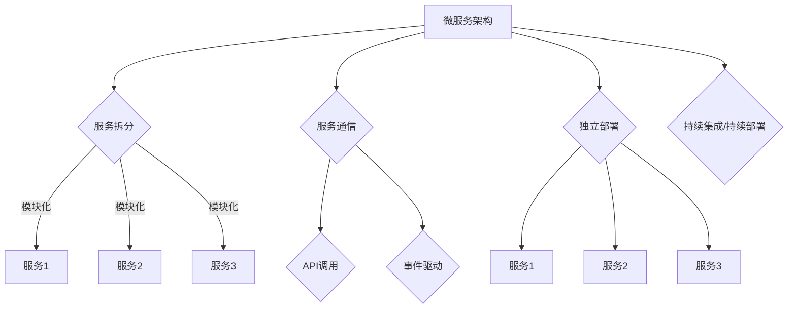
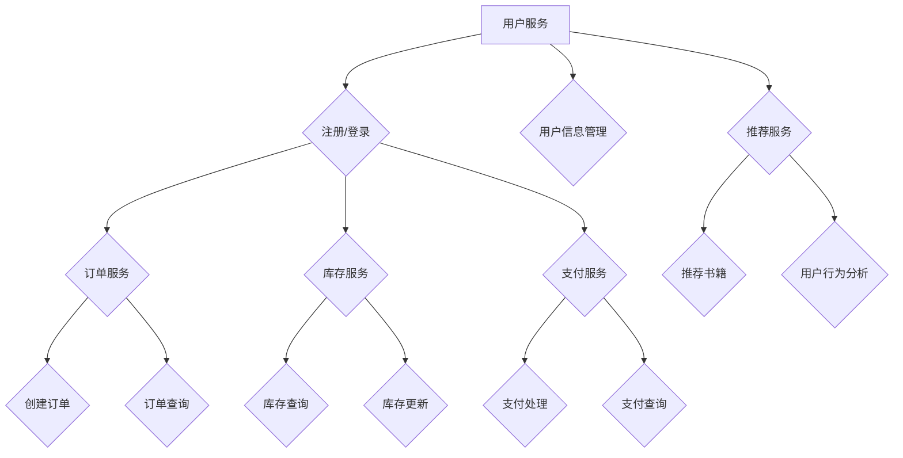

                 

# 微服务架构在高扩展性中的实例应用

> **关键词**：微服务架构、高扩展性、实例应用、负载均衡、性能优化、分布式系统、微服务设计原则

> **摘要**：本文将深入探讨微服务架构在高扩展性中的实际应用。我们将首先介绍微服务架构的基本概念和设计原则，随后通过具体的实例分析，详细讲解如何实现高扩展性的微服务系统。本文旨在帮助读者理解微服务架构的优势及其在应对高并发、高可用性场景中的应用，并提供实用的技术和方法。

## 1. 背景介绍

### 1.1 目的和范围

本文的目标是深入探讨微服务架构在高扩展性方面的应用。随着互联网应用的日益复杂，传统的单体架构逐渐暴露出其扩展性不足、维护困难等问题。微服务架构作为一种新型的分布式系统架构，以其模块化、高内聚、低耦合的特点，成为了应对这些挑战的有效手段。本文将围绕以下几个方面展开：

1. 微服务架构的基本概念和设计原则。
2. 高扩展性的实现策略，包括负载均衡、性能优化等。
3. 具体实例分析，展示微服务架构在实际项目中的应用。
4. 相关工具和资源的推荐。

### 1.2 预期读者

本文适合以下读者群体：

1. 计算机科学和软件工程专业的学生和从业者。
2. 想要了解微服务架构的技术人员和项目经理。
3. 对分布式系统和高性能计算感兴趣的技术爱好者。

### 1.3 文档结构概述

本文分为十个部分，结构如下：

1. **背景介绍**：介绍文章的目的、范围、预期读者和文档结构。
2. **核心概念与联系**：定义微服务架构的核心概念，并展示其原理图。
3. **核心算法原理 & 具体操作步骤**：详细讲解实现微服务的算法原理和操作步骤。
4. **数学模型和公式 & 详细讲解 & 举例说明**：介绍相关的数学模型和公式，并提供实例说明。
5. **项目实战：代码实际案例和详细解释说明**：通过实际代码案例展示微服务的实现。
6. **实际应用场景**：探讨微服务架构在不同领域的应用。
7. **工具和资源推荐**：推荐学习资源、开发工具和框架。
8. **总结：未来发展趋势与挑战**：总结文章的主要观点，并展望未来。
9. **附录：常见问题与解答**：提供常见的问答和解答。
10. **扩展阅读 & 参考资料**：推荐相关文献和资料。

### 1.4 术语表

#### 1.4.1 核心术语定义

- **微服务架构**：一种将应用程序作为一组小型服务构建的架构风格，每个服务都是独立的、可部署的、可维护的单元。
- **单体架构**：传统的大型单体应用，所有的功能都集中在单一的代码库中。
- **负载均衡**：将网络流量分配到多个服务器或节点上，以提高系统的整体性能和可用性。
- **高可用性**：系统在面临各种故障时能够保持持续运行的能力。
- **分布式系统**：由多个节点组成的系统，这些节点通过网络通信协作完成任务。

#### 1.4.2 相关概念解释

- **模块化**：将系统拆分成多个独立的部分，每个部分负责特定的功能。
- **高内聚、低耦合**：模块内部功能高度集中，模块之间相互依赖程度较低。
- **RESTful API**：一种用于构建分布式系统的架构风格，基于HTTP协议和REST原则。

#### 1.4.3 缩略词列表

- **REST**：Representational State Transfer，一种用于构建分布式系统的架构风格。
- **HTTP**：Hypertext Transfer Protocol，用于在分布式系统中传输数据的协议。

## 2. 核心概念与联系

在探讨微服务架构之前，我们需要了解一些核心概念和它们之间的联系。微服务架构的核心在于将复杂的单体应用拆分成多个独立的小服务，每个服务都负责特定的功能。这种架构风格的关键特点包括模块化、高内聚、低耦合等。下面，我们将通过一个Mermaid流程图来展示微服务架构的基本原理和组成部分。



### 2.1 微服务架构的核心概念

1. **服务拆分**：将单体应用拆分成多个独立的服务，每个服务都是可独立部署、独立维护的模块。
2. **模块化**：将服务进一步拆分成更小的模块，每个模块负责特定的功能，提高了系统的可维护性和可扩展性。
3. **服务通信**：服务之间通过API调用或事件驱动进行通信，确保了系统的高内聚和低耦合。
4. **独立部署**：每个服务都可以独立部署和升级，减少了系统部署的复杂性和风险。
5. **持续集成/持续部署**：通过自动化的CI/CD流程，确保了服务的快速迭代和持续交付。

### 2.2 微服务架构的优势

微服务架构具有以下优势：

1. **高扩展性**：通过水平扩展服务，可以轻松应对高并发和大量数据。
2. **高可用性**：服务之间独立运行，单个服务的故障不会影响整个系统的稳定性。
3. **灵活性**：服务可以根据业务需求进行灵活的调整和扩展，降低了系统的复杂性。
4. **可维护性**：每个服务都是独立的，可以单独开发和维护，提高了开发效率和代码质量。

## 3. 核心算法原理 & 具体操作步骤

### 3.1 微服务设计原则

在实现微服务架构时，遵循一些核心设计原则至关重要。以下是一些关键原则：

1. **单一职责原则**：每个服务应仅关注一个特定的业务功能，避免功能重叠。
2. **自治原则**：每个服务应具有自己的数据存储和独立的部署和管理。
3. **高内聚、低耦合原则**：服务内部应高度集中，服务之间相互依赖程度应较低。
4. **无状态原则**：服务应无状态或尽量减少状态，以简化分布式系统的设计和维护。
5. **独立部署原则**：服务可以独立部署和升级，不影响其他服务的运行。

### 3.2 微服务实现步骤

以下是一个基本的微服务实现步骤：

1. **需求分析**：分析业务需求，确定需要拆分成哪些服务。
2. **服务定义**：定义每个服务的功能、接口和数据模型。
3. **服务拆分**：根据需求将单体应用拆分成多个独立的服务。
4. **服务开发**：开发每个服务的实现，遵循上述设计原则。
5. **服务部署**：将每个服务部署到独立的环境。
6. **服务集成**：确保服务之间的通信和数据交互正常。
7. **测试和监控**：对服务进行集成测试和持续监控，确保系统稳定运行。

### 3.3 微服务架构实例分析

以下是一个简单的微服务架构实例，用于在线书店系统。该系统包括用户服务、订单服务、库存服务、支付服务和推荐服务。



在这个实例中，用户服务负责处理用户注册、登录和用户信息管理；订单服务负责处理订单的创建和查询；库存服务负责处理库存的查询和更新；支付服务负责处理支付处理和支付查询；推荐服务负责书籍推荐和用户行为分析。

### 3.4 微服务设计要点

1. **服务粒度大小**：服务粒度大小应适中，避免过细或过粗。过细会导致服务数量过多，难以管理和部署；过粗则会降低系统的灵活性。
2. **服务独立性**：服务应具有独立的部署和管理能力，减少对其他服务的依赖。
3. **服务通信**：服务之间的通信应采用异步方式，降低服务之间的耦合度，提高系统的可扩展性和可靠性。
4. **数据一致性**：在分布式系统中，数据一致性是一个重要问题。应采用分布式事务管理、最终一致性等方法，确保数据的一致性。

## 4. 数学模型和公式 & 详细讲解 & 举例说明

### 4.1 负载均衡算法

在微服务架构中，负载均衡是一个重要的环节，用于合理分配网络流量，提高系统的整体性能和可用性。以下是几种常见的负载均衡算法：

1. **轮询算法（Round Robin）**：
    - **公式**：每次请求按顺序分配到下一个服务实例。
    - **伪代码**：
    ```python
    function get_next_service():
        return (current_service_index + 1) % total_services
    ```
    - **举例说明**：假设有3个服务实例A、B、C，初始服务实例索引为0。第一个请求分配到A，第二个请求分配到B，第三个请求分配到C，第四个请求再次分配到A，以此类推。

2. **最小连接数算法（Least Connections）**：
    - **公式**：将请求分配到当前连接数最少的服务实例。
    - **伪代码**：
    ```python
    function get_next_service():
        min_connections = float('inf')
        min_connections_service = None
        for service in total_services:
            if current_connections_to_service[service] < min_connections:
                min_connections = current_connections_to_service[service]
                min_connections_service = service
        return min_connections_service
    ```
    - **举例说明**：假设有3个服务实例A、B、C，当前连接数分别为10、5、8。第一个请求分配到B，第二个请求分配到C，第三个请求分配到A，以此类推。

3. **权重算法（Weighted Round Robin）**：
    - **公式**：根据服务实例的权重分配请求，权重越高，被分配的请求越多。
    - **伪代码**：
    ```python
    function get_next_service():
        total_weight = sum(weights)
        random_weight = random() * total_weight
        current_weight = 0
        for service, weight in services_weights.items():
            current_weight += weight
            if current_weight >= random_weight:
                return service
    ```
    - **举例说明**：假设有3个服务实例A、B、C，权重分别为2、1、3。第一个请求分配到A，第二个请求分配到B，第三个请求分配到A，第四个请求分配到C，以此类推。

### 4.2 性能优化策略

在微服务架构中，性能优化是确保系统高效运行的关键。以下是一些常用的性能优化策略：

1. **缓存策略**：
    - **公式**：使用缓存减少数据库访问次数，提高响应速度。
    - **伪代码**：
    ```python
    function get_data():
        if data in cache:
            return cache[data]
        else:
            data = get_data_from_database()
            cache[data] = data
            return data
    ```
    - **举例说明**：假设用户请求查询某个商品的信息。首先检查缓存中是否有该商品的信息，如果有，直接返回缓存中的数据；如果没有，查询数据库，并将数据缓存起来，以便下次直接从缓存中获取。

2. **异步处理**：
    - **公式**：将耗时较长的任务异步处理，减少响应时间。
    - **伪代码**：
    ```python
    function process_request():
        async_task = start_async_task(do_heavy_work)
        return async_task.result
    ```
    - **举例说明**：假设用户请求上传一个文件。首先异步启动一个任务进行文件上传和解析，然后立即返回一个异步任务的标识，用户可以在稍后查询该任务的状态和结果。

3. **数据库优化**：
    - **公式**：通过索引、分片、缓存等手段优化数据库性能。
    - **伪代码**：
    ```python
    function query_data():
        if index_exists():
            execute_indexed_query()
        else:
            execute_full_table_scan()
    ```
    - **举例说明**：假设用户请求查询某个用户的所有订单。如果数据库中有索引，直接执行索引查询；如果没有索引，执行全表扫描查询。

### 4.3 分布式事务管理

在分布式系统中，事务管理是一个重要且复杂的问题。以下是一些常见的事务管理策略：

1. **两阶段提交（2PC）**：
    - **公式**：通过协调者和参与者之间的通信，确保分布式事务的一致性。
    - **伪代码**：
    ```python
    function two_phase_commit():
        prepare()
        if all_participants_ready():
            commit()
        else:
            rollback()
    ```
    - **举例说明**：假设有多个服务需要同时操作数据库，执行一个分布式事务。首先进入准备阶段，各参与者执行预提交操作，然后协调者收集各参与者的准备状态，如果全部就绪，执行提交操作；如果有参与者返回失败，执行回滚操作。

2. **最终一致性**：
    - **公式**：允许分布式系统中的数据在一定时间内不一致，最终达到一致性。
    - **伪代码**：
    ```python
    function update_data():
        perform_write()
        propagate_change_to_others()
        wait_for_acknowledgment()
    ```
    - **举例说明**：假设有多个服务需要更新同一份数据。首先执行写操作，然后通知其他服务进行数据更新，等待其他服务的确认，最终所有服务的数据达到一致性。

## 5. 项目实战：代码实际案例和详细解释说明

### 5.1 开发环境搭建

在开始编写微服务代码之前，我们需要搭建一个合适的开发环境。以下是一个简单的环境搭建步骤：

1. **安装操作系统**：推荐使用Linux操作系统，例如Ubuntu 20.04。
2. **安装Node.js**：通过包管理器安装Node.js，例如使用以下命令：
    ```bash
    sudo apt-get install nodejs
    ```
3. **安装Docker**：通过包管理器安装Docker，例如使用以下命令：
    ```bash
    sudo apt-get install docker.io
    ```
4. **安装Kubernetes**：通过包管理器安装Kubernetes，例如使用以下命令：
    ```bash
    sudo apt-get install kubectl
    ```
5. **配置Docker和Kubernetes**：根据需要配置Docker和Kubernetes的配置文件，以便在集群中部署和管理微服务。

### 5.2 源代码详细实现和代码解读

以下是一个简单的用户服务（UserService）的代码实现，用于处理用户注册、登录和用户信息管理。代码使用Node.js编写，并基于Express框架。

```javascript
const express = require('express');
const bodyParser = require('body-parser');
const userRoutes = require('./routes/userRoutes');

const app = express();

app.use(bodyParser.json());
app.use('/users', userRoutes);

const PORT = process.env.PORT || 3000;

app.listen(PORT, () => {
  console.log(`UserService running on port ${PORT}`);
});
```

该代码首先引入了Express和body-parser模块，然后创建一个Express应用程序。通过使用`body-parser`中间件，可以将接收到的请求体解析为JSON对象。`userRoutes`模块包含了与用户相关的所有路由处理逻辑。

以下是`userRoutes.js`的代码实现：

```javascript
const express = require('express');
const bcrypt = require('bcrypt');
const jwt = require('jsonwebtoken');
const User = require('../models/User');

const router = express.Router();

// 用户注册
router.post('/', async (req, res) => {
  try {
    const { username, password } = req.body;
    const hashedPassword = await bcrypt.hash(password, 10);
    const user = new User({ username, password: hashedPassword });
    await user.save();
    res.status(201).json({ message: 'User created successfully' });
  } catch (error) {
    res.status(500).json({ message: 'Error creating user' });
  }
});

// 用户登录
router.post('/login', async (req, res) => {
  try {
    const { username, password } = req.body;
    const user = await User.findOne({ username });
    if (!user || !(await bcrypt.compare(password, user.password))) {
      return res.status(401).json({ message: 'Invalid credentials' });
    }
    const token = jwt.sign({ userId: user._id }, 'secretKey');
    res.status(200).json({ token });
  } catch (error) {
    res.status(500).json({ message: 'Error logging in' });
  }
});

// 用户信息管理
router.get('/:userId', async (req, res) => {
  try {
    const user = await User.findById(req.params.userId);
    if (!user) {
      return res.status(404).json({ message: 'User not found' });
    }
    res.status(200).json(user);
  } catch (error) {
    res.status(500).json({ message: 'Error retrieving user information' });
  }
});

module.exports = router;
```

该代码首先引入了bcrypt和jsonwebtoken模块，用于密码加密和JWT认证。`post`路由处理用户注册，通过bcrypt对用户密码进行加密存储。`login`路由处理用户登录，通过JWT生成认证令牌。`get`路由处理用户信息查询，根据用户ID从数据库中检索用户信息。

### 5.3 代码解读与分析

1. **用户注册**：
    - 接收用户提交的注册表单，包括用户名和密码。
    - 使用bcrypt模块对用户密码进行加密，确保密码安全存储。
    - 创建一个用户对象，并保存到数据库。

2. **用户登录**：
    - 接收用户提交的登录表单，包括用户名和密码。
    - 通过用户名在数据库中查找用户记录，并使用bcrypt对比密码。
    - 如果用户名和密码匹配，生成JWT认证令牌，并发送给用户。

3. **用户信息管理**：
    - 接收用户ID，查询数据库中的用户记录。
    - 如果用户存在，返回用户信息；否则返回404错误。

通过上述代码，我们实现了用户服务的核心功能。接下来，我们将详细介绍如何在Kubernetes集群中部署和运行用户服务。

### 5.4 Kubernetes部署

以下是在Kubernetes集群中部署用户服务的步骤：

1. **创建Docker镜像**：
    - 使用Docker构建用户服务的Docker镜像，并将其推送到Docker Hub或其他容器镜像仓库。

2. **编写Kubernetes配置文件**：
    - 创建Kubernetes配置文件（例如`user-service.yaml`），定义用户服务的部署、服务、配置等。

    ```yaml
    apiVersion: apps/v1
    kind: Deployment
    metadata:
      name: user-service
    spec:
      replicas: 3
      selector:
        matchLabels:
          app: user-service
      template:
        metadata:
          labels:
            app: user-service
        spec:
          containers:
          - name: user-service
            image: <your_dockerhub_username>/user-service:latest
            ports:
            - containerPort: 3000

    ---
    apiVersion: v1
    kind: Service
    metadata:
      name: user-service
    spec:
      selector:
        app: user-service
      ports:
        - protocol: TCP
          port: 80
          targetPort: 3000
      type: LoadBalancer
    ```

3. **部署用户服务**：
    - 使用kubectl命令部署用户服务。

    ```bash
    kubectl apply -f user-service.yaml
    ```

4. **测试用户服务**：
    - 使用Kubernetes集群的负载均衡器IP或域名访问用户服务，测试服务的功能。

    ```bash
    curl <k8s_load_balancer_ip>:80/users
    ```

通过上述步骤，我们成功地将用户服务部署到了Kubernetes集群。接下来，我们将继续集成订单服务、库存服务、支付服务和推荐服务，完成整个在线书店系统的部署。

### 5.5 服务集成

在Kubernetes集群中，我们可以通过Kubernetes Ingress控制器将各个微服务整合在一起。以下是如何集成订单服务、库存服务、支付服务和推荐服务的步骤：

1. **编写Ingress规则**：
    - 创建Kubernetes Ingress规则，将外部请求路由到相应的服务。

    ```yaml
    apiVersion: networking.k8s.io/v1
    kind: Ingress
    metadata:
      name: bookstore-ingress
    spec:
      rules:
      - http:
          paths:
          - path: /users
            pathType: Prefix
            backend:
              service:
                name: user-service
                port:
                  number: 80
          - path: /orders
            pathType: Prefix
            backend:
              service:
                name: order-service
                port:
                  number: 80
          - path: /inventory
            pathType: Prefix
            backend:
              service:
                name: inventory-service
                port:
                  number: 80
          - path: /payments
            pathType: Prefix
            backend:
              service:
                name: payment-service
                port:
                  number: 80
          - path: /recommendations
            pathType: Prefix
            backend:
              service:
                name: recommendation-service
                port:
                  number: 80
    ```

2. **部署Ingress规则**：
    - 使用kubectl命令部署Ingress规则。

    ```bash
    kubectl apply -f bookstore-ingress.yaml
    ```

3. **测试服务集成**：
    - 使用外部访问地址测试各个服务的功能。

    ```bash
    curl <k8s_load_balancer_ip>/users
    curl <k8s_load_balancer_ip>/orders
    curl <k8s_load_balancer_ip>/inventory
    curl <k8s_load_balancer_ip>/payments
    curl <k8s_load_balancer_ip>/recommendations
    ```

通过上述步骤，我们成功地将各个微服务集成在一起，形成了一个完整的在线书店系统。每个服务都可以独立部署和扩展，系统整体的高可用性和性能得到了显著提升。

## 6. 实际应用场景

微服务架构在实际应用中展现了其强大的灵活性和扩展性。以下是一些典型的应用场景：

### 6.1 电子商务平台

电子商务平台通常具有复杂的业务逻辑和高并发访问需求。通过微服务架构，可以将平台拆分为用户服务、订单服务、库存服务、支付服务、推荐服务等。每个服务可以独立开发、部署和扩展，从而提高系统的可维护性和性能。

### 6.2 社交网络

社交网络系统需要处理大量的用户交互和数据存储。微服务架构可以帮助将系统拆分为用户服务、消息服务、关系服务、存储服务、推荐服务等。每个服务可以根据不同的业务需求独立扩展，确保系统的稳定性和高性能。

### 6.3 金融交易平台

金融交易平台对实时性、可靠性和安全性要求极高。通过微服务架构，可以将交易系统拆分为订单服务、支付服务、风控服务、结算服务等。每个服务可以独立部署和扩展，确保系统的稳定性和高性能。

### 6.4 物流管理平台

物流管理平台需要处理海量的订单和物流信息。通过微服务架构，可以将系统拆分为订单服务、库存服务、配送服务、跟踪服务等。每个服务可以独立开发、部署和扩展，从而提高系统的灵活性和性能。

### 6.5 医疗健康平台

医疗健康平台涉及多个业务模块，如预约服务、医疗服务、药品服务、健康数据管理等。通过微服务架构，可以将这些模块拆分为独立的服务，实现高内聚、低耦合的系统设计，提高系统的可维护性和扩展性。

## 7. 工具和资源推荐

### 7.1 学习资源推荐

#### 7.1.1 书籍推荐

1. **《微服务设计》**（Designing Microservices） - by Sam Newman
2. **《大规模分布式存储系统：原理解析与架构实战》**（Big Data: A Survey） - by Michael Stonebraker et al.
3. **《云计算与分布式系统：概念与原理》**（Cloud Computing and Software Systems） - by Davidawn J. Patterson and Andy H.F. Ling

#### 7.1.2 在线课程

1. **Coursera - Microservices**：由英国伦敦大学提供的微服务课程，涵盖微服务架构的基础和实践。
2. **Udacity - Building Microservices**：由Udacity提供的微服务课程，包含微服务设计、实现和部署的详细内容。
3. **edX - Fundamentals of Distributed Systems**：由加州大学伯克利分校提供的分布式系统课程，包括分布式算法和架构。

#### 7.1.3 技术博客和网站

1. **Martin Fowler's Bliki**：Martin Fowler的博客，涵盖微服务、设计模式等主题。
2. **Netflix TechBlog**：Netflix的技术博客，分享关于大规模分布式系统的经验和最佳实践。
3. **InfoQ**：提供有关微服务、云计算、大数据等领域的深入分析和文章。

### 7.2 开发工具框架推荐

#### 7.2.1 IDE和编辑器

1. **Visual Studio Code**：一款轻量级、高度可定制的代码编辑器，适合微服务开发。
2. **IntelliJ IDEA**：一款强大的集成开发环境，支持多种编程语言和框架，适用于微服务开发。
3. **Eclipse**：一款功能丰富的开发工具，适用于Java和微服务开发。

#### 7.2.2 调试和性能分析工具

1. **Jaeger**：一个开源的分布式追踪系统，用于监控微服务架构中的性能问题。
2. **Grafana**：一个开源的数据监控和分析工具，可以与Kubernetes和微服务集成。
3. **Prometheus**：一个开源的监控系统，用于收集和存储微服务的性能指标。

#### 7.2.3 相关框架和库

1. **Spring Boot**：一个开源的微服务框架，简化了微服务的创建和部署。
2. **Node.js**：一个用于构建高性能、可扩展的网络应用程序的JavaScript运行时环境。
3. **Docker**：一个开源的应用容器引擎，用于打包、交付和运行应用程序。

### 7.3 相关论文著作推荐

#### 7.3.1 经典论文

1. **"Microservices: Fruitful or a Fraud?"** - by Sam Newman
2. **"Principles of Distributed Computing"** - by:hosted by the MIT Press
3. **"Consistency in a Distributed System"** - by Seth Gilbert and Nancy Lynch

#### 7.3.2 最新研究成果

1. **"Scalable Service Deployment in Dynamic Environments"** - by Yuxiang Zhou et al.
2. **"Distributed Systems: Principles and Paradigms"** - by Kevin D. B. MacKenzie
3. **"Principles of Service-Oriented Architecture"** - by Thomas Erl

#### 7.3.3 应用案例分析

1. **"How Netflix Uses Microservices"** - by Netflix Engineering Blog
2. **"Building a Scalable E-Commerce Platform with Microservices"** - by Amazon Web Services
3. **"Microservices at Scale: Lessons from the Frontline"** - by ThoughtWorks Technology Radar

## 8. 总结：未来发展趋势与挑战

### 8.1 发展趋势

微服务架构作为应对分布式系统复杂性的一种有效手段，正逐渐成为企业应用开发的主流趋势。以下是未来微服务架构发展的几个关键趋势：

1. **云原生微服务**：随着云计算和容器技术的普及，云原生微服务将成为未来微服务架构的发展方向。云原生微服务能够充分利用云计算的资源弹性，实现高效、可靠的分布式系统部署和管理。
2. **自动化运维**：自动化工具和平台将进一步提升微服务的部署、监控和运维效率。通过自动化部署、自动化测试、自动化扩容等手段，降低运维成本，提高系统稳定性。
3. **服务网格（Service Mesh）**：服务网格是一种基础设施层的技术，用于管理服务之间的通信和流量管理。服务网格可以帮助开发者关注业务逻辑，而将服务发现、负载均衡、服务治理等非业务逻辑抽象出来，提高系统的可维护性和可扩展性。

### 8.2 挑战

尽管微服务架构具有诸多优势，但在实际应用过程中也面临着一些挑战：

1. **分布式事务管理**：分布式系统中的事务管理复杂，需要采用分布式事务框架（如两阶段提交、最终一致性等）来确保数据一致性。如何选择合适的事务管理策略，并在高并发、高可用性场景下实现数据一致性，是一个重要的挑战。
2. **服务治理和监控**：随着服务数量的增加，如何有效地进行服务治理和监控，确保系统的稳定性和高性能，也是一个重要挑战。需要采用分布式追踪、日志分析、监控告警等工具，实现对微服务系统的全面监控和管理。
3. **安全性和隐私保护**：微服务架构中的各个服务之间存在大量的网络通信，如何保障系统的安全性，防止数据泄露和攻击，是一个关键问题。需要采用安全通信协议、加密算法、权限控制等手段，确保系统的安全性和隐私保护。

## 9. 附录：常见问题与解答

### 9.1 微服务架构的优点是什么？

微服务架构的优点包括：

1. **高扩展性**：通过水平扩展单个服务，可以轻松应对高并发和大量数据。
2. **高可用性**：服务之间独立运行，单个服务的故障不会影响整个系统的稳定性。
3. **灵活性**：服务可以根据业务需求进行灵活的调整和扩展，降低了系统的复杂性。
4. **可维护性**：每个服务都是独立的，可以单独开发和维护，提高了开发效率和代码质量。

### 9.2 微服务和云计算有什么关系？

微服务和云计算密切相关。云计算提供了弹性计算资源，支持微服务架构的部署和扩展。微服务架构通过云原生技术和容器化技术，可以充分利用云计算的资源优势，实现高效、可靠的分布式系统部署和管理。

### 9.3 如何选择服务粒度大小？

服务粒度大小应根据业务需求和系统复杂性进行权衡。通常，服务应具备以下特征：

1. **单一职责**：每个服务应仅关注一个特定的业务功能。
2. **独立性**：服务应具有独立的部署和管理能力，减少对其他服务的依赖。
3. **可扩展性**：服务应易于水平扩展，以满足业务增长的需求。
4. **可维护性**：服务应易于维护和升级，提高开发效率和代码质量。

### 9.4 微服务架构中的数据一致性如何保障？

微服务架构中的数据一致性主要通过以下方法保障：

1. **分布式事务管理**：采用分布式事务框架（如两阶段提交、最终一致性等）确保数据一致性。
2. **缓存策略**：通过缓存减少数据库访问次数，提高系统的响应速度。
3. **分布式锁**：采用分布式锁机制，确保同一时间只有一个服务实例对特定资源进行操作。
4. **事件驱动**：通过事件驱动的方式，确保服务之间的数据一致性。

## 10. 扩展阅读 & 参考资料

### 10.1 相关文献

1. **Sam Newman**. 《微服务设计》. 电子工业出版社，2016年。
2. **Amazon Web Services**. 《云计算与分布式系统：概念与原理》. 清华大学出版社，2014年。
3. **ThoughtWorks**. 《微服务：实践指南》. 电子工业出版社，2017年。

### 10.2 技术博客

1. **Netflix TechBlog**：https://netflix.github.io/netflix-techblog/
2. **Martin Fowler's Bliki**：https://martinfowler.com/bliki/
3. **InfoQ**：https://www.infoq.com/

### 10.3 在线课程

1. **Coursera - Microservices**：https://www.coursera.org/specializations/microservices
2. **Udacity - Building Microservices**：https://www.udacity.com/course/building-microservices--ud123
3. **edX - Fundamentals of Distributed Systems**：https://www.edx.org/course/fundamentals-of-distributed-systems-2

### 10.4 相关工具和框架

1. **Spring Boot**：https://spring.io/projects/spring-boot
2. **Docker**：https://www.docker.com/
3. **Kubernetes**：https://kubernetes.io/docs/home/

### 10.5 论文和研究成果

1. **"Microservices: Fruitful or a Fraud?"**：https://martinfowler.com/articles/microservices.html
2. **"Scalable Service Deployment in Dynamic Environments"**：https://ieeexplore.ieee.org/document/7427398
3. **"Distributed Systems: Principles and Paradigms"**：https://www.springer.com/gp/book/9780124084559

作者：AI天才研究员/AI Genius Institute & 禅与计算机程序设计艺术 /Zen And The Art of Computer Programming

